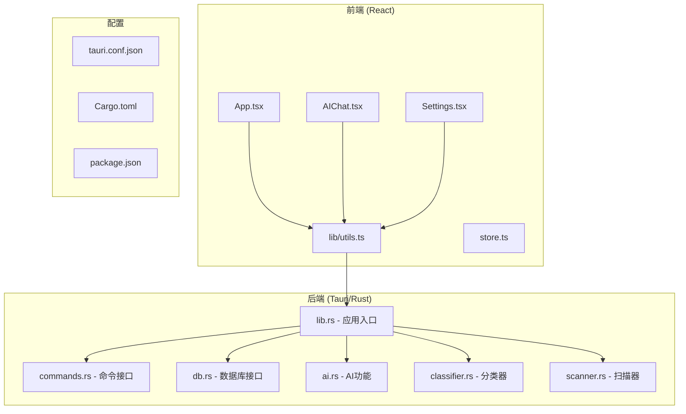
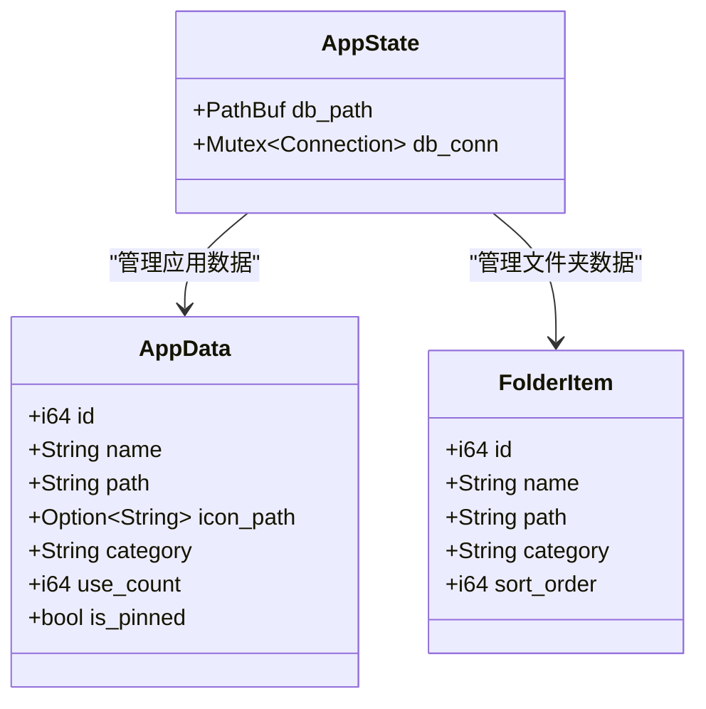
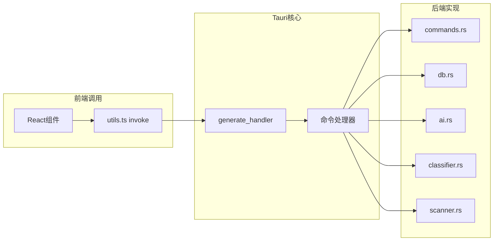
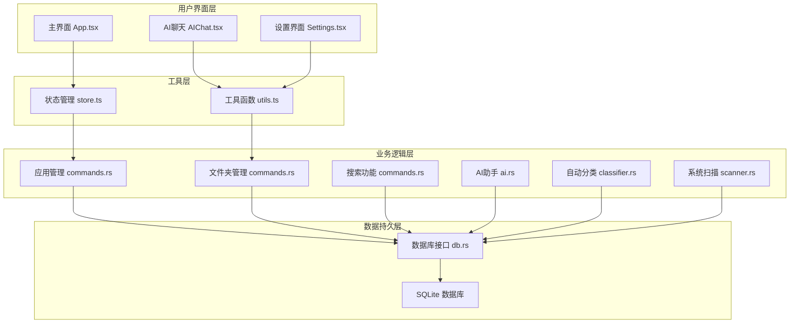
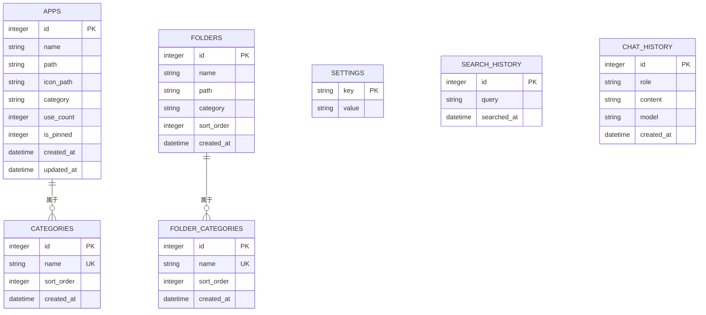
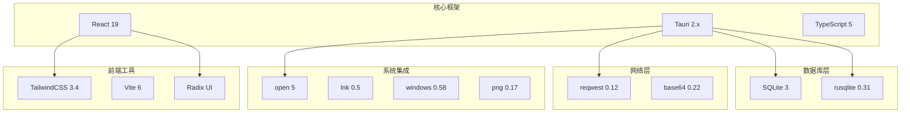
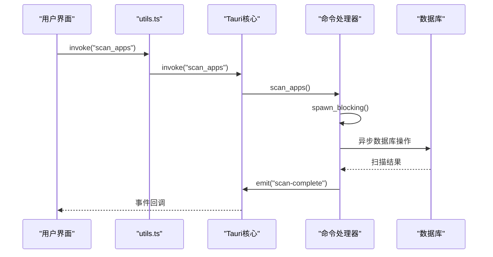
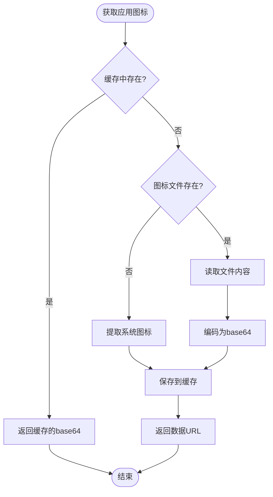

# API参考文档

<cite>
**本文档引用的文件**
- [src-tauri/src/lib.rs](file://src-tauri/src/lib.rs)
- [src-tauri/src/main.rs](file://src-tauri/src/main.rs)
- [src-tauri/src/commands.rs](file://src-tauri/src/commands.rs)
- [src-tauri/src/db.rs](file://src-tauri/src/db.rs)
- [src-tauri/src/ai.rs](file://src-tauri/src/ai.rs)
- [src-tauri/src/classifier.rs](file://src-tauri/src/classifier.rs)
- [src-tauri/src/scanner.rs](file://src-tauri/src/scanner.rs)
- [src-tauri/Cargo.toml](file://src-tauri/Cargo.toml)
- [src-tauri/tauri.conf.json](file://src-tauri/tauri.conf.json)
- [package.json](file://package.json)
- [src/App.tsx](file://src/App.tsx)
- [src/lib/utils.ts](file://src/lib/utils.ts)
- [src/store.ts](file://src/store.ts)
- [src/AIChat.tsx](file://src/AIChat.tsx)
- [src/Settings.tsx](file://src/Settings.tsx)
</cite>

## 目录
1. [简介](#简介)
2. [项目结构](#项目结构)
3. [核心组件](#核心组件)
4. [架构概览](#架构概览)
5. [详细组件分析](#详细组件分析)
6. [依赖关系分析](#依赖关系分析)
7. [性能考虑](#性能考虑)
8. [故障排除指南](#故障排除指南)
9. [结论](#结论)

## 简介

QuickStart 是一个基于 Tauri 2.x 和 React 的 Windows 桌面快捷启动器。该项目提供了应用启动、文件夹管理、AI 助手等功能，支持自动扫描系统中的应用程序并提供智能分类。

## 项目结构

项目采用典型的 Tauri + React 架构，分为前端和后端两个主要部分：

**图表来源**
- [src-tauri/src/lib.rs:1-135](file://src-tauri/src/lib.rs#L1-L135)
- [src-tauri/src/commands.rs:1-709](file://src-tauri/src/commands.rs#L1-L709)
- [src-tauri/src/db.rs:1-156](file://src-tauri/src/db.rs#L1-L156)

**章节来源**
- [src-tauri/src/lib.rs:1-135](file://src-tauri/src/lib.rs#L1-L135)
- [src-tauri/src/main.rs:1-7](file://src-tauri/src/main.rs#L1-L7)
- [src-tauri/tauri.conf.json:1-54](file://src-tauri/tauri.conf.json#L1-L54)

## 核心组件

### 应用状态管理

应用使用 AppState 结构体管理全局状态，包括数据库路径和连接：

**图表来源**
- [src-tauri/src/lib.rs:14-17](file://src-tauri/src/lib.rs#L14-L17)
- [src-tauri/src/commands.rs:11-29](file://src-tauri/src/commands.rs#L11-L29)

### 命令系统架构

Tauri 2.x 使用 generate_handler 宏注册所有命令接口：

**图表来源**
- [src-tauri/src/lib.rs:96-131](file://src-tauri/src/lib.rs#L96-L131)
- [src-tauri/src/commands.rs:1-709](file://src-tauri/src/commands.rs#L1-L709)

**章节来源**
- [src-tauri/src/lib.rs:14-135](file://src-tauri/src/lib.rs#L14-L135)
- [src-tauri/src/commands.rs:1-709](file://src-tauri/src/commands.rs#L1-L709)

## 架构概览

QuickStart 采用模块化的架构设计，各功能模块职责清晰：

**图表来源**
- [src/App.tsx:1-800](file://src/App.tsx#L1-L800)
- [src/AIChat.tsx:1-278](file://src/AIChat.tsx#L1-L278)
- [src/Settings.tsx:1-165](file://src/Settings.tsx#L1-L165)
- [src/store.ts:1-46](file://src/store.ts#L1-L46)
- [src/lib/utils.ts:1-25](file://src/lib/utils.ts#L1-L25)

## 详细组件分析

### 应用管理命令

应用管理功能提供了完整的 CRUD 操作和高级功能：

#### 基础应用操作

| 命令名称 | 参数 | 返回值 | 描述 |
|---------|------|--------|------|
| `get_app_list` | 无 | `Result<Vec<AppData>, String>` | 获取所有应用列表 |
| `add_app` | name: String, path: String, icon_path: Option<String>, category: Option<String> | `Result<AppData, String>` | 添加新应用 |
| `remove_app` | id: i64 | `Result<(), String>` | 删除应用 |
| `update_app_category` | id: i64, category: String | `Result<(), String>` | 更新应用分类 |
| `toggle_pin_app` | id: i64 | `Result<bool, String>` | 切换固定状态 |

#### 高级应用功能

| 命令名称 | 参数 | 返回值 | 描述 |
|---------|------|--------|------|
| `record_app_launch` | id: i64 | `Result<(), String>` | 记录应用使用次数 |
| `scan_apps` | 无 | `Result<ScanResult, String>` | 异步扫描系统应用 |
| `get_app_icon` | app_id: i64 | `Result<String, String>` | 获取应用图标（base64） |
| `refresh_app_icon` | id: i64 | `Result<Option<String>, String>` | 刷新应用图标缓存 |

**章节来源**
- [src-tauri/src/commands.rs:91-142](file://src-tauri/src/commands.rs#L91-L142)
- [src-tauri/src/commands.rs:144-228](file://src-tauri/src/commands.rs#L144-L228)
- [src-tauri/src/commands.rs:230-249](file://src-tauri/src/commands.rs#L230-L249)
- [src-tauri/src/commands.rs:325-373](file://src-tauri/src/commands.rs#L325-L373)
- [src-tauri/src/commands.rs:417-443](file://src-tauri/src/commands.rs#L417-L443)

### 文件夹管理命令

文件夹管理提供了类似的应用管理功能：

| 命令名称 | 参数 | 返回值 | 描述 |
|---------|------|--------|------|
| `get_folder_list` | 无 | `Result<Vec<FolderItem>, String>` | 获取文件夹列表 |
| `add_folder` | name: String, path: String, category: Option<String> | `Result<FolderItem, String>` | 添加文件夹 |
| `remove_folder` | id: i64 | `Result<(), String>` | 删除文件夹 |
| `get_folder_categories` | 无 | `Result<Vec<String>, String>` | 获取文件夹分类列表 |
| `add_folder_category` | name: String | `Result<String, String>` | 添加文件夹分类 |
| `update_folder_category` | id: i64, category: String | `Result<(), String>` | 更新文件夹分类 |

**章节来源**
- [src-tauri/src/commands.rs:251-274](file://src-tauri/src/commands.rs#L251-L274)
- [src-tauri/src/commands.rs:276-314](file://src-tauri/src/commands.rs#L276-L314)
- [src-tauri/src/commands.rs:608-625](file://src-tauri/src/commands.rs#L608-L625)
- [src-tauri/src/commands.rs:627-666](file://src-tauri/src/commands.rs#L627-L666)
- [src-tauri/src/commands.rs:668-708](file://src-tauri/src/commands.rs#L668-L708)

### 搜索和设置命令

| 命令名称 | 参数 | 返回值 | 描述 |
|---------|------|--------|------|
| `search_files` | query: String | `Result<Vec<FileResult>, String>` | 搜索用户文件 |
| `get_setting` | key: String | `Result<String, String>` | 获取设置值 |
| `set_setting` | key: String, value: String | `Result<(), String>` | 设置值 |
| `get_db_path` | 无 | `Result<String, String>` | 获取数据库路径 |
| `check_update` | 无 | `Result<String, String>` | 检查GitHub版本 |
| `launch_app` | path: String | `Result<(), String>` | 启动应用/文件 |
| `reveal_in_explorer` | path: String | `Result<(), String>` | 在资源管理器中显示 |

**章节来源**
- [src-tauri/src/commands.rs:445-488](file://src-tauri/src/commands.rs#L445-L488)
- [src-tauri/src/commands.rs:398-415](file://src-tauri/src/commands.rs#L398-L415)
- [src-tauri/src/commands.rs:490-505](file://src-tauri/src/commands.rs#L490-L505)
- [src-tauri/src/commands.rs:507-525](file://src-tauri/src/commands.rs#L507-L525)
- [src-tauri/src/commands.rs:514-525](file://src-tauri/src/commands.rs#L514-L525)

### AI助手功能

AI助手提供了多种AI提供商的支持和工具调用：

#### AI聊天流式接口

| 命令名称 | 参数 | 返回值 | 描述 |
|---------|------|--------|------|
| `ai_chat_stream` | messages: Vec<ChatMessage>, provider: String, model: String, base_url: String, api_key: String | `Result<(), String>` | 流式AI聊天 |

#### AI工具函数

| 命令名称 | 参数 | 返回值 | 描述 |
|---------|------|--------|------|
| `list_directory` | app_handle: AppHandle, path: String | `Result<Vec<DirEntry>, String>` | 列出目录内容 |
| `ai_get_apps` | app_handle: AppHandle | `Result<Vec<AppData>, String>` | 获取应用列表 |
| `ai_classify_apps` | _app_handle: AppHandle, state: State<AppState> | `Result<usize, String>` | AI自动分类应用 |
| `organize_folder` | app_handle: AppHandle, source: String, target_dir: String | `Result<String, String>` | 安全整理文件夹 |

**章节来源**
- [src-tauri/src/ai.rs:59-254](file://src-tauri/src/ai.rs#L59-L254)
- [src-tauri/src/ai.rs:256-319](file://src-tauri/src/ai.rs#L256-L319)
- [src-tauri/src/ai.rs:321-352](file://src-tauri/src/ai.rs#L321-L352)
- [src-tauri/src/ai.rs:369-460](file://src-tauri/src/ai.rs#L369-L460)
- [src-tauri/src/ai.rs:462-500](file://src-tauri/src/ai.rs#L462-L500)

### 数据库接口

数据库接口提供了完整的数据持久化功能：

**图表来源**
- [src-tauri/src/db.rs:51-130](file://src-tauri/src/db.rs#L51-L130)

**章节来源**
- [src-tauri/src/db.rs:6-156](file://src-tauri/src/db.rs#L6-L156)

### 搜索历史管理

| 命令名称 | 参数 | 返回值 | 描述 |
|---------|------|--------|------|
| `record_search` | query: String | `Result<(), String>` | 记录搜索历史 |
| `get_search_history` | 无 | `Result<Vec<String>, String>` | 获取搜索历史 |
| `clear_search_history` | 无 | `Result<(), String>` | 清空搜索历史 |

**章节来源**
- [src-tauri/src/commands.rs:565-606](file://src-tauri/src/commands.rs#L565-L606)

## 依赖关系分析

项目使用现代化的技术栈，各依赖项职责明确：

**图表来源**
- [src-tauri/Cargo.toml:15-36](file://src-tauri/Cargo.toml#L15-L36)
- [package.json:14-50](file://package.json#L14-L50)

**章节来源**
- [src-tauri/Cargo.toml:1-36](file://src-tauri/Cargo.toml#L1-L36)
- [package.json:1-50](file://package.json#L1-L50)

## 性能考虑

### 异步处理模式

项目广泛使用异步编程模式来避免阻塞UI：

**图表来源**
- [src-tauri/src/commands.rs:230-249](file://src-tauri/src/commands.rs#L230-L249)
- [src/App.tsx:393-409](file://src/App.tsx#L393-L409)

### 图标缓存策略

应用实现了智能的图标缓存机制：

**图表来源**
- [src-tauri/src/commands.rs:325-373](file://src-tauri/src/commands.rs#L325-L373)

## 故障排除指南

### 常见错误处理

| 错误类型 | 原因 | 解决方案 |
|---------|------|----------|
| 数据库连接失败 | SQLite连接异常 | 检查数据库文件权限和路径 |
| 图标提取失败 | 系统图标API调用失败 | 验证应用路径和权限 |
| AI请求失败 | 网络连接或API密钥问题 | 检查网络连接和API配置 |
| 扫描失败 | 系统权限不足 | 以管理员权限运行或调整权限设置 |

### 调试建议

1. **启用详细日志**：在开发模式下查看控制台输出
2. **检查事件监听**：确认事件订阅和取消订阅正确执行
3. **验证参数类型**：确保传入参数符合预期类型
4. **监控内存使用**：注意大量图标加载时的内存占用

**章节来源**
- [src-tauri/src/commands.rs:325-373](file://src-tauri/src/commands.rs#L325-L373)
- [src-tauri/src/ai.rs:68-130](file://src-tauri/src/ai.rs#L68-L130)

## 结论

QuickStart 项目展现了现代桌面应用开发的最佳实践，通过 Tauri 和 React 的结合实现了高性能、跨平台的用户体验。项目具有以下特点：

1. **模块化设计**：清晰的功能分离和职责划分
2. **异步架构**：避免UI阻塞，提升用户体验
3. **类型安全**：完整的TypeScript类型定义
4. **可扩展性**：插件化架构便于功能扩展
5. **性能优化**：智能缓存和异步处理机制

开发者可以基于此项目结构快速扩展新的功能，同时保持代码的可维护性和性能表现。