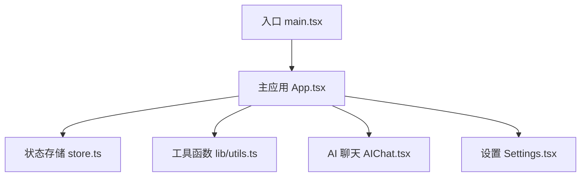
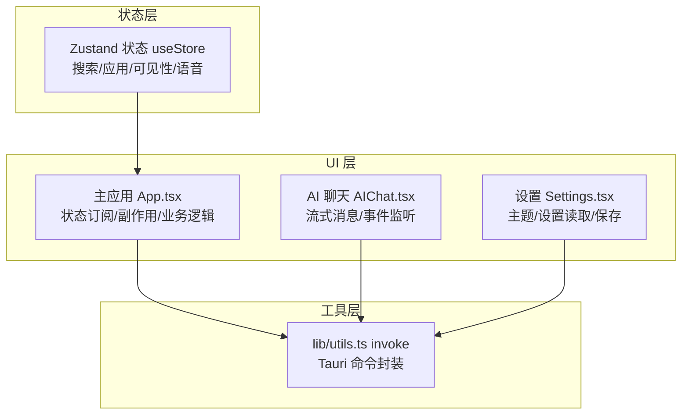
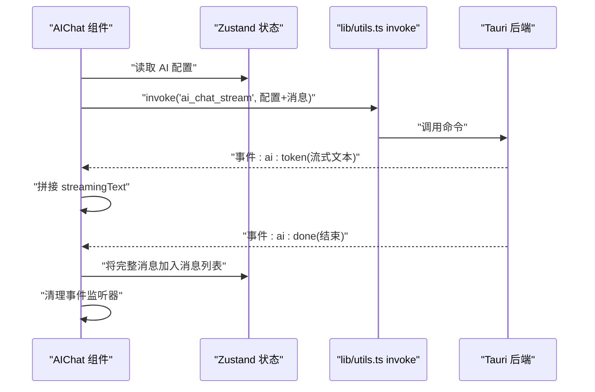
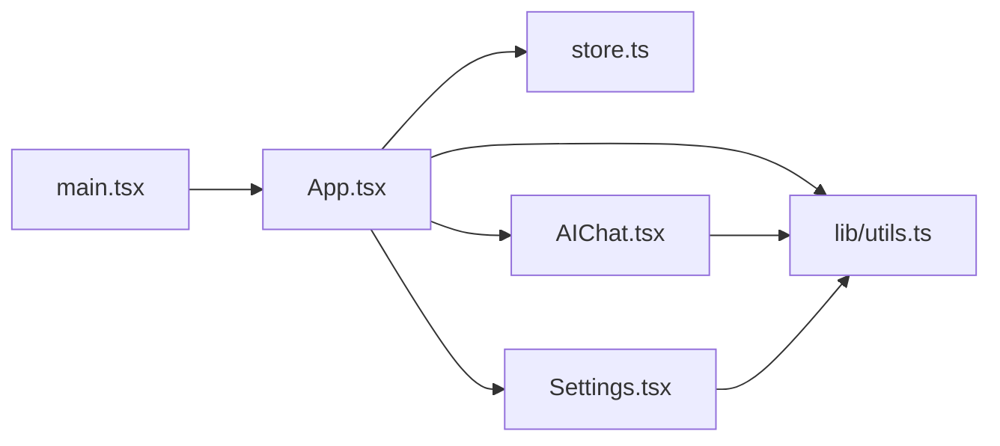

# Hook函数接口

<cite>
**本文引用的文件**
- [src/App.tsx](file://src/App.tsx)
- [src/store.ts](file://src/store.ts)
- [src/lib/utils.ts](file://src/lib/utils.ts)
- [src/main.tsx](file://src/main.tsx)
- [src/AIChat.tsx](file://src/AIChat.tsx)
- [src/Settings.tsx](file://src/Settings.tsx)
</cite>

## 目录
1. [简介](#简介)
2. [项目结构](#项目结构)
3. [核心组件与状态管理模式](#核心组件与状态管理模式)
4. [架构总览](#架构总览)
5. [详细组件分析](#详细组件分析)
6. [依赖关系分析](#依赖关系分析)
7. [性能考量](#性能考量)
8. [故障排查指南](#故障排查指南)
9. [结论](#结论)
10. [附录](#附录)

## 简介
本文件聚焦于 QuickStart 前端的“自定义 Hook”使用与实现模式，系统梳理状态管理、副作用处理、数据获取与业务逻辑相关的 Hook 使用方式与最佳实践。由于项目采用 React + Zustand 的组合，且大量通过 Tauri invoke 进行后端交互，本文将围绕以下方面展开：
- 状态管理 Hook：基于 Zustand 的 useStore
- 副作用 Hook：useEffect 的典型用法与事件监听清理
- 数据获取 Hook：封装 invoke 的数据加载与缓存策略
- 业务逻辑 Hook：搜索过滤、计算表达式、拖拽分类等
- 性能优化与内存管理：防抖、取消、清理、ref 使用
- 类型定义与使用示例路径、注意事项与错误边界处理

## 项目结构
QuickStart 前端主要由入口、主应用、状态存储、工具函数与若干功能组件构成。Hook 的使用集中在主应用与功能组件中，通过 React 内置 Hook 与第三方状态库协同工作。

图表来源
- [src/main.tsx:1-11](file://src/main.tsx#L1-L11)
- [src/App.tsx:274-800](file://src/App.tsx#L274-L800)
- [src/store.ts:1-46](file://src/store.ts#L1-L46)
- [src/lib/utils.ts:1-25](file://src/lib/utils.ts#L1-L25)
- [src/AIChat.tsx:1-279](file://src/AIChat.tsx#L1-L279)
- [src/Settings.tsx:1-165](file://src/Settings.tsx#L1-L165)

章节来源
- [src/main.tsx:1-11](file://src/main.tsx#L1-L11)
- [src/App.tsx:274-800](file://src/App.tsx#L274-L800)
- [src/store.ts:1-46](file://src/store.ts#L1-L46)
- [src/lib/utils.ts:1-25](file://src/lib/utils.ts#L1-L25)
- [src/AIChat.tsx:1-279](file://src/AIChat.tsx#L1-L279)
- [src/Settings.tsx:1-165](file://src/Settings.tsx#L1-L165)

## 核心组件与状态管理模式
- 状态存储：使用 Zustand 创建全局状态 useStore，包含搜索查询、应用列表、窗口可见性、语音输入状态等字段及其 setter。
- 数据获取：通过封装的 invoke 函数统一调用 Tauri 后端命令，集中处理错误与返回值。
- 副作用：大量使用 useEffect 进行初始化、事件监听、清理与跨组件同步。
- 业务逻辑：搜索过滤、计算表达式、拖拽分类、图标缓存、文件夹与分类管理等。

章节来源
- [src/store.ts:13-45](file://src/store.ts#L13-L45)
- [src/lib/utils.ts:11-17](file://src/lib/utils.ts#L11-L17)
- [src/App.tsx:314-425](file://src/App.tsx#L314-L425)

## 架构总览
下图展示主应用与各模块之间的交互关系，重点体现 Hook 的使用位置与职责划分。

图表来源
- [src/store.ts:32-45](file://src/store.ts#L32-L45)
- [src/App.tsx:274-800](file://src/App.tsx#L274-L800)
- [src/AIChat.tsx:14-279](file://src/AIChat.tsx#L14-L279)
- [src/Settings.tsx:14-165](file://src/Settings.tsx#L14-L165)
- [src/lib/utils.ts:11-17](file://src/lib/utils.ts#L11-L17)

## 详细组件分析

### 状态管理 Hook：useStore
- 角色：全局状态容器，提供搜索查询、应用列表、窗口可见性、语音输入状态及对应 setter。
- 类型定义：AppItem 接口与 QuickStartState 接口定义了状态字段与方法签名。
- 使用场景：
  - 主应用订阅搜索查询与应用列表，驱动 UI 更新与业务逻辑。
  - 设置组件读取与保存设置项，影响主题与行为。
  - AI 聊天组件读取 AI 配置，参与消息发送。
- 依赖关系：被 App.tsx、Settings.tsx、AIChat.tsx 多处订阅；内部依赖 Zustand。
- 性能与内存：状态粒度合理，setter 为原子更新；注意避免不必要的重渲染可通过拆分状态或使用 selector。

章节来源
- [src/store.ts:3-11](file://src/store.ts#L3-L11)
- [src/store.ts:13-30](file://src/store.ts#L13-L30)
- [src/store.ts:32-45](file://src/store.ts#L32-L45)
- [src/App.tsx:275-276](file://src/App.tsx#L275-L276)
- [src/Settings.tsx:14-27](file://src/Settings.tsx#L14-L27)
- [src/AIChat.tsx:14-60](file://src/AIChat.tsx#L14-L60)

### 副作用 Hook：useEffect 的典型用法
- 初始化与懒加载：
  - 主应用在挂载时加载应用、文件夹、分类与搜索历史，并根据时间戳决定是否触发扫描。
  - 设置组件在挂载时批量读取设置项，并监听系统主题变化。
  - AI 聊天组件在挂载时读取 AI 配置并滚动消息到底部。
- 事件监听与清理：
  - 主应用监听“扫描完成”事件，统一处理后续刷新与提示。
  - AI 聊天组件动态监听“ai:token”和“ai:done”事件，使用 ref 存储清理函数并在卸载时统一清理。
- 取消与防抖：
  - 文件搜索在输入变更后延迟 200ms 触发，使用 cancel 标志避免竞态。
- 状态同步与副作用：
  - 根据搜索查询与视图状态，动态计算显示项并滚动到选中项。
  - 主题初始化根据系统偏好添加/移除 dark 类。

章节来源
- [src/App.tsx:356-410](file://src/App.tsx#L356-L410)
- [src/App.tsx:412-425](file://src/App.tsx#L412-L425)
- [src/App.tsx:534-544](file://src/App.tsx#L534-L544)
- [src/Settings.tsx:19-40](file://src/Settings.tsx#L19-L40)
- [src/AIChat.tsx:40-81](file://src/AIChat.tsx#L40-L81)
- [src/AIChat.tsx:96-110](file://src/AIChat.tsx#L96-L110)
- [src/AIChat.tsx:163-170](file://src/AIChat.tsx#L163-L170)

### 数据获取 Hook：invoke 封装与缓存
- 封装 invoke：
  - lib/utils.ts 提供通用 invoke 函数，统一调用 @tauri-apps/api/core.invoke，支持泛型返回类型。
  - 提供 getDbPath 辅助函数用于数据库路径获取。
- 主应用数据加载：
  - loadApps、loadFolders、loadCategories、loadFolderCategories 等回调函数封装 invoke 调用，集中处理异常。
  - doScan 触发后台扫描，等待事件完成后再刷新数据并重置扫描状态。
  - 图标加载：loadIcon 对应用图标进行缓存，避免重复请求；在可见应用列表变化时串行加载。
- AI 聊天数据流：
  - sendMessage 中动态监听“ai:token”和“ai:done”，将流式文本拼接后一次性加入消息列表。
  - 使用 cleanupListeners 在每次发送前清理旧监听器，防止泄漏。

章节来源
- [src/lib/utils.ts:11-24](file://src/lib/utils.ts#L11-L24)
- [src/App.tsx:314-353](file://src/App.tsx#L314-L353)
- [src/App.tsx:667-696](file://src/App.tsx#L667-L696)
- [src/AIChat.tsx:83-161](file://src/AIChat.tsx#L83-L161)
- [src/AIChat.tsx:70-81](file://src/AIChat.tsx#L70-L81)

### 业务逻辑 Hook：搜索、计算、拖拽、分类
- 搜索与高亮：
  - tokenize 将字符串按驼峰与分隔符切分为词元；highlight 基于直接子串、词元前缀、缩写映射合并区间后高亮。
  - matchSearch 实现多维度匹配（名称、路径、分类），支持缩写反向匹配。
  - searchedApps/searchedFolders/displayItems 基于搜索查询与视图状态计算最终展示列表。
- 计算器：
  - safeEval 解析四则运算、百分比、括号与运算符优先级，返回数值或空。
  - isCalcQuery 识别纯数学表达式，配合 useEffect 实时计算并显示结果。
- 拖拽分类：
  - HTML5 原生拖拽 onDragStart/onDragOver/onDrop/onDragEnd，将应用分类更新至后端并刷新数据。
- 分类与文件夹管理：
  - 新增/删除分类、新增/删除文件夹、更新文件夹分类，均通过 invoke 完成并刷新缓存。
- 键盘导航与窗口控制：
  - handleKeyDown 支持上下左右移动选中项、回车打开、Esc 关闭或清空搜索。
  - hideWindow/minimizeWindow/toggleMaximize 控制窗口状态。

章节来源
- [src/App.tsx:23-30](file://src/App.tsx#L23-L30)
- [src/App.tsx:72-130](file://src/App.tsx#L72-L130)
- [src/App.tsx:436-482](file://src/App.tsx#L436-L482)
- [src/App.tsx:484-515](file://src/App.tsx#L484-L515)
- [src/App.tsx:132-247](file://src/App.tsx#L132-L247)
- [src/App.tsx:549-579](file://src/App.tsx#L549-L579)
- [src/App.tsx:644-656](file://src/App.tsx#L644-L656)
- [src/App.tsx:618-642](file://src/App.tsx#L618-L642)
- [src/App.tsx:712-734](file://src/App.tsx#L712-L734)
- [src/App.tsx:736-749](file://src/App.tsx#L736-L749)

### Hook 使用序列图：AI 聊天消息发送流程

图表来源
- [src/AIChat.tsx:83-161](file://src/AIChat.tsx#L83-L161)
- [src/lib/utils.ts:11-17](file://src/lib/utils.ts#L11-L17)

## 依赖关系分析
- 组件依赖：
  - App.tsx 依赖 store.ts 与 lib/utils.ts，同时被 main.tsx 渲染。
  - AIChat.tsx 依赖 lib/utils.ts 并读取 store 中的 AI 配置。
  - Settings.tsx 依赖 lib/utils.ts 读取/保存设置。
- 状态依赖：
  - useStore 被多个组件订阅，形成跨组件状态共享。
- 外部依赖：
  - @tauri-apps/api 用于 invoke 与事件监听。
  - @tauri-apps/plugin-dialog 用于文件选择对话框。
  - Zustand 用于状态管理。

图表来源
- [src/main.tsx:6-10](file://src/main.tsx#L6-L10)
- [src/App.tsx:274-800](file://src/App.tsx#L274-L800)
- [src/store.ts:32-45](file://src/store.ts#L32-L45)
- [src/lib/utils.ts:11-17](file://src/lib/utils.ts#L11-L17)
- [src/AIChat.tsx:14-279](file://src/AIChat.tsx#L14-L279)
- [src/Settings.tsx:14-165](file://src/Settings.tsx#L14-L165)

章节来源
- [src/main.tsx:1-11](file://src/main.tsx#L1-L11)
- [src/App.tsx:274-800](file://src/App.tsx#L274-L800)
- [src/store.ts:1-46](file://src/store.ts#L1-L46)
- [src/lib/utils.ts:1-25](file://src/lib/utils.ts#L1-L25)
- [src/AIChat.tsx:1-279](file://src/AIChat.tsx#L1-L279)
- [src/Settings.tsx:1-165](file://src/Settings.tsx#L1-L165)

## 性能考量
- 避免重复渲染：
  - 使用 useMemo 缓存派生数据（如分类列表、过滤后的应用、显示项）。
  - 使用 useCallback 包装回调函数，减少子组件重渲染。
- 异步与竞态控制：
  - 文件搜索使用定时器与取消标志，避免快速输入导致的竞态。
  - AI 聊天在每次发送前清理旧监听器，防止事件累积。
- 资源释放：
  - useEffect 返回清理函数，统一移除事件监听器与定时器。
  - 语音识别在停止时显式停止并解绑回调。
- 图标加载优化：
  - 图标缓存避免重复请求；串行加载可见应用图标，降低并发压力。
- 事件监听清理：
  - AIChat 使用 ref 存储清理函数数组，在卸载时统一清理。

章节来源
- [src/App.tsx:428-433](file://src/App.tsx#L428-L433)
- [src/App.tsx:484-490](file://src/App.tsx#L484-L490)
- [src/App.tsx:499-503](file://src/App.tsx#L499-L503)
- [src/App.tsx:412-424](file://src/App.tsx#L412-L424)
- [src/App.tsx:667-696](file://src/App.tsx#L667-L696)
- [src/AIChat.tsx:70-81](file://src/AIChat.tsx#L70-L81)
- [src/AIChat.tsx:171-191](file://src/AIChat.tsx#L171-L191)

## 故障排查指南
- Tauri 命令调用失败：
  - invoke 返回 Promise，需在调用处捕获异常并降级处理（如设置空列表、显示提示）。
  - AI 聊天在错误时清理监听器，避免“ai:done”未触发导致的泄漏。
- 事件监听未清理：
  - 确保每次重新监听前清理旧监听器；卸载时统一清理。
- 语音识别不可用：
  - 检查浏览器兼容性与权限；在停止时显式停止识别并解绑回调。
- 主题切换无效：
  - 设置组件保存后需根据选择应用相应类名；系统主题需监听媒体查询变化。
- 图标加载失败：
  - 使用失败标记避免重复尝试；必要时提供占位符或默认图标。

章节来源
- [src/App.tsx:315-317](file://src/App.tsx#L315-L317)
- [src/App.tsx:327-334](file://src/App.tsx#L327-L334)
- [src/App.tsx:335-342](file://src/App.tsx#L335-L342)
- [src/App.tsx:667-677](file://src/App.tsx#L667-L677)
- [src/AIChat.tsx:153-161](file://src/AIChat.tsx#L153-L161)
- [src/AIChat.tsx:70-81](file://src/AIChat.tsx#L70-L81)
- [src/Settings.tsx:44-60](file://src/Settings.tsx#L44-L60)

## 结论
QuickStart 的 Hook 使用以“状态订阅 + 副作用 + 数据封装 + 业务逻辑”为主线，结合 Zustand 与 React 内置 Hook 实现高效、可维护的状态与交互。通过统一的 invoke 封装、严格的事件监听清理与合理的缓存策略，系统在复杂业务场景下仍保持良好的性能与稳定性。建议在扩展新功能时遵循现有模式：集中封装数据访问、明确副作用边界、及时清理资源、合理使用缓存与防抖。

## 附录

### TypeScript 类型定义与使用示例路径
- 状态类型与 Hook
  - AppItem 接口与 QuickStartState 接口定义见 [src/store.ts:3-30](file://src/store.ts#L3-L30)
  - useStore 导出与使用见 [src/store.ts:32-45](file://src/store.ts#L32-L45)
  - 主应用订阅与使用见 [src/App.tsx:275-276](file://src/App.tsx#L275-L276)
- 工具函数类型
  - invoke 泛型定义与返回类型见 [src/lib/utils.ts:11-17](file://src/lib/utils.ts#L11-L17)
  - getDbPath 返回类型见 [src/lib/utils.ts:22-24](file://src/lib/utils.ts#L22-L24)
- AI 聊天类型
  - Message 接口与组件 props 见 [src/AIChat.tsx:5-12](file://src/AIChat.tsx#L5-L12)
  - 配置类型见 [src/AIChat.tsx:28-38](file://src/AIChat.tsx#L28-L38)
- 设置类型
  - KEYS 与 SettingKey 类型见 [src/Settings.tsx:7-12](file://src/Settings.tsx#L7-L12)
  - 设置读取与保存见 [src/Settings.tsx:19-60](file://src/Settings.tsx#L19-L60)

### 使用示例路径
- 初始化加载与扫描
  - [src/App.tsx:374-391](file://src/App.tsx#L374-L391)
  - [src/App.tsx:393-409](file://src/App.tsx#L393-L409)
- 文件搜索与防抖
  - [src/App.tsx:412-424](file://src/App.tsx#L412-L424)
- 图标缓存与加载
  - [src/App.tsx:667-677](file://src/App.tsx#L667-L677)
  - [src/App.tsx:679-696](file://src/App.tsx#L679-L696)
- AI 聊天消息流
  - [src/AIChat.tsx:83-161](file://src/AIChat.tsx#L83-L161)
- 设置主题与保存
  - [src/Settings.tsx:19-60](file://src/Settings.tsx#L19-L60)