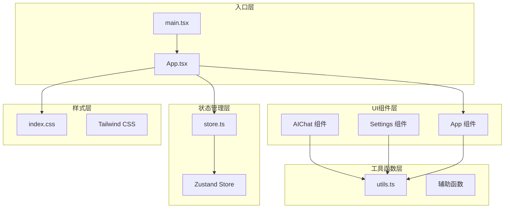
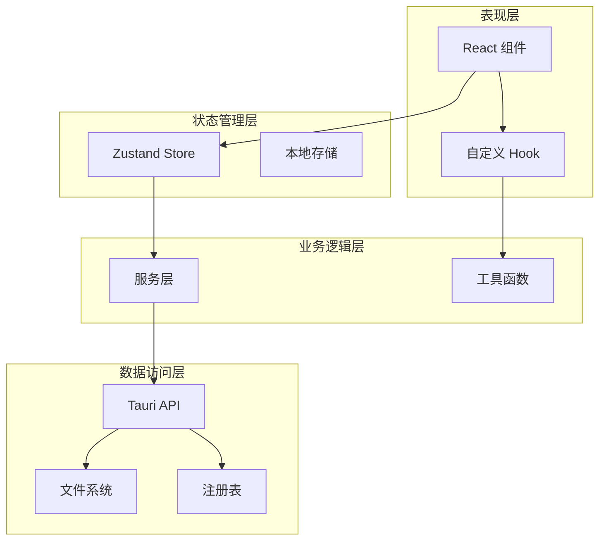
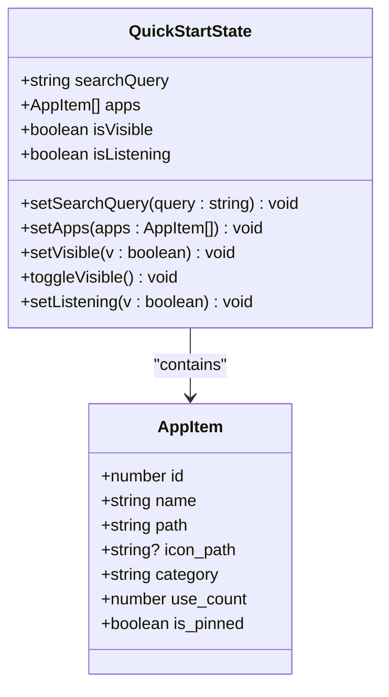
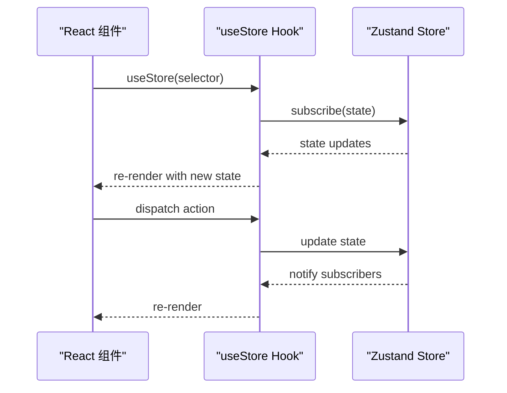
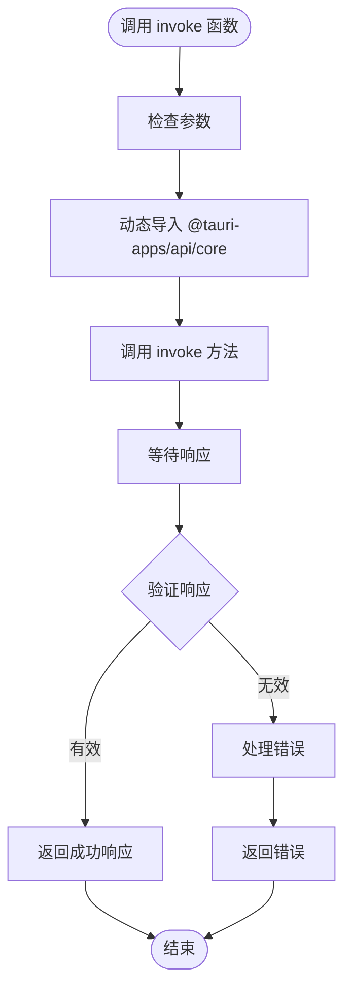
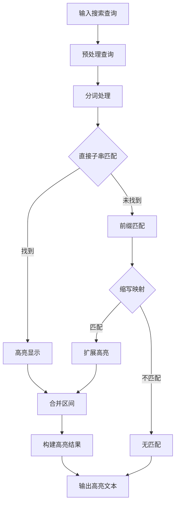
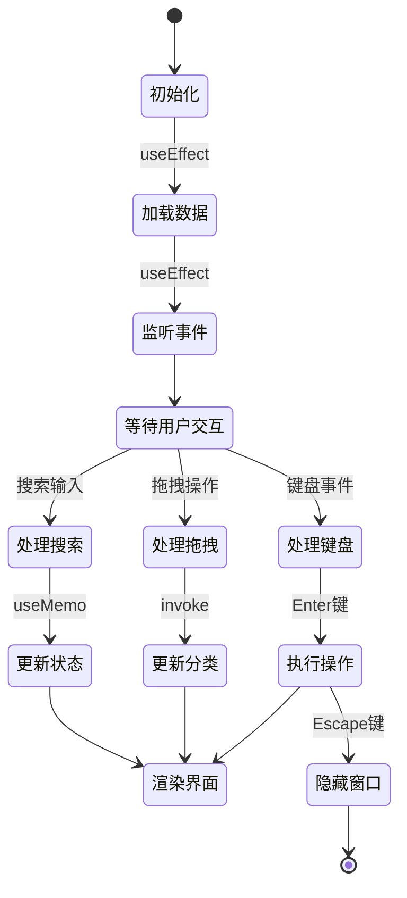
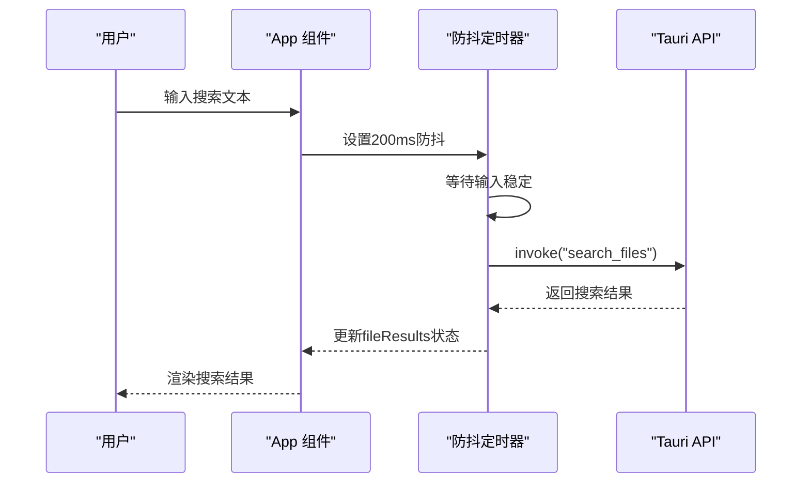
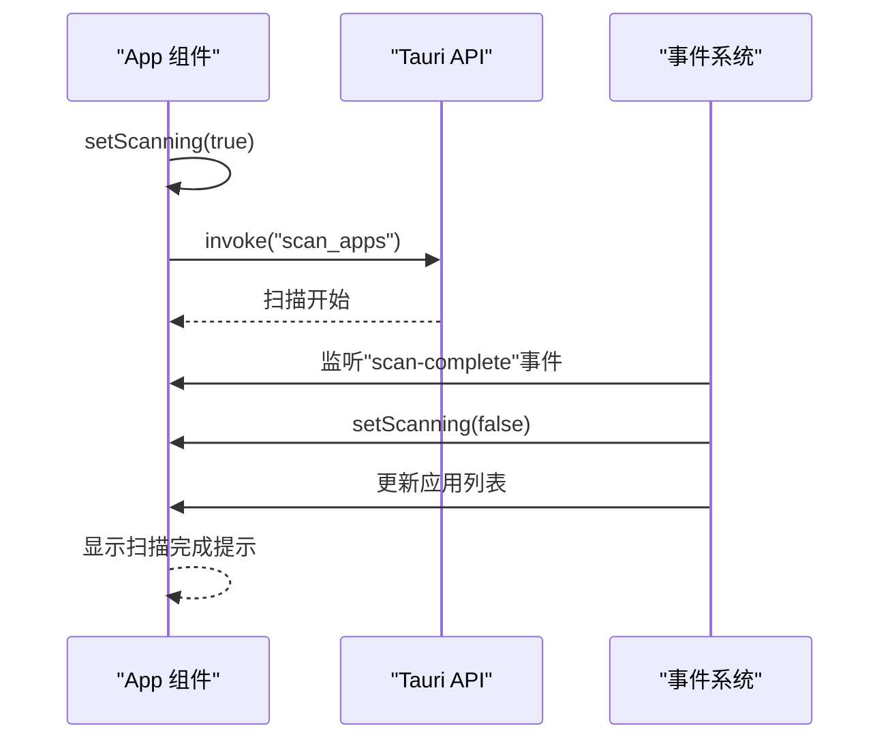
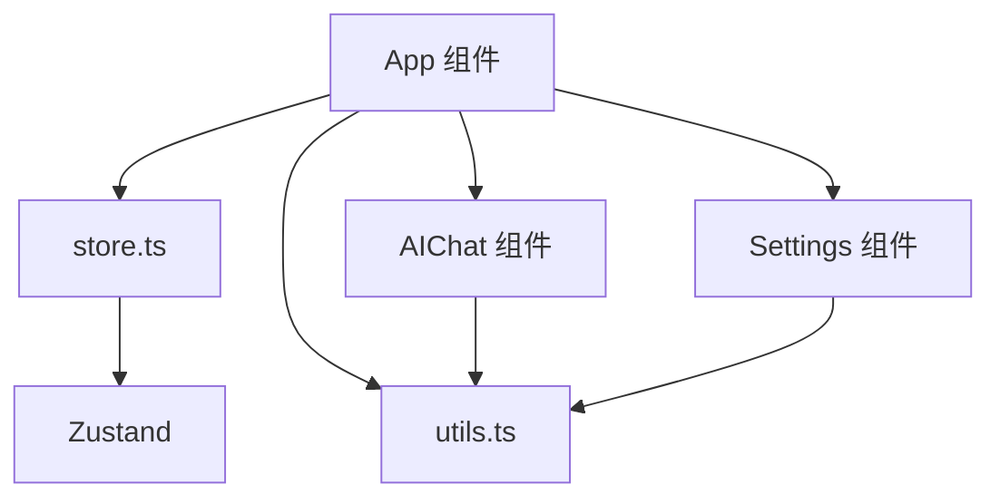

# 前端API接口

<cite>
**本文档引用的文件**
- [App.tsx](file://src/App.tsx)
- [AIChat.tsx](file://src/AIChat.tsx)
- [Settings.tsx](file://src/Settings.tsx)
- [store.ts](file://src/store.ts)
- [utils.ts](file://src/lib/utils.ts)
- [main.tsx](file://src/main.tsx)
- [index.css](file://src/index.css)
- [package.json](file://package.json)
- [tsconfig.json](file://tsconfig.json)
</cite>

## 目录
1. [简介](#简介)
2. [项目结构](#项目结构)
3. [核心组件](#核心组件)
4. [架构概览](#架构概览)
5. [详细组件分析](#详细组件分析)
6. [依赖关系分析](#依赖关系分析)
7. [性能考虑](#性能考虑)
8. [故障排除指南](#故障排除指南)
9. [结论](#结论)

## 简介

QuickStart是一个基于React和Tauri构建的Windows应用启动器，提供了智能应用搜索、文件夹管理和AI助手功能。该前端API接口文档详细记录了所有React组件、Hook函数、工具函数和状态管理接口，涵盖了组件属性、事件处理、状态更新机制和异步操作模式。

## 项目结构

项目采用模块化的React架构，主要包含以下核心模块：



**图表来源**
- [main.tsx:1-11](file://src/main.tsx#L1-L11)
- [App.tsx:1-800](file://src/App.tsx#L1-L800)
- [store.ts:1-46](file://src/store.ts#L1-L46)

**章节来源**
- [main.tsx:1-11](file://src/main.tsx#L1-L11)
- [package.json:1-50](file://package.json#L1-L50)
- [tsconfig.json:1-25](file://tsconfig.json#L1-L25)

## 核心组件

### 应用主组件 (App)

App组件是整个应用的核心容器，负责管理应用状态、处理用户交互和协调各个子组件。

#### 主要属性和状态

| 属性名 | 类型 | 描述 | 默认值 |
|--------|------|------|--------|
| searchQuery | string | 搜索查询文本 | "" |
| apps | AppItem[] | 应用列表 | [] |
| isListening | boolean | 语音识别状态 | false |
| view | "search" \| "panel" \| "folders" | 当前视图模式 | "search" |
| selectedIndex | number | 当前选中应用索引 | 0 |
| scanning | boolean | 扫描状态 | false |
| cm | object \| null | 应用上下文菜单状态 | null |
| calcResult | string \| null | 计算器结果 | null |
| showCalc | boolean | 显示计算器 | false |

#### 关键方法

- `launchApp(app: AppItem)`: 启动指定应用
- `openFolder(path: string)`: 打开文件夹
- `openFile(path: string)`: 打开文件
- `loadApps()`: 加载应用列表
- `doScan()`: 执行应用扫描
- `matchSearch()`: 搜索匹配算法

**章节来源**
- [App.tsx:274-780](file://src/App.tsx#L274-L780)
- [store.ts:13-30](file://src/store.ts#L13-L30)

### AI聊天组件 (AIChat)

AIChat组件提供了一个集成的AI助手界面，支持语音输入和流式响应。

#### 组件属性

| 属性名 | 类型 | 必需 | 描述 |
|--------|------|------|------|
| onClose | () => void | 是 | 关闭对话框的回调函数 |

#### 内部状态

| 状态名 | 类型 | 描述 |
|--------|------|------|
| messages | Message[] | 聊天消息数组 |
| input | string | 用户输入文本 |
| loading | boolean | 加载状态 |
| listening | boolean | 语音识别状态 |
| streamingText | string | 流式响应文本 |

#### 消息接口

```typescript
interface Message {
  role: "user" | "assistant" | "system";
  content: string;
}
```

**章节来源**
- [AIChat.tsx:10-278](file://src/AIChat.tsx#L10-L278)

### 设置组件 (Settings)

Settings组件提供应用配置界面，支持多种设置选项的管理。

#### 组件属性

| 属性名 | 类型 | 必需 | 描述 |
|--------|------|------|------|
| onClose | () => void | 是 | 关闭设置界面的回调函数 |

#### 支持的设置键

| 键名 | 类型 | 默认值 | 描述 |
|------|------|--------|------|
| ai_provider | string | "openai" | AI提供商 |
| ai_api_key | string | "" | API密钥 |
| ai_base_url | string | "" | 基础URL |
| ai_model | string | "gpt-4o-mini" | 模型名称 |
| auto_start | string | "true" | 开机自启 |
| auto_classify | string | "true" | 自动分类 |
| theme | string | "system" | 主题设置 |

**章节来源**
- [Settings.tsx:7-165](file://src/Settings.tsx#L7-L165)

## 架构概览

QuickStart采用分层架构设计，各层职责明确：



**图表来源**
- [App.tsx:1-800](file://src/App.tsx#L1-L800)
- [store.ts:1-46](file://src/store.ts#L1-L46)
- [utils.ts:1-25](file://src/lib/utils.ts#L1-L25)

## 详细组件分析

### 状态管理接口

#### Zustand Store 接口



**图表来源**
- [store.ts:3-30](file://src/store.ts#L3-L30)

#### Store Hook 使用模式



**图表来源**
- [store.ts:32-46](file://src/store.ts#L32-L46)

**章节来源**
- [store.ts:1-46](file://src/store.ts#L1-L46)

### 工具函数接口

#### 通用调用函数



**图表来源**
- [utils.ts:11-17](file://src/lib/utils.ts#L11-L17)

#### 搜索算法实现



**图表来源**
- [App.tsx:72-130](file://src/App.tsx#L72-L130)

**章节来源**
- [utils.ts:1-25](file://src/lib/utils.ts#L1-25)
- [App.tsx:21-30](file://src/App.tsx#L21-L30)

### 组件生命周期

#### App 组件生命周期



**图表来源**
- [App.tsx:355-425](file://src/App.tsx#L355-L425)

**章节来源**
- [App.tsx:355-425](file://src/App.tsx#L355-L425)

### 异步操作模式

#### 文件搜索异步模式



**图表来源**
- [App.tsx:412-424](file://src/App.tsx#L412-L424)

#### 扫描操作异步模式



**图表来源**
- [App.tsx:343-409](file://src/App.tsx#L343-L409)

**章节来源**
- [App.tsx:343-409](file://src/App.tsx#L343-L409)

## 依赖关系分析

### 核心依赖关系

```mermaid
graph LR
subgraph "React 生态"
React[react@^19.0.0]
ReactDOM[react-dom@^19.0.0]
Lucide[lucide-react@^0.400.0]
end
subgraph "状态管理"
Zustand[zustand@^5.0.0]
end
subgraph "Tauri 插件"
TauriAPI[@tauri-apps/api@^2.0.0]
Dialog[@tauri-apps/plugin-dialog@^2.0.0]
Shell[@tauri-apps/plugin-shell@^2.0.0]
end
subgraph "样式框架"
Tailwind[tailwindcss@^3.4.0]
TailwindMerge[tailwind-merge@^2.5.0]
clsx[clsx@^2.1.0]
end
App --> React
App --> Zustand
App --> TauriAPI
App --> Lucide
AIChat --> React
Settings --> React
Settings --> TauriAPI
Utils --> TauriAPI
```

**图表来源**
- [package.json:14-32](file://package.json#L14-L32)

### 组件间依赖



**图表来源**
- [App.tsx:1-10](file://src/App.tsx#L1-L10)
- [store.ts:1-2](file://src/store.ts#L1-L2)

**章节来源**
- [package.json:14-32](file://package.json#L14-L32)

## 性能考虑

### 优化策略

1. **虚拟化渲染**: 对于大量应用列表，考虑实现虚拟化渲染以提高性能
2. **状态缓存**: 使用useMemo和useCallback避免不必要的重新渲染
3. **图标懒加载**: 实现图标按需加载，避免同时加载所有应用图标
4. **防抖搜索**: 对搜索输入进行防抖处理，减少API调用频率
5. **事件监听清理**: 确保组件卸载时清理所有事件监听器

### 性能监控建议

- 使用React DevTools Profiler监控组件渲染性能
- 监控内存使用情况，避免图标缓存无限增长
- 实现组件卸载时的资源清理机制

## 故障排除指南

### 常见问题及解决方案

#### 语音识别问题

**问题**: 语音识别功能不可用
**原因**: 浏览器不支持SpeechRecognition API
**解决方案**: 
- 检查浏览器兼容性
- 提供降级方案（手动输入）

#### 图标加载失败

**问题**: 应用图标无法显示
**原因**: 图标提取失败或文件权限问题
**解决方案**:
- 实现图标缓存机制
- 提供默认占位符图标
- 添加重试逻辑

#### Tauri API 调用失败

**问题**: 与后端通信异常
**原因**: Tauri命令未正确注册或网络问题
**解决方案**:
- 检查Tauri命令注册
- 实现错误边界处理
- 添加重试机制

**章节来源**
- [App.tsx:658-663](file://src/App.tsx#L658-L663)
- [App.tsx:667-677](file://src/App.tsx#L667-L677)

## 结论

QuickStart前端API接口展现了现代React应用的最佳实践，通过清晰的组件分离、高效的异步处理和完善的错误处理机制，为用户提供流畅的使用体验。该架构具有良好的可扩展性和维护性，为后续功能扩展奠定了坚实基础。

主要特点包括：
- 模块化的组件设计
- 响应式的状态管理
- 完善的异步操作处理
- 优雅的错误处理机制
- 优秀的性能优化策略