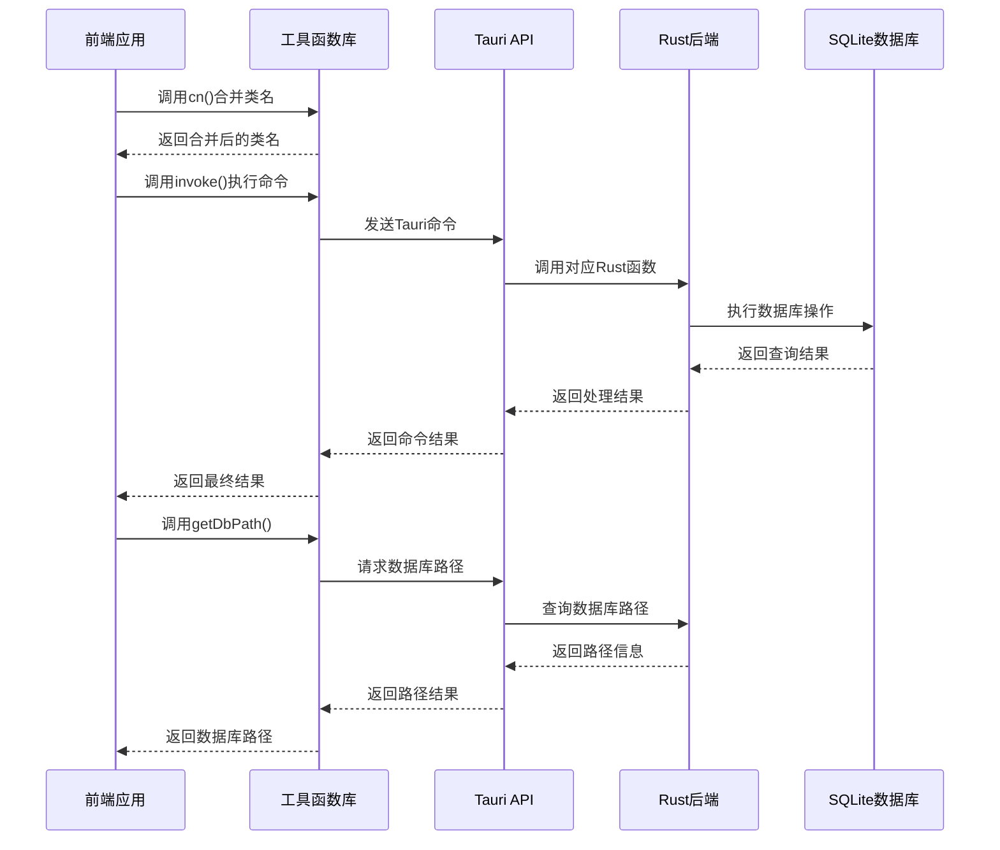
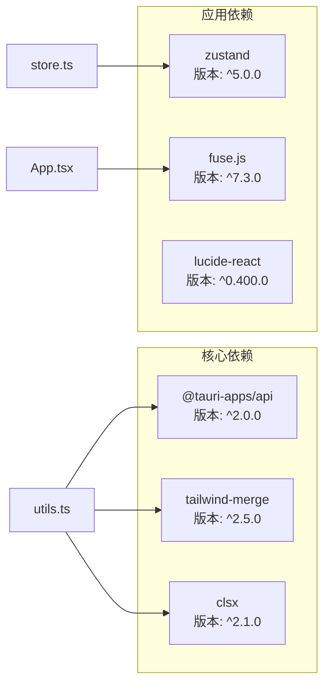
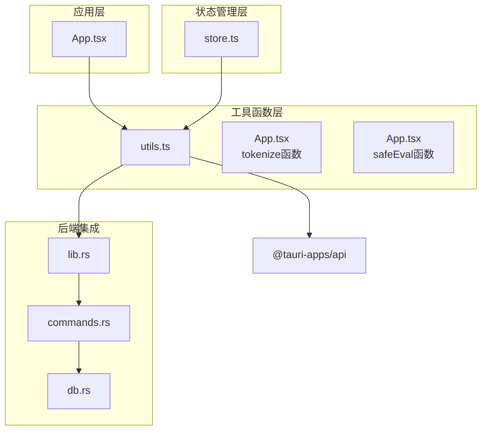

# 工具函数接口

<cite>
**本文档引用的文件**
- [utils.ts](file://src/lib/utils.ts)
- [commands.rs](file://src-tauri/src/commands.rs)
- [db.rs](file://src-tauri/src/db.rs)
- [pe_utils.rs](file://src-tauri/src/pe_utils.rs)
- [lib.rs](file://src-tauri/src/lib.rs)
- [store.ts](file://src/store.ts)
- [App.tsx](file://src/App.tsx)
- [package.json](file://package.json)
- [tsconfig.json](file://tsconfig.json)
</cite>

## 目录
1. [简介](#简介)
2. [项目结构](#项目结构)
3. [核心组件](#核心组件)
4. [架构概览](#架构概览)
5. [详细组件分析](#详细组件分析)
6. [依赖关系分析](#依赖关系分析)
7. [性能考虑](#性能考虑)
8. [故障排除指南](#故障排除指南)
9. [结论](#结论)

## 简介
本文件详细记录了QuickStart前端工具函数的完整接口规范，包括样式处理函数、数据转换函数、类型检查函数和通用辅助函数。文档涵盖了CSS类名合并、Tauri命令封装和数据库路径管理等实用功能，并提供了完整的TypeScript类型定义、使用示例和性能考虑。

QuickStart是一个基于Tauri的快速启动器应用，通过React前端与Rust后端的紧密协作，提供应用程序管理和文件搜索等功能。工具函数作为前后端交互的核心桥梁，确保了系统的稳定性和可维护性。

## 项目结构
QuickStart采用前后端分离的架构设计，工具函数主要位于前端的`src/lib/utils.ts`文件中，负责处理样式合并、Tauri命令调用和数据库路径管理等核心功能。

```mermaid
graph TB
subgraph "前端层"
Utils[utils.ts<br/>工具函数库]
Store[store.ts<br/>状态管理]
App[App.tsx<br/>主应用组件]
end
subgraph "后端层"
Commands[commands.rs<br/>Tauri命令实现]
DB[db.rs<br/>数据库管理]
PEUtils[pe_utils.rs<br/>PE文件工具]
LibRS[lib.rs<br/>应用入口]
end
subgraph "外部依赖"
TauriAPI[@tauri-apps/api<br/>Tauri API]
Tailwind[tailwind-merge<br/>样式合并]
CLSX[clsx<br/>类名处理]
end
Utils --> TauriAPI
Utils --> Tailwind
Utils --> CLSX
App --> Utils
Store --> Utils
LibRS --> Commands
Commands --> DB
Commands --> PEUtils
```

**图表来源**
- [utils.ts:1-25](file://src/lib/utils.ts#L1-L25)
- [lib.rs:1-135](file://src-tauri/src/lib.rs#L1-L135)
- [commands.rs:1-709](file://src-tauri/src/commands.rs#L1-L709)

**章节来源**
- [utils.ts:1-25](file://src/lib/utils.ts#L1-L25)
- [lib.rs:1-135](file://src-tauri/src/lib.rs#L1-L135)

## 核心组件
QuickStart工具函数库包含三个核心函数，每个函数都针对特定的使用场景进行了优化设计：

### 样式处理函数
- **cn函数**：用于合并和处理CSS类名，结合clsx和tailwind-merge实现智能的类名冲突解决

### Tauri命令封装函数
- **invoke函数**：通用的Tauri命令调用封装，支持泛型类型安全
- **getDbPath函数**：专门用于获取数据库文件路径的便捷函数

### 数据转换函数
- **tokenize函数**：文本分词算法，支持驼峰命名、连字符和下划线的智能分割
- **safeEval函数**：安全的数学表达式求值器，支持基本运算符和括号

**章节来源**
- [utils.ts:4-24](file://src/lib/utils.ts#L4-L24)
- [App.tsx:21-200](file://src/App.tsx#L21-L200)

## 架构概览
工具函数在QuickStart系统中的作用是作为前端与后端之间的桥梁，确保类型安全和错误处理的一致性。



**图表来源**
- [utils.ts:11-24](file://src/lib/utils.ts#L11-L24)
- [lib.rs:96-131](file://src-tauri/src/lib.rs#L96-L131)
- [commands.rs:392-396](file://src-tauri/src/commands.rs#L392-L396)

## 详细组件分析

### cn函数 - CSS类名合并工具
cn函数是QuickStart中最核心的样式处理工具，专门用于解决Tailwind CSS类名冲突问题。

#### 函数签名与类型定义
```typescript
export function cn(...inputs: ClassValue[]): string
```

#### 参数说明
- **inputs**: 可变参数，接受任意数量的ClassValue类型参数
- **ClassValue类型**: 支持字符串、对象、数组和条件表达式

#### 返回值
- **string**: 合并后的CSS类名字符串，经过tailwind-merge优化

#### 实现原理
1. **clsx处理**: 首先使用clsx处理条件类名，过滤掉null、undefined和false值
2. **tailwind-merge优化**: 再使用tailwind-merge解决冲突，保留最后出现的类名
3. **性能优化**: 通过一次遍历完成所有处理，避免多次字符串操作

#### 使用场景
- 组件条件渲染的类名组合
- 动态主题切换的样式应用
- 条件样式的智能合并

**章节来源**
- [utils.ts:4-6](file://src/lib/utils.ts#L4-L6)

### invoke函数 - Tauri命令封装
invoke函数提供了类型安全的Tauri命令调用机制，是前端与Rust后端通信的核心接口。

#### 函数签名与类型定义
```typescript
export async function invoke<T = unknown>(
  cmd: string,
  args?: Record<string, unknown>
): Promise<T>
```

#### 泛型参数
- **T**: 返回值的类型约束，默认为unknown类型

#### 参数说明
- **cmd**: string类型，指定要调用的Tauri命令名称
- **args**: Record<string, unknown>类型，可选的命令参数对象

#### 返回值
- **Promise<T>**: 异步返回类型化结果

#### 错误处理机制
1. **动态导入**: 使用动态import确保@tauri-apps/api的按需加载
2. **类型安全**: 通过泛型确保返回值类型正确
3. **异常传播**: 将Rust后端的错误直接传递给前端

#### 使用示例
```typescript
// 调用获取应用列表命令
const apps: AppItem[] = await invoke<AppItem[]>("get_app_list");

// 调用添加应用命令
const result = await invoke<AppData>("add_app", {
  name: "Visual Studio Code",
  path: "C:\\Program Files\\Microsoft VS Code\\Code.exe",
  category: "开发工具"
});
```

**章节来源**
- [utils.ts:11-17](file://src/lib/utils.ts#L11-L17)

### getDbPath函数 - 数据库路径管理
getDbPath函数专门用于获取QuickStart应用的数据库文件路径，确保跨平台兼容性。

#### 函数签名与类型定义
```typescript
export async function getDbPath(): Promise<string>
```

#### 返回值
- **Promise<string>**: 数据库文件的完整路径字符串

#### 实现逻辑
1. **命令调用**: 通过invoke函数调用Rust后端的get_db_path命令
2. **类型转换**: 将Rust的PathBuf转换为字符串路径
3. **路径验证**: 确保返回的路径是有效的文件系统路径

#### 使用场景
- 应用启动时的数据库初始化
- 数据库迁移和备份操作
- 调试和故障排除

**章节来源**
- [utils.ts:22-24](file://src/lib/utils.ts#L22-L24)

### tokenize函数 - 文本分词算法
tokenize函数实现了智能的文本分词算法，支持多种命名约定的统一处理。

#### 函数签名与类型定义
```typescript
const tokenize = (s: string): string[] => string[]
```

#### 参数说明
- **s**: string类型，待分词的原始字符串

#### 返回值
- **string[]**: 分词后的字符串数组

#### 分词规则
1. **驼峰命名处理**: 使用正则表达式([a-z])([A-Z])在大写字母前添加空格
2. **特殊字符替换**: 将连字符(-)、下划线(_)和点号(.)替换为空格
3. **多空格处理**: 将多个连续空格合并为单个空格
4. **过滤处理**: 移除长度小于等于0的空字符串
5. **大小写标准化**: 将所有分词转换为小写

#### 示例
```
输入: "VisualStudioCode"
输出: ["visual", "studio", "code"]

输入: "file-name_test.txt"
输出: ["file", "name", "test", "txt"]

输入: "iPhoneApp"
输出: ["i", "phone", "app"]
```

**章节来源**
- [App.tsx:21-30](file://src/App.tsx#L21-L30)

### safeEval函数 - 安全数学表达式求值器
safeEval函数提供了安全的数学表达式计算能力，支持基本的四则运算和括号操作。

#### 函数签名与类型定义
```typescript
function safeEval(expr: string): number | null
```

#### 参数说明
- **expr**: string类型，数学表达式字符串

#### 返回值
- **number | null**: 计算结果或null（表示计算失败）

#### 解析流程
1. **预处理**: 替换中文乘号(×)为*，除号(÷)为/，移除所有空白字符
2. **词法分析**: 将表达式分解为数字和运算符的token序列
3. **语法分析**: 使用递归下降解析器构建抽象语法树
4. **语义分析**: 按照运算符优先级进行计算

#### 运算符支持
- **基本运算符**: +（加）、-（减）、*（乘）、/（除）、%（取模）
- **括号**: ()用于改变运算优先级
- **小数点**: 支持浮点数运算

#### 错误处理
- **空表达式**: 返回null
- **无效字符**: 返回null
- **除零错误**: 返回null
- **语法错误**: 返回null

**章节来源**
- [App.tsx:132-200](file://src/App.tsx#L132-L200)

## 依赖关系分析

### 外部依赖
QuickStart工具函数依赖于以下关键外部库：



**图表来源**
- [package.json:14-32](file://package.json#L14-L32)

### 内部依赖关系
工具函数之间以及与应用其他模块的依赖关系如下：



**图表来源**
- [utils.ts:1-25](file://src/lib/utils.ts#L1-L25)
- [lib.rs:96-131](file://src-tauri/src/lib.rs#L96-L131)

**章节来源**
- [package.json:14-50](file://package.json#L14-L50)

## 性能考虑

### 样式处理性能优化
- **懒加载策略**: cn函数使用动态import确保@tauri-apps/api按需加载
- **内存效率**: 通过一次遍历完成类名合并，避免中间变量的创建
- **缓存友好**: tailwind-merge的智能合并减少CSS规则数量

### Tauri命令调用优化
- **异步处理**: 所有Tauri调用都是异步的，避免阻塞主线程
- **类型缓存**: 泛型参数在编译时确定，运行时无需类型检查开销
- **错误快速返回**: 后端错误立即传播，避免不必要的等待

### 数据处理性能
- **分词算法**: tokenize函数使用高效的正则表达式和字符串操作
- **表达式求值**: safeEval函数采用递归下降解析，时间复杂度O(n)
- **内存管理**: 所有函数都是纯函数，无副作用，便于垃圾回收

### 并发处理
- **数据库操作**: Rust后端使用连接池和事务处理，支持并发访问
- **文件I/O**: 图标提取和文件搜索使用异步I/O操作
- **网络请求**: 版本检查使用超时控制，避免长时间阻塞

## 故障排除指南

### 样式处理问题
**问题**: 类名合并后样式不生效
**解决方案**:
1. 检查输入的类名是否为有效的CSS类名
2. 确认tailwind.config.js中的内容是否正确配置
3. 验证类名冲突是否被正确识别

**问题**: 样式覆盖顺序异常
**解决方案**:
1. 检查tailwind-merge的冲突解决规则
2. 确认类名的顺序是否符合预期
3. 验证是否有重要的CSS规则被覆盖

### Tauri命令调用问题
**问题**: invoke函数调用失败
**解决方案**:
1. 检查命令名称是否正确注册
2. 确认参数类型是否匹配后端期望
3. 验证Tauri权限配置是否正确

**问题**: 数据库路径获取失败
**解决方案**:
1. 检查应用数据目录的访问权限
2. 确认数据库文件是否存在
3. 验证路径拼接是否正确

### 数据处理问题
**问题**: 分词结果不符合预期
**解决方案**:
1. 检查输入字符串的编码格式
2. 验证正则表达式的匹配规则
3. 确认特殊字符的处理逻辑

**问题**: 数学表达式计算错误
**解决方案**:
1. 检查表达式中是否包含非法字符
2. 验证运算符的优先级处理
3. 确认除零错误的处理逻辑

**章节来源**
- [utils.ts:11-24](file://src/lib/utils.ts#L11-L24)
- [App.tsx:21-200](file://src/App.tsx#L21-L200)

## 结论
QuickStart工具函数库通过精心设计的接口和严格的类型约束，为整个应用提供了稳定可靠的功能基础。每个工具函数都针对特定的使用场景进行了优化，确保了最佳的性能表现和用户体验。

主要特点包括：
- **类型安全**: 所有函数都具有明确的TypeScript类型定义
- **错误处理**: 完善的异常处理机制确保系统的稳定性
- **性能优化**: 采用多种优化策略提升执行效率
- **可维护性**: 清晰的代码结构和文档便于后续维护

这些工具函数不仅满足了当前的功能需求，还为未来的功能扩展提供了良好的基础。通过合理的架构设计和实现细节，QuickStart工具函数库成为了整个应用的重要支撑。