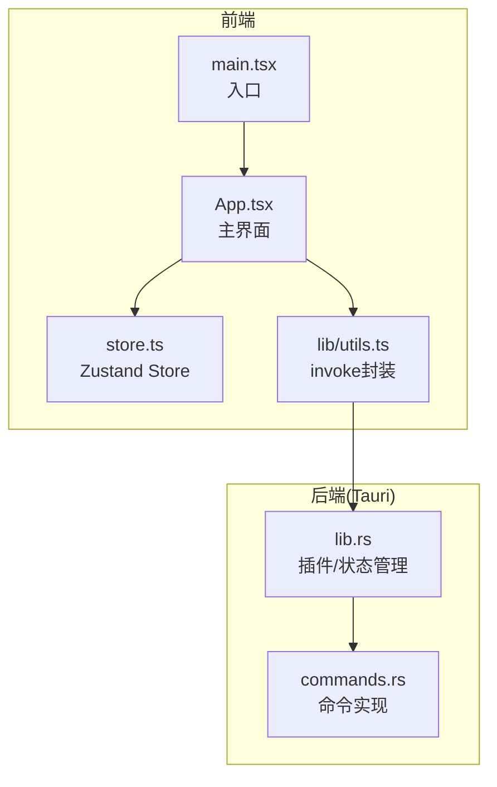
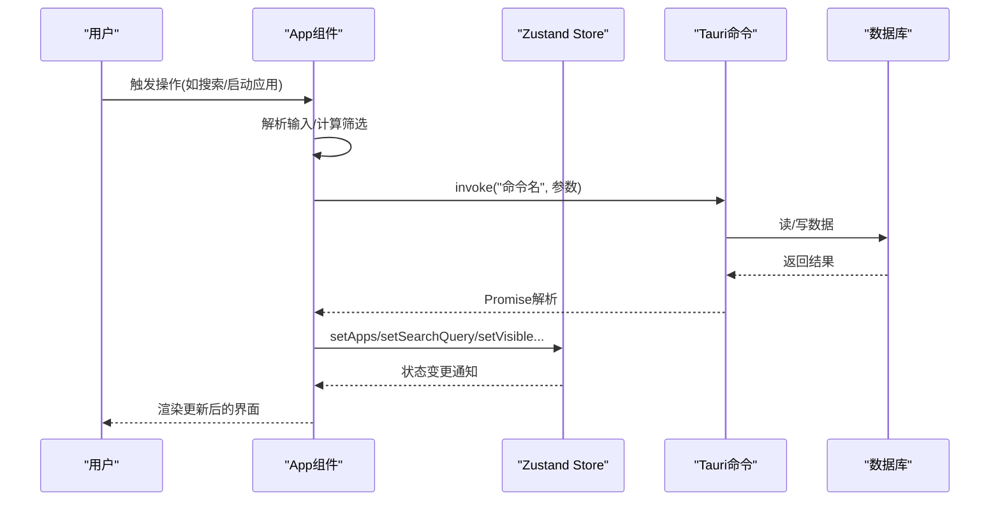
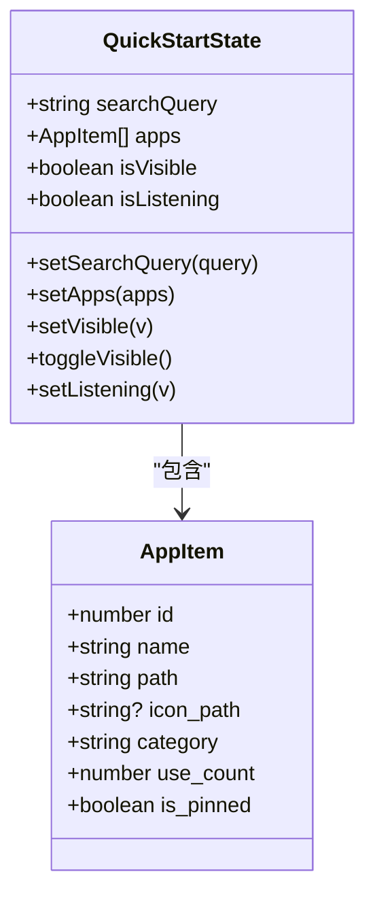
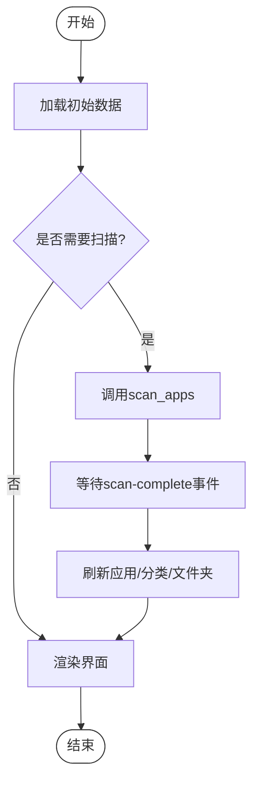
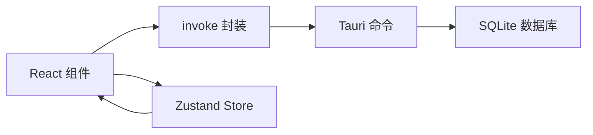
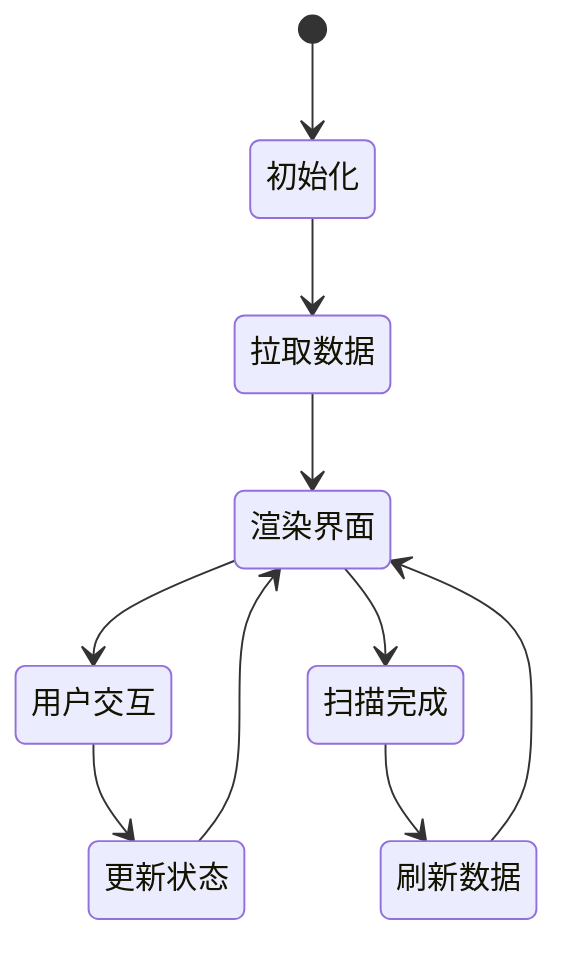

# 状态管理API

<cite>
**本文引用的文件**
- [store.ts](file://src/store.ts)
- [App.tsx](file://src/App.tsx)
- [main.tsx](file://src/main.tsx)
- [utils.ts](file://src/lib/utils.ts)
- [commands.rs](file://src-tauri/src/commands.rs)
- [lib.rs](file://src-tauri/src/lib.rs)
- [package.json](file://package.json)
</cite>

## 目录
1. [简介](#简介)
2. [项目结构](#项目结构)
3. [核心组件](#核心组件)
4. [架构总览](#架构总览)
5. [详细组件分析](#详细组件分析)
6. [依赖关系分析](#依赖关系分析)
7. [性能考量](#性能考量)
8. [故障排查指南](#故障排查指南)
9. [结论](#结论)
10. [附录](#附录)

## 简介
本文件面向QuickStart前端的状态管理API，聚焦于Zustand Store的接口设计与使用实践。内容覆盖：
- Store接口与Action函数
- Selector函数与订阅模式
- 全局状态的数据结构与更新机制
- 初始化、异步更新与错误处理
- 状态流转图与使用示例
- 应用状态、UI状态、搜索状态与设置状态的管理策略

## 项目结构
QuickStart采用React + Tauri + Zustand的组合：前端通过Zustand管理应用状态；通过Tauri命令与后端交互，实现数据库读写、系统能力调用等。

图表来源
- [main.tsx:1-11](file://src/main.tsx#L1-L11)
- [App.tsx:1-10](file://src/App.tsx#L1-L10)
- [store.ts:1-46](file://src/store.ts#L1-L46)
- [utils.ts:1-25](file://src/lib/utils.ts#L1-L25)
- [lib.rs:37-73](file://src-tauri/src/lib.rs#L37-L73)
- [commands.rs:1-200](file://src-tauri/src/commands.rs#L1-L200)

章节来源
- [main.tsx:1-11](file://src/main.tsx#L1-L11)
- [package.json:1-50](file://package.json#L1-L50)

## 核心组件
- Zustand Store：集中管理应用状态（搜索、应用列表、窗口可见性、语音识别状态），提供Action函数以同步更新状态。
- App组件：消费Store，驱动UI渲染与交互；通过invoke封装调用后端命令，实现异步数据加载与更新。
- Tauri命令：提供数据库操作、系统能力调用等后端能力，返回Promise给前端。

章节来源
- [store.ts:1-46](file://src/store.ts#L1-L46)
- [App.tsx:274-295](file://src/App.tsx#L274-L295)
- [utils.ts:11-17](file://src/lib/utils.ts#L11-L17)
- [commands.rs:31-194](file://src-tauri/src/commands.rs#L31-L194)

## 架构总览
前端状态流：用户交互触发App组件逻辑，调用invoke执行后端命令，命令完成后回填Store或触发事件，Store变更驱动组件重新渲染。

图表来源
- [App.tsx:314-409](file://src/App.tsx#L314-L409)
- [utils.ts:11-17](file://src/lib/utils.ts#L11-L17)
- [commands.rs:31-194](file://src-tauri/src/commands.rs#L31-L194)
- [store.ts:32-45](file://src/store.ts#L32-L45)

## 详细组件分析

### Zustand Store 接口与Action
- 状态字段
  - 搜索文本：用于全文检索与高亮匹配
  - 应用列表：应用元数据集合
  - 窗口可见性：控制主窗口显示/隐藏
  - 语音输入状态：控制语音识别开关
- Action函数
  - setSearchQuery：更新搜索文本
  - setApps：批量更新应用列表
  - setVisible/toggleVisible：控制窗口可见性
  - setListening：更新语音识别状态
- Selector与订阅
  - 当前实现直接解构useStore返回的字段，属于“多字段订阅”模式
  - 可通过自定义Selector优化订阅粒度，减少无关重渲染

图表来源
- [store.ts:3-30](file://src/store.ts#L3-L30)
- [store.ts:32-45](file://src/store.ts#L32-L45)

章节来源
- [store.ts:3-30](file://src/store.ts#L3-L30)
- [store.ts:32-45](file://src/store.ts#L32-L45)

### Selector函数与订阅模式
- 当前用法：在App组件中直接解构useStore，订阅多个字段
- 优化建议：
  - 使用自定义Selector仅订阅必要字段，降低重渲染成本
  - 对复杂派生状态（如过滤后的应用列表）可结合useMemo进行缓存
- 订阅粒度与性能权衡：字段越多，重渲染范围越大；应按需订阅

章节来源
- [App.tsx:274-295](file://src/App.tsx#L274-L295)

### 异步更新与错误处理
- 异步数据加载
  - 启动时加载应用、文件夹、分类、搜索历史
  - 扫描完成后通过事件回调刷新数据
- 错误处理
  - try/catch包裹invoke调用，捕获异常并提示
  - 对扫描失败场景，主动重置扫描状态
- UI反馈
  - 使用toast展示成功/失败信息
  - 输入焦点管理与键盘导航保持良好体验

图表来源
- [App.tsx:374-409](file://src/App.tsx#L374-L409)
- [App.tsx:343-353](file://src/App.tsx#L343-L353)

章节来源
- [App.tsx:314-409](file://src/App.tsx#L314-L409)

### 状态初始化与持久化
- 初始化
  - Store在创建时即设定默认值（如searchQuery为空、isVisible为true、isListening为false）
  - App组件在启动时拉取后端数据并填充Store
- 持久化
  - 当前代码未显式引入持久化中间件
  - 若需跨会话保存状态，可在create中集成persist中间件，并指定存储键与序列化策略

章节来源
- [store.ts:32-45](file://src/store.ts#L32-L45)
- [App.tsx:374-391](file://src/App.tsx#L374-L391)

### 数据结构与类型定义
- AppItem
  - 字段：id、name、path、icon_path、category、use_count、is_pinned
  - 用途：应用元数据，用于渲染、排序、分类与固定
- QuickStartState
  - 字段：searchQuery、apps、isVisible、isListening
  - Action：对应字段的setter与toggleVisible

章节来源
- [store.ts:3-11](file://src/store.ts#L3-L11)
- [store.ts:13-30](file://src/store.ts#L13-L30)

### 使用示例与最佳实践
- 搜索与高亮
  - 通过setSearchQuery更新搜索文本，App组件内部进行分词匹配与高亮
- 启动应用
  - 调用后端命令记录使用次数与搜索历史，随后隐藏窗口
- 语音输入
  - 切换isListening状态，SpeechRecognition回调中更新搜索文本并恢复输入焦点
- 分类与固定
  - 通过后端命令更新分类与固定状态，随后刷新应用列表与分类列表

章节来源
- [App.tsx:581-593](file://src/App.tsx#L581-L593)
- [App.tsx:659-663](file://src/App.tsx#L659-L663)
- [App.tsx:698-710](file://src/App.tsx#L698-L710)

## 依赖关系分析
- 前端依赖
  - React、Zustand、@tauri-apps/api
- 后端依赖
  - Tauri命令注册、SQLite连接、全局快捷键、托盘
- 关键交互
  - App组件通过invoke封装调用后端命令，命令执行后更新数据库并返回结果
  - Store作为状态枢纽，接收后端返回数据并驱动UI

图表来源
- [utils.ts:11-17](file://src/lib/utils.ts#L11-L17)
- [commands.rs:31-194](file://src-tauri/src/commands.rs#L31-L194)
- [store.ts:32-45](file://src/store.ts#L32-L45)

章节来源
- [package.json:14-31](file://package.json#L14-L31)
- [lib.rs:37-73](file://src-tauri/src/lib.rs#L37-L73)

## 性能考量
- 订阅粒度
  - 优先使用细粒度Selector，避免不必要的重渲染
- 异步加载
  - 对图标加载采用串行策略，确保可见应用的图标及时呈现
- 计算优化
  - 使用useMemo缓存过滤后的应用列表与文件夹列表
- 事件驱动
  - 扫描完成后统一刷新，减少多次setState带来的抖动

[本节为通用指导，无需特定文件引用]

## 故障排查指南
- 常见问题
  - 启动失败：检查后端命令返回值与异常日志
  - 图标加载失败：确认icon_path与缓存标记，避免重复请求
  - 扫描未完成：检查scan-complete事件监听与状态重置逻辑
- 定位方法
  - 在invoke调用处添加try/catch与console.warn
  - 在事件监听回调中打印payload，验证数据一致性
- 修复建议
  - 对网络/IO异常进行降级处理，保证UI可用
  - 对重复操作（如重复分类）进行前端校验与提示

章节来源
- [App.tsx:581-593](file://src/App.tsx#L581-L593)
- [App.tsx:667-677](file://src/App.tsx#L667-L677)
- [App.tsx:393-409](file://src/App.tsx#L393-L409)

## 结论
QuickStart的前端状态管理以Zustand为核心，结合Tauri命令实现前后端协同。当前实现简洁清晰，具备良好的扩展性。建议后续引入持久化中间件与更精细的Selector订阅，进一步提升性能与可维护性。

[本节为总结，无需特定文件引用]

## 附录

### Store接口与Action一览
- 搜索状态
  - 字段：searchQuery
  - Action：setSearchQuery
- 应用状态
  - 字段：apps
  - Action：setApps
- UI状态
  - 字段：isVisible、isListening
  - Action：setVisible、toggleVisible、setListening
- 设置状态
  - 当前未在Store中暴露设置项，可通过后端命令读取/写入设置

章节来源
- [store.ts:13-30](file://src/store.ts#L13-L30)

### 状态流转图（概念）

[本图为概念示意，无需图表来源]