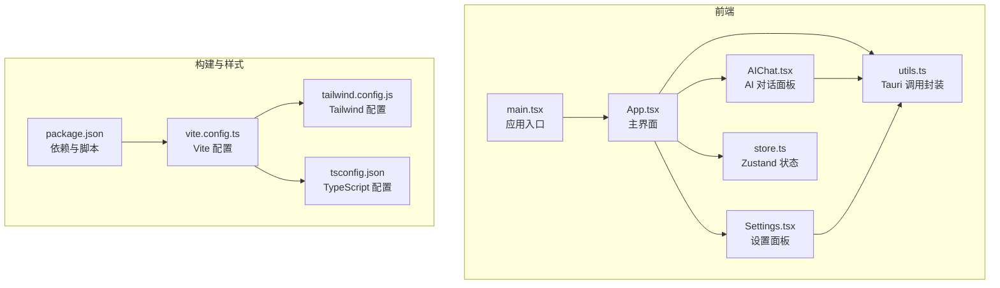
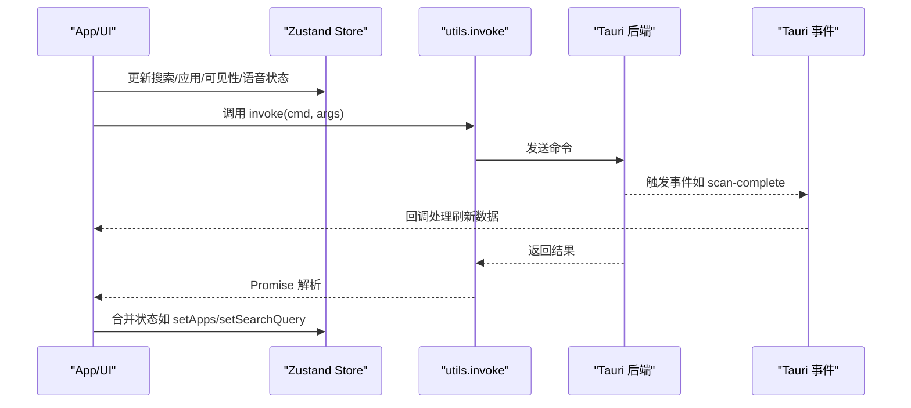
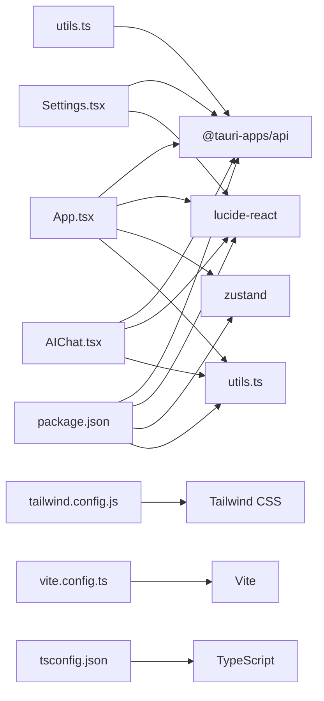

# 组件API接口

<cite>
**本文档引用的文件**
- [App.tsx](file://src/App.tsx)
- [AIChat.tsx](file://src/AIChat.tsx)
- [Settings.tsx](file://src/Settings.tsx)
- [store.ts](file://src/store.ts)
- [utils.ts](file://src/lib/utils.ts)
- [main.tsx](file://src/main.tsx)
- [package.json](file://package.json)
- [tsconfig.json](file://tsconfig.json)
- [tailwind.config.js](file://tailwind.config.js)
- [vite.config.ts](file://vite.config.ts)
</cite>

## 目录
1. [简介](#简介)
2. [项目结构](#项目结构)
3. [核心组件](#核心组件)
4. [架构总览](#架构总览)
5. [详细组件分析](#详细组件分析)
6. [依赖关系分析](#依赖关系分析)
7. [性能考量](#性能考量)
8. [故障排查指南](#故障排查指南)
9. [结论](#结论)
10. [附录](#附录)

## 简介
本文件为 QuickStart 前端组件的详细 API 文档，覆盖 React 组件的属性接口、事件处理器、状态管理与生命周期方法。重点记录：
- 组件 props 定义、默认值、类型约束与验证规则
- 组件间通信模式、事件传递机制与回调函数接口
- Zustand 状态管理与 Tauri 后端交互
- UI 组件库与自定义组件的设计模式及组合策略
- TypeScript 接口定义、使用示例与最佳实践

## 项目结构
QuickStart 采用 React + Vite + TailwindCSS + Zustand + Tauri 的技术栈，前端入口位于 src 目录，主要组件包括主界面 App、AI 对话面板 AIChat、设置面板 Settings，以及全局状态 store 和工具函数 utils。

图表来源
- [main.tsx:1-11](file://src/main.tsx#L1-L11)
- [App.tsx:1-1299](file://src/App.tsx#L1-L1299)
- [AIChat.tsx:1-278](file://src/AIChat.tsx#L1-L278)
- [Settings.tsx:1-165](file://src/Settings.tsx#L1-L165)
- [store.ts:1-46](file://src/store.ts#L1-L46)
- [utils.ts:1-25](file://src/lib/utils.ts#L1-L25)
- [vite.config.ts:1-32](file://vite.config.ts#L1-L32)
- [tailwind.config.js:1-86](file://tailwind.config.js#L1-L86)
- [tsconfig.json:1-25](file://tsconfig.json#L1-L25)
- [package.json:1-50](file://package.json#L1-L50)

章节来源
- [main.tsx:1-11](file://src/main.tsx#L1-L11)
- [package.json:1-50](file://package.json#L1-L50)

## 核心组件
本节概述三个核心组件的职责与对外接口。

- App（主界面）
  - 负责应用列表、文件夹、搜索、分类、拖拽、语音输入、窗口控制等
  - 对外暴露 props：无（通过全局状态 useStore 与 invoke 与后端交互）
  - 关键状态：搜索查询、应用列表、窗口可见性、语音状态、扫描状态、分类与文件夹列表、图标缓存、通知等
  - 生命周期：组件挂载时初始化主题、加载数据、注册事件监听；卸载时清理监听器

- AIChat（AI 对话面板）
  - 提供流式对话能力，支持语音输入与设置联动
  - 对外 props：onClose（关闭回调）
  - 关键状态：消息列表、输入文本、加载状态、语音状态、流式文本、配置（provider/model/baseUrl/apiKey）

- Settings（设置面板）
  - 提供外观、快捷键、启动、分类、AI 配置等设置项
  - 对外 props：onClose（关闭回调）
  - 关键状态：设置键值对、保存状态、加载状态

章节来源
- [App.tsx:274-1299](file://src/App.tsx#L274-L1299)
- [AIChat.tsx:10-278](file://src/AIChat.tsx#L10-L278)
- [Settings.tsx:5-165](file://src/Settings.tsx#L5-L165)
- [store.ts:1-46](file://src/store.ts#L1-L46)

## 架构总览
前端采用“组件 + 状态 + 事件”的架构模式：
- 组件负责 UI 与交互
- Zustand 管理轻量状态（搜索、应用列表、窗口可见性、语音状态）
- Tauri 事件与命令桥接后端功能（扫描、启动、设置、AI 对话等）
- Tailwind 提供样式与动画

图表来源
- [App.tsx:354-409](file://src/App.tsx#L354-L409)
- [store.ts:32-45](file://src/store.ts#L32-L45)
- [utils.ts:11-17](file://src/lib/utils.ts#L11-L17)

## 详细组件分析

### App 组件 API
- 组件定位：主界面容器，承载搜索、应用网格、文件夹、设置、AI 面板、通知等
- 无直接 props，通过全局状态 useStore 与 invoke 与后端交互
- 关键状态与行为：
  - 搜索与高亮：searchQuery、highlight 函数、分词匹配、缩写映射
  - 应用与文件夹：apps、folders、categories、folderCategories
  - 视图与导航：view（search/panel/folders）、selectedIndex、folderSelectedIndex
  - 拖拽分类：dragAppId、dragOverCat、onDragStart/onDragOver/onDrop/onDragEnd
  - 语音输入：SpeechManager、isListening、toggleListening
  - 扫描与更新：scanning、doScan、scan-complete 事件监听
  - 图标缓存：iconCache、loadIcon
  - 右键菜单与分类对话框：cm、folderCm、catDialog、updateCategory
  - 窗口控制：minimize/toggleMaximize/hide
  - 通知：toast、showToast
  - 文件搜索：searchQuery 触发 invoke("search_files")

- 生命周期与副作用：
  - 初始化主题、加载数据、注册事件监听、键盘导航、滚动同步、图标预加载
  - 卸载时清理定时器、事件监听器

- 事件与回调：
  - onDragStart/onDragEnd：拖拽应用分类
  - onClick：启动应用/打开文件夹/打开文件
  - onContextMenu：显示右键菜单
  - onClose：关闭 AIChat/Settings
  - onDrop：拖拽 .exe/.lnk 添加应用

- TypeScript 接口与类型：
  - AppItem：应用条目
  - FolderItem：文件夹条目
  - FileResult：文件搜索结果
  - DisplayItem：显示项联合类型（app/folder/file/calc）
  - 事件类型：ScanAppsResult、DroppedFile

- 使用示例与最佳实践：
  - 在父组件中通过全局状态与 invoke 进行数据与交互
  - 使用 memo 优化 AppCard 渲染
  - 使用 useMemo 优化过滤与计算
  - 使用 useCallback 优化异步加载与事件处理
  - 使用 useRef 管理定时器与 DOM 引用
  - 使用 useEffect 注册/清理事件监听器

章节来源
- [App.tsx:49-70](file://src/App.tsx#L49-L70)
- [App.tsx:263-272](file://src/App.tsx#L263-L272)
- [App.tsx:274-1299](file://src/App.tsx#L274-L1299)
- [store.ts:3-11](file://src/store.ts#L3-L11)
- [utils.ts:11-17](file://src/lib/utils.ts#L11-L17)

### AIChat 组件 API
- 组件定位：独立的 AI 对话面板，支持语音输入与流式输出
- 对外 props：
  - onClose：关闭回调
- 关键状态：
  - messages：Message[]（用户/助手/系统）
  - input：输入文本
  - loading：请求中状态
  - listening：语音识别状态
  - streamingText：流式输出片段
  - config：provider/model/baseUrl/apiKey
- 生命周期：
  - 组件挂载时加载设置、滚动到底部、聚焦输入框
  - 卸载时清理事件监听器
- 事件与回调：
  - sendMessage：发送消息，监听 ai:token/ai:done 事件
  - toggleListening：语音输入开关
  - onClose：关闭面板

- TypeScript 接口与类型：
  - Message：role（user/assistant/system）、content
  - Props：onClose

- 使用示例与最佳实践：
  - 通过 invoke("ai_chat_stream") 发起流式对话
  - 使用事件监听器聚合流式文本并在 loading 结束后合并到消息列表
  - 在发送前注入安全与整理规则的 system 消息
  - 语音输入使用 Web Speech API，注意浏览器兼容性

章节来源
- [AIChat.tsx:5-12](file://src/AIChat.tsx#L5-L12)
- [AIChat.tsx:14-278](file://src/AIChat.tsx#L14-L278)
- [utils.ts:11-17](file://src/lib/utils.ts#L11-L17)

### Settings 组件 API
- 组件定位：设置面板，集中管理外观、快捷键、启动、分类、AI 配置
- 对外 props：
  - onClose：关闭回调
- 关键状态：
  - s：设置键值对（KEYS）
  - saved：保存状态
  - loading：加载状态
- 生命周期：
  - 组件挂载时批量加载设置，监听系统主题变化
- 事件与回调：
  - set(key, value)：更新设置
  - save：批量保存设置并应用主题

- TypeScript 接口与类型：
  - KEYS：设置默认值集合
  - SettingKey：KEYS 的键名

- 使用示例与最佳实践：
  - 使用 invoke("get_setting"/"set_setting") 与后端交互
  - 主题切换即时生效，快捷键与开机自启需重启应用
  - 表单控件使用受控组件模式

章节来源
- [Settings.tsx:7-12](file://src/Settings.tsx#L7-L12)
- [Settings.tsx:14-165](file://src/Settings.tsx#L14-L165)
- [utils.ts:11-17](file://src/lib/utils.ts#L11-L17)

### Zustand 状态 API
- 状态接口 QuickStartState：
  - searchQuery：字符串
  - setSearchQuery：(query: string) => void
  - apps：AppItem[]
  - setApps：(apps: AppItem[]) => void
  - isVisible：boolean
  - setVisible：(v: boolean) => void
  - toggleVisible：() => void
  - isListening：boolean
  - setListening：(v: boolean) => void
- 默认值：
  - searchQuery：空字符串
  - apps：空数组
  - isVisible：true
  - isListening：false

- 使用示例与最佳实践：
  - 通过 useStore 访问与更新状态
  - 将轻量 UI 状态放入 Zustand，复杂业务逻辑仍交由后端

章节来源
- [store.ts:13-30](file://src/store.ts#L13-L30)
- [store.ts:32-45](file://src/store.ts#L32-L45)

### 工具函数 API
- cn(...inputs: ClassValue[]): string
  - 用途：合并 Tailwind 类名，避免冲突
- invoke<T = unknown>(cmd: string, args?: Record<string, unknown>): Promise<T>
  - 用途：统一调用 Tauri 命令，返回 Promise
- getDbPath(): Promise<string>
  - 用途：获取数据库路径

- 使用示例与最佳实践：
  - 在组件中统一使用 invoke 进行后端交互
  - 使用 cn 组合样式类，保持一致性

章节来源
- [utils.ts:4-6](file://src/lib/utils.ts#L4-L6)
- [utils.ts:11-24](file://src/lib/utils.ts#L11-L24)

## 依赖关系分析
- React 生态：@tauri-apps/api、lucide-react、zustand、clsx、tailwind-merge
- UI 交互：@radix-ui/react-*（对话框、下拉菜单、提示）
- 构建与样式：@vitejs/plugin-react、tailwindcss、autoprefixer、postcss
- 类型与严格性：@types/react、typescript

图表来源
- [package.json:14-31](file://package.json#L14-L31)
- [App.tsx:1-12](file://src/App.tsx#L1-L12)
- [AIChat.tsx:1-3](file://src/AIChat.tsx#L1-L3)
- [Settings.tsx:1-3](file://src/Settings.tsx#L1-L3)
- [utils.ts:1-6](file://src/lib/utils.ts#L1-L6)
- [tailwind.config.js:1-86](file://tailwind.config.js#L1-L86)
- [vite.config.ts:1-32](file://vite.config.ts#L1-L32)
- [tsconfig.json:1-25](file://tsconfig.json#L1-L25)

章节来源
- [package.json:14-31](file://package.json#L14-L31)

## 性能考量
- 渲染优化
  - 使用 memo 优化 AppCard，减少不必要的重渲染
  - 使用 useMemo 优化过滤与计算（如 searchedApps、displayItems）
  - 使用 useCallback 优化异步加载与事件处理函数
- 异步与事件
  - 使用 useRef 管理定时器与事件监听器，避免泄漏
  - 在卸载时清理事件监听器与定时器
- 图标与网络
  - 图标缓存（iconCache）避免重复请求
  - 图标加载串行进行，保证可见应用的图标可用
- 计算与搜索
  - 分词匹配与缩写映射在搜索时进行，避免重复计算
  - 文件搜索使用防抖与取消标志，避免竞态

## 故障排查指南
- 事件未触发
  - 检查事件监听器是否正确注册与清理
  - 确认 Tauri 事件名称与监听一致（如 "scan-complete"）
- 图标不显示
  - 检查 iconCache 中的缓存值与失败标记
  - 确认后端返回的图标数据 URL
- 语音输入无效
  - 检查浏览器对 Web Speech API 的支持
  - 确认 isListening 状态与 toggleListening 的调用
- 设置保存无效
  - 检查 invoke("set_setting") 的键值是否正确
  - 确认主题切换逻辑与系统偏好设置
- AI 对话异常
  - 检查 AI 配置（provider/model/baseUrl/apiKey）
  - 确认事件监听器（ai:token/ai:done）是否正确清理

章节来源
- [App.tsx:354-409](file://src/App.tsx#L354-L409)
- [AIChat.tsx:62-81](file://src/AIChat.tsx#L62-L81)
- [Settings.tsx:19-60](file://src/Settings.tsx#L19-L60)
- [utils.ts:11-17](file://src/lib/utils.ts#L11-L17)

## 结论
QuickStart 前端组件以清晰的职责划分与简洁的 API 设计实现了高效、可维护的用户体验。通过 Zustand 管理轻量状态、Tauri 事件与命令桥接后端能力、Tailwind 提供一致的视觉语言，形成了稳定的组件生态。建议在后续迭代中：
- 为关键组件补充更完善的 TypeScript 接口与类型约束
- 增加组件单元测试与集成测试
- 优化性能指标（如首屏渲染、内存占用、事件监听器清理）
- 完善错误边界与降级策略

## 附录

### 组件间通信模式
- 父子通信：通过 props 传递回调（onClose、onClick 等）
- 全局状态：通过 useStore 共享搜索、应用列表、窗口可见性、语音状态
- 事件通信：通过 @tauri-apps/api/event 监听后端事件（如 scan-complete）

章节来源
- [App.tsx:1283-1287](file://src/App.tsx#L1283-L1287)
- [AIChat.tsx:14-278](file://src/AIChat.tsx#L14-L278)
- [Settings.tsx:14-165](file://src/Settings.tsx#L14-L165)
- [store.ts:32-45](file://src/store.ts#L32-L45)

### 最佳实践清单
- 使用 memo 与 useMemo 优化渲染
- 使用 useCallback 优化事件处理
- 使用 useRef 管理定时器与 DOM 引用
- 在 useEffect 中注册/清理事件监听器
- 统一使用 invoke 进行后端交互
- 为重要状态与事件添加类型约束
- 为 UI 组件提供明确的 props 接口与默认值