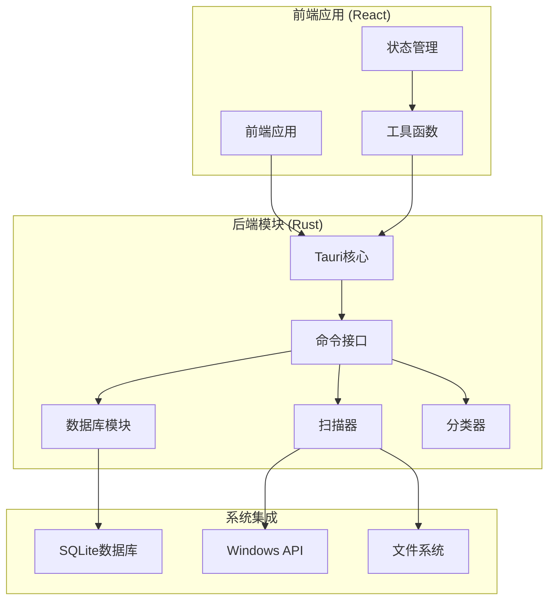
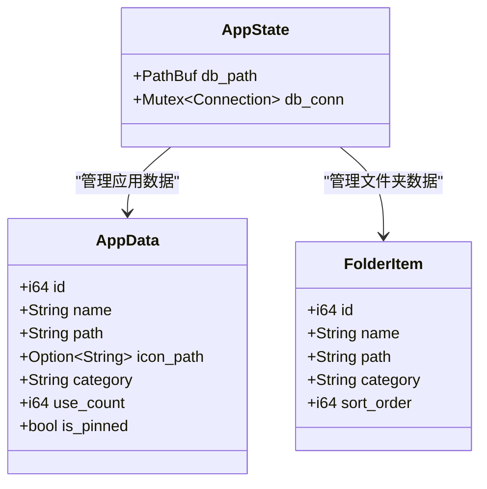
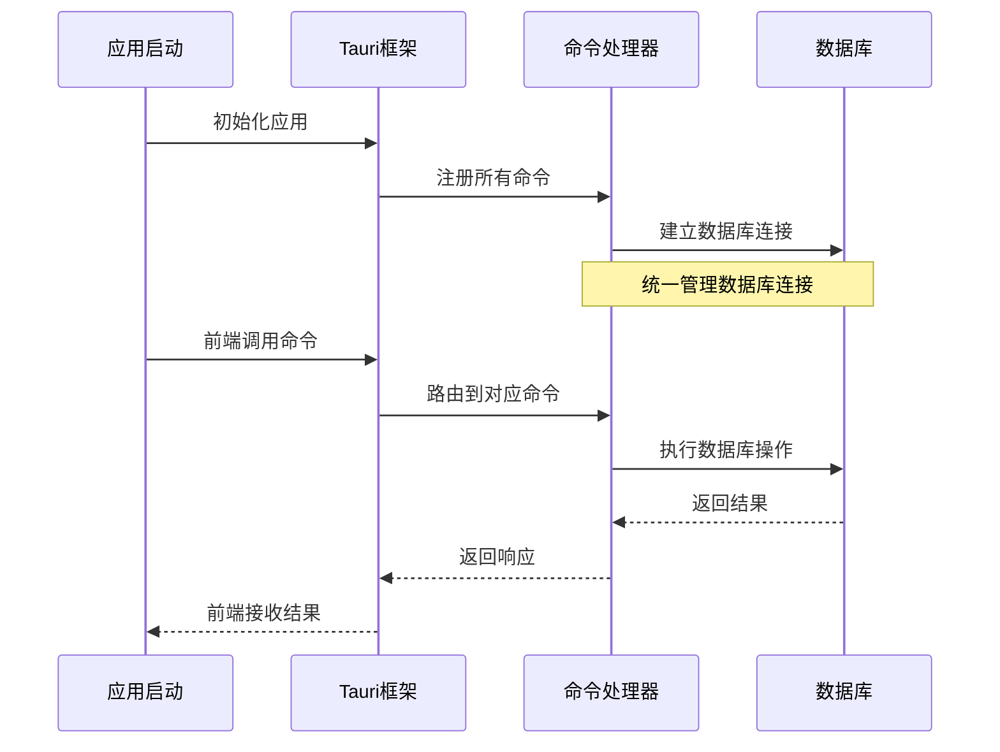
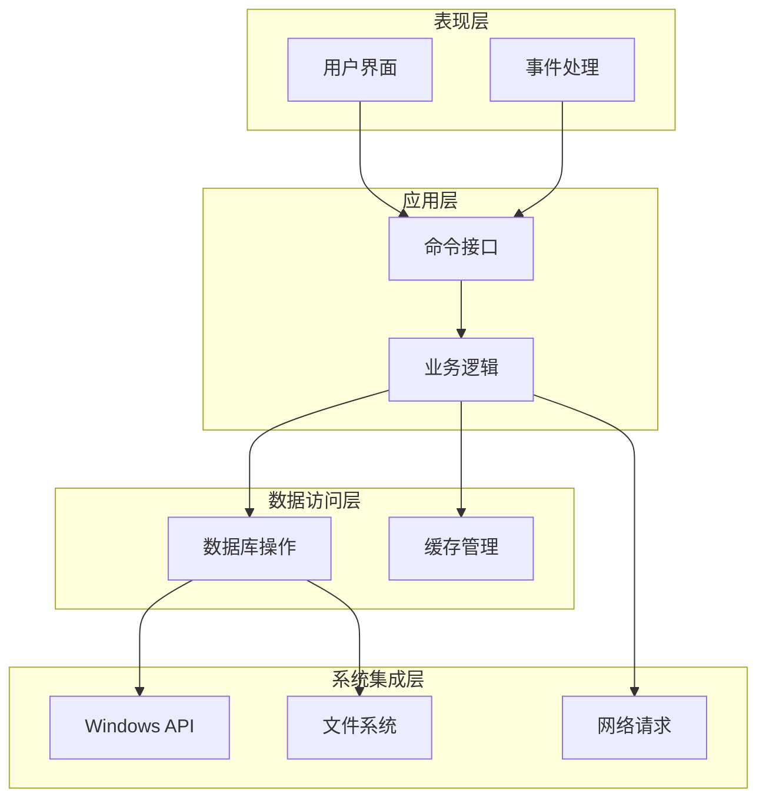
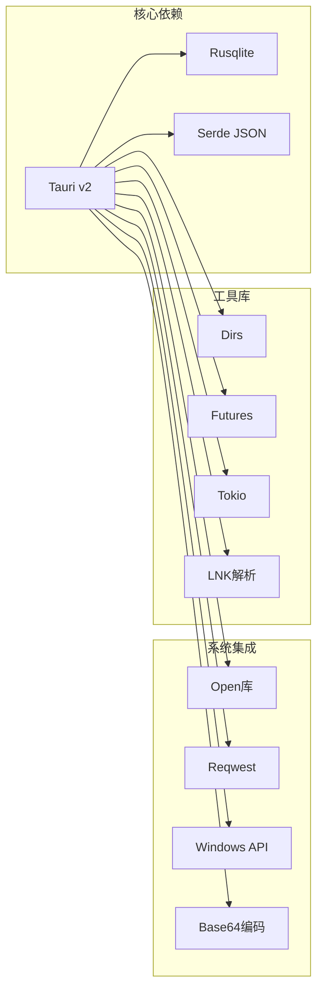
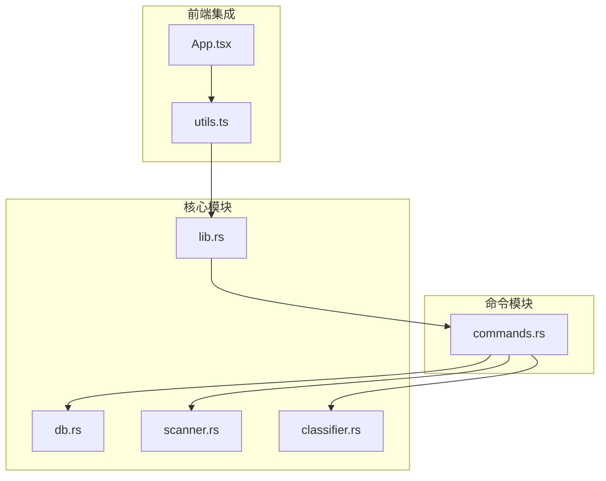
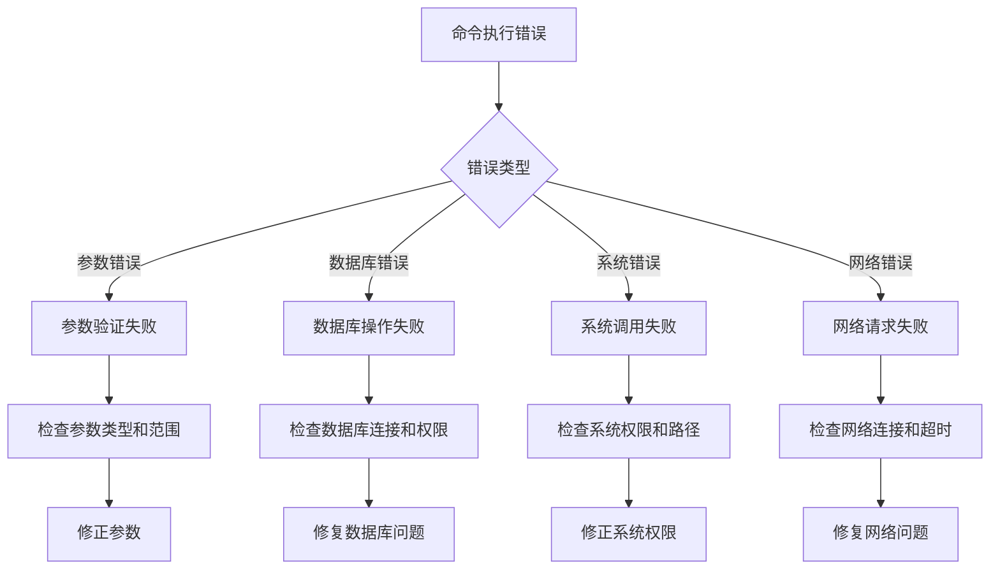

# Tauri命令接口

<cite>
**本文档引用的文件**
- [commands.rs](file://src-tauri/src/commands.rs)
- [lib.rs](file://src-tauri/src/lib.rs)
- [db.rs](file://src-tauri/src/db.rs)
- [scanner.rs](file://src-tauri/src/scanner.rs)
- [classifier.rs](file://src-tauri/src/classifier.rs)
- [Cargo.toml](file://src-tauri/Cargo.toml)
- [tauri.conf.json](file://src-tauri/tauri.conf.json)
- [utils.ts](file://src/lib/utils.ts)
- [App.tsx](file://src/App.tsx)
</cite>

## 目录
1. [简介](#简介)
2. [项目结构](#项目结构)
3. [核心组件](#核心组件)
4. [架构概览](#架构概览)
5. [详细组件分析](#详细组件分析)
6. [依赖关系分析](#依赖关系分析)
7. [性能考虑](#性能考虑)
8. [故障排除指南](#故障排除指南)
9. [结论](#结论)

## 简介

QuickStart是一个基于Tauri框架的Windows桌面快捷启动器应用。本文档详细记录了所有通过`#[tauri::command]`宏定义的后端命令接口，包括应用管理、文件夹管理、设置管理、系统操作等功能模块。每个命令都包含了参数类型、返回值、错误处理机制、使用示例以及底层实现细节。

## 项目结构

QuickStart采用典型的Tauri项目结构，主要分为前端React应用和后端Rust模块两大部分：

**图表来源**
- [lib.rs:22-134](file://src-tauri/src/lib.rs#L22-L134)
- [commands.rs:1-709](file://src-tauri/src/commands.rs#L1-L709)

**章节来源**
- [lib.rs:1-135](file://src-tauri/src/lib.rs#L1-L135)
- [Cargo.toml:1-36](file://src-tauri/Cargo.toml#L1-L36)

## 核心组件

### 应用状态管理

应用的核心状态通过`AppState`结构体管理，提供数据库连接和路径信息：

**图表来源**
- [lib.rs:14-17](file://src-tauri/src/lib.rs#L14-L17)
- [commands.rs:11-29](file://src-tauri/src/commands.rs#L11-L29)

### 命令注册机制

所有命令通过`generate_handler!`宏统一注册到Tauri框架：

**图表来源**
- [lib.rs:96-131](file://src-tauri/src/lib.rs#L96-L131)

**章节来源**
- [lib.rs:14-134](file://src-tauri/src/lib.rs#L14-L134)

## 架构概览

QuickStart采用分层架构设计，将业务逻辑、数据访问和系统集成清晰分离：

**图表来源**
- [commands.rs:1-709](file://src-tauri/src/commands.rs#L1-L709)
- [db.rs:1-156](file://src-tauri/src/db.rs#L1-L156)

## 详细组件分析

### 应用管理命令

#### 应用列表获取
- **命令名称**: `get_app_list`
- **功能**: 获取所有已记录的应用信息
- **参数**: 无
- **返回值**: `Result<Vec<AppData>, String>`
- **实现特点**: 支持按固定状态、使用次数和名称排序

#### 应用添加
- **命令名称**: `add_app`
- **功能**: 添加新的应用程序
- **参数**:
  - `name: String` - 应用名称
  - `path: String` - 应用路径
  - `icon_path: Option<String>` - 图标路径
  - `category: Option<String>` - 分类
  - `app_handle: tauri::AppHandle` - 应用句柄
- **返回值**: `Result<AppData, String>`
- **实现特点**: 自动提取图标、同步分类、防止重复添加

#### 应用删除
- **命令名称**: `remove_app`
- **功能**: 删除指定应用
- **参数**: `id: i64` - 应用ID
- **返回值**: `Result<(), String>`
- **实现特点**: 直接删除操作，无级联影响

#### 应用分类更新
- **命令名称**: `update_app_category`
- **功能**: 更新应用分类
- **参数**:
  - `id: i64` - 应用ID
  - `category: String` - 新分类
- **返回值**: `Result<(), String>`
- **实现特点**: 使用事务保证数据一致性，自动同步分类表

#### 固定状态切换
- **命令名称**: `toggle_pin_app`
- **功能**: 切换应用固定状态
- **参数**: `id: i64` - 应用ID
- **返回值**: `Result<bool, String>` - 返回新的固定状态
- **实现特点**: 原子性操作，返回新状态

#### 使用记录
- **命令名称**: `record_app_launch`
- **功能**: 记录应用使用情况
- **参数**: `id: i64` - 应用ID
- **返回值**: `Result<(), String>`
- **实现特点**: 增加使用计数和更新时间戳

**章节来源**
- [commands.rs:91-228](file://src-tauri/src/commands.rs#L91-L228)

### 文件夹管理命令

#### 文件夹列表获取
- **命令名称**: `get_folder_list`
- **功能**: 获取所有文件夹信息
- **参数**: 无
- **返回值**: `Result<Vec<FolderItem>, String>`
- **实现特点**: 按排序和名称排序

#### 文件夹添加
- **命令名称**: `add_folder`
- **功能**: 添加新文件夹
- **参数**:
  - `name: String` - 文件夹名称
  - `path: String` - 文件夹路径
  - `category: Option<String>` - 分类
- **返回值**: `Result<FolderItem, String>`
- **实现特点**: 自动分配排序号、同步分类

#### 文件夹删除
- **命令名称**: `remove_folder`
- **功能**: 删除文件夹
- **参数**: `id: i64` - 文件夹ID
- **返回值**: `Result<(), String>`

#### 文件夹分类管理
- **命令名称**: `get_folder_categories`, `add_folder_category`, `update_folder_category`
- **功能**: 文件夹分类的增删改查
- **参数**: 类似应用分类命令
- **返回值**: 对应操作的结果
- **实现特点**: 独立的分类表，避免与应用分类混淆

**章节来源**
- [commands.rs:251-709](file://src-tauri/src/commands.rs#L251-L709)

### 设置管理命令

#### 设置获取
- **命令名称**: `get_setting`
- **功能**: 获取设置值
- **参数**: `key: String` - 设置键名
- **返回值**: `Result<String, String>` - 设置值
- **实现特点**: 从settings表读取

#### 设置更新
- **命令名称**: `set_setting`
- **功能**: 更新设置值
- **参数**:
  - `key: String` - 设置键名
  - `value: String` - 设置值
- **返回值**: `Result<(), String>`
- **实现特点**: 使用ON CONFLICT处理重复键

#### 数据库路径获取
- **命令名称**: `get_db_path`
- **功能**: 获取数据库文件路径
- **参数**: 无
- **返回值**: `String` - 数据库路径
- **实现特点**: 返回应用数据目录下的数据库文件路径

**章节来源**
- [commands.rs:398-415](file://src-tauri/src/commands.rs#L398-L415)
- [db.rs:6-14](file://src-tauri/src/db.rs#L6-L14)

### 系统操作命令

#### 应用启动
- **命令名称**: `launch_app`
- **功能**: 启动应用程序或打开文件
- **参数**: `path: String` - 路径
- **返回值**: `Result<(), String>`
- **实现特点**: 使用open::that库支持各种文件类型

#### 资源管理器定位
- **命令名称**: `reveal_in_explorer`
- **功能**: 在资源管理器中定位文件
- **参数**: `path: String` - 文件路径
- **返回值**: `Result<(), String>`
- **实现特点**: 使用Windows explorer /select命令

#### 图标获取
- **命令名称**: `get_app_icon`
- **功能**: 获取应用图标（异步）
- **参数**:
  - `app_id: i64` - 应用ID
  - `app_handle: tauri::AppHandle` - 应用句柄
- **返回值**: `Result<String, String>` - base64 data URL
- **实现特点**: 异步执行，支持缓存和失败处理

#### 图标刷新
- **命令名称**: `refresh_app_icon`
- **功能**: 刷新应用图标
- **参数**:
  - `id: i64` - 应用ID
  - `app_handle: tauri::AppHandle` - 应用句柄
- **返回值**: `Result<Option<String>, String>` - 新图标路径

**章节来源**
- [commands.rs:507-443](file://src-tauri/src/commands.rs#L507-L443)

### 扫描和分类命令

#### 应用扫描
- **命令名称**: `scan_apps`
- **功能**: 全量扫描系统应用（异步）
- **参数**:
  - `app_handle: tauri::AppHandle` - 应用句柄
- **返回值**: `Result<ScanResult, String>`
- **实现特点**: 异步执行，完成后发送scan-complete事件

#### 自动分类
- **命令名称**: `classify_uncategorized`
- **功能**: 自动分类未归类应用
- **参数**: 无
- **返回值**: `Result<usize, String>` - 分类数量
- **实现特点**: 基于关键词规则的智能分类

#### 分类管理
- **命令名称**: `get_categories`, `add_category`
- **功能**: 应用分类的增删改查
- **参数**: 类似文件夹分类命令
- **返回值**: 对应操作的结果

**章节来源**
- [commands.rs:230-390](file://src-tauri/src/commands.rs#L230-L390)
- [scanner.rs:185-228](file://src-tauri/src/scanner.rs#L185-L228)
- [classifier.rs:58-114](file://src-tauri/src/classifier.rs#L58-L114)

### 搜索和历史命令

#### 文件搜索
- **命令名称**: `search_files`
- **功能**: 搜索用户桌面、下载、文档目录
- **参数**: `query: String` - 搜索关键词
- **返回值**: `Result<Vec<FileResult>, String>`
- **实现特点**: 限制结果数量，支持目录和文件

#### 搜索历史
- **命令名称**: `record_search`, `get_search_history`, `clear_search_history`
- **功能**: 搜索历史的记录、查询和清理
- **参数**: 
  - `record_search`: `query: String`
  - `get_search_history`: 无
  - `clear_search_history`: 无
- **返回值**: 对应操作的结果
- **实现特点**: 去重处理，限制历史数量

**章节来源**
- [commands.rs:445-606](file://src-tauri/src/commands.rs#L445-L606)

### 系统信息命令

#### 版本检查
- **命令名称**: `check_update`
- **功能**: 检查GitHub最新版本
- **参数**: 无
- **返回值**: `Result<String, String>` - 版本标签
- **实现特点**: 异步HTTP请求，超时处理

#### 最后扫描时间
- **命令名称**: `get_last_scan_time`
- **功能**: 获取上次扫描时间
- **参数**: 无
- **返回值**: `Result<String, String>` - Unix秒时间戳

**章节来源**
- [commands.rs:490-563](file://src-tauri/src/commands.rs#L490-L563)

## 依赖关系分析

### 外部依赖

**图表来源**
- [Cargo.toml:15-36](file://src-tauri/Cargo.toml#L15-L36)

### 内部模块依赖

**图表来源**
- [lib.rs:1-9](file://src-tauri/src/lib.rs#L1-L9)
- [commands.rs:1-10](file://src-tauri/src/commands.rs#L1-L10)

**章节来源**
- [Cargo.toml:15-36](file://src-tauri/Cargo.toml#L15-L36)

## 性能考虑

### 异步处理模式

QuickStart广泛使用异步编程模式来避免阻塞UI线程：

1. **扫描操作**: `scan_apps`使用`async_runtime::spawn_blocking`在后台线程执行
2. **图标提取**: `get_app_icon`和`refresh_app_icon`异步执行，支持缓存
3. **网络请求**: `check_update`异步HTTP请求，带超时控制

### 数据库优化

1. **连接池**: 使用单个数据库连接，通过Mutex保护
2. **事务管理**: 关键操作使用事务保证数据一致性
3. **索引优化**: 搜索历史表建立适当索引
4. **批量操作**: 分类器使用批量更新减少数据库往返

### 缓存策略

1. **图标缓存**: 应用图标缓存到本地文件系统
2. **搜索历史**: 限制历史数量，定期清理
3. **分类同步**: 自动同步分类到独立表，避免重复查询

## 故障排除指南

### 常见错误类型

### 错误处理机制

1. **参数验证**: 所有命令都有严格的参数验证
2. **数据库事务**: 关键操作使用事务回滚
3. **异常捕获**: 使用Result类型包装所有操作
4. **错误传播**: 错误信息通过字符串传递给前端

### 调试建议

1. **启用日志**: 在开发环境中启用详细日志
2. **检查依赖**: 确认所有外部依赖正确安装
3. **验证权限**: 确认应用具有必要的系统权限
4. **测试环境**: 在不同Windows版本上测试兼容性

**章节来源**
- [commands.rs:32-88](file://src-tauri/src/commands.rs#L32-L88)
- [lib.rs:44-50](file://src-tauri/src/lib.rs#L44-L50)

## 结论

QuickStart的Tauri命令接口设计体现了现代桌面应用的最佳实践：

1. **模块化设计**: 清晰的功能分组和职责分离
2. **异步架构**: 避免阻塞UI线程，提升用户体验
3. **数据一致性**: 使用事务和验证机制保证数据完整性
4. **错误处理**: 完善的错误处理和恢复机制
5. **性能优化**: 缓存策略和批量操作提升效率

该接口为前端提供了丰富而强大的功能，同时保持了良好的可维护性和扩展性。通过合理的错误处理和异步模式，应用能够在各种使用场景下稳定运行。