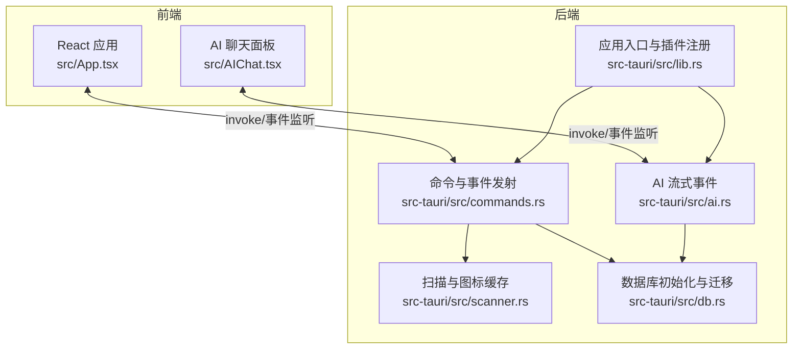
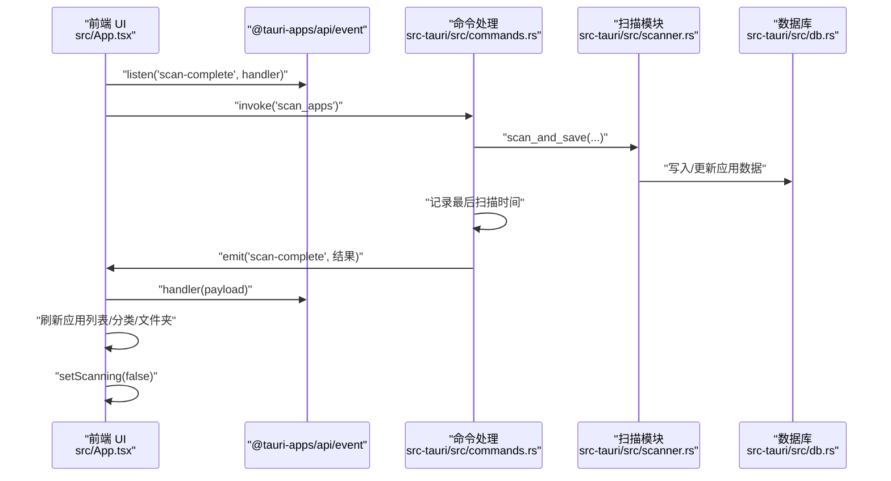
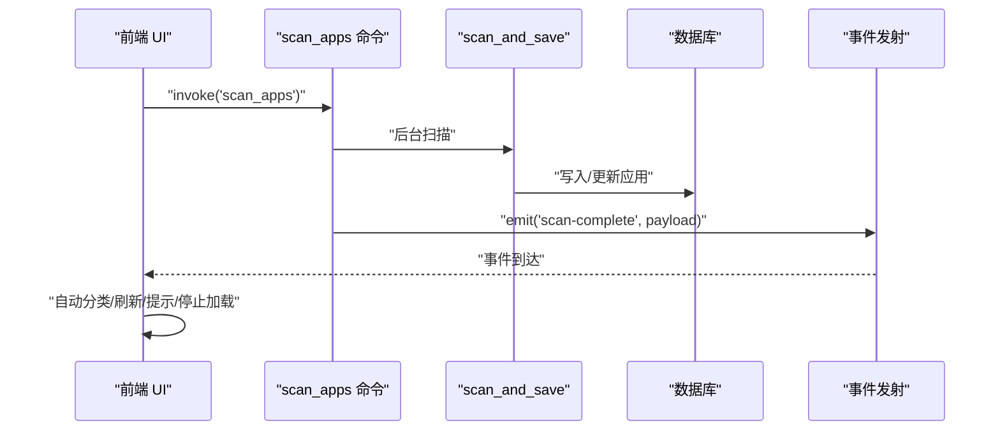
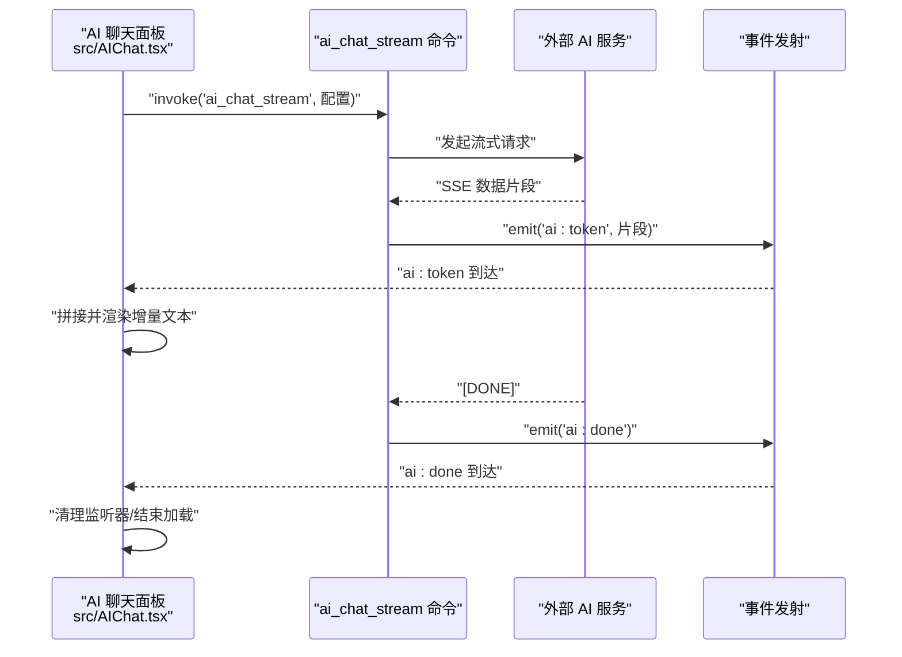
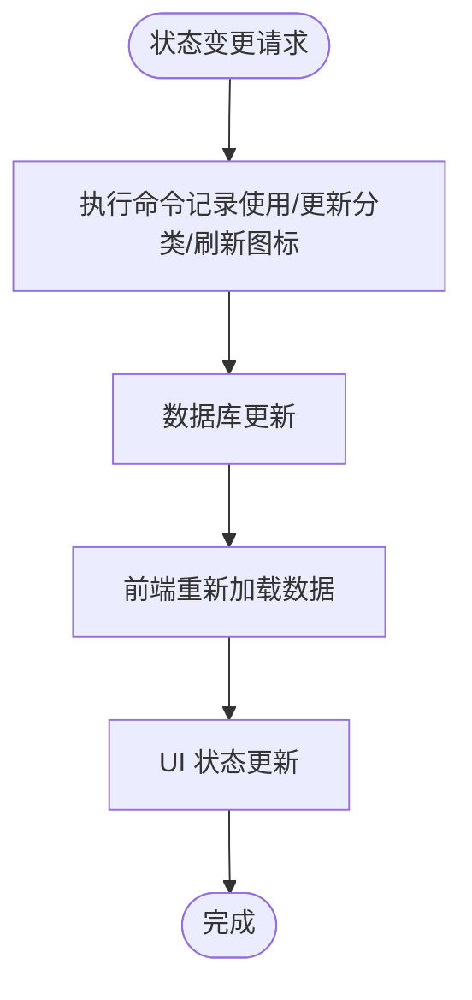
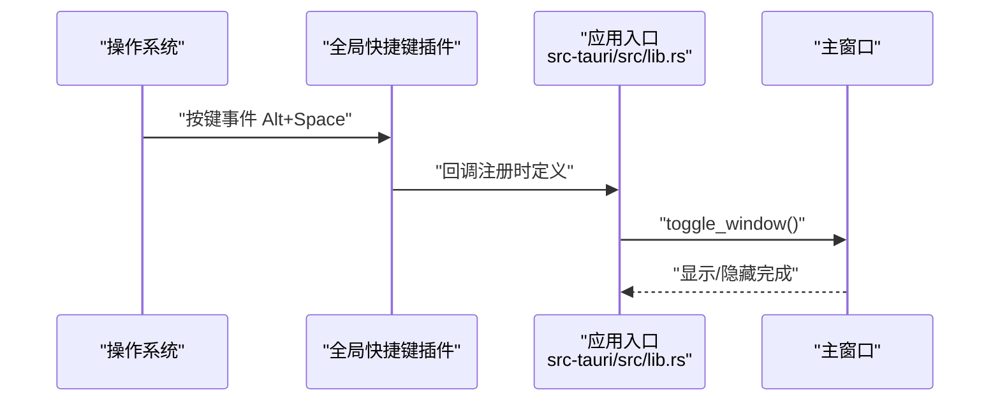
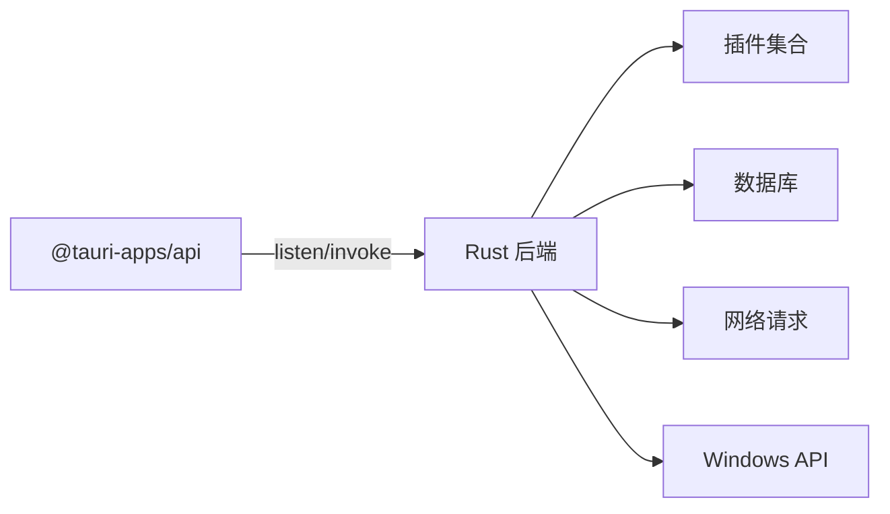

# 事件处理机制

<cite>
**本文档引用的文件**
- [src-tauri/src/lib.rs](file://src-tauri/src/lib.rs)
- [src-tauri/src/main.rs](file://src-tauri/src/main.rs)
- [src-tauri/src/commands.rs](file://src-tauri/src/commands.rs)
- [src-tauri/src/scanner.rs](file://src-tauri/src/scanner.rs)
- [src-tauri/src/ai.rs](file://src-tauri/src/ai.rs)
- [src/App.tsx](file://src/App.tsx)
- [src/AIChat.tsx](file://src/AIChat.tsx)
- [src-tauri/src/db.rs](file://src-tauri/src/db.rs)
- [src-tauri/Cargo.toml](file://src-tauri/Cargo.toml)
- [src-tauri/tauri.conf.json](file://src-tauri/tauri.conf.json)
</cite>

## 目录
1. [简介](#简介)
2. [项目结构](#项目结构)
3. [核心组件](#核心组件)
4. [架构总览](#架构总览)
5. [详细组件分析](#详细组件分析)
6. [依赖关系分析](#依赖关系分析)
7. [性能考虑](#性能考虑)
8. [故障排查指南](#故障排查指南)
9. [结论](#结论)
10. [附录](#附录)

## 简介
本文件系统性梳理 QuickStart 项目中的事件处理机制，重点覆盖 Tauri 事件系统在 Rust 后端与前端 React 之间的交互，包括事件发射（Emitter）、事件监听与异步事件处理。文档聚焦三类事件场景：
- 扫描完成事件（scan-complete）：后台扫描应用完成后通知前端刷新界面与执行后续任务
- 应用状态变更事件：通过命令与数据库交互间接影响前端状态
- 系统事件：全局快捷键、托盘点击等系统级事件的处理与联动

同时，文档涵盖事件生命周期管理、事件队列与过滤机制、最佳实践、性能优化、内存管理、调试技巧、错误处理与订阅管理，并提供可复用的事件处理模式与代码示例路径。

## 项目结构
项目采用典型的 Tauri 双端架构：Rust 后端负责业务逻辑与系统集成，前端 React 负责 UI 与事件监听。事件在后端通过命令触发，在前端通过 @tauri-apps/api/event 订阅。

**图表来源**
- [src-tauri/src/lib.rs:22-134](file://src-tauri/src/lib.rs#L22-L134)
- [src-tauri/src/commands.rs:230-249](file://src-tauri/src/commands.rs#L230-L249)
- [src-tauri/src/ai.rs:60-254](file://src-tauri/src/ai.rs#L60-L254)
- [src-tauri/src/scanner.rs:288-326](file://src-tauri/src/scanner.rs#L288-L326)
- [src-tauri/src/db.rs:16-133](file://src-tauri/src/db.rs#L16-L133)
- [src/App.tsx:343-409](file://src/App.tsx#L343-L409)
- [src/AIChat.tsx:83-161](file://src/AIChat.tsx#L83-L161)

**章节来源**
- [src-tauri/src/lib.rs:22-134](file://src-tauri/src/lib.rs#L22-L134)
- [src-tauri/src/commands.rs:230-249](file://src-tauri/src/commands.rs#L230-L249)
- [src-tauri/src/ai.rs:60-254](file://src-tauri/src/ai.rs#L60-L254)
- [src-tauri/src/scanner.rs:288-326](file://src-tauri/src/scanner.rs#L288-L326)
- [src-tauri/src/db.rs:16-133](file://src-tauri/src/db.rs#L16-L133)
- [src/App.tsx:343-409](file://src/App.tsx#L343-L409)
- [src/AIChat.tsx:83-161](file://src/AIChat.tsx#L83-L161)

## 核心组件
- 应用入口与插件注册：在应用启动时注册插件、全局快捷键、托盘与窗口行为，并托管共享状态（数据库连接）
- 命令与事件发射：通过命令实现异步任务（如扫描），在任务完成后通过 AppHandle.emit 发射事件
- 事件监听（前端）：前端通过 @tauri-apps/api/event.listen 订阅后端发射的事件，更新 UI 与执行后续逻辑
- AI 流式事件：AI 对话采用 SSE 流式传输，后端逐段 emit 事件，前端实时渲染
- 数据库与设置：初始化数据库表结构与默认设置，支撑应用状态持久化

**章节来源**
- [src-tauri/src/lib.rs:22-134](file://src-tauri/src/lib.rs#L22-L134)
- [src-tauri/src/commands.rs:230-249](file://src-tauri/src/commands.rs#L230-L249)
- [src-tauri/src/ai.rs:60-254](file://src-tauri/src/ai.rs#L60-L254)
- [src-tauri/src/db.rs:16-133](file://src-tauri/src/db.rs#L16-L133)

## 架构总览
事件在系统内的流转路径如下：

**图表来源**
- [src-tauri/src/commands.rs:230-249](file://src-tauri/src/commands.rs#L230-L249)
- [src-tauri/src/scanner.rs:185-228](file://src-tauri/src/scanner.rs#L185-L228)
- [src-tauri/src/db.rs:16-133](file://src-tauri/src/db.rs#L16-L133)
- [src/App.tsx:343-409](file://src/App.tsx#L343-L409)

## 详细组件分析

### 扫描完成事件（scan-complete）
- 触发时机：命令 scan_apps 在后台线程完成扫描与入库后，通过 AppHandle.emit 发射 scan-complete 事件
- 事件负载：包含扫描结果（应用列表与新增数量）
- 前端处理：前端监听该事件，执行自动分类、刷新数据、提示用户并结束扫描状态

**图表来源**
- [src-tauri/src/commands.rs:230-249](file://src-tauri/src/commands.rs#L230-L249)
- [src-tauri/src/scanner.rs:185-228](file://src-tauri/src/scanner.rs#L185-L228)
- [src/App.tsx:393-409](file://src/App.tsx#L393-L409)

**章节来源**
- [src-tauri/src/commands.rs:230-249](file://src-tauri/src/commands.rs#L230-L249)
- [src-tauri/src/scanner.rs:185-228](file://src-tauri/src/scanner.rs#L185-L228)
- [src/App.tsx:343-409](file://src/App.tsx#L343-L409)

### AI 流式事件（ai:token 与 ai:done）
- 触发机制：ai_chat_stream 命令在收到 AI 服务端的 SSE 数据片段时，逐段 emit ai:token；当流结束时 emit ai:done
- 前端处理：前端在发送消息前清理旧监听器，分别监听 ai:token 与 ai:done，将增量文本拼接到消息流中，并在 ai:done 时完成收尾

**图表来源**
- [src-tauri/src/ai.rs:60-254](file://src-tauri/src/ai.rs#L60-L254)
- [src/AIChat.tsx:83-161](file://src/AIChat.tsx#L83-L161)

**章节来源**
- [src-tauri/src/ai.rs:60-254](file://src-tauri/src/ai.rs#L60-L254)
- [src/AIChat.tsx:83-161](file://src/AIChat.tsx#L83-L161)

### 应用状态变更事件
- 状态来源：应用状态主要通过命令与数据库交互体现，例如记录应用使用、更新分类、刷新图标等
- 前端联动：前端在相应操作后主动重新拉取数据，或在特定事件（如扫描完成）后刷新状态

**图表来源**
- [src-tauri/src/commands.rs:218-228](file://src-tauri/src/commands.rs#L218-L228)
- [src-tauri/src/commands.rs:153-194](file://src-tauri/src/commands.rs#L153-L194)
- [src-tauri/src/commands.rs:417-443](file://src-tauri/src/commands.rs#L417-L443)

**章节来源**
- [src-tauri/src/commands.rs:218-228](file://src-tauri/src/commands.rs#L218-L228)
- [src-tauri/src/commands.rs:153-194](file://src-tauri/src/commands.rs#L153-L194)
- [src-tauri/src/commands.rs:417-443](file://src-tauri/src/commands.rs#L417-L443)

### 系统事件（全局快捷键与托盘）
- 全局快捷键：应用启动时注册 Alt+Space，按下时切换窗口显示/隐藏
- 托盘事件：托盘菜单与图标点击事件同样触发窗口切换

**图表来源**
- [src-tauri/src/lib.rs:62-66](file://src-tauri/src/lib.rs#L62-L66)
- [src-tauri/src/lib.rs:30-38](file://src-tauri/src/lib.rs#L30-L38)
- [src-tauri/src/tray.rs:29-54](file://src-tauri/src/tray.rs#L29-L54)

**章节来源**
- [src-tauri/src/lib.rs:62-66](file://src-tauri/src/lib.rs#L62-L66)
- [src-tauri/src/lib.rs:30-38](file://src-tauri/src/lib.rs#L30-L38)
- [src-tauri/src/tray.rs:29-54](file://src-tauri/src/tray.rs#L29-L54)

## 依赖关系分析
- Rust 依赖：Tauri 核心、各插件（shell、dialog、opener、process、global-shortcut、autostart）、数据库（rusqlite）、网络（reqwest）、图像处理（png）、Windows API（windows）等
- 前端依赖：@tauri-apps/api（invoke、event）、@tauri-apps/plugin-dialog 等
- 事件相关：前端通过 @tauri-apps/api/event.listen 订阅后端 emit 的自定义事件

**图表来源**
- [src-tauri/Cargo.toml:15-36](file://src-tauri/Cargo.toml#L15-L36)
- [src-tauri/src/lib.rs:23-43](file://src-tauri/src/lib.rs#L23-L43)
- [src-tauri/src/ai.rs:69-94](file://src-tauri/src/ai.rs#L69-L94)
- [src-tauri/src/commands.rs:230-249](file://src-tauri/src/commands.rs#L230-L249)

**章节来源**
- [src-tauri/Cargo.toml:15-36](file://src-tauri/Cargo.toml#L15-L36)
- [src-tauri/src/lib.rs:23-43](file://src-tauri/src/lib.rs#L23-L43)
- [src-tauri/src/ai.rs:69-94](file://src-tauri/src/ai.rs#L69-L94)
- [src-tauri/src/commands.rs:230-249](file://src-tauri/src/commands.rs#L230-L249)

## 性能考虑
- 异步与线程池：扫描与图标提取等耗时任务通过异步运行时与线程池执行，避免阻塞 UI
- 事件粒度：AI 流式事件按片段 emit，前端即时渲染，降低感知延迟
- 数据库访问：命令中对数据库的操作在受控范围内进行，避免并发竞争
- 图标缓存：扫描模块提供图标缓存，减少重复提取与 IO

**章节来源**
- [src-tauri/src/commands.rs:230-249](file://src-tauri/src/commands.rs#L230-L249)
- [src-tauri/src/ai.rs:60-254](file://src-tauri/src/ai.rs#L60-L254)
- [src-tauri/src/scanner.rs:288-326](file://src-tauri/src/scanner.rs#L288-L326)

## 故障排查指南
- 事件未到达前端
  - 检查前端是否正确监听对应事件名
  - 确认后端 emit 的事件名与前端监听一致
  - 参考：扫描完成事件监听与 AI 事件监听
- 扫描失败导致状态异常
  - 前端在调用 scan_apps 时已处理失败分支，setScanning(false) 以避免 UI 卡死
  - 参考：前端扫描失败处理
- AI 事件监听未清理
  - 前端在每次发送消息前清理旧监听器，防止多次订阅导致内存泄漏
  - 参考：AI 聊天面板事件监听清理
- 数据库初始化失败
  - 应用启动时会尝试初始化数据库表与默认设置，失败会打印错误信息
  - 参考：数据库初始化与迁移

**章节来源**
- [src/App.tsx:343-409](file://src/App.tsx#L343-L409)
- [src/AIChat.tsx:83-161](file://src/AIChat.tsx#L83-L161)
- [src-tauri/src/db.rs:16-133](file://src-tauri/src/db.rs#L16-L133)

## 结论
本项目基于 Tauri 的事件系统实现了清晰的前后端解耦：后端通过命令与 AppHandle.emit 发射事件，前端通过 @tauri-apps/api/event.listen 订阅并更新 UI。扫描完成事件与 AI 流式事件是两个典型场景，前者用于后台任务完成后的状态刷新，后者用于实时渲染大模型输出。配合数据库初始化、全局快捷键与托盘事件，系统形成了稳定、可扩展的事件处理机制。

## 附录

### 事件处理最佳实践
- 事件命名规范：使用语义化前缀区分领域（如 ai:、scan-）
- 前端订阅管理：每次创建新的订阅前清理旧订阅，避免重复监听
- 后端错误处理：命令内部捕获错误并返回统一错误信息，前端据此提示用户
- 异步任务：耗时任务在后台线程执行，完成后 emit 事件通知前端
- 数据一致性：事件触发后，前端主动刷新数据或执行必要的后续任务

### 事件处理代码示例路径
- 扫描完成事件发射与监听
  - 后端：[src-tauri/src/commands.rs:230-249](file://src-tauri/src/commands.rs#L230-L249)
  - 前端：[src/App.tsx:393-409](file://src/App.tsx#L393-L409)
- AI 流式事件发射与监听
  - 后端：[src-tauri/src/ai.rs:60-254](file://src-tauri/src/ai.rs#L60-L254)
  - 前端：[src/AIChat.tsx:83-161](file://src/AIChat.tsx#L83-L161)
- 全局快捷键与托盘事件
  - 后端：[src-tauri/src/lib.rs:30-38](file://src-tauri/src/lib.rs#L30-L38), [src-tauri/src/lib.rs:62-66](file://src-tauri/src/lib.rs#L62-L66)
  - 前端：[src-tauri/src/tray.rs:29-54](file://src-tauri/src/tray.rs#L29-L54)