# 后端API接口

<cite>
**本文档引用的文件**
- [main.rs](file://src-tauri/src/main.rs)
- [lib.rs](file://src-tauri/src/lib.rs)
- [commands.rs](file://src-tauri/src/commands.rs)
- [db.rs](file://src-tauri/src/db.rs)
- [scanner.rs](file://src-tauri/src/scanner.rs)
- [classifier.rs](file://src-tauri/src/classifier.rs)
- [ai.rs](file://src-tauri/src/ai.rs)
- [tray.rs](file://src-tauri/src/tray.rs)
- [window_utils.rs](file://src-tauri/src/window_utils.rs)
- [pe_utils.rs](file://src-tauri/src/pe_utils.rs)
- [Cargo.toml](file://src-tauri/Cargo.toml)
- [tauri.conf.json](file://src-tauri/tauri.conf.json)
- [default.json](file://src-tauri/capabilities/default.json)
</cite>

## 目录
1. [简介](#简介)
2. [项目结构](#项目结构)
3. [核心组件](#核心组件)
4. [架构概览](#架构概览)
5. [详细组件分析](#详细组件分析)
6. [依赖关系分析](#依赖关系分析)
7. [性能考虑](#性能考虑)
8. [故障排除指南](#故障排除指南)
9. [结论](#结论)

## 简介

QuickStart 是一个基于 Tauri 框架构建的 Windows 桌面快捷启动器。该项目提供了完整的后端 API 接口，包括应用管理、文件扫描、AI 功能、系统集成等功能。本文档详细记录了所有 Tauri 命令接口、数据库操作和系统集成 API，涵盖了命令定义规范、参数验证、错误处理和异步处理模式。

## 项目结构

QuickStart 采用模块化设计，主要分为以下几个核心模块：

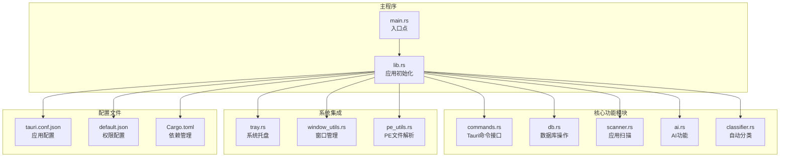

**图表来源**
- [main.rs:1-7](file://src-tauri/src/main.rs#L1-L7)
- [lib.rs:1-135](file://src-tauri/src/lib.rs#L1-L135)

**章节来源**
- [main.rs:1-7](file://src-tauri/src/main.rs#L1-L7)
- [lib.rs:1-135](file://src-tauri/src/lib.rs#L1-L135)

## 核心组件

### 应用状态管理

应用使用 `AppState` 结构体来管理共享状态，包括数据库路径和连接：

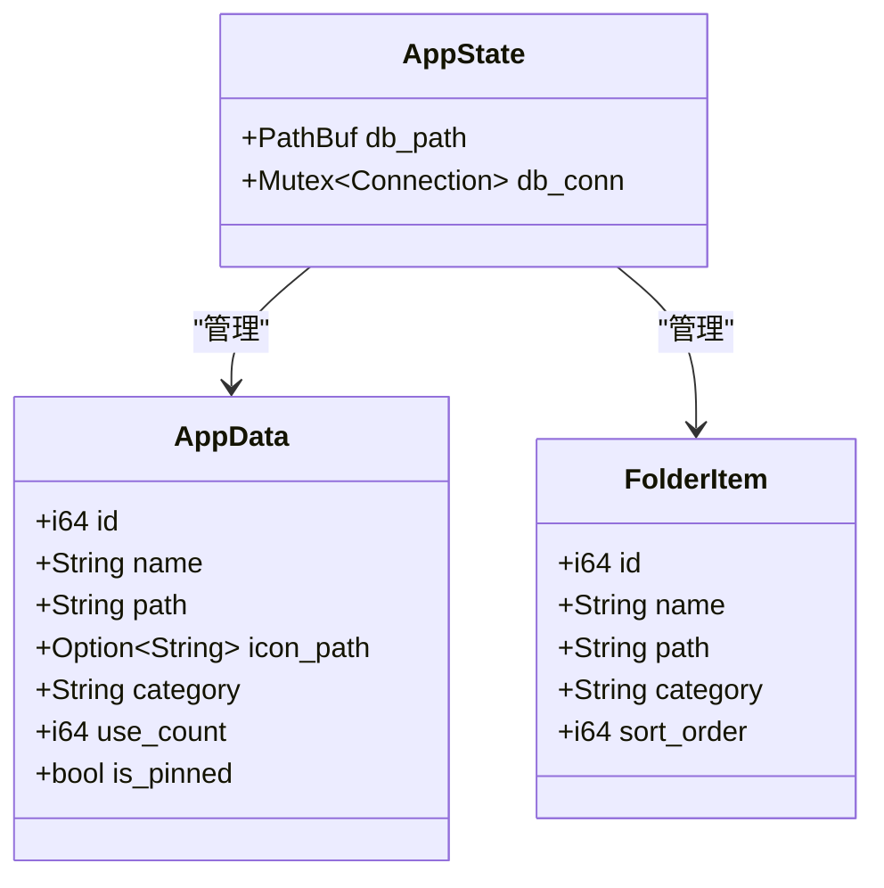

**图表来源**
- [lib.rs:14-17](file://src-tauri/src/lib.rs#L14-L17)
- [commands.rs:11-29](file://src-tauri/src/commands.rs#L11-L29)

### 数据库连接池

应用使用互斥锁保护数据库连接，确保线程安全：

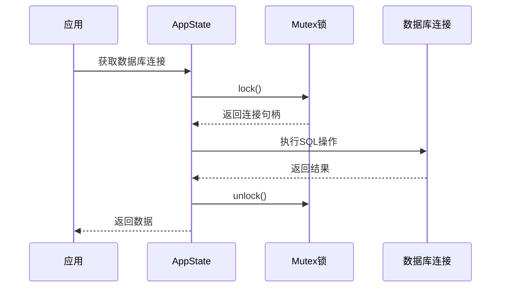

**图表来源**
- [lib.rs:56-59](file://src-tauri/src/lib.rs#L56-L59)
- [commands.rs:33-47](file://src-tauri/src/commands.rs#L33-L47)

**章节来源**
- [lib.rs:14-17](file://src-tauri/src/lib.rs#L14-L17)
- [commands.rs:11-29](file://src-tauri/src/commands.rs#L11-L29)

## 架构概览

QuickStart 采用了分层架构设计，将业务逻辑与系统集成分离：

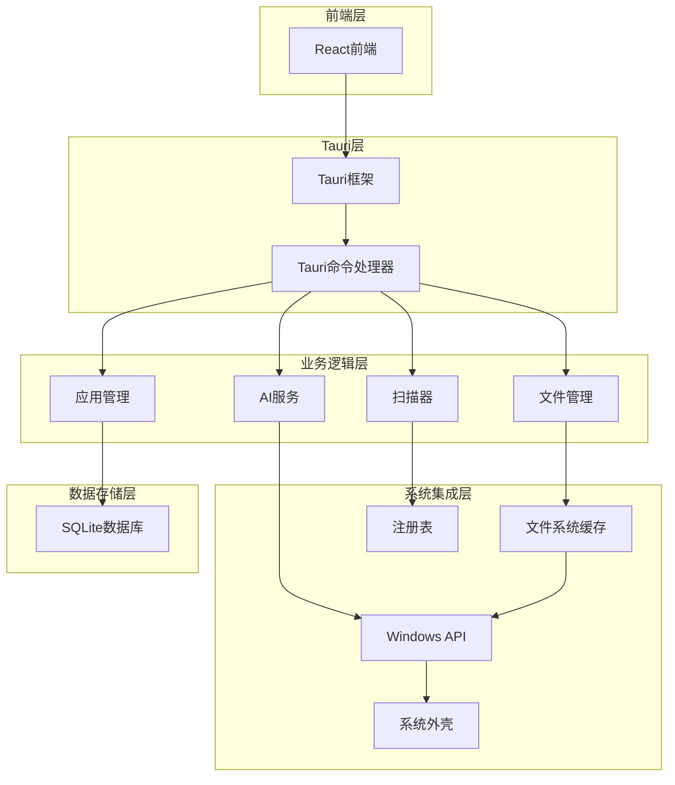

**图表来源**
- [lib.rs:22-134](file://src-tauri/src/lib.rs#L22-L134)
- [commands.rs:32-709](file://src-tauri/src/commands.rs#L32-L709)

## 详细组件分析

### 应用管理API

应用管理模块提供了完整的 CRUD 操作和高级功能：

#### 应用列表管理

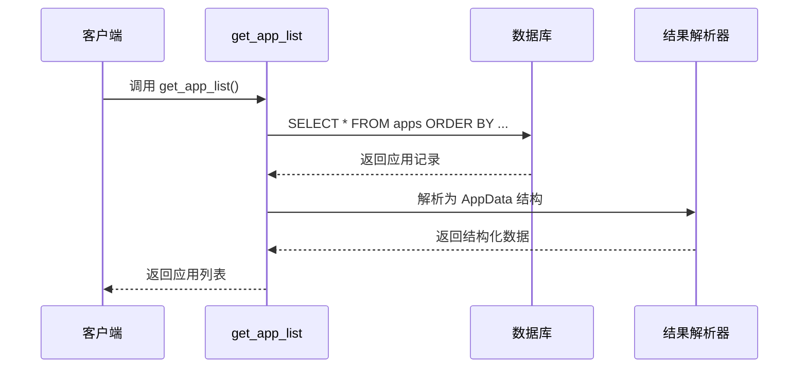

**图表来源**
- [commands.rs:528-552](file://src-tauri/src/commands.rs#L528-L552)

#### 应用分类管理

应用支持动态分类管理，包括分类创建、更新和删除：

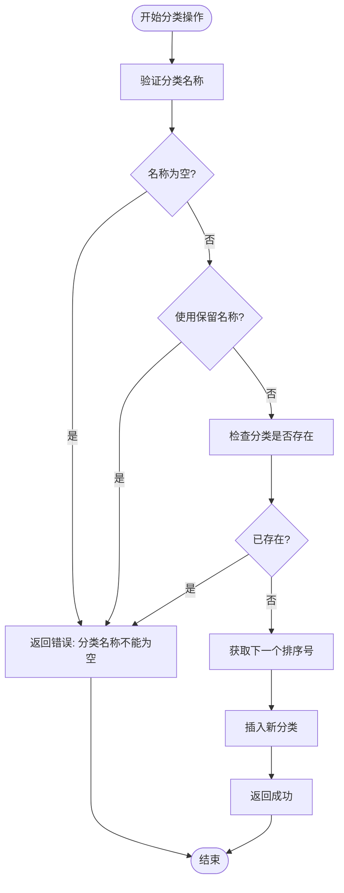

**图表来源**
- [commands.rs:50-89](file://src-tauri/src/commands.rs#L50-L89)

**章节来源**
- [commands.rs:31-194](file://src-tauri/src/commands.rs#L31-L194)

### 文件扫描API

文件扫描模块实现了智能的应用发现和过滤机制：

#### 应用扫描流程

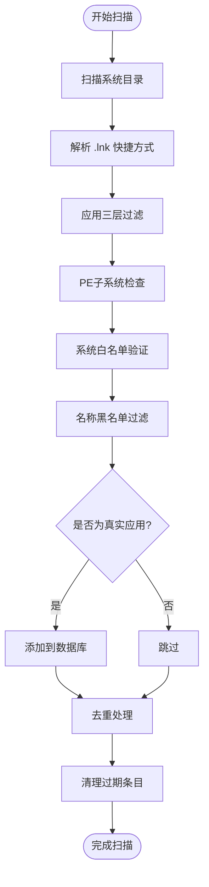

**图表来源**
- [scanner.rs:96-153](file://src-tauri/src/scanner.rs#L96-L153)
- [scanner.rs:185-228](file://src-tauri/src/scanner.rs#L185-L228)

#### 图标提取机制

应用使用纯 Win32 API 提取应用程序图标，避免系统调用开销：

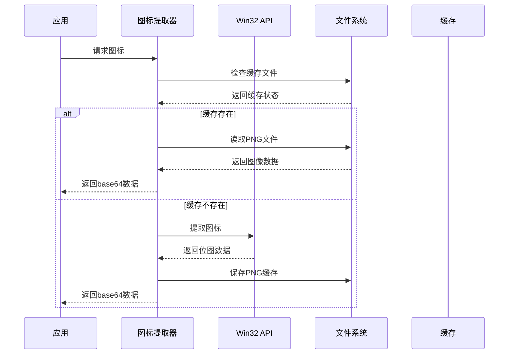

**图表来源**
- [scanner.rs:288-326](file://src-tauri/src/scanner.rs#L288-L326)

**章节来源**
- [scanner.rs:1-483](file://src-tauri/src/scanner.rs#L1-L483)

### AI集成API

AI模块提供了多种大模型提供商的支持和智能分类功能：

#### AI聊天流式处理

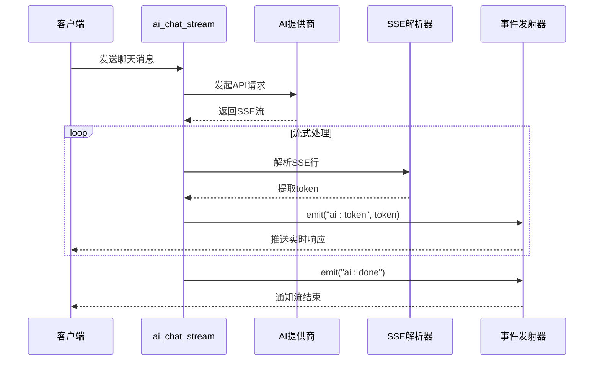

**图表来源**
- [ai.rs:60-254](file://src-tauri/src/ai.rs#L60-L254)

#### 目录安全访问

AI模块实现了严格的路径访问控制，防止路径遍历攻击：

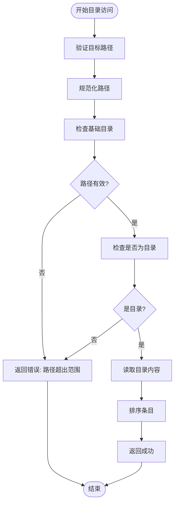

**图表来源**
- [ai.rs:256-319](file://src-tauri/src/ai.rs#L256-L319)

**章节来源**
- [ai.rs:1-501](file://src-tauri/src/ai.rs#L1-L501)

### 系统集成API

系统集成模块提供了 Windows 平台特有的功能：

#### 系统托盘管理

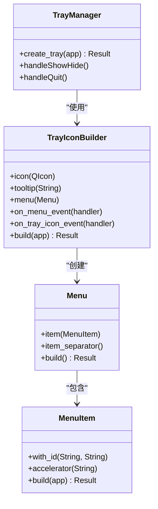

**图表来源**
- [tray.rs:8-58](file://src-tauri/src/tray.rs#L8-L58)

#### 窗口管理

应用实现了智能的窗口定位和显示控制：

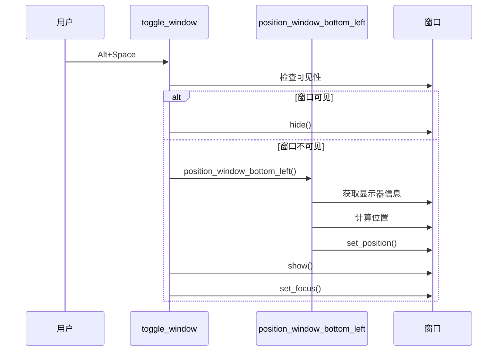

**图表来源**
- [window_utils.rs:45-55](file://src-tauri/src/window_utils.rs#L45-L55)

**章节来源**
- [tray.rs:1-59](file://src-tauri/src/tray.rs#L1-L59)
- [window_utils.rs:1-56](file://src-tauri/src/window_utils.rs#L1-L56)

## 依赖关系分析

### 核心依赖关系

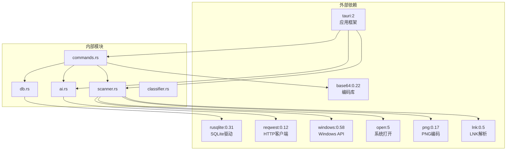

**图表来源**
- [Cargo.toml:15-36](file://src-tauri/Cargo.toml#L15-L36)

### 数据库模式

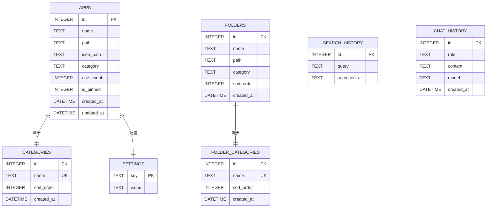

**图表来源**
- [db.rs:51-130](file://src-tauri/src/db.rs#L51-L130)

**章节来源**
- [Cargo.toml:15-36](file://src-tauri/Cargo.toml#L15-L36)
- [db.rs:1-156](file://src-tauri/src/db.rs#L1-156)

## 性能考虑

### 异步处理模式

QuickStart 采用了多种异步处理策略来优化性能：

1. **扫描操作异步化**：应用扫描使用 `spawn_blocking` 在后台线程执行，避免阻塞主线程
2. **图标提取异步化**：图标提取使用异步运行时，减少I/O等待时间
3. **网络请求异步化**：AI API 调用使用异步 HTTP 客户端

### 缓存策略

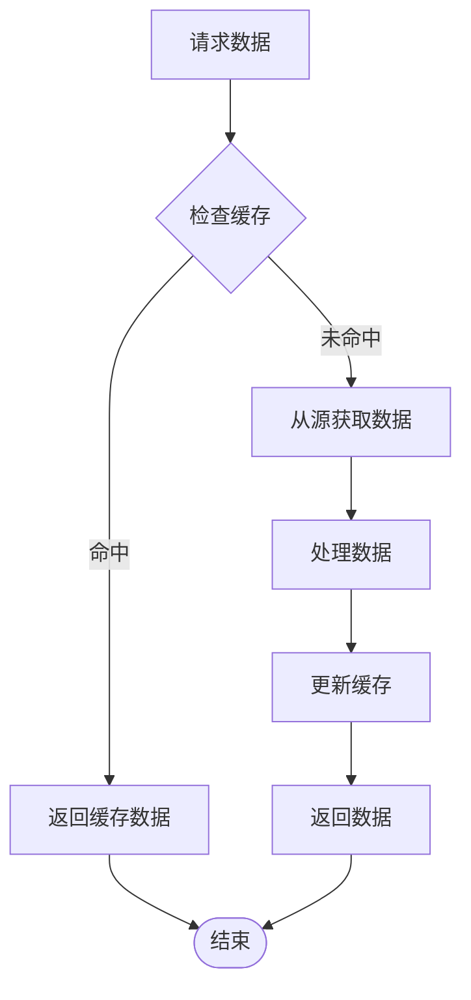

### 内存管理

应用使用互斥锁保护共享资源，避免内存竞争：

- 数据库连接使用 `Mutex<Connection>` 包装
- 状态管理使用 `Arc<Mutex<T>>` 模式
- 图标缓存使用文件系统持久化

## 故障排除指南

### 常见错误处理

#### 数据库连接错误

当数据库连接失败时，应用会返回详细的错误信息：

```rust
// 错误处理示例
let conn = state.db_conn.lock().map_err(|e| e.to_string())?;
let result = conn.execute("INSERT INTO apps (name) VALUES (?1)", [name])
    .map_err(|e| e.to_string())?;
```

#### 文件系统访问错误

文件操作失败时，应用会提供具体的错误描述：

```rust
// 文件访问错误处理
std::fs::read_dir(dir)
    .map_err(|e| format!("读取目录失败: {}", e))?;
```

#### 网络请求错误

AI API 调用失败时，应用会区分不同类型的错误：

```rust
// 网络请求错误处理
let resp = client.get(&url)
    .send().await
    .map_err(|e| format!("请求失败: {}", e))?;

if !resp.status().is_success() {
    let status = resp.status();
    let body = resp.text().await.unwrap_or_default();
    return Err(format!("API请求失败: {} - {}", status, body).into());
}
```

**章节来源**
- [commands.rs:33-47](file://src-tauri/src/commands.rs#L33-L47)
- [ai.rs:96-100](file://src-tauri/src/ai.rs#L96-L100)

## 结论

QuickStart 的后端API接口设计体现了现代桌面应用的最佳实践：

### 主要特性

1. **模块化架构**：清晰的功能分离，便于维护和扩展
2. **异步处理**：充分利用 Rust 的异步能力，提供流畅的用户体验
3. **安全性**：严格的输入验证和路径访问控制
4. **跨平台兼容**：基于 Tauri 框架，支持 Windows 平台的深度集成
5. **性能优化**：智能缓存、异步I/O和内存管理

### 技术亮点

- **智能应用扫描**：使用三层过滤机制确保扫描质量
- **AI集成**：支持多种大模型提供商，提供流式响应
- **系统集成**：完整的 Windows 平台特性支持
- **数据持久化**：基于 SQLite 的可靠数据存储

### 扩展建议

1. **监控和日志**：添加应用性能监控和详细日志记录
2. **配置热重载**：支持运行时配置修改
3. **插件系统**：为第三方扩展提供接口
4. **测试覆盖**：增加单元测试和集成测试