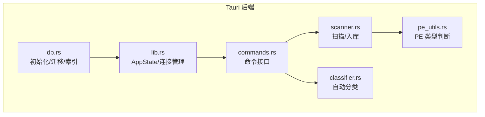
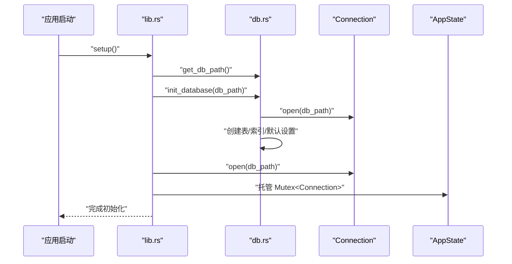
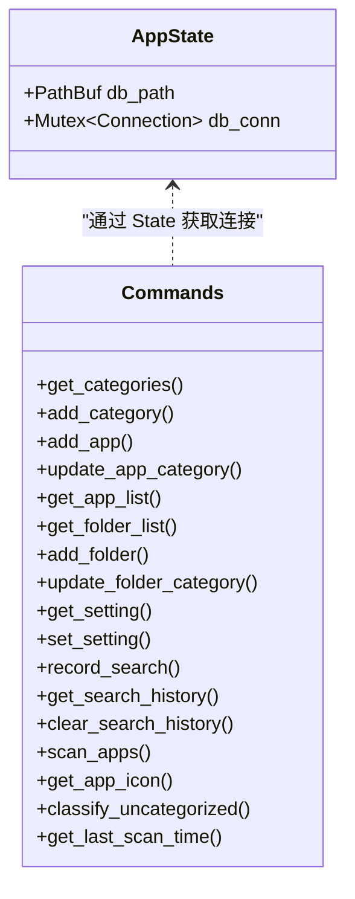
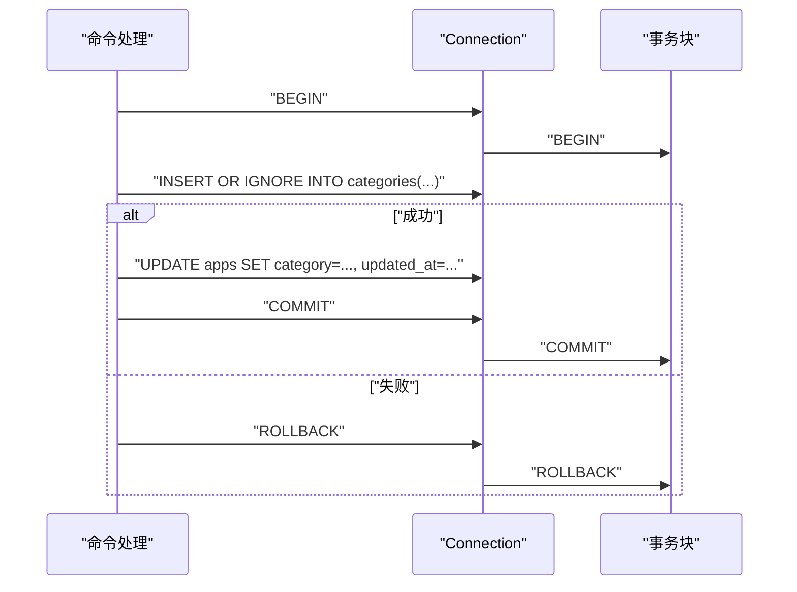
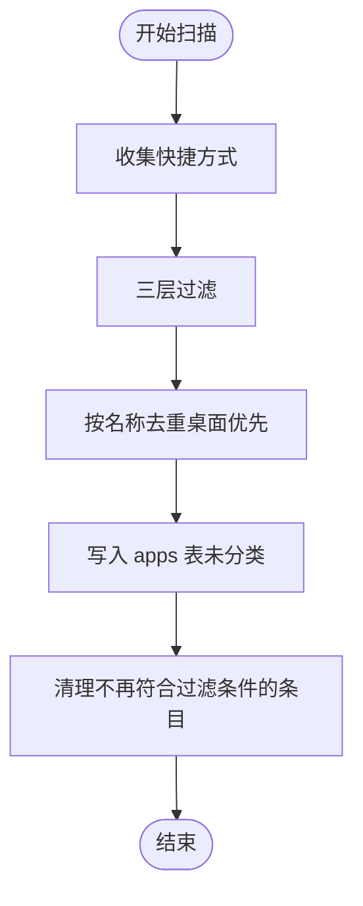
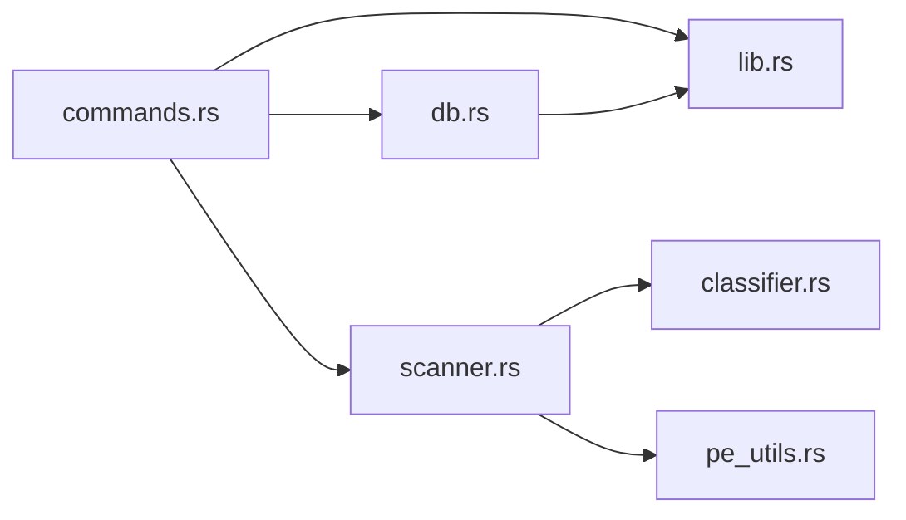

# 数据库操作接口

<cite>
**本文引用的文件**
- [db.rs](file://src-tauri/src/db.rs)
- [lib.rs](file://src-tauri/src/lib.rs)
- [commands.rs](file://src-tauri/src/commands.rs)
- [scanner.rs](file://src-tauri/src/scanner.rs)
- [classifier.rs](file://src-tauri/src/classifier.rs)
- [pe_utils.rs](file://src-tauri/src/pe_utils.rs)
- [Cargo.toml](file://src-tauri/Cargo.toml)
</cite>

## 目录
1. [简介](#简介)
2. [项目结构](#项目结构)
3. [核心组件](#核心组件)
4. [架构总览](#架构总览)
5. [详细组件分析](#详细组件分析)
6. [依赖关系分析](#依赖关系分析)
7. [性能考量](#性能考量)
8. [故障排查指南](#故障排查指南)
9. [结论](#结论)
10. [附录](#附录)

## 简介
本文件面向数据库操作接口，系统性梳理 SQLite 数据库在应用中的表结构设计、查询接口与数据访问模式。内容覆盖应用表、文件夹表、分类表、设置表、搜索历史表等数据模型；记录数据库初始化流程、连接管理、事务处理与并发控制；提供查询优化策略、索引设计与性能考虑；并给出错误处理机制与数据一致性保障方案。文档同时给出各模块的调用序列与时序图，帮助开发者快速理解与扩展。

## 项目结构
数据库相关代码集中在 Tauri 后端模块中，采用“初始化 + 全局连接 + 命令接口”的分层组织方式：
- 初始化与表结构：db.rs
- 全局状态与连接：lib.rs 中的 AppState
- 查询与业务接口：commands.rs
- 扫描与入库：scanner.rs
- 分类器：classifier.rs
- PE 类型判断：pe_utils.rs
- 依赖声明：Cargo.toml

图表来源
- [db.rs:17-133](file://src-tauri/src/db.rs#L17-L133)
- [lib.rs:44-59](file://src-tauri/src/lib.rs#L44-L59)
- [commands.rs:32-552](file://src-tauri/src/commands.rs#L32-L552)
- [scanner.rs:186-228](file://src-tauri/src/scanner.rs#L186-L228)
- [classifier.rs:77-114](file://src-tauri/src/classifier.rs#L77-L114)
- [pe_utils.rs:37-104](file://src-tauri/src/pe_utils.rs#L37-L104)

章节来源
- [db.rs:17-133](file://src-tauri/src/db.rs#L17-L133)
- [lib.rs:44-59](file://src-tauri/src/lib.rs#L44-L59)

## 核心组件
- 数据库初始化与迁移：负责创建表、索引与默认设置，并兼容既有表结构的列变更。
- 全局连接管理：通过 AppState 暴露互斥的数据库连接，供命令处理函数安全使用。
- 命令接口层：封装 CRUD 与业务查询，统一错误处理与返回格式。
- 扫描与入库：从系统快捷方式扫描应用，过滤后批量写入数据库。
- 自动分类：基于关键词规则对未分类应用进行批量分类。
- 并发与事务：在需要原子性的场景使用显式事务，确保一致性。

章节来源
- [db.rs:17-133](file://src-tauri/src/db.rs#L17-L133)
- [lib.rs:14-17](file://src-tauri/src/lib.rs#L14-L17)
- [commands.rs:32-709](file://src-tauri/src/commands.rs#L32-L709)
- [scanner.rs:186-228](file://src-tauri/src/scanner.rs#L186-L228)
- [classifier.rs:77-114](file://src-tauri/src/classifier.rs#L77-L114)

## 架构总览
数据库初始化与连接管理贯穿应用生命周期。初始化阶段创建表与索引，随后建立全局连接并托管给 AppState。命令接口通过锁住全局连接进行读写，扫描与分类作为后台任务或异步命令执行，确保 UI 不被阻塞。

图表来源
- [lib.rs:44-59](file://src-tauri/src/lib.rs#L44-L59)
- [db.rs:17-133](file://src-tauri/src/db.rs#L17-L133)

## 详细组件分析

### 数据库初始化与迁移
- 初始化流程
  - 计算应用数据目录并创建数据库文件路径。
  - 打开连接后执行多段 SQL：创建搜索历史表并建立索引；创建应用、分类、文件夹、文件夹分类、设置、聊天历史表；迁移 folders 表新增 category 列并创建 folder_categories 表；将现有 apps 与 folders 的分类同步到对应分类表；插入默认设置项。
- 迁移策略
  - 使用 PRAGMA table_info 检测列是否存在，仅在缺失时添加列并补充相关表与索引。
  - INSERT OR IGNORE 保证默认分类与设置的幂等性。
- 索引设计
  - 搜索历史表：按查询词与时间建立索引，支持去重插入与限制历史数量的查询。
  - 分类表：按 sort_order 与 name 排序，支持面板展示与排序。
- 默认设置
  - 提供热键、开机自启、主题、自动分类、AI Provider 等键值对，便于前端读取与修改。

章节来源
- [db.rs:6-14](file://src-tauri/src/db.rs#L6-L14)
- [db.rs:17-133](file://src-tauri/src/db.rs#L17-L133)

### 连接管理与并发控制
- 全局连接托管
  - AppState 持有数据库路径与互斥的 Connection，命令处理函数通过 State 获取连接。
- 并发访问
  - 通过 Mutex<Connection> 串行化所有数据库访问，避免并发写导致的锁竞争与死锁。
- 异步场景
  - 扫描应用与获取图标等耗时操作在后台线程执行，避免阻塞主线程；必要时临时打开独立连接。

图表来源
- [lib.rs:14-17](file://src-tauri/src/lib.rs#L14-L17)
- [commands.rs:32-709](file://src-tauri/src/commands.rs#L32-L709)

章节来源
- [lib.rs:14-17](file://src-tauri/src/lib.rs#L14-L17)
- [lib.rs:44-59](file://src-tauri/src/lib.rs#L44-L59)

### 查询接口与数据访问模式
- 应用表（apps）
  - 字段：id、name、path、icon_path、category、use_count、is_pinned、created_at、updated_at。
  - 查询模式：按 is_pinned、use_count、name 排序；支持按分类过滤；支持固定/取消固定；支持记录使用次数。
- 文件夹表（folders）
  - 字段：id、name、path、category、sort_order、created_at。
  - 查询模式：按 sort_order 与 name 排序；支持分类管理。
- 分类表（categories、folder_categories）
  - 字段：id、name、sort_order、created_at。
  - 查询模式：按 sort_order 与 name 排序；支持去重与顺序生成。
- 设置表（settings）
  - 键值对：key（主键）、value。
  - 查询模式：按 key 查询与更新；支持默认值插入。
- 搜索历史表（search_history）
  - 字段：id、query、searched_at。
  - 查询模式：去重插入、限制保留数量、按最新时间倒序取前若干条。

章节来源
- [db.rs:51-130](file://src-tauri/src/db.rs#L51-L130)
- [commands.rs:31-709](file://src-tauri/src/commands.rs#L31-L709)

### 事务处理与数据一致性
- 显式事务
  - 更新应用分类与更新文件夹分类均使用 BEGIN/COMMIT/ROLLBACK 包裹，确保 INSERT OR IGNORE 与 UPDATE 的原子性，避免竞态条件。
- 错误回滚
  - 任一步骤失败时立即回滚，保证数据不处于中间状态。
- 一致性保障
  - 分类同步：在写入应用或文件夹前，先将分类写入对应分类表，避免分类缺失导致的展示异常。
  - 扫描清理：扫描完成后清理不再符合过滤条件的历史条目，保持数据库整洁。

图表来源
- [commands.rs:170-193](file://src-tauri/src/commands.rs#L170-L193)
- [commands.rs:684-708](file://src-tauri/src/commands.rs#L684-L708)

章节来源
- [commands.rs:170-193](file://src-tauri/src/commands.rs#L170-L193)
- [commands.rs:684-708](file://src-tauri/src/commands.rs#L684-L708)

### 扫描与入库流程
- 扫描范围
  - 开始菜单与桌面快捷方式，支持子目录扫描。
- 过滤策略
  - 三层过滤：名称黑名单与后缀黑名单、系统白名单、PE 子系统判断。
- 入库逻辑
  - 去重（按名称），桌面优先；过滤后写入 apps 表，默认分类为“未分类”；扫描完成后清理不再符合过滤条件的旧条目。
- 图标提取
  - 使用 Win32 API 提取图标并缓存为 PNG，后续可按需读取或刷新。

图表来源
- [scanner.rs:186-228](file://src-tauri/src/scanner.rs#L186-L228)
- [scanner.rs:102-153](file://src-tauri/src/scanner.rs#L102-L153)
- [scanner.rs:288-326](file://src-tauri/src/scanner.rs#L288-L326)

章节来源
- [scanner.rs:186-228](file://src-tauri/src/scanner.rs#L186-L228)
- [scanner.rs:102-153](file://src-tauri/src/scanner.rs#L102-L153)
- [scanner.rs:288-326](file://src-tauri/src/scanner.rs#L288-L326)

### 自动分类与关键词规则
- 规则体系
  - 按关键词集合映射到“开发”“办公”“浏览器”“娱乐”“设计”“通讯”“系统工具”等分类。
- 批量分类
  - 遍历未分类应用，逐条分类并同步到分类表，避免重复分类。
- 性能与一致性
  - 分类过程同样使用事务包裹，保证批量更新的一致性。

章节来源
- [classifier.rs:77-114](file://src-tauri/src/classifier.rs#L77-L114)

### 设置与搜索历史接口
- 设置读写
  - 通过 settings 表的键值对存储用户偏好；支持默认值插入与 ON CONFLICT 更新。
- 搜索历史
  - 记录查询词并去重；限制最多保留 N 条；按最新时间倒序取前若干条。

章节来源
- [db.rs:89-129](file://src-tauri/src/db.rs#L89-L129)
- [commands.rs:565-597](file://src-tauri/src/commands.rs#L565-L597)

## 依赖关系分析
- 外部依赖
  - rusqlite：SQLite 绑定与连接管理。
  - tauri：命令注册、插件系统、窗口与托盘管理。
  - lnk：解析 .lnk 快捷方式目标。
  - windows：Win32 API 提取图标。
  - base64/png：图标编码与保存。
- 模块耦合
  - commands.rs 依赖 db.rs 的表结构与默认设置；scanner.rs 依赖 classifier.rs 的规则；pe_utils.rs 为扫描过滤提供 PE 类型判断。

图表来源
- [commands.rs:1-10](file://src-tauri/src/commands.rs#L1-L10)
- [scanner.rs:1-14](file://src-tauri/src/scanner.rs#L1-L14)
- [classifier.rs:1-4](file://src-tauri/src/classifier.rs#L1-L4)
- [pe_utils.rs:1-10](file://src-tauri/src/pe_utils.rs#L1-L10)
- [lib.rs:1-12](file://src-tauri/src/lib.rs#L1-L12)

章节来源
- [Cargo.toml:15-36](file://src-tauri/Cargo.toml#L15-L36)

## 性能考量
- 索引与查询优化
  - 搜索历史表：按查询词与时间建立索引，支持高效去重与限制数量的查询。
  - 分类表：按 sort_order 与 name 排序，减少排序成本。
- 批量操作
  - 扫描阶段按名称去重，避免重复写入；批量写入时尽量减少往返。
- 并发与锁
  - 全局互斥连接串行化访问，避免并发写导致的锁竞争；后台任务使用独立连接，降低阻塞风险。
- I/O 优化
  - 图标缓存避免重复提取；PNG 编码与文件系统写入在后台线程执行。

[本节为通用性能建议，无需特定文件引用]

## 故障排查指南
- 初始化失败
  - 检查应用数据目录权限与磁盘空间；确认数据库文件可创建与写入。
- 连接异常
  - 确认 AppState 正常托管；命令处理函数中连接获取是否成功；避免长时间持有锁。
- 事务回滚
  - 检查分类更新与文件夹分类更新的错误路径，确认 ROLLBACK 是否正确触发。
- 扫描结果异常
  - 检查过滤规则与系统白名单；确认 PE 类型判断逻辑；验证图标缓存路径与权限。
- 搜索历史异常
  - 检查去重与限制数量的 SQL；确认索引是否生效。

章节来源
- [lib.rs:44-59](file://src-tauri/src/lib.rs#L44-L59)
- [commands.rs:170-193](file://src-tauri/src/commands.rs#L170-L193)
- [commands.rs:684-708](file://src-tauri/src/commands.rs#L684-L708)
- [scanner.rs:102-153](file://src-tauri/src/scanner.rs#L102-L153)

## 结论
该数据库接口以清晰的初始化与迁移策略、稳健的连接管理与事务处理为核心，结合扫描与自动分类能力，提供了完整的本地数据访问与维护方案。通过索引与查询优化、批处理与后台任务，兼顾了性能与用户体验。建议在后续迭代中进一步引入连接池与更细粒度的锁策略，以应对更高并发场景。

[本节为总结性内容，无需特定文件引用]

## 附录

### 数据模型定义与字段说明
- 应用表（apps）
  - 字段：id、name、path、icon_path、category、use_count、is_pinned、created_at、updated_at
  - 主键：id
  - 索引：无（排序通过查询 ORDER BY 实现）
- 文件夹表（folders）
  - 字段：id、name、path、category、sort_order、created_at
  - 主键：id
  - 索引：无（排序通过查询 ORDER BY 实现）
- 分类表（categories、folder_categories）
  - 字段：id、name、sort_order、created_at
  - 主键：id
  - 唯一约束：name
  - 索引：无（排序通过查询 ORDER BY 实现）
- 设置表（settings）
  - 字段：key、value
  - 主键：key
  - 索引：无（按主键查询）
- 搜索历史表（search_history）
  - 字段：id、query、searched_at
  - 主键：id
  - 索引：idx_search_history_query、idx_search_history_at

章节来源
- [db.rs:51-130](file://src-tauri/src/db.rs#L51-L130)

### SQL 语句示例与 ORM 模式
- 初始化与迁移
  - 创建表与索引、迁移列、插入默认设置、同步分类
- 查询
  - 分类列表：按 sort_order 与 name 排序
  - 应用列表：按 is_pinned、use_count、name 排序
  - 文件夹列表：按 sort_order 与 name 排序
  - 搜索历史：GROUP BY query、MAX(searched_at)、LIMIT N
- 更新
  - 分类更新：INSERT OR IGNORE + UPDATE，事务包裹
  - 设置更新：ON CONFLICT(key) DO UPDATE
- ORM 模式
  - 使用结构体承载查询结果（如 AppData、FolderItem），命令函数返回结构化对象，便于前端消费。

章节来源
- [db.rs:17-133](file://src-tauri/src/db.rs#L17-L133)
- [commands.rs:31-709](file://src-tauri/src/commands.rs#L31-L709)