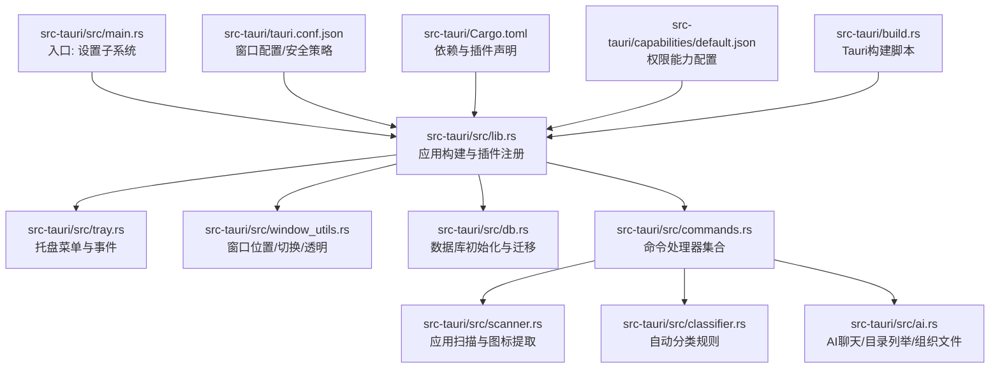
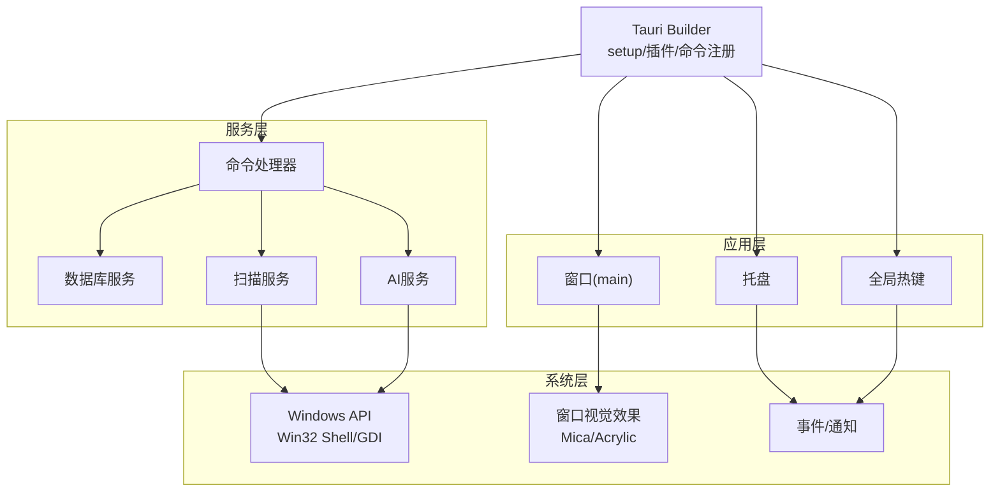
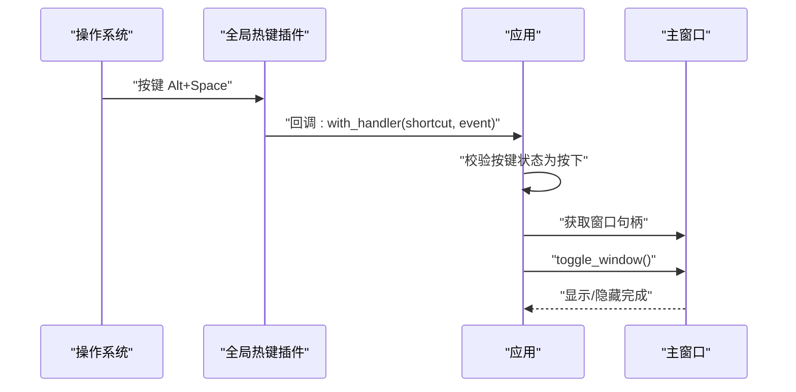
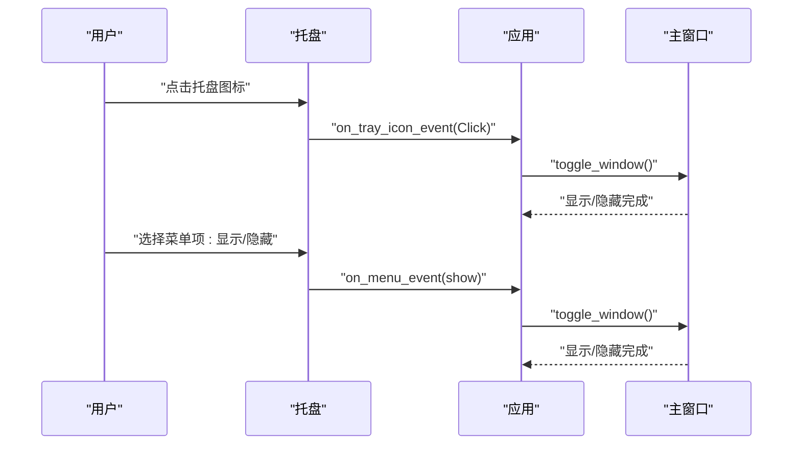
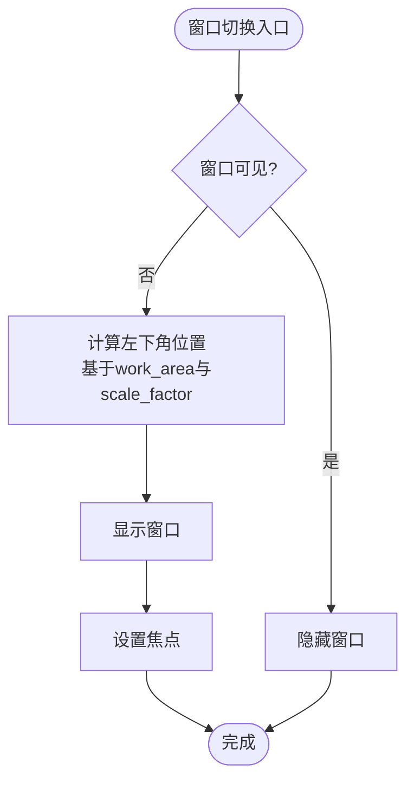
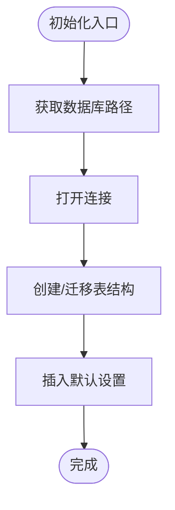
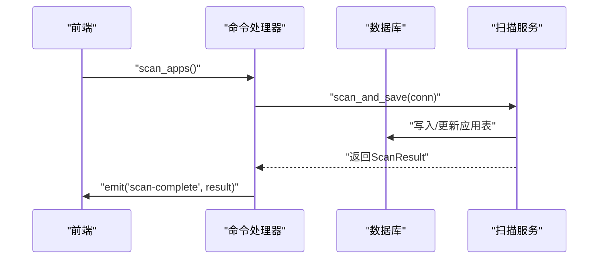
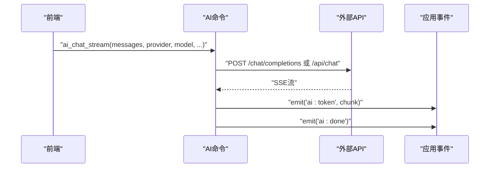
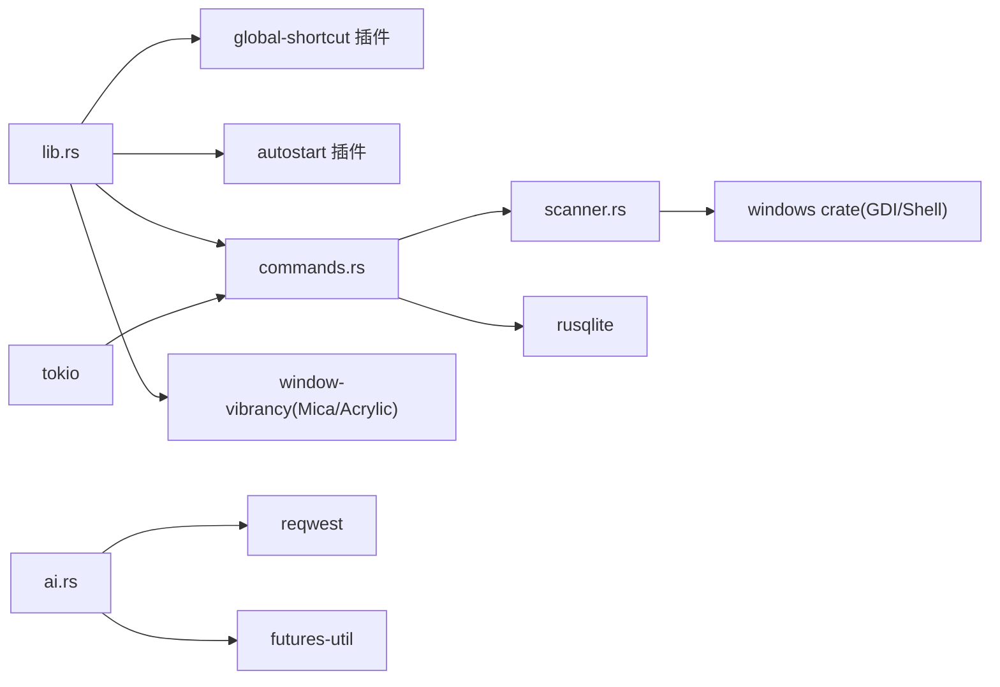

# 系统集成API

<cite>
**本文引用的文件**
- [src-tauri/src/main.rs](file://src-tauri/src/main.rs)
- [src-tauri/src/lib.rs](file://src-tauri/src/lib.rs)
- [src-tauri/tauri.conf.json](file://src-tauri/tauri.conf.json)
- [src-tauri/Cargo.toml](file://src-tauri/Cargo.toml)
- [src-tauri/src/tray.rs](file://src-tauri/src/tray.rs)
- [src-tauri/src/window_utils.rs](file://src-tauri/src/window_utils.rs)
- [src-tauri/src/commands.rs](file://src-tauri/src/commands.rs)
- [src-tauri/src/db.rs](file://src-tauri/src/db.rs)
- [src-tauri/src/scanner.rs](file://src-tauri/src/scanner.rs)
- [src-tauri/src/classifier.rs](file://src-tauri/src/classifier.rs)
- [src-tauri/src/ai.rs](file://src-tauri/src/ai.rs)
- [src-tauri/capabilities/default.json](file://src-tauri/capabilities/default.json)
- [src-tauri/build.rs](file://src-tauri/build.rs)
</cite>

## 目录
1. [简介](#简介)
2. [项目结构](#项目结构)
3. [核心组件](#核心组件)
4. [架构总览](#架构总览)
5. [详细组件分析](#详细组件分析)
6. [依赖关系分析](#依赖关系分析)
7. [性能考量](#性能考量)
8. [故障排查指南](#故障排查指南)
9. [结论](#结论)
10. [附录](#附录)

## 简介
本文件面向系统集成API，聚焦Windows平台的系统API集成与Tauri应用生命周期管理。内容涵盖：
- 全局热键注册与冲突处理
- 托盘图标管理与交互
- 窗口管理（透明、毛玻璃、位置与尺寸）
- 系统通知与事件监听
- 插件系统配置与权限控制
- 多实例管理与自动启动
- 跨平台适配与Windows特定功能实现细节
- 错误处理与兼容性考虑
- 完整的系统API调用流程与示例路径

## 项目结构
后端采用Tauri 2 Rust，前端为Vite + React。核心系统集成位于src-tauri模块，包含窗口、托盘、全局热键、数据库、扫描与AI等功能模块。

图表来源
- [src-tauri/src/main.rs:1-7](file://src-tauri/src/main.rs#L1-L7)
- [src-tauri/src/lib.rs:22-134](file://src-tauri/src/lib.rs#L22-L134)
- [src-tauri/tauri.conf.json:27-51](file://src-tauri/tauri.conf.json#L27-L51)
- [src-tauri/Cargo.toml:15-36](file://src-tauri/Cargo.toml#L15-L36)
- [src-tauri/capabilities/default.json:1-36](file://src-tauri/capabilities/default.json#L1-L36)
- [src-tauri/build.rs:1-4](file://src-tauri/build.rs#L1-L4)

章节来源
- [src-tauri/src/main.rs:1-7](file://src-tauri/src/main.rs#L1-L7)
- [src-tauri/src/lib.rs:22-134](file://src-tauri/src/lib.rs#L22-L134)
- [src-tauri/tauri.conf.json:27-51](file://src-tauri/tauri.conf.json#L27-L51)
- [src-tauri/Cargo.toml:15-36](file://src-tauri/Cargo.toml#L15-L36)
- [src-tauri/capabilities/default.json:1-36](file://src-tauri/capabilities/default.json#L1-L36)
- [src-tauri/build.rs:1-4](file://src-tauri/build.rs#L1-L4)

## 核心组件
- 应用生命周期与插件系统
  - 插件：shell、dialog、opener、process、global-shortcut、autostart
  - 生命周期：setup阶段初始化数据库、托管AppState、注册全局热键、创建托盘、窗口初始定位与显示
- 窗口系统
  - 透明窗口、无边框装饰、初始不可见
  - Windows毛玻璃：Mica（Win11）优先，回退Acrylic（Win10）
  - 窗口位置：基于工作区与缩放因子的左下角定位
  - 显示/隐藏切换：先定位再显示，避免闪烁
- 托盘系统
  - 菜单项“显示/隐藏”绑定热键与点击事件
  - 左键点击托盘图标触发窗口切换
- 全局热键
  - Alt+Space：切换窗口显示/隐藏
  - 自定义处理器：根据按键状态执行切换逻辑
- 数据与命令
  - SQLite数据库初始化与迁移
  - 应用/文件夹/分类/设置/搜索历史等命令
  - 异步扫描与图标缓存
- AI与系统工具
  - OpenAI/Claude/Ollama流式对话
  - 目录列举与路径校验
  - 文件整理与移动

章节来源
- [src-tauri/src/lib.rs:22-134](file://src-tauri/src/lib.rs#L22-L134)
- [src-tauri/tauri.conf.json:27-40](file://src-tauri/tauri.conf.json#L27-L40)
- [src-tauri/src/window_utils.rs:3-56](file://src-tauri/src/window_utils.rs#L3-L56)
- [src-tauri/src/tray.rs:8-59](file://src-tauri/src/tray.rs#L8-L59)
- [src-tauri/src/db.rs:6-133](file://src-tauri/src/db.rs#L6-L133)
- [src-tauri/src/commands.rs:32-709](file://src-tauri/src/commands.rs#L32-L709)
- [src-tauri/src/ai.rs:60-501](file://src-tauri/src/ai.rs#L60-L501)

## 架构总览
系统集成API围绕Tauri Builder展开，统一在setup阶段完成初始化与注册；窗口、托盘、热键、数据库与命令通过模块化组织，插件提供系统级能力；权限通过capabilities进行细粒度授权。

图表来源
- [src-tauri/src/lib.rs:22-134](file://src-tauri/src/lib.rs#L22-L134)
- [src-tauri/src/window_utils.rs:3-56](file://src-tauri/src/window_utils.rs#L3-L56)
- [src-tauri/src/tray.rs:8-59](file://src-tauri/src/tray.rs#L8-L59)
- [src-tauri/src/db.rs:6-133](file://src-tauri/src/db.rs#L6-L133)
- [src-tauri/src/commands.rs:32-709](file://src-tauri/src/commands.rs#L32-L709)
- [src-tauri/src/ai.rs:60-501](file://src-tauri/src/ai.rs#L60-L501)
- [src-tauri/src/scanner.rs:288-407](file://src-tauri/src/scanner.rs#L288-L407)

## 详细组件分析

### 全局热键与多实例管理
- 注册：在setup中注册Alt+Space，使用GlobalShortcut插件的with_handler回调处理按键按下事件
- 切换逻辑：根据ShortcutState判断按键状态，若匹配则获取主窗口并调用toggle_window
- 多实例：通过命令行参数识别自动启动模式，避免重复显示；窗口切换逻辑确保仅有一个可见实例的行为

图表来源
- [src-tauri/src/lib.rs:28-42](file://src-tauri/src/lib.rs#L28-L42)
- [src-tauri/src/window_utils.rs:46-55](file://src-tauri/src/window_utils.rs#L46-L55)

章节来源
- [src-tauri/src/lib.rs:28-42](file://src-tauri/src/lib.rs#L28-L42)
- [src-tauri/src/window_utils.rs:46-55](file://src-tauri/src/window_utils.rs#L46-L55)

### 托盘图标管理与事件
- 菜单项：显示/隐藏（绑定Alt+Space）、退出
- 图标事件：左键点击托盘图标触发窗口切换
- 事件路由：菜单事件与托盘图标事件均调用toggle_window，保持行为一致性

图表来源
- [src-tauri/src/tray.rs:29-54](file://src-tauri/src/tray.rs#L29-L54)
- [src-tauri/src/window_utils.rs:46-55](file://src-tauri/src/window_utils.rs#L46-L55)

章节来源
- [src-tauri/src/tray.rs:8-59](file://src-tauri/src/tray.rs#L8-L59)

### 窗口管理与透明/毛玻璃效果
- 窗口配置：透明、无装饰、初始不可见
- 位置管理：position_window_bottom_left基于当前显示器work_area与scale_factor计算左下角位置
- 显示切换：toggle_window先定位再显示，设置焦点
- 毛玻璃：优先Mica（Win11），失败回退Acrylic（Win10）

图表来源
- [src-tauri/tauri.conf.json:27-40](file://src-tauri/tauri.conf.json#L27-L40)
- [src-tauri/src/window_utils.rs:3-56](file://src-tauri/src/window_utils.rs#L3-L56)
- [src-tauri/src/lib.rs:80-92](file://src-tauri/src/lib.rs#L80-L92)

章节来源
- [src-tauri/tauri.conf.json:27-40](file://src-tauri/tauri.conf.json#L27-L40)
- [src-tauri/src/window_utils.rs:3-56](file://src-tauri/src/window_utils.rs#L3-L56)
- [src-tauri/src/lib.rs:80-92](file://src-tauri/src/lib.rs#L80-L92)

### 数据库初始化与迁移
- 路径：应用数据目录下的quickstart.db
- 初始化：在setup阶段打开连接并执行多张表的创建与索引
- 迁移：对folders表添加category列并创建folder_categories表；同步现有数据至新结构
- 默认设置：插入默认键值（热键、自启动、主题、自动分类等）

图表来源
- [src-tauri/src/db.rs:6-133](file://src-tauri/src/db.rs#L6-L133)

章节来源
- [src-tauri/src/db.rs:6-133](file://src-tauri/src/db.rs#L6-L133)

### 命令系统与业务逻辑
- 命令集合：应用/文件夹/分类/设置/搜索历史/图标缓存/扫描/更新检查/启动/定位等
- 异步处理：扫描与图标提取使用spawn_blocking，避免阻塞UI线程
- 事务保护：更新分类时使用BEGIN/COMMIT保证一致性
- 事件发射：扫描完成后通过emit发送“scan-complete”事件

图表来源
- [src-tauri/src/commands.rs:231-249](file://src-tauri/src/commands.rs#L231-L249)
- [src-tauri/src/scanner.rs:185-228](file://src-tauri/src/scanner.rs#L185-L228)

章节来源
- [src-tauri/src/commands.rs:32-709](file://src-tauri/src/commands.rs#L32-L709)
- [src-tauri/src/scanner.rs:185-228](file://src-tauri/src/scanner.rs#L185-L228)

### AI服务与系统工具
- 对话流式：OpenAI/Claude/Ollama三种提供商，统一SSE解析与事件发射
- 目录列举：限制在应用数据目录与用户常用目录范围内，路径校验防止越权
- 文件整理：安全移动，避免覆盖与重命名冲突

图表来源
- [src-tauri/src/ai.rs:60-254](file://src-tauri/src/ai.rs#L60-L254)

章节来源
- [src-tauri/src/ai.rs:60-501](file://src-tauri/src/ai.rs#L60-L501)

### 权限控制与能力配置
- 能力：default.json为main窗口分配核心窗口、事件、shell、opener、dialog、process、global-shortcut、autostart等权限
- 授权：通过allow-*显式授权具体操作，避免过度放权

章节来源
- [src-tauri/capabilities/default.json:1-36](file://src-tauri/capabilities/default.json#L1-L36)

## 依赖关系分析
- 插件依赖：tauri-plugin-shell、dialog、opener、process、global-shortcut、autostart
- 系统API：windows crate提供Win32 UI Shell/GDI/WindowsAndMessaging等能力
- 视觉效果：window-vibrancy提供Mica/Acrylic
- 数据库：rusqlite(bundled)提供SQLite访问
- 并发：tokio/futures-util提供异步运行时与流处理

图表来源
- [src-tauri/src/lib.rs:22-134](file://src-tauri/src/lib.rs#L22-L134)
- [src-tauri/Cargo.toml:15-36](file://src-tauri/Cargo.toml#L15-L36)
- [src-tauri/src/scanner.rs:5-11](file://src-tauri/src/scanner.rs#L5-L11)
- [src-tauri/src/ai.rs:1-5](file://src-tauri/src/ai.rs#L1-L5)

章节来源
- [src-tauri/Cargo.toml:15-36](file://src-tauri/Cargo.toml#L15-L36)

## 性能考量
- 异步I/O：扫描与图标提取使用spawn_blocking，避免阻塞主线程
- 数据库事务：批量更新使用BEGIN/COMMIT，减少锁竞争与写放大
- 缓存策略：图标缓存到应用数据目录，命中即返回，避免重复提取
- 窗口定位：基于work_area与scale_factor，避免硬编码任务栏高度
- 网络请求：超时控制与流式读取，及时释放资源

## 故障排查指南
- 热键无效
  - 检查全局热键注册是否成功（setup阶段）
  - 确认快捷键未被系统占用
  - 参考路径：[src-tauri/src/lib.rs:62-66](file://src-tauri/src/lib.rs#L62-L66)
- 托盘无响应
  - 确认托盘图标与菜单事件回调已注册
  - 检查toggle_window调用链
  - 参考路径：[src-tauri/src/tray.rs:29-54](file://src-tauri/src/tray.rs#L29-L54)
- 窗口不显示或位置异常
  - 检查窗口初始可见性与透明配置
  - 确认position_window_bottom_left的显示器信息获取
  - 参考路径：[src-tauri/tauri.conf.json:37-38](file://src-tauri/tauri.conf.json#L37-L38)、[src-tauri/src/window_utils.rs:15-42](file://src-tauri/src/window_utils.rs#L15-L42)
- 毛玻璃效果失败
  - Win11优先Mica，失败回退Acrylic
  - 参考路径：[src-tauri/src/lib.rs:84-87](file://src-tauri/src/lib.rs#L84-L87)
- 数据库初始化失败
  - 检查应用数据目录可写性与路径
  - 参考路径：[src-tauri/src/db.rs:6-14](file://src-tauri/src/db.rs#L6-L14)
- AI流式对话中断
  - 检查网络连通性与API密钥
  - 查看SSE解析与事件发射
  - 参考路径：[src-tauri/src/ai.rs:60-254](file://src-tauri/src/ai.rs#L60-L254)

章节来源
- [src-tauri/src/lib.rs:62-66](file://src-tauri/src/lib.rs#L62-L66)
- [src-tauri/src/tray.rs:29-54](file://src-tauri/src/tray.rs#L29-L54)
- [src-tauri/tauri.conf.json:37-38](file://src-tauri/tauri.conf.json#L37-L38)
- [src-tauri/src/window_utils.rs:15-42](file://src-tauri/src/window_utils.rs#L15-L42)
- [src-tauri/src/lib.rs:84-87](file://src-tauri/src/lib.rs#L84-L87)
- [src-tauri/src/db.rs:6-14](file://src-tauri/src/db.rs#L6-L14)
- [src-tauri/src/ai.rs:60-254](file://src-tauri/src/ai.rs#L60-L254)

## 结论
本系统集成API以Tauri为核心，结合Windows原生API与插件生态，实现了全局热键、托盘管理、透明窗口与毛玻璃效果、窗口位置与尺寸管理、系统通知与事件监听、数据库与命令系统、以及AI与系统工具的完整闭环。通过capabilities精细化授权与严格的路径校验，兼顾了安全性与可用性。建议在生产环境中持续关注系统版本差异与API变更，并配合完善的日志与监控体系进行运维保障。

## 附录
- 跨平台适配
  - 窗口配置与透明、无边框装饰在Windows上表现最佳
  - 毛玻璃效果按系统版本回退，确保兼容性
  - 全局热键与托盘在Linux/macOS上行为可能不同，需分别测试
- Windows特定功能
  - 使用windows crate访问Win32 Shell与GDI接口进行图标提取
  - 使用window-vibrancy应用Mica/Acrylic视觉效果
- 安全与合规
  - 路径校验与目录限制，防止路径遍历
  - 权限能力最小化原则，仅授予必要操作
  - 网络请求超时与错误码处理