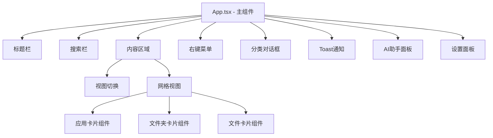
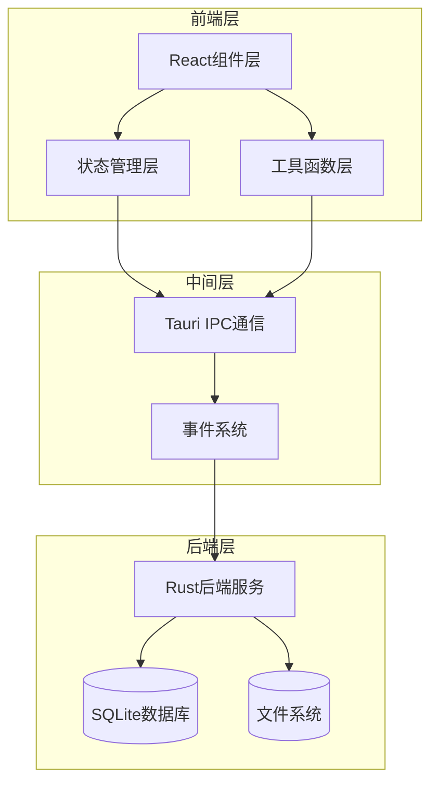
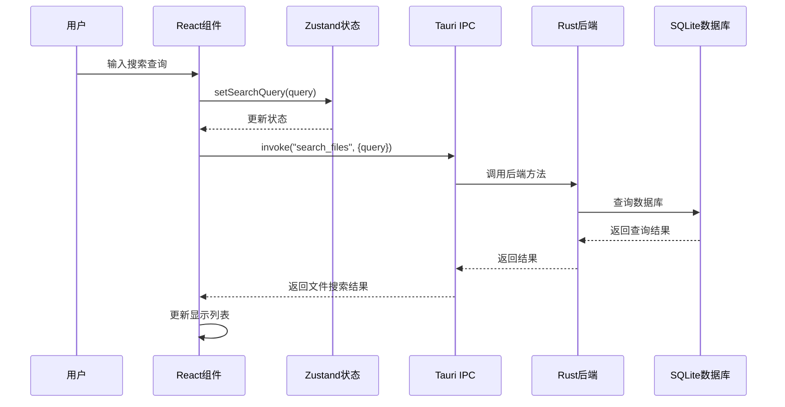
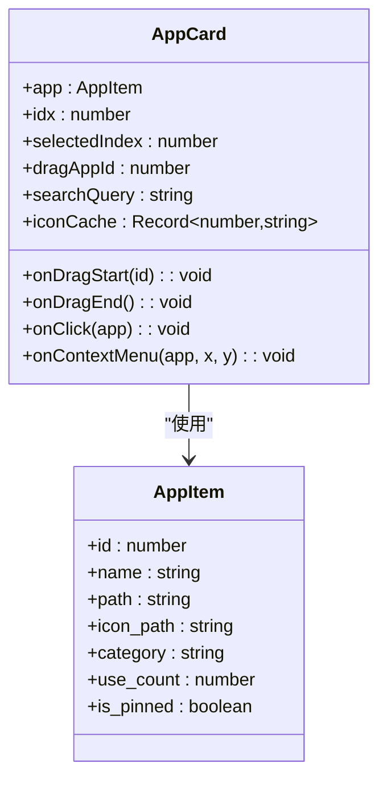
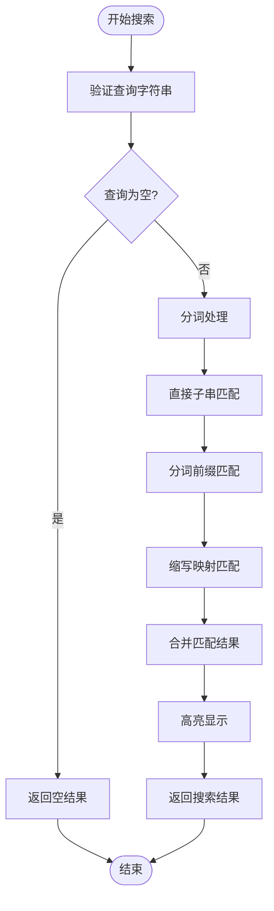
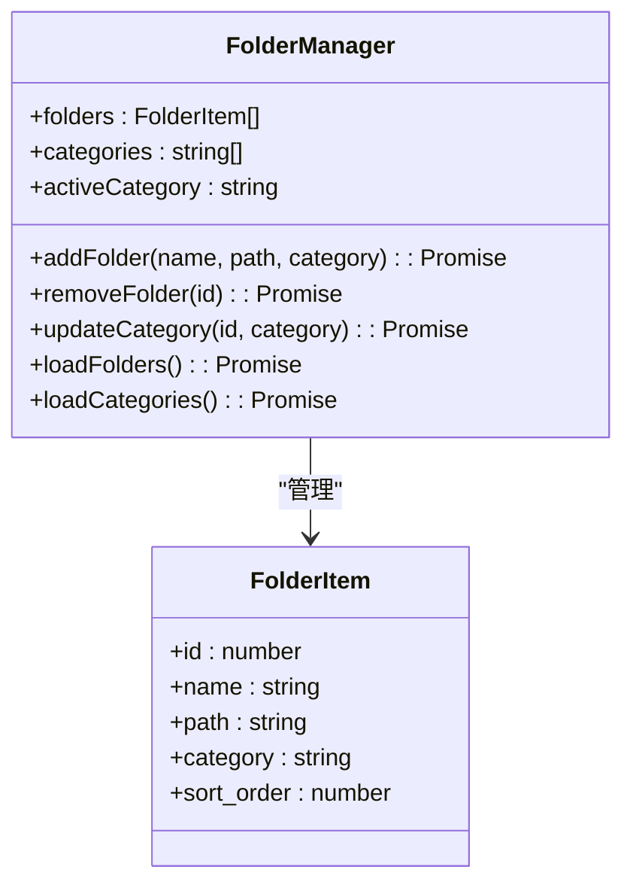
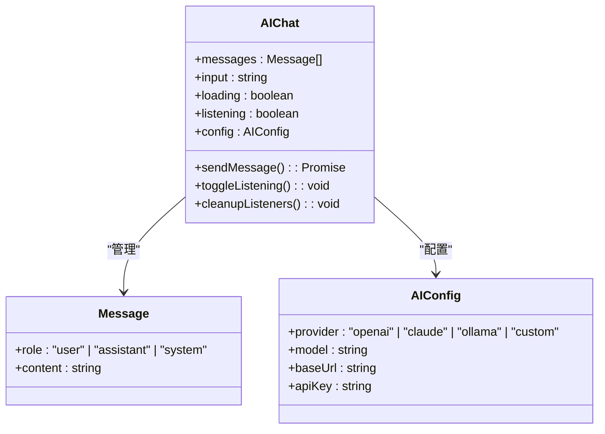
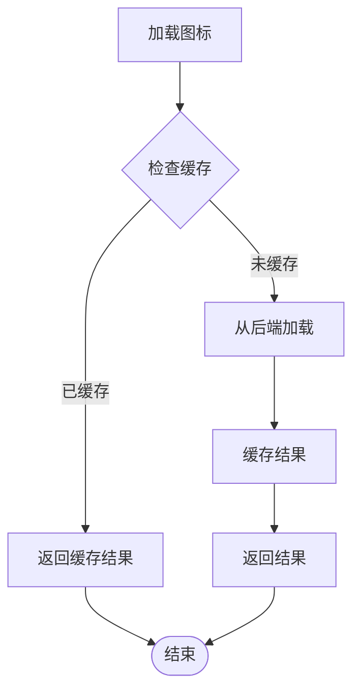

# React组件架构

<cite>
**本文档引用的文件**
- [App.tsx](file://src/App.tsx)
- [store.ts](file://src/store.ts)
- [main.tsx](file://src/main.tsx)
- [AIChat.tsx](file://src/AIChat.tsx)
- [Settings.tsx](file://src/Settings.tsx)
- [utils.ts](file://src/lib/utils.ts)
- [index.css](file://src/index.css)
- [tailwind.config.js](file://tailwind.config.js)
- [package.json](file://package.json)
</cite>

## 目录
1. [简介](#简介)
2. [项目结构](#项目结构)
3. [核心组件](#核心组件)
4. [架构概览](#架构概览)
5. [详细组件分析](#详细组件分析)
6. [依赖关系分析](#依赖关系分析)
7. [性能考虑](#性能考虑)
8. [故障排除指南](#故障排除指南)
9. [结论](#结论)

## 简介

QuickStart是一个基于React和Tauri构建的Windows应用启动器，提供了现代化的启动器界面、智能应用管理、文件夹组织和AI助手等功能。该项目采用现代前端技术栈，包括React 19、TypeScript、Tailwind CSS和Zustand状态管理，实现了高性能、响应式的用户体验。

## 项目结构

项目采用清晰的模块化结构，主要分为以下几个层次：

```mermaid
graph TB
subgraph "入口层"
Main[main.tsx]
Root[React Root]
end
subgraph "应用层"
App[App.tsx - 主组件]
AIChat[AIChat.tsx - AI助手]
Settings[Settings.tsx - 设置面板]
end
subgraph "状态管理层"
Store[store.ts - Zustand状态]
Utils[utils.ts - 工具函数]
end
subgraph "样式层"
CSS[index.css - 样式定义]
Tailwind[tailwind.config.js - Tailwind配置]
end
subgraph "外部依赖"
React[React 19]
Zustand[Zustand 5.0]
Tauri[@tauri-apps/api]
Lucide[lucide-react]
end
Main --> App
App --> AIChat
App --> Settings
App --> Store
App --> Utils
App --> CSS
App --> Tailwind
App --> React
App --> Zustand
App --> Tauri
App --> Lucide
```

**图表来源**
- [main.tsx:1-11](file://src/main.tsx#L1-L11)
- [App.tsx:1-50](file://src/App.tsx#L1-L50)
- [store.ts:1-46](file://src/store.ts#L1-L46)

**章节来源**
- [main.tsx:1-11](file://src/main.tsx#L1-L11)
- [package.json:1-50](file://package.json#L1-L50)

## 核心组件

### App.tsx - 主组件

App.tsx是整个应用的核心组件，采用了多种React高级特性来实现高性能和良好的用户体验：

#### 设计模式

1. **容器-展示组件分离模式**
   - 使用多个独立的展示组件（如AppCard、右键菜单等）
   - 容器组件负责状态管理和业务逻辑

2. **组合模式**
   - 通过高阶组件和函数式组件组合复杂功能
   - 支持条件渲染和动态内容生成

3. **受控组件模式**
   - 所有用户交互都通过回调函数处理
   - 状态集中管理，避免组件间状态同步问题

#### 组件树结构



**图表来源**
- [App.tsx:274-1299](file://src/App.tsx#L274-L1299)

#### 状态管理模式

应用使用Zustand实现全局状态管理，包含以下核心状态：

| 状态属性 | 类型 | 描述 | 默认值 |
|---------|------|------|--------|
| searchQuery | string | 搜索查询文本 | "" |
| apps | AppItem[] | 应用列表 | [] |
| isVisible | boolean | 窗口可见性 | true |
| isListening | boolean | 语音识别状态 | false |

**章节来源**
- [store.ts:13-45](file://src/store.ts#L13-L45)
- [App.tsx:274-313](file://src/App.tsx#L274-L313)

## 架构概览

### 整体架构设计



**图表来源**
- [App.tsx:315-409](file://src/App.tsx#L315-L409)
- [utils.ts:11-24](file://src/lib/utils.ts#L11-L24)

### 数据流架构



**图表来源**
- [App.tsx:412-424](file://src/App.tsx#L412-L424)
- [utils.ts:11-17](file://src/lib/utils.ts#L11-L17)

## 详细组件分析

### AppCard 组件 - 应用卡片组件

AppCard是应用列表中的核心展示组件，采用了多种优化策略：

#### 组件结构



**图表来源**
- [App.tsx:49-70](file://src/App.tsx#L49-L70)
- [store.ts:3-11](file://src/store.ts#L3-L11)

#### 性能优化策略

1. **memo优化**
   ```typescript
   const AppCard = memo(function AppCard({...}) {
       // 组件实现
   });
   ```
   - 使用React.memo包装组件，避免不必要的重新渲染
   - 适用于频繁渲染的列表项组件

2. **条件渲染优化**
   - 图标加载使用缓存机制，避免重复请求
   - 仅在需要时才进行高亮匹配计算

3. **事件处理优化**
   - 使用useCallback优化事件处理器
   - 避免在渲染过程中创建新的函数实例

**章节来源**
- [App.tsx:49-70](file://src/App.tsx#L49-L70)

### 搜索功能实现

#### 分词匹配算法

搜索功能实现了复杂的分词匹配算法：



**图表来源**
- [App.tsx:436-482](file://src/App.tsx#L436-L482)
- [App.tsx:72-130](file://src/App.tsx#L72-L130)

#### 搜索优化策略

1. **防抖处理**
   - 使用setTimeout实现200ms防抖延迟
   - 避免频繁的API调用

2. **内存优化**
   - 使用useMemo缓存计算结果
   - 避免重复的过滤和排序操作

3. **实时高亮**
   - 实现精确的文本高亮匹配
   - 支持多词组和缩写匹配

**章节来源**
- [App.tsx:412-424](file://src/App.tsx#L412-L424)
- [App.tsx:484-515](file://src/App.tsx#L484-L515)

### 文件夹管理系统

#### 文件夹分类功能



**图表来源**
- [App.tsx:263-266](file://src/App.tsx#L263-L266)
- [App.tsx:285-296](file://src/App.tsx#L285-L296)

#### 文件夹操作功能

1. **拖拽分类**
   - 支持拖拽应用到不同分类标签
   - 实时更新数据库中的分类信息

2. **批量操作**
   - 支持批量删除和分类修改
   - 提供撤销和确认机制

3. **分类管理**
   - 动态创建和删除分类
   - 分类名称去重和验证

**章节来源**
- [App.tsx:614-642](file://src/App.tsx#L614-L642)
- [App.tsx:736-764](file://src/App.tsx#L736-L764)

### AI助手组件

AIChat组件提供了智能对话功能：

#### 组件架构



**图表来源**
- [AIChat.tsx:5-12](file://src/AIChat.tsx#L5-L12)
- [AIChat.tsx:28-38](file://src/AIChat.tsx#L28-L38)

#### AI功能特性

1. **流式响应**
   - 实现实时的流式AI响应
   - 支持中断和取消操作

2. **语音输入**
   - 集成Web Speech API
   - 支持中文语音识别

3. **配置管理**
   - 支持多种AI提供商
   - 动态配置和热更新

**章节来源**
- [AIChat.tsx:83-159](file://src/AIChat.tsx#L83-L159)
- [AIChat.tsx:169-189](file://src/AIChat.tsx#L169-L189)

## 依赖关系分析

### 技术栈依赖

```mermaid
graph TB
subgraph "核心依赖"
React[React 19.0.0]
ReactDOM[React DOM 19.0.0]
Zustand[Zustand 5.0.0]
end
subgraph "UI框架"
Tailwind[Tailwind CSS 3.4.0]
Lucide[Lucide React 0.400.0]
end
subgraph "Tauri生态"
TauriAPI[@tauri-apps/api 2.0.0]
DialogPlugin[@tauri-apps/plugin-dialog 2.0.0]
ShellPlugin[@tauri-apps/plugin-shell 2.0.0]
end
subgraph "开发工具"
Vite[Vite 6.0.0]
TypeScript[TypeScript 5.5.0]
PostCSS[PostCSS 8.4.0]
end
App --> React
App --> Zustand
App --> Tailwind
App --> Lucide
App --> TauriAPI
App --> Vite
```

**图表来源**
- [package.json:14-31](file://package.json#L14-L31)

### 组件间依赖关系

```mermaid
graph TD
App[App.tsx] --> AIChat[AIChat.tsx]
App --> Settings[Settings.tsx]
App --> Store[store.ts]
App --> Utils[utils.ts]
AIChat --> Utils
Settings --> Utils
Store --> Zustand[Zustand]
Utils --> TauriAPI[@tauri-apps/api]
App --> CSS[index.css]
App --> TailwindConfig[tailwind.config.js]
```

**图表来源**
- [App.tsx:1-12](file://src/App.tsx#L1-L12)
- [AIChat.tsx:1-3](file://src/AIChat.tsx#L1-L3)
- [Settings.tsx:1-3](file://src/Settings.tsx#L1-L3)

**章节来源**
- [package.json:1-50](file://package.json#L1-L50)

## 性能考虑

### 优化策略总览

1. **渲染性能优化**
   - 使用React.memo减少不必要的组件重渲染
   - 采用useMemo缓存计算结果
   - 实现虚拟滚动处理大量数据

2. **网络性能优化**
   - 搜索功能防抖处理
   - 图标加载缓存机制
   - 异步数据加载和错误处理

3. **内存管理**
   - 及时清理事件监听器
   - 合理的定时器管理
   - 组件卸载时的资源释放

### 具体优化实现

#### 图标加载优化



**图表来源**
- [App.tsx:667-696](file://src/App.tsx#L667-L696)

#### 搜索性能优化

1. **分词算法优化**
   - 使用正则表达式进行高效分词
   - 缓存分词结果避免重复计算
   - 支持驼峰命名和特殊字符处理

2. **匹配算法优化**
   - 实现多级匹配优先级
   - 使用索引预处理提高查找效率
   - 支持缩写映射和扩展匹配

**章节来源**
- [App.tsx:23-47](file://src/App.tsx#L23-L47)
- [App.tsx:436-482](file://src/App.tsx#L436-L482)

## 故障排除指南

### 常见问题及解决方案

#### 状态同步问题

**问题描述**: 状态更新后UI没有及时反映

**解决方案**:
1. 确保使用useStore正确订阅状态
2. 检查状态更新函数的调用时机
3. 验证组件的重新渲染条件

#### 性能问题

**问题描述**: 应用响应缓慢或卡顿

**解决方案**:
1. 检查是否有过多的useMemo和useCallback使用
2. 优化大型列表的渲染
3. 减少不必要的状态更新

#### 事件处理问题

**问题描述**: 事件监听器未正确清理

**解决方案**:
1. 在组件卸载时清理所有事件监听器
2. 使用useEffect返回清理函数
3. 确保异步操作的正确取消

### 调试技巧

1. **使用React DevTools**
   - 检查组件树结构
   - 分析渲染次数和性能
   - 查看状态变化历史

2. **日志调试**
   - 在关键位置添加console.log
   - 使用更详细的错误信息
   - 监控异步操作的执行情况

**章节来源**
- [App.tsx:355-409](file://src/App.tsx#L355-L409)
- [AIChat.tsx:70-81](file://src/AIChat.tsx#L70-L81)

## 结论

QuickStart项目展现了现代React应用的最佳实践，通过合理的架构设计、性能优化和用户体验考虑，实现了一个功能丰富且高效的Windows应用启动器。项目的主要优势包括：

1. **优秀的架构设计**: 清晰的组件分离和状态管理
2. **出色的性能表现**: 多种优化策略确保流畅的用户体验
3. **完善的错误处理**: 全面的异常处理和用户反馈机制
4. **现代化的技术栈**: 使用最新的React和TypeScript特性

该项目为React应用开发提供了很好的参考模板，特别是在状态管理、性能优化和用户体验方面都有值得学习的地方。