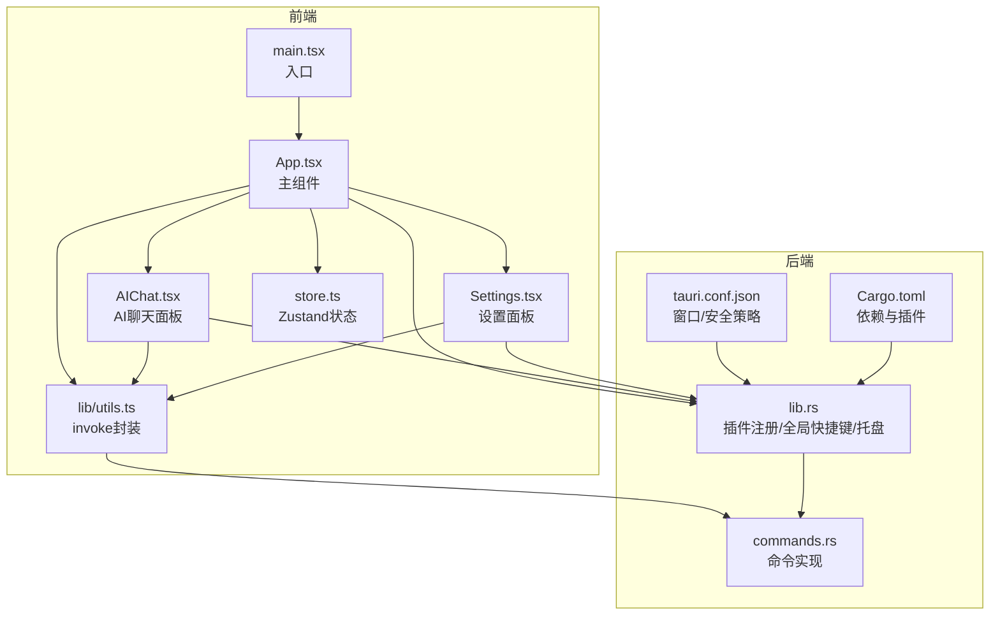
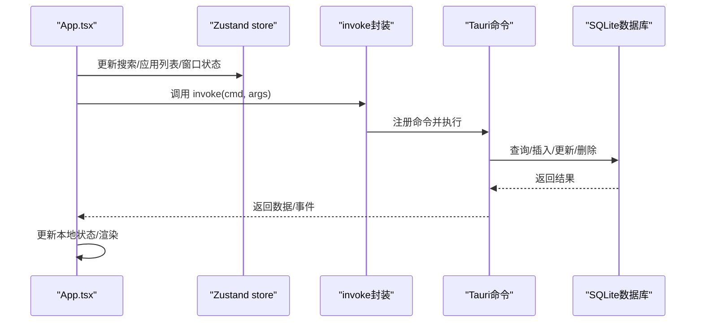
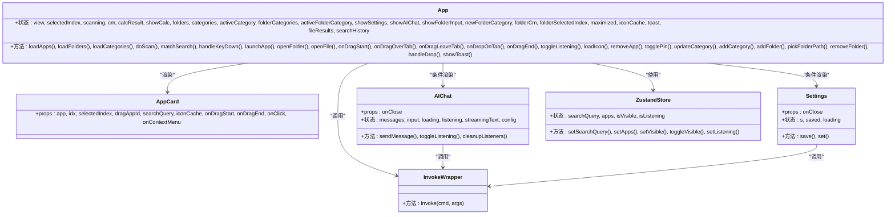
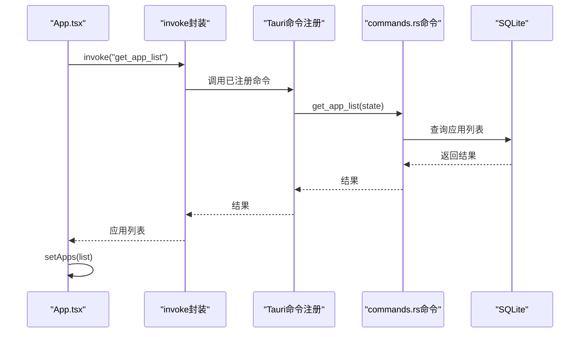
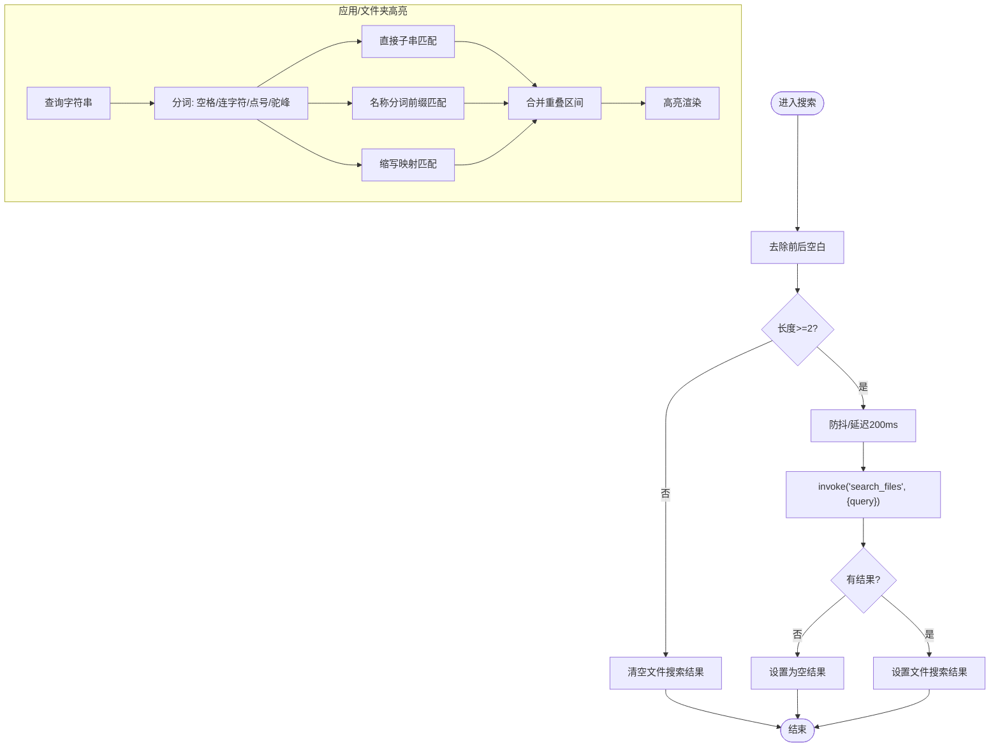
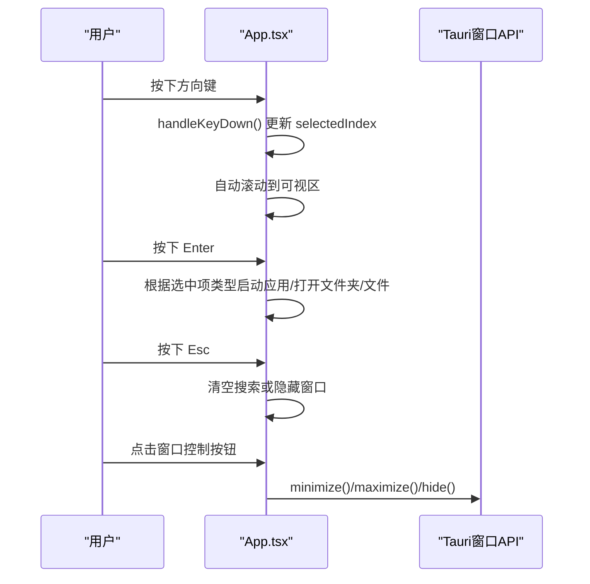

# 主组件设计

<cite>
**本文引用的文件**
- [App.tsx](file://src/App.tsx)
- [main.tsx](file://src/main.tsx)
- [store.ts](file://src/store.ts)
- [AIChat.tsx](file://src/AIChat.tsx)
- [Settings.tsx](file://src/Settings.tsx)
- [utils.ts](file://src/lib/utils.ts)
- [lib.rs](file://src-tauri/src/lib.rs)
- [commands.rs](file://src-tauri/src/commands.rs)
- [Cargo.toml](file://src-tauri/Cargo.toml)
- [tauri.conf.json](file://src-tauri/tauri.conf.json)
</cite>

## 目录
1. [简介](#简介)
2. [项目结构](#项目结构)
3. [核心组件](#核心组件)
4. [架构总览](#架构总览)
5. [详细组件分析](#详细组件分析)
6. [依赖关系分析](#依赖关系分析)
7. [性能考量](#性能考量)
8. [故障排查指南](#故障排查指南)
9. [结论](#结论)
10. [附录](#附录)

## 简介
本设计文档聚焦于 QuickStart 主组件 App.tsx 的整体架构与实现细节，涵盖组件树结构、状态管理策略、生命周期与事件处理机制、键盘导航、响应式布局与窗口管理、主题切换、以及与 Tauri 后端的通信机制与数据流。文档同时解释主组件如何协调应用卡片渲染、搜索功能、文件夹管理、AI 聊天等子功能模块，并提供可视化图表帮助理解。

## 项目结构
QuickStart 采用前端 React + TailwindCSS + Zustand 状态管理，后端 Rust + Tauri 的混合架构。前端通过统一的 invoke 封装与后端命令进行通信；后端通过命令注册暴露数据库操作、系统交互、AI 能力等能力。

**图表来源**
- [main.tsx:1-11](file://src/main.tsx#L1-L11)
- [App.tsx:1-1299](file://src/App.tsx#L1-L1299)
- [AIChat.tsx:1-278](file://src/AIChat.tsx#L1-L278)
- [Settings.tsx:1-165](file://src/Settings.tsx#L1-L165)
- [store.ts:1-46](file://src/store.ts#L1-L46)
- [utils.ts:1-25](file://src/lib/utils.ts#L1-L25)
- [lib.rs:1-135](file://src-tauri/src/lib.rs#L1-L135)
- [commands.rs:1-709](file://src-tauri/src/commands.rs#L1-L709)
- [tauri.conf.json:1-54](file://src-tauri/tauri.conf.json#L1-L54)
- [Cargo.toml:1-36](file://src-tauri/Cargo.toml#L1-L36)

**章节来源**
- [main.tsx:1-11](file://src/main.tsx#L1-L11)
- [tauri.conf.json:1-54](file://src-tauri/tauri.conf.json#L1-L54)
- [Cargo.toml:1-36](file://src-tauri/Cargo.toml#L1-L36)

## 核心组件
- 主组件 App.tsx：负责应用卡片渲染、搜索与高亮、计算器、文件搜索、文件夹管理、拖拽分类、窗口控制、语音输入、右键菜单、Toast 通知、AI 聊天与设置面板的集成。
- 状态管理：使用 Zustand store 管理搜索查询、应用列表、窗口可见性、语音输入状态。
- 工具函数：统一的 invoke 封装，简化前端与后端命令调用。
- AI 聊天面板：独立组件，负责与后端 AI 命令交互，流式接收消息。
- 设置面板：独立组件，负责主题、快捷键、开机自启、自动分类、AI 配置等设置持久化。

**章节来源**
- [App.tsx:274-1299](file://src/App.tsx#L274-L1299)
- [store.ts:1-46](file://src/store.ts#L1-L46)
- [utils.ts:1-25](file://src/lib/utils.ts#L1-L25)
- [AIChat.tsx:1-278](file://src/AIChat.tsx#L1-L278)
- [Settings.tsx:1-165](file://src/Settings.tsx#L1-L165)

## 架构总览
前端通过 App.tsx 协调各功能模块，使用 Zustand 管理轻量状态，使用 invoke 封装调用后端命令。后端通过 lib.rs 注册插件与命令，commands.rs 实现具体业务逻辑，tauri.conf.json 定义窗口属性与安全策略。

**图表来源**
- [App.tsx:314-409](file://src/App.tsx#L314-L409)
- [utils.ts:11-17](file://src/lib/utils.ts#L11-L17)
- [lib.rs:96-131](file://src-tauri/src/lib.rs#L96-L131)
- [commands.rs:32-552](file://src-tauri/src/commands.rs#L32-L552)

## 详细组件分析

### 主组件 App.tsx 设计要点
- 组件树结构
  - 顶部标题栏：搜索/应用中心/文件夹切换、AI 助手、扫描、设置、窗口控制按钮。
  - 搜索栏：支持语音输入、计算表达式高亮、搜索历史。
  - 内容区：网格布局展示应用卡片、文件夹/文件分区、常用应用、扫描中状态。
  - 右键菜单：应用/文件夹上下文操作。
  - 弹窗：AI 聊天面板、设置面板、Toast 通知。
- 状态管理策略
  - 使用 Zustand store 管理搜索查询、应用列表、窗口可见性、语音输入状态。
  - 使用 useState/useMemo/useCallback 管理本地 UI 状态与派生数据。
  - 使用 useRef 管理定时器、窗口句柄、语音识别实例等。
- 生命周期与事件处理
  - 初始化：加载应用/文件夹/分类/搜索历史，检查更新，必要时触发扫描。
  - 扫描完成：监听 scan-complete 事件，刷新数据并提示。
  - 键盘导航：方向键移动选中项，Enter 启动应用/打开文件夹/文件，Esc 隐藏或清空搜索。
  - 拖拽分类：HTML5 drag/drop 实现应用分类拖拽。
  - 语音输入：SpeechRecognition 识别，更新搜索查询。
  - 图标缓存：按需加载应用图标，避免重复请求。
- 关键功能模块
  - 应用卡片渲染：AppCard 组件，支持高亮、固定、拖拽、右键菜单。
  - 搜索与高亮：分词匹配、缩写映射、区间合并、高亮渲染。
  - 计算器：安全表达式解析与计算，实时显示结果。
  - 文件搜索：对桌面/下载/文档目录进行模糊匹配。
  - 文件夹管理：增删改分类、添加文件夹、右键菜单操作。
  - AI 聊天：独立面板，流式接收 AI 回复，支持语音输入。
  - 设置：主题切换、快捷键、开机自启、自动分类、AI 配置。
  - 窗口管理：最小化、最大化/还原、隐藏、位置与透明背景。
  - 主题切换：系统/浅色/深色，跟随系统偏好。
  - 通知：Toast 提示成功/失败信息。

**章节来源**
- [App.tsx:1-1299](file://src/App.tsx#L1-L1299)
- [store.ts:1-46](file://src/store.ts#L1-L46)

### 类关系图（代码级）

**图表来源**
- [App.tsx:49-70](file://src/App.tsx#L49-L70)
- [App.tsx:274-1299](file://src/App.tsx#L274-L1299)
- [AIChat.tsx:10-278](file://src/AIChat.tsx#L10-L278)
- [Settings.tsx:5-165](file://src/Settings.tsx#L5-L165)
- [store.ts:13-46](file://src/store.ts#L13-L46)
- [utils.ts:11-17](file://src/lib/utils.ts#L11-L17)

### API/服务调用序列图（invoke）

**图表来源**
- [utils.ts:11-17](file://src/lib/utils.ts#L11-L17)
- [lib.rs:96-131](file://src-tauri/src/lib.rs#L96-L131)
- [commands.rs:528-552](file://src-tauri/src/commands.rs#L528-L552)

### 复杂逻辑流程图（搜索与高亮）

**图表来源**
- [App.tsx:412-424](file://src/App.tsx#L412-L424)
- [App.tsx:72-130](file://src/App.tsx#L72-L130)

### 键盘导航与窗口控制序列图

**图表来源**
- [App.tsx:549-579](file://src/App.tsx#L549-L579)
- [App.tsx:644-656](file://src/App.tsx#L644-L656)

## 依赖关系分析
- 前端依赖
  - React Hooks：useState/useEffect/useMemo/useCallback/useRef/memo。
  - Zustand：轻量状态管理。
  - Tauri 插件：window/dialog/opener/process/global-shortcut/autostart。
  - Lucide React：图标库。
- 后端依赖
  - Tauri：命令注册、插件系统、窗口管理。
  - rusqlite：SQLite 操作。
  - reqwest：HTTP 请求（版本检查）。
  - open：系统默认程序启动。
  - base64/png/windows：图标提取与平台特性。
- 安全与打包
  - CSP 限制脚本来源，资产协议启用。
  - 开发/构建命令与前端分发目录配置。

**章节来源**
- [Cargo.toml:15-36](file://src-tauri/Cargo.toml#L15-L36)
- [tauri.conf.json:41-50](file://src-tauri/tauri.conf.json#L41-L50)
- [lib.rs:22-95](file://src-tauri/src/lib.rs#L22-L95)

## 性能考量
- 图标加载优化
  - 按需加载：仅对当前可见应用加载图标，避免一次性加载大量图标导致卡顿。
  - 缓存策略：成功/失败均缓存，避免重复请求。
- 搜索性能
  - 文件搜索防抖与延迟，减少高频请求。
  - 分词匹配与缩写映射，提升匹配准确度与速度。
- 渲染优化
  - memo 包裹 AppCard，减少不必要的重渲染。
  - useMemo 计算派生数据，避免重复计算。
- 异步与并发
  - 扫描任务在后台线程执行，完成后通过事件刷新 UI。
  - AI 流式响应通过事件监听，逐步渲染，避免阻塞。

[本节为通用性能建议，无需特定文件引用]

## 故障排查指南
- 启动失败
  - 检查后端数据库初始化与命令注册是否成功。
  - 查看全局快捷键注册与托盘创建日志。
- 扫描失败
  - 确认扫描命令返回的错误信息，检查权限与磁盘访问。
  - 检查 scan-complete 事件是否正确触发。
- 图标加载失败
  - 检查图标缓存标记与文件路径有效性。
  - 确认图标提取函数与数据库更新逻辑。
- AI 聊天异常
  - 检查 AI 设置（提供商、API Key、模型、Base URL）。
  - 确认事件监听与清理逻辑，避免重复监听。
- 设置不生效
  - 检查设置持久化与主题切换逻辑。
  - 系统主题需重启应用以完全生效。

**章节来源**
- [lib.rs:44-95](file://src-tauri/src/lib.rs#L44-L95)
- [commands.rs:230-249](file://src-tauri/src/commands.rs#L230-L249)
- [AIChat.tsx:40-60](file://src/AIChat.tsx#L40-L60)
- [Settings.tsx:29-60](file://src/Settings.tsx#L29-L60)

## 结论
App.tsx 作为 QuickStart 的核心组件，通过清晰的组件树、合理的状态管理与事件处理机制，实现了应用卡片渲染、搜索与高亮、计算器、文件搜索、文件夹管理、拖拽分类、窗口控制、语音输入、AI 聊天与设置面板的有机整合。借助 invoke 封装与 Tauri 命令体系，前端与后端高效协作，形成稳定可靠的桌面启动器体验。后续可在图标缓存策略、搜索算法优化、AI 对话流式渲染等方面持续改进。

[本节为总结性内容，无需特定文件引用]

## 附录

### 响应式布局与窗口管理
- 响应式布局
  - 使用 TailwindCSS 的网格与弹性布局，适配不同窗口尺寸。
  - 顶部标题栏与内容区分离，保证在小窗口下的可读性。
- 窗口管理
  - 透明背景与无边框窗口，配合毛玻璃效果。
  - 支持最小化、最大化/还原、隐藏，位置定位在屏幕左下角。
  - 全局快捷键 Alt+Space 切换显示。

**章节来源**
- [App.tsx:783-826](file://src/App.tsx#L783-L826)
- [lib.rs:71-92](file://src-tauri/src/lib.rs#L71-L92)
- [tauri.conf.json:28-40](file://src-tauri/tauri.conf.json#L28-L40)

### 主题切换实现
- 主题来源
  - 系统主题：跟随 Windows 深色/浅色模式。
  - 用户设置：手动选择系统/浅色/深色。
- 应用方式
  - 初始化时读取设置并应用到 html 根元素。
  - 设置面板保存后即时应用主题。

**章节来源**
- [App.tsx:362-372](file://src/App.tsx#L362-L372)
- [Settings.tsx:29-60](file://src/Settings.tsx#L29-L60)

### 与 Tauri 后端通信机制
- 命令注册
  - 前端通过 generate_handler 注册命令，后端在 lib.rs 中集中注册。
- 事件通信
  - 扫描完成后通过 emit("scan-complete", result) 通知前端。
  - AI 流式回复通过事件 "ai:token" 与 "ai:done" 推送。
- 数据流向
  - 前端发起 invoke，后端命令执行数据库操作，返回结果或触发事件，前端更新状态并渲染。

**章节来源**
- [lib.rs:96-131](file://src-tauri/src/lib.rs#L96-L131)
- [commands.rs:230-249](file://src-tauri/src/commands.rs#L230-L249)
- [AIChat.tsx:96-108](file://src/AIChat.tsx#L96-L108)