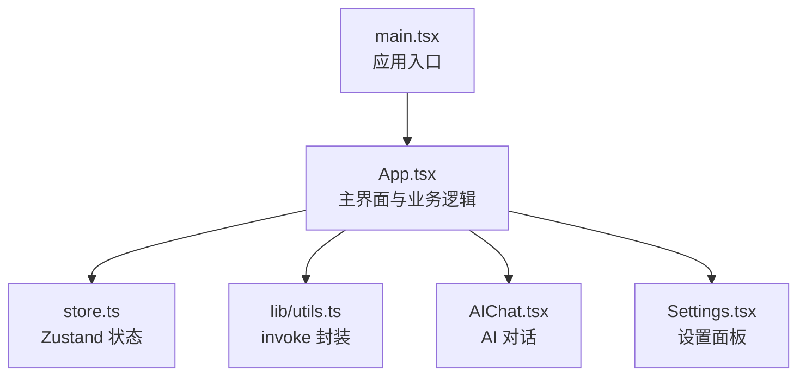
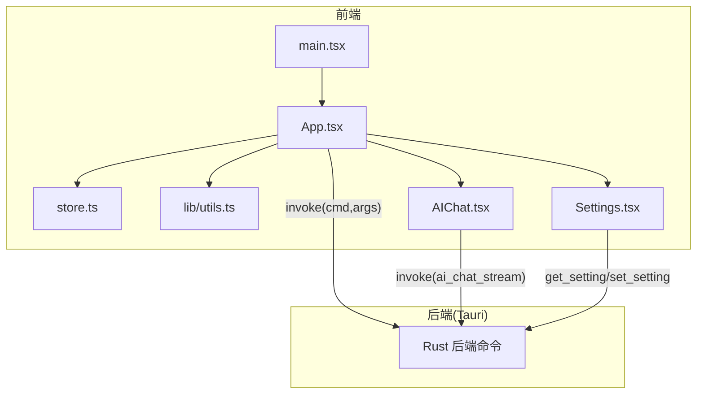
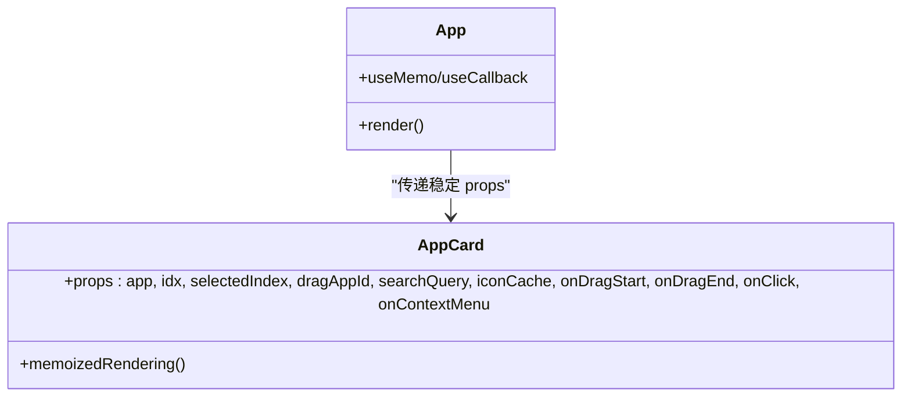
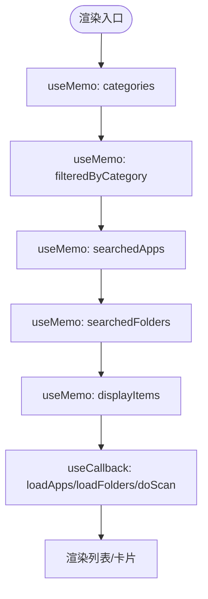
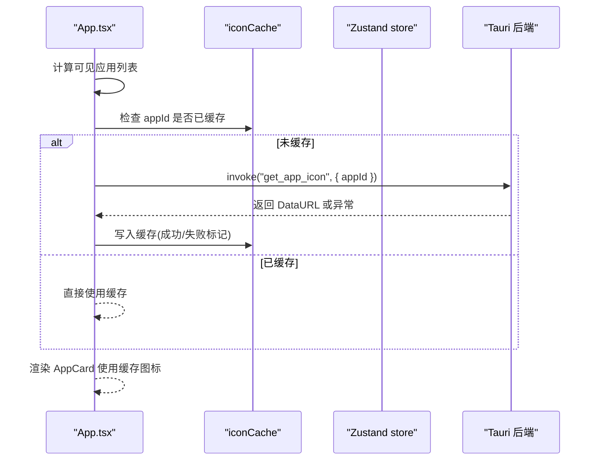
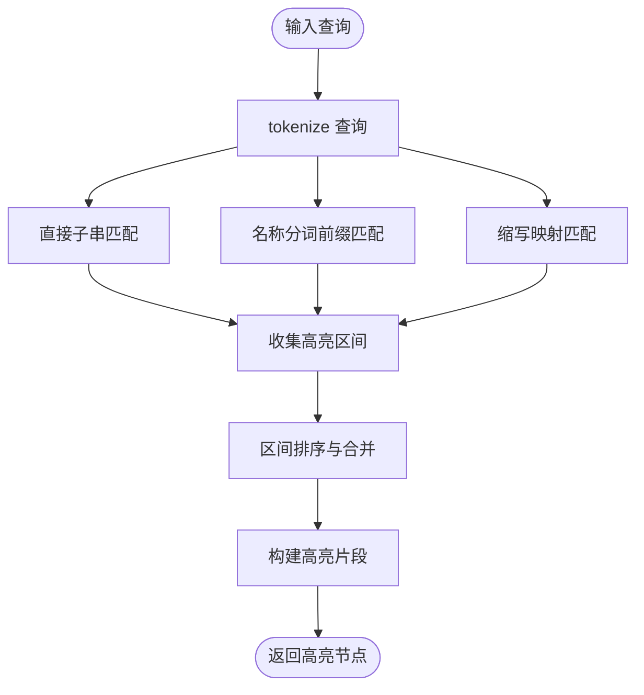
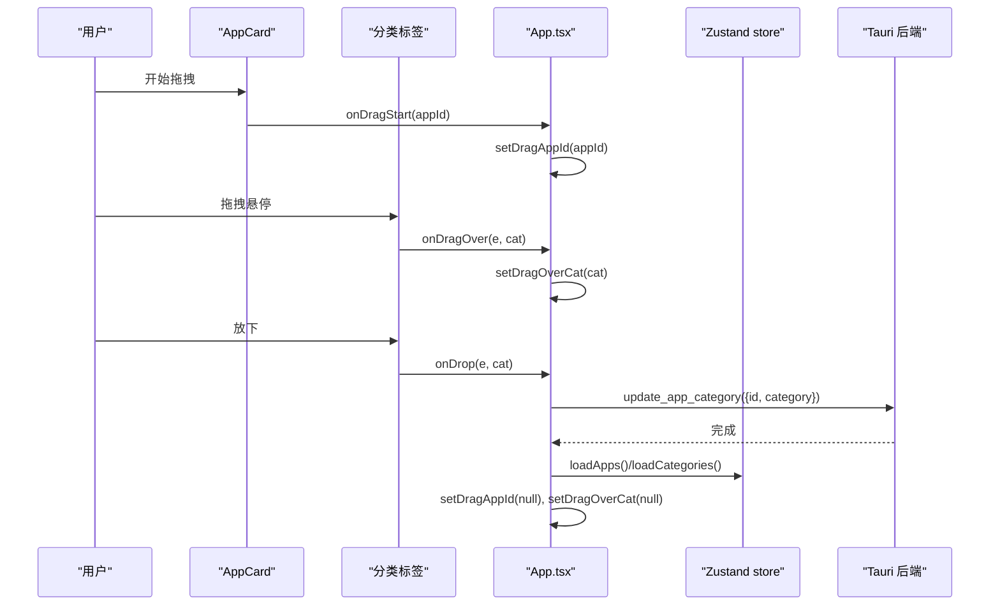
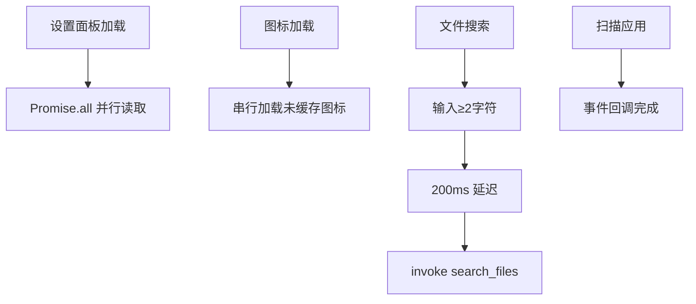
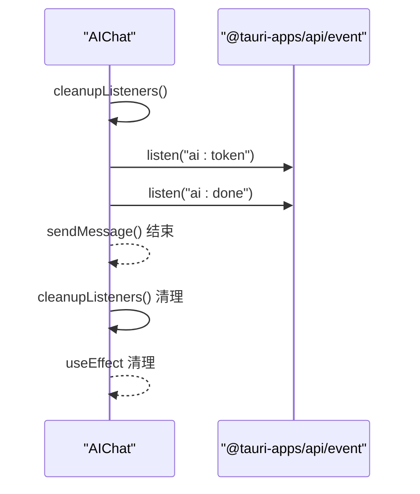
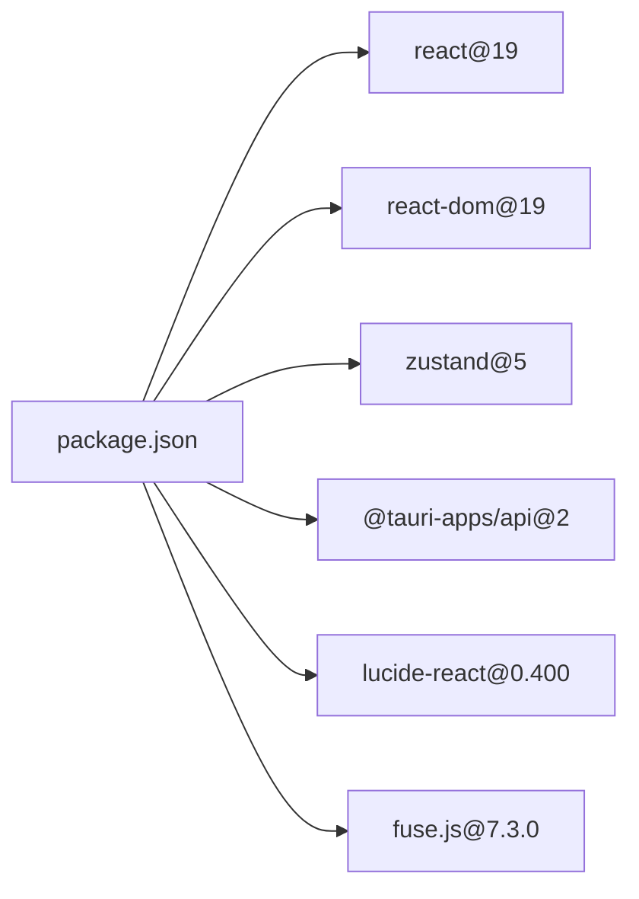

# 性能优化

<cite>
**本文引用的文件**
- [src/App.tsx](file://src/App.tsx)
- [src/main.tsx](file://src/main.tsx)
- [src/store.ts](file://src/store.ts)
- [src/lib/utils.ts](file://src/lib/utils.ts)
- [src/AIChat.tsx](file://src/AIChat.tsx)
- [src/Settings.tsx](file://src/Settings.tsx)
- [package.json](file://package.json)
</cite>

## 目录
1. [简介](#简介)
2. [项目结构](#项目结构)
3. [核心组件](#核心组件)
4. [架构总览](#架构总览)
5. [详细组件分析](#详细组件分析)
6. [依赖分析](#依赖分析)
7. [性能考量](#性能考量)
8. [故障排查指南](#故障排查指南)
9. [结论](#结论)
10. [附录](#附录)

## 简介
本文件聚焦于 QuickStart 的性能优化实践，围绕 React.memo、useMemo、useCallback 等策略，结合图标缓存、虚拟滚动缺失的现状与替代方案、异步加载策略、性能监控与内存泄漏防护、渲染性能分析，以及 React DevTools 使用技巧展开。同时给出针对大型应用列表渲染、搜索结果处理、拖拽操作性能的优化建议与落地路径。

## 项目结构
- 前端基于 React 19 与 Vite 构建，使用 Zustand 管理全局状态，通过 @tauri-apps/api 与 Rust 后端通信。
- 主应用入口在 main.tsx 中挂载 App，在 App.tsx 中实现搜索、分类、图标缓存、拖拽、AI 对话、设置等功能。
- 辅助模块 utils.ts 提供通用 invoke 封装与样式合并工具。

**图表来源**
- [src/main.tsx:1-11](file://src/main.tsx#L1-L11)
- [src/App.tsx:1-1299](file://src/App.tsx#L1-L1299)
- [src/store.ts:1-46](file://src/store.ts#L1-L46)
- [src/lib/utils.ts:1-25](file://src/lib/utils.ts#L1-L25)
- [src/AIChat.tsx:1-279](file://src/AIChat.tsx#L1-L279)
- [src/Settings.tsx:1-165](file://src/Settings.tsx#L1-L165)

**章节来源**
- [src/main.tsx:1-11](file://src/main.tsx#L1-L11)
- [package.json:1-50](file://package.json#L1-L50)

## 核心组件
- App 主组件：负责搜索、过滤、图标缓存、拖拽、键盘导航、计算表达式、文件搜索、显示项聚合等。
- AppCard：单个应用卡片，使用 React.memo 进行浅比较渲染优化。
- Zustand store：集中管理搜索词、应用列表、窗口可见性、语音状态等。
- AIChat：流式响应与事件监听，注意事件监听器清理。
- Settings：设置面板，涉及主题切换与系统偏好监听。

**章节来源**
- [src/App.tsx:49-70](file://src/App.tsx#L49-L70)
- [src/store.ts:13-45](file://src/store.ts#L13-L45)
- [src/AIChat.tsx:14-279](file://src/AIChat.tsx#L14-L279)
- [src/Settings.tsx:14-165](file://src/Settings.tsx#L14-L165)

## 架构总览
应用采用“前端渲染 + Tauri 命令调用”的架构。前端负责 UI 渲染、状态管理与交互；后端负责系统扫描、图标提取、文件系统访问等。

**图表来源**
- [src/main.tsx:6-9](file://src/main.tsx#L6-L9)
- [src/App.tsx:314-353](file://src/App.tsx#L314-L353)
- [src/AIChat.tsx:145-152](file://src/AIChat.tsx#L145-L152)
- [src/Settings.tsx:44-60](file://src/Settings.tsx#L44-L60)
- [src/lib/utils.ts:11-17](file://src/lib/utils.ts#L11-L17)

## 详细组件分析

### React.memo 与浅比较优化（AppCard）
- AppCard 使用 React.memo 包裹，避免因父组件重新渲染导致的重复渲染。
- 传入 props 包含 app、idx、selectedIndex、dragAppId、searchQuery、iconCache、回调等，均应保持稳定引用或通过 useMemo/useCallback 包裹，以提升浅比较命中率。

**图表来源**
- [src/App.tsx:49-70](file://src/App.tsx#L49-L70)

**章节来源**
- [src/App.tsx:49-70](file://src/App.tsx#L49-L70)

### useMemo 与 useCallback 的应用
- 分类列表与过滤：categories 与 filteredByCategory 使用 useMemo，避免每次渲染都重建数组。
- 搜索过滤：searchedApps、searchedFolders、displayItems 使用 useMemo，减少昂贵的过滤与拼接开销。
- 异步加载：loadApps、loadFolders、loadCategories、doScan 使用 useCallback，保证事件与副作用中引用稳定。
- 键盘导航：handleKeyDown 在 App.tsx 中声明，配合 useEffect 监听按键，避免重复绑定。

**图表来源**
- [src/App.tsx:428-491](file://src/App.tsx#L428-L491)
- [src/App.tsx:314-353](file://src/App.tsx#L314-L353)
- [src/App.tsx:549-579](file://src/App.tsx#L549-L579)

**章节来源**
- [src/App.tsx:428-491](file://src/App.tsx#L428-L491)
- [src/App.tsx:314-353](file://src/App.tsx#L314-L353)
- [src/App.tsx:549-579](file://src/App.tsx#L549-L579)

### 图标缓存机制
- 状态：iconCache 为 Record<number, string>，存储 appId 到图标 DataURL 或失败标记的映射。
- 加载策略：在可见应用列表变化时，串行加载未缓存的图标，避免并发过多导致卡顿。
- 失败保护：失败时写入失败标记，避免重复尝试。

**图表来源**
- [src/App.tsx:299-300](file://src/App.tsx#L299-L300)
- [src/App.tsx:666-677](file://src/App.tsx#L666-L677)
- [src/App.tsx:679-696](file://src/App.tsx#L679-L696)

**章节来源**
- [src/App.tsx:299-300](file://src/App.tsx#L299-L300)
- [src/App.tsx:666-677](file://src/App.tsx#L666-L677)
- [src/App.tsx:679-696](file://src/App.tsx#L679-L696)

### 搜索与高亮算法优化
- 分词 tokenize：对驼峰、连字符、点号进行拆分，降低误匹配。
- 缩写映射 ABBREVIATIONS：支持 vs -> visual studio 等常见缩写。
- 区间合并：对直接匹配、前缀匹配、缩写扩展生成的高亮区间进行排序与合并，避免重叠。
- 高亮构建：按合并后的区间切片与拼接，减少 DOM 节点数量。

**图表来源**
- [src/App.tsx:23-30](file://src/App.tsx#L23-L30)
- [src/App.tsx:33-47](file://src/App.tsx#L33-L47)
- [src/App.tsx:72-130](file://src/App.tsx#L72-L130)

**章节来源**
- [src/App.tsx:23-30](file://src/App.tsx#L23-L30)
- [src/App.tsx:33-47](file://src/App.tsx#L33-L47)
- [src/App.tsx:72-130](file://src/App.tsx#L72-L130)

### 拖拽操作性能
- HTML5 原生拖拽：在 App.tsx 中实现拖拽开始、悬停高亮、放下更新分类。
- 优化要点：
  - onDragStart/onDragEnd 仅设置少量状态，避免复杂计算。
  - onDragOver/onDrop 仅做防默认与状态切换，不执行 IO。
  - 更新分类后统一刷新列表，避免频繁局部重绘。

**图表来源**
- [src/App.tsx:615-642](file://src/App.tsx#L615-L642)
- [src/App.tsx:698-710](file://src/App.tsx#L698-L710)

**章节来源**
- [src/App.tsx:615-642](file://src/App.tsx#L615-L642)
- [src/App.tsx:698-710](file://src/App.tsx#L698-L710)

### 异步加载策略
- 并行加载设置：AIChat 中使用 Promise.all 并行读取多个设置项，减少等待时间。
- 串行图标加载：App 中对可见应用串行加载图标，避免并发过多导致卡顿与资源竞争。
- 文件搜索去抖：搜索输入超过 2 字符后延迟 200ms 触发，减少频繁 IO。
- 扫描与事件：扫描通过事件回调完成，避免阻塞 UI。

**图表来源**
- [src/AIChat.tsx:40-60](file://src/AIChat.tsx#L40-L60)
- [src/App.tsx:679-696](file://src/App.tsx#L679-L696)
- [src/App.tsx:412-424](file://src/App.tsx#L412-L424)
- [src/App.tsx:343-353](file://src/App.tsx#L343-L353)

**章节来源**
- [src/AIChat.tsx:40-60](file://src/AIChat.tsx#L40-L60)
- [src/App.tsx:679-696](file://src/App.tsx#L679-L696)
- [src/App.tsx:412-424](file://src/App.tsx#L412-L424)
- [src/App.tsx:343-353](file://src/App.tsx#L343-L353)

### 虚拟滚动优化（现状与替代）
- 现状：当前使用网格布局与 contentVisibility 属性，未引入虚拟滚动库（如 react-window 或 react-virtuoso）。
- 替代方案：
  - contentVisibility + 懒加载：已在 grid 上使用 contentVisibility，可进一步结合 IntersectionObserver 实现懒加载。
  - 分页/增量渲染：对超长列表采用分页或按需渲染部分可见区域。
  - 列表项尺寸固定：AppCard 固定尺寸，便于后续接入虚拟滚动库。
- 适用场景：应用数量巨大（>1000）时，虚拟滚动可显著降低 DOM 数量与重排成本。

[本节为概念性说明，不直接分析具体文件，故无“章节来源”]

### 性能监控与内存泄漏防护
- 事件监听清理：AIChat 中 sendMessage 前清理旧监听器，组件卸载时统一清理，避免内存泄漏。
- 主题监听：Settings 中监听系统主题变化，组件卸载时移除监听。
- 任务取消：文件搜索使用标志位与清理函数，避免竞态与无效渲染。

**图表来源**
- [src/AIChat.tsx:70-81](file://src/AIChat.tsx#L70-L81)
- [src/AIChat.tsx:97-108](file://src/AIChat.tsx#L97-L108)
- [src/AIChat.tsx:163-170](file://src/AIChat.tsx#L163-L170)
- [src/Settings.tsx:29-40](file://src/Settings.tsx#L29-L40)

**章节来源**
- [src/AIChat.tsx:70-81](file://src/AIChat.tsx#L70-L81)
- [src/AIChat.tsx:97-108](file://src/AIChat.tsx#L97-L108)
- [src/AIChat.tsx:163-170](file://src/AIChat.tsx#L163-L170)
- [src/Settings.tsx:29-40](file://src/Settings.tsx#L29-L40)

### 渲染性能分析与 DevTools 使用
- React DevTools：
  - Profiler：录制渲染阶段耗时，定位昂贵组件与重渲染根因。
  - Highlight Updates：开启后可观察受状态影响而重渲染的组件。
  - Components 标签：查看组件树、Props、State、Hooks。
- 关键观察点：
  - AppCard 是否被频繁重渲染（检查 props 稳定性）。
  - useMemo/useCallback 是否有效，必要时使用 useMemo 包裹复杂计算。
  - 事件监听是否正确清理，避免泄漏。
- Chrome Performance：
  - 录制脚本执行，观察主线程占用、垃圾回收、布局与绘制峰值。

[本节为通用指导，不直接分析具体文件，故无“章节来源”]

## 依赖分析
- React 19 与 Vite：提供现代打包与开发体验。
- @tauri-apps/api：前后端通信桥梁。
- zustand：轻量状态管理。
- lucide-react：图标库。
- fuse.js：模糊搜索（当前未在 App.tsx 中直接使用，但可作为可选替代方案）。

**图表来源**
- [package.json:14-31](file://package.json#L14-L31)

**章节来源**
- [package.json:14-31](file://package.json#L14-L31)

## 性能考量
- 渲染层面：
  - 优先使用 React.memo、useMemo、useCallback，确保 props 与依赖稳定。
  - 减少不必要的对象与函数创建，避免闭包陷阱。
- 状态层面：
  - 将大对象拆分为细粒度状态，降低无关重渲染。
  - 使用 Zustand 的 selector 选择器，避免全局状态变更引发的重渲染。
- IO 层面：
  - 并行读取独立设置项；串行加载图标，避免并发风暴。
  - 搜索输入去抖与任务取消，减少无效 IO。
- 资源层面：
  - 图标缓存失败标记，避免重复尝试。
  - contentVisibility 与懒加载，降低初始渲染压力。

[本节为通用指导，不直接分析具体文件，故无“章节来源”]

## 故障排查指南
- 图标不显示或闪烁：
  - 检查 iconCache 是否正确写入 DataURL 或失败标记。
  - 确认 get_app_icon 后端命令可用且返回有效数据。
- 搜索结果异常：
  - 确认 tokenize 与缩写映射逻辑，检查查询词大小写与分词边界。
  - 验证高亮区间合并逻辑，避免重叠导致的错位。
- 拖拽无响应：
  - 检查 onDragStart/onDragOver/onDrop 事件是否正确绑定。
  - 确认分类更新后刷新了列表与分类数据。
- AI 对话卡顿或内存泄漏：
  - 确保每次 sendMessage 前清理旧监听器，并在组件卸载时统一清理。
- 主题切换无效：
  - 检查系统主题监听是否注册与移除，确认 DOM 操作顺序。

**章节来源**
- [src/App.tsx:666-677](file://src/App.tsx#L666-L677)
- [src/App.tsx:72-130](file://src/App.tsx#L72-L130)
- [src/App.tsx:615-642](file://src/App.tsx#L615-L642)
- [src/AIChat.tsx:70-81](file://src/AIChat.tsx#L70-L81)
- [src/Settings.tsx:29-40](file://src/Settings.tsx#L29-L40)

## 结论
QuickStart 已在关键环节采用 React.memo、useMemo、useCallback 与图标缓存等优化策略，配合并行设置读取、串行图标加载、搜索去抖与事件监听清理，有效提升了交互流畅度与稳定性。对于超大规模列表，建议引入虚拟滚动与更精细的懒加载策略；同时持续利用 React DevTools 与 Chrome Performance 进行性能剖析与回归测试，确保长期可维护性与高性能表现。

## 附录
- 优化清单（可对照现有实现检查）：
  - 使用 React.memo 包裹重型子组件（如 AppCard）。
  - 用 useMemo 包裹昂贵计算与数组/对象构造。
  - 用 useCallback 包裹回调并在事件与副作用中复用。
  - 保持 props 稳定，避免匿名函数与内联对象。
  - 图标缓存失败标记，避免重复尝试。
  - 事件监听清理与组件卸载钩子。
  - 搜索去抖与任务取消。
  - contentVisibility 与懒加载结合。
  - 虚拟滚动（未来演进方向）。

[本节为通用指导，不直接分析具体文件，故无“章节来源”]