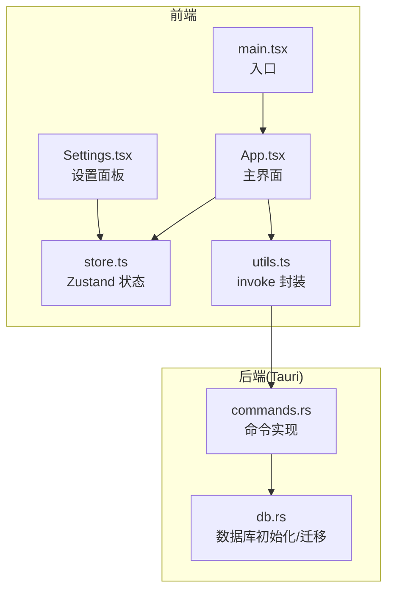
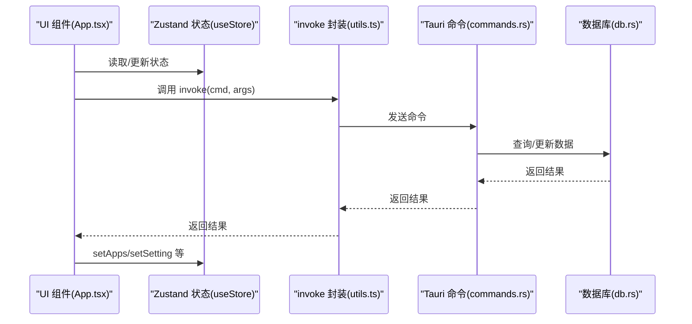
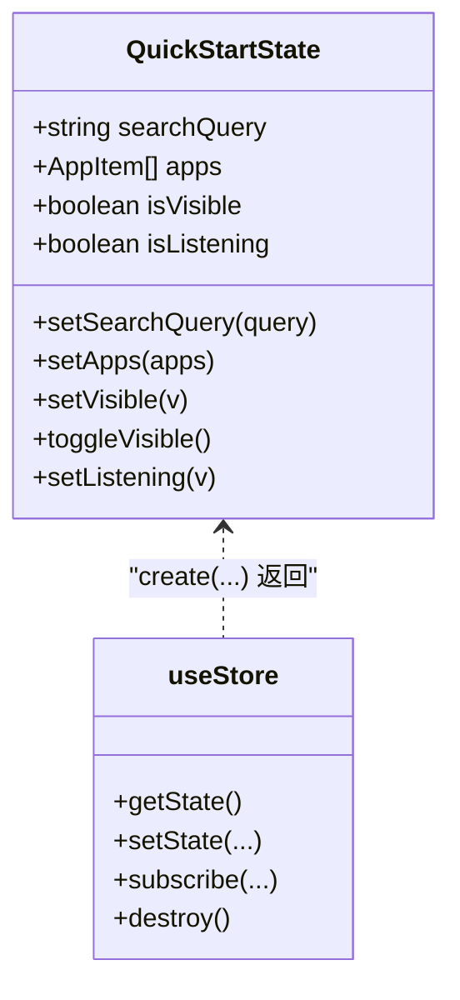
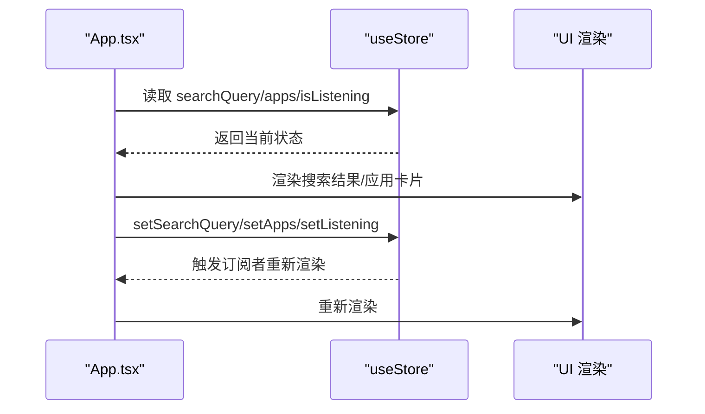
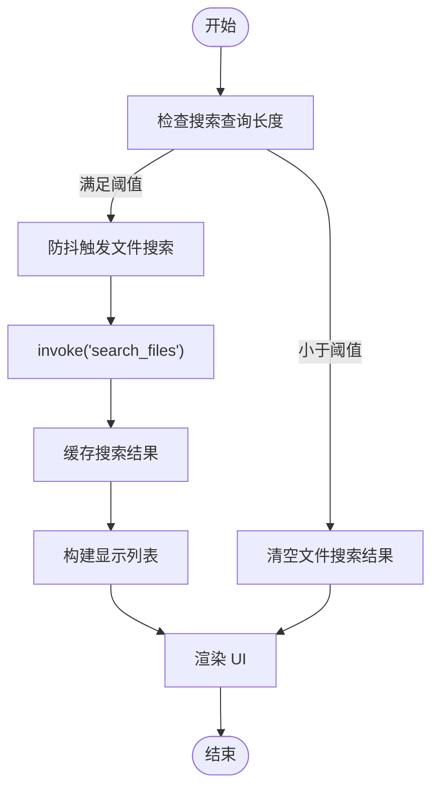
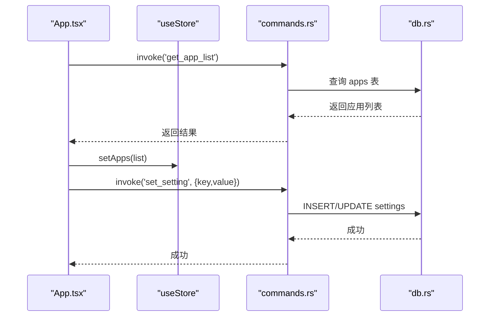
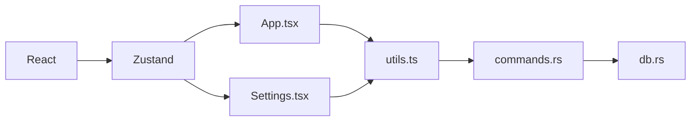

# 状态管理

<cite>
**本文引用的文件**
- [store.ts](file://src/store.ts)
- [App.tsx](file://src/App.tsx)
- [main.tsx](file://src/main.tsx)
- [Settings.tsx](file://src/Settings.tsx)
- [utils.ts](file://src/lib/utils.ts)
- [commands.rs](file://src-tauri/src/commands.rs)
- [db.rs](file://src-tauri/src/db.rs)
- [package.json](file://package.json)
</cite>

## 目录
1. [简介](#简介)
2. [项目结构](#项目结构)
3. [核心组件](#核心组件)
4. [架构总览](#架构总览)
5. [详细组件分析](#详细组件分析)
6. [依赖关系分析](#依赖关系分析)
7. [性能考量](#性能考量)
8. [故障排查指南](#故障排查指南)
9. [结论](#结论)
10. [附录](#附录)

## 简介
本文件围绕 QuickStart 的状态管理进行系统性说明，重点覆盖：
- Zustand 状态库的使用方式与全局状态设计模式
- useStore hook 的实现原理、状态订阅机制与更新策略
- 性能优化方案（计算缓存、订阅粒度、批量更新）
- 状态持久化与同步策略（前端状态与后端数据库的双向流转）
- 错误处理与边界条件
- 与 UI 组件的绑定方式与最佳实践
- 实战示例：应用列表、搜索状态、设置配置等核心状态的管理

## 项目结构
QuickStart 采用前端 React + Zustand + Tauri 的混合架构。前端通过 Zustand 管理 UI 状态，通过 invoke 调用 Tauri 后端命令，后端以 SQLite 作为持久化存储，并提供丰富的命令接口。

图表来源
- [main.tsx:1-11](file://src/main.tsx#L1-L11)
- [App.tsx:1-10](file://src/App.tsx#L1-L10)
- [store.ts:1-46](file://src/store.ts#L1-L46)
- [Settings.tsx:1-165](file://src/Settings.tsx#L1-L165)
- [utils.ts:1-25](file://src/lib/utils.ts#L1-L25)
- [commands.rs:1-709](file://src-tauri/src/commands.rs#L1-L709)
- [db.rs:1-156](file://src-tauri/src/db.rs#L1-L156)

章节来源
- [main.tsx:1-11](file://src/main.tsx#L1-L11)
- [package.json:1-50](file://package.json#L1-L50)

## 核心组件
- Zustand 状态容器：集中管理搜索文本、应用列表、窗口可见性、语音识别状态等。
- UI 组件：App.tsx 作为状态消费者，直接从 Zustand 读取/更新状态；Settings.tsx 通过 invoke 与后端交互，间接影响状态。
- Tauri 命令层：commands.rs 提供 get_app_list、set_setting、scan_apps 等命令，db.rs 负责数据库初始化与迁移。
- invoke 封装：utils.ts 对 @tauri-apps/api/core.invoke 进行统一封装，简化调用。

章节来源
- [store.ts:1-46](file://src/store.ts#L1-L46)
- [App.tsx:274-276](file://src/App.tsx#L274-L276)
- [Settings.tsx:1-165](file://src/Settings.tsx#L1-L165)
- [utils.ts:1-25](file://src/lib/utils.ts#L1-L25)
- [commands.rs:1-709](file://src-tauri/src/commands.rs#L1-L709)
- [db.rs:1-156](file://src-tauri/src/db.rs#L1-L156)

## 架构总览
前端状态与后端命令的交互链路如下：

图表来源
- [App.tsx:274-276](file://src/App.tsx#L274-L276)
- [store.ts:32-45](file://src/store.ts#L32-L45)
- [utils.ts:11-17](file://src/lib/utils.ts#L11-L17)
- [commands.rs:528-552](file://src-tauri/src/commands.rs#L528-L552)
- [db.rs:17-133](file://src-tauri/src/db.rs#L17-L133)

## 详细组件分析

### Zustand 状态容器与 useStore Hook
- 设计模式：以 create 函数创建状态容器，导出 useStore hook，统一管理搜索、应用列表、窗口可见性、语音识别等状态。
- 订阅机制：useStore 返回的函数式 setter 会触发订阅者重新渲染；toggleVisible 使用基于旧状态的函数式更新，保证原子性。
- 状态类型：QuickStartState 接口明确声明了状态字段与对应 setter 方法，便于类型推断与 IDE 支持。

图表来源
- [store.ts:13-45](file://src/store.ts#L13-L45)

章节来源
- [store.ts:1-46](file://src/store.ts#L1-L46)

### UI 组件与状态绑定
- App.tsx 通过解构 useStore 获取 searchQuery、setSearchQuery、apps、setApps、isListening、setListening 等状态与 setter。
- 组件内部通过 useEffect、useMemo、useCallback 等 React Hooks 与 Zustand 状态协同，实现搜索过滤、键盘导航、图标加载、扫描完成后的刷新等逻辑。
- Settings.tsx 通过 invoke 与后端交互，读取/设置配置，间接影响 UI 主题与行为。

图表来源
- [App.tsx:274-276](file://src/App.tsx#L274-L276)
- [store.ts:32-45](file://src/store.ts#L32-L45)

章节来源
- [App.tsx:274-276](file://src/App.tsx#L274-L276)
- [Settings.tsx:1-165](file://src/Settings.tsx#L1-L165)

### 状态更新策略与性能优化
- 计算缓存与记忆化：
  - useMemo 用于缓存搜索结果、分类筛选、显示列表等昂贵计算，减少不必要的渲染。
  - useCallback 用于稳定回调函数引用，避免子组件无谓重渲染。
- 订阅粒度控制：
  - 仅在需要的组件内订阅 useStore 的相关字段，避免全局订阅导致的过度渲染。
- 批量更新与事件驱动：
  - 扫描完成后通过事件 scan-complete 统一刷新应用列表与分类，避免多次 setState 导致的抖动。
- 图标加载优化：
  - 通过 iconCache 缓存图标结果，避免重复请求；对失败情况使用标记值防止重复尝试。

图表来源
- [App.tsx:412-424](file://src/App.tsx#L412-L424)
- [utils.ts:11-17](file://src/lib/utils.ts#L11-L17)

章节来源
- [App.tsx:412-424](file://src/App.tsx#L412-L424)
- [utils.ts:1-25](file://src/lib/utils.ts#L1-L25)

### 状态持久化与同步策略
- 前端状态：Zustand 管理 UI 层状态（搜索、窗口可见性、语音识别），用于即时交互体验。
- 后端持久化：Tauri 命令层通过 SQLite 存储应用列表、分类、设置、搜索历史等数据。
- 同步策略：
  - 初始化：启动时加载应用列表、分类、文件夹、搜索历史等，必要时触发后台扫描。
  - 写入：通过 invoke('set_setting')、invoke('add_app')、invoke('update_app_category') 等命令写入数据库。
  - 事件驱动：扫描完成后通过事件 scan-complete 统一刷新前端状态，确保前后端一致。
- 数据库初始化与迁移：db.rs 负责创建表、索引与默认设置，保证首次运行与升级后的兼容性。

图表来源
- [App.tsx:315-317](file://src/App.tsx#L315-L317)
- [commands.rs:528-552](file://src-tauri/src/commands.rs#L528-L552)
- [commands.rs:407-415](file://src-tauri/src/commands.rs#L407-L415)
- [db.rs:17-133](file://src-tauri/src/db.rs#L17-L133)

章节来源
- [commands.rs:528-552](file://src-tauri/src/commands.rs#L528-L552)
- [commands.rs:407-415](file://src-tauri/src/commands.rs#L407-L415)
- [db.rs:17-133](file://src-tauri/src/db.rs#L17-L133)

### 错误处理方案
- 前端错误处理：
  - 对 invoke 调用进行 try/catch 包裹，记录警告信息并提示用户。
  - 对图标加载失败使用标记值，避免重复尝试。
- 后端错误处理：
  - 命令函数返回 Result，错误通过 Err 字符串传递给前端，前端统一处理。
  - 数据库操作使用锁与事务，保证并发安全与一致性。
- 边界条件：
  - 输入长度阈值（如文件搜索至少 2 个字符）、空查询处理、缩写映射、计算器表达式合法性校验等。

章节来源
- [App.tsx:315-317](file://src/App.tsx#L315-L317)
- [App.tsx:667-677](file://src/App.tsx#L667-L677)
- [commands.rs:508-512](file://src-tauri/src/commands.rs#L508-L512)

### 实战示例：管理应用列表、搜索状态、设置配置
- 应用列表：
  - 初始化：invoke('get_app_list') 获取应用列表，setApps 更新 Zustand 状态。
  - 更新：invoke('add_app'/'update_app_category'/'remove_app') 后刷新列表。
- 搜索状态：
  - setSearchQuery 更新搜索文本，App.tsx 内部通过分词与缩写映射实现高亮与过滤。
  - 文件搜索：当查询长度满足阈值时，invoke('search_files') 返回结果并缓存。
- 设置配置：
  - Settings.tsx 通过 invoke('get_setting'/'set_setting') 读取/保存设置，应用主题即时生效。

章节来源
- [App.tsx:315-317](file://src/App.tsx#L315-L317)
- [App.tsx:412-424](file://src/App.tsx#L412-L424)
- [Settings.tsx:19-60](file://src/Settings.tsx#L19-L60)
- [commands.rs:528-552](file://src-tauri/src/commands.rs#L528-L552)
- [commands.rs:453-488](file://src-tauri/src/commands.rs#L453-L488)
- [commands.rs:398-415](file://src-tauri/src/commands.rs#L398-L415)

## 依赖关系分析
- 前端依赖：React、Zustand、@tauri-apps/api、lucide-react 等。
- 后端依赖：rusqlite、serde、reqwest、open 等。
- 关键耦合点：invoke 封装与命令层，Zustand 与 UI 组件。

图表来源
- [package.json:14-31](file://package.json#L14-L31)
- [utils.ts:11-17](file://src/lib/utils.ts#L11-L17)
- [commands.rs:1-709](file://src-tauri/src/commands.rs#L1-L709)
- [db.rs:1-156](file://src-tauri/src/db.rs#L1-L156)

章节来源
- [package.json:1-50](file://package.json#L1-L50)

## 性能考量
- 渲染优化：
  - 使用 memo/memoized 组件与 useMemo/useCallback 缓存昂贵计算与回调。
  - 控制订阅范围，避免全局订阅导致的过度渲染。
- 异步与事件：
  - 扫描等耗时任务在后台执行并通过事件统一刷新，避免阻塞 UI。
- I/O 优化：
  - 图标按需加载并缓存，失败标记避免重复尝试。
  - 文件搜索限制结果数量与目录范围，降低 I/O 压力。

## 故障排查指南
- 常见问题与定位：
  - invoke 调用失败：检查命令签名与参数，确认后端命令实现与前端调用一致。
  - 图标加载失败：检查图标缓存标记与数据库记录，确认路径有效性。
  - 扫描未完成：确认事件监听与 scan-complete 事件处理，避免 setScanning 未复位。
- 日志与调试：
  - 前端使用 console.warn/console.error 记录异常，配合 Toast 提示用户。
  - 后端命令返回错误字符串，前端统一处理并提示。

章节来源
- [App.tsx:343-353](file://src/App.tsx#L343-L353)
- [App.tsx:667-677](file://src/App.tsx#L667-L677)
- [commands.rs:230-249](file://src-tauri/src/commands.rs#L230-L249)

## 结论
QuickStart 的状态管理以 Zustand 为核心，结合 Tauri 命令层与 SQLite 持久化，实现了从前端交互到后端数据的一体化管理。通过合理的订阅粒度、计算缓存与事件驱动刷新，系统在保证用户体验的同时兼顾了性能与可维护性。建议在后续迭代中进一步引入中间件（如日志、调试）与更细粒度的状态拆分，以提升复杂场景下的可扩展性。

## 附录
- 相关文件与职责概览：
  - store.ts：定义状态接口与 useStore 容器
  - App.tsx：状态消费者与业务逻辑聚合
  - Settings.tsx：设置面板与后端交互
  - utils.ts：invoke 封装
  - commands.rs：命令实现与数据库访问
  - db.rs：数据库初始化与迁移
  - package.json：依赖与脚本