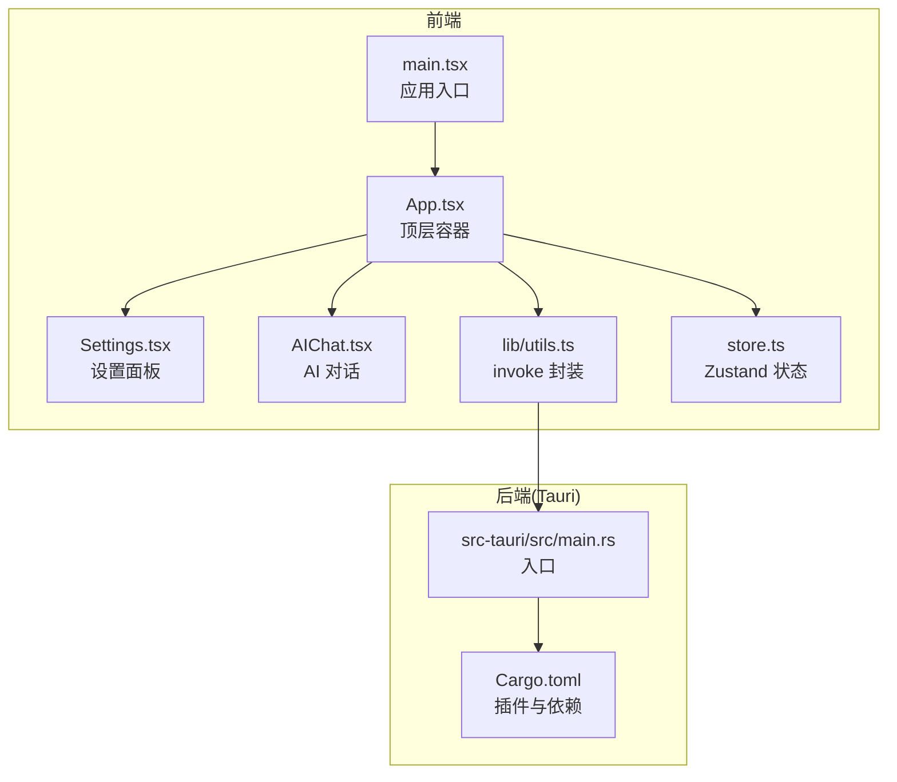
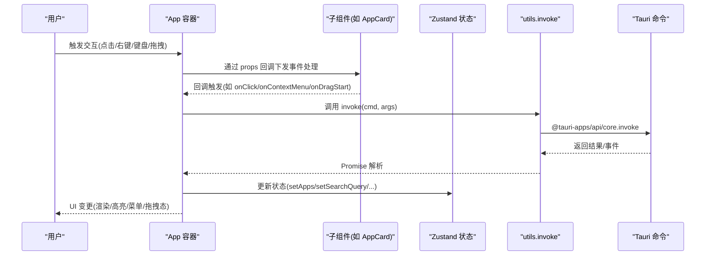
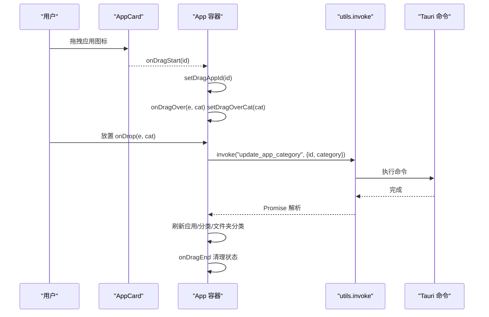
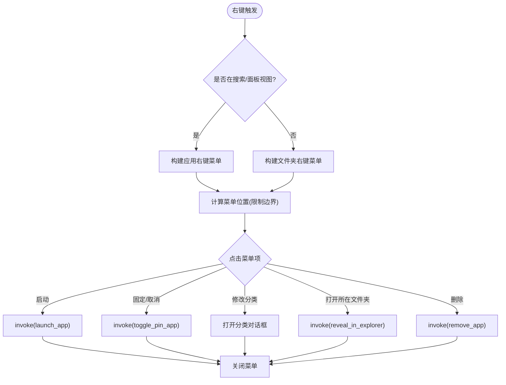
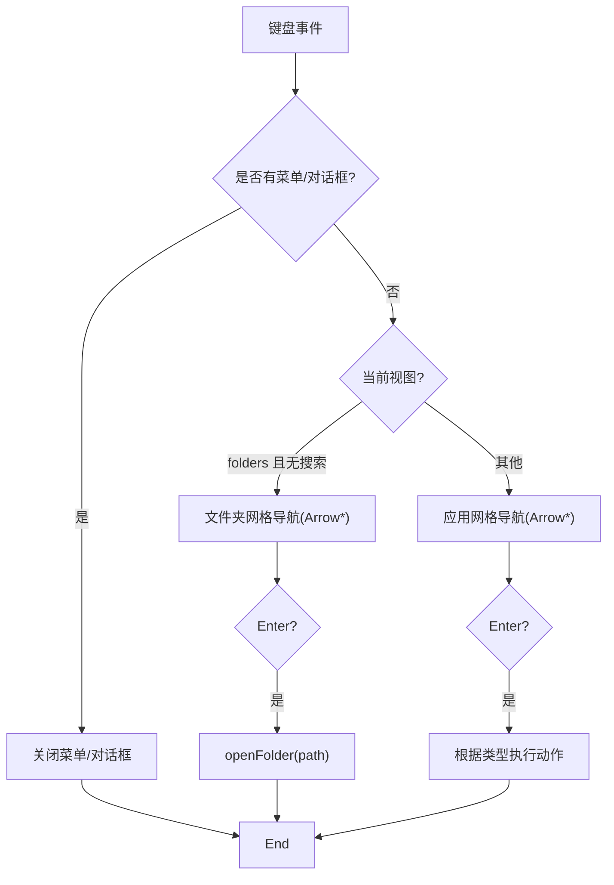
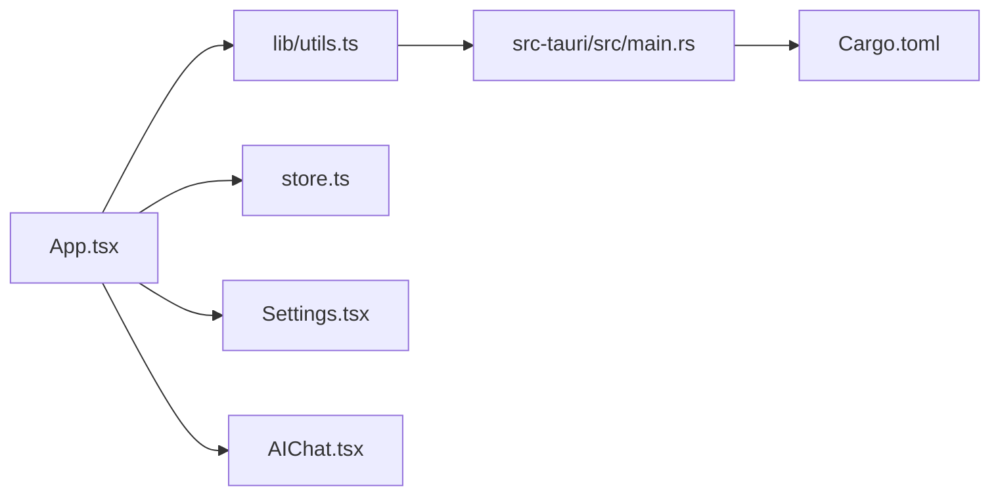

# 组件交互

<cite>
**本文引用的文件**
- [src/App.tsx](file://src/App.tsx)
- [src/main.tsx](file://src/main.tsx)
- [src/store.ts](file://src/store.ts)
- [src/lib/utils.ts](file://src/lib/utils.ts)
- [src/AIChat.tsx](file://src/AIChat.tsx)
- [src/Settings.tsx](file://src/Settings.tsx)
- [src-tauri/src/main.rs](file://src-tauri/src/main.rs)
- [src-tauri/Cargo.toml](file://src-tauri/Cargo.toml)
</cite>

## 目录
1. [简介](#简介)
2. [项目结构](#项目结构)
3. [核心组件](#核心组件)
4. [架构总览](#架构总览)
5. [详细组件分析](#详细组件分析)
6. [依赖关系分析](#依赖关系分析)
7. [性能考量](#性能考量)
8. [故障排查指南](#故障排查指南)
9. [结论](#结论)
10. [附录](#附录)

## 简介
本文件聚焦 QuickStart 的组件间交互机制，系统性阐述父子组件通信、兄弟组件协作、事件冒泡与拦截策略；详解拖拽分类、右键菜单、键盘导航等交互实现；并覆盖生命周期管理、条件渲染与动态加载等主题。文档同时给出面向实际开发的实践建议与性能优化要点，并通过图示帮助读者建立对整体架构与数据流的直观认知。

## 项目结构
QuickStart 采用前端 React + Zustand 状态管理、后端 Tauri 的双层架构。入口在 main.tsx 中挂载根组件 App.tsx；App.tsx 作为顶层容器协调搜索、应用面板、文件夹视图、AI 对话、设置面板等模块；通过 utils.ts 提供统一的 Tauri 命令调用封装；AIChat.tsx 与 Settings.tsx 作为独立的弹窗组件与主界面解耦。

图表来源
- [src/main.tsx:1-10](file://src/main.tsx#L1-L10)
- [src/App.tsx:1-1299](file://src/App.tsx#L1-L1299)
- [src/lib/utils.ts:1-25](file://src/lib/utils.ts#L1-L25)
- [src/store.ts:1-46](file://src/store.ts#L1-L46)
- [src/AIChat.tsx:1-279](file://src/AIChat.tsx#L1-L279)
- [src/Settings.tsx:1-165](file://src/Settings.tsx#L1-L165)
- [src-tauri/src/main.rs:1-7](file://src-tauri/src/main.rs#L1-L7)
- [src-tauri/Cargo.toml:1-36](file://src-tauri/Cargo.toml#L1-L36)

章节来源
- [src/main.tsx:1-10](file://src/main.tsx#L1-L10)
- [src/App.tsx:1-1299](file://src/App.tsx#L1-L1299)
- [src/lib/utils.ts:1-25](file://src/lib/utils.ts#L1-L25)
- [src/store.ts:1-46](file://src/store.ts#L1-L46)
- [src/AIChat.tsx:1-279](file://src/AIChat.tsx#L1-L279)
- [src/Settings.tsx:1-165](file://src/Settings.tsx#L1-L165)
- [src-tauri/src/main.rs:1-7](file://src-tauri/src/main.rs#L1-L7)
- [src-tauri/Cargo.toml:1-36](file://src-tauri/Cargo.toml#L1-L36)

## 核心组件
- 顶层容器 App：负责视图切换、搜索与过滤、拖拽分类、键盘导航、右键菜单、图标缓存、文件拖放、扫描与更新提示、窗口控制等。
- 设置面板 Settings：集中管理主题、快捷键、开机自启、自动分类、AI 配置等。
- AI 对话 AIChat：独立弹窗，负责与后端流式事件交互、消息管理、语音输入。
- 状态管理 store：Zustand 管理搜索词、应用列表、窗口可见性、语音状态。
- 工具库 utils：统一的 invoke 封装，屏蔽 @tauri-apps/api/core 的动态导入细节。

章节来源
- [src/App.tsx:274-1299](file://src/App.tsx#L274-L1299)
- [src/Settings.tsx:14-165](file://src/Settings.tsx#L14-L165)
- [src/AIChat.tsx:14-279](file://src/AIChat.tsx#L14-L279)
- [src/store.ts:13-46](file://src/store.ts#L13-L46)
- [src/lib/utils.ts:11-17](file://src/lib/utils.ts#L11-L17)

## 架构总览
QuickStart 的交互架构围绕“顶层容器 App + 子组件 + Zustand + Tauri 命令”展开。App 通过 props 下发回调给子组件（如 AppCard），子组件通过回调与 App 协作完成事件处理；App 再通过 utils.invoke 调用后端能力，实现应用启动、图标提取、分类更新、文件夹操作、扫描等。

图表来源
- [src/App.tsx:548-784](file://src/App.tsx#L548-L784)
- [src/App.tsx:614-642](file://src/App.tsx#L614-L642)
- [src/App.tsx:1206-1236](file://src/App.tsx#L1206-L1236)
- [src/lib/utils.ts:11-17](file://src/lib/utils.ts#L11-L17)
- [src/store.ts:32-46](file://src/store.ts#L32-L46)

## 详细组件分析

### 父子组件通信与事件冒泡
- App 通过 props 将事件处理函数传递给子组件（如 AppCard 的 onClick/onDragStart/onContextMenu），实现父子单向数据流与回调协作。
- App 在根节点上统一处理全局事件（如 onContextMenu 防止默认菜单、onDrop/onDragOver 处理拖放），并通过状态控制右键菜单与对话框的显隐，避免事件穿透到页面其他区域。
- 右键菜单与对话框采用受控渲染，点击外部区域统一收起，体现“事件冒泡拦截 + 受控状态”的协作模式。

章节来源
- [src/App.tsx:49-70](file://src/App.tsx#L49-L70)
- [src/App.tsx:784](file://src/App.tsx#L784)
- [src/App.tsx:1206-1236](file://src/App.tsx#L1206-L1236)

### 兄弟组件协作与共享状态
- Settings 与 App 通过 utils.invoke 与后端交互，但彼此不直接依赖；App 通过 store 管理搜索词与应用列表，Settings 仅在保存时回写设置。
- AIChat 与 App 亦通过 utils.invoke 与后端事件流交互，二者互不直接耦合，通过事件通道实现松耦合协作。

章节来源
- [src/Settings.tsx:14-62](file://src/Settings.tsx#L14-L62)
- [src/AIChat.tsx:83-161](file://src/AIChat.tsx#L83-L161)
- [src/lib/utils.ts:11-17](file://src/lib/utils.ts#L11-L17)

### 拖拽操作实现（应用分类）
- HTML5 原生拖拽：AppCard 使用 draggable 属性，onDragStart/onDragEnd 控制拖拽开始与结束状态；顶层容器 onDragStart/onDragEnd 维护 dragAppId；在分类标签区域 onDragOver/onDrop 捕获放置事件，调用 update_app_category 并刷新数据。
- 拖拽视觉反馈：当拖拽悬停在分类标签上时，通过 dragOverCat 状态切换样式，增强可用性。
- 放置行为：仅在拖拽目标为有效分类且非“全部”时执行更新，避免误操作。

图表来源
- [src/App.tsx:614-642](file://src/App.tsx#L614-L642)
- [src/App.tsx:867-886](file://src/App.tsx#L867-L886)
- [src/lib/utils.ts:11-17](file://src/lib/utils.ts#L11-L17)

章节来源
- [src/App.tsx:614-642](file://src/App.tsx#L614-L642)
- [src/App.tsx:867-886](file://src/App.tsx#L867-L886)

### 右键菜单系统（应用与文件夹）
- 应用右键菜单：支持启动、固定/取消固定、修改分类、打开所在文件夹、删除等；位置通过 clampMenuPos 限制在可视区域内。
- 文件夹右键菜单：支持打开、打开所在文件夹、批量修改分类等；支持滚动区域内的长列表展示。
- 关闭策略：点击外部区域统一关闭菜单；Esc 键优先关闭菜单与对话框。

图表来源
- [src/App.tsx:1206-1236](file://src/App.tsx#L1206-L1236)
- [src/App.tsx:1218-1236](file://src/App.tsx#L1218-L1236)
- [src/App.tsx:16-19](file://src/App.tsx#L16-L19)

章节来源
- [src/App.tsx:1206-1236](file://src/App.tsx#L1206-L1236)
- [src/App.tsx:1218-1236](file://src/App.tsx#L1218-L1236)
- [src/App.tsx:16-19](file://src/App.tsx#L16-L19)

### 键盘导航机制
- 全局键盘事件：顶层容器监听键盘事件，优先关闭菜单与对话框，再进行导航。
- 应用网格导航：支持上下左右箭头移动选中项，Enter 执行对应动作（启动应用/打开文件夹/打开文件），Esc 清空搜索或隐藏窗口。
- 文件夹视图导航：在文件夹视图且无搜索时，支持方向键在网格中移动，Enter 打开文件夹。
- 自动滚动：选中项变化时，自动滚动到可视区域，提升可达性。

图表来源
- [src/App.tsx:548-579](file://src/App.tsx#L548-L579)
- [src/App.tsx:554-566](file://src/App.tsx#L554-L566)
- [src/App.tsx:567-579](file://src/App.tsx#L567-L579)
- [src/App.tsx:534-544](file://src/App.tsx#L534-L544)

章节来源
- [src/App.tsx:548-579](file://src/App.tsx#L548-L579)
- [src/App.tsx:554-566](file://src/App.tsx#L554-L566)
- [src/App.tsx:567-579](file://src/App.tsx#L567-L579)
- [src/App.tsx:534-544](file://src/App.tsx#L534-L544)

### 组件生命周期管理与条件渲染
- 生命周期：App 使用 useEffect 初始化主题、加载数据、监听扫描完成事件、语音识别、窗口控制等；子组件（如 AIChat）在卸载时清理事件监听器。
- 条件渲染：根据视图状态（search/panel/folders）与搜索词、计算表达式、文件搜索结果等动态组合显示列表；右键菜单与对话框通过布尔状态受控显示。
- 动态加载：图标缓存通过 iconCache 避免重复请求；仅在可见应用列表变化时触发加载。

章节来源
- [src/App.tsx:355-409](file://src/App.tsx#L355-L409)
- [src/App.tsx:679-696](file://src/App.tsx#L679-L696)
- [src/AIChat.tsx:78-81](file://src/AIChat.tsx#L78-L81)
- [src/App.tsx:505-515](file://src/App.tsx#L505-L515)

### 搜索与高亮显示
- 分词与缩写：使用 tokenize 将名称按驼峰/分隔符拆分；支持常见缩写映射（如 vs -> visual studio）。
- 匹配策略：直接子串匹配优先；随后 token 前缀匹配；最后缩写扩展匹配；合并重叠区间并生成带 mark 的高亮片段。
- 计算器：检测纯数学表达式，使用安全解析器计算并显示结果，避免执行任意代码。

章节来源
- [src/App.tsx:21-47](file://src/App.tsx#L21-L47)
- [src/App.tsx:72-130](file://src/App.tsx#L72-L130)
- [src/App.tsx:484-503](file://src/App.tsx#L484-L503)
- [src/App.tsx:132-247](file://src/App.tsx#L132-L247)

### 文件拖放与图标加载
- 文件拖放：顶层容器 onDrop 捕获拖入的 .exe/.lnk 文件，调用 add_app 并刷新应用列表。
- 图标加载：根据当前可见应用列表（搜索结果或面板分类）串行加载图标，缓存成功/失败结果，避免重复请求。

章节来源
- [src/App.tsx:767-777](file://src/App.tsx#L767-L777)
- [src/App.tsx:667-696](file://src/App.tsx#L667-L696)

### AI 对话与设置面板
- AI 对话：通过事件监听接收流式输出，支持语音输入；组件卸载时清理监听器，避免内存泄漏。
- 设置面板：集中读取/写入设置，支持主题跟随系统；保存后即时应用主题。

章节来源
- [src/AIChat.tsx:83-161](file://src/AIChat.tsx#L83-L161)
- [src/AIChat.tsx:78-81](file://src/AIChat.tsx#L78-L81)
- [src/Settings.tsx:19-60](file://src/Settings.tsx#L19-L60)

## 依赖关系分析
- 前端依赖：React、Zustand、@tauri-apps/api、lucide-react、tailwindcss 生态。
- 后端依赖：Tauri 核心与多个插件（shell/dialog/opener/process/global-shortcut/autostart），以及 rusqlite、reqwest、windows 等用于系统集成与网络访问。
- 命令调用：utils.invoke 统一封装，避免各组件直接引入 @tauri-apps/api/core，降低耦合度。

图表来源
- [src/App.tsx:1-1299](file://src/App.tsx#L1-L1299)
- [src/lib/utils.ts:11-17](file://src/lib/utils.ts#L11-L17)
- [src/store.ts:1-46](file://src/store.ts#L1-L46)
- [src/Settings.tsx:1-165](file://src/Settings.tsx#L1-L165)
- [src/AIChat.tsx:1-279](file://src/AIChat.tsx#L1-L279)
- [src-tauri/src/main.rs:1-7](file://src-tauri/src/main.rs#L1-L7)
- [src-tauri/Cargo.toml:15-36](file://src-tauri/Cargo.toml#L15-L36)

章节来源
- [src-tauri/Cargo.toml:15-36](file://src-tauri/Cargo.toml#L15-L36)
- [src-tauri/src/main.rs:1-7](file://src-tauri/src/main.rs#L1-L7)
- [src/lib/utils.ts:11-17](file://src/lib/utils.ts#L11-L17)

## 性能考量
- 图标加载串行化：为保证首屏渲染稳定与避免并发请求风暴，采用串行加载策略；若列表较大，可考虑分批或虚拟化。
- 计算高亮与匹配：分词与缩写映射在搜索时执行，建议对超长列表使用节流/防抖；对高频输入场景可延迟到 200ms 后再查询文件系统。
- 事件监听清理：AIChat 在卸载时清理事件监听器，避免内存泄漏；同类组件应遵循相同实践。
- 拖拽状态最小化：仅在必要时更新 dragAppId/dragOverCat，避免不必要的重渲染。
- 窗口滚动与自动定位：仅在选中项变化时触发滚动，减少布局抖动。

## 故障排查指南
- 右键菜单不消失：确认顶层容器 onContextMenu 防止默认菜单并绑定点击外部关闭逻辑。
- 拖拽无效：检查 onDragStart/onDragOver/onDrop 的状态同步与目标分类合法性（非“全部”）。
- 图标不显示：检查 iconCache 标记与失败重试策略；确认后端返回的图标数据 URL。
- 键盘导航异常：确认键盘事件优先级与视图状态分支；检查 selectedIndex 边界与自动滚动逻辑。
- AI 对话无响应：检查事件监听是否正确注册与清理；确认后端事件通道正常。

章节来源
- [src/App.tsx:784](file://src/App.tsx#L784)
- [src/App.tsx:614-642](file://src/App.tsx#L614-L642)
- [src/App.tsx:667-696](file://src/App.tsx#L667-L696)
- [src/AIChat.tsx:78-81](file://src/AIChat.tsx#L78-L81)

## 结论
QuickStart 的组件交互以 App 为核心容器，通过 props 回调、Zustand 状态与 utils.invoke 命令封装，实现了清晰的父子通信与低耦合的兄弟协作。拖拽分类、右键菜单、键盘导航、搜索高亮与图标缓存等特性共同构成了高效易用的桌面启动器体验。建议在大规模数据场景下进一步优化渲染与请求策略，持续完善事件清理与边界处理，以获得更稳健的性能表现。

## 附录
- 实现参考路径（不含具体代码内容）：
  - 应用卡片拖拽分类：[src/App.tsx:614-642](file://src/App.tsx#L614-L642)
  - 文件夹右键菜单：[src/App.tsx:1218-1236](file://src/App.tsx#L1218-L1236)
  - 搜索结果高亮：[src/App.tsx:72-130](file://src/App.tsx#L72-L130)
  - 键盘导航：[src/App.tsx:548-579](file://src/App.tsx#L548-L579)
  - 图标缓存与加载：[src/App.tsx:667-696](file://src/App.tsx#L667-L696)
  - AI 对话事件清理：[src/AIChat.tsx:78-81](file://src/AIChat.tsx#L78-L81)
  - 设置主题应用：[src/Settings.tsx:29-60](file://src/Settings.tsx#L29-L60)
  - Tauri 命令封装：[src/lib/utils.ts:11-17](file://src/lib/utils.ts#L11-L17)