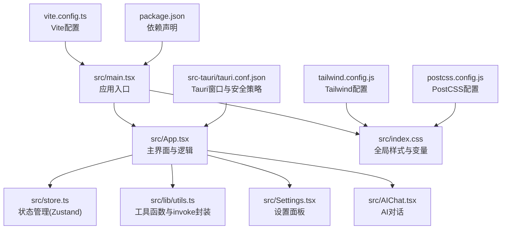
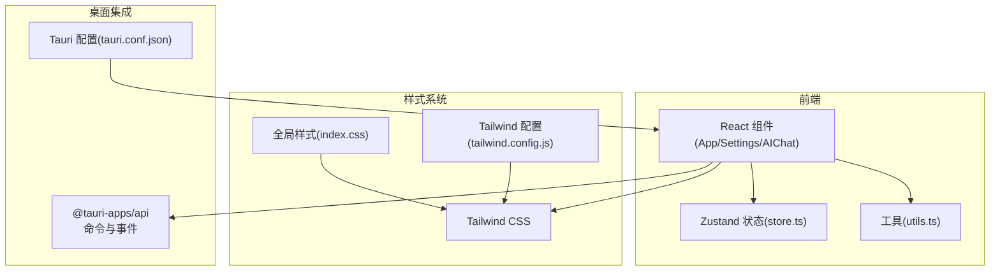
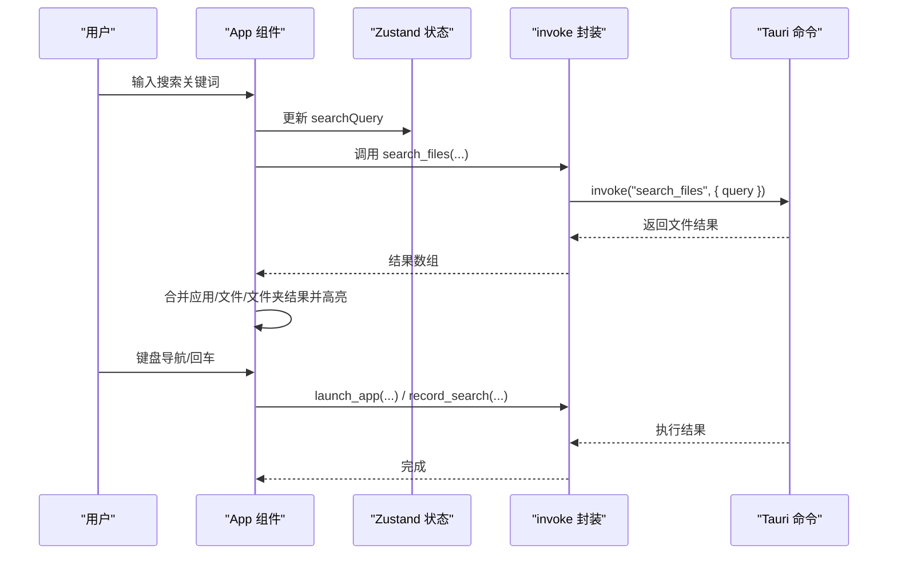
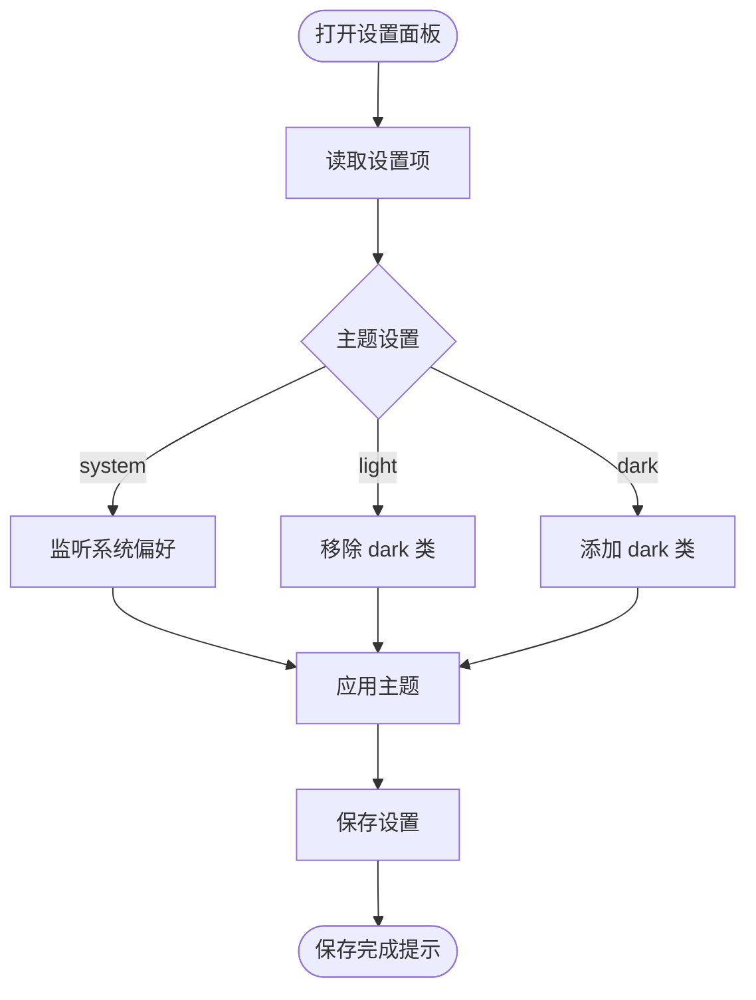
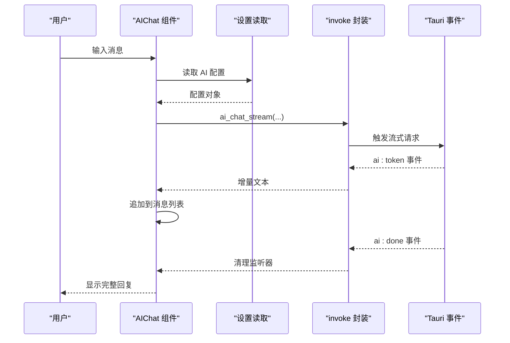
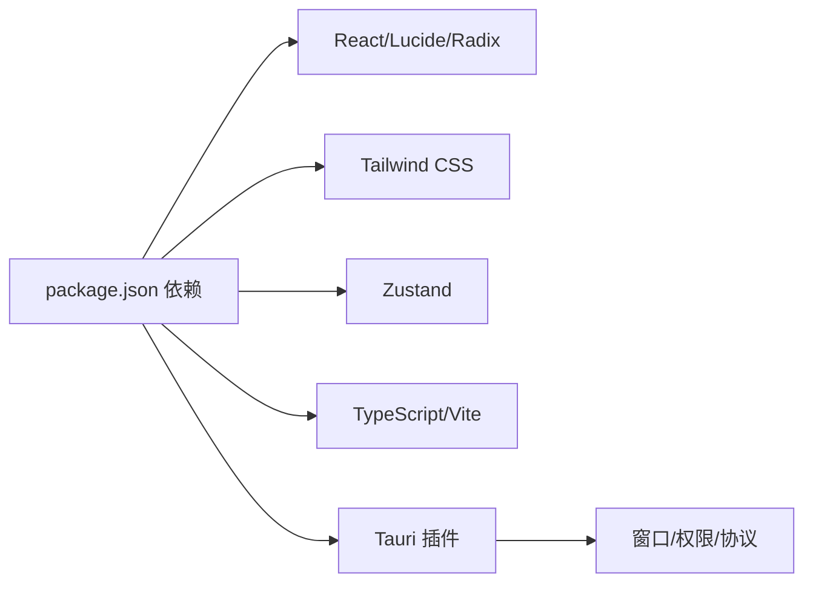

# UI组件库

<cite>
**本文引用的文件**
- [src/main.tsx](file://src/main.tsx)
- [src/App.tsx](file://src/App.tsx)
- [src/index.css](file://src/index.css)
- [tailwind.config.js](file://tailwind.config.js)
- [postcss.config.js](file://postcss.config.js)
- [src/store.ts](file://src/store.ts)
- [src/lib/utils.ts](file://src/lib/utils.ts)
- [src/Settings.tsx](file://src/Settings.tsx)
- [src/AIChat.tsx](file://src/AIChat.tsx)
- [package.json](file://package.json)
- [tsconfig.json](file://tsconfig.json)
- [vite.config.ts](file://vite.config.ts)
- [src-tauri/Cargo.toml](file://src-tauri/Cargo.toml)
- [src-tauri/tauri.conf.json](file://src-tauri/tauri.conf.json)
</cite>

## 目录
1. [简介](#简介)
2. [项目结构](#项目结构)
3. [核心组件](#核心组件)
4. [架构总览](#架构总览)
5. [详细组件分析](#详细组件分析)
6. [依赖关系分析](#依赖关系分析)
7. [性能考量](#性能考量)
8. [故障排查指南](#故障排查指南)
9. [结论](#结论)
10. [附录](#附录)

## 简介
本文件为 QuickStart UI 组件库的综合文档，聚焦于基于 Radix UI 与 Lucide React 的组件体系设计、Tailwind CSS 样式系统配置与主题切换机制，并结合项目实际实现，系统阐述自定义组件的设计理念、样式定制方案、响应式布局与交互行为。文档同时覆盖毛玻璃背景、动画过渡、无障碍访问等高级特性，提供组件属性与事件处理说明、主题切换机制、使用示例与最佳实践、样式覆盖指南。

## 项目结构
项目采用前端 React + Tailwind CSS + Vite 开发，配合 Tauri 实现跨平台桌面应用。核心入口为 React 应用，样式通过 Tailwind CSS 与 PostCSS 配置生成，主题与动画通过 CSS 变量与自定义 keyframes 定义，组件层主要围绕应用启动器、设置面板与 AI 对话三大功能模块展开。

**图表来源**
- [src/main.tsx:1-11](file://src/main.tsx#L1-L11)
- [src/App.tsx:274-800](file://src/App.tsx#L274-L800)
- [src/index.css:1-131](file://src/index.css#L1-L131)
- [tailwind.config.js:1-86](file://tailwind.config.js#L1-L86)
- [postcss.config.js:1-7](file://postcss.config.js#L1-L7)
- [vite.config.ts:1-32](file://vite.config.ts#L1-L32)
- [package.json:1-50](file://package.json#L1-L50)
- [src-tauri/tauri.conf.json:1-54](file://src-tauri/tauri.conf.json#L1-L54)

**章节来源**
- [src/main.tsx:1-11](file://src/main.tsx#L1-L11)
- [vite.config.ts:1-32](file://vite.config.ts#L1-L32)
- [package.json:1-50](file://package.json#L1-L50)

## 核心组件
- 应用主界面组件：负责应用卡片渲染、搜索与高亮、拖拽分类、窗口控制、语音识别、计算器表达式解析、图标缓存与加载、文件搜索与结果展示、键盘导航与自动滚动等。
- 设置面板组件：提供外观主题（跟随系统/浅色/深色）、开机自启、自动分类、AI 提供商与模型配置等设置项，支持即时主题切换与保存。
- AI 对话组件：集成流式输出、语音输入、消息列表渲染、系统安全与整理规则注入，通过 Tauri 事件监听实现流式令牌接收与结束回调。
- 工具与状态：Zustand 状态管理用于搜索关键词、应用列表、窗口可见性与语音状态；工具函数封装 Tauri invoke 调用与类名合并。

**章节来源**
- [src/App.tsx:49-130](file://src/App.tsx#L49-L130)
- [src/App.tsx:274-800](file://src/App.tsx#L274-L800)
- [src/Settings.tsx:14-165](file://src/Settings.tsx#L14-L165)
- [src/AIChat.tsx:14-278](file://src/AIChat.tsx#L14-L278)
- [src/store.ts:1-46](file://src/store.ts#L1-L46)
- [src/lib/utils.ts:1-25](file://src/lib/utils.ts#L1-L25)

## 架构总览
QuickStart 采用“前端 UI + Tailwind 样式 + 状态管理 + Tauri 命令”的分层架构。前端负责交互与视觉呈现，Tailwind 提供原子化样式与主题变量，Zustand 管理轻量状态，Tauri 负责系统级能力（窗口、对话框、进程、全局快捷键、自动启动等）与数据持久化。

**图表来源**
- [src/App.tsx:274-800](file://src/App.tsx#L274-L800)
- [src/Settings.tsx:14-165](file://src/Settings.tsx#L14-L165)
- [src/AIChat.tsx:14-278](file://src/AIChat.tsx#L14-L278)
- [src/store.ts:1-46](file://src/store.ts#L1-L46)
- [src/lib/utils.ts:1-25](file://src/lib/utils.ts#L1-L25)
- [src/index.css:1-131](file://src/index.css#L1-L131)
- [tailwind.config.js:1-86](file://tailwind.config.js#L1-L86)
- [src-tauri/tauri.conf.json:1-54](file://src-tauri/tauri.conf.json#L1-L54)

## 详细组件分析

### 应用主界面组件（App）
- 设计理念
  - 卡片式网格布局，支持应用图标缓存、高亮搜索、拖拽分类、右键菜单、键盘导航与自动滚动。
  - 使用毛玻璃背景与边框增强视觉层次，结合动画过渡提升交互体验。
- 关键实现
  - 应用卡片渲染与交互：按钮可拖拽、点击启动、右键菜单、悬停与选中态样式。
  - 搜索与高亮：分词匹配、缩写映射、区间合并与高亮标签包裹。
  - 计算器：正则判定表达式、词法与递归下降解析、异常保护与结果展示。
  - 图标缓存：避免重复请求，串行加载可见应用图标。
  - 文件搜索：防抖与取消、分词匹配、结果聚合。
  - 键盘导航：方向键网格移动、回车执行、Esc 隐藏窗口。
  - 窗口控制：最小化、最大化/还原、隐藏。
  - 语音：Web SpeechRecognition 支持中文，开始/停止与回调。
  - 主题：根据设置或系统偏好切换 dark 类。
- 属性与事件
  - 属性：无外部 props，内部通过 Zustand 状态与 invoke 调用。
  - 事件：键盘事件、拖拽事件、右键菜单、窗口事件、Tauri 事件(scan-complete)。
- 样式定制
  - 使用 Tailwind 变量与圆角、动画、渐变、毛玻璃背景与边框。
  - 通过 CSS 变量覆盖主题色、前景色、背景色与圆角半径。
- 响应式布局
  - 固定网格列数，配合容器宽度与滚动条美化，移动端体验通过窗口尺寸适配。
- 无障碍
  - 使用语义化按钮与可聚焦元素，键盘可达性良好；图标使用 Lucide React 提供语义化 SVG。
- 高级特性
  - 毛玻璃：背景透明度与模糊滤镜组合。
  - 动画：入场缩放、滑入、淡入与网格项延迟动画。
  - 主题：CSS 变量与暗色类切换。

**图表来源**
- [src/App.tsx:412-425](file://src/App.tsx#L412-L425)
- [src/App.tsx:571-579](file://src/App.tsx#L571-L579)
- [src/App.tsx:581-613](file://src/App.tsx#L581-L613)
- [src/lib/utils.ts:11-17](file://src/lib/utils.ts#L11-L17)

**章节来源**
- [src/App.tsx:49-130](file://src/App.tsx#L49-L130)
- [src/App.tsx:132-247](file://src/App.tsx#L132-L247)
- [src/App.tsx:314-425](file://src/App.tsx#L314-L425)
- [src/App.tsx:549-579](file://src/App.tsx#L549-L579)
- [src/App.tsx:614-642](file://src/App.tsx#L614-L642)
- [src/App.tsx:658-663](file://src/App.tsx#L658-L663)
- [src/App.tsx:784-800](file://src/App.tsx#L784-L800)

### 设置面板组件（Settings）
- 设计理念
  - 分组清晰的设置项，即时主题切换与保存反馈，表单控件统一风格。
- 关键实现
  - 主题：跟随系统、浅色、深色三态切换，监听系统偏好变化。
  - 开机自启与自动分类：复选框绑定状态并持久化。
  - AI 配置：根据提供商动态显示 API Key/Base URL/模型输入项。
  - 保存：批量写入设置并应用主题。
- 属性与事件
  - 属性：onClose 回调。
  - 事件：按钮点击、复选框变更、下拉选择。
- 样式定制
  - 使用 Popover 背景与边框，卡片式分组与间距一致。
- 无障碍
  - 表单控件具备标签与键盘可达性。

**图表来源**
- [src/Settings.tsx:19-60](file://src/Settings.tsx#L19-L60)

**章节来源**
- [src/Settings.tsx:14-165](file://src/Settings.tsx#L14-L165)

### AI 对话组件（AIChat）
- 设计理念
  - 流式输出体验，支持语音输入与消息列表渲染，内置安全与整理规则。
- 关键实现
  - 配置加载：从设置读取提供商、模型、Base URL、API Key。
  - 消息发送：构建系统安全消息与用户消息，调用后端流式接口。
  - 流式处理：监听 ai:token 事件增量拼接，ai:done 结束清理。
  - 语音输入：Web SpeechRecognition 中文识别，开始/停止控制。
- 属性与事件
  - 属性：onClose 回调。
  - 事件：输入框回车、按钮点击、语音识别结果。
- 样式定制
  - 使用卡片背景与边框，消息气泡左右对齐，加载动画点阵。
- 无障碍
  - 输入框具备占位符与禁用态反馈。

**图表来源**
- [src/AIChat.tsx:40-60](file://src/AIChat.tsx#L40-L60)
- [src/AIChat.tsx:83-159](file://src/AIChat.tsx#L83-L159)
- [src/AIChat.tsx:98-108](file://src/AIChat.tsx#L98-L108)

**章节来源**
- [src/AIChat.tsx:14-278](file://src/AIChat.tsx#L14-L278)

### 工具与状态（store、utils）
- Zustand 状态
  - 管理搜索关键词、应用列表、窗口可见性、语音状态。
- 工具函数
  - cn：类名合并与冲突修复。
  - invoke：统一调用 Tauri 命令，支持泛型返回类型。

**章节来源**
- [src/store.ts:1-46](file://src/store.ts#L1-L46)
- [src/lib/utils.ts:1-25](file://src/lib/utils.ts#L1-L25)

## 依赖关系分析
- 前端依赖
  - React 生态与 UI 原子化：Radix UI（对话框、下拉菜单、工具提示）、Lucide React（图标）、Tailwind CSS、clsx/tailwind-merge、zustand。
- 构建与开发
  - Vite、TypeScript、PostCSS、Autoprefixer。
- 桌面集成
  - Tauri 2：shell、dialog、opener、process、global-shortcut、autostart 等插件，以及窗口透明、无边框装饰与 CSP 安全策略。

**图表来源**
- [package.json:14-32](file://package.json#L14-L32)
- [src-tauri/Cargo.toml:15-36](file://src-tauri/Cargo.toml#L15-L36)

**章节来源**
- [package.json:1-50](file://package.json#L1-L50)
- [src-tauri/Cargo.toml:15-36](file://src-tauri/Cargo.toml#L15-L36)

## 性能考量
- 图标加载
  - 可见应用图标串行加载，避免并发过多导致卡顿；缓存失败标记减少重复尝试。
- 搜索与高亮
  - 分词与缩写映射在内存中进行，避免频繁 DOM 操作；文件搜索带防抖与取消。
- 动画与过渡
  - 使用 CSS 变量与原子化类，避免内联样式带来的重排；网格项入场动画延迟错开。
- 状态管理
  - Zustand 轻量存储，避免不必要的重渲染；useMemo/useCallback 优化计算与回调。
- 样式体积
  - Tailwind 内容扫描限制在 src 目录，减少未使用样式打包体积。

**章节来源**
- [src/App.tsx:679-696](file://src/App.tsx#L679-L696)
- [src/App.tsx:412-424](file://src/App.tsx#L412-L424)
- [src/index.css:122-131](file://src/index.css#L122-L131)
- [src/store.ts:32-45](file://src/store.ts#L32-L45)

## 故障排查指南
- 主题不生效
  - 检查设置面板保存后是否正确添加/移除 dark 类；确认系统偏好监听是否启用。
- 语音识别失败
  - 确认浏览器支持 Web SpeechRecognition；检查语言设置为中文；避免多实例同时录音。
- 计算器报错
  - 表达式包含非法字符或除零；确认表达式合法性与数值范围。
- 图标不显示
  - 检查图标缓存标记与失败重试；确认后端返回数据格式。
- AI 对话无响应
  - 检查设置中的 API Key/Base URL/模型配置；确认后端事件监听是否正常。

**章节来源**
- [src/Settings.tsx:44-60](file://src/Settings.tsx#L44-L60)
- [src/App.tsx:249-261](file://src/App.tsx#L249-L261)
- [src/App.tsx:667-677](file://src/App.tsx#L667-L677)
- [src/AIChat.tsx:144-159](file://src/AIChat.tsx#L144-L159)

## 结论
QuickStart UI 组件库以 Tailwind CSS 为核心样式系统，结合 Radix UI 与 Lucide React 实现一致且美观的交互体验。通过 Zustand 管理轻量状态，借助 Tauri 提供桌面级能力，形成从前端到系统的完整闭环。组件在搜索高亮、拖拽分类、毛玻璃与动画过渡等方面体现了良好的可用性与可维护性。建议后续扩展可复用的 UI 组件库（如 Button、Input、Dialog 等），并完善无障碍与国际化支持。

## 附录

### 样式系统与主题配置
- Tailwind 配置
  - 深色模式使用 class 策略，颜色与圆角通过 CSS 变量扩展。
  - 自定义 keyframes 与 animation 类别，统一动画节奏。
- 全局样式
  - 定义 :root 与 .dark 的 CSS 变量，覆盖背景、前景、强调色、边框等。
  - 滚动条美化与图标渲染优化。
- 使用示例
  - 在任意组件中直接使用 Tailwind 类，或通过 cn 合并条件类名。

**章节来源**
- [tailwind.config.js:1-86](file://tailwind.config.js#L1-L86)
- [src/index.css:1-131](file://src/index.css#L1-L131)

### 组件属性与事件参考
- App 组件
  - 属性：无外部 props。
  - 事件：键盘导航、拖拽、右键菜单、窗口事件、Tauri 事件。
- Settings 组件
  - 属性：onClose。
  - 事件：按钮点击、复选框变更、下拉选择。
- AIChat 组件
  - 属性：onClose。
  - 事件：输入框回车、按钮点击、语音识别结果、ai:token/ai:done。

**章节来源**
- [src/App.tsx:274-800](file://src/App.tsx#L274-L800)
- [src/Settings.tsx:5-165](file://src/Settings.tsx#L5-L165)
- [src/AIChat.tsx:10-278](file://src/AIChat.tsx#L10-L278)

### 最佳实践与样式覆盖指南
- 最佳实践
  - 使用 cn 合并类名，避免内联样式的过度使用。
  - 将主题变量与动画常量集中在 CSS 变量与 Tailwind 扩展中。
  - 对长列表与频繁更新的区域使用虚拟化或分页。
- 样式覆盖
  - 通过 Tailwind 扩展覆盖默认颜色与圆角；在组件层使用条件类名实现主题切换。
  - 使用 @apply 与 @layer 管理基础样式与组件样式隔离。

**章节来源**
- [src/lib/utils.ts:4-6](file://src/lib/utils.ts#L4-L6)
- [tailwind.config.js:8-82](file://tailwind.config.js#L8-L82)
- [src/index.css:74-73](file://src/index.css#L74-L73)