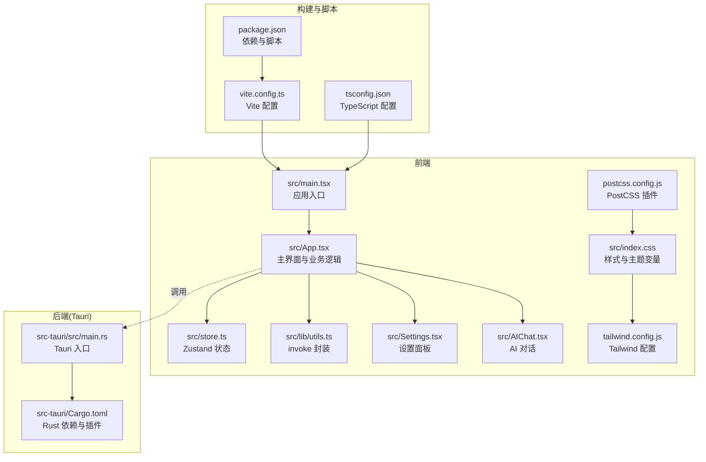
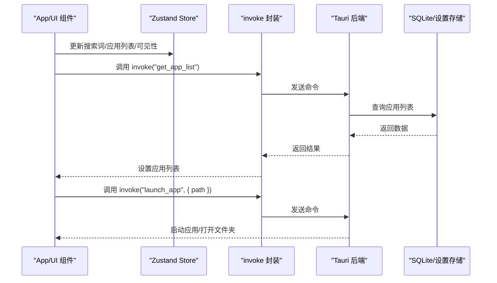
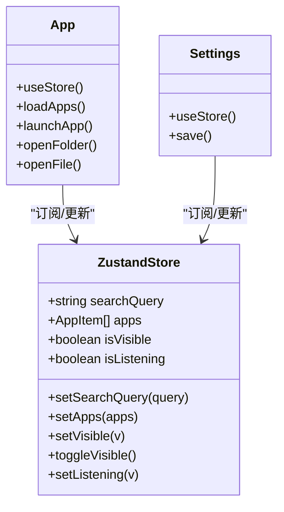
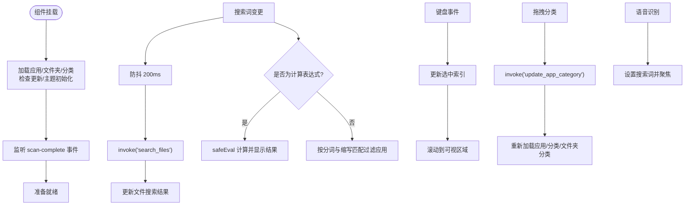
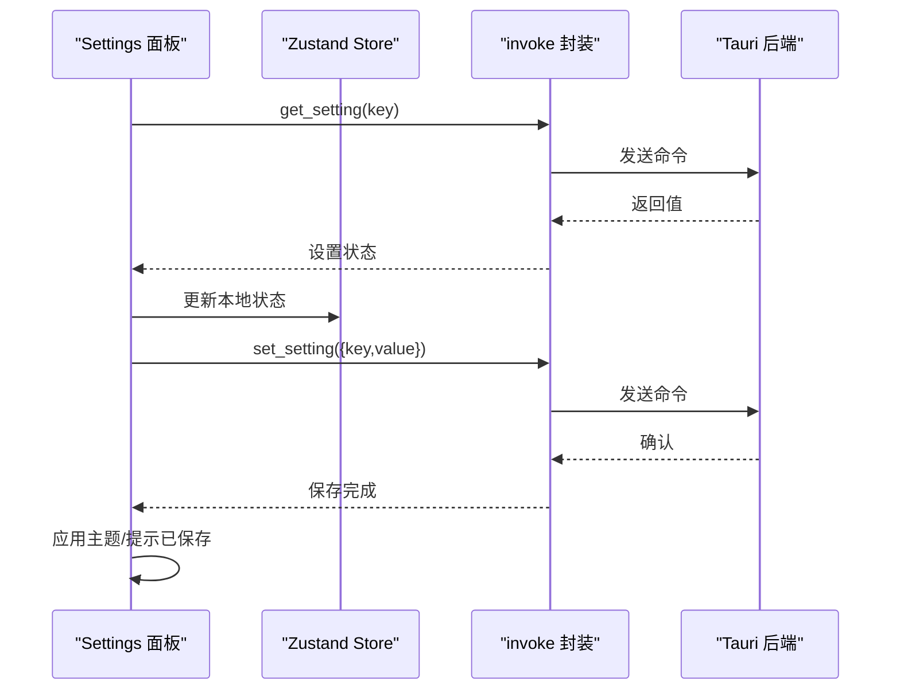
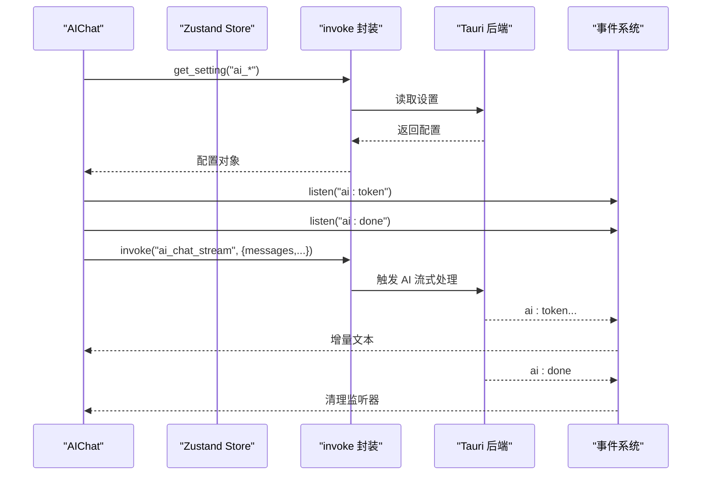
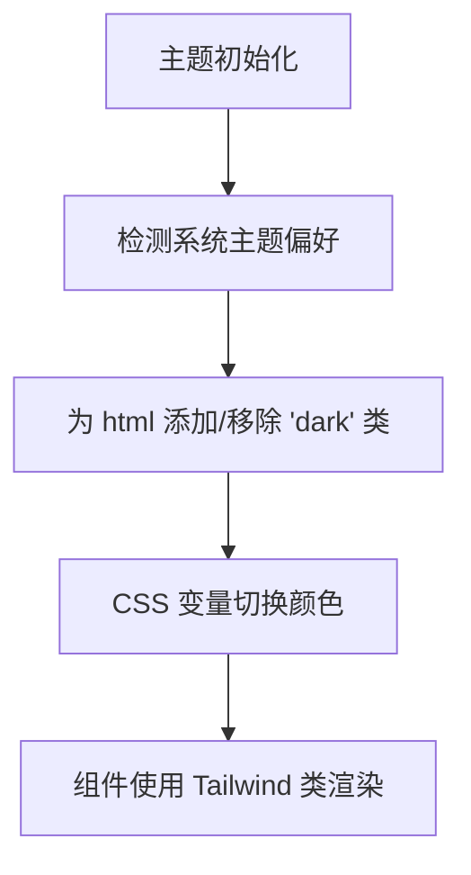
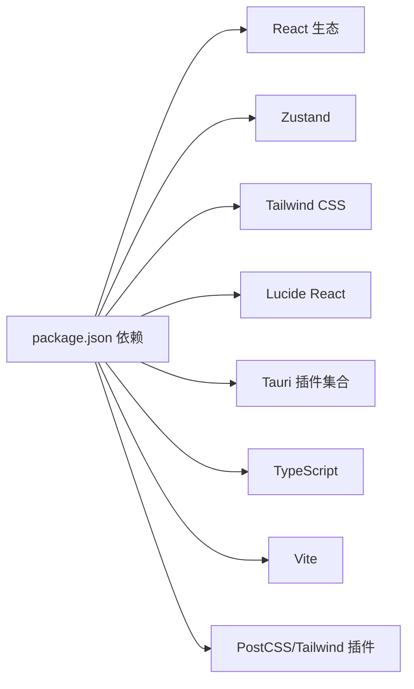

# 前端开发

<cite>
**本文引用的文件**
- [src/main.tsx](file://src/main.tsx)
- [src/App.tsx](file://src/App.tsx)
- [src/store.ts](file://src/store.ts)
- [src/lib/utils.ts](file://src/lib/utils.ts)
- [src/Settings.tsx](file://src/Settings.tsx)
- [src/AIChat.tsx](file://src/AIChat.tsx)
- [src/index.css](file://src/index.css)
- [tailwind.config.js](file://tailwind.config.js)
- [postcss.config.js](file://postcss.config.js)
- [vite.config.ts](file://vite.config.ts)
- [tsconfig.json](file://tsconfig.json)
- [package.json](file://package.json)
- [src-tauri/src/main.rs](file://src-tauri/src/main.rs)
- [src-tauri/Cargo.toml](file://src-tauri/Cargo.toml)
</cite>

## 目录
1. [简介](#简介)
2. [项目结构](#项目结构)
3. [核心组件](#核心组件)
4. [架构总览](#架构总览)
5. [详细组件分析](#详细组件分析)
6. [依赖关系分析](#依赖关系分析)
7. [性能考量](#性能考量)
8. [故障排查指南](#故障排查指南)
9. [结论](#结论)
10. [附录](#附录)

## 简介
本项目采用 React + TypeScript + Tailwind CSS 技术栈构建，结合 Zustand 实现轻量状态管理，并通过 Tauri 与 Rust 后端进行原生通信。前端负责应用启动器界面、搜索与分类、文件夹浏览、语音识别、AI 对话等功能；样式系统基于 Tailwind CSS 的原子化设计与 CSS 变量主题；状态管理采用 Zustand，提供简洁的 store 定义与订阅机制；Vite 提供开发与构建支持。

## 项目结构
- 前端入口与根组件：src/main.tsx、src/App.tsx
- 状态管理：src/store.ts（Zustand）
- 工具与后端桥接：src/lib/utils.ts（invoke 封装）
- 设置面板：src/Settings.tsx
- AI 对话：src/AIChat.tsx
- 样式系统：src/index.css、tailwind.config.js、postcss.config.js
- 构建与脚本：vite.config.ts、tsconfig.json、package.json
- 后端集成：src-tauri/src/main.rs、src-tauri/Cargo.toml

图表来源
- [src/main.tsx:1-11](file://src/main.tsx#L1-L11)
- [src/App.tsx:1-1299](file://src/App.tsx#L1-L1299)
- [src/store.ts:1-46](file://src/store.ts#L1-L46)
- [src/lib/utils.ts:1-25](file://src/lib/utils.ts#L1-L25)
- [src/Settings.tsx:1-165](file://src/Settings.tsx#L1-L165)
- [src/AIChat.tsx:1-278](file://src/AIChat.tsx#L1-L278)
- [src/index.css:1-131](file://src/index.css#L1-L131)
- [tailwind.config.js:1-54](file://tailwind.config.js#L1-L54)
- [postcss.config.js:1-7](file://postcss.config.js#L1-L7)
- [vite.config.ts:1-32](file://vite.config.ts#L1-L32)
- [tsconfig.json:1-25](file://tsconfig.json#L1-L25)
- [package.json:1-50](file://package.json#L1-L50)
- [src-tauri/src/main.rs:1-7](file://src-tauri/src/main.rs#L1-L7)
- [src-tauri/Cargo.toml:1-36](file://src-tauri/Cargo.toml#L1-L36)

章节来源
- [src/main.tsx:1-11](file://src/main.tsx#L1-L11)
- [vite.config.ts:1-32](file://vite.config.ts#L1-L32)
- [tsconfig.json:1-25](file://tsconfig.json#L1-L25)
- [package.json:1-50](file://package.json#L1-L50)

## 核心组件
- 应用入口与挂载：在入口文件中创建根节点并渲染根组件，启用严格模式。
- 主界面 App：负责应用列表加载、搜索与过滤、键盘导航、窗口控制、拖拽分类、语音识别、图标缓存、Toast 提示等。
- 状态管理 Zustand：集中管理搜索词、应用列表、窗口可见性、语音输入状态等。
- 工具与后端桥接：封装 invoke 调用，统一调用 Tauri 命令，提供数据库路径查询。
- 设置面板：读取/保存设置，支持主题切换、开机自启、自动分类、AI 配置等。
- AI 对话：流式接收后端事件，展示消息与打字机效果，支持语音输入。
- 样式系统：基于 Tailwind CSS 与 CSS 变量的主题体系，支持明暗主题与动画。

章节来源
- [src/main.tsx:1-11](file://src/main.tsx#L1-L11)
- [src/App.tsx:274-1299](file://src/App.tsx#L274-L1299)
- [src/store.ts:1-46](file://src/store.ts#L1-L46)
- [src/lib/utils.ts:1-25](file://src/lib/utils.ts#L1-L25)
- [src/Settings.tsx:14-165](file://src/Settings.tsx#L14-L165)
- [src/AIChat.tsx:14-278](file://src/AIChat.tsx#L14-L278)
- [src/index.css:1-131](file://src/index.css#L1-L131)
- [tailwind.config.js:1-54](file://tailwind.config.js#L1-L54)

## 架构总览
前端通过 Zustand 管理核心状态，使用自定义 invoke 封装与 Tauri 后端通信，实现应用列表、文件搜索、分类、图标、设置、AI 对话等功能。Tailwind CSS 提供一致的样式与主题能力，Vite 提供开发与构建支持。

图表来源
- [src/App.tsx:315-353](file://src/App.tsx#L315-L353)
- [src/lib/utils.ts:11-17](file://src/lib/utils.ts#L11-L17)
- [src-tauri/src/main.rs:4-6](file://src-tauri/src/main.rs#L4-L6)

## 详细组件分析

### Zustand 状态管理
- Store 接口：包含搜索词、应用列表、窗口可见性、语音输入状态等字段及 setter。
- 初始化：默认值在 create 回调中定义，支持 setVisible/toggleVisible 等方法。
- 使用：在 App 与 Settings 中通过解构使用，减少跨层级传递。

图表来源
- [src/store.ts:13-45](file://src/store.ts#L13-L45)
- [src/App.tsx:274-291](file://src/App.tsx#L274-L291)
- [src/Settings.tsx:14-60](file://src/Settings.tsx#L14-L60)

章节来源
- [src/store.ts:1-46](file://src/store.ts#L1-L46)

### 主界面 App：生命周期与事件处理
- 生命周期：初始化加载应用/文件夹/分类，检查更新，主题初始化，扫描任务监听。
- 事件处理：键盘导航、窗口控制（最小化/最大化/隐藏）、拖拽分类、语音识别、图标缓存、Toast 提示。
- 数据绑定：搜索词与应用列表联动，计算显示项（应用/文件夹/文件/计算器），分词匹配与缩写映射。
- 性能优化：memo 化卡片组件、useMemo 优化过滤与显示项、串行加载图标避免阻塞、防抖搜索、取消未完成的请求。

图表来源
- [src/App.tsx:356-409](file://src/App.tsx#L356-L409)
- [src/App.tsx:412-424](file://src/App.tsx#L412-L424)
- [src/App.tsx:484-515](file://src/App.tsx#L484-L515)
- [src/App.tsx:549-579](file://src/App.tsx#L549-L579)
- [src/App.tsx:614-642](file://src/App.tsx#L614-L642)
- [src/App.tsx:658-663](file://src/App.tsx#L658-L663)
- [src/App.tsx:667-696](file://src/App.tsx#L667-L696)

章节来源
- [src/App.tsx:274-1299](file://src/App.tsx#L274-L1299)

### 设置面板 Settings：配置与持久化
- 配置项：主题、开机自启、自动分类、AI 提供商/模型/API Key/Base URL。
- 读取与保存：批量读取设置，保存时调用后端 set_setting，即时应用主题。
- 主题监听：当主题为“系统”时监听系统颜色变化并动态切换。

图表来源
- [src/Settings.tsx:19-60](file://src/Settings.tsx#L19-L60)
- [src/Settings.tsx:44-60](file://src/Settings.tsx#L44-L60)

章节来源
- [src/Settings.tsx:1-165](file://src/Settings.tsx#L1-L165)

### AI 对话 AIChat：流式交互与事件监听
- 配置加载：从设置读取提供商、模型、Base URL、API Key。
- 消息流：监听 ai:token 事件增量渲染，ai:done 结束后清理监听器。
- 安全与规则：注入系统消息，限定可执行操作（只读/移动文件）。
- 语音输入：使用 Web Speech API 进行语音转文本。

图表来源
- [src/AIChat.tsx:40-60](file://src/AIChat.tsx#L40-L60)
- [src/AIChat.tsx:96-108](file://src/AIChat.tsx#L96-L108)
- [src/AIChat.tsx:144-150](file://src/AIChat.tsx#L144-L150)
- [src/AIChat.tsx:169-189](file://src/AIChat.tsx#L169-L189)

章节来源
- [src/AIChat.tsx:1-278](file://src/AIChat.tsx#L1-L278)

### 样式系统与主题
- Tailwind 配置：启用 darkMode 为 class，content 指向源码目录，扩展颜色与圆角变量。
- CSS 变量主题：在 :root 与 .dark 中定义颜色变量，实现明暗主题切换。
- 动画与过渡：统一过渡时长，网格项入场动画，滚动条美化，图标渲染优化。
- PostCSS：tailwindcss 与 autoprefixer 插件链。

图表来源
- [src/App.tsx:362-372](file://src/App.tsx#L362-L372)
- [src/Settings.tsx:29-40](file://src/Settings.tsx#L29-L40)
- [src/index.css:7-51](file://src/index.css#L7-L51)
- [tailwind.config.js:3-53](file://tailwind.config.js#L3-L53)

章节来源
- [src/index.css:1-131](file://src/index.css#L1-L131)
- [tailwind.config.js:1-54](file://tailwind.config.js#L1-L54)
- [postcss.config.js:1-7](file://postcss.config.js#L1-L7)

## 依赖关系分析
- 前端依赖：React、React DOM、Zustand、Tailwind 相关、Lucide React、@tauri-apps/* 插件等。
- 构建工具：Vite、TypeScript、Tailwind CSS、PostCSS。
- 后端依赖：Tauri 2、shell/dialog/opener/process、autostart、sqlite、reqwest、tokio 等。

图表来源
- [package.json:14-42](file://package.json#L14-L42)

章节来源
- [package.json:1-50](file://package.json#L1-L50)
- [src-tauri/Cargo.toml:15-36](file://src-tauri/Cargo.toml#L15-L36)

## 性能考量
- 组件优化
  - 使用 memo 包裹渲染开销较大的卡片组件，减少重渲染。
  - 使用 useMemo 优化搜索过滤与显示项计算，避免每次渲染都重新计算。
- 异步与并发
  - 文件搜索使用防抖与取消标志，避免频繁请求与竞态。
  - 图标加载采用串行策略，避免大量并发请求导致卡顿。
- 事件与监听
  - AI 对话清理旧监听器，防止多次 sendMessage 造成监听器累积。
- UI 体验
  - 选中项自动滚动到可视区域，提升键盘导航体验。
  - Toast 显示与定时器管理，避免内存泄漏。

章节来源
- [src/App.tsx:48-70](file://src/App.tsx#L48-L70)
- [src/App.tsx:484-515](file://src/App.tsx#L484-L515)
- [src/App.tsx:412-424](file://src/App.tsx#L412-L424)
- [src/App.tsx:667-696](file://src/App.tsx#L667-L696)
- [src/AIChat.tsx:70-81](file://src/AIChat.tsx#L70-L81)

## 故障排查指南
- 后端命令调用失败
  - 检查 invoke 调用是否正确传参，确认命令名与参数结构。
  - 在调用处添加 try/catch 并记录错误信息，必要时显示 Toast 提示。
- 主题切换异常
  - 确认系统主题监听与手动主题设置逻辑是否冲突。
  - 检查 CSS 变量是否正确应用到 :root 与 .dark。
- AI 对话无响应
  - 确认设置中 API Key/Base URL/模型配置是否正确。
  - 检查事件监听是否被清理，确保 ai:done 事件能触发清理。
- 图标加载失败
  - 检查缓存标记与失败标记逻辑，避免重复请求。
  - 确保可见应用列表变化时触发图标加载。

章节来源
- [src/App.tsx:315-353](file://src/App.tsx#L315-L353)
- [src/App.tsx:667-696](file://src/App.tsx#L667-L696)
- [src/AIChat.tsx:144-150](file://src/AIChat.tsx#L144-L150)
- [src/Settings.tsx:44-60](file://src/Settings.tsx#L44-L60)

## 结论
本项目以 React + TypeScript + Tailwind CSS 为基础，结合 Zustand 实现清晰的状态管理，通过自定义 invoke 封装与 Tauri 后端进行高效通信。主界面实现了应用搜索、分类、拖拽、语音、图标缓存等核心功能；设置面板与 AI 对话提供了完善的用户体验与可扩展性。样式系统采用 CSS 变量与 Tailwind 原子类，兼顾一致性与灵活性。建议后续持续关注性能优化与错误处理的边界场景，保持状态与 UI 的一致性。

## 附录
- 开发与构建
  - 开发：使用 Vite 提供的热更新与代理，支持环境变量配置。
  - 构建：TypeScript 编译与 Vite 打包，生成静态资源。
- 最佳实践
  - 使用 memo/useMemo 降低渲染成本。
  - 通过 invoke 封装统一后端调用，便于测试与替换。
  - 事件监听及时清理，避免内存泄漏。
  - 主题切换遵循系统偏好，提供即时反馈。

章节来源
- [vite.config.ts:1-32](file://vite.config.ts#L1-L32)
- [tsconfig.json:1-25](file://tsconfig.json#L1-L25)
- [package.json:6-12](file://package.json#L6-L12)