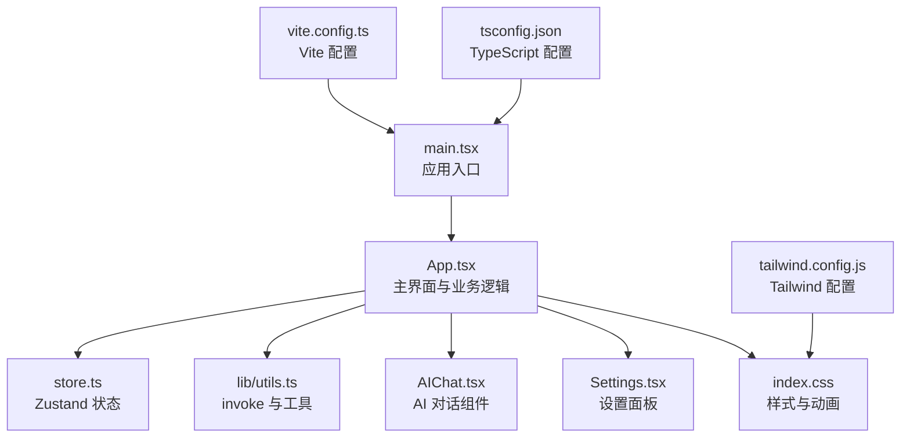
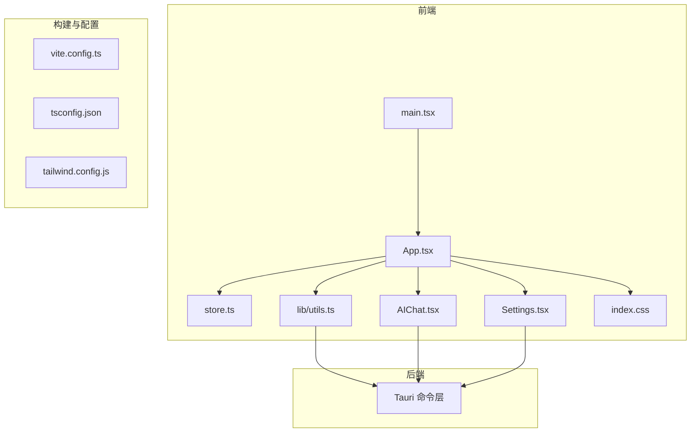
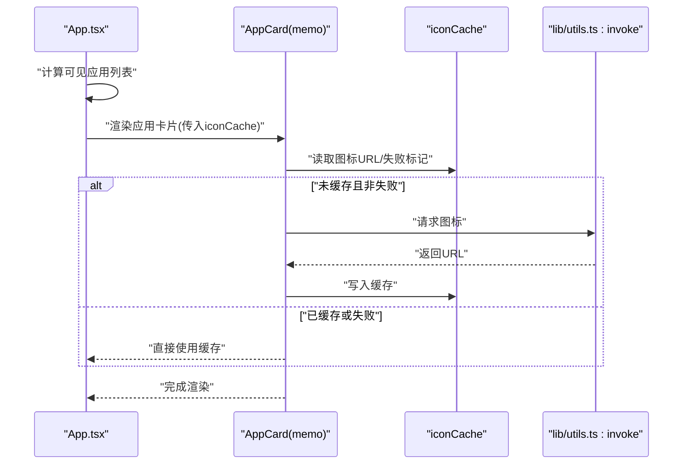
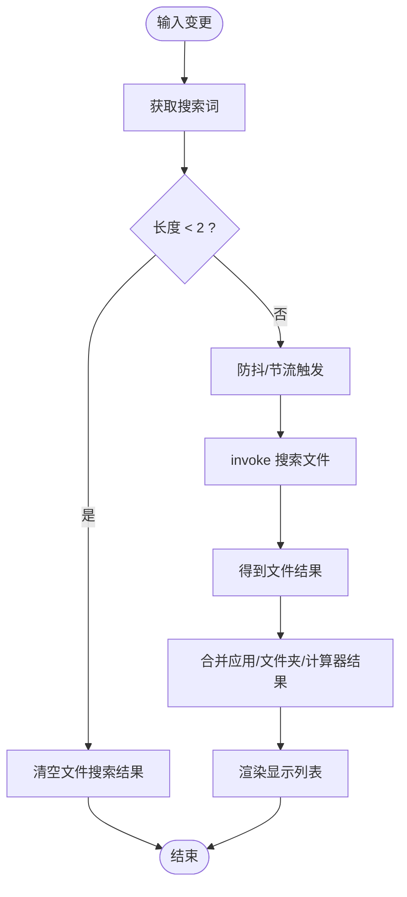
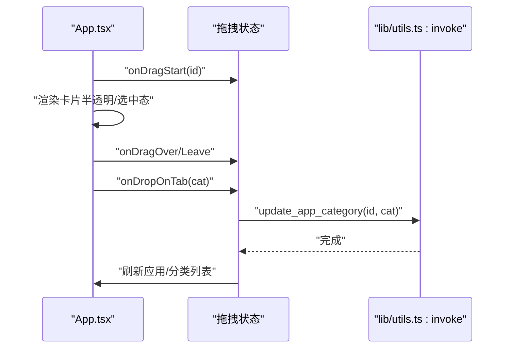
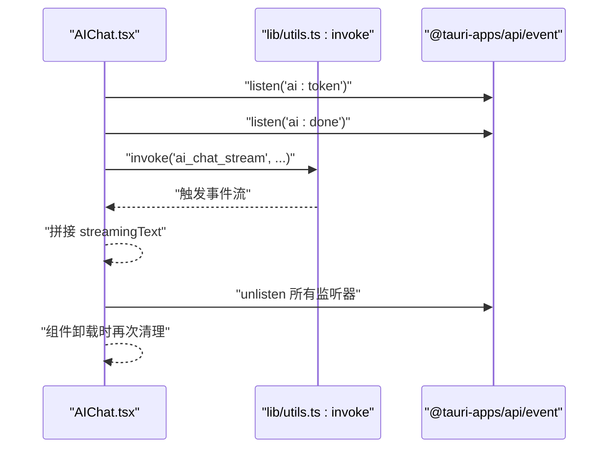
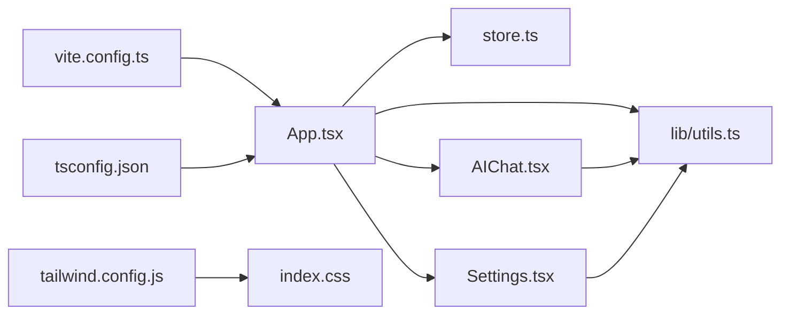

# 性能优化

<cite>
**本文引用的文件**
- [src/App.tsx](file://src/App.tsx)
- [src/main.tsx](file://src/main.tsx)
- [src/store.ts](file://src/store.ts)
- [src/lib/utils.ts](file://src/lib/utils.ts)
- [src/AIChat.tsx](file://src/AIChat.tsx)
- [src/Settings.tsx](file://src/Settings.tsx)
- [src/index.css](file://src/index.css)
- [tailwind.config.js](file://tailwind.config.js)
- [vite.config.ts](file://vite.config.ts)
- [tsconfig.json](file://tsconfig.json)
- [package.json](file://package.json)
</cite>

## 目录
1. [简介](#简介)
2. [项目结构](#项目结构)
3. [核心组件与性能要点](#核心组件与性能要点)
4. [架构总览](#架构总览)
5. [详细组件分析](#详细组件分析)
6. [依赖关系分析](#依赖关系分析)
7. [性能考量与优化建议](#性能考量与优化建议)
8. [故障排查指南](#故障排查指南)
9. [结论](#结论)
10. [附录](#附录)

## 简介
本文件聚焦于 QuickStart 前端的性能优化实践，围绕 React.memo、useMemo、useCallback 的使用，图标缓存、虚拟滚动现状与替代方案、异步加载策略、内存与垃圾回收优化、渲染性能监控与工具链配置进行系统性梳理，并结合搜索过滤、拖拽操作、大量应用列表等典型场景给出可落地的优化案例与排障建议。

## 项目结构
QuickStart 是基于 React 19 与 Vite 的 Tauri 桌面应用，前端采用 Zustand 状态管理，TailwindCSS 提供样式基础，通过 @tauri-apps/api 进行后端交互。核心入口为 main.tsx，主界面 App.tsx 负责应用卡片渲染、搜索过滤、拖拽分类、图标缓存与键盘导航等。

图表来源
- [src/main.tsx:1-11](file://src/main.tsx#L1-L11)
- [src/App.tsx:1-800](file://src/App.tsx#L1-L800)
- [src/store.ts:1-46](file://src/store.ts#L1-L46)
- [src/lib/utils.ts:1-25](file://src/lib/utils.ts#L1-L25)
- [src/AIChat.tsx:1-278](file://src/AIChat.tsx#L1-L278)
- [src/Settings.tsx:1-165](file://src/Settings.tsx#L1-L165)
- [src/index.css:1-131](file://src/index.css#L1-L131)
- [vite.config.ts:1-32](file://vite.config.ts#L1-L32)
- [tsconfig.json:1-25](file://tsconfig.json#L1-L25)
- [tailwind.config.js:1-86](file://tailwind.config.js#L1-L86)

章节来源
- [src/main.tsx:1-11](file://src/main.tsx#L1-L11)
- [vite.config.ts:1-32](file://vite.config.ts#L1-L32)
- [tsconfig.json:1-25](file://tsconfig.json#L1-L25)
- [tailwind.config.js:1-86](file://tailwind.config.js#L1-L86)
- [src/index.css:1-131](file://src/index.css#L1-L131)

## 核心组件与性能要点
- React.memo 与函数组件拆分
  - 使用 memo 包裹应用卡片组件，减少因父组件状态变化导致的重复渲染，降低 DOM 更新压力。
  - 关键路径参考：[App.tsx:49-70](file://src/App.tsx#L49-L70)
- useMemo 计算缓存
  - 对分类列表、按分类过滤后的应用、搜索结果、显示合并列表等进行缓存，避免每次渲染重新计算。
  - 关键路径参考：
    - [App.tsx:427-433](file://src/App.tsx#L427-L433)
    - [App.tsx:484-490](file://src/App.tsx#L484-L490)
    - [App.tsx:492-497](file://src/App.tsx#L492-L497)
    - [App.tsx:504-515](file://src/App.tsx#L504-L515)
- useCallback 异步加载与事件处理
  - 将加载数据、扫描应用、加载分类等异步任务封装为 useCallback，确保事件监听与清理时依赖稳定。
  - 关键路径参考：
    - [App.tsx:314-353](file://src/App.tsx#L314-L353)
    - [App.tsx:355-409](file://src/App.tsx#L355-L409)
- 图标缓存机制
  - 通过 iconCache 字典缓存应用图标 URL 或失败标记，避免重复请求与闪烁。
  - 关键路径参考：
    - [App.tsx:299](file://src/App.tsx#L299)
    - [App.tsx:666-677](file://src/App.tsx#L666-L677)
    - [App.tsx:679-696](file://src/App.tsx#L679-L696)
- 异步加载策略
  - 使用 invoke 与事件监听实现后台扫描、AI 流式输出等异步任务，避免阻塞 UI。
  - 关键路径参考：
    - [App.tsx:343-353](file://src/App.tsx#L343-L353)
    - [AIChat.tsx:83-159](file://src/AIChat.tsx#L83-L159)
- 虚拟滚动现状与替代方案
  - 当前使用普通网格布局与滚动容器，未引入虚拟滚动库；对于超大列表可考虑 React Window 或同等方案。
  - 关键路径参考：
    - [App.tsx:915](file://src/App.tsx#L915)
- 内存与垃圾回收优化
  - 合理清理事件监听（如 AI 对话组件的监听器）、定时器与副作用，避免泄漏。
  - 关键路径参考：
    - [AIChat.tsx:70-81](file://src/AIChat.tsx#L70-L81)
    - [AIChat.tsx:106-108](file://src/AIChat.tsx#L106-L108)
- 渲染性能监控
  - 建议结合 React DevTools Profiler、浏览器 Performance 面板与 Lighthouse 进行热点定位与回归测试。
  - 工程配置参考：
    - [vite.config.ts:1-32](file://vite.config.ts#L1-L32)
    - [tsconfig.json:1-25](file://tsconfig.json#L1-L25)
    - [tailwind.config.js:1-86](file://tailwind.config.js#L1-L86)
    - [src/index.css:1-131](file://src/index.css#L1-L131)

章节来源
- [src/App.tsx:49-70](file://src/App.tsx#L49-L70)
- [src/App.tsx:427-433](file://src/App.tsx#L427-L433)
- [src/App.tsx:484-490](file://src/App.tsx#L484-L490)
- [src/App.tsx:492-497](file://src/App.tsx#L492-L497)
- [src/App.tsx:504-515](file://src/App.tsx#L504-L515)
- [src/App.tsx:314-353](file://src/App.tsx#L314-L353)
- [src/App.tsx:355-409](file://src/App.tsx#L355-L409)
- [src/App.tsx:299](file://src/App.tsx#L299)
- [src/App.tsx:666-677](file://src/App.tsx#L666-L677)
- [src/App.tsx:679-696](file://src/App.tsx#L679-L696)
- [src/AIChat.tsx:70-81](file://src/AIChat.tsx#L70-L81)
- [src/AIChat.tsx:83-159](file://src/AIChat.tsx#L83-L159)
- [src/AIChat.tsx:106-108](file://src/AIChat.tsx#L106-L108)
- [vite.config.ts:1-32](file://vite.config.ts#L1-L32)
- [tsconfig.json:1-25](file://tsconfig.json#L1-L25)
- [tailwind.config.js:1-86](file://tailwind.config.js#L1-L86)
- [src/index.css:1-131](file://src/index.css#L1-L131)

## 架构总览
前端与后端交互通过 invoke 统一入口，主界面负责数据聚合与 UI 渲染，AI 对话与设置面板为独立模块，样式与动画通过 Tailwind 与自定义 CSS 实现。

图表来源
- [src/main.tsx:1-11](file://src/main.tsx#L1-L11)
- [src/App.tsx:1-800](file://src/App.tsx#L1-L800)
- [src/store.ts:1-46](file://src/store.ts#L1-L46)
- [src/lib/utils.ts:1-25](file://src/lib/utils.ts#L1-L25)
- [src/AIChat.tsx:1-278](file://src/AIChat.tsx#L1-L278)
- [src/Settings.tsx:1-165](file://src/Settings.tsx#L1-L165)
- [src/index.css:1-131](file://src/index.css#L1-L131)
- [vite.config.ts:1-32](file://vite.config.ts#L1-L32)
- [tsconfig.json:1-25](file://tsconfig.json#L1-L25)
- [tailwind.config.js:1-86](file://tailwind.config.js#L1-L86)

## 详细组件分析

### 应用卡片与图标缓存（React.memo + 图标缓存）
- 优化策略
  - 使用 memo 包裹 AppCard，避免无关 props 变化导致的重渲染。
  - 通过 iconCache 缓存图标 URL 或失败标记，减少重复请求与闪烁。
- 关键实现位置
  - 组件定义与 memo：[App.tsx:49-70](file://src/App.tsx#L49-L70)
  - 图标缓存与加载：[App.tsx:299](file://src/App.tsx#L299)、[App.tsx:666-677](file://src/App.tsx#L666-L677)、[App.tsx:679-696](file://src/App.tsx#L679-L696)
- 渲染流程时序

图表来源
- [src/App.tsx:49-70](file://src/App.tsx#L49-L70)
- [src/App.tsx:299](file://src/App.tsx#L299)
- [src/App.tsx:666-677](file://src/App.tsx#L666-L677)
- [src/App.tsx:679-696](file://src/App.tsx#L679-L696)
- [src/lib/utils.ts:11-17](file://src/lib/utils.ts#L11-L17)

章节来源
- [src/App.tsx:49-70](file://src/App.tsx#L49-L70)
- [src/App.tsx:299](file://src/App.tsx#L299)
- [src/App.tsx:666-677](file://src/App.tsx#L666-L677)
- [src/App.tsx:679-696](file://src/App.tsx#L679-L696)
- [src/lib/utils.ts:11-17](file://src/lib/utils.ts#L11-L17)

### 搜索过滤与高亮（useMemo + 高亮算法）
- 优化策略
  - 使用 useMemo 缓存分类过滤、应用搜索、文件夹搜索与最终显示列表，避免每次渲染重复计算。
  - 高亮算法对 token 匹配与区间合并进行预处理，减少重复开销。
- 关键实现位置
  - 分类与过滤缓存：[App.tsx:427-433](file://src/App.tsx#L427-L433)、[App.tsx:484-490](file://src/App.tsx#L484-L490)、[App.tsx:492-497](file://src/App.tsx#L492-L497)、[App.tsx:504-515](file://src/App.tsx#L504-L515)
  - 高亮算法与区间合并：[App.tsx:72-130](file://src/App.tsx#L72-L130)
- 流程图

图表来源
- [src/App.tsx:412-424](file://src/App.tsx#L412-L424)
- [src/App.tsx:484-490](file://src/App.tsx#L484-L490)
- [src/App.tsx:492-497](file://src/App.tsx#L492-L497)
- [src/App.tsx:504-515](file://src/App.tsx#L504-L515)

章节来源
- [src/App.tsx:412-424](file://src/App.tsx#L412-L424)
- [src/App.tsx:427-433](file://src/App.tsx#L427-L433)
- [src/App.tsx:484-490](file://src/App.tsx#L484-L490)
- [src/App.tsx:492-497](file://src/App.tsx#L492-L497)
- [src/App.tsx:504-515](file://src/App.tsx#L504-L515)
- [src/App.tsx:72-130](file://src/App.tsx#L72-L130)

### 拖拽分类（HTML5 原生 + useCallback）
- 优化策略
  - 使用 useCallback 包装拖拽事件处理，保证事件监听与清理时依赖稳定。
  - 通过状态机管理拖拽状态与悬停分类，减少不必要的重渲染。
- 关键实现位置
  - 拖拽状态与事件：[App.tsx:614-642](file://src/App.tsx#L614-L642)
  - 分类更新与刷新：[App.tsx:627-640](file://src/App.tsx#L627-L640)
- 时序图

图表来源
- [src/App.tsx:614-642](file://src/App.tsx#L614-L642)
- [src/App.tsx:627-640](file://src/App.tsx#L627-L640)
- [src/lib/utils.ts:11-17](file://src/lib/utils.ts#L11-L17)

章节来源
- [src/App.tsx:614-642](file://src/App.tsx#L614-L642)
- [src/App.tsx:627-640](file://src/App.tsx#L627-L640)
- [src/lib/utils.ts:11-17](file://src/lib/utils.ts#L11-L17)

### AI 对话组件（事件监听清理与内存管理）
- 优化策略
  - 在组件卸载时统一清理事件监听器，防止内存泄漏。
  - 使用 ref 存储监听器句柄，避免闭包捕获导致的重复监听。
- 关键实现位置
  - 监听器清理与卸载：[AIChat.tsx:70-81](file://src/AIChat.tsx#L70-L81)、[AIChat.tsx:106-108](file://src/AIChat.tsx#L106-L108)
  - 发送消息与流式输出：[AIChat.tsx:83-159](file://src/AIChat.tsx#L83-L159)
- 时序图

图表来源
- [src/AIChat.tsx:70-81](file://src/AIChat.tsx#L70-L81)
- [src/AIChat.tsx:83-159](file://src/AIChat.tsx#L83-L159)
- [src/AIChat.tsx:106-108](file://src/AIChat.tsx#L106-L108)
- [src/lib/utils.ts:11-17](file://src/lib/utils.ts#L11-L17)

章节来源
- [src/AIChat.tsx:70-81](file://src/AIChat.tsx#L70-L81)
- [src/AIChat.tsx:83-159](file://src/AIChat.tsx#L83-L159)
- [src/AIChat.tsx:106-108](file://src/AIChat.tsx#L106-L108)
- [src/lib/utils.ts:11-17](file://src/lib/utils.ts#L11-L17)

### 设置面板与主题切换（useEffect 与系统偏好）
- 优化策略
  - 监听系统深色模式偏好，动态切换根元素 class，避免重复切换。
  - 保存设置时批量调用后端接口，减少多次往返。
- 关键实现位置
  - 主题监听与切换：[Settings.tsx:29-40](file://src/Settings.tsx#L29-L40)
  - 保存设置：[Settings.tsx:44-60](file://src/Settings.tsx#L44-L60)

章节来源
- [src/Settings.tsx:29-40](file://src/Settings.tsx#L29-L40)
- [src/Settings.tsx:44-60](file://src/Settings.tsx#L44-L60)

## 依赖关系分析
- 组件耦合
  - App.tsx 作为中枢，依赖 store、utils、AIChat、Settings 等模块；通过 memo 与 useMemo 降低耦合带来的重渲染风险。
- 外部依赖
  - @tauri-apps/api、lucide-react、zustand、tailwindcss 等；构建工具链由 Vite + TypeScript + PostCSS/Tailwind 支撑。
- 潜在循环依赖
  - 当前未发现直接循环依赖；注意在新增模块时避免跨文件相互依赖。

图表来源
- [src/App.tsx:1-800](file://src/App.tsx#L1-L800)
- [src/store.ts:1-46](file://src/store.ts#L1-L46)
- [src/lib/utils.ts:1-25](file://src/lib/utils.ts#L1-L25)
- [src/AIChat.tsx:1-278](file://src/AIChat.tsx#L1-L278)
- [src/Settings.tsx:1-165](file://src/Settings.tsx#L1-L165)
- [vite.config.ts:1-32](file://vite.config.ts#L1-L32)
- [tsconfig.json:1-25](file://tsconfig.json#L1-L25)
- [tailwind.config.js:1-86](file://tailwind.config.js#L1-L86)
- [src/index.css:1-131](file://src/index.css#L1-L131)

章节来源
- [src/App.tsx:1-800](file://src/App.tsx#L1-L800)
- [src/store.ts:1-46](file://src/store.ts#L1-L46)
- [src/lib/utils.ts:1-25](file://src/lib/utils.ts#L1-L25)
- [src/AIChat.tsx:1-278](file://src/AIChat.tsx#L1-L278)
- [src/Settings.tsx:1-165](file://src/Settings.tsx#L1-L165)
- [vite.config.ts:1-32](file://vite.config.ts#L1-L32)
- [tsconfig.json:1-25](file://tsconfig.json#L1-L25)
- [tailwind.config.js:1-86](file://tailwind.config.js#L1-L86)
- [src/index.css:1-131](file://src/index.css#L1-L131)

## 性能考量与优化建议

### React.memo、useMemo、useCallback 的最佳实践
- 何时使用
  - 组件层级深、props 变化频繁：优先 memo。
  - 计算昂贵或依赖稳定数组/对象：优先 useMemo。
  - 事件处理/回调被频繁传递给子组件：优先 useCallback。
- 注意事项
  - memo 仅浅比较 props；深层对象建议拆分或使用 useMemo 包裹。
  - useCallback 依赖数组需精确，避免遗漏依赖导致重复创建。
- 参考路径
  - [src/App.tsx:49-70](file://src/App.tsx#L49-L70)
  - [src/App.tsx:427-433](file://src/App.tsx#L427-L433)
  - [src/App.tsx:314-353](file://src/App.tsx#L314-L353)

### 图标缓存与 I/O 优化
- 策略
  - 未命中缓存时才发起请求；失败也写入失败标记，避免重复尝试。
  - 仅对当前可见应用加载图标，串行顺序加载，避免并发风暴。
- 参考路径
  - [src/App.tsx:666-677](file://src/App.tsx#L666-L677)
  - [src/App.tsx:679-696](file://src/App.tsx#L679-L696)

### 虚拟滚动与长列表
- 现状
  - 当前使用普通网格与滚动容器，未引入虚拟滚动库。
- 建议
  - 大量应用列表场景引入虚拟滚动（如 react-window），仅渲染可视区域节点。
  - 结合分页或懒加载进一步降低初始渲染压力。
- 参考路径
  - [src/App.tsx:915](file://src/App.tsx#L915)

### 异步加载与事件监听清理
- 策略
  - 所有异步任务使用 useCallback 包装，确保监听器清理时依赖稳定。
  - 卸载组件时统一清理事件监听器与定时器，避免内存泄漏。
- 参考路径
  - [src/App.tsx:314-353](file://src/App.tsx#L314-L353)
  - [src/AIChat.tsx:70-81](file://src/AIChat.tsx#L70-L81)
  - [src/AIChat.tsx:106-108](file://src/AIChat.tsx#L106-L108)

### 渲染性能监控与工具链
- 工具链
  - Vite 开发服务器、TypeScript 类型检查、Tailwind CSS 构建。
- 监控建议
  - 使用 React DevTools Profiler 定位重渲染热点。
  - 使用浏览器 Performance 面板观察主线程卡顿与长任务。
  - 使用 Lighthouse 进行性能基线评估与回归测试。
- 参考路径
  - [vite.config.ts:1-32](file://vite.config.ts#L1-L32)
  - [tsconfig.json:1-25](file://tsconfig.json#L1-L25)
  - [tailwind.config.js:1-86](file://tailwind.config.js#L1-L86)
  - [src/index.css:1-131](file://src/index.css#L1-L131)

### 具体优化案例

#### 搜索过滤优化
- 场景
  - 输入 2 个字符以上触发文件搜索，使用防抖/节流与取消标志避免竞态。
- 关键点
  - 仅在查询长度满足条件时发起请求。
  - 使用取消标志与清理函数避免旧请求覆盖新状态。
- 参考路径
  - [src/App.tsx:412-424](file://src/App.tsx#L412-L424)

#### 拖拽操作优化
- 场景
  - 拖拽分类时仅在目标分类变化时更新，避免重复请求。
- 关键点
  - 使用状态机管理拖拽与悬停，减少无效渲染。
  - 事件处理使用 useCallback，确保监听与清理稳定。
- 参考路径
  - [src/App.tsx:614-642](file://src/App.tsx#L614-L642)
  - [src/App.tsx:627-640](file://src/App.tsx#L627-L640)

#### 大量应用列表优化
- 场景
  - 应用列表较大时，优先使用虚拟滚动与图标缓存。
- 关键点
  - 仅对可见应用加载图标，串行加载避免并发风暴。
  - 使用 useMemo 缓存过滤与排序结果。
- 参考路径
  - [src/App.tsx:679-696](file://src/App.tsx#L679-L696)
  - [src/App.tsx:484-490](file://src/App.tsx#L484-L490)

## 故障排查指南
- 图标闪烁或重复请求
  - 检查 iconCache 写入逻辑与失败标记是否正确。
  - 参考路径：[src/App.tsx:666-677](file://src/App.tsx#L666-L677)
- 搜索结果异常或卡顿
  - 确认防抖/节流与取消标志是否生效。
  - 参考路径：[src/App.tsx:412-424](file://src/App.tsx#L412-L424)
- AI 对话内存泄漏
  - 确认卸载时清理所有事件监听器。
  - 参考路径：[src/AIChat.tsx:70-81](file://src/AIChat.tsx#L70-L81)
- 主题切换不生效
  - 检查系统偏好监听与根元素 class 切换。
  - 参考路径：[src/Settings.tsx:29-40](file://src/Settings.tsx#L29-L40)

章节来源
- [src/App.tsx:666-677](file://src/App.tsx#L666-L677)
- [src/App.tsx:412-424](file://src/App.tsx#L412-L424)
- [src/AIChat.tsx:70-81](file://src/AIChat.tsx#L70-L81)
- [src/Settings.tsx:29-40](file://src/Settings.tsx#L29-L40)

## 结论
QuickStart 前端已在关键路径采用 React.memo、useMemo、useCallback 与图标缓存等策略，有效降低了渲染与 I/O 压力。针对超大列表可引入虚拟滚动，结合事件监听清理与内存管理，持续提升交互流畅度与稳定性。建议配合工具链与监控手段建立性能基线，定期回归测试以保障体验。

## 附录
- 工程配置与依赖
  - [package.json:1-50](file://package.json#L1-L50)
  - [vite.config.ts:1-32](file://vite.config.ts#L1-L32)
  - [tsconfig.json:1-25](file://tsconfig.json#L1-L25)
  - [tailwind.config.js:1-86](file://tailwind.config.js#L1-L86)
  - [src/index.css:1-131](file://src/index.css#L1-L131)