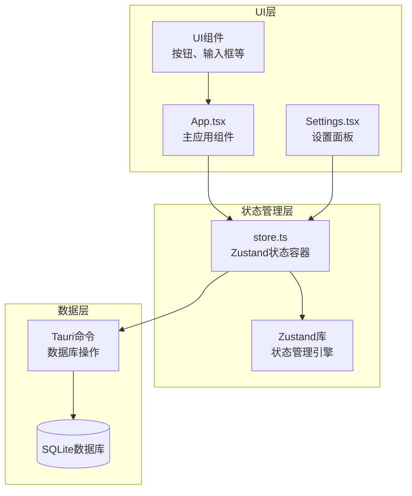
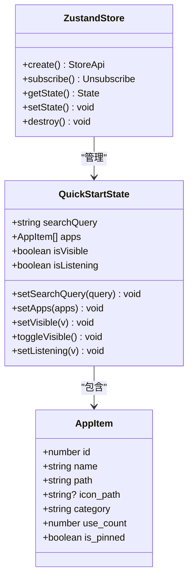
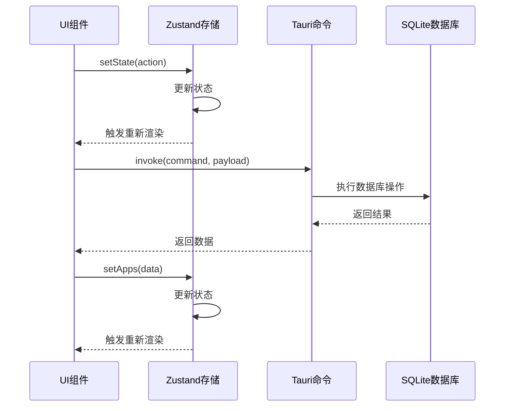
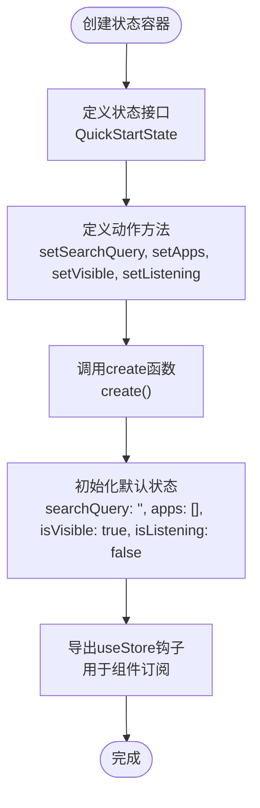
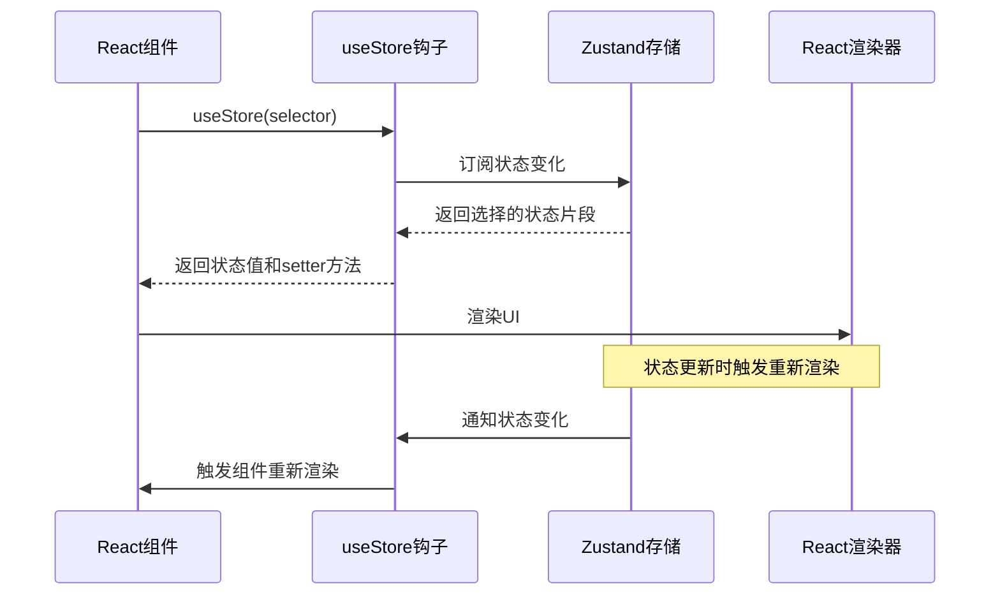
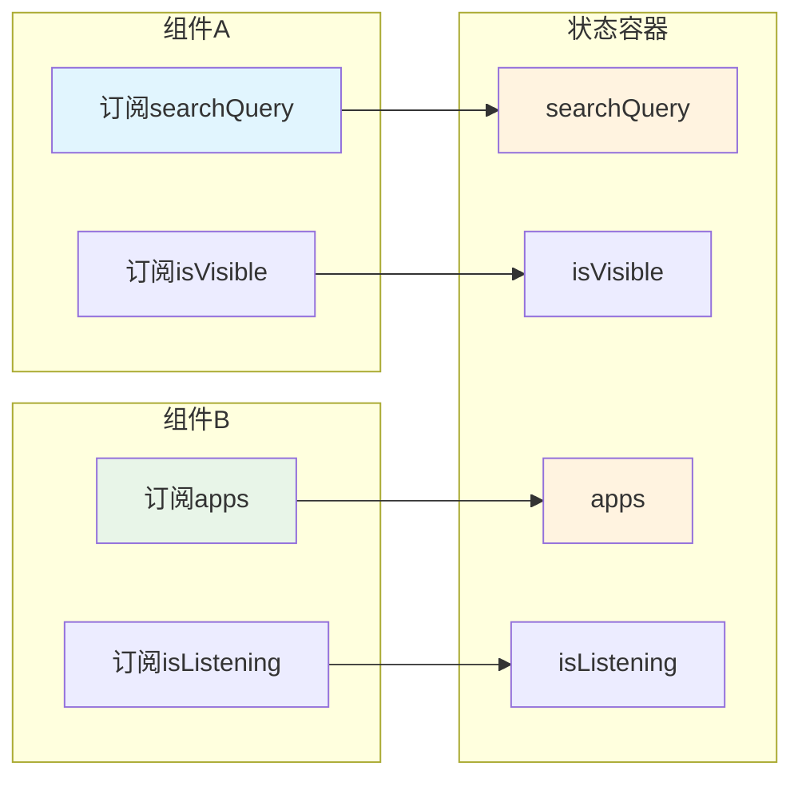
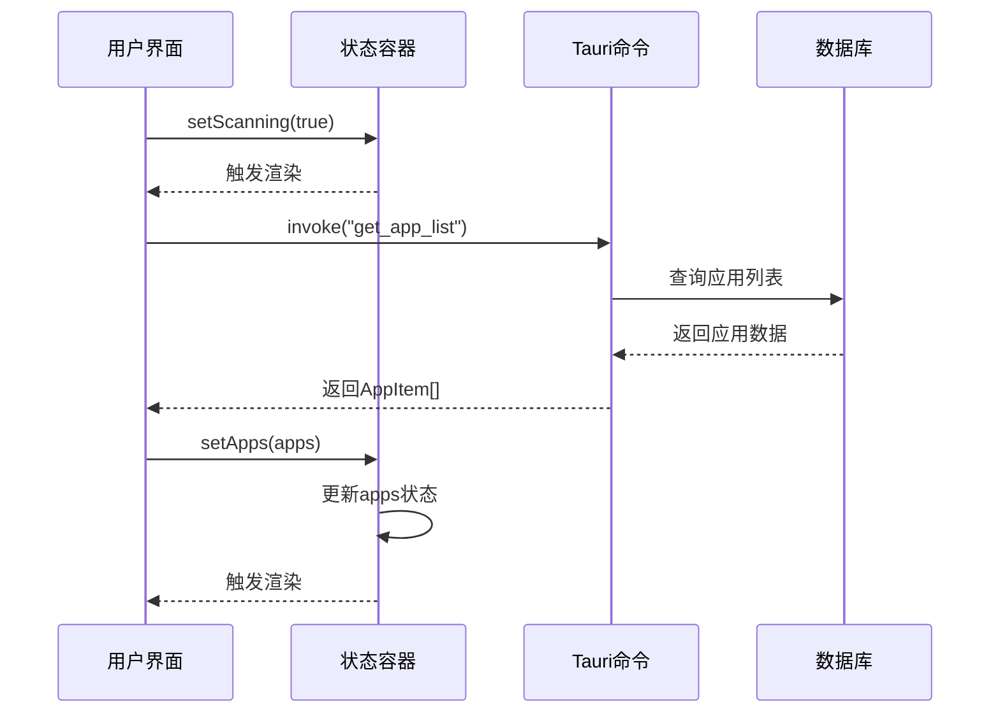
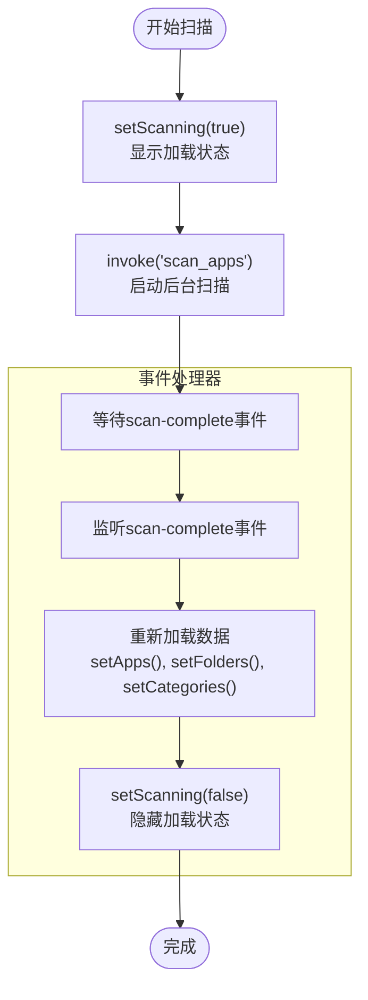
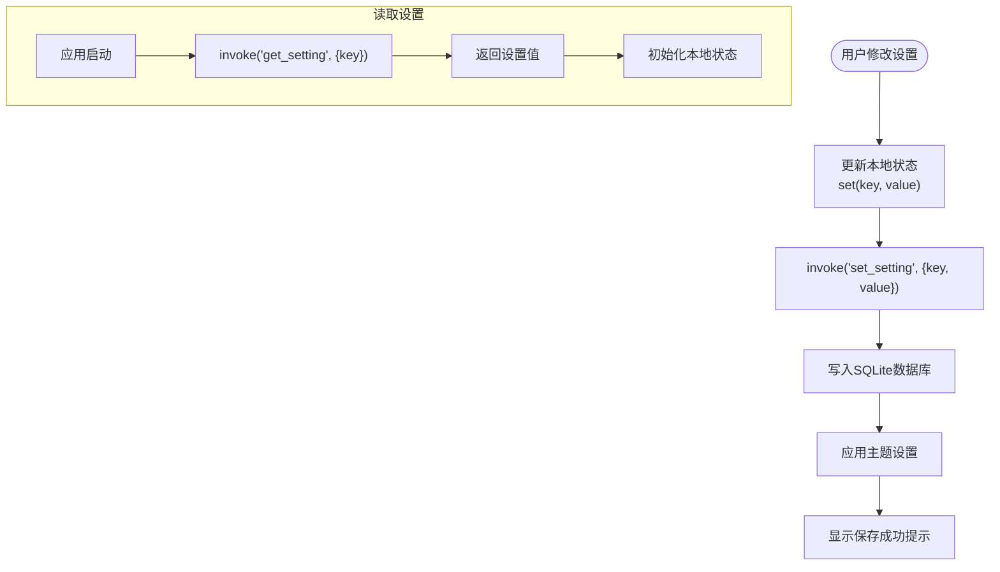
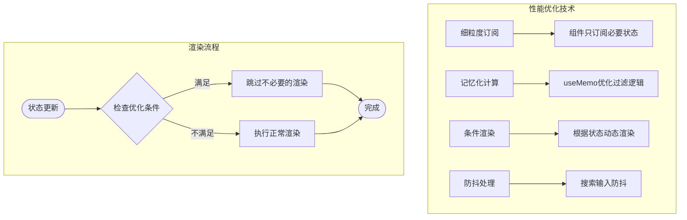

# 状态管理

<cite>
**本文档引用的文件**
- [store.ts](file://src/store.ts)
- [App.tsx](file://src/App.tsx)
- [main.tsx](file://src/main.tsx)
- [Settings.tsx](file://src/Settings.tsx)
- [package.json](file://package.json)
- [vite-env.d.ts](file://src/vite-env.d.ts)
- [commands.rs](file://src-tauri/src/commands.rs)
</cite>

## 目录
1. [简介](#简介)
2. [项目结构](#项目结构)
3. [核心组件](#核心组件)
4. [架构概览](#架构概览)
5. [详细组件分析](#详细组件分析)
6. [依赖关系分析](#依赖关系分析)
7. [性能考虑](#性能考虑)
8. [故障排除指南](#故障排除指南)
9. [结论](#结论)

## 简介

QuickStart是一个基于React和Tauri构建的快速启动器应用，采用Zustand作为其状态管理解决方案。该应用实现了现代化的状态管理模式，通过轻量级的状态容器提供高效的状态共享和更新机制。

Zustand在本项目中的应用体现了以下特点：
- **极简API设计**：通过create函数创建状态容器，无需复杂的Provider包装
- **细粒度订阅**：组件仅订阅其使用的状态片段，提高渲染性能
- **类型安全**：完整的TypeScript支持，提供编译时类型检查
- **异步状态处理**：支持异步操作和事件驱动的状态更新

## 项目结构

QuickStart的状态管理架构围绕Zustand的核心概念构建，主要包含以下组件：



**图表来源**
- [store.ts:1-46](file://src/store.ts#L1-L46)
- [App.tsx:274-275](file://src/App.tsx#L274-L275)
- [Settings.tsx:14-15](file://src/Settings.tsx#L14-L15)

**章节来源**
- [store.ts:1-46](file://src/store.ts#L1-L46)
- [package.json:31](file://package.json#L31)

## 核心组件

### Zustand状态容器

应用的核心状态容器定义在store.ts文件中，采用接口驱动的设计模式：



**图表来源**
- [store.ts:3-30](file://src/store.ts#L3-L30)
- [store.ts:32-45](file://src/store.ts#L32-L45)

### 状态结构设计

应用的状态结构经过精心设计，包含以下关键字段：

| 状态字段 | 类型 | 描述 | 默认值 |
|---------|------|------|--------|
| searchQuery | string | 搜索查询文本 | "" |
| apps | AppItem[] | 应用程序列表 | [] |
| isVisible | boolean | 窗口可见性 | true |
| isListening | boolean | 语音识别状态 | false |

**章节来源**
- [store.ts:13-30](file://src/store.ts#L13-L30)

## 架构概览

QuickStart采用分层架构设计，状态管理贯穿整个应用的数据流：



**图表来源**
- [App.tsx:315-317](file://src/App.tsx#L315-L317)
- [store.ts:32-45](file://src/store.ts#L32-L45)

## 详细组件分析

### 状态容器实现

#### 接口定义模式

应用采用TypeScript接口定义状态结构，确保类型安全：



**图表来源**
- [store.ts:13-45](file://src/store.ts#L13-L45)

#### 动作定义策略

每个状态字段都配有对应的setter方法，遵循统一的命名约定：

| 状态字段 | Setter方法 | 参数类型 | 作用 |
|---------|-----------|----------|------|
| searchQuery | setSearchQuery | string | 更新搜索查询文本 |
| apps | setApps | AppItem[] | 设置应用程序列表 |
| isVisible | setVisible | boolean | 控制窗口可见性 |
| isListening | setListening | boolean | 管理语音识别状态 |

**章节来源**
- [store.ts:13-45](file://src/store.ts#L13-L45)

### 组件集成模式

#### Hook使用模式

应用中的组件通过useStore钩子访问状态：



**图表来源**
- [App.tsx:274-275](file://src/App.tsx#L274-L275)

#### 状态订阅机制

组件通过细粒度订阅实现高效的渲染优化：



**图表来源**
- [App.tsx:274-275](file://src/App.tsx#L274-L275)

**章节来源**
- [App.tsx:274-275](file://src/App.tsx#L274-L275)

### 异步状态更新

#### 数据加载流程

应用通过异步操作更新状态，主要涉及以下场景：



**图表来源**
- [App.tsx:315-317](file://src/App.tsx#L315-L317)
- [store.ts:36-37](file://src/store.ts#L36-L37)

#### 事件驱动更新

应用使用事件系统处理后台操作完成后的状态更新：



**图表来源**
- [App.tsx:393-409](file://src/App.tsx#L393-L409)

**章节来源**
- [App.tsx:315-409](file://src/App.tsx#L315-L409)

### 状态持久化策略

#### 设置状态管理

虽然应用的主要状态存储在内存中，但设置状态通过Tauri命令持久化到数据库：



**图表来源**
- [Settings.tsx:19-27](file://src/Settings.tsx#L19-L27)
- [Settings.tsx:44-60](file://src/Settings.tsx#L44-L60)

**章节来源**
- [Settings.tsx:14-60](file://src/Settings.tsx#L14-L60)

### 性能优化技巧

#### 渲染优化策略

应用采用了多种性能优化技术：

1. **细粒度订阅**：组件只订阅需要的状态片段
2. **记忆化计算**：使用useMemo优化复杂计算
3. **条件渲染**：根据状态动态决定渲染内容
4. **防抖处理**：搜索功能使用防抖减少请求频率



**图表来源**
- [App.tsx:485-490](file://src/App.tsx#L485-L490)
- [App.tsx:412-424](file://src/App.tsx#L412-L424)

**章节来源**
- [App.tsx:412-490](file://src/App.tsx#L412-L490)

## 依赖关系分析

### 核心依赖关系

```mermaid
graph TB
subgraph "应用层"
App[App.tsx]
Settings[Settings.tsx]
Store[store.ts]
end
subgraph "状态管理"
Zustand[zustand@^5.0.0]
React[react@^19.0.0]
end
subgraph "系统集成"
Tauri[@tauri-apps/api@^2.0.0]
Commands[src-tauri/src/commands.rs]
end
App --> Store
Settings --> Store
Store --> Zustand
App --> React
Settings --> React
App --> Tauri
Tauri --> Commands
```

**图表来源**
- [package.json:31](file://package.json#L31)
- [package.json:18](file://package.json#L18)

### 版本兼容性

应用使用了以下关键版本：
- **Zustand 5.0.13**：最新稳定版本，提供更好的性能和类型支持
- **React 19.2.6**：支持最新的React特性
- **Tauri 2.0+**：提供跨平台桌面应用能力

**章节来源**
- [package.json:31](file://package.json#L31)

## 性能考虑

### 内存管理

Zustand提供了内置的内存管理机制，但开发者仍需注意以下几点：

1. **避免大对象频繁更新**：对于大型数据结构，考虑使用分片存储
2. **及时清理订阅**：确保组件卸载时清理状态订阅
3. **合理使用副作用**：避免在状态更新中执行昂贵的操作

### 渲染性能

应用通过以下方式优化渲染性能：

- **组件拆分**：使用React.memo避免不必要的重渲染
- **状态分离**：将高频更新和低频更新的状态分离
- **批量更新**：合并多个状态更新操作

## 故障排除指南

### 常见问题诊断

#### 状态不同步问题

**症状**：UI显示与预期不符
**排查步骤**：
1. 检查状态更新是否在正确的生命周期中执行
2. 验证组件是否正确订阅了所需的状态
3. 确认异步操作完成后是否正确更新了状态

#### 性能问题

**症状**：应用响应缓慢
**排查步骤**：
1. 使用React DevTools检查组件渲染次数
2. 检查是否存在不必要的状态订阅
3. 验证记忆化函数的使用是否正确

**章节来源**
- [vite-env.d.ts:42-45](file://src/vite-env.d.ts#L42-L45)

## 结论

QuickStart项目展示了现代前端应用中状态管理的最佳实践。通过Zustand的简洁API和React的组件化架构，实现了高效、可维护的状态管理方案。

### 主要优势

1. **简洁性**：Zustand的极简API降低了学习成本
2. **性能**：细粒度订阅和优化的渲染策略提升了用户体验
3. **类型安全**：完整的TypeScript支持确保代码质量
4. **扩展性**：模块化的状态设计便于功能扩展

### 技术亮点

- **异步状态处理**：优雅地处理后台数据加载和更新
- **事件驱动架构**：通过事件系统实现松耦合的状态更新
- **性能优化**：多层优化策略确保应用的流畅运行
- **类型安全**：从接口定义到运行时验证的完整类型体系

这个状态管理系统为类似的应用开发提供了优秀的参考模板，展示了如何在保持代码简洁的同时实现强大的功能。