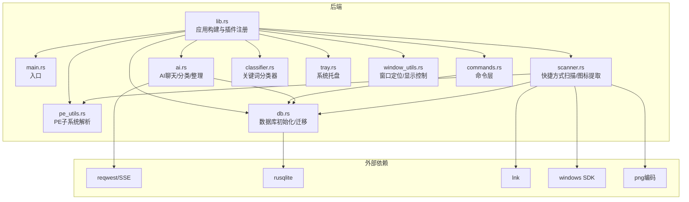
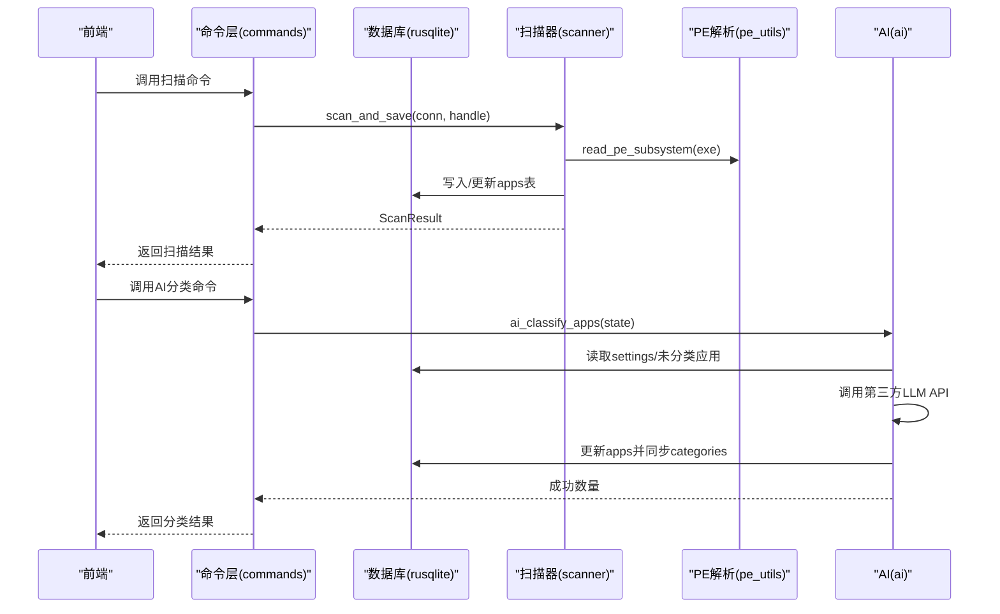
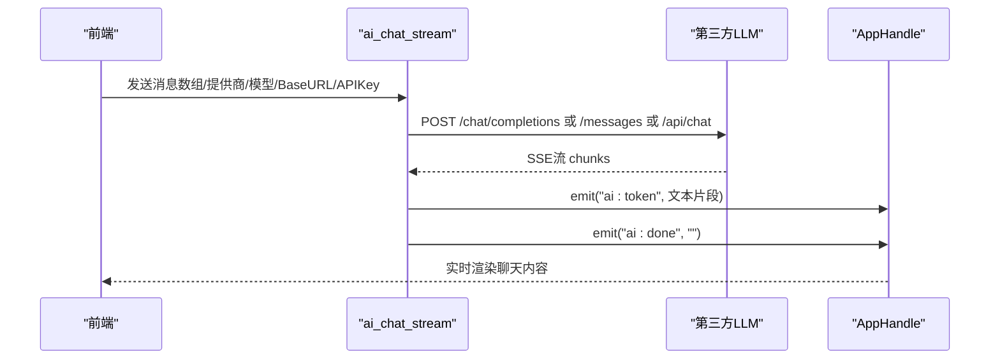
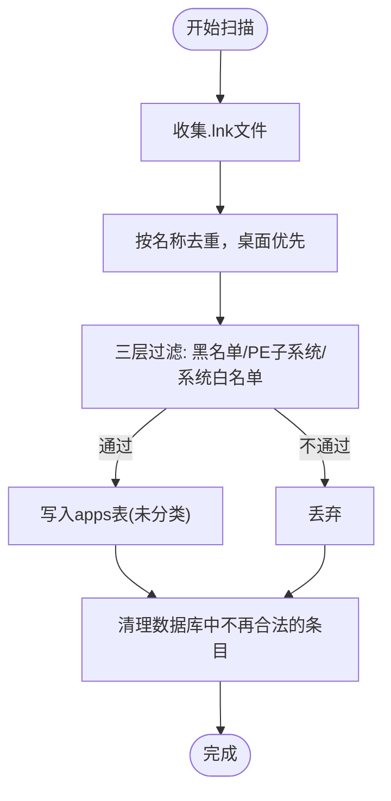
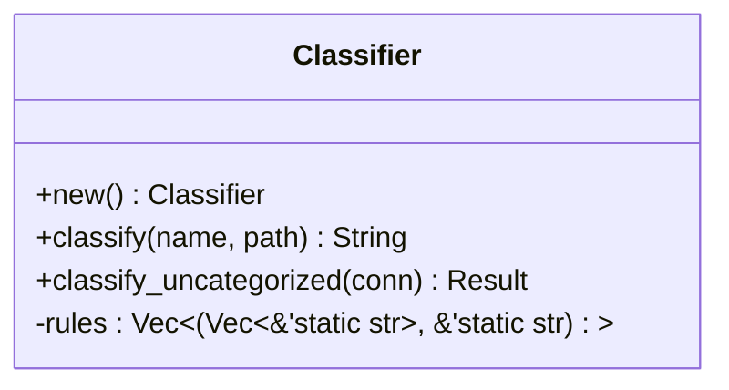
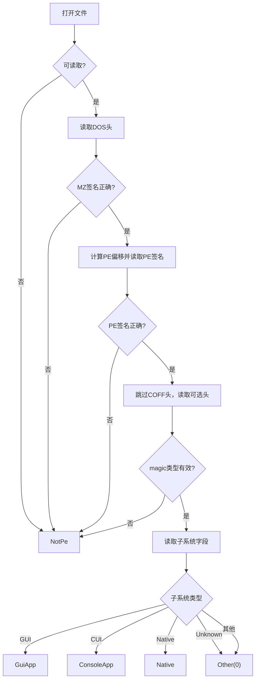
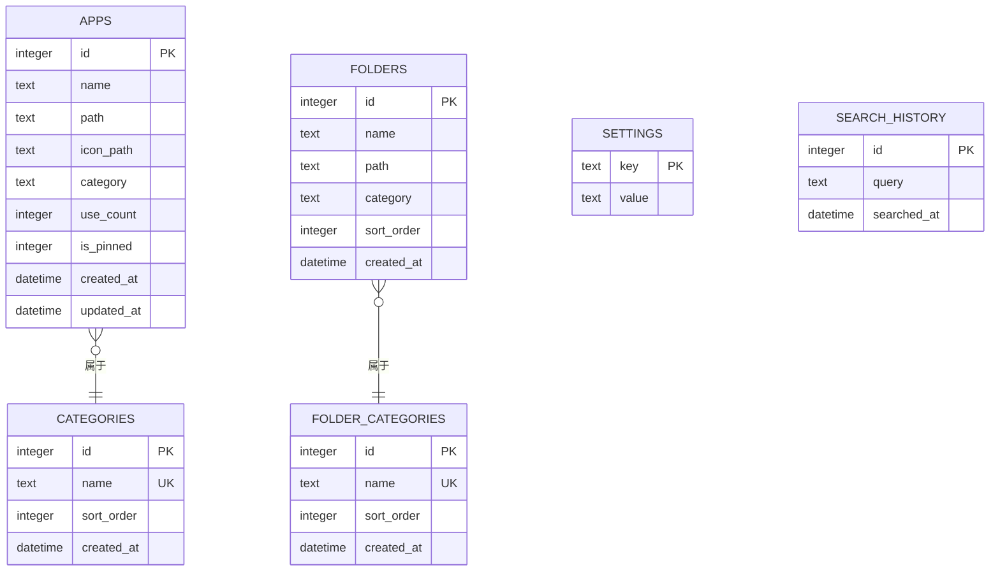
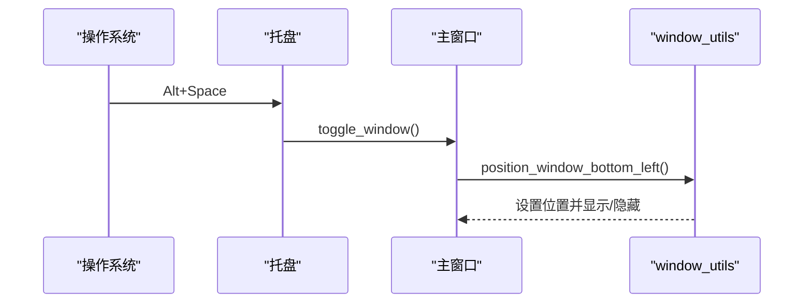
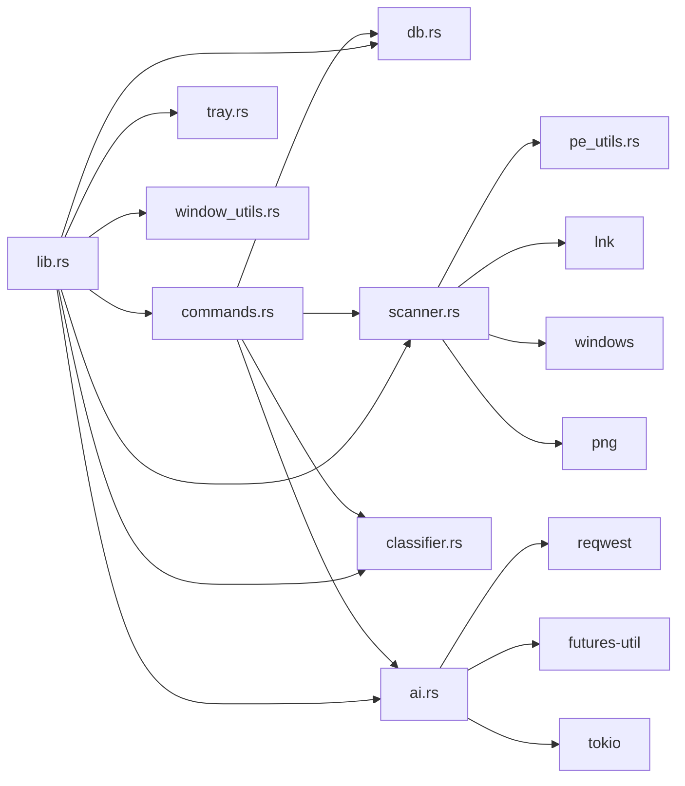

# Rust后端模块

<cite>
**本文引用的文件**
- [lib.rs](file://src-tauri/src/lib.rs)
- [main.rs](file://src-tauri/src/main.rs)
- [ai.rs](file://src-tauri/src/ai.rs)
- [classifier.rs](file://src-tauri/src/classifier.rs)
- [scanner.rs](file://src-tauri/src/scanner.rs)
- [pe_utils.rs](file://src-tauri/src/pe_utils.rs)
- [db.rs](file://src-tauri/src/db.rs)
- [commands.rs](file://src-tauri/src/commands.rs)
- [tray.rs](file://src-tauri/src/tray.rs)
- [window_utils.rs](file://src-tauri/src/window_utils.rs)
- [Cargo.toml](file://src-tauri/Cargo.toml)
- [README.md](file://README.md)
- [AGENTS.md](file://AGENTS.md)
</cite>

## 目录
1. [简介](#简介)
2. [项目结构](#项目结构)
3. [核心组件](#核心组件)
4. [架构总览](#架构总览)
5. [详细组件分析](#详细组件分析)
6. [依赖关系分析](#依赖关系分析)
7. [性能考量](#性能考量)
8. [故障排查指南](#故障排查指南)
9. [结论](#结论)
10. [附录](#附录)

## 简介
本文件面向QuickStart的Rust后端模块，系统性梳理其核心模块与交互关系，重点覆盖：
- AI模块：聊天功能、文件夹整理、应用分类算法
- 扫描器模块：快捷方式识别与应用信息提取
- 分类器模块：自动分类逻辑
- PE文件解析工具：二进制文件处理能力
- 数据库与命令接口：数据流转与错误处理
- 配置项与扩展指南：可定制参数与二次开发建议

## 项目结构
后端采用Tauri v2作为桌面框架，Rust负责核心业务逻辑与系统集成，前端React负责UI与交互。后端模块主要位于src-tauri/src目录，通过命令注册与前端通信。

图表来源
- [lib.rs:1-135](file://src-tauri/src/lib.rs#L1-L135)
- [commands.rs:1-709](file://src-tauri/src/commands.rs#L1-L709)
- [ai.rs:1-501](file://src-tauri/src/ai.rs#L1-L501)
- [scanner.rs:1-483](file://src-tauri/src/scanner.rs#L1-L483)
- [classifier.rs:1-116](file://src-tauri/src/classifier.rs#L1-L116)
- [pe_utils.rs:1-132](file://src-tauri/src/pe_utils.rs#L1-L132)
- [db.rs:1-156](file://src-tauri/src/db.rs#L1-L156)
- [tray.rs:1-59](file://src-tauri/src/tray.rs#L1-L59)
- [window_utils.rs:1-56](file://src-tauri/src/window_utils.rs#L1-L56)

章节来源
- [lib.rs:1-135](file://src-tauri/src/lib.rs#L1-L135)
- [Cargo.toml:1-36](file://src-tauri/Cargo.toml#L1-L36)

## 核心组件
- 应用构建与生命周期：初始化数据库、注册全局快捷键、托盘、窗口样式与焦点管理
- 命令层：统一暴露数据库操作、扫描、搜索、设置、图标缓存、AI调用等命令
- AI模块：OpenAI/Claude/Ollama多提供商SSE流式聊天、AI自动分类应用、安全整理文件夹
- 扫描器模块：三层过滤（PE子系统/系统白名单/名称黑名单）、快捷方式解析、图标提取
- 分类器模块：基于关键词的规则分类，批量同步新分类
- PE解析工具：仅读取PE头关键字段，区分GUI/控制台/原生/未知
- 数据库：SQLite迁移、表结构、索引、默认设置
- 系统集成：托盘菜单、窗口定位、热键触发

章节来源
- [lib.rs:22-134](file://src-tauri/src/lib.rs#L22-L134)
- [commands.rs:32-709](file://src-tauri/src/commands.rs#L32-L709)
- [ai.rs:60-254](file://src-tauri/src/ai.rs#L60-L254)
- [scanner.rs:96-228](file://src-tauri/src/scanner.rs#L96-L228)
- [classifier.rs:6-115](file://src-tauri/src/classifier.rs#L6-L115)
- [pe_utils.rs:33-104](file://src-tauri/src/pe_utils.rs#L33-L104)
- [db.rs:17-133](file://src-tauri/src/db.rs#L17-L133)
- [tray.rs:8-58](file://src-tauri/src/tray.rs#L8-L58)
- [window_utils.rs:5-55](file://src-tauri/src/window_utils.rs#L5-L55)

## 架构总览
后端通过Tauri的命令系统与前端通信，命令层封装数据库访问与业务逻辑，AI与扫描器模块分别承担智能分类与应用发现两大核心能力。

图表来源
- [commands.rs:231-249](file://src-tauri/src/commands.rs#L231-L249)
- [scanner.rs:186-228](file://src-tauri/src/scanner.rs#L186-L228)
- [pe_utils.rs:37-104](file://src-tauri/src/pe_utils.rs#L37-L104)
- [ai.rs:369-460](file://src-tauri/src/ai.rs#L369-L460)

## 详细组件分析

### AI模块
- 聊天功能：支持OpenAI、Claude、Ollama与自定义API，使用SSE流式传输，逐段事件推送至前端
- 文件夹整理：安全移动文件到目标目录，避免删除与重命名，冲突时自动加数字后缀
- 应用分类：基于规则的系统提示词，批量抽取未分类应用，调用LLM生成JSON，回写数据库并同步分类

图表来源
- [ai.rs:60-254](file://src-tauri/src/ai.rs#L60-L254)

章节来源
- [ai.rs:60-254](file://src-tauri/src/ai.rs#L60-L254)
- [ai.rs:321-352](file://src-tauri/src/ai.rs#L321-L352)
- [ai.rs:369-460](file://src-tauri/src/ai.rs#L369-L460)
- [ai.rs:463-500](file://src-tauri/src/ai.rs#L463-L500)

### 扫描器模块
- 三层过滤：名称黑名单/后缀黑名单 → PE子系统检查 → 系统白名单
- 快捷方式解析：使用lnk库安全解析.lnk目标，兼容相对路径/工作目录/图标位置
- 图标提取：纯Win32 API提取大图标为PNG，缓存到应用数据目录
- 数据入库：去重合并开始菜单与桌面，写入apps表并清理失效条目

图表来源
- [scanner.rs:186-228](file://src-tauri/src/scanner.rs#L186-L228)
- [scanner.rs:96-153](file://src-tauri/src/scanner.rs#L96-L153)
- [scanner.rs:288-326](file://src-tauri/src/scanner.rs#L288-L326)

章节来源
- [scanner.rs:96-153](file://src-tauri/src/scanner.rs#L96-L153)
- [scanner.rs:155-179](file://src-tauri/src/scanner.rs#L155-L179)
- [scanner.rs:186-228](file://src-tauri/src/scanner.rs#L186-L228)
- [scanner.rs:288-407](file://src-tauri/src/scanner.rs#L288-L407)
- [pe_utils.rs:33-104](file://src-tauri/src/pe_utils.rs#L33-L104)

### 分类器模块
- 关键词规则：覆盖开发、办公、浏览器、娱乐、设计、通讯、系统工具等类别
- 自动分类：对未分类应用进行批量分类，同步新增分类到categories表

图表来源
- [classifier.rs:6-115](file://src-tauri/src/classifier.rs#L6-L115)

章节来源
- [classifier.rs:6-115](file://src-tauri/src/classifier.rs#L6-L115)

### PE文件解析工具
- 仅读取必要字段：DOS头、PE签名、COFF头、可选头，定位子系统字段
- 结果枚举：GUI/控制台/原生/未知/非PE
- 单元测试覆盖典型系统程序

图表来源
- [pe_utils.rs:37-104](file://src-tauri/src/pe_utils.rs#L37-L104)

章节来源
- [pe_utils.rs:33-104](file://src-tauri/src/pe_utils.rs#L33-L104)

### 数据库与命令接口
- 初始化：创建apps/categories/folders/folder_categories/settings/search_history表，迁移与默认设置
- 命令：应用/文件夹增删改查、固定/使用计数、图标缓存、搜索历史、扫描时间记录、AI设置读取
- 错误处理：命令层统一转换为字符串错误，前端捕获展示

图表来源
- [db.rs:51-130](file://src-tauri/src/db.rs#L51-L130)

章节来源
- [db.rs:17-133](file://src-tauri/src/db.rs#L17-L133)
- [commands.rs:32-709](file://src-tauri/src/commands.rs#L32-L709)

### 系统托盘与窗口管理
- 托盘菜单：显示/隐藏、退出；点击托盘图标亦可切换显示
- 窗口定位：根据工作区自动定位到左下角，避免任务栏遮挡
- 热键：Alt+Space全局快捷键呼出/隐藏窗口

图表来源
- [tray.rs:8-58](file://src-tauri/src/tray.rs#L8-L58)
- [window_utils.rs:5-55](file://src-tauri/src/window_utils.rs#L5-L55)
- [lib.rs:30-42](file://src-tauri/src/lib.rs#L30-L42)

章节来源
- [tray.rs:8-58](file://src-tauri/src/tray.rs#L8-L58)
- [window_utils.rs:5-55](file://src-tauri/src/window_utils.rs#L5-L55)
- [lib.rs:30-42](file://src-tauri/src/lib.rs#L30-L42)

## 依赖关系分析
- 模块耦合
  - commands依赖db与scanner/classifier/ai
  - scanner依赖pe_utils与lnk/windows/png
  - ai依赖reqwest与SSE解析
  - lib聚合所有模块并通过Tauri注册
- 外部依赖
  - tauri生态插件：shell/dialog/opener/process/global-shortcut/autostart
  - 数据库：rusqlite(bundled)
  - 网络：reqwest(futures-util/tokio)
  - 系统：windows(lnk/png)

图表来源
- [Cargo.toml:15-36](file://src-tauri/Cargo.toml#L15-L36)
- [lib.rs:1-135](file://src-tauri/src/lib.rs#L1-L135)
- [commands.rs:1-10](file://src-tauri/src/commands.rs#L1-L10)
- [scanner.rs:1-14](file://src-tauri/src/scanner.rs#L1-L14)
- [ai.rs:1-5](file://src-tauri/src/ai.rs#L1-L5)

章节来源
- [Cargo.toml:15-36](file://src-tauri/Cargo.toml#L15-L36)
- [lib.rs:1-135](file://src-tauri/src/lib.rs#L1-L135)

## 性能考量
- 异步与线程池
  - 扫描与图标提取使用spawn_blocking，避免阻塞UI线程
  - AI聊天使用流式SSE，前端实时渲染
- I/O与缓存
  - 图标缓存到本地PNG文件，减少重复提取开销
  - 数据库连接通过共享Mutex持有，避免频繁打开/关闭
- 过滤策略
  - 三层过滤在解析前快速剔除无效条目，降低后续处理成本
- 索引与查询
  - search_history建立索引，限制历史条目数量，提升查询效率

章节来源
- [commands.rs:231-249](file://src-tauri/src/commands.rs#L231-L249)
- [scanner.rs:288-326](file://src-tauri/src/scanner.rs#L288-L326)
- [db.rs:40-49](file://src-tauri/src/db.rs#L40-L49)

## 故障排查指南
- 数据库初始化失败
  - 检查应用数据目录权限与路径
  - 查看初始化日志输出
- 扫描无结果或误判
  - 检查开始菜单/桌面.lnk是否存在
  - 确认PE子系统是否为GUI
  - 核对系统白名单与黑名单关键词
- AI聊天异常
  - 校验提供商、BaseURL、API Key配置
  - 检查网络连通性与SSE流解析
- 图标提取失败
  - 确认目标文件存在且可读
  - 检查缓存目录权限
- 托盘/热键无效
  - 确认全局快捷键注册成功
  - 检查托盘图标与菜单事件绑定

章节来源
- [lib.rs:44-50](file://src-tauri/src/lib.rs#L44-L50)
- [scanner.rs:155-179](file://src-tauri/src/scanner.rs#L155-L179)
- [ai.rs:69-100](file://src-tauri/src/ai.rs#L69-L100)
- [commands.rs:326-373](file://src-tauri/src/commands.rs#L326-L373)
- [tray.rs:29-54](file://src-tauri/src/tray.rs#L29-L54)

## 结论
QuickStart后端以模块化设计实现“扫描+分类+AI”的核心能力，结合SQLite与Tauri生态，形成轻量、稳定、可扩展的桌面启动器后端。AI模块提供多提供商SSE流式聊天与自动分类；扫描器模块通过三层过滤与PE解析确保应用质量；分类器模块以关键词规则实现快速批量分类；PE解析工具提供可靠的二进制类型判断；命令层统一抽象数据库与系统能力，便于前端集成与扩展。

## 附录

### 模块扩展指南
- 新增AI提供商
  - 在聊天函数中新增分支，构造请求体与SSE解析
  - 注意SSE事件类型与文本片段提取
- 新增扫描路径
  - 在扫描入口扩展目录集合，遵循环境变量展开
  - 如需解析其他类型快捷方式，补充解析逻辑
- 新增分类规则
  - 在分类器规则集中追加关键词与类别
  - 批量分类会自动同步新类别
- 新增命令
  - 在commands.rs中定义命令，必要时引入新模块
  - 在lib.rs的invoke_handler中注册

章节来源
- [ai.rs:60-254](file://src-tauri/src/ai.rs#L60-L254)
- [scanner.rs:260-274](file://src-tauri/src/scanner.rs#L260-L274)
- [classifier.rs:6-115](file://src-tauri/src/classifier.rs#L6-L115)
- [commands.rs:32-709](file://src-tauri/src/commands.rs#L32-L709)
- [lib.rs:96-131](file://src-tauri/src/lib.rs#L96-L131)

### 性能优化建议
- 批量写入：分类与扫描尽量使用事务或批量SQL
- 缓存策略：图标缓存、分类同步、搜索历史分页
- 并发控制：合理设置spawn_blocking并发度，避免I/O瓶颈
- 索引优化：对高频查询字段建立索引，定期维护

章节来源
- [classifier.rs:77-114](file://src-tauri/src/classifier.rs#L77-L114)
- [commands.rs:171-193](file://src-tauri/src/commands.rs#L171-L193)
- [db.rs:40-49](file://src-tauri/src/db.rs#L40-L49)

### 调试方法
- 日志输出：在关键路径打印状态与错误
- 单元测试：PE解析工具具备基本测试用例
- 端到端验证：AI聊天、扫描流程、图标提取、托盘热键联动

章节来源
- [pe_utils.rs:107-131](file://src-tauri/src/pe_utils.rs#L107-L131)
- [lib.rs:44-50](file://src-tauri/src/lib.rs#L44-L50)

### 配置选项与自定义参数
- 设置项（settings表）
  - 热键：hotkey（默认Alt+Space）
  - 自启动：auto_start（默认true）
  - 主题：theme（system/light/dark）
  - 自动分类：auto_classify（默认true）
  - AI提供商：ai_provider（openai/claude/ollama/custom）
  - API Key：ai_api_key
  - Base URL：ai_base_url
  - 模型：ai_model
- 默认设置插入与迁移逻辑见数据库初始化

章节来源
- [db.rs:119-129](file://src-tauri/src/db.rs#L119-L129)
- [commands.rs:398-415](file://src-tauri/src/commands.rs#L398-L415)
- [README.md:44-54](file://README.md#L44-L54)