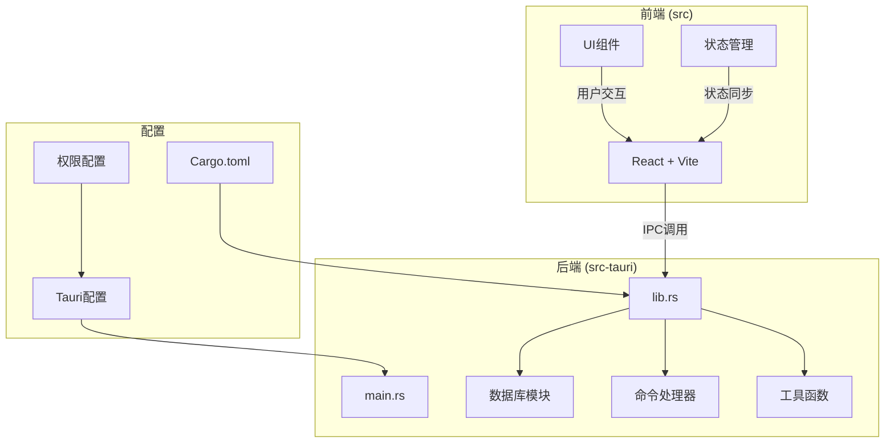
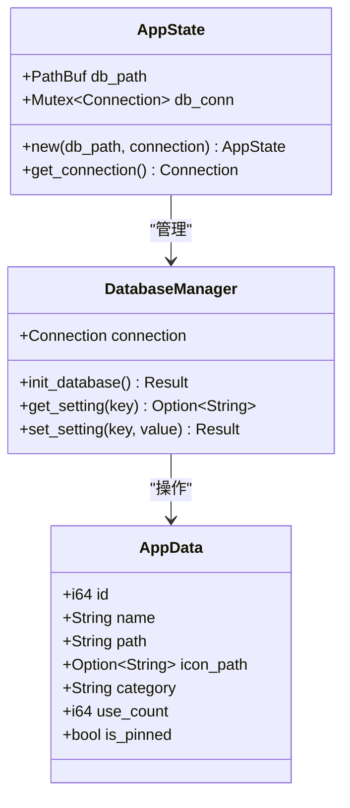
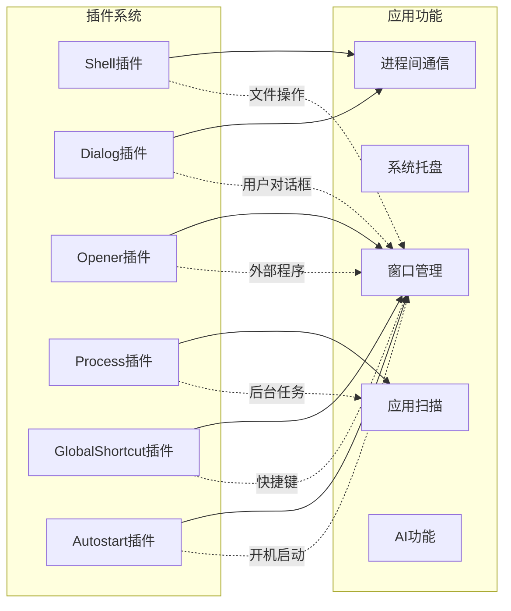
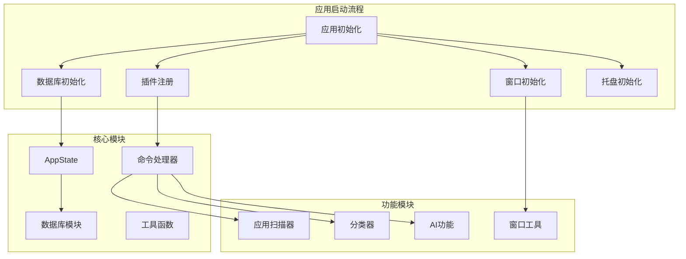
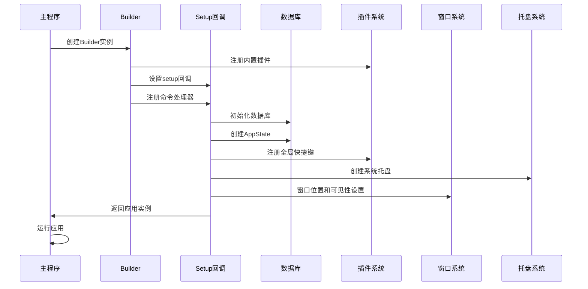
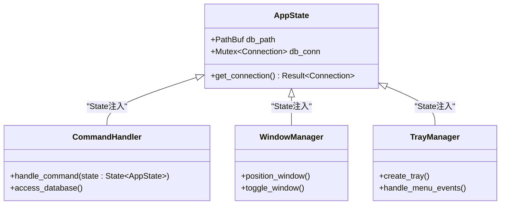
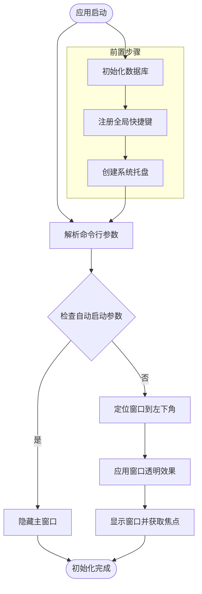
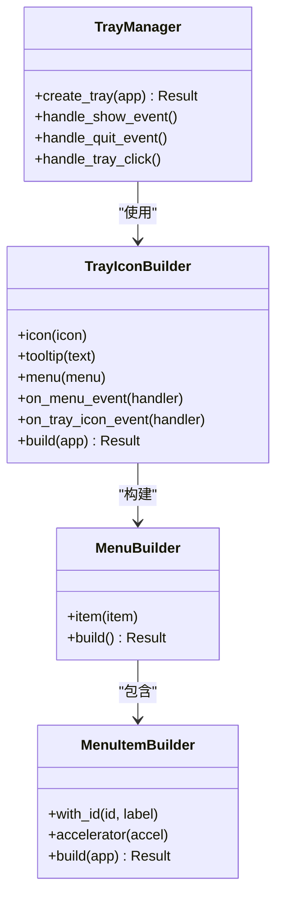
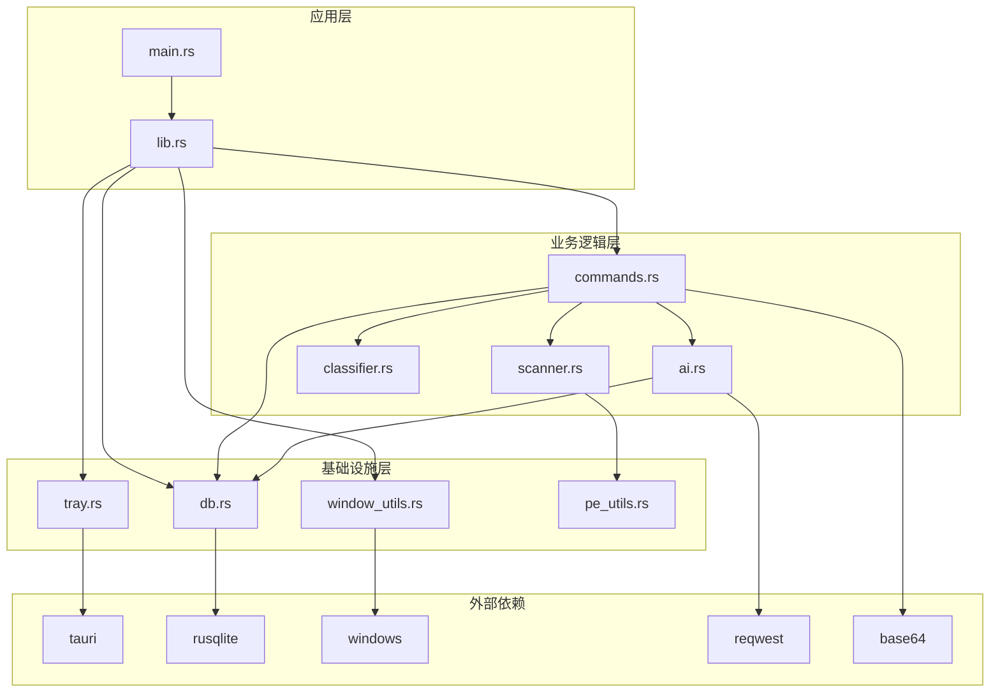

# Tauri应用初始化

<cite>
**本文档引用的文件**
- [src-tauri/src/main.rs](file://src-tauri/src/main.rs)
- [src-tauri/src/lib.rs](file://src-tauri/src/lib.rs)
- [src-tauri/src/db.rs](file://src-tauri/src/db.rs)
- [src-tauri/src/tray.rs](file://src-tauri/src/tray.rs)
- [src-tauri/src/window_utils.rs](file://src-tauri/src/window_utils.rs)
- [src-tauri/src/commands.rs](file://src-tauri/src/commands.rs)
- [src-tauri/src/ai.rs](file://src-tauri/src/ai.rs)
- [src-tauri/src/classifier.rs](file://src-tauri/src/classifier.rs)
- [src-tauri/src/scanner.rs](file://src-tauri/src/scanner.rs)
- [src-tauri/src/pe_utils.rs](file://src-tauri/src/pe_utils.rs)
- [src-tauri/Cargo.toml](file://src-tauri/Cargo.toml)
- [src-tauri/tauri.conf.json](file://src-tauri/tauri.conf.json)
- [src-tauri/capabilities/default.json](file://src-tauri/capabilities/default.json)
- [src-tauri/build.rs](file://src-tauri/build.rs)
</cite>

## 目录
1. [简介](#简介)
2. [项目结构](#项目结构)
3. [核心组件](#核心组件)
4. [架构概览](#架构概览)
5. [详细组件分析](#详细组件分析)
6. [依赖关系分析](#依赖关系分析)
7. [性能考虑](#性能考虑)
8. [故障排除指南](#故障排除指南)
9. [结论](#结论)

## 简介

QuickStart是一个基于Tauri框架的Windows桌面快捷启动器应用。本文档深入解析了应用的初始化流程、插件系统配置、应用生命周期管理以及AppState设计实现。该应用提供了应用管理、文件夹组织、AI智能分类等功能，具有完整的数据库连接管理和全局状态共享机制。

## 项目结构

QuickStart项目采用典型的Tauri应用结构，主要分为前端React/Vite部分和后端Rust Tauri部分：

**图表来源**
- [src-tauri/src/main.rs:1-7](file://src-tauri/src/main.rs#L1-L7)
- [src-tauri/src/lib.rs:1-135](file://src-tauri/src/lib.rs#L1-L135)
- [src-tauri/Cargo.toml:1-36](file://src-tauri/Cargo.toml#L1-L36)

**章节来源**
- [src-tauri/src/main.rs:1-7](file://src-tauri/src/main.rs#L1-L7)
- [src-tauri/src/lib.rs:1-135](file://src-tauri/src/lib.rs#L1-L135)
- [src-tauri/Cargo.toml:1-36](file://src-tauri/Cargo.toml#L1-L36)

## 核心组件

### AppState设计与实现

AppState是应用的核心状态容器，负责管理数据库连接和应用配置：

**图表来源**
- [src-tauri/src/lib.rs:14-17](file://src-tauri/src/lib.rs#L14-L17)
- [src-tauri/src/db.rs:135-156](file://src-tauri/src/db.rs#L135-L156)

AppState采用Mutex包装的rusqlite连接，确保线程安全的数据库访问。这种设计允许多个命令处理器同时访问数据库，而不会产生竞态条件。

**章节来源**
- [src-tauri/src/lib.rs:14-17](file://src-tauri/src/lib.rs#L14-L17)
- [src-tauri/src/db.rs:135-156](file://src-tauri/src/db.rs#L135-L156)

### 插件系统配置

应用配置了多个Tauri插件，每个插件提供特定的功能：

**图表来源**
- [src-tauri/src/lib.rs:24-43](file://src-tauri/src/lib.rs#L24-L43)
- [src-tauri/Cargo.toml:17-22](file://src-tauri/Cargo.toml#L17-L22)

**章节来源**
- [src-tauri/src/lib.rs:24-43](file://src-tauri/src/lib.rs#L24-L43)
- [src-tauri/Cargo.toml:17-22](file://src-tauri/Cargo.toml#L17-L22)

## 架构概览

QuickStart采用了模块化的架构设计，将不同功能分离到独立的模块中：

**图表来源**
- [src-tauri/src/lib.rs:22-95](file://src-tauri/src/lib.rs#L22-L95)
- [src-tauri/src/db.rs:17-133](file://src-tauri/src/db.rs#L17-L133)

**章节来源**
- [src-tauri/src/lib.rs:22-95](file://src-tauri/src/lib.rs#L22-L95)
- [src-tauri/src/db.rs:17-133](file://src-tauri/src/db.rs#L17-L133)

## 详细组件分析

### 应用生命周期管理

应用的生命周期管理遵循Tauri的标准模式，从初始化到运行的完整流程如下：

**图表来源**
- [src-tauri/src/lib.rs:22-134](file://src-tauri/src/lib.rs#L22-L134)

应用启动时的关键步骤包括：
1. **数据库初始化**：检查并创建数据库文件，执行必要的表结构迁移
2. **插件注册**：注册所有必需的Tauri插件
3. **全局状态管理**：创建和托管AppState实例
4. **窗口管理**：设置窗口属性和初始可见性
5. **托盘集成**：创建系统托盘图标和菜单

**章节来源**
- [src-tauri/src/lib.rs:44-95](file://src-tauri/src/lib.rs#L44-L95)

### 数据库连接管理

数据库管理系统采用连接池模式，通过Mutex包装的rusqlite连接实现线程安全访问：

```mermaid
flowchart TD
Start([应用启动]) --> CheckDB["检查数据库文件"]
CheckDB --> Exists{"数据库存在?"}
Exists --> |否| CreateDB["创建数据库文件"]
Exists --> |是| LoadDB["加载现有数据库"]
CreateDB --> InitTables["初始化表结构"]
LoadDB --> InitTables
InitTables --> CreateAppState["创建AppState实例"]
CreateAppState --> CreateConn["创建数据库连接"]
CreateConn --> ManageState["托管AppState"]
ManageState --> Ready([应用就绪])
subgraph "表结构"
Apps[apps表]
Categories[categories表]
Folders[folders表]
Settings[settings表]
SearchHistory[search_history表]
end
InitTables --> Apps
InitTables --> Categories
InitTables --> Folders
InitTables --> Settings
InitTables --> SearchHistory
```

**图表来源**
- [src-tauri/src/db.rs:17-133](file://src-tauri/src/db.rs#L17-L133)
- [src-tauri/src/db.rs:6-14](file://src-tauri/src/db.rs#L6-L14)

数据库初始化过程包含以下关键特性：
- **自动迁移**：支持对现有数据库的结构升级
- **索引优化**：为常用查询字段创建索引
- **默认数据**：插入初始设置和分类数据
- **错误处理**：完善的错误捕获和报告机制

**章节来源**
- [src-tauri/src/db.rs:17-133](file://src-tauri/src/db.rs#L17-L133)

### 全局状态共享机制

AppState作为全局状态容器，通过Tauri的manage API进行托管：

**图表来源**
- [src-tauri/src/lib.rs:14-17](file://src-tauri/src/lib.rs#L14-L17)
- [src-tauri/src/commands.rs:33-34](file://src-tauri/src/commands.rs#L33-L34)

全局状态共享的实现要点：
- **类型安全**：通过Tauri的State类型系统确保编译时类型检查
- **线程安全**：使用Mutex包装数据库连接，避免并发访问冲突
- **生命周期管理**：由Tauri自动管理AppState的创建和销毁
- **错误传播**：统一的错误处理机制，便于调试和维护

**章节来源**
- [src-tauri/src/lib.rs:56-59](file://src-tauri/src/lib.rs#L56-L59)
- [src-tauri/src/commands.rs:33-34](file://src-tauri/src/commands.rs#L33-L34)

### 插件注册过程详解

应用注册了六个核心插件，每个插件都有特定的功能职责：

#### Shell插件
提供系统级文件和程序操作能力，支持打开外部程序和文件。

#### Dialog插件  
提供原生对话框功能，包括文件选择、确认对话框等用户交互界面。

#### Opener插件
专门处理URL和文件的打开操作，支持多种协议和文件类型。

#### Process插件
提供进程管理功能，支持启动、监控和控制外部进程。

#### GlobalShortcut插件
实现全局快捷键注册和处理，支持跨应用的键盘快捷键。

#### Autostart插件
管理应用的开机自启动功能，支持启用、禁用和状态查询。

**章节来源**
- [src-tauri/src/lib.rs:24-43](file://src-tauri/src/lib.rs#L24-L43)
- [src-tauri/Cargo.toml:17-22](file://src-tauri/Cargo.toml#L17-L22)

### 应用启动初始化步骤

应用启动时的初始化流程严格按照既定顺序执行：

**图表来源**
- [src-tauri/src/lib.rs:72-92](file://src-tauri/src/lib.rs#L72-L92)
- [src-tauri/src/window_utils.rs:5-55](file://src-tauri/src/window_utils.rs#L5-L55)

初始化步骤的关键特性：
- **条件化窗口行为**：自动启动时隐藏窗口，正常启动时显示并定位
- **平台适配**：根据Windows版本应用不同的透明效果
- **用户体验优化**：窗口显示时自动获取焦点，提升交互体验

**章节来源**
- [src-tauri/src/lib.rs:72-92](file://src-tauri/src/lib.rs#L72-L92)
- [src-tauri/src/window_utils.rs:5-55](file://src-tauri/src/window_utils.rs#L5-L55)

### 托盘图标设置

系统托盘的实现提供了完整的菜单和事件处理机制：

**图表来源**
- [src-tauri/src/tray.rs:8-58](file://src-tauri/src/tray.rs#L8-L58)

托盘功能的实现特点：
- **双触发机制**：支持菜单项点击和托盘图标点击两种方式
- **快捷键集成**：菜单项支持Alt+Space快捷键
- **事件分离**：菜单事件和托盘图标事件分别处理
- **状态同步**：与主窗口的显示状态保持同步

**章节来源**
- [src-tauri/src/tray.rs:8-58](file://src-tauri/src/tray.rs#L8-L58)

## 依赖关系分析

QuickStart应用的依赖关系体现了清晰的分层架构：

**图表来源**
- [src-tauri/src/lib.rs:1-8](file://src-tauri/src/lib.rs#L1-L8)
- [src-tauri/Cargo.toml:15-36](file://src-tauri/Cargo.toml#L15-L36)

依赖关系的特点：
- **明确的分层**：应用层、业务逻辑层、基础设施层职责分明
- **最小依赖原则**：每个模块只依赖必要的其他模块
- **外部库管理**：通过Cargo.toml集中管理所有依赖
- **平台特定依赖**：Windows平台特有功能通过windows crate实现

**章节来源**
- [src-tauri/Cargo.toml:15-36](file://src-tauri/Cargo.toml#L15-L36)

## 性能考虑

### 内存优化策略

QuickStart应用采用了多项内存优化技术：

1. **数据库连接复用**：通过Mutex包装的单一连接减少内存分配
2. **图标缓存机制**：应用图标提取后缓存到本地文件系统
3. **异步处理**：大量I/O密集型操作使用异步执行避免阻塞UI
4. **资源及时释放**：GDI对象和文件句柄在使用后立即释放

### 并发安全设计

应用的并发安全通过以下机制保证：
- **Mutex保护**：数据库连接通过Mutex确保线程安全
- **无共享可变状态**：大部分数据结构都是不可变的
- **异步任务隔离**：长时间运行的任务在独立线程中执行

### 错误处理最佳实践

应用实现了多层次的错误处理：
- **早期失败**：关键初始化步骤失败时立即终止
- **降级处理**：某些功能失败时提供替代方案
- **用户友好**：错误信息经过格式化，便于用户理解

## 故障排除指南

### 常见启动问题

**数据库初始化失败**
- 检查应用数据目录的写入权限
- 验证数据库文件没有被其他进程占用
- 查看详细的错误日志输出

**插件注册失败**
- 确认Cargo.toml中的插件版本兼容
- 检查权限配置文件是否正确
- 验证系统环境满足插件要求

**窗口显示问题**
- 检查多显示器配置
- 验证任务栏位置和大小
- 确认透明效果支持情况

### 调试技巧

1. **启用调试模式**：使用`cargo run --debug`获取详细日志
2. **检查系统托盘**：验证托盘图标是否正确显示
3. **测试快捷键**：确认Alt+Space快捷键正常工作
4. **数据库验证**：使用SQLite客户端检查数据库状态

**章节来源**
- [src-tauri/src/lib.rs:48-50](file://src-tauri/src/lib.rs#L48-L50)
- [src-tauri/src/db.rs:17-133](file://src-tauri/src/db.rs#L17-L133)

## 结论

QuickStart应用展现了现代Tauri应用的良好实践，具有以下突出特点：

1. **清晰的架构设计**：模块化结构使得代码易于维护和扩展
2. **完善的初始化流程**：从数据库到UI的完整启动序列
3. **健壮的状态管理**：通过AppState实现全局状态的统一管理
4. **丰富的功能集成**：结合传统应用管理和AI智能功能
5. **优秀的用户体验**：流畅的窗口管理和直观的系统托盘交互

该应用为Tauri生态系统的应用开发提供了良好的参考模板，特别是在数据库集成、插件系统使用和状态管理方面都体现了最佳实践。