# 后端开发

<cite>
**本文档引用的文件**
- [Cargo.toml](file://src-tauri/Cargo.toml)
- [tauri.conf.json](file://src-tauri/tauri.conf.json)
- [main.rs](file://src-tauri/src/main.rs)
- [lib.rs](file://src-tauri/src/lib.rs)
- [commands.rs](file://src-tauri/src/commands.rs)
- [db.rs](file://src-tauri/src/db.rs)
- [scanner.rs](file://src-tauri/src/scanner.rs)
- [tray.rs](file://src-tauri/src/tray.rs)
- [ai.rs](file://src-tauri/src/ai.rs)
- [classifier.rs](file://src-tauri/src/classifier.rs)
- [window_utils.rs](file://src-tauri/src/window_utils.rs)
- [pe_utils.rs](file://src-tauri/src/pe_utils.rs)
- [default.json](file://src-tauri/capabilities/default.json)
- [package.json](file://package.json)
</cite>

## 目录
1. [简介](#简介)
2. [项目结构](#项目结构)
3. [核心组件](#核心组件)
4. [架构概览](#架构概览)
5. [详细组件分析](#详细组件分析)
6. [依赖关系分析](#依赖关系分析)
7. [性能考虑](#性能考虑)
8. [故障排除指南](#故障排除指南)
9. [结论](#结论)

## 简介

QuickStart 是一个基于 Tauri 框架的 Windows 桌面快捷启动器应用。该项目采用 Rust 作为后端语言，结合前端 React 技术栈，提供了高效、安全的桌面应用体验。应用的核心功能包括应用程序快速启动、智能分类管理、AI 辅助分类、系统集成等功能。

## 项目结构

项目采用典型的 Tauri 应用结构，主要分为前端和后端两个部分：

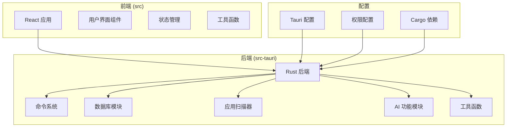

**图表来源**
- [main.rs:1-7](file://src-tauri/src/main.rs#L1-L7)
- [lib.rs:1-135](file://src-tauri/src/lib.rs#L1-L135)

**章节来源**
- [main.rs:1-7](file://src-tauri/src/main.rs#L1-L7)
- [lib.rs:1-135](file://src-tauri/src/lib.rs#L1-L135)
- [Cargo.toml:1-36](file://src-tauri/Cargo.toml#L1-L36)

## 核心组件

### Tauri 应用初始化

应用的启动流程通过 `lib.rs` 中的 `run()` 函数完成，该函数负责：

1. **插件初始化**：注册所有必要的 Tauri 插件
2. **数据库初始化**：设置数据库连接和表结构
3. **全局快捷键配置**：设置 Alt+Space 快捷键
4. **系统托盘创建**：构建托盘菜单和图标
5. **窗口管理**：配置主窗口属性和行为

### 命令系统设计

应用采用 Tauri 的命令系统，通过 `#[tauri::command]` 宏定义后端接口，前端通过 `invoke` 方法调用。命令系统支持：

- **同步命令**：直接返回结果
- **异步命令**：使用 `async` 关键字处理耗时操作
- **参数验证**：自动进行参数类型检查
- **错误处理**：统一的错误返回格式

### 数据库操作

应用使用 rusqlite 作为 SQLite 数据库驱动，支持：

- **应用管理**：增删改查应用程序记录
- **分类管理**：维护应用分类体系
- **设置存储**：保存用户配置和应用状态
- **搜索历史**：记录和管理搜索历史

**章节来源**
- [lib.rs:22-134](file://src-tauri/src/lib.rs#L22-L134)
- [commands.rs:1-709](file://src-tauri/src/commands.rs#L1-L709)
- [db.rs:16-133](file://src-tauri/src/db.rs#L16-L133)

## 架构概览

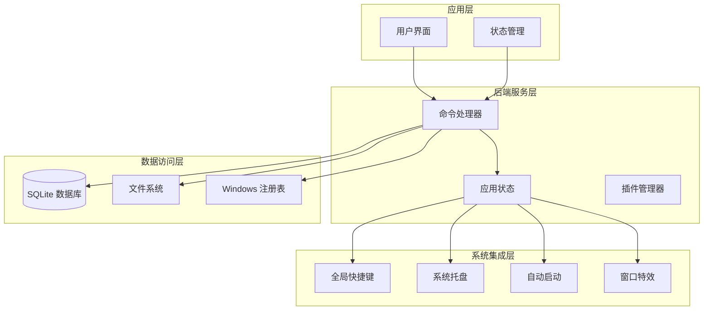

**图表来源**
- [lib.rs:14-134](file://src-tauri/src/lib.rs#L14-L134)
- [commands.rs:1-709](file://src-tauri/src/commands.rs#L1-L709)
- [db.rs:16-133](file://src-tauri/src/db.rs#L16-L133)

## 详细组件分析

### 应用状态管理

应用状态通过 `AppState` 结构体管理，包含数据库路径和连接：

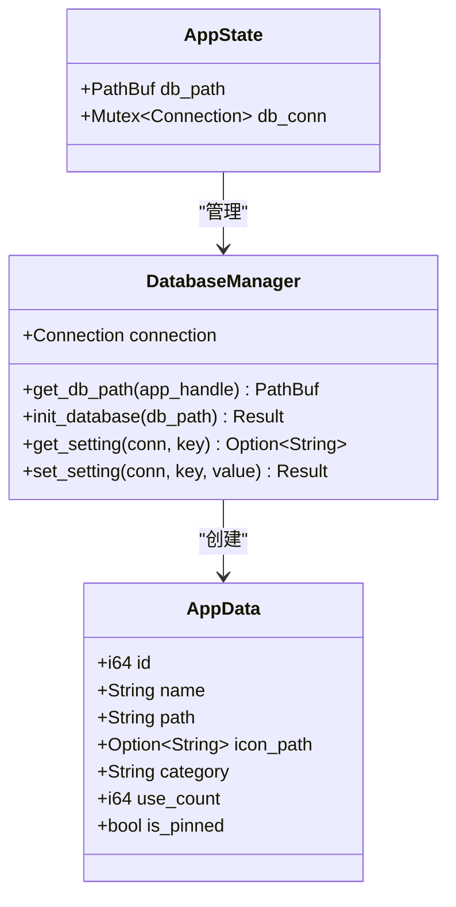

**图表来源**
- [lib.rs:14-17](file://src-tauri/src/lib.rs#L14-L17)
- [db.rs:6-14](file://src-tauri/src/db.rs#L6-L14)
- [commands.rs:11-20](file://src-tauri/src/commands.rs#L11-L20)

### 全局快捷键处理

应用实现了 Alt+Space 全局快捷键，用于切换主窗口显示状态：

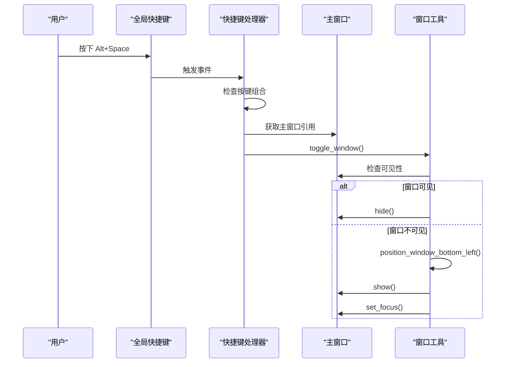

**图表来源**
- [lib.rs:28-42](file://src-tauri/src/lib.rs#L28-L42)
- [window_utils.rs:45-55](file://src-tauri/src/window_utils.rs#L45-L55)

### 应用扫描器

应用扫描器负责扫描系统中的应用程序并进行智能过滤：

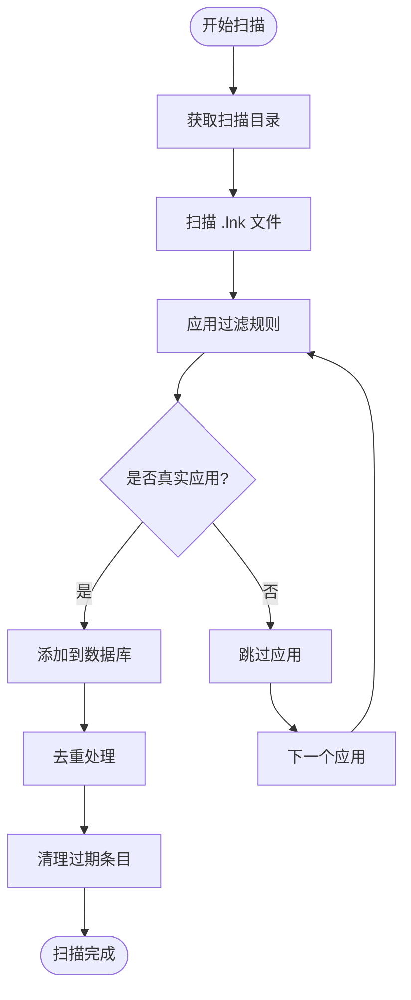

**图表来源**
- [scanner.rs:185-228](file://src-tauri/src/scanner.rs#L185-L228)
- [scanner.rs:96-153](file://src-tauri/src/scanner.rs#L96-L153)

### AI 功能模块

AI 功能模块支持多种大模型提供商，提供流式对话和文件组织能力：

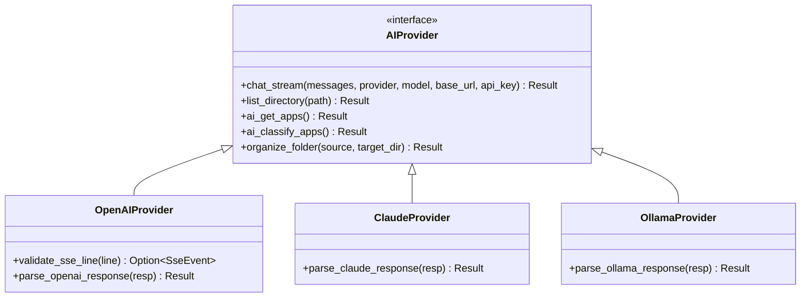

**图表来源**
- [ai.rs:60-254](file://src-tauri/src/ai.rs#L60-L254)
- [ai.rs:256-319](file://src-tauri/src/ai.rs#L256-L319)

### 数据库设计

应用使用 SQLite 作为本地数据库，支持以下核心表：

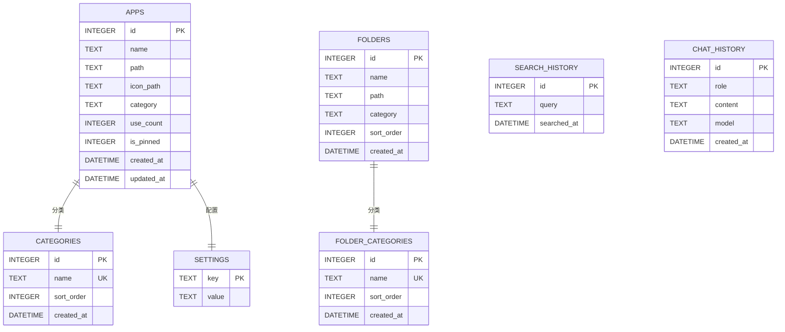

**图表来源**
- [db.rs:51-130](file://src-tauri/src/db.rs#L51-L130)

**章节来源**
- [lib.rs:14-17](file://src-tauri/src/lib.rs#L14-L17)
- [scanner.rs:1-483](file://src-tauri/src/scanner.rs#L1-L483)
- [ai.rs:1-501](file://src-tauri/src/ai.rs#L1-L501)
- [db.rs:16-133](file://src-tauri/src/db.rs#L16-L133)

## 依赖关系分析

### 外部依赖

应用的主要外部依赖包括：

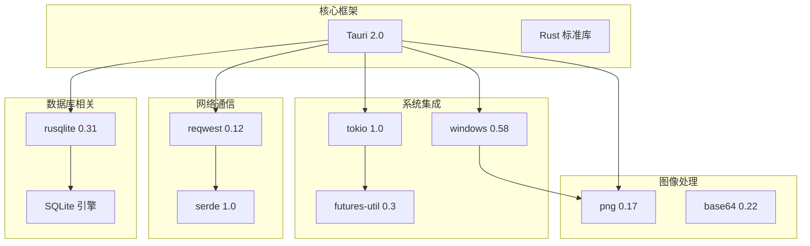

**图表来源**
- [Cargo.toml:15-36](file://src-tauri/Cargo.toml#L15-L36)

### 内部模块依赖

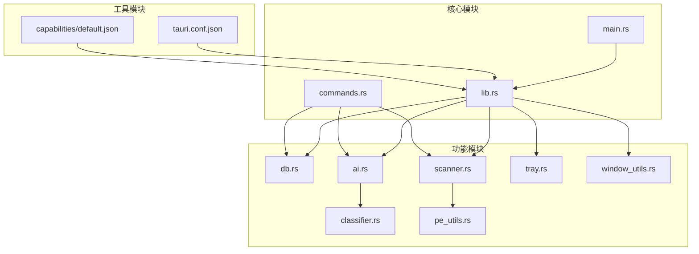

**图表来源**
- [lib.rs:1-8](file://src-tauri/src/lib.rs#L1-L8)
- [commands.rs:1-9](file://src-tauri/src/commands.rs#L1-L9)

**章节来源**
- [Cargo.toml:15-36](file://src-tauri/Cargo.toml#L15-L36)
- [lib.rs:1-8](file://src-tauri/src/lib.rs#L1-L8)

## 性能考虑

### 并发处理策略

应用采用多线程架构处理不同类型的负载：

1. **Tokio 运行时**：使用 `tokio::runtime::Builder` 创建自定义运行时
2. **异步 I/O**：网络请求和文件操作使用异步 API
3. **阻塞操作**：数据库操作和文件扫描使用 `spawn_blocking`
4. **线程池管理**：合理配置工作线程数量避免过度竞争

### 内存管理

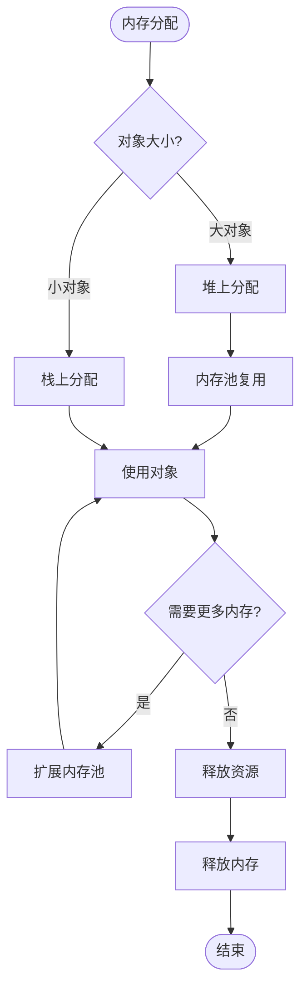

### 数据库优化

1. **连接池**：使用 `Mutex<Connection>` 管理数据库连接
2. **索引优化**：为常用查询字段建立索引
3. **批量操作**：使用 `execute_batch` 执行事务
4. **查询优化**：避免 N+1 查询模式

### 错误处理机制

应用采用统一的错误处理策略：

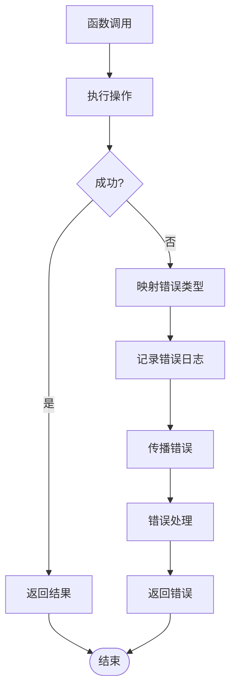

## 故障排除指南

### 常见问题诊断

#### 数据库连接问题

**症状**：应用启动时报数据库连接错误
**解决方案**：
1. 检查应用数据目录权限
2. 验证数据库文件完整性
3. 确认 SQLite 版本兼容性

#### 快捷键失效

**症状**：Alt+Space 无法切换窗口
**解决方案**：
1. 检查快捷键注册状态
2. 验证全局快捷键权限
3. 确认系统快捷键冲突

#### 图标提取失败

**症状**：应用程序图标显示为空
**解决方案**：
1. 检查图标缓存目录权限
2. 验证可执行文件路径有效性
3. 确认 Windows API 调用成功

### 调试技巧

1. **日志输出**：使用 `eprintln!` 输出调试信息
2. **错误链追踪**：利用 `thiserror` 和 `anyhow` 进行错误链追踪
3. **性能分析**：使用 `tokio-console` 分析异步任务性能
4. **内存泄漏检测**：使用 `valgrind` 或 `AddressSanitizer` 检测内存问题

### 性能监控

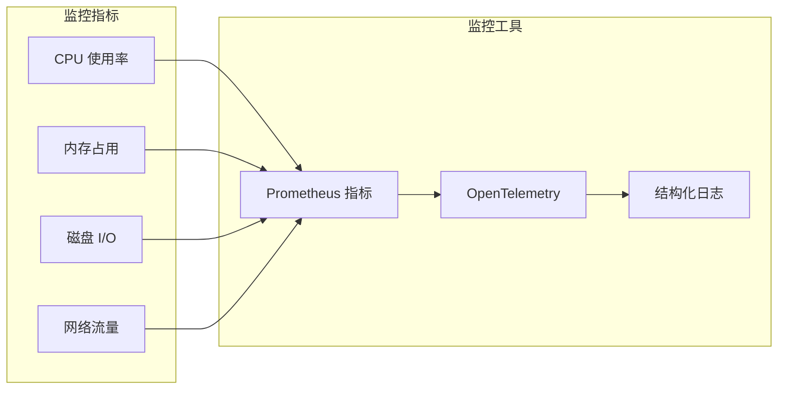

**章节来源**
- [lib.rs:48-50](file://src-tauri/src/lib.rs#L48-L50)
- [scanner.rs:288-326](file://src-tauri/src/scanner.rs#L288-L326)
- [ai.rs:37-49](file://src-tauri/src/ai.rs#L37-L49)

## 结论

QuickStart 项目展现了现代桌面应用开发的最佳实践，通过 Rust 的安全性、Tauri 的跨平台能力以及 React 的用户体验，构建了一个功能完整、性能优异的应用程序。

### 主要优势

1. **高性能**：Rust 语言提供接近 C/C++ 的性能
2. **安全性**：内存安全保证，防止常见的内存相关漏洞
3. **跨平台**：一次编写，多平台部署
4. **资源效率**：相比传统 Electron 应用，资源占用更少
5. **现代化架构**：模块化设计，易于维护和扩展

### 技术亮点

1. **智能应用扫描**：基于 PE 头部分析的精确过滤
2. **AI 集成**：支持多种大模型提供商的流式对话
3. **系统深度集成**：全局快捷键、系统托盘、自动启动等功能
4. **数据库设计**：合理的表结构和索引优化
5. **错误处理**：完善的异常处理和恢复机制

### 未来发展方向

1. **AI 功能增强**：支持更多大模型和推理能力
2. **性能优化**：进一步优化启动速度和内存使用
3. **功能扩展**：添加更多系统集成特性
4. **用户体验**：改进界面设计和交互体验
5. **测试覆盖**：增加自动化测试覆盖率

这个项目为桌面应用开发提供了优秀的参考模板，展示了如何在保证性能的同时提供丰富的功能和良好的用户体验。