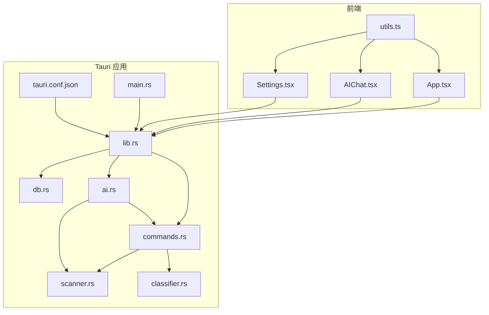
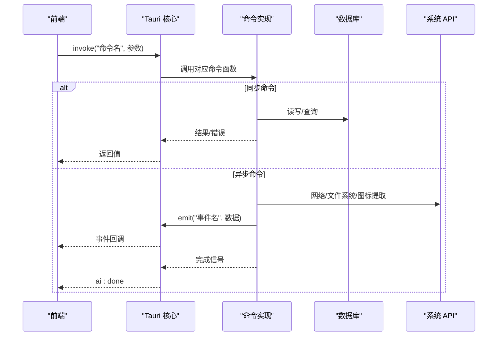
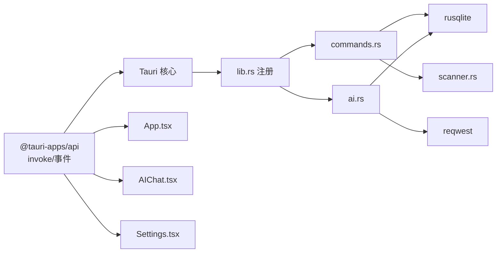
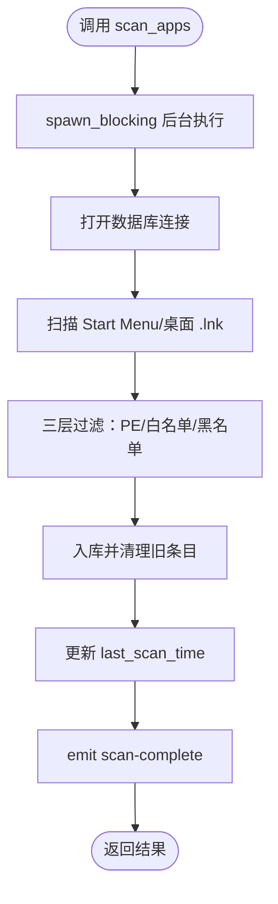

# 命令系统

<cite>
**本文引用的文件**
- [commands.rs](file://src-tauri/src/commands.rs)
- [lib.rs](file://src-tauri/src/lib.rs)
- [main.rs](file://src-tauri/src/main.rs)
- [db.rs](file://src-tauri/src/db.rs)
- [ai.rs](file://src-tauri/src/ai.rs)
- [scanner.rs](file://src-tauri/src/scanner.rs)
- [classifier.rs](file://src-tauri/src/classifier.rs)
- [tauri.conf.json](file://src-tauri/tauri.conf.json)
- [Cargo.toml](file://src-tauri/Cargo.toml)
- [App.tsx](file://src/App.tsx)
- [AIChat.tsx](file://src/AIChat.tsx)
- [Settings.tsx](file://src/Settings.tsx)
- [utils.ts](file://src/lib/utils.ts)
</cite>

## 目录
1. [简介](#简介)
2. [项目结构](#项目结构)
3. [核心组件](#核心组件)
4. [架构总览](#架构总览)
5. [详细组件分析](#详细组件分析)
6. [依赖关系分析](#依赖关系分析)
7. [性能考量](#性能考量)
8. [故障排查指南](#故障排查指南)
9. [结论](#结论)
10. [附录](#附录)

## 简介
本文件系统性梳理 QuickStart 的 Tauri 命令系统，涵盖命令架构、命令定义规范、参数与返回值约定、前后端通信协议、异步处理与事件广播、错误传播机制、安全与权限控制，并提供命令扩展指南、性能优化建议与调试技巧。文档同时给出各已实现命令接口的完整说明与使用参考。

## 项目结构
QuickStart 的命令系统位于 Rust 后端模块 src-tauri 中，前端通过 @tauri-apps/api 的 invoke 与后端进行命令交互。核心文件组织如下：
- 后端
  - src-tauri/src/lib.rs：应用入口与插件注册、命令注册、全局状态托管
  - src-tauri/src/commands.rs：命令实现（应用/文件夹/设置/AI/扫描等）
  - src-tauri/src/ai.rs：AI 对话与工具调用
  - src-tauri/src/db.rs：数据库初始化与迁移
  - src-tauri/src/scanner.rs：应用扫描与图标提取
  - src-tauri/src/classifier.rs：关键词自动分类器
  - src-tauri/tauri.conf.json：应用配置与安全策略
  - src-tauri/Cargo.toml：依赖与插件声明
- 前端
  - src/App.tsx：主界面与命令调用示例
  - src/AIChat.tsx：AI 聊天与事件监听
  - src/Settings.tsx：设置读取/保存
  - src/lib/utils.ts：统一的 invoke 封装

图表来源
- [lib.rs:22-134](file://src-tauri/src/lib.rs#L22-L134)
- [commands.rs:1-709](file://src-tauri/src/commands.rs#L1-L709)
- [ai.rs:1-501](file://src-tauri/src/ai.rs#L1-L501)
- [scanner.rs:1-483](file://src-tauri/src/scanner.rs#L1-L483)
- [classifier.rs:1-116](file://src-tauri/src/classifier.rs#L1-L116)
- [db.rs:1-156](file://src-tauri/src/db.rs#L1-L156)
- [tauri.conf.json:1-54](file://src-tauri/tauri.conf.json#L1-L54)

章节来源
- [lib.rs:22-134](file://src-tauri/src/lib.rs#L22-L134)
- [tauri.conf.json:1-54](file://src-tauri/tauri.conf.json#L1-L54)

## 核心组件
- 应用状态与数据库连接
  - AppState：持有数据库路径与互斥的连接，供命令使用
  - 数据库初始化：在 setup 阶段创建数据库文件与表结构，包含迁移逻辑
- 命令注册
  - 通过 generate_handler 将命令函数注册到 Tauri，前端可直接 invoke
- 插件体系
  - shell/dialog/opener/process/global-shortcut/autostart 等插件提供系统能力
- 安全与 CSP
  - 严格 Content Security Policy，限制资源访问范围

章节来源
- [lib.rs:14-59](file://src-tauri/src/lib.rs#L14-L59)
- [db.rs:17-133](file://src-tauri/src/db.rs#L17-L133)
- [tauri.conf.json:41-50](file://src-tauri/tauri.conf.json#L41-L50)

## 架构总览
命令系统采用“前端 invoke -> Tauri 注册 -> Rust 实现 -> 数据库/系统 API”的分层设计。命令分为：
- 同步命令：直接返回结果或错误
- 异步命令：spawn_blocking 或异步网络请求，通过事件广播结果
- 事件广播：scan-complete、ai:token、ai:done 等

图表来源
- [lib.rs:96-131](file://src-tauri/src/lib.rs#L96-L131)
- [commands.rs:230-249](file://src-tauri/src/commands.rs#L230-L249)
- [ai.rs:60-254](file://src-tauri/src/ai.rs#L60-L254)

章节来源
- [lib.rs:96-131](file://src-tauri/src/lib.rs#L96-L131)
- [commands.rs:230-249](file://src-tauri/src/commands.rs#L230-L249)
- [ai.rs:60-254](file://src-tauri/src/ai.rs#L60-L254)

## 详细组件分析

### 命令定义规范与参数验证
- 命令声明
  - 使用 #[tauri::command] 宏标注，自动注册到 Tauri
  - 支持 State<AppState>、AppHandle、异步 async、Option/Vec/结构体等参数
- 参数与返回值
  - 统一返回 Result<T, String>，错误以字符串形式传播
  - 结构体使用 #[derive(Serialize, Deserialize)]，便于跨边界序列化
- 参数验证
  - 前端可做基础校验（如分类名称非空），后端再次校验（如保留关键字、唯一性）
  - 路径类参数进行安全校验（路径遍历防护）

章节来源
- [commands.rs:31-89](file://src-tauri/src/commands.rs#L31-L89)
- [ai.rs:37-49](file://src-tauri/src/ai.rs#L37-L49)

### 前后端通信协议与事件机制
- 前端调用
  - 通过 utils.ts 的 invoke 封装统一调用
  - App.tsx/AIChat.tsx/Settings.tsx 中大量使用 invoke
- 事件广播
  - scan-complete：扫描完成事件，携带扫描结果
  - ai:token / ai:done：AI 流式输出事件
- 错误传播
  - 后端抛出 String 错误，前端捕获并展示

章节来源
- [utils.ts:11-24](file://src/lib/utils.ts#L11-L24)
- [App.tsx:394-409](file://src/App.tsx#L394-L409)
- [AIChat.tsx:98-108](file://src/AIChat.tsx#L98-L108)
- [commands.rs:246-247](file://src-tauri/src/commands.rs#L246-L247)
- [ai.rs:122-123](file://src-tauri/src/ai.rs#L122-L123)

### 应用管理命令
- 获取应用列表
  - 参数：无
  - 返回：应用数组（包含 id/name/path/icon/category/use_count/is_pinned）
  - 用途：主界面渲染
- 添加应用
  - 参数：name/path/icon_path/category/app_handle
  - 返回：AppData
  - 行为：去重、同步分类、提取图标
- 删除应用
  - 参数：id
  - 返回：空
- 更新应用分类
  - 参数：id/category
  - 行为：事务保护，同步新分类
- 切换固定
  - 参数：id
  - 返回：新的固定状态
- 记录启动次数
  - 参数：id
  - 行为：use_count + 1
- 刷新应用图标
  - 参数：id/app_handle
  - 返回：图标缓存路径或空
- 获取应用图标（按需提取）
  - 参数：app_id/app_handle
  - 返回：data:image/png;base64 字符串或空
- 搜索文件
  - 参数：query
  - 返回：文件结果数组（最多 20 项）
- 启动应用/打开资源管理器
  - 参数：path
  - 行为：open::that 或 explorer /select

章节来源
- [commands.rs:91-142](file://src-tauri/src/commands.rs#L91-L142)
- [commands.rs:144-151](file://src-tauri/src/commands.rs#L144-L151)
- [commands.rs:153-194](file://src-tauri/src/commands.rs#L153-L194)
- [commands.rs:196-216](file://src-tauri/src/commands.rs#L196-L216)
- [commands.rs:218-228](file://src-tauri/src/commands.rs#L218-L228)
- [commands.rs:417-443](file://src-tauri/src/commands.rs#L417-L443)
- [commands.rs:325-373](file://src-tauri/src/commands.rs#L325-L373)
- [commands.rs:445-488](file://src-tauri/src/commands.rs#L445-L488)
- [commands.rs:507-525](file://src-tauri/src/commands.rs#L507-L525)

### 文件夹管理命令
- 获取文件夹列表
  - 返回：文件夹数组（id/name/path/category/sort_order）
- 添加文件夹
  - 参数：name/path/category
  - 行为：同步分类、分配排序
- 删除文件夹
  - 参数：id
- 获取/添加/更新文件夹分类
  - 行为：与应用分类类似，事务保护

章节来源
- [commands.rs:251-274](file://src-tauri/src/commands.rs#L251-L274)
- [commands.rs:276-314](file://src-tauri/src/commands.rs#L276-L314)
- [commands.rs:316-323](file://src-tauri/src/commands.rs#L316-L323)
- [commands.rs:608-625](file://src-tauri/src/commands.rs#L608-L625)
- [commands.rs:627-666](file://src-tauri/src/commands.rs#L627-L666)
- [commands.rs:668-708](file://src-tauri/src/commands.rs#L668-L708)

### 设置管理命令
- 获取设置
  - 参数：key
  - 返回：value
- 更新设置
  - 参数：key/value
  - 行为：ON CONFLICT 更新
- 获取数据库路径
  - 返回：数据库文件绝对路径

章节来源
- [commands.rs:398-415](file://src-tauri/src/commands.rs#L398-L415)
- [commands.rs:392-396](file://src-tauri/src/commands.rs#L392-L396)

### AI 功能命令
- 流式聊天（ai_chat_stream）
  - 参数：messages/provider/model/base_url/api_key
  - 行为：根据 provider 调用 OpenAI/Claude/Ollama，解析 SSE，emit ai:token，最后 ai:done
- 列出目录（list_directory）
  - 参数：path
  - 行为：路径范围校验（仅允许 app data 与用户常用目录），返回目录项
- 获取应用列表（ai_get_apps）
  - 返回：应用数组（供 AI 工具使用）
- 自动分类应用（ai_classify_apps）
  - 行为：构造提示词，调用 LLM，解析 JSON，批量更新分类并同步新分类
- 安全整理文件夹（organize_folder）
  - 参数：source/target_dir
  - 行为：只移动文件，避免重命名/删除；冲突时加数字后缀

章节来源
- [ai.rs:59-254](file://src-tauri/src/ai.rs#L59-L254)
- [ai.rs:256-319](file://src-tauri/src/ai.rs#L256-L319)
- [ai.rs:321-352](file://src-tauri/src/ai.rs#L321-L352)
- [ai.rs:369-460](file://src-tauri/src/ai.rs#L369-L460)
- [ai.rs:462-500](file://src-tauri/src/ai.rs#L462-L500)

### 扫描与分类命令
- 全量扫描（scan_apps）
  - 行为：后台扫描 Start Menu/桌面快捷方式，过滤无效条目，入库，emit scan-complete
- 自动分类（classify_uncategorized）
  - 行为：基于关键词规则批量分类
- 获取上次扫描时间
  - 返回：Unix 秒字符串

章节来源
- [commands.rs:230-249](file://src-tauri/src/commands.rs#L230-L249)
- [commands.rs:375-390](file://src-tauri/src/commands.rs#L375-L390)
- [commands.rs:554-563](file://src-tauri/src/commands.rs#L554-L563)

### 搜索历史命令
- 记录搜索历史
  - 参数：query
  - 行为：去重插入，保留最近 100 条
- 获取搜索历史
  - 返回：按最新时间去重后的前 20 条
- 清空搜索历史
  - 无参数

章节来源
- [commands.rs:565-582](file://src-tauri/src/commands.rs#L565-L582)
- [commands.rs:584-597](file://src-tauri/src/commands.rs#L584-L597)
- [commands.rs:599-606](file://src-tauri/src/commands.rs#L599-L606)

### 命令调用示例（前端）
- 主界面
  - 加载应用/文件夹/分类、扫描、启动应用、记录搜索历史
- AI 聊天
  - 监听 ai:token / ai:done，发送消息并流式接收
- 设置
  - 读取/保存设置项

章节来源
- [App.tsx:314-409](file://src/App.tsx#L314-L409)
- [AIChat.tsx:83-159](file://src/AIChat.tsx#L83-L159)
- [Settings.tsx:19-60](file://src/Settings.tsx#L19-L60)

## 依赖关系分析
- Rust 依赖
  - tauri、tauri-plugin-*：命令系统与系统能力
  - rusqlite：本地数据库
  - reqwest/futures-util/tokio：异步网络与流式处理
  - open/png/lnk/windows：系统集成与图标处理
- 前端依赖
  - @tauri-apps/api：invoke 与事件监听
  - react/lucide-react：界面与图标

图表来源
- [Cargo.toml:15-36](file://src-tauri/Cargo.toml#L15-L36)
- [lib.rs:22-134](file://src-tauri/src/lib.rs#L22-L134)

章节来源
- [Cargo.toml:15-36](file://src-tauri/Cargo.toml#L15-L36)
- [lib.rs:22-134](file://src-tauri/src/lib.rs#L22-L134)

## 性能考量
- 异步与并发
  - scan_apps 与 get_app_icon 使用 spawn_blocking，避免阻塞 UI
  - ai_chat_stream 使用流式读取，边到边播
- 数据库
  - 使用 Mutex 包裹连接，避免并发访问
  - 事务保护关键写入（更新分类）
- I/O 与缓存
  - 图标缓存到 app data/icons，避免重复提取
  - 搜索文件限制结果数量与目录范围
- 网络
  - AI 请求设置超时，避免长时间等待
  - SSE 解析按行缓冲，减少内存占用

章节来源
- [commands.rs:230-249](file://src-tauri/src/commands.rs#L230-L249)
- [commands.rs:325-373](file://src-tauri/src/commands.rs#L325-L373)
- [ai.rs:68-130](file://src-tauri/src/ai.rs#L68-L130)
- [scanner.rs:288-326](file://src-tauri/src/scanner.rs#L288-L326)

## 故障排查指南
- 常见错误
  - “分类名称不能为空”、“分类已存在”、“不能使用保留分类名称”
  - “文件不存在”、“打开失败”
  - “无法连接 GitHub”、“解析响应失败”
  - “路径超出允许范围”、“API 请求失败”
- 排查步骤
  - 检查 invoke 返回的错误字符串
  - 查看前端控制台日志
  - 确认数据库文件存在与可写
  - 检查网络与代理设置（AI）
  - 验证路径合法性（AI 目录/整理）
- 事件监听
  - 确保在组件挂载时注册事件监听，在卸载时清理

章节来源
- [commands.rs:52-72](file://src-tauri/src/commands.rs#L52-L72)
- [commands.rs:156-166](file://src-tauri/src/commands.rs#L156-L166)
- [commands.rs:514-525](file://src-tauri/src/commands.rs#L514-L525)
- [commands.rs:490-505](file://src-tauri/src/commands.rs#L490-L505)
- [ai.rs:285-295](file://src-tauri/src/ai.rs#L285-L295)
- [AIChat.tsx:70-81](file://src/AIChat.tsx#L70-L81)

## 结论
QuickStart 的命令系统以 Tauri 为核心，结合 Rust 的高性能与安全性，提供了稳定的应用管理、文件夹管理、设置管理与 AI 功能。通过严格的参数验证、安全路径校验、事件驱动的异步处理与清晰的错误传播，系统在易用性与可靠性之间取得良好平衡。建议后续可引入命令参数的强类型校验与统一的错误码体系，进一步提升可维护性。

## 附录

### 命令扩展指南
- 新增命令步骤
  - 在 commands.rs 中定义 #[tauri::command] 函数，参数使用 serde 可序列化类型
  - 在 lib.rs 的 generate_handler 中注册
  - 前端通过 utils.ts 的 invoke 调用
- 参数与返回值约定
  - 统一使用 Result<T, String>，T 需要 #[derive(Serialize, Deserialize)]
  - 对外暴露的结构体字段保持简洁，避免循环引用
- 安全与权限
  - 对路径类参数进行 validate_path_within_base 校验
  - 限制网络请求范围与超时
  - CSP 严格限制资源来源

章节来源
- [lib.rs:96-131](file://src-tauri/src/lib.rs#L96-L131)
- [ai.rs:37-49](file://src-tauri/src/ai.rs#L37-L49)
- [tauri.conf.json:41-50](file://src-tauri/tauri.conf.json#L41-L50)

### 命令执行流程图（示例：扫描应用）

图表来源
- [commands.rs:230-249](file://src-tauri/src/commands.rs#L230-L249)
- [scanner.rs:185-228](file://src-tauri/src/scanner.rs#L185-L228)