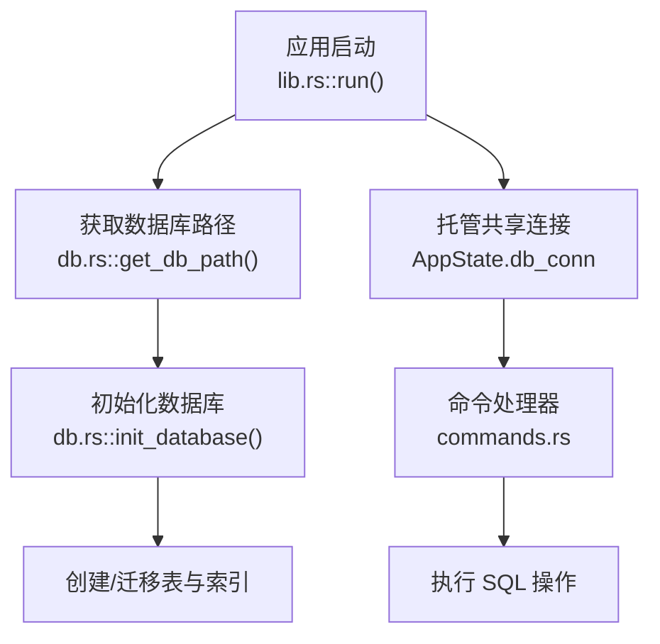
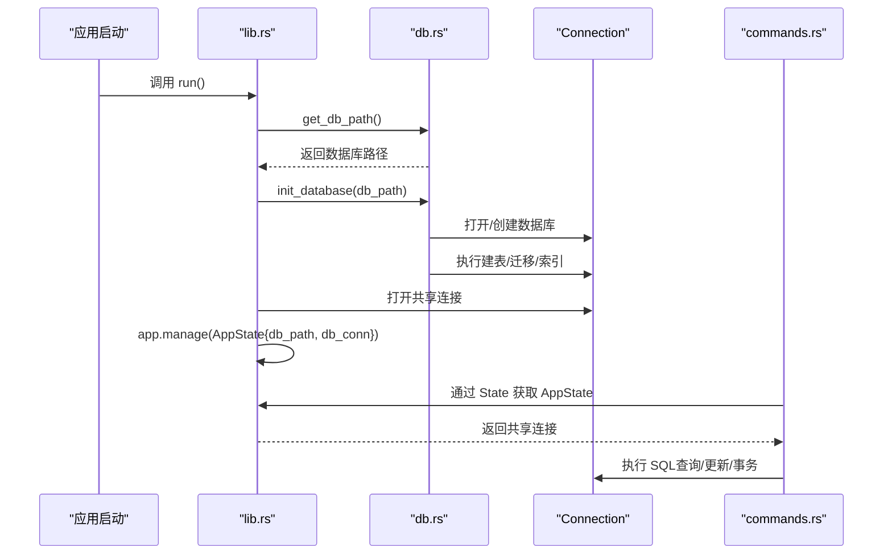
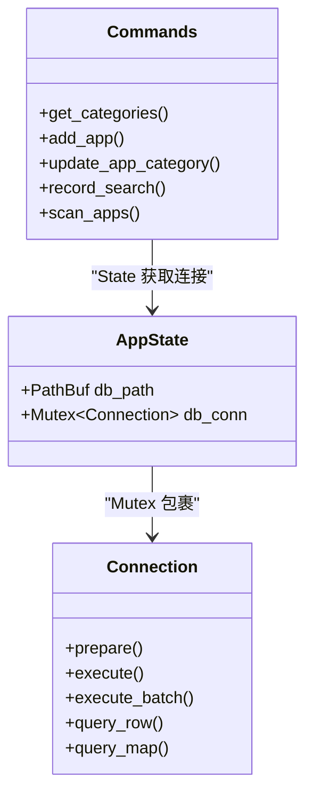
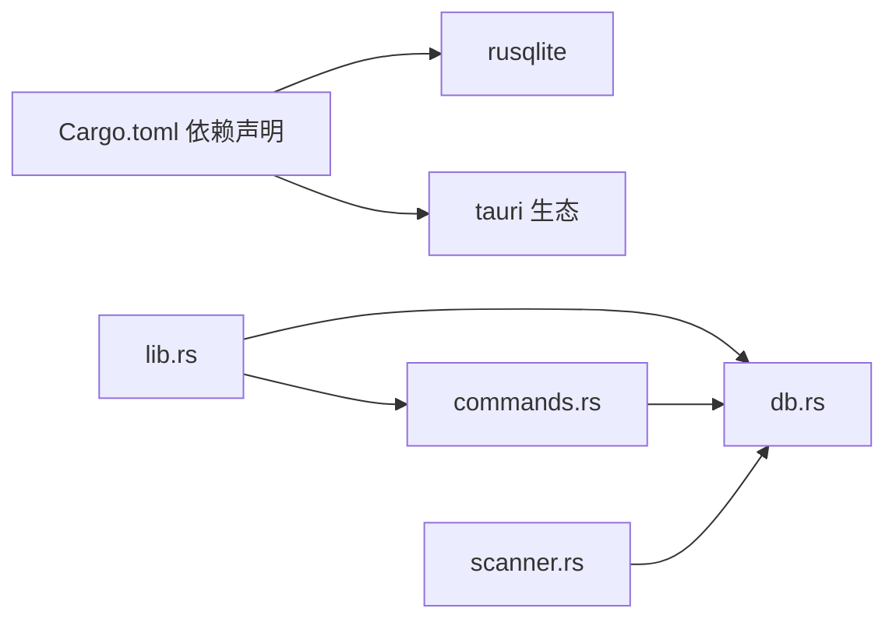

# 数据库设计

<cite>
**本文引用的文件**
- [db.rs](file://src-tauri/src/db.rs)
- [lib.rs](file://src-tauri/src/lib.rs)
- [commands.rs](file://src-tauri/src/commands.rs)
- [Cargo.toml](file://src-tauri/Cargo.toml)
- [scanner.rs](file://src-tauri/src/scanner.rs)
</cite>

## 目录
1. [简介](#简介)
2. [项目结构与数据库相关模块](#项目结构与数据库相关模块)
3. [核心数据模型与表结构](#核心数据模型与表结构)
4. [架构总览](#架构总览)
5. [详细组件分析](#详细组件分析)
6. [依赖关系分析](#依赖关系分析)
7. [性能与优化](#性能与优化)
8. [故障排查指南](#故障排查指南)
9. [结论](#结论)
10. [附录：SQL 查询示例与最佳实践](#附录sql-查询示例与最佳实践)

## 简介
本文件面向 QuickStart 的数据库设计，聚焦于 SQLite 数据库存储层的表结构、字段定义、关系约束与业务模型，并结合应用初始化流程、连接管理、事务与并发控制、查询优化、索引设计、迁移与完整性保障等方面进行系统化说明。目标读者既包括开发者也包括对数据库设计感兴趣的非技术用户。

## 项目结构与数据库相关模块
QuickStart 的数据库层由 Rust 侧 Tauri 插件驱动，采用 rusqlite 作为 SQLite 绑定，数据库文件位于应用数据目录下的 quickstart.db。数据库初始化在应用启动阶段完成，随后通过命令处理器暴露给前端调用。

图表来源
- [lib.rs:44-95](file://src-tauri/src/lib.rs#L44-L95)
- [db.rs:6-133](file://src-tauri/src/db.rs#L6-L133)

章节来源
- [lib.rs:22-95](file://src-tauri/src/lib.rs#L22-L95)
- [db.rs:16-133](file://src-tauri/src/db.rs#L16-L133)

## 核心数据模型与表结构
本节从“应用”“文件夹”“设置”“搜索历史”“聊天记录”等维度梳理表结构、字段语义与约束，并给出字段复杂度与索引策略建议。

- 应用表 apps
  - 字段要点：主键自增 id；名称、路径、图标路径、分类、使用计数、固定标记、创建/更新时间。
  - 约束与默认：分类默认“未分类”，使用计数与固定标记默认 0，时间默认当前时间。
  - 关系：与分类表 categories 通过分类名建立弱引用一致性（同步写入 categories）。
  - 复杂度：查询排序通常按固定优先、使用次数降序、名称升序，适合复合索引优化。
  - 建议索引：对分类名、使用计数、固定标记建立组合索引以提升排序与筛选效率。

- 分类表 categories
  - 字段要点：主键自增 id；唯一名称、排序序号、创建时间。
  - 约束与默认：名称唯一，排序序号默认 0，时间默认当前时间。
  - 复杂度：插入/读取均为 O(log N)（唯一索引），排序按序号与名称。
  - 建议索引：名称唯一索引已满足需求；若频繁按序号范围查询，可考虑序号索引。

- 文件夹表 folders
  - 字段要点：主键自增 id；名称、路径、分类、排序序号、创建时间。
  - 约束与默认：分类默认“未分类”，排序默认 0，时间默认当前时间。
  - 关系：与文件夹分类表 folder_categories 通过分类名建立弱引用一致性。
  - 复杂度：排序按序号与名称，适合组合索引优化。

- 文件夹分类表 folder_categories
  - 字段要点：主键自增 id；唯一名称、排序序号、创建时间。
  - 约束与默认：名称唯一，排序序号默认 0，时间默认当前时间。
  - 复杂度：与 categories 类似，插入/读取 O(log N)。

- 设置表 settings
  - 字段要点：主键键 key；文本值 value。
  - 约束与默认：key 唯一，value 文本存储。
  - 复杂度：单键查询 O(1)；适合高频读写场景。
  - 建议索引：主键索引已足够；若存在大量键值对，可考虑分页或批量读取策略。

- 搜索历史表 search_history
  - 字段要点：主键自增 id；查询词 query；时间戳 searched_at。
  - 约束与默认：查询词非空，时间默认本地当前时间。
  - 复杂度：插入 O(1)，去重与限制条目数量需要维护成本。
  - 建议索引：对查询词建立索引以加速去重与检索；对时间戳建立索引以支持按时间排序与清理。

- 聊天历史表 chat_history
  - 字段要点：主键自增 id；角色 role、内容 content、模型 model、创建时间 created_at。
  - 约束与默认：角色与内容非空，时间默认当前时间。
  - 复杂度：插入 O(1)，查询按时间倒序，适合时间索引。
  - 建议索引：对创建时间建立索引；若按模型过滤，可考虑模型索引。

章节来源
- [db.rs:40-130](file://src-tauri/src/db.rs#L40-L130)

## 架构总览
数据库层围绕“初始化—连接—命令—事务—索引”的主线展开，整体架构如下：

图表来源
- [lib.rs:44-95](file://src-tauri/src/lib.rs#L44-L95)
- [db.rs:16-133](file://src-tauri/src/db.rs#L16-L133)
- [commands.rs:32-48](file://src-tauri/src/commands.rs#L32-L48)

## 详细组件分析

### 数据库初始化与迁移
- 初始化流程
  - 获取应用数据目录下的 quickstart.db 路径并确保目录存在。
  - 打开连接后执行建表/索引创建与默认设置插入。
- 迁移策略
  - 对旧版 folders 表检测是否存在 category 列，若不存在则通过 ALTER TABLE 添加列，并创建 folder_categories 表。
  - 将现有 apps/folders 中的分类导入 categories/folder_categories，避免数据不一致。
- 默认设置
  - 初始化时插入一组默认键值对，涵盖热键、开机自启、主题、自动分类、AI Provider 等。

章节来源
- [db.rs:6-133](file://src-tauri/src/db.rs#L6-L133)

### 连接管理与并发控制
- 连接托管
  - 应用启动时创建共享连接并托管在 AppState 中，供所有命令使用。
- 并发控制
  - 使用 Mutex 包裹 Connection，确保同一进程内串行访问数据库，避免并发写冲突。
  - 对于耗时操作（如扫描），命令内部使用异步线程池创建独立连接执行，避免阻塞 UI。

图表来源
- [lib.rs:14-17](file://src-tauri/src/lib.rs#L14-L17)
- [lib.rs:56-59](file://src-tauri/src/lib.rs#L56-L59)
- [commands.rs:32-48](file://src-tauri/src/commands.rs#L32-L48)

章节来源
- [lib.rs:14-17](file://src-tauri/src/lib.rs#L14-L17)
- [lib.rs:52-59](file://src-tauri/src/lib.rs#L52-L59)
- [commands.rs:231-249](file://src-tauri/src/commands.rs#L231-L249)

### 事务处理与一致性
- 事务边界
  - 在更新应用分类与更新文件夹分类时，显式开启 BEGIN/COMMIT，确保插入分类与更新实体在同一事务中，避免竞态导致的排序序号异常。
- 回滚策略
  - 任一步骤失败时执行 ROLLBACK，保证数据一致性。

章节来源
- [commands.rs:170-194](file://src-tauri/src/commands.rs#L170-L194)
- [commands.rs:684-708](file://src-tauri/src/commands.rs#L684-L708)

### 查询与业务逻辑
- 应用列表与排序
  - 按固定优先、使用次数降序、名称升序排序，适合在查询层配合索引优化。
- 分类管理
  - 新增分类时检查唯一性并分配排序序号；更新分类时通过事务保证一致性。
- 搜索历史
  - 插入时去重（相同查询词仅一次插入），并限制历史条目数量（保留最近 N 条）。
- 设置读写
  - 使用 INSERT OR IGNORE + ON CONFLICT UPDATE 实现幂等写入。

章节来源
- [commands.rs:31-48](file://src-tauri/src/commands.rs#L31-L48)
- [commands.rs:51-89](file://src-tauri/src/commands.rs#L51-L89)
- [commands.rs:153-194](file://src-tauri/src/commands.rs#L153-L194)
- [commands.rs:565-582](file://src-tauri/src/commands.rs#L565-L582)
- [commands.rs:398-415](file://src-tauri/src/commands.rs#L398-L415)

### 数据完整性与约束
- 主键与唯一性
  - apps、categories、folders、folder_categories、settings、chat_history 均有主键；settings 的 key 唯一；categories 与 folder_categories 的 name 唯一。
- 默认值与时间戳
  - 多数表对时间字段设置默认值，确保记录创建/更新时间可追踪。
- 外部一致性
  - 通过 INSERT OR IGNORE 同步分类，避免分类缺失导致的查询异常。

章节来源
- [db.rs:54-130](file://src-tauri/src/db.rs#L54-L130)

## 依赖关系分析
- 外部依赖
  - rusqlite：SQLite 绑定，提供 Connection、Statement、事务与批量执行能力。
  - tauri：插件生态（全局快捷键、对话框、进程、自动启动等）与应用生命周期管理。
- 内部模块耦合
  - db.rs 与 lib.rs 强耦合（初始化与连接托管），commands.rs 通过 State 间接依赖 db.rs。
  - scanner.rs 与 db.rs 交互（扫描结果写入数据库），但命令层通过异步线程池隔离连接。

图表来源
- [Cargo.toml:15-36](file://src-tauri/Cargo.toml#L15-L36)
- [lib.rs:22-95](file://src-tauri/src/lib.rs#L22-L95)
- [commands.rs:1-10](file://src-tauri/src/commands.rs#L1-L10)
- [scanner.rs:1-200](file://src-tauri/src/scanner.rs#L1-L200)

章节来源
- [Cargo.toml:15-36](file://src-tauri/Cargo.toml#L15-L36)
- [lib.rs:22-95](file://src-tauri/src/lib.rs#L22-L95)

## 性能与优化
- 查询优化策略
  - 对高频查询字段建立索引：apps 的分类、use_count、is_pinned；search_history 的 query、searched_at；chat_history 的 created_at。
  - 使用 LIMIT 控制返回结果集大小（如搜索历史取最近 N 条）。
  - 使用 GROUP BY + MAX 时间戳实现“去重+按最新时间排序”的高效查询。
- 索引设计原则
  - 唯一索引：settings.key、categories.name、folder_categories.name。
  - 组合索引：apps 上按 is_pinned、use_count、name 的组合索引；folders 上按 sort_order、name 的组合索引。
- 并发与连接
  - 使用 Mutex 串行化写操作，避免竞争；对长耗时任务使用异步线程池创建独立连接。
- 数据迁移与维护
  - 迁移时使用 PRAGMA table_info 检测列存在性，避免重复迁移。
  - 定期清理历史表（如 search_history）以控制增长。

章节来源
- [db.rs:40-49](file://src-tauri/src/db.rs#L40-L49)
- [commands.rs:565-597](file://src-tauri/src/commands.rs#L565-L597)
- [commands.rs:231-249](file://src-tauri/src/commands.rs#L231-L249)

## 故障排查指南
- 初始化失败
  - 检查应用数据目录权限与路径生成逻辑；确认数据库文件可创建。
- 连接异常
  - 确认 AppState 中的连接未被意外关闭；避免跨线程传递 Connection。
- 并发写冲突
  - 确保所有写操作通过 Mutex 包裹的共享连接执行；长耗时操作使用独立连接。
- 事务回滚
  - 若分类更新失败，检查 BEGIN/COMMIT 是否正确包裹；确认 ROLLBACK 是否在错误分支执行。
- 索引失效
  - 检查查询是否命中预期索引；必要时重建索引或调整查询条件。

章节来源
- [lib.rs:52-59](file://src-tauri/src/lib.rs#L52-L59)
- [commands.rs:170-194](file://src-tauri/src/commands.rs#L170-L194)
- [commands.rs:684-708](file://src-tauri/src/commands.rs#L684-L708)

## 结论
QuickStart 的数据库设计以简洁实用为核心：通过少量核心表承载应用、文件夹、设置、搜索历史与聊天记录等主要业务数据；借助初始化迁移与分类同步机制保证数据一致性；通过连接托管与事务封装实现并发安全与业务原子性；配合索引与查询优化策略满足日常使用性能需求。未来可在以下方面持续演进：引入更细粒度的索引覆盖、定期维护统计信息、扩展备份与增量迁移方案。

## 附录：SQL 查询示例与最佳实践
- 常用查询模式
  - 获取应用列表（按固定优先、使用次数降序、名称升序）
  - 获取分类列表（按排序序号与名称）
  - 搜索历史（去重+按最新时间排序，限制条数）
  - 设置读写（幂等写入）
- 最佳实践
  - 对高频字段建立索引，避免全表扫描。
  - 使用事务包裹多步写操作，确保一致性。
  - 对长耗时操作使用独立连接，避免阻塞 UI。
  - 定期清理历史表，控制数据规模。

章节来源
- [commands.rs:31-48](file://src-tauri/src/commands.rs#L31-L48)
- [commands.rs:51-89](file://src-tauri/src/commands.rs#L51-L89)
- [commands.rs:565-597](file://src-tauri/src/commands.rs#L565-L597)
- [commands.rs:398-415](file://src-tauri/src/commands.rs#L398-L415)