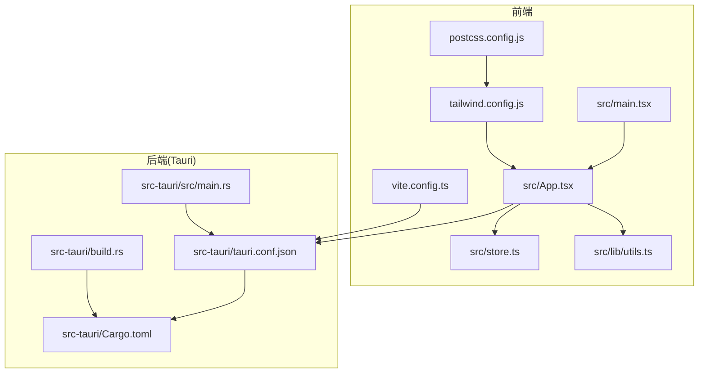
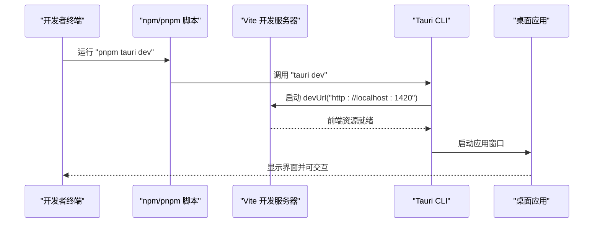
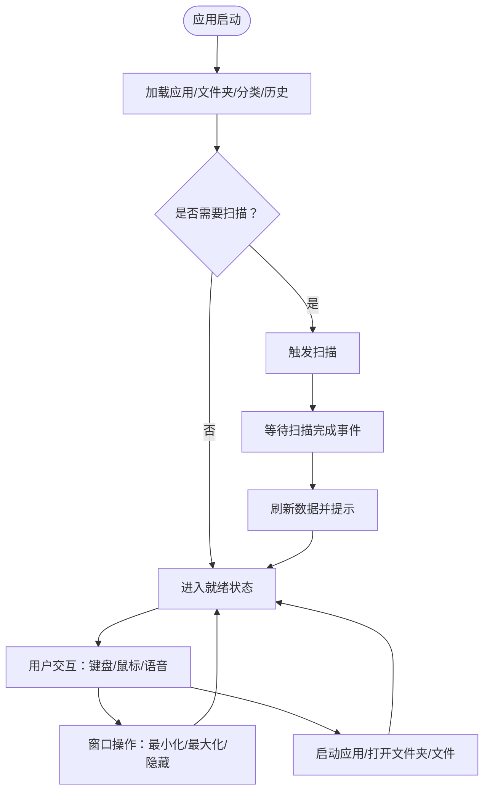
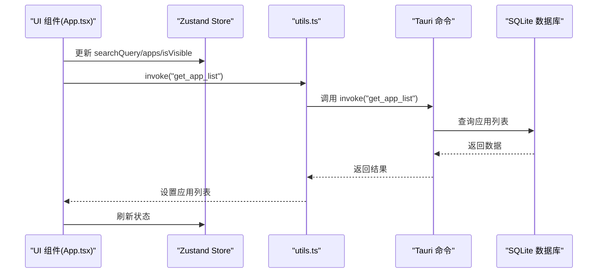
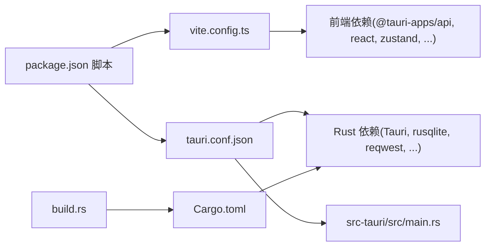

# 快速开始

<cite>
**本文引用的文件**
- [README.md](file://README.md)
- [package.json](file://package.json)
- [vite.config.ts](file://vite.config.ts)
- [src-tauri/tauri.conf.json](file://src-tauri/tauri.conf.json)
- [src-tauri/Cargo.toml](file://src-tauri/Cargo.toml)
- [src-tauri/build.rs](file://src-tauri/build.rs)
- [src-tauri/src/main.rs](file://src-tauri/src/main.rs)
- [src/main.tsx](file://src/main.tsx)
- [src/App.tsx](file://src/App.tsx)
- [src/store.ts](file://src/store.ts)
- [src/lib/utils.ts](file://src/lib/utils.ts)
- [tailwind.config.js](file://tailwind.config.js)
- [postcss.config.js](file://postcss.config.js)
</cite>

## 目录
1. [简介](#简介)
2. [项目结构](#项目结构)
3. [核心组件](#核心组件)
4. [架构总览](#架构总览)
5. [详细组件分析](#详细组件分析)
6. [依赖关系分析](#依赖关系分析)
7. [性能考虑](#性能考虑)
8. [故障排除指南](#故障排除指南)
9. [结论](#结论)
10. [附录](#附录)

## 简介
QuickStart 是一款基于 Tauri v2 + React + TypeScript 的轻量级 Windows 桌面快捷启动器。它提供混合搜索与应用面板、应用扫描与管理、AI 自动分类、AI 聊天、语音输入、文件夹管理、主题切换等功能。本文档面向新开发者，帮助你在最短时间内完成环境准备、依赖安装、开发运行与构建打包。

## 项目结构
项目采用“前端 React/Vite + Rust/Tauri 后端”的双端架构，前端通过 @tauri-apps/api 与后端命令交互，后端通过 SQLite 存储应用、分类、文件夹、设置与聊天记录等数据。

图表来源
- [src/main.tsx:1-11](file://src/main.tsx#L1-L11)
- [src/App.tsx:1-800](file://src/App.tsx#L1-L800)
- [src/store.ts:1-46](file://src/store.ts#L1-L46)
- [src/lib/utils.ts:1-25](file://src/lib/utils.ts#L1-L25)
- [vite.config.ts:1-32](file://vite.config.ts#L1-L32)
- [tailwind.config.js:1-54](file://tailwind.config.js#L1-L54)
- [postcss.config.js:1-7](file://postcss.config.js#L1-L7)
- [src-tauri/src/main.rs:1-7](file://src-tauri/src/main.rs#L1-L7)
- [src-tauri/tauri.conf.json:1-54](file://src-tauri/tauri.conf.json#L1-L54)
- [src-tauri/Cargo.toml:1-36](file://src-tauri/Cargo.toml#L1-L36)
- [src-tauri/build.rs:1-4](file://src-tauri/build.rs#L1-L4)

章节来源
- [README.md:22-42](file://README.md#L22-L42)
- [package.json:6-12](file://package.json#L6-L12)
- [vite.config.ts:1-32](file://vite.config.ts#L1-L32)
- [src-tauri/tauri.conf.json:6-11](file://src-tauri/tauri.conf.json#L6-L11)

## 核心组件
- 前端入口与渲染
  - React 根节点挂载于 index.html 的 #root，创建严格模式下的根实例并渲染 App。
- 应用主界面
  - App 组件负责窗口控制、搜索与分类、应用/文件夹/文件结果展示、拖拽分类、语音输入、计算器、AI 聊天与设置面板等。
- 状态管理
  - 使用 Zustand 管理搜索词、应用列表、窗口可见性、语音输入状态等。
- 通用调用封装
  - utils.ts 中的 invoke 封装统一调用 @tauri-apps/api/core 的 invoke，并提供数据库路径查询。
- 构建与打包
  - package.json 定义了开发、构建、预览与 Tauri 相关脚本；Vite 配置指定端口与热更新；Tauri 配置定义开发/构建前置命令与产物路径。

章节来源
- [src/main.tsx:1-11](file://src/main.tsx#L1-L11)
- [src/App.tsx:274-800](file://src/App.tsx#L274-L800)
- [src/store.ts:1-46](file://src/store.ts#L1-L46)
- [src/lib/utils.ts:8-25](file://src/lib/utils.ts#L8-L25)
- [package.json:6-12](file://package.json#L6-L12)
- [vite.config.ts:14-31](file://vite.config.ts#L14-L31)
- [src-tauri/tauri.conf.json:6-11](file://src-tauri/tauri.conf.json#L6-L11)

## 架构总览
前端通过 Vite 开发服务器提供资源，Tauri 在 dev 模式下以 devUrl 指向本地前端服务；生产构建时先编译前端，再由 Tauri 打包为可执行程序与安装包。

图表来源
- [package.json:11-12](file://package.json#L11-L12)
- [src-tauri/tauri.conf.json:7-10](file://src-tauri/tauri.conf.json#L7-L10)
- [vite.config.ts:15-20](file://vite.config.ts#L15-L20)

## 详细组件分析

### 前端应用生命周期与窗口控制
- 初始化：启动时加载应用列表、文件夹、分类与搜索历史；根据时间阈值决定是否触发扫描。
- 事件监听：订阅扫描完成事件，完成后刷新数据并提示新增数量。
- 窗口控制：最小化、最大化/还原、隐藏窗口；支持透明无边框窗口与焦点管理。
- 交互逻辑：键盘导航、点击/右键菜单、拖拽分类、语音输入、计算器、文件搜索与结果展示。

图表来源
- [src/App.tsx:374-409](file://src/App.tsx#L374-L409)
- [src/App.tsx:548-656](file://src/App.tsx#L548-L656)

章节来源
- [src/App.tsx:314-409](file://src/App.tsx#L314-L409)
- [src/App.tsx:548-656](file://src/App.tsx#L548-L656)

### 状态管理与数据流
- Zustand Store：集中管理搜索词、应用列表、窗口可见性、语音输入状态。
- 数据来源：通过 utils.ts 的 invoke 调用后端命令，如获取应用列表、扫描应用、更新分类、记录搜索历史等。
- 状态联动：搜索词变化影响文件搜索结果与应用/文件夹过滤；分类变化触发后端持久化与前端刷新。

图表来源
- [src/store.ts:1-46](file://src/store.ts#L1-L46)
- [src/lib/utils.ts:11-17](file://src/lib/utils.ts#L11-L17)
- [src/App.tsx:314-353](file://src/App.tsx#L314-L353)

章节来源
- [src/store.ts:1-46](file://src/store.ts#L1-L46)
- [src/lib/utils.ts:1-25](file://src/lib/utils.ts#L1-L25)
- [src/App.tsx:314-409](file://src/App.tsx#L314-L409)

### 开发服务器启动与热更新
- Vite 服务：监听端口 1420，开启 HMR；支持跨主机热更（通过环境变量）。
- Tauri dev：启动 Tauri 开发模式，自动访问 devUrl。
- 禁止监听 src-tauri 目录变更，避免不必要的重建。

章节来源
- [vite.config.ts:15-31](file://vite.config.ts#L15-L31)
- [src-tauri/tauri.conf.json:7-10](file://src-tauri/tauri.conf.json#L7-L10)

### 构建与打包流程
- 前端构建：TypeScript 编译 + Vite 打包，输出 dist 目录。
- Tauri 构建：读取 tauri.conf.json 的 beforeBuildCommand 与 frontendDist，生成可执行文件与安装包。
- 产物位置：可执行文件位于 src-tauri/target/release/quickstart.exe；MSI/NSIS 安装包位于 target/release/bundle 下对应目录。

章节来源
- [package.json:8-12](file://package.json#L8-L12)
- [src-tauri/tauri.conf.json:9-11](file://src-tauri/tauri.conf.json#L9-L11)
- [README.md:66-72](file://README.md#L66-L72)

## 依赖关系分析
- 前端依赖
  - React 19、Tailwind CSS、shadcn/ui、@tauri-apps/api、Zustand、Fuse.js 等。
  - 开发依赖包括 Vite、TypeScript、@vitejs/plugin-react、TailwindCSS、PostCSS 等。
- 后端依赖
  - Tauri v2、tauri-plugin-*、rusqlite、serde、reqwest、tokio、window-vibrancy、open、lnk、windows 等。
- 构建链路
  - build.rs 调用 tauri_build，Cargo.toml 指定依赖与特性；tauri.conf.json 配置开发/构建前置命令与窗口属性。

图表来源
- [package.json:6-43](file://package.json#L6-L43)
- [vite.config.ts:1-32](file://vite.config.ts#L1-L32)
- [src-tauri/tauri.conf.json:1-54](file://src-tauri/tauri.conf.json#L1-L54)
- [src-tauri/Cargo.toml:1-36](file://src-tauri/Cargo.toml#L1-L36)
- [src-tauri/build.rs:1-4](file://src-tauri/build.rs#L1-L4)
- [src-tauri/src/main.rs:1-7](file://src-tauri/src/main.rs#L1-L7)

章节来源
- [package.json:14-43](file://package.json#L14-L43)
- [src-tauri/Cargo.toml:15-36](file://src-tauri/Cargo.toml#L15-L36)
- [src-tauri/tauri.conf.json:1-54](file://src-tauri/tauri.conf.json#L1-L54)

## 性能考虑
- 图标加载策略：对可见应用串行加载图标，失败使用标记避免重复尝试，减少 UI 卡顿。
- 搜索优化：分词匹配与缩写映射结合，降低误判；文件搜索延迟触发，避免高频请求。
- 窗口与渲染：透明无边框窗口配合模糊背景，视觉体验与性能平衡；网格布局自动滚动至选中项，提升交互效率。
- 构建优化：Vite 清屏关闭、忽略 src-tauri 目录监听，缩短热更新时间。

章节来源
- [src/App.tsx:666-696](file://src/App.tsx#L666-L696)
- [src/App.tsx:412-424](file://src/App.tsx#L412-L424)
- [vite.config.ts:14-29](file://vite.config.ts#L14-L29)

## 故障排除指南
- 端口冲突
  - 现象：pnpm tauri dev 启动失败或页面空白。
  - 排查：确认本地 1420 端口未被占用；若被占用，停止占用进程或调整 Vite 端口。
  - 参考：Vite 配置中端口与严格端口设置。
- 热更新异常
  - 现象：修改前端代码后页面未刷新。
  - 排查：检查 host 环境变量与 HMR 配置；确认未监听 src-tauri 目录导致重建。
- Tauri 开发命令无效
  - 现象：执行 pnpm tauri dev 无响应。
  - 排查：确认已安装 @tauri-apps/cli；检查 tauri.conf.json 的 beforeDevCommand 与 devUrl。
- 构建失败
  - 现象：pnpm tauri build 报错。
  - 排查：先执行 pnpm build 确认前端构建通过；检查 Cargo.toml 依赖与 build.rs；查看目标产物目录是否存在。
- 权限与平台
  - 现象：Windows 平台运行异常或权限不足。
  - 排查：确保已安装 Windows SDK 与相关特性；检查 Tauri 插件与 windows crate 的特性开关。

章节来源
- [vite.config.ts:5-31](file://vite.config.ts#L5-L31)
- [src-tauri/tauri.conf.json:7-10](file://src-tauri/tauri.conf.json#L7-L10)
- [package.json:34-34](file://package.json#L34-L34)
- [src-tauri/Cargo.toml:15-36](file://src-tauri/Cargo.toml#L15-L36)
- [src-tauri/build.rs:1-4](file://src-tauri/build.rs#L1-L4)

## 结论
通过本指南，你可以快速完成环境准备、依赖安装与开发运行。建议先以开发模式启动，验证功能后再进行生产构建与打包。遇到问题时，优先检查端口占用、热更新配置与构建前置命令，逐步定位并解决。

## 附录

### 环境要求与安装步骤
- 环境要求
  - Node.js 20+、pnpm 10+、Rust stable、Windows 平台（Tauri v2）。
- 安装步骤
  - 安装依赖：pnpm install
  - 开发运行：pnpm tauri dev
  - 生产构建：pnpm tauri build
  - 预览构建：pnpm preview（需先构建）

章节来源
- [README.md:37-42](file://README.md#L37-L42)
- [package.json:6-12](file://package.json#L6-L12)

### 开发服务器启动、构建与打包命令
- 开发：pnpm tauri dev
- 构建：pnpm tauri build
- 预览：pnpm preview
- 前端构建：tsc && vite build

章节来源
- [package.json:7-12](file://package.json#L7-L12)

### 首次运行流程
- 启动开发服务器：pnpm tauri dev
- 访问应用：默认窗口透明无边框，可通过全局热键呼出
- 首次启动会加载应用列表与分类，必要时触发扫描

章节来源
- [src-tauri/tauri.conf.json:7-10](file://src-tauri/tauri.conf.json#L7-L10)
- [src/App.tsx:374-391](file://src/App.tsx#L374-L391)