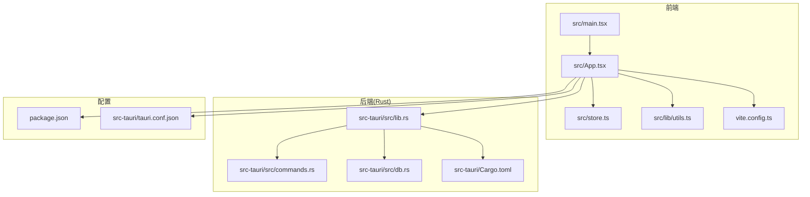
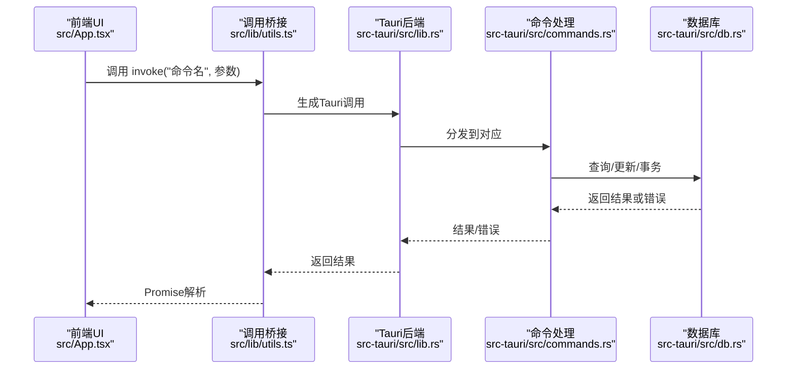
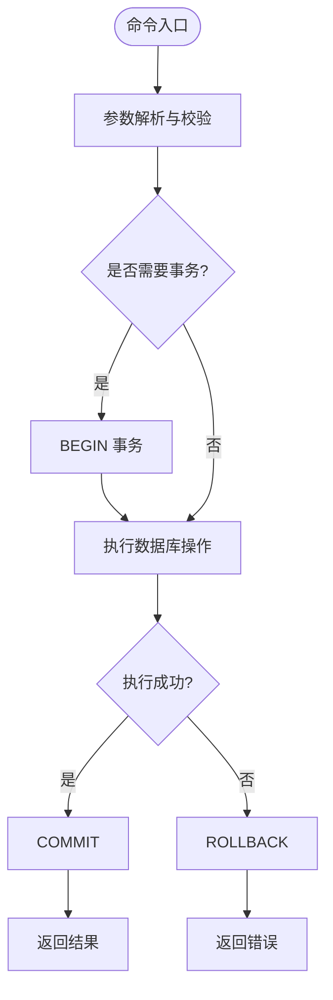
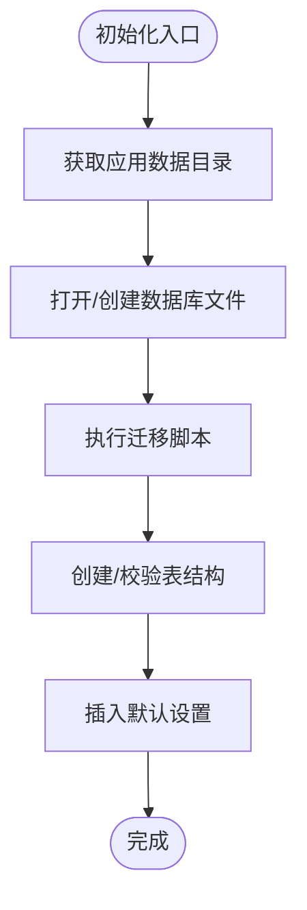
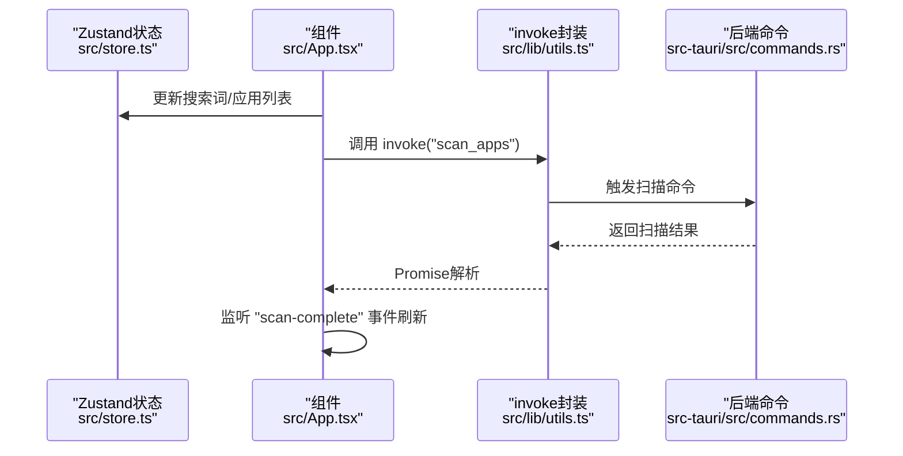
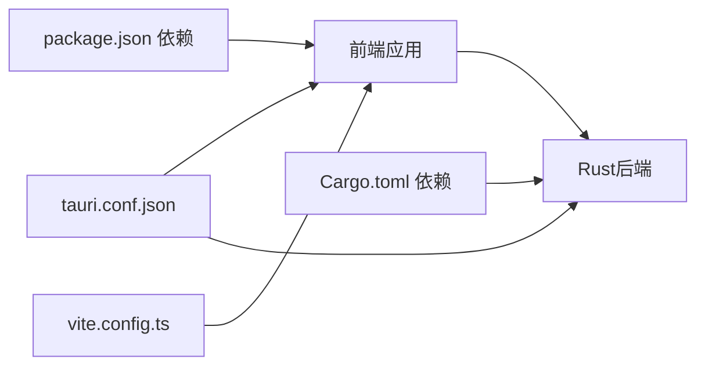

# 故障排除与常见问题

<cite>
**本文引用的文件**
- [package.json](file://package.json)
- [vite.config.ts](file://vite.config.ts)
- [src-tauri/Cargo.toml](file://src-tauri/Cargo.toml)
- [src-tauri/tauri.conf.json](file://src-tauri/tauri.conf.json)
- [src/main.tsx](file://src/main.tsx)
- [src/App.tsx](file://src/App.tsx)
- [src/store.ts](file://src/store.ts)
- [src/lib/utils.ts](file://src/lib/utils.ts)
- [src-tauri/src/lib.rs](file://src-tauri/src/lib.rs)
- [src-tauri/src/commands.rs](file://src-tauri/src/commands.rs)
- [src-tauri/src/db.rs](file://src-tauri/src/db.rs)
- [AGENTS.md](file://AGENTS.md)
- [README.md](file://README.md)
</cite>

## 目录
1. [简介](#简介)
2. [项目结构](#项目结构)
3. [核心组件](#核心组件)
4. [架构总览](#架构总览)
5. [详细组件分析](#详细组件分析)
6. [依赖关系分析](#依赖关系分析)
7. [性能注意事项](#性能注意事项)
8. [故障排除指南](#故障排除指南)
9. [结论](#结论)
10. [附录](#附录)

## 简介
本指南面向QuickStart用户与开发者，聚焦于安装、运行、功能与性能方面的常见问题与排障流程。内容涵盖：
- 安装与环境准备
- 开发与构建问题
- 运行时异常与日志分析
- 功能使用问题（搜索、扫描、图标、AI、语音等）
- 性能诊断与优化建议
- 调试技巧、工具推荐与问题报告模板

## 项目结构
QuickStart采用Tauri v2 + React + TypeScript的桌面应用架构，前端通过Vite开发，后端使用Rust与SQLite存储，配合Tauri插件实现系统集成能力。

**图表来源**
- [src/main.tsx:1-11](file://src/main.tsx#L1-L11)
- [src/App.tsx:1-800](file://src/App.tsx#L1-L800)
- [src/store.ts:1-46](file://src/store.ts#L1-L46)
- [src/lib/utils.ts:1-25](file://src/lib/utils.ts#L1-L25)
- [vite.config.ts:1-32](file://vite.config.ts#L1-L32)
- [src-tauri/src/lib.rs:1-135](file://src-tauri/src/lib.rs#L1-L135)
- [src-tauri/src/commands.rs:1-709](file://src-tauri/src/commands.rs#L1-L709)
- [src-tauri/src/db.rs:1-156](file://src-tauri/src/db.rs#L1-L156)
- [package.json:1-50](file://package.json#L1-L50)
- [src-tauri/tauri.conf.json:1-54](file://src-tauri/tauri.conf.json#L1-L54)
- [src-tauri/Cargo.toml:1-36](file://src-tauri/Cargo.toml#L1-L36)

**章节来源**
- [src/main.tsx:1-11](file://src/main.tsx#L1-L11)
- [vite.config.ts:1-32](file://vite.config.ts#L1-L32)
- [src-tauri/tauri.conf.json:1-54](file://src-tauri/tauri.conf.json#L1-L54)
- [package.json:1-50](file://package.json#L1-L50)
- [src-tauri/Cargo.toml:1-36](file://src-tauri/Cargo.toml#L1-L36)

## 核心组件
- 前端入口与渲染：React根节点挂载与Strict模式渲染。
- 应用主界面：混合搜索与应用面板、文件夹管理、语音输入、计算器、AI聊天等。
- 状态管理：Zustand轻量状态容器。
- 通信桥接：统一invoke封装调用Tauri命令。
- 后端服务：Tauri Builder注册插件、全局热键、托盘、窗口控制；命令处理与数据库交互。
- 数据库：SQLite（rusqlite），迁移与索引优化。

**章节来源**
- [src/main.tsx:1-11](file://src/main.tsx#L1-L11)
- [src/App.tsx:1-800](file://src/App.tsx#L1-L800)
- [src/store.ts:1-46](file://src/store.ts#L1-L46)
- [src/lib/utils.ts:1-25](file://src/lib/utils.ts#L1-L25)
- [src-tauri/src/lib.rs:1-135](file://src-tauri/src/lib.rs#L1-L135)
- [src-tauri/src/commands.rs:1-709](file://src-tauri/src/commands.rs#L1-L709)
- [src-tauri/src/db.rs:1-156](file://src-tauri/src/db.rs#L1-L156)

## 架构总览
前端通过Tauri API与后端命令交互，后端通过SQLite持久化数据，并借助系统能力（托盘、全局热键、窗口特效）提升用户体验。

**图表来源**
- [src/App.tsx:1-800](file://src/App.tsx#L1-L800)
- [src/lib/utils.ts:1-25](file://src/lib/utils.ts#L1-L25)
- [src-tauri/src/lib.rs:1-135](file://src-tauri/src/lib.rs#L1-L135)
- [src-tauri/src/commands.rs:1-709](file://src-tauri/src/commands.rs#L1-L709)
- [src-tauri/src/db.rs:1-156](file://src-tauri/src/db.rs#L1-L156)

## 详细组件分析

### 组件A：命令与数据库交互（命令层）
- 关键职责：提供应用管理、文件夹管理、图标提取、搜索历史、设置、扫描、启动、AI相关等命令。
- 错误处理：多数命令返回Result类型，前端捕获并提示。
- 并发与事务：部分命令使用事务保证一致性（如更新应用分类、文件夹分类）。
- 异步任务：扫描与图标提取通过spawn_blocking在后台线程执行，避免阻塞主线程。

**图表来源**
- [src-tauri/src/commands.rs:150-194](file://src-tauri/src/commands.rs#L150-L194)
- [src-tauri/src/commands.rs:668-708](file://src-tauri/src/commands.rs#L668-L708)

**章节来源**
- [src-tauri/src/commands.rs:1-709](file://src-tauri/src/commands.rs#L1-L709)

### 组件B：数据库初始化与迁移
- 初始化：首次运行创建数据库文件，建立apps、categories、folders、folder_categories、settings、search_history、chat_history等表。
- 迁移：对既有表进行列扩展与索引创建，保证兼容性。
- 默认设置：插入默认配置项（热键、自动启动、主题、自动分类、AI Provider等）。

**图表来源**
- [src-tauri/src/db.rs:16-133](file://src-tauri/src/db.rs#L16-L133)

**章节来源**
- [src-tauri/src/db.rs:1-156](file://src-tauri/src/db.rs#L1-L156)

### 组件C：前端状态与调用桥接
- 状态：Zustand集中管理搜索词、应用列表、窗口可见性、语音状态等。
- 调用：统一invoke封装，避免重复导入，便于替换与测试。
- 事件：监听扫描完成事件，刷新UI与提示。

**图表来源**
- [src/store.ts:1-46](file://src/store.ts#L1-L46)
- [src/App.tsx:314-409](file://src/App.tsx#L314-L409)
- [src/lib/utils.ts:1-25](file://src/lib/utils.ts#L1-L25)
- [src-tauri/src/commands.rs:230-249](file://src-tauri/src/commands.rs#L230-L249)

**章节来源**
- [src/store.ts:1-46](file://src/store.ts#L1-L46)
- [src/App.tsx:1-800](file://src/App.tsx#L1-L800)
- [src/lib/utils.ts:1-25](file://src/lib/utils.ts#L1-L25)

## 依赖关系分析
- 前端依赖：React、Tailwind、Zustand、@tauri-apps/api及若干插件。
- 后端依赖：Tauri核心、rusqlite、reqwest、tokio、window-vibrancy、open、lnk等。
- 构建与打包：Vite、Tauri CLI、Windows安装器（NSIS/MSI）。

**图表来源**
- [package.json:14-42](file://package.json#L14-L42)
- [vite.config.ts:1-32](file://vite.config.ts#L1-L32)
- [src-tauri/Cargo.toml:15-36](file://src-tauri/Cargo.toml#L15-L36)
- [src-tauri/tauri.conf.json:6-11](file://src-tauri/tauri.conf.json#L6-L11)

**章节来源**
- [package.json:1-50](file://package.json#L1-L50)
- [src-tauri/Cargo.toml:1-36](file://src-tauri/Cargo.toml#L1-L36)
- [src-tauri/tauri.conf.json:1-54](file://src-tauri/tauri.conf.json#L1-L54)
- [vite.config.ts:1-32](file://vite.config.ts#L1-L32)

## 性能注意事项
- 图标加载：前端对可见应用串行加载图标，避免并发导致卡顿；后端对图标提取失败写入失败标记，减少重复尝试。
- 扫描与事件：扫描在后台线程执行，完成后通过事件刷新UI，避免阻塞。
- 数据库：建立必要索引（搜索历史表），限制搜索历史条目数量，降低查询成本。
- 窗口特效：根据系统版本选择Mica或Acrylic，避免无效调用带来的开销。

**章节来源**
- [src/App.tsx:666-696](file://src/App.tsx#L666-L696)
- [src-tauri/src/commands.rs:325-373](file://src-tauri/src/commands.rs#L325-L373)
- [src-tauri/src/db.rs:40-49](file://src-tauri/src/db.rs#L40-L49)
- [src-tauri/src/lib.rs:80-92](file://src-tauri/src/lib.rs#L80-L92)

## 故障排除指南

### 一、安装与环境问题
- 环境要求不符
  - 症状：构建失败、依赖安装报错。
  - 排查：确认Node.js版本、Rust稳定版、pnpm版本满足要求。
  - 参考：[README.md:35-42](file://README.md#L35-L42)、[package.json:33-42](file://package.json#L33-L42)、[src-tauri/Cargo.toml:1-10](file://src-tauri/Cargo.toml#L1-L10)
- 安装包无法运行
  - 症状：安装后启动黑屏或无响应。
  - 排查：查看系统日志、确认Windows版本兼容性；尝试不同安装包格式（NSIS/MSI）。
  - 参考：[README.md:24-33](file://README.md#L24-L33)、[src-tauri/tauri.conf.json:20-25](file://src-tauri/tauri.conf.json#L20-L25)

**章节来源**
- [README.md:24-42](file://README.md#L24-L42)
- [package.json:33-42](file://package.json#L33-L42)
- [src-tauri/Cargo.toml:1-10](file://src-tauri/Cargo.toml#L1-L10)
- [src-tauri/tauri.conf.json:20-25](file://src-tauri/tauri.conf.json#L20-L25)

### 二、开发与构建问题
- 开发服务器端口冲突
  - 症状：dev启动失败或HMR不可用。
  - 排查：检查Vite端口配置与宿主环境变量，确认端口占用。
  - 参考：[vite.config.ts:15-26](file://vite.config.ts#L15-L26)、[src-tauri/tauri.conf.json:7-10](file://src-tauri/tauri.conf.json#L7-L10)
- Tauri CLI或插件缺失
  - 症状：tauri命令不可用或构建失败。
  - 排查：重新安装@tauri-apps/cli与所需插件；清理node_modules与lock文件后重装。
  - 参考：[package.json:33-42](file://package.json#L33-L42)、[src-tauri/Cargo.toml:12-14](file://src-tauri/Cargo.toml#L12-L14)

**章节来源**
- [vite.config.ts:15-26](file://vite.config.ts#L15-L26)
- [src-tauri/tauri.conf.json:7-10](file://src-tauri/tauri.conf.json#L7-L10)
- [package.json:33-42](file://package.json#L33-L42)
- [src-tauri/Cargo.toml:12-14](file://src-tauri/Cargo.toml#L12-L14)

### 三、运行时功能问题
- 启动器无响应或无法呼出
  - 症状：Alt+Space无效。
  - 排查：确认全局热键注册成功；检查托盘图标与窗口状态；查看后端日志。
  - 参考：[src-tauri/src/lib.rs:61-66](file://src-tauri/src/lib.rs#L61-L66)、[src-tauri/src/lib.rs:71-92](file://src-tauri/src/lib.rs#L71-L92)
- 应用扫描失败
  - 症状：扫描按钮点击无反应或失败提示。
  - 排查：检查后端日志；确认扫描命令返回；关注“scan-complete”事件是否触发。
  - 参考：[src/App.tsx:343-409](file://src/App.tsx#L343-L409)、[src-tauri/src/commands.rs:230-249](file://src-tauri/src/commands.rs#L230-L249)
- 图标不显示或加载缓慢
  - 症状：应用卡片无图标或闪烁。
  - 排查：检查图标缓存标记；确认图标提取与base64编码流程；避免重复请求。
  - 参考：[src/App.tsx:666-696](file://src/App.tsx#L666-L696)、[src-tauri/src/commands.rs:325-373](file://src-tauri/src/commands.rs#L325-L373)
- 语音输入无效
  - 症状：点击麦克风无反应。
  - 排查：确认浏览器支持Web Speech API；检查权限与语言设置；查看前端日志。
  - 参考：[src/App.tsx:249-261](file://src/App.tsx#L249-L261)
- 文件搜索结果为空
  - 症状：输入关键词无文件结果。
  - 排查：确认用户目录可访问；检查搜索逻辑与去重策略。
  - 参考：[src-tauri/src/commands.rs:453-488](file://src-tauri/src/commands.rs#L453-L488)

**章节来源**
- [src-tauri/src/lib.rs:61-66](file://src-tauri/src/lib.rs#L61-L66)
- [src-tauri/src/lib.rs:71-92](file://src-tauri/src/lib.rs#L71-L92)
- [src/App.tsx:343-409](file://src/App.tsx#L343-L409)
- [src-tauri/src/commands.rs:230-249](file://src-tauri/src/commands.rs#L230-L249)
- [src/App.tsx:666-696](file://src/App.tsx#L666-L696)
- [src-tauri/src/commands.rs:325-373](file://src-tauri/src/commands.rs#L325-L373)
- [src/App.tsx:249-261](file://src/App.tsx#L249-L261)
- [src-tauri/src/commands.rs:453-488](file://src-tauri/src/commands.rs#L453-L488)

### 四、数据库与数据一致性问题
- 表结构不一致或字段缺失
  - 症状：命令执行报错或字段不存在。
  - 排查：确认迁移脚本执行；检查表结构与索引；必要时重建数据库。
  - 参考：[src-tauri/src/db.rs:16-133](file://src-tauri/src/db.rs#L16-L133)
- 分类更新失败
  - 症状：拖拽分类或手动修改分类后未生效。
  - 排查：检查事务是否提交；确认分类名称合法性；查看后端错误日志。
  - 参考：[src-tauri/src/commands.rs:150-194](file://src-tauri/src/commands.rs#L150-L194)、[src-tauri/src/commands.rs:668-708](file://src-tauri/src/commands.rs#L668-L708)

**章节来源**
- [src-tauri/src/db.rs:16-133](file://src-tauri/src/db.rs#L16-L133)
- [src-tauri/src/commands.rs:150-194](file://src-tauri/src/commands.rs#L150-L194)
- [src-tauri/src/commands.rs:668-708](file://src-tauri/src/commands.rs#L668-L708)

### 五、性能问题与优化
- UI卡顿
  - 症状：切换视图、拖拽、搜索时卡顿。
  - 排查：减少不必要的重渲染；优化图标加载策略；避免在渲染路径中做重计算。
  - 参考：[src/App.tsx:666-696](file://src/App.tsx#L666-L696)
- 扫描耗时长
  - 症状：扫描过程占用CPU/IO较高。
  - 排查：检查扫描范围与过滤条件；考虑分批处理；避免重复扫描。
  - 参考：[src-tauri/src/commands.rs:230-249](file://src-tauri/src/commands.rs#L230-L249)
- 内存占用偏高
  - 症状：长时间运行后内存上升。
  - 排查：检查图标缓存与事件监听清理；确认无循环引用；使用性能分析工具定位热点。
  - 参考：[src/App.tsx:304-308](file://src/App.tsx#L304-L308)

**章节来源**
- [src/App.tsx:666-696](file://src/App.tsx#L666-L696)
- [src-tauri/src/commands.rs:230-249](file://src-tauri/src/commands.rs#L230-L249)
- [src/App.tsx:304-308](file://src/App.tsx#L304-L308)

### 六、日志与调试
- 日志位置
  - 前端：浏览器控制台与应用内Toast提示。
  - 后端：终端输出（含eprintln与标准输出）。
  - 参考：[src-tauri/src/lib.rs:48-50](file://src-tauri/src/lib.rs#L48-L50)
- 常用调试步骤
  - 启动后端：使用Tauri CLI运行后端，观察初始化日志与数据库路径。
  - 触发命令：在前端调用具体命令，观察后端返回与错误信息。
  - 事件监听：确认“scan-complete”等事件是否正确派发。
  - 参考：[src/App.tsx:393-409](file://src/App.tsx#L393-L409)、[src-tauri/src/lib.rs:96-131](file://src-tauri/src/lib.rs#L96-L131)

**章节来源**
- [src-tauri/src/lib.rs:48-50](file://src-tauri/src/lib.rs#L48-L50)
- [src/App.tsx:393-409](file://src/App.tsx#L393-L409)
- [src-tauri/src/lib.rs:96-131](file://src-tauri/src/lib.rs#L96-L131)

### 七、常见错误代码与含义
- “无法连接 GitHub”
  - 含义：版本检查网络超时或失败。
  - 处理：检查网络代理；稍后重试；忽略此提示不影响功能。
  - 参考：[src-tauri/src/commands.rs:490-505](file://src-tauri/src/commands.rs#L490-L505)
- “分类已存在/分类名称不能为空/不能使用保留分类名称”
  - 含义：分类操作校验失败。
  - 处理：修改分类名称；避免使用保留关键字。
  - 参考：[src-tauri/src/commands.rs:52-89](file://src-tauri/src/commands.rs#L52-L89)、[src-tauri/src/commands.rs:628-666](file://src-tauri/src/commands.rs#L628-L666)
- “该应用已存在”
  - 含义：重复添加相同路径应用。
  - 处理：更换应用路径或名称；避免重复添加。
  - 参考：[src-tauri/src/commands.rs:100-142](file://src-tauri/src/commands.rs#L100-L142)

**章节来源**
- [src-tauri/src/commands.rs:490-505](file://src-tauri/src/commands.rs#L490-L505)
- [src-tauri/src/commands.rs:52-89](file://src-tauri/src/commands.rs#L52-L89)
- [src-tauri/src/commands.rs:628-666](file://src-tauri/src/commands.rs#L628-L666)
- [src-tauri/src/commands.rs:100-142](file://src-tauri/src/commands.rs#L100-L142)

### 八、开发者调试技巧与工具推荐
- 调试技巧
  - 使用React DevTools检查组件渲染与状态变化。
  - 在invoke调用前后打印日志，定位命令执行链路。
  - 使用浏览器性能面板分析UI卡顿原因。
- 工具推荐
  - 浏览器：Edge/Chrome开发者工具。
  - Rust：cargo、rust-analyzer、cargo-expand。
  - 数据库：DB Browser for SQLite查看表结构与数据。
- 问题报告模板
  - 环境信息：操作系统版本、Node/Rust/pnpm版本。
  - 复现步骤：最小可复现操作序列。
  - 日志片段：前后端关键日志与错误信息。
  - 期望行为与实际行为对比。
  - 参考：[AGENTS.md:29-36](file://AGENTS.md#L29-L36)

**章节来源**
- [AGENTS.md:29-36](file://AGENTS.md#L29-L36)

## 结论
通过本指南，用户可以快速定位并解决QuickStart的安装、运行、功能与性能问题。建议在日常使用中：
- 定期检查版本更新与系统兼容性；
- 关注日志与事件流，结合本指南的排障步骤逐项排查；
- 遇到复杂问题时，按“问题报告模板”收集信息，便于社区与维护者高效定位。

## 附录
- 构建产物路径参考：[README.md:66-72](file://README.md#L66-L72)
- 技术栈概览：[README.md:55-64](file://README.md#L55-L64)