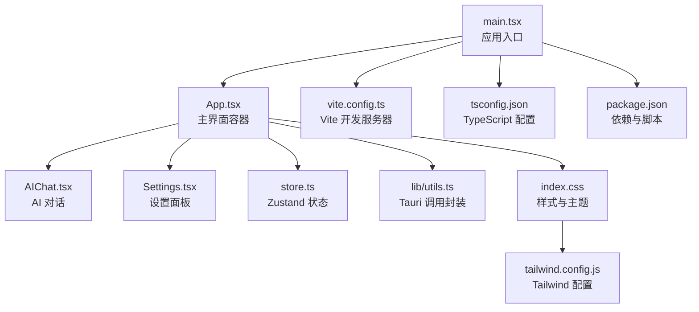
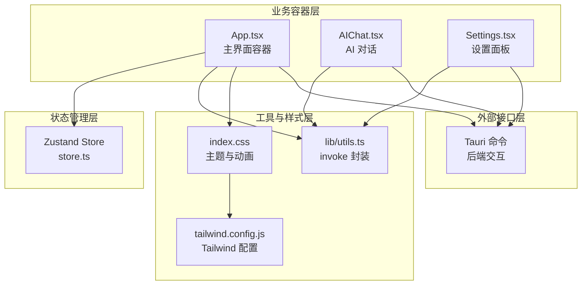
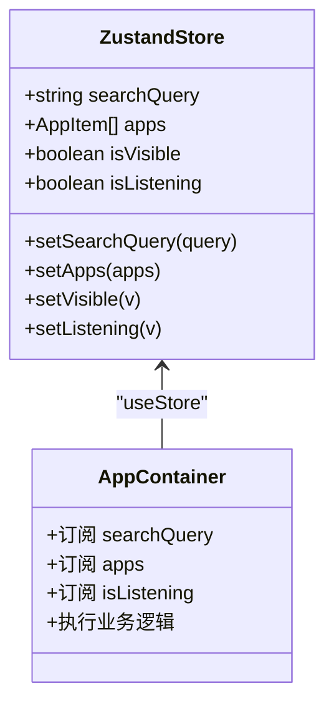
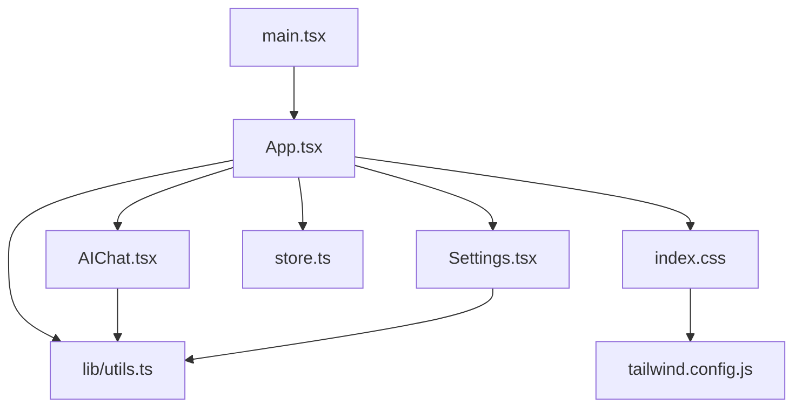
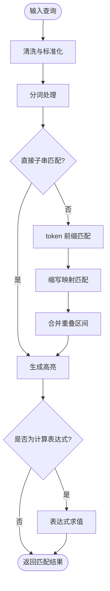
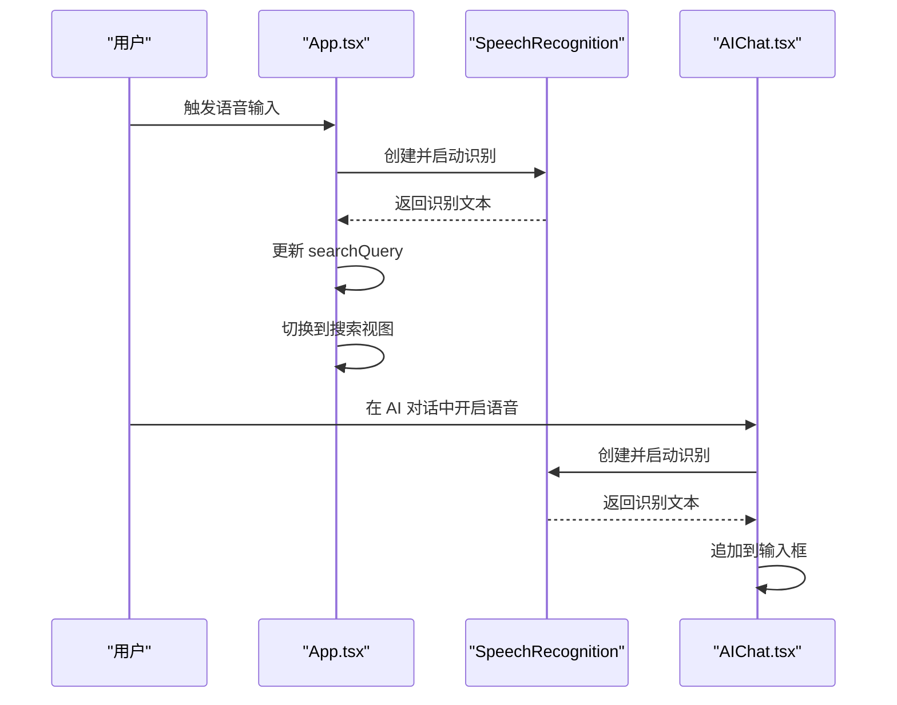
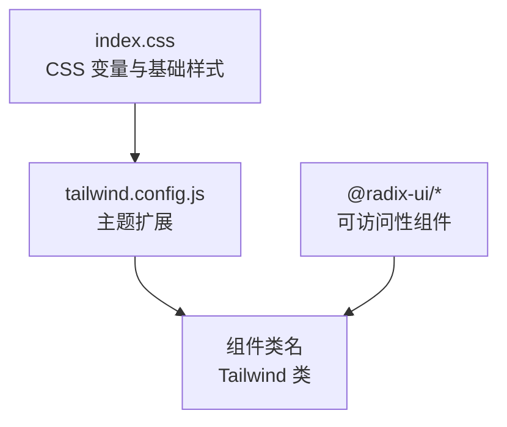
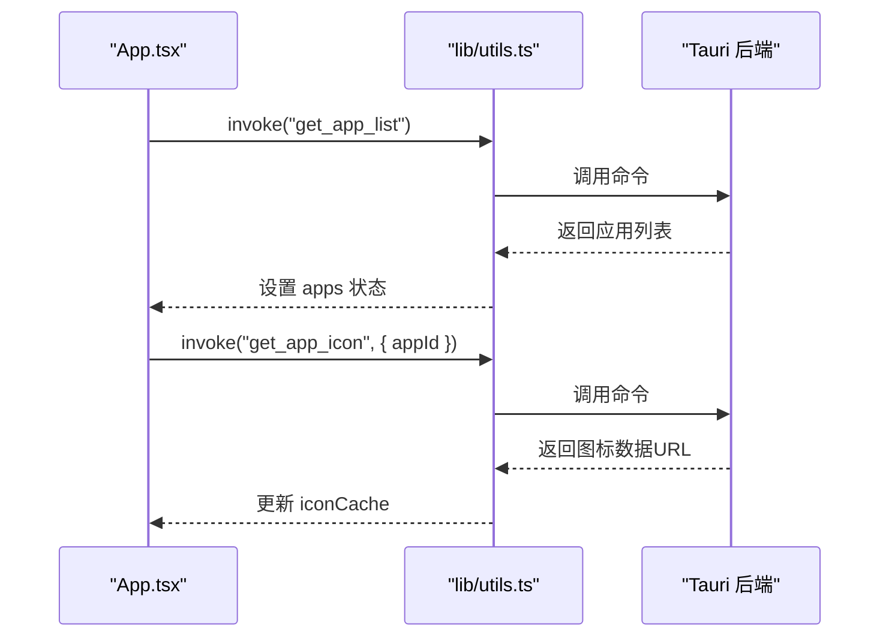
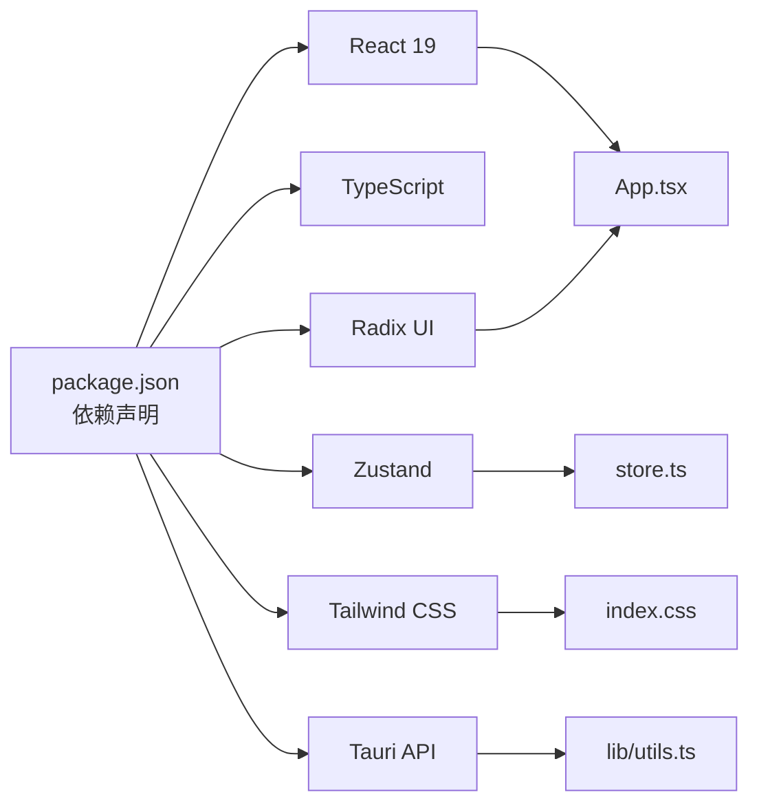

# 前端架构设计

<cite>
**本文档引用的文件**
- [src/main.tsx](file://src/main.tsx)
- [src/App.tsx](file://src/App.tsx)
- [src/store.ts](file://src/store.ts)
- [src/lib/utils.ts](file://src/lib/utils.ts)
- [src/AIChat.tsx](file://src/AIChat.tsx)
- [src/Settings.tsx](file://src/Settings.tsx)
- [src/index.css](file://src/index.css)
- [tailwind.config.js](file://tailwind.config.js)
- [package.json](file://package.json)
- [vite.config.ts](file://vite.config.ts)
- [tsconfig.json](file://tsconfig.json)
</cite>

## 目录
1. [简介](#简介)
2. [项目结构](#项目结构)
3. [核心组件](#核心组件)
4. [架构总览](#架构总览)
5. [详细组件分析](#详细组件分析)
6. [依赖关系分析](#依赖关系分析)
7. [性能考虑](#性能考虑)
8. [故障排除指南](#故障排除指南)
9. [结论](#结论)

## 简介
本项目采用 React 19 + TypeScript 构建跨平台桌面应用的前端界面，结合 Zustand 实现轻量级状态管理，并通过 Tailwind CSS 提供一致的样式体系与 Radix UI 组件库实现可访问性与语义化的 UI 控件。前端通过 @tauri-apps/api 与 Rust 后端进行通信，实现应用启动、文件搜索、分类管理、AI 对话等功能。

## 项目结构
前端代码位于 src 目录，主要文件职责如下：
- 入口文件：src/main.tsx 负责挂载 React 应用
- 核心应用：src/App.tsx 是主界面容器，包含应用卡片、搜索、文件夹浏览、计算器、语音识别等逻辑
- 状态管理：src/store.ts 使用 Zustand 定义全局状态与动作
- 工具函数：src/lib/utils.ts 提供样式合并与 Tauri 命令调用封装
- AI 对话：src/AIChat.tsx 实现 AI 聊天界面与流式响应处理
- 设置面板：src/Settings.tsx 提供主题、快捷键、开机自启、AI 配置等设置
- 样式系统：src/index.css 与 tailwind.config.js 配合提供主题变量与动画
- 构建配置：vite.config.ts、tsconfig.json、package.json 提供开发与构建环境

**图表来源**
- [src/main.tsx:1-11](file://src/main.tsx#L1-L11)
- [src/App.tsx:1-1299](file://src/App.tsx#L1-L1299)
- [src/store.ts:1-46](file://src/store.ts#L1-L46)
- [src/lib/utils.ts:1-25](file://src/lib/utils.ts#L1-L25)
- [src/AIChat.tsx:1-278](file://src/AIChat.tsx#L1-L278)
- [src/Settings.tsx:1-165](file://src/Settings.tsx#L1-L165)
- [src/index.css:1-131](file://src/index.css#L1-L131)
- [tailwind.config.js:1-86](file://tailwind.config.js#L1-L86)
- [vite.config.ts:1-32](file://vite.config.ts#L1-L32)
- [tsconfig.json:1-25](file://tsconfig.json#L1-L25)
- [package.json:1-50](file://package.json#L1-L50)

**章节来源**
- [src/main.tsx:1-11](file://src/main.tsx#L1-L11)
- [vite.config.ts:1-32](file://vite.config.ts#L1-L32)
- [tsconfig.json:1-25](file://tsconfig.json#L1-L25)
- [package.json:1-50](file://package.json#L1-L50)

## 核心组件
- 应用主界面（App.tsx）：负责应用卡片渲染、搜索过滤、键盘导航、拖拽分类、图标缓存、语音输入、文件搜索、计算表达式解析、窗口控制等
- 状态管理（store.ts）：集中管理搜索查询、应用列表、窗口可见性、语音状态等
- 工具函数（lib/utils.ts）：提供 cn 样式合并与 invoke Tauri 命令调用
- AI 对话（AIChat.tsx）：支持多 Provider 配置、流式响应、语音输入、事件监听清理
- 设置面板（Settings.tsx）：主题切换、快捷键提示、开机自启、自动分类、AI 配置
- 样式系统（index.css + tailwind.config.js）：提供 CSS 变量主题、动画与 Tailwind 扩展

**章节来源**
- [src/App.tsx:274-800](file://src/App.tsx#L274-L800)
- [src/store.ts:13-46](file://src/store.ts#L13-L46)
- [src/lib/utils.ts:1-25](file://src/lib/utils.ts#L1-L25)
- [src/AIChat.tsx:14-200](file://src/AIChat.tsx#L14-L200)
- [src/Settings.tsx:14-165](file://src/Settings.tsx#L14-L165)
- [src/index.css:1-131](file://src/index.css#L1-L131)
- [tailwind.config.js:1-86](file://tailwind.config.js#L1-L86)

## 架构总览
前端采用“容器组件 + UI 组件”的分层设计，App.tsx 作为容器组件聚合业务逻辑，AIChat.tsx 与 Settings.tsx 作为独立功能模块。状态管理通过 Zustand 在单例 store 中集中维护，UI 样式通过 Tailwind CSS 与 CSS 变量实现主题化与一致性。

**图表来源**
- [src/store.ts:1-46](file://src/store.ts#L1-L46)
- [src/App.tsx:1-1299](file://src/App.tsx#L1-L1299)
- [src/AIChat.tsx:1-278](file://src/AIChat.tsx#L1-L278)
- [src/Settings.tsx:1-165](file://src/Settings.tsx#L1-L165)
- [src/lib/utils.ts:1-25](file://src/lib/utils.ts#L1-L25)
- [src/index.css:1-131](file://src/index.css#L1-L131)
- [tailwind.config.js:1-86](file://tailwind.config.js#L1-L86)

## 详细组件分析

### Zustand 状态管理实现
- 状态模型：包含搜索查询、应用列表、窗口可见性、语音状态等字段
- 动作函数：提供 setSearchQuery、setApps、setVisible、setListening 等更新方法
- 使用方式：在 App.tsx 中通过 useStore 订阅状态变化，实现 UI 与状态的解耦

**图表来源**
- [src/store.ts:13-46](file://src/store.ts#L13-L46)
- [src/App.tsx:274-276](file://src/App.tsx#L274-L276)

**章节来源**
- [src/store.ts:1-46](file://src/store.ts#L1-L46)
- [src/App.tsx:274-276](file://src/App.tsx#L274-L276)

### 组件树结构与数据流
- 组件树：main.tsx -> App.tsx -> AIChat.tsx / Settings.tsx（条件渲染）
- 数据流：App.tsx 通过 invoke 与后端通信，更新 store 与本地状态；AIChat.tsx 与 Settings.tsx 通过 invoke 读取/写入设置；UI 通过 Tailwind 类名与 CSS 变量渲染

**图表来源**
- [src/main.tsx:1-11](file://src/main.tsx#L1-L11)
- [src/App.tsx:1-1299](file://src/App.tsx#L1-L1299)
- [src/AIChat.tsx:1-278](file://src/AIChat.tsx#L1-L278)
- [src/Settings.tsx:1-165](file://src/Settings.tsx#L1-L165)
- [src/store.ts:1-46](file://src/store.ts#L1-L46)
- [src/lib/utils.ts:1-25](file://src/lib/utils.ts#L1-L25)
- [src/index.css:1-131](file://src/index.css#L1-L131)
- [tailwind.config.js:1-86](file://tailwind.config.js#L1-L86)

### 搜索与匹配算法
- 分词策略：按空格、连字符、点号、驼峰拆分，支持 token 前缀匹配
- 缩写映射：常见缩写扩展为全称进行匹配
- 高亮处理：合并重叠区间，生成带背景高亮的文本片段
- 计算器：正则识别数学表达式，递归下降解析器计算结果

**图表来源**
- [src/App.tsx:23-130](file://src/App.tsx#L23-L130)
- [src/App.tsx:132-247](file://src/App.tsx#L132-L247)

**章节来源**
- [src/App.tsx:23-130](file://src/App.tsx#L23-L130)
- [src/App.tsx:435-482](file://src/App.tsx#L435-L482)
- [src/App.tsx:132-247](file://src/App.tsx#L132-L247)

### 语音识别与交互
- 语音输入：SpeechRecognition 接口，支持中文识别，结束时回调更新搜索框
- AI 对话：支持语音输入与停止按钮，流式响应通过事件监听器接收

**图表来源**
- [src/App.tsx:249-261](file://src/App.tsx#L249-L261)
- [src/AIChat.tsx:169-189](file://src/AIChat.tsx#L169-L189)

**章节来源**
- [src/App.tsx:249-261](file://src/App.tsx#L249-L261)
- [src/AIChat.tsx:169-189](file://src/AIChat.tsx#L169-L189)

### Tailwind CSS 与 Radix UI 集成
- Tailwind CSS：通过 CSS 变量定义主题色板，扩展动画与圆角，配合 index.css 与 tailwind.config.js 实现深浅色主题
- Radix UI：使用 @radix-ui/react-dialog、@radix-ui/react-dropdown-menu、@radix-ui/react-tooltip 等组件，提供无障碍与可访问性

**图表来源**
- [src/index.css:1-131](file://src/index.css#L1-L131)
- [tailwind.config.js:1-86](file://tailwind.config.js#L1-L86)
- [package.json:14-31](file://package.json#L14-L31)

**章节来源**
- [src/index.css:1-131](file://src/index.css#L1-L131)
- [tailwind.config.js:1-86](file://tailwind.config.js#L1-L86)
- [package.json:14-31](file://package.json#L14-L31)

### 异步加载与图标缓存
- Tauri 命令：通过 invoke 调用后端命令，异步获取应用列表、图标、文件搜索结果
- 图标缓存：避免重复请求，失败标记防止反复重试
- 并行动画：应用网格项逐个渲染并带有入场动画延迟

**图表来源**
- [src/App.tsx:314-317](file://src/App.tsx#L314-L317)
- [src/App.tsx:667-677](file://src/App.tsx#L667-L677)
- [src/lib/utils.ts:11-17](file://src/lib/utils.ts#L11-L17)

**章节来源**
- [src/App.tsx:314-317](file://src/App.tsx#L314-L317)
- [src/App.tsx:667-677](file://src/App.tsx#L667-L677)
- [src/lib/utils.ts:11-17](file://src/lib/utils.ts#L11-L17)

## 依赖关系分析
- React 19 与 TypeScript：提供类型安全与最新特性支持
- Zustand：轻量状态管理，减少样板代码
- Tailwind CSS：原子化样式，主题变量与动画扩展
- Radix UI：可访问性组件库，提升用户体验
- @tauri-apps/api：桌面端能力与命令桥接

**图表来源**
- [package.json:14-31](file://package.json#L14-L31)
- [src/App.tsx:1-1299](file://src/App.tsx#L1-L1299)
- [src/store.ts:1-46](file://src/store.ts#L1-L46)
- [src/lib/utils.ts:1-25](file://src/lib/utils.ts#L1-L25)
- [src/index.css:1-131](file://src/index.css#L1-L131)

**章节来源**
- [package.json:14-31](file://package.json#L14-L31)

## 性能考虑
- 图标缓存：避免重复请求，失败标记防止反复重试
- 串行加载：可见应用图标串行加载，保证顺序与性能平衡
- 动画延迟：网格项逐个渲染并带有入场动画延迟，提升视觉体验
- 键盘导航自动滚动：选中项进入可视区域，减少手动滚动
- 异步搜索防抖：输入超过一定长度后触发文件搜索，降低后端压力

**章节来源**
- [src/App.tsx:667-696](file://src/App.tsx#L667-L696)
- [src/App.tsx:534-544](file://src/App.tsx#L534-L544)
- [src/App.tsx:412-424](file://src/App.tsx#L412-L424)

## 故障排除指南
- 主题切换无效：确认设置面板保存后应用主题，系统主题跟随 OS 变化
- 语音识别失败：检查浏览器兼容性与权限，确保语言设置为中文
- AI 对话无响应：检查网络与 API Key 配置，确认事件监听器正确清理
- 图标加载失败：检查后端命令返回，确认缓存标记与异常处理

**章节来源**
- [src/Settings.tsx:29-60](file://src/Settings.tsx#L29-L60)
- [src/AIChat.tsx:169-189](file://src/AIChat.tsx#L169-L189)
- [src/AIChat.tsx:151-159](file://src/AIChat.tsx#L151-L159)
- [src/App.tsx:667-677](file://src/App.tsx#L667-L677)

## 结论
本项目通过 React 19 + TypeScript 的现代化组合，结合 Zustand 的简洁状态管理、Tailwind CSS 的灵活样式系统与 Radix UI 的可访问性组件，构建了高性能、可维护且用户体验优秀的桌面前端界面。通过 Tauri 与后端的紧密协作，实现了应用启动、文件搜索、AI 对话与设置管理等核心功能。未来可在虚拟滚动与更复杂的异步加载策略上进一步优化性能与交互体验。