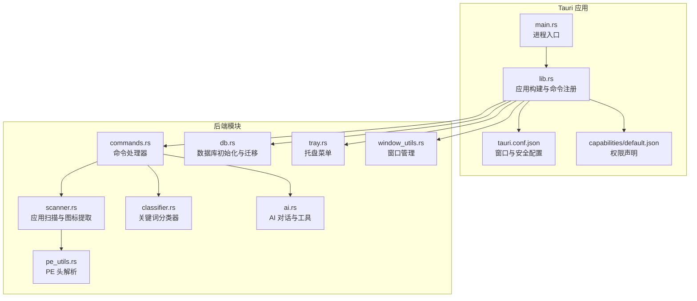
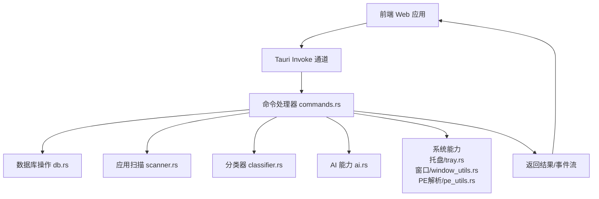
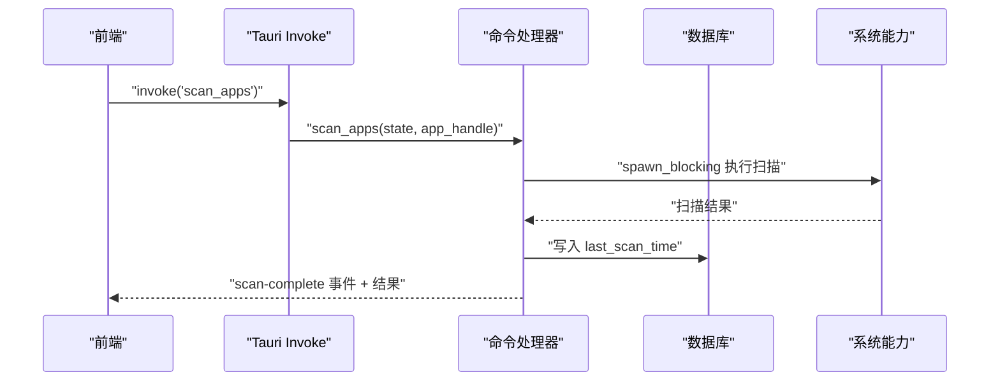
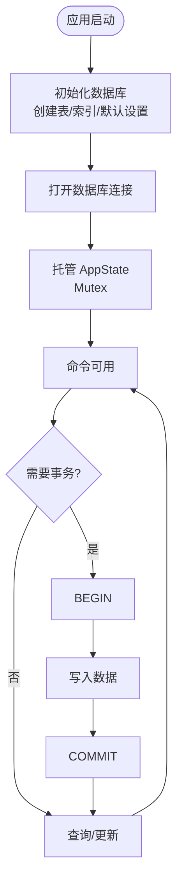
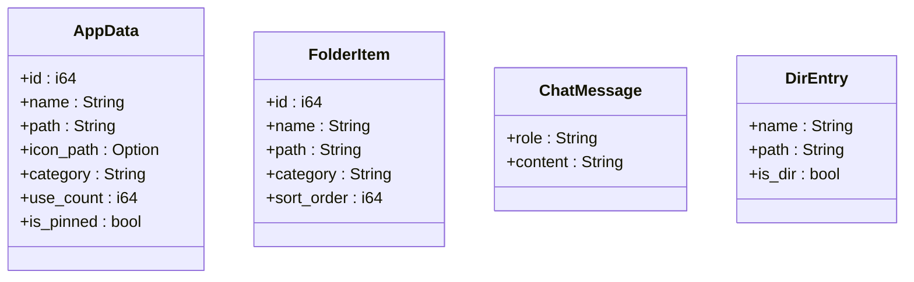
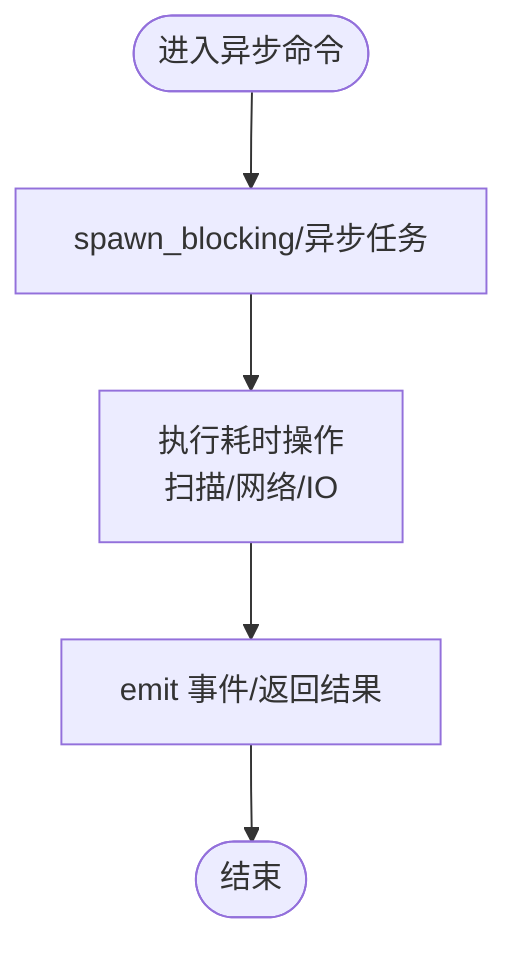
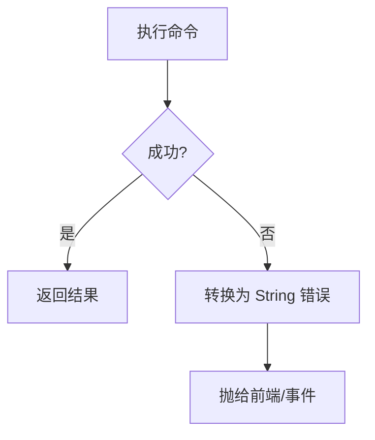
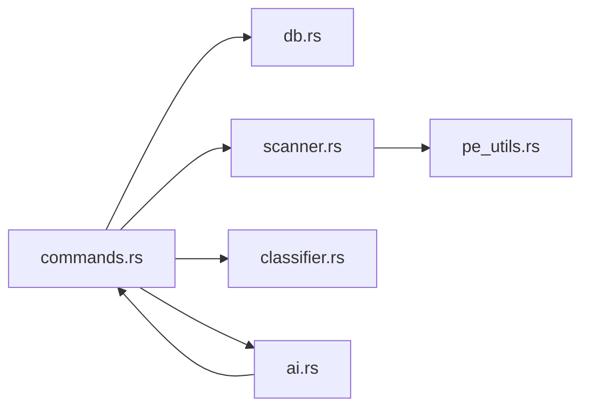

# 后端架构设计

<cite>
**本文档引用的文件**
- [Cargo.toml](file://src-tauri/Cargo.toml)
- [main.rs](file://src-tauri/src/main.rs)
- [lib.rs](file://src-tauri/src/lib.rs)
- [commands.rs](file://src-tauri/src/commands.rs)
- [db.rs](file://src-tauri/src/db.rs)
- [scanner.rs](file://src-tauri/src/scanner.rs)
- [classifier.rs](file://src-tauri/src/classifier.rs)
- [ai.rs](file://src-tauri/src/ai.rs)
- [tray.rs](file://src-tauri/src/tray.rs)
- [window_utils.rs](file://src-tauri/src/window_utils.rs)
- [pe_utils.rs](file://src-tauri/src/pe_utils.rs)
- [tauri.conf.json](file://src-tauri/tauri.conf.json)
- [default.json](file://src-tauri/capabilities/default.json)
- [build.rs](file://src-tauri/build.rs)
</cite>

## 目录
1. [简介](#简介)
2. [项目结构](#项目结构)
3. [核心组件](#核心组件)
4. [架构总览](#架构总览)
5. [详细组件分析](#详细组件分析)
6. [依赖关系分析](#依赖关系分析)
7. [性能考虑](#性能考虑)
8. [故障排除指南](#故障排除指南)
9. [结论](#结论)

## 简介
本项目采用 Rust + Tauri v2 技术栈构建 Windows 桌面快捷启动器 QuickStart。后端基于 Tauri 的命令模式（Invoke Handler）提供跨平台桌面能力，使用 SQLite 作为本地数据存储，并通过 Rusqlite 进行数据库访问。系统支持应用扫描、图标提取、智能分类、AI 对话与文件整理等功能，同时提供托盘交互、全局快捷键和窗口管理能力。

## 项目结构
后端代码位于 src-tauri 目录，采用模块化组织：
- 入口与运行时：main.rs、lib.rs
- 命令处理：commands.rs（集中注册所有后端命令）
- 数据库：db.rs（初始化与迁移）、scanner.rs（应用扫描与图标提取）、classifier.rs（关键词分类）
- AI 能力：ai.rs（SSE 流式对话、目录列举、应用分类、文件整理）
- 平台集成：tray.rs（托盘）、window_utils.rs（窗口定位与切换）、pe_utils.rs（PE 头解析）
- 配置：tauri.conf.json（窗口、安全策略、插件）、capabilities/default.json（权限声明）

**图表来源**
- [main.rs:1-7](file://src-tauri/src/main.rs#L1-L7)
- [lib.rs:22-134](file://src-tauri/src/lib.rs#L22-L134)
- [commands.rs:1-709](file://src-tauri/src/commands.rs#L1-L709)
- [db.rs:1-156](file://src-tauri/src/db.rs#L1-L156)
- [scanner.rs:1-483](file://src-tauri/src/scanner.rs#L1-L483)
- [classifier.rs:1-116](file://src-tauri/src/classifier.rs#L1-L116)
- [ai.rs:1-501](file://src-tauri/src/ai.rs#L1-L501)
- [tray.rs:1-59](file://src-tauri/src/tray.rs#L1-L59)
- [window_utils.rs:1-56](file://src-tauri/src/window_utils.rs#L1-L56)
- [pe_utils.rs:1-132](file://src-tauri/src/pe_utils.rs#L1-L132)
- [tauri.conf.json:1-54](file://src-tauri/tauri.conf.json#L1-L54)
- [default.json:1-36](file://src-tauri/capabilities/default.json#L1-L36)

**章节来源**
- [Cargo.toml:1-36](file://src-tauri/Cargo.toml#L1-L36)
- [main.rs:1-7](file://src-tauri/src/main.rs#L1-L7)
- [lib.rs:1-135](file://src-tauri/src/lib.rs#L1-L135)
- [tauri.conf.json:1-54](file://src-tauri/tauri.conf.json#L1-L54)
- [default.json:1-36](file://src-tauri/capabilities/default.json#L1-L36)

## 核心组件
- 应用状态与数据库连接
  - AppState：持有数据库路径与互斥锁保护的 SQLite 连接，供命令处理器安全访问。
  - 数据库初始化：在应用启动时创建数据库文件与表结构，包含迁移逻辑与索引。
- 命令模式与 Invoke Handler
  - 通过 tauri::Builder::invoke_handler 注册所有命令，前端通过 invoke 调用后端功能。
  - 命令分为同步与异步两类：扫描、图标提取、网络请求等使用异步执行。
- 数据模型
  - 应用模型 AppData、文件夹模型 FolderItem、聊天消息 ChatMessage、目录条目 DirEntry 等。
- 平台能力
  - 托盘菜单、全局快捷键、窗口定位与透明效果、自动启动、文件系统访问与对话框。

**章节来源**
- [lib.rs:14-17](file://src-tauri/src/lib.rs#L14-L17)
- [lib.rs:44-95](file://src-tauri/src/lib.rs#L44-L95)
- [commands.rs:11-29](file://src-tauri/src/commands.rs#L11-L29)
- [commands.rs:322-352](file://src-tauri/src/commands.rs#L322-L352)
- [ai.rs:31-35](file://src-tauri/src/ai.rs#L31-L35)
- [ai.rs:52-57](file://src-tauri/src/ai.rs#L52-L57)

## 架构总览
QuickStart 后端采用“命令模式 + SQLite + 异步执行”的架构设计。前端通过 Tauri 的 invoke 通道发送命令，后端在 Rust 中实现对应处理逻辑，必要时通过 spawn_blocking 或异步网络请求进行耗时操作，完成后通过事件或返回值与前端通信。

**图表来源**
- [lib.rs:96-131](file://src-tauri/src/lib.rs#L96-L131)
- [commands.rs:1-709](file://src-tauri/src/commands.rs#L1-L709)
- [db.rs:17-133](file://src-tauri/src/db.rs#L17-L133)
- [scanner.rs:185-228](file://src-tauri/src/scanner.rs#L185-L228)
- [classifier.rs:77-114](file://src-tauri/src/classifier.rs#L77-L114)
- [ai.rs:60-254](file://src-tauri/src/ai.rs#L60-L254)
- [tray.rs:8-58](file://src-tauri/src/tray.rs#L8-L58)
- [window_utils.rs:5-55](file://src-tauri/src/window_utils.rs#L5-L55)
- [pe_utils.rs:37-104](file://src-tauri/src/pe_utils.rs#L37-L104)

## 详细组件分析

### 命令模式与前后端通信协议
- 命令注册
  - 在 lib.rs 中统一注册所有命令，包括应用管理、文件夹管理、设置、搜索历史、AI 对话等。
- 前后端通信
  - 前端通过 tauri.invoke(commandName, payload) 调用后端命令。
  - 后端命令可返回 Result<T, String>；对于异步命令，使用 async/await 并通过 emit 事件流推送增量结果。
- 错误处理
  - 命令内部统一将错误转换为 String，便于跨语言边界传递。

**图表来源**
- [lib.rs:96-131](file://src-tauri/src/lib.rs#L96-L131)
- [commands.rs:232-249](file://src-tauri/src/commands.rs#L232-L249)
- [db.rs:242-245](file://src-tauri/src/db.rs#L242-L245)

**章节来源**
- [lib.rs:96-131](file://src-tauri/src/lib.rs#L96-L131)
- [commands.rs:232-249](file://src-tauri/src/commands.rs#L232-L249)

### 数据库连接池管理与 SQLite 操作封装
- 连接管理
  - 使用 Mutex<Connection> 包装单个 SQLite 连接，避免并发冲突。
  - 在应用启动时创建连接并托管到 AppState，所有命令通过 State 获取。
- 初始化与迁移
  - 初始化时创建表结构、索引与默认设置项；支持对既有表的列迁移。
- 事务与一致性
  - 关键更新（如分类变更）使用 BEGIN/COMMIT 保证原子性。
- 索引与查询
  - 为搜索历史建立复合索引，提升查询效率。

**图表来源**
- [lib.rs:44-59](file://src-tauri/src/lib.rs#L44-L59)
- [db.rs:17-133](file://src-tauri/src/db.rs#L17-L133)
- [commands.rs:171-193](file://src-tauri/src/commands.rs#L171-L193)

**章节来源**
- [lib.rs:14-17](file://src-tauri/src/lib.rs#L14-L17)
- [lib.rs:44-59](file://src-tauri/src/lib.rs#L44-L59)
- [db.rs:17-133](file://src-tauri/src/db.rs#L17-L133)
- [commands.rs:171-193](file://src-tauri/src/commands.rs#L171-L193)

### 数据模型设计
- 应用模型 AppData：包含 id、name、path、icon_path、category、use_count、is_pinned。
- 文件夹模型 FolderItem：包含 id、name、path、category、sort_order。
- 聊天消息 ChatMessage：role、content。
- 目录条目 DirEntry：name、path、is_dir。
- 模型序列化：使用 serde 进行 JSON 序列化，便于前后端传输。

**图表来源**
- [commands.rs:11-29](file://src-tauri/src/commands.rs#L11-L29)
- [commands.rs:22-29](file://src-tauri/src/commands.rs#L22-L29)
- [ai.rs:31-35](file://src-tauri/src/ai.rs#L31-L35)
- [ai.rs:52-57](file://src-tauri/src/ai.rs#L52-L57)

**章节来源**
- [commands.rs:11-29](file://src-tauri/src/commands.rs#L11-L29)
- [commands.rs:22-29](file://src-tauri/src/commands.rs#L22-L29)
- [ai.rs:31-35](file://src-tauri/src/ai.rs#L31-L35)
- [ai.rs:52-57](file://src-tauri/src/ai.rs#L52-L57)

### 异步处理策略与内存管理
- 异步策略
  - 扫描与图标提取：使用 spawn_blocking 在后台线程执行，避免阻塞 UI。
  - 网络请求：使用 reqwest 异步发起 HTTP 请求，支持超时控制。
  - SSE 流式输出：解析服务器事件流，逐段推送增量内容。
- 内存管理
  - 图标提取：生成 PNG 缓存文件，避免重复解码；缓存目录位于应用数据目录。
  - 临时缓冲：流式处理时仅维护最小缓冲区，及时丢弃已处理片段。
  - RAII：Windows GDI 对象在使用后及时释放，防止句柄泄漏。

**图表来源**
- [commands.rs:232-249](file://src-tauri/src/commands.rs#L232-L249)
- [commands.rs:327-373](file://src-tauri/src/commands.rs#L327-L373)
- [ai.rs:60-254](file://src-tauri/src/ai.rs#L60-L254)

**章节来源**
- [commands.rs:232-249](file://src-tauri/src/commands.rs#L232-L249)
- [commands.rs:327-373](file://src-tauri/src/commands.rs#L327-L373)
- [ai.rs:60-254](file://src-tauri/src/ai.rs#L60-L254)

### 错误处理机制
- 命令层错误
  - 所有数据库与文件操作均转换为 String 错误，统一由 Result<T, String> 返回。
- 网络层错误
  - 对 HTTP 请求失败、响应解析失败等情况进行捕获与包装。
- 路径与权限
  - AI 目录列举与整理严格校验路径范围，防止越权访问。
- 事务回滚
  - 分类更新失败时主动回滚，确保数据一致性。

**图表来源**
- [commands.rs:34-47](file://src-tauri/src/commands.rs#L34-L47)
- [ai.rs:258-319](file://src-tauri/src/ai.rs#L258-L319)

**章节来源**
- [commands.rs:34-47](file://src-tauri/src/commands.rs#L34-L47)
- [ai.rs:258-319](file://src-tauri/src/ai.rs#L258-L319)

## 依赖关系分析
- 核心依赖
  - Tauri v2：窗口、事件、插件、权限管理。
  - Rusqlite：SQLite 访问与事务控制。
  - reqwest/futures-util：HTTP 与异步流处理。
  - Windows API：图标提取、PE 头解析。
- 模块耦合
  - commands.rs 依赖 db.rs、scanner.rs、classifier.rs、ai.rs。
  - scanner.rs 依赖 pe_utils.rs 与 Windows API。
  - ai.rs 依赖 commands.rs 的应用数据查询。

**图表来源**
- [Cargo.toml:15-35](file://src-tauri/Cargo.toml#L15-L35)
- [commands.rs:1-10](file://src-tauri/src/commands.rs#L1-L10)
- [scanner.rs:1-14](file://src-tauri/src/scanner.rs#L1-L14)
- [classifier.rs:1-4](file://src-tauri/src/classifier.rs#L1-L4)
- [ai.rs:1-4](file://src-tauri/src/ai.rs#L1-L4)

**章节来源**
- [Cargo.toml:15-35](file://src-tauri/Cargo.toml#L15-L35)
- [commands.rs:1-10](file://src-tauri/src/commands.rs#L1-L10)
- [scanner.rs:1-14](file://src-tauri/src/scanner.rs#L1-L14)
- [classifier.rs:1-4](file://src-tauri/src/classifier.rs#L1-L4)
- [ai.rs:1-4](file://src-tauri/src/ai.rs#L1-L4)

## 性能考虑
- I/O 与 CPU 密集型任务分离
  - 扫描与图标提取使用 spawn_blocking，避免阻塞事件循环。
- 数据库访问
  - 使用单连接配合 Mutex，减少连接开销；对热点查询建立索引。
- 网络请求
  - 设置合理超时，避免长时间等待；SSE 流式处理降低内存峰值。
- 图标缓存
  - PNG 缓存减少重复解码与系统调用，提升 UI 响应速度。
- 窗口与视觉效果
  - 仅在窗口可见时应用特效，避免不必要的 GPU/CPU 开销。

## 故障排除指南
- 数据库初始化失败
  - 检查应用数据目录权限与磁盘空间；确认迁移脚本无语法错误。
- 扫描无结果或异常
  - 确认开始菜单与桌面路径存在；检查 .lnk 解析与 PE 子系统判断逻辑。
- 图标提取失败
  - 检查缓存目录权限；验证 Windows GDI 调用返回值；确认目标文件存在。
- AI 对话无响应
  - 检查网络连通性与 API Key；确认 SSE 解析逻辑正确。
- 托盘/快捷键无效
  - 检查权限声明与系统快捷键占用情况。

**章节来源**
- [lib.rs:48-50](file://src-tauri/src/lib.rs#L48-L50)
- [scanner.rs:156-179](file://src-tauri/src/scanner.rs#L156-L179)
- [ai.rs:60-254](file://src-tauri/src/ai.rs#L60-L254)
- [default.json:5-34](file://src-tauri/capabilities/default.json#L5-L34)

## 结论
QuickStart 后端以 Tauri 命令模式为核心，结合 SQLite 本地存储与 Windows 平台能力，实现了高效、稳定的桌面应用启动器。通过合理的异步策略、严格的错误处理与路径校验，系统在保证安全性的同时提供了良好的用户体验。未来可在连接池扩展、查询优化与缓存策略方面进一步增强性能与可维护性。