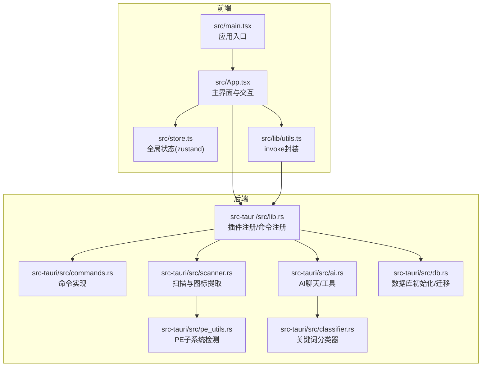
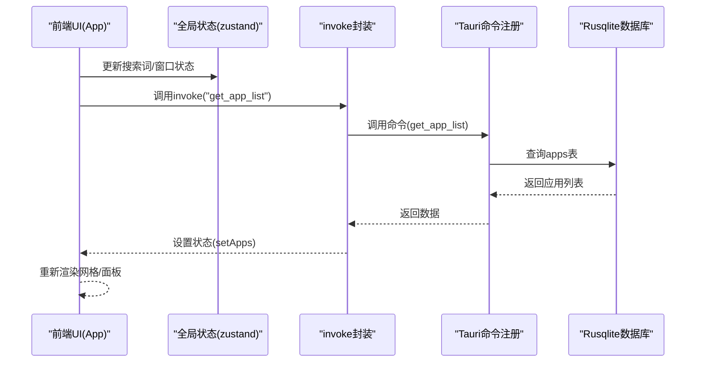
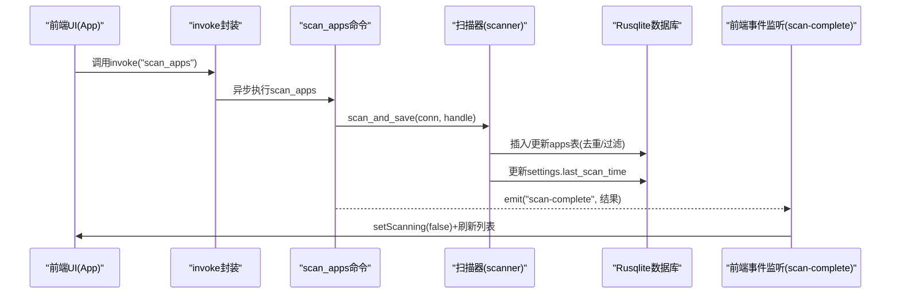
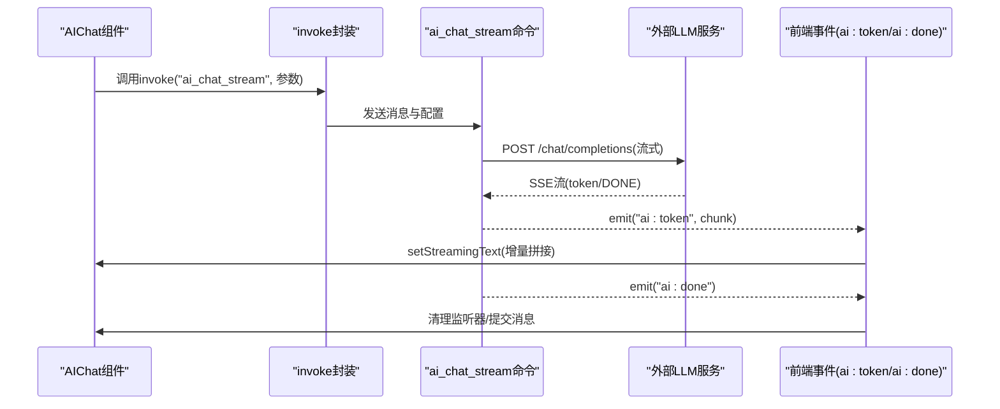
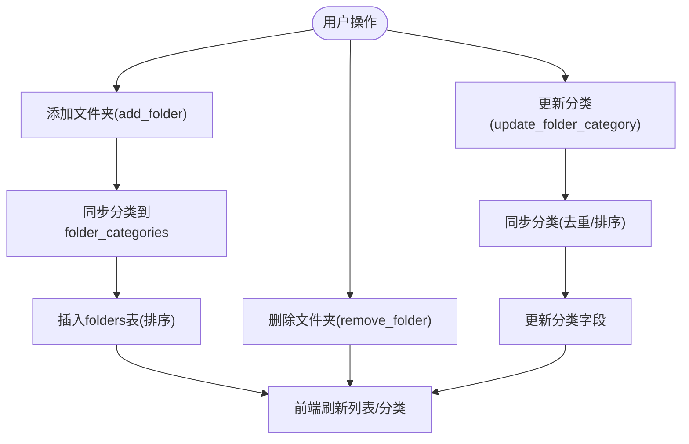
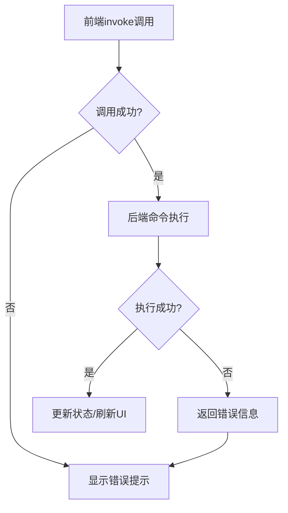
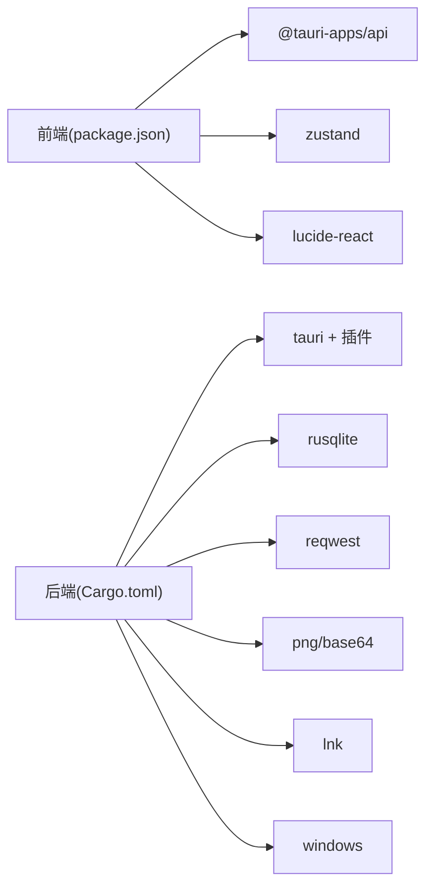

# 数据流设计

<cite>
**本文引用的文件**
- [src/main.tsx](file://src/main.tsx)
- [src/App.tsx](file://src/App.tsx)
- [src/store.ts](file://src/store.ts)
- [src/lib/utils.ts](file://src/lib/utils.ts)
- [src-tauri/src/lib.rs](file://src-tauri/src/lib.rs)
- [src-tauri/src/main.rs](file://src-tauri/src/main.rs)
- [src-tauri/src/commands.rs](file://src-tauri/src/commands.rs)
- [src-tauri/src/db.rs](file://src-tauri/src/db.rs)
- [src-tauri/src/ai.rs](file://src-tauri/src/ai.rs)
- [src-tauri/src/scanner.rs](file://src-tauri/src/scanner.rs)
- [src-tauri/src/classifier.rs](file://src-tauri/src/classifier.rs)
- [src-tauri/src/pe_utils.rs](file://src-tauri/src/pe_utils.rs)
- [src-tauri/Cargo.toml](file://src-tauri/Cargo.toml)
- [package.json](file://package.json)
- [tauri.conf.json](file://tauri.conf.json)
</cite>

## 目录
1. [简介](#简介)
2. [项目结构](#项目结构)
3. [核心组件](#核心组件)
4. [架构总览](#架构总览)
5. [详细组件分析](#详细组件分析)
6. [依赖关系分析](#依赖关系分析)
7. [性能考量](#性能考量)
8. [故障排查指南](#故障排查指南)
9. [结论](#结论)

## 简介
本文件面向QuickStart应用的数据流设计，系统性阐述从前端用户交互到后端数据库的完整数据流向，解释状态提升与数据同步机制，并深入分析三类核心数据流：应用扫描数据流、AI聊天数据流与文件夹管理数据流。文档同时提供数据流图、状态转换图与错误传播路径，解释缓存策略、实时更新机制与数据一致性保障方案。

## 项目结构
QuickStart采用Tauri 2 + React前端架构，前端通过@tauri-apps/api与后端命令进行通信，后端以Rusqlite作为本地数据库，提供应用扫描、图标提取、AI聊天与文件夹管理等能力。

**图表来源**
- [src/main.tsx:1-11](file://src/main.tsx#L1-L11)
- [src/App.tsx:1-1299](file://src/App.tsx#L1-L1299)
- [src/store.ts:1-46](file://src/store.ts#L1-L46)
- [src/lib/utils.ts:1-25](file://src/lib/utils.ts#L1-L25)
- [src-tauri/src/lib.rs:1-135](file://src-tauri/src/lib.rs#L1-L135)
- [src-tauri/src/commands.rs:1-709](file://src-tauri/src/commands.rs#L1-L709)
- [src-tauri/src/ai.rs:1-501](file://src-tauri/src/ai.rs#L1-L501)
- [src-tauri/src/scanner.rs:1-483](file://src-tauri/src/scanner.rs#L1-L483)
- [src-tauri/src/db.rs:1-156](file://src-tauri/src/db.rs#L1-L156)
- [src-tauri/src/pe_utils.rs:1-132](file://src-tauri/src/pe_utils.rs#L1-L132)
- [src-tauri/src/classifier.rs:1-116](file://src-tauri/src/classifier.rs#L1-L116)

**章节来源**
- [src/main.tsx:1-11](file://src/main.tsx#L1-L11)
- [src-tauri/src/lib.rs:22-135](file://src-tauri/src/lib.rs#L22-L135)
- [src-tauri/src/db.rs:17-133](file://src-tauri/src/db.rs#L17-L133)

## 核心组件
- 前端入口与主界面：负责用户交互、状态管理、事件监听与命令调用。
- 全局状态：使用zustand集中管理搜索词、应用列表、窗口可见性与语音状态。
- 通用调用封装：统一通过invoke发起Tauri命令，支持参数传递与返回值处理。
- 后端命令层：提供应用管理、文件夹管理、扫描、图标提取、AI聊天、设置读取等命令。
- 数据库层：Rusqlite本地数据库，负责应用、分类、文件夹、设置、搜索历史等持久化。
- AI与扫描：AI聊天流式传输、文件夹工具调用；扫描器过滤真实应用、提取图标并入库。

**章节来源**
- [src/App.tsx:274-410](file://src/App.tsx#L274-L410)
- [src/store.ts:13-46](file://src/store.ts#L13-L46)
- [src/lib/utils.ts:11-24](file://src/lib/utils.ts#L11-L24)
- [src-tauri/src/commands.rs:32-709](file://src-tauri/src/commands.rs#L32-L709)
- [src-tauri/src/db.rs:17-133](file://src-tauri/src/db.rs#L17-L133)

## 架构总览
QuickStart采用“前端React + 后端Tauri(Rust)”双端架构，前端通过invoke调用后端命令，后端命令访问Rusqlite数据库执行业务逻辑，并通过事件系统向前端推送实时数据（如扫描完成、AI流式token）。

**图表来源**
- [src/App.tsx:314-353](file://src/App.tsx#L314-L353)
- [src/lib/utils.ts:11-17](file://src/lib/utils.ts#L11-L17)
- [src-tauri/src/lib.rs:96-131](file://src-tauri/src/lib.rs#L96-L131)
- [src-tauri/src/commands.rs:528-552](file://src-tauri/src/commands.rs#L528-L552)

## 详细组件分析

### 应用扫描数据流
应用扫描负责发现系统中的真实GUI应用，过滤无效条目，入库并更新最后扫描时间，最终通过事件通知前端刷新。

- 过滤策略：PE子系统检测、系统白名单、名称黑名单与后缀黑名单三层过滤，确保仅入库GUI应用。
- 并发与线程：扫描在后台线程执行，避免阻塞UI；完成后通过事件回调。
- 数据一致性：扫描前后对数据库进行去重与回溯清理，保证数据准确。

**图表来源**
- [src-tauri/src/commands.rs:230-249](file://src-tauri/src/commands.rs#L230-L249)
- [src-tauri/src/scanner.rs:185-228](file://src-tauri/src/scanner.rs#L185-L228)
- [src-tauri/src/db.rs:119-129](file://src-tauri/src/db.rs#L119-L129)
- [src/App.tsx:393-409](file://src/App.tsx#L393-L409)

**章节来源**
- [src-tauri/src/commands.rs:230-249](file://src-tauri/src/commands.rs#L230-L249)
- [src-tauri/src/scanner.rs:96-153](file://src-tauri/src/scanner.rs#L96-L153)
- [src-tauri/src/pe_utils.rs:33-104](file://src-tauri/src/pe_utils.rs#L33-L104)
- [src-tauri/src/db.rs:119-129](file://src-tauri/src/db.rs#L119-L129)
- [src/App.tsx:393-409](file://src/App.tsx#L393-L409)

### AI聊天数据流
AI聊天支持多提供商（OpenAI、Claude、Ollama、自定义），通过SSE流式接收token并在前端实时展示，同时提供文件夹列举与整理工具。

- 实时更新：通过事件系统将token增量推送到前端，避免轮询。
- 错误处理：网络异常、HTTP错误、解析失败均捕获并清理监听器。
- 工具调用：支持list_directory与organize_folder，严格限制路径范围，防止越权。

**图表来源**
- [src-tauri/src/ai.rs:60-254](file://src-tauri/src/ai.rs#L60-L254)
- [src-tauri/src/ai.rs:256-319](file://src-tauri/src/ai.rs#L256-L319)
- [src-tauri/src/ai.rs:462-500](file://src-tauri/src/ai.rs#L462-L500)
- [src-tauri/src/commands.rs:125-131](file://src-tauri/src/commands.rs#L125-L131)
- [src/AIChat.tsx:83-167](file://src/AIChat.tsx#L83-L167)

**章节来源**
- [src-tauri/src/ai.rs:60-254](file://src-tauri/src/ai.rs#L60-L254)
- [src-tauri/src/ai.rs:256-319](file://src-tauri/src/ai.rs#L256-L319)
- [src-tauri/src/ai.rs:462-500](file://src-tauri/src/ai.rs#L462-L500)
- [src/AIChat.tsx:83-167](file://src/AIChat.tsx#L83-L167)

### 文件夹管理数据流
文件夹管理支持增删改分类、分类列表同步与图标缓存，配合前端搜索与拖拽分类功能。

- 分类同步：新增/更新分类时，自动写入分类表并分配sort_order，避免重复。
- 排序策略：新增文件夹追加到末尾，保持稳定排序。
- 前端联动：分类变更后，前端刷新列表与分类筛选器。

**图表来源**
- [src-tauri/src/commands.rs:276-323](file://src-tauri/src/commands.rs#L276-L323)
- [src-tauri/src/commands.rs:668-708](file://src-tauri/src/commands.rs#L668-L708)
- [src/App.tsx:736-765](file://src/App.tsx#L736-L765)

**章节来源**
- [src-tauri/src/commands.rs:276-323](file://src-tauri/src/commands.rs#L276-L323)
- [src-tauri/src/commands.rs:668-708](file://src-tauri/src/commands.rs#L668-L708)
- [src/App.tsx:736-765](file://src/App.tsx#L736-L765)

### 状态提升与数据同步机制
- 状态提升：搜索词、应用列表、窗口可见性、语音状态集中存储于zustand，避免跨组件重复请求。
- 数据同步：前端通过invoke调用后端命令，命令执行后更新数据库，前端再拉取最新数据或通过事件接收增量更新。
- 实时性：扫描完成、AI流式token、图标加载均通过事件驱动，减少轮询与重复渲染。

**章节来源**
- [src/store.ts:13-46](file://src/store.ts#L13-L46)
- [src/App.tsx:314-409](file://src/App.tsx#L314-L409)
- [src-tauri/src/commands.rs:230-249](file://src-tauri/src/commands.rs#L230-L249)

### 数据缓存策略
- 图标缓存：后端提取图标后保存至应用数据目录的icons子目录，命中缓存则直接返回，避免重复提取。
- 搜索历史：去重插入并限制数量，定期清理旧记录，提升查询效率。
- 分类同步：新增/更新分类时同步到分类表，避免前端与数据库不一致。

**章节来源**
- [src-tauri/src/scanner.rs:288-326](file://src-tauri/src/scanner.rs#L288-L326)
- [src-tauri/src/commands.rs:565-597](file://src-tauri/src/commands.rs#L565-L597)
- [src-tauri/src/commands.rs:627-666](file://src-tauri/src/commands.rs#L627-L666)

### 错误传播路径
- 前端错误：invoke调用失败、事件监听失败、网络请求失败均被捕获并提示用户。
- 后端错误：命令执行异常通过Result返回错误信息，前端统一处理并展示。
- 事件清理：AI聊天在发送失败或组件卸载时清理事件监听器，避免内存泄漏。

**图表来源**
- [src/App.tsx:343-353](file://src/App.tsx#L343-L353)
- [src-tauri/src/commands.rs:230-249](file://src-tauri/src/commands.rs#L230-L249)
- [src/AIChat.tsx:151-158](file://src/AIChat.tsx#L151-L158)

**章节来源**
- [src/App.tsx:343-353](file://src/App.tsx#L343-L353)
- [src/AIChat.tsx:151-158](file://src/AIChat.tsx#L151-L158)

## 依赖关系分析
- 前端依赖：React、Zustand、@tauri-apps/api、lucide-react等。
- 后端依赖：Tauri插件集合、Rusqlite、reqwest、png编码、lnk解析、windows系统API等。
- 命令注册：后端统一在lib.rs中注册所有命令，前端通过invoke调用。

**图表来源**
- [package.json:14-31](file://package.json#L14-L31)
- [src-tauri/Cargo.toml:15-36](file://src-tauri/Cargo.toml#L15-L36)

**章节来源**
- [package.json:14-31](file://package.json#L14-L31)
- [src-tauri/Cargo.toml:15-36](file://src-tauri/Cargo.toml#L15-L36)

## 性能考量
- 扫描性能：三层过滤在入库前完成，减少数据库写入与后续查询成本；扫描在后台线程执行，避免UI卡顿。
- 图标加载：按需提取与缓存，串行加载可见应用图标，避免并发阻塞。
- 搜索优化：前端分词与缩写映射提升匹配效率；文件搜索限制目录与数量，避免大量IO。
- 数据库索引：为搜索历史建立索引，限制历史条目数量，降低查询开销。

[本节为通用指导，无需特定文件引用]

## 故障排查指南
- 扫描失败：检查系统路径权限与快捷方式有效性；查看后端日志与前端提示。
- AI聊天异常：确认API Key与模型配置；检查网络连通性与SSE流解析；清理事件监听器。
- 图标加载失败：确认缓存目录可写；检查PE图标提取与PNG编码流程。
- 数据不一致：核对分类同步逻辑与事务提交；检查扫描回溯清理是否生效。

**章节来源**
- [src-tauri/src/commands.rs:230-249](file://src-tauri/src/commands.rs#L230-L249)
- [src-tauri/src/ai.rs:60-254](file://src-tauri/src/ai.rs#L60-L254)
- [src-tauri/src/scanner.rs:288-326](file://src-tauri/src/scanner.rs#L288-L326)

## 结论
QuickStart通过清晰的前后端分离与命令驱动架构，实现了高效、可靠的桌面应用数据流。应用扫描、AI聊天与文件夹管理三大数据流分别满足发现、智能与组织需求，配合事件驱动的实时更新与严格的缓存/过滤策略，确保了良好的用户体验与数据一致性。