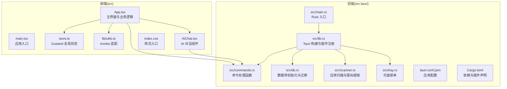
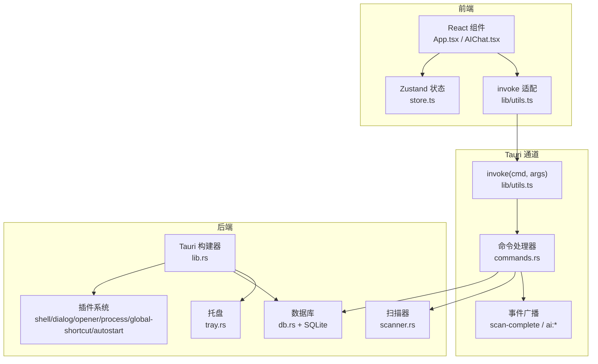
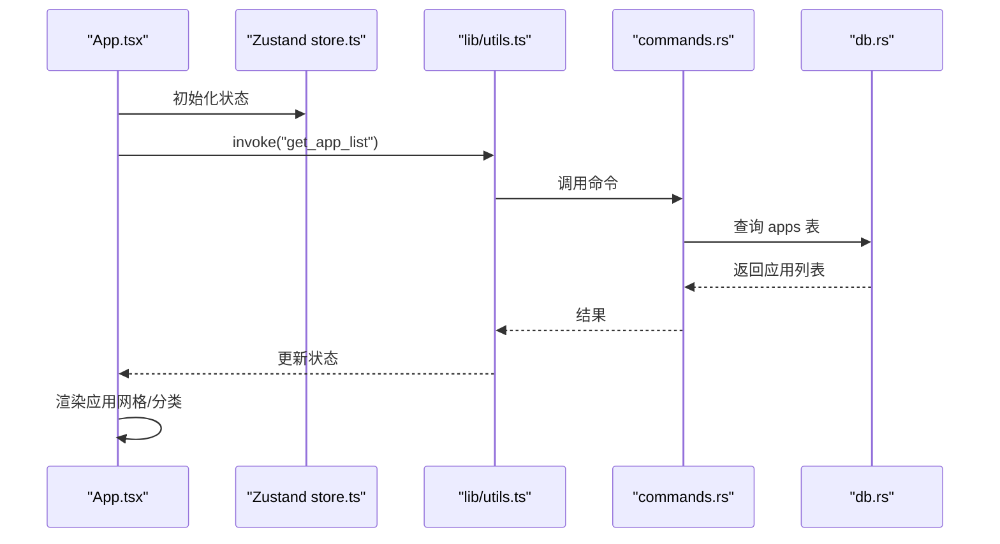
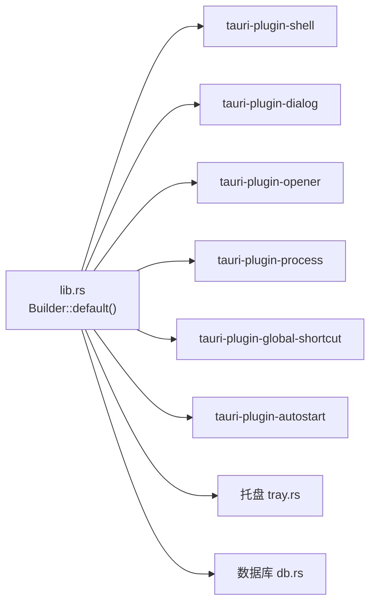
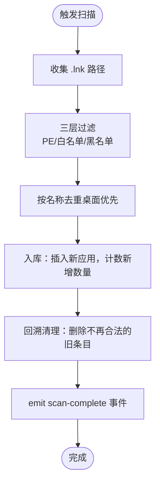
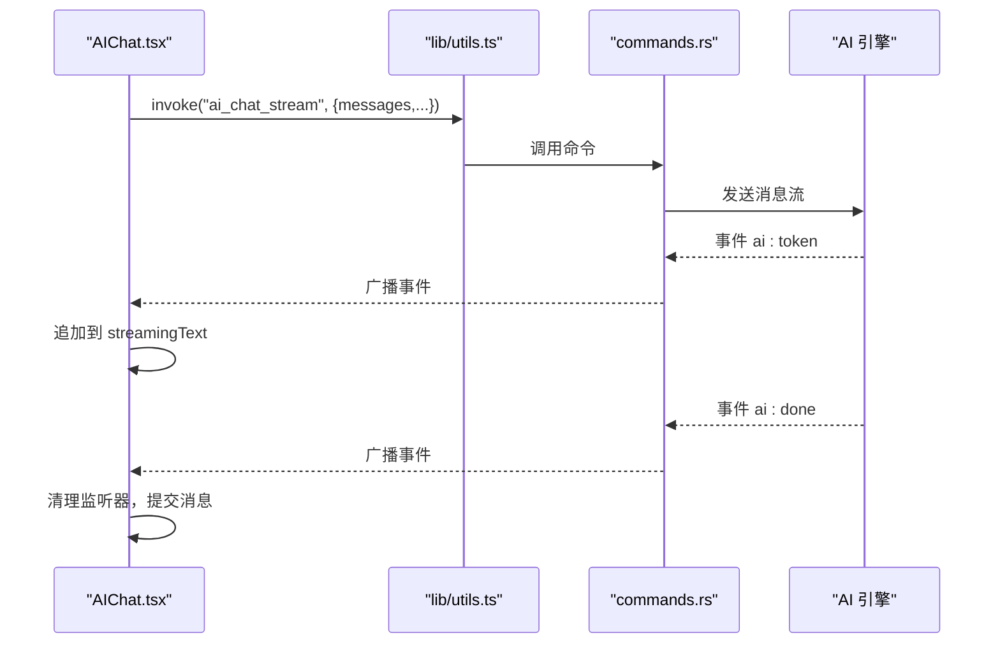

# 整体架构概览

<cite>
**本文档引用的文件**
- [tauri.conf.json](file://src-tauri/tauri.conf.json)
- [package.json](file://package.json)
- [main.tsx](file://src/main.tsx)
- [App.tsx](file://src/App.tsx)
- [store.ts](file://src/store.ts)
- [lib/utils.ts](file://src/lib/utils.ts)
- [AIChat.tsx](file://src/AIChat.tsx)
- [lib.rs](file://src-tauri/src/lib.rs)
- [main.rs](file://src-tauri/src/main.rs)
- [Cargo.toml](file://src-tauri/Cargo.toml)
- [commands.rs](file://src-tauri/src/commands.rs)
- [db.rs](file://src-tauri/src/db.rs)
- [scanner.rs](file://src-tauri/src/scanner.rs)
- [tray.rs](file://src-tauri/src/tray.rs)
- [vite.config.ts](file://vite.config.ts)
</cite>

## 目录
1. [简介](#简介)
2. [项目结构](#项目结构)
3. [核心组件](#核心组件)
4. [架构总览](#架构总览)
5. [详细组件分析](#详细组件分析)
6. [依赖关系分析](#依赖关系分析)
7. [性能考量](#性能考量)
8. [故障排查指南](#故障排查指南)
9. [结论](#结论)

## 简介
QuickStart 是一款基于 Tauri v2 + React + TypeScript 的 Windows 桌面应用，采用混合架构设计，前端使用 React + Vite，后端使用 Rust + Tauri，通过命令通道进行通信。该架构实现了前后端分离与能力边界清晰划分：前端负责 UI 交互与状态管理，后端负责系统级能力（文件系统、进程、窗口、托盘、数据库等）。本文档将系统性阐述其架构设计、生命周期管理、插件系统、全局状态管理，并提供组件交互关系图与数据流向示意。

## 项目结构
项目采用“前端 + 后端”双层结构，前端位于 src 目录，后端位于 src-tauri 目录；构建与打包通过 Tauri CLI 驱动，Vite 提供开发服务器与热更新。



**图表来源**
- [main.tsx:1-11](file://src/main.tsx#L1-L11)
- [App.tsx:1-1299](file://src/App.tsx#L1-L1299)
- [store.ts:1-46](file://src/store.ts#L1-L46)
- [lib/utils.ts:1-25](file://src/lib/utils.ts#L1-L25)
- [AIChat.tsx:1-278](file://src/AIChat.tsx#L1-L278)
- [main.rs:1-7](file://src-tauri/src/main.rs#L1-L7)
- [lib.rs:1-135](file://src-tauri/src/lib.rs#L1-L135)
- [commands.rs:1-709](file://src-tauri/src/commands.rs#L1-L709)
- [db.rs:1-156](file://src-tauri/src/db.rs#L1-L156)
- [scanner.rs:1-483](file://src-tauri/src/scanner.rs#L1-L483)
- [tray.rs:1-59](file://src-tauri/src/tray.rs#L1-L59)
- [tauri.conf.json:1-54](file://src-tauri/tauri.conf.json#L1-L54)
- [Cargo.toml:1-36](file://src-tauri/Cargo.toml#L1-L36)

**章节来源**
- [package.json:1-50](file://package.json#L1-L50)
- [vite.config.ts:1-32](file://vite.config.ts#L1-L32)
- [tauri.conf.json:1-54](file://src-tauri/tauri.conf.json#L1-L54)

## 核心组件
- 前端应用入口与主界面
  - 应用入口：负责挂载 React 根节点与全局样式。
  - 主界面：集中处理应用列表、文件搜索、计算器、分类管理、窗口控制、语音输入、图标缓存等。
  - 全局状态：使用 Zustand 管理搜索词、应用列表、窗口可见性、语音状态等。
  - 通用调用：封装 invoke，屏蔽 @tauri-apps/api 的动态导入细节。
- 后端服务与命令系统
  - Tauri 构建：注册插件、全局快捷键、托盘、窗口初始化与数据库托管。
  - 命令处理：提供应用/文件夹管理、扫描、图标提取、设置、搜索历史、AI 对话等命令。
  - 数据库：SQLite 初始化与迁移，包含应用、分类、文件夹、设置、聊天历史等表。
  - 扫描器：Windows 快捷方式扫描、PE GUI 过滤、图标提取与缓存。
  - 托盘：系统托盘菜单与点击事件处理。

**章节来源**
- [main.tsx:1-11](file://src/main.tsx#L1-L11)
- [App.tsx:1-1299](file://src/App.tsx#L1-L1299)
- [store.ts:1-46](file://src/store.ts#L1-L46)
- [lib/utils.ts:1-25](file://src/lib/utils.ts#L1-L25)
- [lib.rs:1-135](file://src-tauri/src/lib.rs#L1-L135)
- [commands.rs:1-709](file://src-tauri/src/commands.rs#L1-L709)
- [db.rs:1-156](file://src-tauri/src/db.rs#L1-L156)
- [scanner.rs:1-483](file://src-tauri/src/scanner.rs#L1-L483)
- [tray.rs:1-59](file://src-tauri/src/tray.rs#L1-L59)

## 架构总览
QuickStart 的混合架构遵循“前端专注 UI 与交互，后端专注系统能力”的原则。前端通过 @tauri-apps/api 的 invoke 通道调用后端命令，后端通过命令函数执行数据库操作、系统调用与事件广播，形成清晰的职责边界与可扩展的插件体系。



**图表来源**
- [App.tsx:1-1299](file://src/App.tsx#L1-L1299)
- [AIChat.tsx:1-278](file://src/AIChat.tsx#L1-L278)
- [store.ts:1-46](file://src/store.ts#L1-L46)
- [lib/utils.ts:1-25](file://src/lib/utils.ts#L1-L25)
- [lib.rs:1-135](file://src-tauri/src/lib.rs#L1-L135)
- [commands.rs:1-709](file://src-tauri/src/commands.rs#L1-L709)
- [db.rs:1-156](file://src-tauri/src/db.rs#L1-L156)
- [scanner.rs:1-483](file://src-tauri/src/scanner.rs#L1-L483)
- [tray.rs:1-59](file://src-tauri/src/tray.rs#L1-L59)

## 详细组件分析

### 前端应用生命周期与状态管理
- 生命周期
  - 启动：main.tsx 创建根节点，App.tsx 渲染主界面。
  - 初始化：加载应用列表、文件夹、分类、搜索历史；检查更新；根据主题设置暗色模式。
  - 扫描：后台触发扫描，等待 scan-complete 事件刷新数据。
  - 交互：键盘导航、拖拽分类、语音输入、计算器、文件搜索、窗口控制。
- 全局状态
  - 使用 Zustand 管理搜索词、应用列表、窗口可见性、语音状态，减少跨组件传递成本。
- 事件与副作用
  - 使用 useEffect 管理异步数据加载、事件监听与清理、定时器与防抖。



**图表来源**
- [App.tsx:314-391](file://src/App.tsx#L314-L391)
- [store.ts:1-46](file://src/store.ts#L1-L46)
- [lib/utils.ts:1-25](file://src/lib/utils.ts#L1-L25)
- [commands.rs:528-552](file://src-tauri/src/commands.rs#L528-L552)
- [db.rs:51-101](file://src-tauri/src/db.rs#L51-L101)

**章节来源**
- [main.tsx:1-11](file://src/main.tsx#L1-L11)
- [App.tsx:1-1299](file://src/App.tsx#L1-L1299)
- [store.ts:1-46](file://src/store.ts#L1-L46)

### 插件系统架构与应用边界
- 插件注册
  - shell、dialog、opener、process、global-shortcut、autostart 等插件在 lib.rs 中注册。
- 应用边界
  - 前端仅通过 invoke 调用命令，后端统一处理系统调用与数据库访问，避免前端直接接触系统 API。
- 安全与隔离
  - tauri.conf.json 中配置 CSP、资产协议作用域，限制资源访问范围。



**图表来源**
- [lib.rs:24-43](file://src-tauri/src/lib.rs#L24-L43)
- [tray.rs:1-59](file://src-tauri/src/tray.rs#L1-L59)
- [tauri.conf.json:41-50](file://src-tauri/tauri.conf.json#L41-L50)

**章节来源**
- [lib.rs:1-135](file://src-tauri/src/lib.rs#L1-L135)
- [tauri.conf.json:1-54](file://src-tauri/tauri.conf.json#L1-L54)

### 数据库与扫描流程
- 数据库初始化
  - db.rs 负责创建表与索引、迁移现有数据、插入默认设置。
- 扫描流程
  - scanner.rs 扫描开始菜单与桌面快捷方式，三层过滤（PE GUI、系统白名单、名称黑名单），提取图标并缓存。
- 命令桥接
  - commands.rs 提供 get_app_list、scan_apps、get_app_icon、classify_uncategorized 等命令，统一暴露给前端。



**图表来源**
- [scanner.rs:185-228](file://src-tauri/src/scanner.rs#L185-L228)
- [commands.rs:230-249](file://src-tauri/src/commands.rs#L230-L249)

**章节来源**
- [db.rs:16-133](file://src-tauri/src/db.rs#L16-L133)
- [scanner.rs:1-483](file://src-tauri/src/scanner.rs#L1-L483)
- [commands.rs:1-709](file://src-tauri/src/commands.rs#L1-L709)

### AI 对话与事件流
- 前端组件
  - AIChat.tsx 负责消息展示、输入处理、语音输入、事件监听与清理。
- 后端命令
  - commands.rs 暴露 ai_chat_stream、list_directory、ai_get_apps、ai_classify_apps、organize_folder 等命令。
- 事件流
  - 后端通过事件流推送 ai:token 与 ai:done，前端实时拼接与收尾。



**图表来源**
- [AIChat.tsx:83-167](file://src/AIChat.tsx#L83-L167)
- [lib/utils.ts:1-25](file://src/lib/utils.ts#L1-L25)
- [commands.rs:126-131](file://src-tauri/src/commands.rs#L126-L131)

**章节来源**
- [AIChat.tsx:1-278](file://src/AIChat.tsx#L1-L278)
- [commands.rs:126-131](file://src-tauri/src/commands.rs#L126-L131)

## 依赖关系分析
- 前端依赖
  - React、Radix UI、Lucide、Tailwind、Zustand、@tauri-apps/api 等。
- 后端依赖
  - Tauri v2、rusqlite、reqwest、tokio、windows API、lnk、png、open 等。
- 构建与开发
  - Vite 提供开发服务器与 HMR；Tauri CLI 管理构建与打包；pnpm 管理依赖。

```mermaid
graph TB
subgraph "前端依赖(package.json)"
R["react/react-dom"]
Z["zustand"]
TauriFE["@tauri-apps/api"]
UI["@radix-ui/* + lucide-react"]
end
subgraph "后端依赖(Cargo.toml)"
TauriBE["tauri = { version = \"2\" }"]
SQL["rusqlite"]
Net["reqwest"]
Win["windows"]
Icon["png/lnk"]
Open["open"]
end
R --> TauriFE
UI --> TauriFE
Z --> TauriFE
TauriBE --> SQL
TauriBE --> Net
TauriBE --> Win
TauriBE --> Icon
TauriBE --> Open
```

**图表来源**
- [package.json:14-43](file://package.json#L14-L43)
- [Cargo.toml:15-36](file://src-tauri/Cargo.toml#L15-L36)

**章节来源**
- [package.json:1-50](file://package.json#L1-L50)
- [Cargo.toml:1-36](file://src-tauri/Cargo.toml#L1-L36)

## 性能考量
- 异步与并发
  - 扫描与图标提取使用 spawn_blocking 与线程池，避免阻塞主线程。
  - 事件广播与流式响应提升交互流畅度。
- 缓存策略
  - 图标缓存目录与失败标记，避免重复提取与网络请求。
  - 搜索历史去重与上限控制，降低数据库压力。
- UI 优化
  - useMemo/memo 减少渲染开销；键盘导航自动滚动至可视区域。
  - 分词匹配与缩写映射提升搜索体验。

[本节为通用性能建议，无需特定文件引用]

## 故障排查指南
- 常见问题
  - 扫描无结果：确认开始菜单/桌面快捷方式存在，检查过滤规则与权限。
  - 图标不显示：检查缓存目录权限与文件完整性，尝试刷新图标。
  - AI 对话失败：检查设置中的 API Key、Base URL、模型配置。
  - 托盘无响应：确认托盘图标构建与事件绑定正常。
- 调试建议
  - 查看控制台日志与 invoke 错误信息。
  - 使用 get_db_path 确认数据库路径与文件存在。
  - 通过事件监听验证 scan-complete 与 ai:done 是否触发。

**章节来源**
- [lib/utils.ts:22-25](file://src/lib/utils.ts#L22-L25)
- [commands.rs:325-373](file://src-tauri/src/commands.rs#L325-L373)
- [tray.rs:1-59](file://src-tauri/src/tray.rs#L1-L59)

## 结论
QuickStart 的混合架构以 Tauri v2 为核心，结合 React + TypeScript 实现了高性能、可扩展的桌面应用。通过明确的前后端边界、完善的插件系统、健壮的数据库与扫描机制，以及清晰的事件流与状态管理，项目在功能丰富性与工程可维护性之间取得了良好平衡。未来可在 AI 能力模块化、数据库索引优化与多平台兼容方面进一步演进。