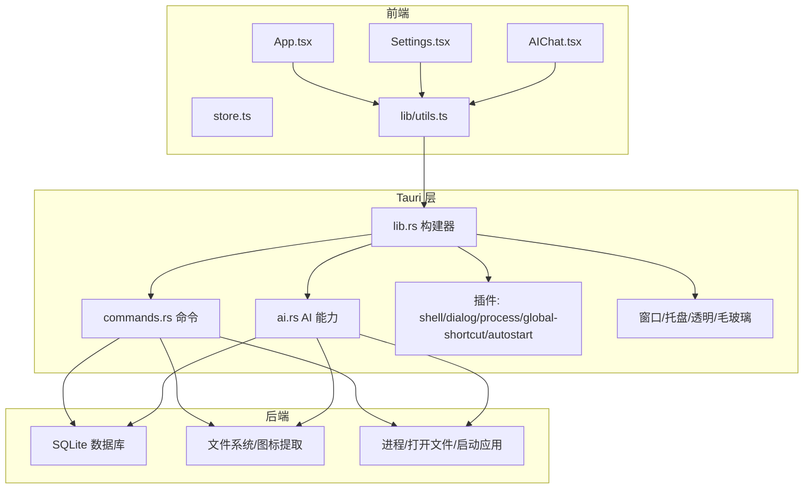
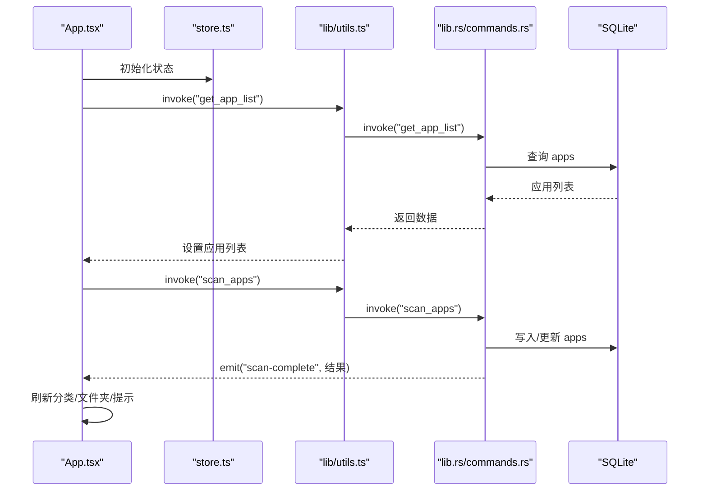
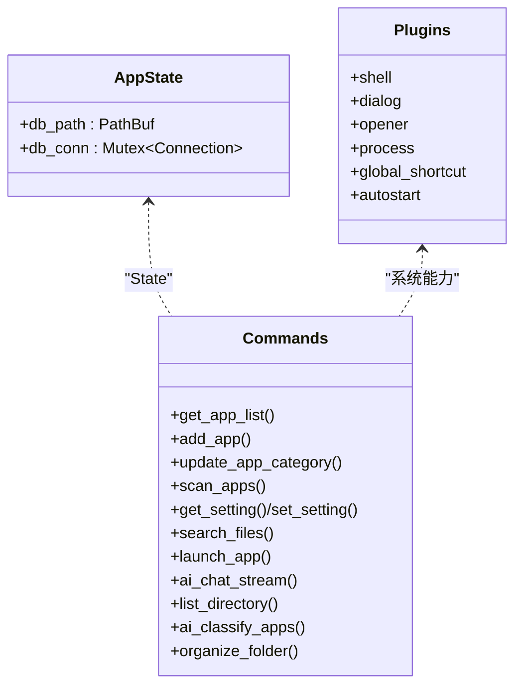
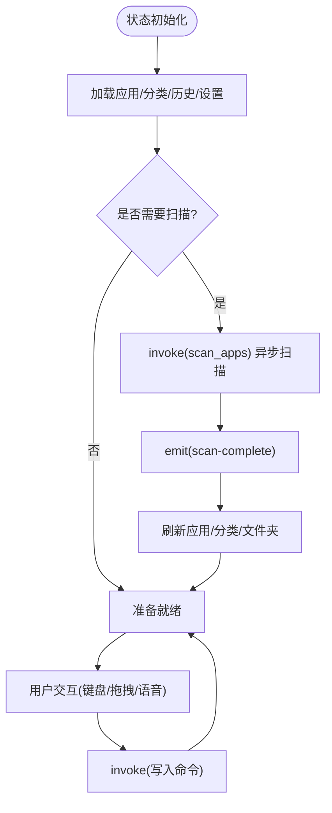
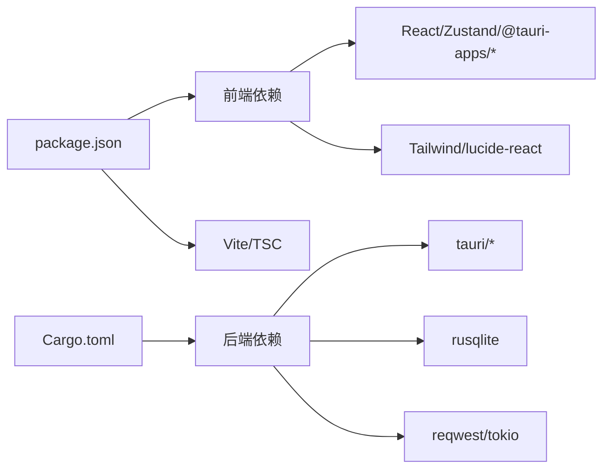

# 架构设计

<cite>
**本文引用的文件**
- [src/main.tsx](file://src/main.tsx)
- [src/App.tsx](file://src/App.tsx)
- [src/store.ts](file://src/store.ts)
- [src/lib/utils.ts](file://src/lib/utils.ts)
- [src/Settings.tsx](file://src/Settings.tsx)
- [src/AIChat.tsx](file://src/AIChat.tsx)
- [src-tauri/src/main.rs](file://src-tauri/src/main.rs)
- [src-tauri/src/lib.rs](file://src-tauri/src/lib.rs)
- [src-tauri/src/commands.rs](file://src-tauri/src/commands.rs)
- [src-tauri/src/ai.rs](file://src-tauri/src/ai.rs)
- [src-tauri/Cargo.toml](file://src-tauri/Cargo.toml)
- [src-tauri/tauri.conf.json](file://src-tauri/tauri.conf.json)
- [package.json](file://package.json)
- [vite.config.ts](file://vite.config.ts)
- [AGENTS.md](file://AGENTS.md)
- [docs/superpowers/specs/2026-05-21-category-management-design.md](file://docs/superpowers/specs/2026-05-21-category-management-design.md)
</cite>

## 目录
1. [简介](#简介)
2. [项目结构](#项目结构)
3. [核心组件](#核心组件)
4. [架构总览](#架构总览)
5. [详细组件分析](#详细组件分析)
6. [依赖分析](#依赖分析)
7. [性能考虑](#性能考虑)
8. [故障排查指南](#故障排查指南)
9. [结论](#结论)
10. [附录](#附录)

## 简介
QuickStart 是一款基于 Tauri v2 的 Windows 桌面快速启动器，采用前后端分离架构：前端使用 React + TypeScript + Vite，后端使用 Rust + Tauri 插件生态，结合 SQLite 进行本地数据持久化。应用提供混合搜索栏与应用面板、应用扫描与管理、AI 自动分类与对话、语音输入、文件夹管理等能力。本文档聚焦于系统架构设计、组件交互、数据流与状态管理策略，并解释插件化设计、命令模式与状态管理模式的实现细节。

## 项目结构
项目采用典型的 Tauri + React 前后端分离布局：
- 前端位于 src 目录，包含 React 应用、状态管理、UI 组件与工具函数。
- 后端位于 src-tauri 目录，包含 Rust 服务端逻辑、Tauri 构建与插件配置、命令与 AI 能力模块。
- 构建与开发脚本由 Vite 与 Tauri CLI 协同完成。

```mermaid
graph TB
subgraph "前端(React)"
FE_Main["src/main.tsx<br/>应用入口"]
FE_App["src/App.tsx<br/>主界面与业务逻辑"]
FE_Store["src/store.ts<br/>Zustand 状态"]
FE_Utils["src/lib/utils.ts<br/>invoke 封装"]
FE_Settings["src/Settings.tsx<br/>设置面板"]
FE_AI["src/AIChat.tsx<br/>AI 对话"]
end
subgraph "后端(Tauri/Rust)"
BE_Main["src-tauri/src/main.rs<br/>入口"]
BE_Lib["src-tauri/src/lib.rs<br/>构建器与插件注册"]
BE_Cmd["src-tauri/src/commands.rs<br/>命令实现"]
BE_AI["src-tauri/src/ai.rs<br/>AI 能力"]
BE_Cargo["src-tauri/Cargo.toml<br/>依赖与插件"]
BE_Conf["src-tauri/tauri.conf.json<br/>窗口与 CSP 配置"]
end
subgraph "构建与脚本"
Pkg["package.json<br/>脚本与依赖"]
Vite["vite.config.ts<br/>开发服务器与别名"]
end
FE_Main --> FE_App
FE_App --> FE_Store
FE_App --> FE_Utils
FE_App --> FE_Settings
FE_App --> FE_AI
FE_App <- --> BE_Lib
FE_App <- --> BE_Cmd
FE_AI <- --> BE_AI
BE_Main --> BE_Lib
BE_Lib --> BE_Cmd
BE_Lib --> BE_AI
BE_Lib --> BE_Cargo
BE_Lib --> BE_Conf
Pkg --> Vite
```

图表来源
- [src/main.tsx:1-11](file://src/main.tsx#L1-L11)
- [src/App.tsx:1-1299](file://src/App.tsx#L1-L1299)
- [src/store.ts:1-46](file://src/store.ts#L1-L46)
- [src/lib/utils.ts:1-25](file://src/lib/utils.ts#L1-L25)
- [src-tauri/src/main.rs:1-7](file://src-tauri/src/main.rs#L1-L7)
- [src-tauri/src/lib.rs:1-135](file://src-tauri/src/lib.rs#L1-L135)
- [src-tauri/src/commands.rs:1-709](file://src-tauri/src/commands.rs#L1-L709)
- [src-tauri/src/ai.rs:1-501](file://src-tauri/src/ai.rs#L1-L501)
- [src-tauri/Cargo.toml:1-36](file://src-tauri/Cargo.toml#L1-L36)
- [src-tauri/tauri.conf.json:1-54](file://src-tauri/tauri.conf.json#L1-L54)
- [package.json:1-50](file://package.json#L1-L50)
- [vite.config.ts:1-32](file://vite.config.ts#L1-L32)

章节来源
- [src/main.tsx:1-11](file://src/main.tsx#L1-L11)
- [src/App.tsx:1-1299](file://src/App.tsx#L1-L1299)
- [src-tauri/src/lib.rs:1-135](file://src-tauri/src/lib.rs#L1-L135)
- [src-tauri/tauri.conf.json:1-54](file://src-tauri/tauri.conf.json#L1-L54)
- [package.json:1-50](file://package.json#L1-L50)
- [vite.config.ts:1-32](file://vite.config.ts#L1-L32)

## 核心组件
- 前端应用入口与主界面
  - 入口文件负责挂载 React 根节点，渲染 App 组件。
  - App 组件承载应用生命周期、窗口控制、搜索与导航、拖拽分类、图标缓存、语音输入、设置与 AI 对话等核心逻辑。
- 状态管理
  - 使用 Zustand 管理搜索查询、应用列表、窗口可见性与语音状态，提供最小化状态树与高可维护性。
- 命令调用封装
  - utils/invoke 封装 @tauri-apps/api/core.invoke，统一前后端通信接口，简化调用方代码。
- 设置与 AI 面板
  - Settings 提供主题、快捷键、开机自启、自动分类与 AI 配置等设置项。
  - AIChat 提供多提供商流式对话、语音输入与文件整理工具调用能力。

章节来源
- [src/main.tsx:1-11](file://src/main.tsx#L1-L11)
- [src/App.tsx:1-1299](file://src/App.tsx#L1-L1299)
- [src/store.ts:1-46](file://src/store.ts#L1-L46)
- [src/lib/utils.ts:1-25](file://src/lib/utils.ts#L1-L25)
- [src/Settings.tsx:1-165](file://src/Settings.tsx#L1-L165)
- [src/AIChat.tsx:1-278](file://src/AIChat.tsx#L1-L278)

## 架构总览
QuickStart 采用“前端 React + 后端 Tauri(Rust)”的混合架构，通过 Tauri 的 invoke 机制进行命令调用与事件通信，Rust 负责系统级能力（文件系统、进程、窗口、托盘、快捷键）与数据持久化，前端负责 UI 与交互体验。



图表来源
- [src-tauri/src/lib.rs:1-135](file://src-tauri/src/lib.rs#L1-L135)
- [src-tauri/src/commands.rs:1-709](file://src-tauri/src/commands.rs#L1-L709)
- [src-tauri/src/ai.rs:1-501](file://src-tauri/src/ai.rs#L1-L501)
- [src-tauri/Cargo.toml:1-36](file://src-tauri/Cargo.toml#L1-L36)
- [src-tauri/tauri.conf.json:1-54](file://src-tauri/tauri.conf.json#L1-L54)

## 详细组件分析

### 前端组件与交互模式
- 主界面 App
  - 生命周期：启动时加载应用与文件夹列表、分类、搜索历史，按需触发扫描；监听扫描完成事件刷新数据；根据主题设置切换明暗模式。
  - 交互：键盘导航、拖拽分类、右键菜单、语音输入、计算器表达式解析、文件搜索与打开。
  - 状态：使用 Zustand 管理搜索查询、应用列表、窗口可见性与语音状态；图标缓存避免重复提取。
  - 事件：监听“scan-complete”事件，触发分类与 AI 自动分类，刷新 UI 并提示。
- 设置面板 Settings
  - 读取/写入设置项，即时应用主题；开机自启与自动分类开关需重启生效。
- AI 对话 AIChat
  - 流式事件监听 ai:token/ai:done，拼接并展示；支持语音输入；可调用 list_directory 与 organize_folder 等工具。



图表来源
- [src/App.tsx:314-409](file://src/App.tsx#L314-L409)
- [src/lib/utils.ts:11-17](file://src/lib/utils.ts#L11-L17)
- [src-tauri/src/lib.rs:96-131](file://src-tauri/src/lib.rs#L96-L131)
- [src-tauri/src/commands.rs:230-249](file://src-tauri/src/commands.rs#L230-L249)

章节来源
- [src/App.tsx:1-1299](file://src/App.tsx#L1-L1299)
- [src/store.ts:1-46](file://src/store.ts#L1-L46)
- [src/lib/utils.ts:1-25](file://src/lib/utils.ts#L1-L25)
- [src-tauri/src/commands.rs:1-709](file://src-tauri/src/commands.rs#L1-L709)

### 命令模式与插件化设计
- 命令注册
  - 在 lib.rs 中通过 generate_handler! 注册所有命令，前端通过 invoke 调用，Rust 侧对应 #[tauri::command] 函数实现。
- 插件体系
  - shell、dialog、opener、process、global-shortcut、autostart 等插件提供系统能力；窗口透明、毛玻璃效果与托盘在 setup 阶段初始化。
- 数据访问
  - 通过 AppState 管理数据库连接，所有命令以 State<'_, AppState> 获取连接，保证线程安全与一致性。



图表来源
- [src-tauri/src/lib.rs:14-18](file://src-tauri/src/lib.rs#L14-L18)
- [src-tauri/src/lib.rs:96-131](file://src-tauri/src/lib.rs#L96-L131)
- [src-tauri/Cargo.toml:15-36](file://src-tauri/Cargo.toml#L15-L36)

章节来源
- [src-tauri/src/lib.rs:1-135](file://src-tauri/src/lib.rs#L1-L135)
- [src-tauri/src/commands.rs:1-709](file://src-tauri/src/commands.rs#L1-L709)
- [src-tauri/Cargo.toml:1-36](file://src-tauri/Cargo.toml#L1-L36)

### 状态管理模式
- 前端状态
  - 使用 Zustand 管理少量核心状态（搜索、应用列表、窗口可见、语音），避免过度拆分导致状态分散。
- 后端状态
  - AppState 作为全局共享状态，持有数据库路径与连接，供命令与 AI 模块使用。



图表来源
- [src/App.tsx:355-409](file://src/App.tsx#L355-L409)
- [src/store.ts:1-46](file://src/store.ts#L1-L46)
- [src-tauri/src/lib.rs:44-95](file://src-tauri/src/lib.rs#L44-L95)

章节来源
- [src/store.ts:1-46](file://src/store.ts#L1-L46)
- [src-tauri/src/lib.rs:14-18](file://src-tauri/src/lib.rs#L14-L18)

### 数据流与状态管理策略
- 前端数据流
  - 通过 utils/invoke 与后端命令交互，命令返回数据后更新 Zustand 状态，组件订阅状态变化并重新渲染。
- 后端数据流
  - 命令函数以 State 获取数据库连接，执行 SQL 操作，必要时通过 AppHandle.emit 发送事件给前端。
- 状态管理策略
  - 前端：最小状态树 + 派生状态（如分类列表、搜索结果）；图标缓存减少重复 IO。
  - 后端：共享连接 + 事务保护（如更新应用分类）；异步任务避免阻塞 UI。

章节来源
- [src/lib/utils.ts:11-17](file://src/lib/utils.ts#L11-L17)
- [src-tauri/src/commands.rs:153-194](file://src-tauri/src/commands.rs#L153-L194)
- [src/App.tsx:667-696](file://src/App.tsx#L667-L696)

### 应用生命周期与窗口控制
- 启动流程
  - main.rs 调用 quickstart_lib::run；lib.rs setup 初始化数据库、托盘、全局快捷键与窗口位置；根据启动参数决定是否隐藏窗口。
- 窗口行为
  - 透明窗口、无边框装饰、焦点管理；Alt+Space 切换显示；支持最大化/最小化/隐藏。
- 自动启动与主题
  - autostart 插件与设置项配合，系统主题监听 OS 变化。

章节来源
- [src-tauri/src/main.rs:1-7](file://src-tauri/src/main.rs#L1-L7)
- [src-tauri/src/lib.rs:44-95](file://src-tauri/src/lib.rs#L44-L95)
- [src-tauri/tauri.conf.json:27-40](file://src-tauri/tauri.conf.json#L27-L40)
- [src/App.tsx:362-372](file://src/App.tsx#L362-L372)

### 插件化设计与扩展性
- 插件清单
  - shell、dialog、opener、process、global-shortcut、autostart 等插件按需启用，降低耦合度。
- 扩展点
  - 新增命令：在 commands.rs 新增 #[tauri::command] 函数并在 generate_handler! 注册。
  - 新增 AI 能力：在 ai.rs 新增命令并通过 AppHandle.emit 与前端事件通信。
  - 新增 UI：在 src 下新增组件并通过 utils/invoke 与后端交互。

章节来源
- [src-tauri/Cargo.toml:15-36](file://src-tauri/Cargo.toml#L15-L36)
- [src-tauri/src/lib.rs:96-131](file://src-tauri/src/lib.rs#L96-L131)
- [src-tauri/src/ai.rs:60-254](file://src-tauri/src/ai.rs#L60-L254)

## 依赖分析
- 前端依赖
  - React、Zustand、@tauri-apps/* 插件、TailwindCSS、lucide-react 等。
- 后端依赖
  - Tauri、rusqlite、reqwest、tokio、window-vibrancy、open、lnk、windows 等。
- 构建与开发
  - Vite + React 插件、TypeScript、TailwindCSS、Tauri CLI。



图表来源
- [package.json:14-43](file://package.json#L14-L43)
- [src-tauri/Cargo.toml:15-36](file://src-tauri/Cargo.toml#L15-L36)

章节来源
- [package.json:1-50](file://package.json#L1-L50)
- [src-tauri/Cargo.toml:1-36](file://src-tauri/Cargo.toml#L1-L36)

## 性能考虑
- 前端性能
  - 图标按需加载与缓存，避免重复提取；计算表达式解析采用有限状态机与预检查，减少异常开销；搜索结果与文件搜索使用防抖与取消机制。
- 后端性能
  - 扫描与图标提取在后台线程执行，避免阻塞主线程；数据库连接通过 Mutex 共享，命令内部使用事务保护关键写入。
- 网络与 AI
  - AI 流式响应通过 SSE/流式读取，前端增量渲染；超时与错误处理保障稳定性。
- 资源与打包
  - Tauri 配置启用透明窗口与系统特效，CSP 限制提升安全性；打包使用 nsis 安装器，安装模式为 currentUser。

章节来源
- [src/App.tsx:667-696](file://src/App.tsx#L667-L696)
- [src-tauri/src/commands.rs:230-249](file://src-tauri/src/commands.rs#L230-L249)
- [src-tauri/src/ai.rs:60-254](file://src-tauri/src/ai.rs#L60-L254)
- [src-tauri/tauri.conf.json:41-50](file://src-tauri/tauri.conf.json#L41-L50)

## 故障排查指南
- 常见问题
  - 无法连接网络：检查 check_update 请求与超时设置。
  - 启动失败：查看 @tauri-apps/api/window 与 shell/open 调用日志。
  - 图标加载失败：确认图标缓存标记与文件路径有效性。
  - AI 请求失败：核对设置中的提供商、API Key、Base URL 与模型配置。
- 日志与调试
  - 前端：console.warn/console.error 输出；Toast 提示。
  - 后端：命令返回错误字符串，前端捕获并提示；必要时在 Rust 中打印错误详情。

章节来源
- [src/App.tsx:355-360](file://src/App.tsx#L355-L360)
- [src-tauri/src/commands.rs:490-505](file://src-tauri/src/commands.rs#L490-L505)
- [src/AIChat.tsx:151-159](file://src/AIChat.tsx#L151-L159)

## 结论
QuickStart 通过 Tauri + React 的混合架构实现了高性能、低耦合的桌面应用。前端以 Zustand 管理核心状态，后端以命令模式与插件体系提供系统能力与数据持久化。AI 能力通过流式事件与工具调用增强用户体验。整体设计具备良好的扩展性与可维护性，适合持续迭代与功能扩展。

## 附录
- 项目背景与工作流
  - 项目采用 GSD 工作流，已完成多阶段功能实现，当前处于设置 UI 完成、安装器与 CI/CD 待完善阶段。
- 分类管理设计
  - 新增 categories 表与并集查询，支持空分类持久化与 UI 展示，兼容现有应用分类逻辑。

章节来源
- [AGENTS.md:1-37](file://AGENTS.md#L1-L37)
- [docs/superpowers/specs/2026-05-21-category-management-design.md:1-166](file://docs/superpowers/specs/2026-05-21-category-management-design.md#L1-L166)