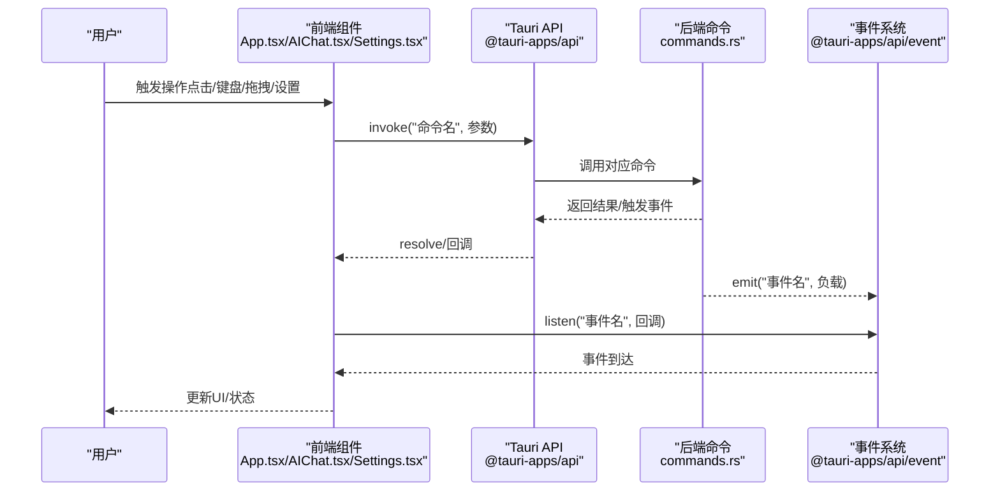
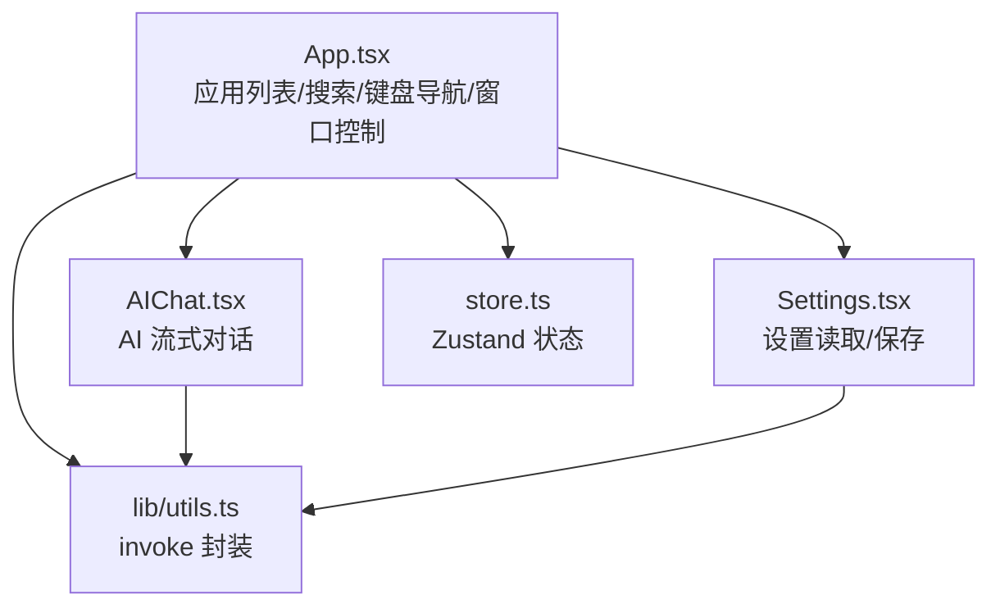
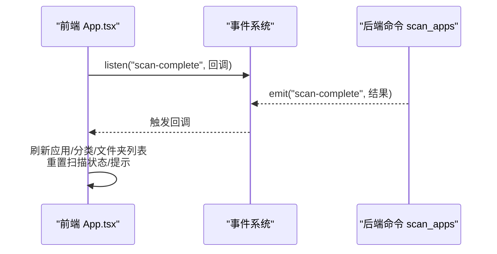
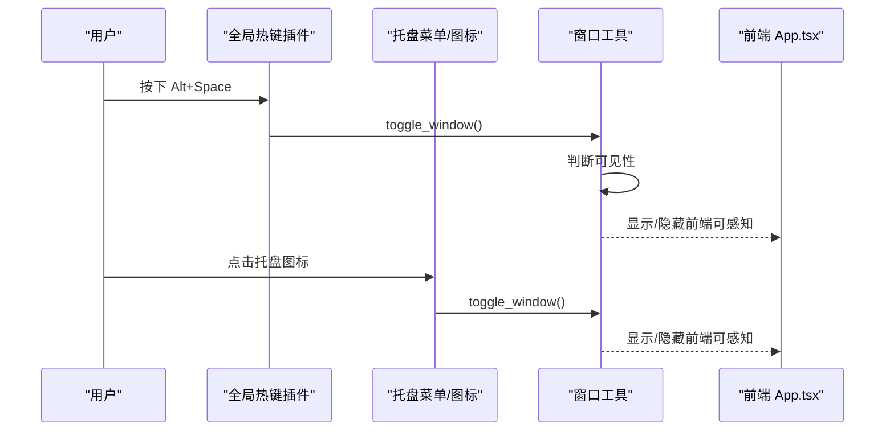
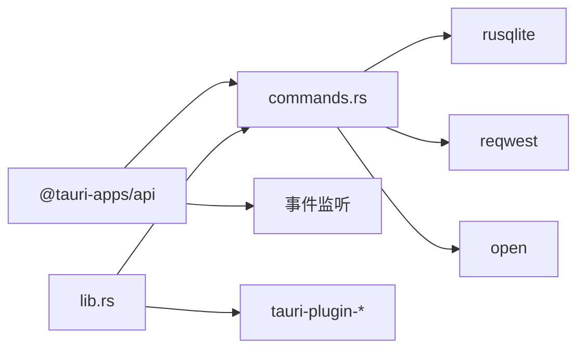

# 组件交互模式

<cite>
**本文引用的文件**
- [src/App.tsx](file://src/App.tsx)
- [src/main.tsx](file://src/main.tsx)
- [src/store.ts](file://src/store.ts)
- [src/lib/utils.ts](file://src/lib/utils.ts)
- [src/AIChat.tsx](file://src/AIChat.tsx)
- [src/Settings.tsx](file://src/Settings.tsx)
- [src-tauri/src/lib.rs](file://src-tauri/src/lib.rs)
- [src-tauri/src/main.rs](file://src-tauri/src/main.rs)
- [src-tauri/src/tray.rs](file://src-tauri/src/tray.rs)
- [src-tauri/src/commands.rs](file://src-tauri/src/commands.rs)
- [src-tauri/src/window_utils.rs](file://src-tauri/src/window_utils.rs)
- [src-tauri/Cargo.toml](file://src-tauri/Cargo.toml)
- [package.json](file://package.json)
</cite>

## 目录
1. [简介](#简介)
2. [项目结构](#项目结构)
3. [核心组件](#核心组件)
4. [架构总览](#架构总览)
5. [详细组件分析](#详细组件分析)
6. [依赖关系分析](#依赖关系分析)
7. [性能考量](#性能考量)
8. [故障排查指南](#故障排查指南)
9. [结论](#结论)
10. [附录](#附录)

## 简介
本文件聚焦 QuickStart 的“组件交互模式”，系统性阐述前端组件间通信机制、状态共享策略与事件处理模式；详解全局热键触发流程、托盘菜单交互与窗口管理机制；并给出组件交互图、事件传播图与状态变更序列图。同时解释跨进程通信实现、异步操作处理与错误恢复机制，帮助开发者与使用者全面理解系统的运行方式。

## 项目结构
QuickStart 采用 Tauri v2 + React 的混合架构：
- 前端层：React 应用通过 @tauri-apps/api 与后端通信，使用 Zustand 管理轻量状态。
- 后端层：Rust 侧通过 Tauri 插件提供系统能力（全局热键、托盘、对话框、进程等），并通过命令暴露给前端。
- 数据层：SQLite（rusqlite）持久化应用与文件夹列表、分类、设置、搜索历史等。

```mermaid
graph TB
subgraph "前端"
FE_Main["React 根组件<br/>src/main.tsx"]
FE_App["主界面组件<br/>src/App.tsx"]
FE_AI["AI 对话组件<br/>src/AIChat.tsx"]
FE_Settings["设置面板组件<br/>src/Settings.tsx"]
FE_Store["状态存储(Zustand)<br/>src/store.ts"]
FE_Utils["通用调用封装<br/>src/lib/utils.ts"]
end
subgraph "后端"
BE_Lib["Tauri 启动入口<br/>src-tauri/src/lib.rs"]
BE_Main["平台入口<br/>src-tauri/src/main.rs"]
BE_Cmds["命令注册与实现<br/>src-tauri/src/commands.rs"]
BE_Tray["托盘逻辑<br/>src-tauri/src/tray.rs"]
BE_Window["窗口工具<br/>src-tauri/src/window_utils.rs"]
end
subgraph "系统插件"
P_Shortcut["全局热键插件"]
P_Dialog["对话框插件"]
P_Opener["文件打开/定位插件"]
P_Process["进程控制插件"]
P_Autostart["开机自启插件"]
end
FE_Main --> FE_App
FE_App --> FE_Store
FE_App --> FE_Utils
FE_App --> FE_AI
FE_App --> FE_Settings
FE_App <- --> BE_Cmds
FE_AI <- --> BE_Cmds
FE_Settings <- --> BE_Cmds
BE_Lib --> BE_Cmds
BE_Lib --> BE_Tray
BE_Lib --> BE_Window
BE_Main --> BE_Lib
BE_Lib --- P_Shortcut
BE_Lib --- P_Dialog
BE_Lib --- P_Opener
BE_Lib --- P_Process
BE_Lib --- P_Autostart
```

图表来源
- [src/main.tsx:1-11](file://src/main.tsx#L1-L11)
- [src/App.tsx:274-800](file://src/App.tsx#L274-L800)
- [src/AIChat.tsx:14-278](file://src/AIChat.tsx#L14-L278)
- [src/Settings.tsx:14-165](file://src/Settings.tsx#L14-L165)
- [src/store.ts:1-46](file://src/store.ts#L1-L46)
- [src/lib/utils.ts:11-25](file://src/lib/utils.ts#L11-L25)
- [src-tauri/src/lib.rs:22-135](file://src-tauri/src/lib.rs#L22-L135)
- [src-tauri/src/main.rs:4-7](file://src-tauri/src/main.rs#L4-L7)
- [src-tauri/src/commands.rs:96-131](file://src-tauri/src/commands.rs#L96-L131)
- [src-tauri/src/tray.rs:8-58](file://src-tauri/src/tray.rs#L8-L58)
- [src-tauri/src/window_utils.rs:5-55](file://src-tauri/src/window_utils.rs#L5-L55)
- [src-tauri/Cargo.toml:15-36](file://src-tauri/Cargo.toml#L15-L36)
- [package.json:14-32](file://package.json#L14-L32)

章节来源
- [src/main.tsx:1-11](file://src/main.tsx#L1-L11)
- [src-tauri/src/lib.rs:22-135](file://src-tauri/src/lib.rs#L22-L135)

## 核心组件
- 主界面组件（App.tsx）
  - 负责应用卡片渲染、搜索与匹配、键盘导航、拖拽分类、图标按需加载、窗口控制、语音识别、文件搜索、扫描与更新提示等。
  - 通过 invoke 调用后端命令，使用 @tauri-apps/api/event 监听后端事件（如扫描完成）。
- 状态存储（store.ts）
  - 使用 Zustand 管理搜索词、应用列表、窗口可见性、语音输入状态等轻量状态。
- 通用调用封装（lib/utils.ts）
  - 统一封装 invoke 调用，便于前端各组件复用。
- AI 对话组件（AIChat.tsx）
  - 负责与后端流式 AI 能力交互，监听 ai:token 和 ai:done 事件，展示流式输出。
- 设置面板组件（Settings.tsx）
  - 读取/写入设置项，应用主题变化，保存后通过命令写入数据库。
- 后端命令与插件（src-tauri/src/commands.rs、lib.rs、tray.rs、window_utils.rs）
  - 提供应用/文件夹管理、图标提取、扫描、搜索历史、设置、AI 流式接口、全局热键、托盘、窗口定位与切换等能力。

章节来源
- [src/App.tsx:274-800](file://src/App.tsx#L274-L800)
- [src/store.ts:1-46](file://src/store.ts#L1-L46)
- [src/lib/utils.ts:11-25](file://src/lib/utils.ts#L11-L25)
- [src/AIChat.tsx:14-278](file://src/AIChat.tsx#L14-L278)
- [src/Settings.tsx:14-165](file://src/Settings.tsx#L14-L165)
- [src-tauri/src/commands.rs:96-131](file://src-tauri/src/commands.rs#L96-L131)
- [src-tauri/src/lib.rs:22-135](file://src-tauri/src/lib.rs#L22-L135)
- [src-tauri/src/tray.rs:8-58](file://src-tauri/src/tray.rs#L8-L58)
- [src-tauri/src/window_utils.rs:5-55](file://src-tauri/src/window_utils.rs#L5-L55)

## 架构总览
QuickStart 的交互遵循“前端发起请求 → 后端执行命令/事件 → 前端接收结果/事件”的跨进程通信范式。前端通过 @tauri-apps/api 的 invoke 与事件监听与后端交互；后端通过 Tauri 插件提供系统能力，并将耗时任务放入异步运行时，避免阻塞 UI。



图表来源
- [src/App.tsx:314-409](file://src/App.tsx#L314-L409)
- [src/AIChat.tsx:96-108](file://src/AIChat.tsx#L96-L108)
- [src-tauri/src/commands.rs:230-249](file://src-tauri/src/commands.rs#L230-L249)

## 详细组件分析

### 组件交互图（前端组件间通信）
展示主界面、AI 对话与设置面板之间的协作关系与数据流向。



图表来源
- [src/App.tsx:274-800](file://src/App.tsx#L274-L800)
- [src/AIChat.tsx:14-278](file://src/AIChat.tsx#L14-L278)
- [src/Settings.tsx:14-165](file://src/Settings.tsx#L14-L165)
- [src/store.ts:1-46](file://src/store.ts#L1-L46)
- [src/lib/utils.ts:11-25](file://src/lib/utils.ts#L11-L25)

章节来源
- [src/App.tsx:274-800](file://src/App.tsx#L274-L800)
- [src/AIChat.tsx:14-278](file://src/AIChat.tsx#L14-L278)
- [src/Settings.tsx:14-165](file://src/Settings.tsx#L14-L165)
- [src/store.ts:1-46](file://src/store.ts#L1-L46)
- [src/lib/utils.ts:11-25](file://src/lib/utils.ts#L11-L25)

### 事件传播图（扫描完成事件）
展示前端监听扫描完成事件并刷新 UI 的过程。



图表来源
- [src/App.tsx:393-409](file://src/App.tsx#L393-L409)
- [src-tauri/src/commands.rs:230-249](file://src-tauri/src/commands.rs#L230-L249)

章节来源
- [src/App.tsx:393-409](file://src/App.tsx#L393-L409)
- [src-tauri/src/commands.rs:230-249](file://src-tauri/src/commands.rs#L230-L249)

### 状态变更序列图（窗口显示/隐藏）
展示全局热键与托盘点击如何切换窗口显示状态。



图表来源
- [src-tauri/src/lib.rs:28-42](file://src-tauri/src/lib.rs#L28-L42)
- [src-tauri/src/tray.rs:29-54](file://src-tauri/src/tray.rs#L29-L54)
- [src-tauri/src/window_utils.rs:45-55](file://src-tauri/src/window_utils.rs#L45-L55)

章节来源
- [src-tauri/src/lib.rs:28-42](file://src-tauri/src/lib.rs#L28-L42)
- [src-tauri/src/tray.rs:29-54](file://src-tauri/src/tray.rs#L29-L54)
- [src-tauri/src/window_utils.rs:45-55](file://src-tauri/src/window_utils.rs#L45-L55)

### 状态共享策略与事件处理模式
- 状态共享
  - 轻量状态：使用 Zustand（搜索词、应用列表、窗口可见性、语音状态）。
  - 重型状态：通过后端命令读取/写入数据库，前端通过 invoke 获取最新数据。
- 事件处理
  - 前端监听后端事件（如扫描完成），在回调中更新状态与 UI。
  - AI 对话组件通过事件流式接收 token，完成后清理监听器。
- 错误处理
  - 前端对 invoke 调用进行 try/catch 并弹出提示。
  - 后端命令返回 Result，错误信息透传至前端。

章节来源
- [src/store.ts:13-45](file://src/store.ts#L13-L45)
- [src/App.tsx:314-409](file://src/App.tsx#L314-L409)
- [src/AIChat.tsx:96-108](file://src/AIChat.tsx#L96-L108)

### 全局热键触发流程
- 注册：在后端 setup 中注册 Alt+Space 为全局热键。
- 触发：按下时切换窗口显示/隐藏（显示时先定位到左下角）。
- 前端感知：窗口可见性变化由前端状态与 UI 即时反映。

章节来源
- [src-tauri/src/lib.rs:62-66](file://src-tauri/src/lib.rs#L62-L66)
- [src-tauri/src/lib.rs:30-38](file://src-tauri/src/lib.rs#L30-L38)
- [src-tauri/src/window_utils.rs:45-55](file://src-tauri/src/window_utils.rs#L45-L55)

### 托盘菜单交互
- 菜单项：显示/隐藏（绑定 Alt+Space）、退出。
- 事件：点击托盘图标或菜单项时，调用 toggle_window 切换窗口。
- 前端联动：窗口显示时自动聚焦并定位。

章节来源
- [src-tauri/src/tray.rs:8-58](file://src-tauri/src/tray.rs#L8-L58)
- [src-tauri/src/window_utils.rs:45-55](file://src-tauri/src/window_utils.rs#L45-L55)

### 窗口管理机制
- 定位：position_window_bottom_left 将窗口定位到屏幕左下角（考虑工作区与缩放因子）。
- 切换：toggle_window 先定位再显示，避免闪烁；隐藏时不再重新定位。
- 自动启动：带 --autostart 参数时隐藏窗口；否则定位并显示。

章节来源
- [src-tauri/src/window_utils.rs:5-55](file://src-tauri/src/window_utils.rs#L5-L55)
- [src-tauri/src/lib.rs:72-92](file://src-tauri/src/lib.rs#L72-L92)

### 跨进程通信实现
- 前端调用：通过 @tauri-apps/api 的 invoke 调用后端命令。
- 后端注册：在 Builder.setup 中通过 generate_handler 注册命令。
- 异步运行：scan_apps 使用 async_runtime::spawn_blocking 执行耗时扫描，并在完成后 emit 事件。

章节来源
- [src-tauri/src/lib.rs:96-131](file://src-tauri/src/lib.rs#L96-L131)
- [src-tauri/src/commands.rs:230-249](file://src-tauri/src/commands.rs#L230-L249)
- [src/lib/utils.ts:11-17](file://src/lib/utils.ts#L11-L17)

### 异步操作处理与错误恢复
- 异步扫描：scan_apps 在后台线程执行，完成后通过事件通知前端。
- 文件搜索：输入延迟防抖 + 取消标志，避免竞态。
- 错误恢复：前端捕获异常并提示；后端命令返回错误字符串，前端统一处理。
- 资源清理：AI 对话组件在发送失败或卸载时清理事件监听器。

章节来源
- [src-tauri/src/commands.rs:230-249](file://src-tauri/src/commands.rs#L230-L249)
- [src/App.tsx:412-424](file://src/App.tsx#L412-L424)
- [src/AIChat.tsx:70-81](file://src/AIChat.tsx#L70-L81)
- [src/App.tsx:343-353](file://src/App.tsx#L343-L353)

## 依赖关系分析
- 前端依赖
  - @tauri-apps/api：跨进程通信与事件监听。
  - zustand：轻量状态管理。
  - lucide-react：图标。
- 后端依赖
  - tauri-plugin-*：全局热键、对话框、文件打开、进程、开机自启。
  - rusqlite：SQLite 访问。
  - reqwest：网络请求（版本检查）。
  - window-vibrancy：窗口背景效果。
  - open：系统打开文件/链接。



图表来源
- [src-tauri/Cargo.toml:15-36](file://src-tauri/Cargo.toml#L15-L36)
- [package.json:14-32](file://package.json#L14-L32)
- [src-tauri/src/commands.rs:96-131](file://src-tauri/src/commands.rs#L96-L131)
- [src-tauri/src/lib.rs:22-135](file://src-tauri/src/lib.rs#L22-L135)

章节来源
- [src-tauri/Cargo.toml:15-36](file://src-tauri/Cargo.toml#L15-L36)
- [package.json:14-32](file://package.json#L14-L32)
- [src-tauri/src/commands.rs:96-131](file://src-tauri/src/commands.rs#L96-L131)
- [src-tauri/src/lib.rs:22-135](file://src-tauri/src/lib.rs#L22-L135)

## 性能考量
- 图标加载：按需加载并缓存，避免重复提取；串行加载保证稳定性。
- 搜索优化：输入延迟 + 取消标志，减少无效请求；分词与缩写映射提升命中率。
- 异步扫描：后台线程执行，完成后一次性刷新 UI，避免阻塞。
- 窗口定位：使用显示器工作区计算，避免硬编码任务栏高度。
- 状态最小化：Zustand 仅存放轻量状态，复杂状态通过后端命令同步。

## 故障排查指南
- 扫描失败
  - 现象：前端提示扫描失败并重置扫描状态。
  - 排查：确认后端 scan_apps 是否抛出异常；检查数据库连接与权限。
- 启动失败
  - 现象：启动应用/文件夹失败并提示。
  - 排查：确认路径是否存在；检查系统默认程序关联。
- AI 对话无响应
  - 现象：发送消息后无流式输出或报错。
  - 排查：确认设置中 API Key/Base URL 正确；检查网络与后端事件监听是否清理。
- 窗口不显示/定位异常
  - 现象：窗口显示但位置不对或不可见。
  - 排查：检查显示器工作区获取与缩放因子；确认 toggle_window 调用链。

章节来源
- [src/App.tsx:343-353](file://src/App.tsx#L343-L353)
- [src/App.tsx:581-613](file://src/App.tsx#L581-L613)
- [src/AIChat.tsx:151-158](file://src/AIChat.tsx#L151-L158)
- [src-tauri/src/window_utils.rs:5-55](file://src-tauri/src/window_utils.rs#L5-L55)

## 结论
QuickStart 通过清晰的前后端职责划分与稳定的跨进程通信机制，实现了高效、可维护的组件交互模式。前端负责 UI 与交互，后端提供系统能力与数据持久化；全局热键与托盘菜单提供便捷入口；异步与事件驱动保障了良好的用户体验。建议在后续迭代中进一步完善错误日志与可观测性，持续优化图标与搜索性能。

## 附录
- 关键命令一览（部分）
  - 应用管理：get_app_list、add_app、remove_app、update_app_category、toggle_pin_app、record_app_launch、launch_app、reveal_in_explorer
  - 分类与文件夹：get_categories、add_category、get_folder_list、add_folder、remove_folder、get_folder_categories、add_folder_category、update_folder_category
  - 图标与扫描：get_app_icon、refresh_app_icon、scan_apps、classify_uncategorized、get_last_scan_time
  - 设置与历史：get_setting、set_setting、record_search、get_search_history、clear_search_history
  - AI 能力：ai_chat_stream、list_directory、ai_get_apps、ai_classify_apps、organize_folder
- 插件能力
  - 全局热键、对话框、文件打开、进程控制、开机自启、窗口背景效果

章节来源
- [src-tauri/src/commands.rs:96-709](file://src-tauri/src/commands.rs#L96-L709)
- [src-tauri/src/lib.rs:22-135](file://src-tauri/src/lib.rs#L22-L135)
- [src-tauri/Cargo.toml:15-36](file://src-tauri/Cargo.toml#L15-L36)
- [package.json:14-32](file://package.json#L14-L32)