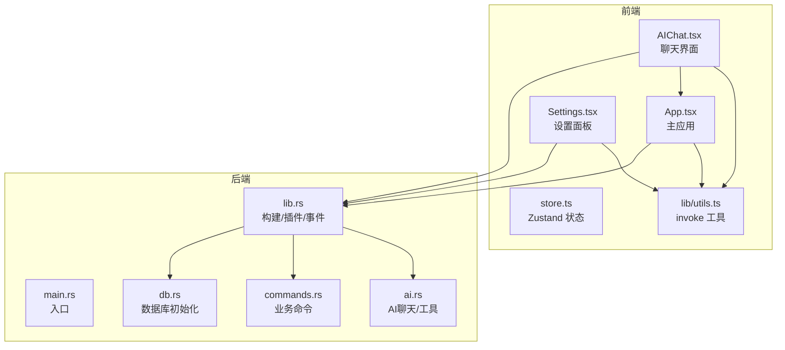
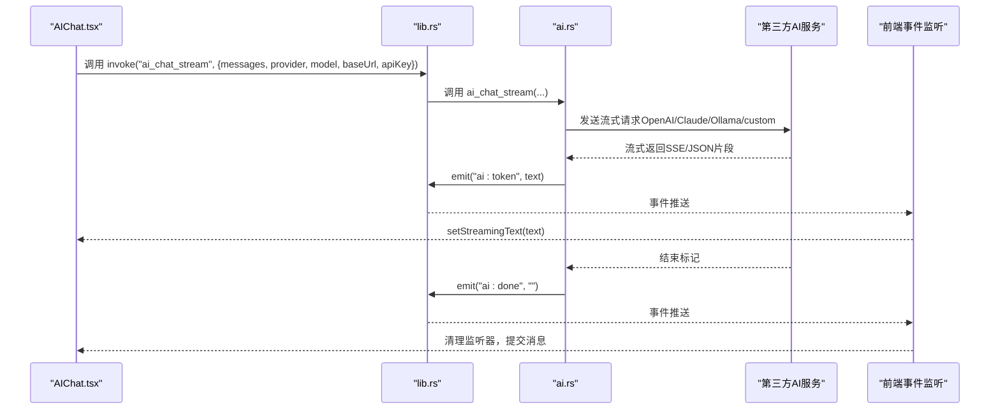
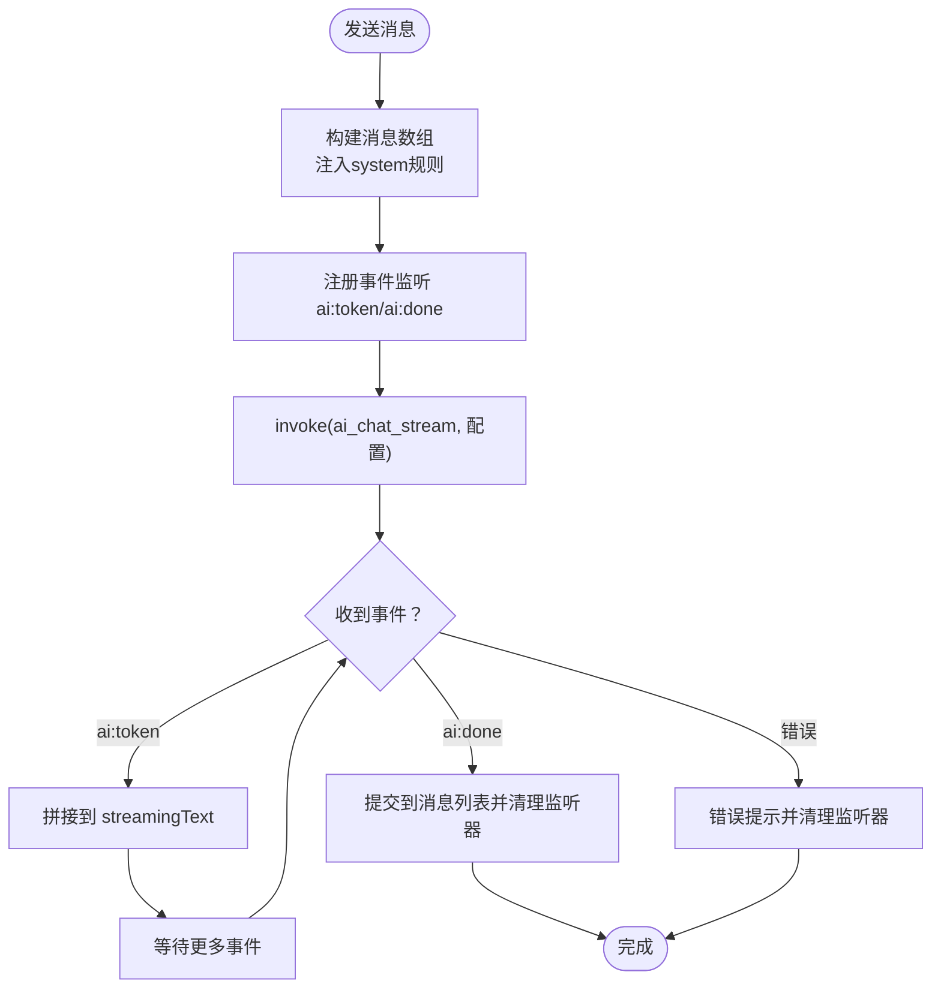
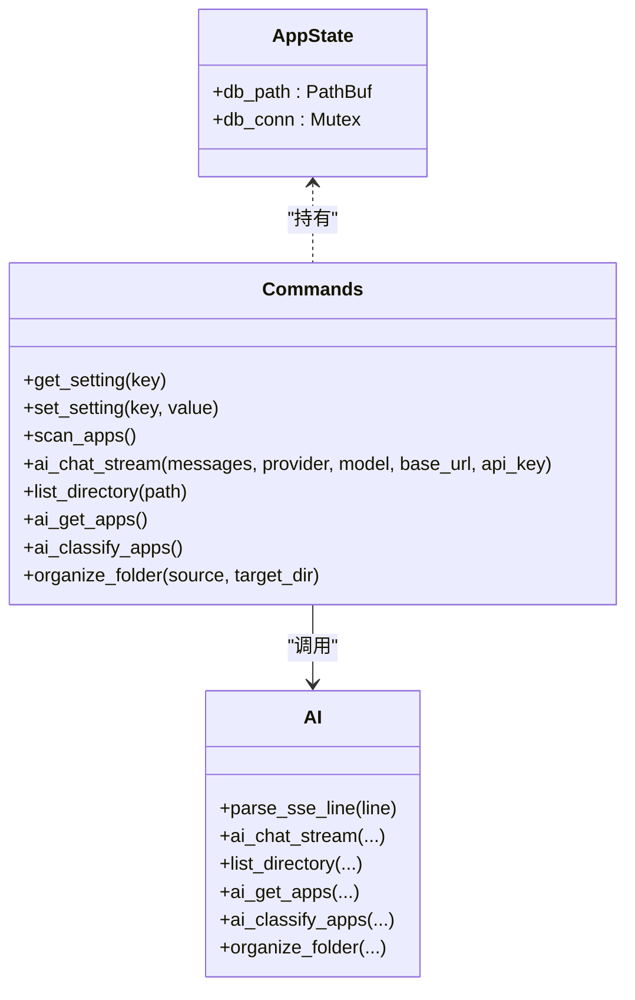
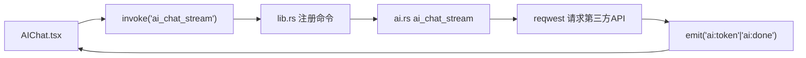

# AI聊天系统

<cite>
**本文引用的文件**
- [AIChat.tsx](file://src/AIChat.tsx)
- [App.tsx](file://src/App.tsx)
- [Settings.tsx](file://src/Settings.tsx)
- [store.ts](file://src/store.ts)
- [utils.ts](file://src/lib/utils.ts)
- [lib.rs](file://src-tauri/src/lib.rs)
- [main.rs](file://src-tauri/src/main.rs)
- [ai.rs](file://src-tauri/src/ai.rs)
- [commands.rs](file://src-tauri/src/commands.rs)
- [db.rs](file://src-tauri/src/db.rs)
- [Cargo.toml](file://src-tauri/Cargo.toml)
- [package.json](file://package.json)
- [AGENTS.md](file://AGENTS.md)
</cite>

## 目录
1. [简介](#简介)
2. [项目结构](#项目结构)
3. [核心组件](#核心组件)
4. [架构总览](#架构总览)
5. [详细组件分析](#详细组件分析)
6. [依赖关系分析](#依赖关系分析)
7. [性能考量](#性能考量)
8. [故障排查指南](#故障排查指南)
9. [结论](#结论)
10. [附录](#附录)

## 简介
本项目是一个基于 Tauri v2 + React + TypeScript 的轻量级 Windows 桌面启动器，内置 AI 聊天与多服务提供商支持。系统支持 OpenAI、Claude、Ollama 以及自定义兼容 OpenAI 的 API；具备流式响应事件推送、事件系统、对话管理、消息历史、会话持久化与用户隐私保护能力。前端提供聊天界面、语音输入、设置面板与应用/文件夹管理；后端通过 Rust 实现命令注册、数据库访问、AI 代理与文件系统安全限制。

## 项目结构
- 前端（React + TypeScript）
  - 聊天界面：AIChat.tsx
  - 主应用：App.tsx
  - 设置面板：Settings.tsx
  - 全局状态：store.ts
  - 通用工具：lib/utils.ts
- 后端（Tauri + Rust）
  - 应用入口：src-tauri/src/main.rs
  - 应用构建与插件：src-tauri/src/lib.rs
  - AI 与工具命令：src-tauri/src/ai.rs
  - 业务命令（应用/文件夹/设置/扫描等）：src-tauri/src/commands.rs
  - 数据库初始化与迁移：src-tauri/src/db.rs
  - 依赖清单：src-tauri/Cargo.toml
- 项目信息
  - 依赖清单：package.json
  - 项目说明：AGENTS.md

图表来源
- [AIChat.tsx:1-278](file://src/AIChat.tsx#L1-L278)
- [App.tsx:1-1299](file://src/App.tsx#L1-L1299)
- [Settings.tsx:1-165](file://src/Settings.tsx#L1-L165)
- [store.ts:1-46](file://src/store.ts#L1-L46)
- [utils.ts:1-25](file://src/lib/utils.ts#L1-L25)
- [main.rs:1-7](file://src-tauri/src/main.rs#L1-L7)
- [lib.rs:1-135](file://src-tauri/src/lib.rs#L1-L135)
- [ai.rs:1-501](file://src-tauri/src/ai.rs#L1-L501)
- [commands.rs:1-709](file://src-tauri/src/commands.rs#L1-L709)
- [db.rs:1-156](file://src-tauri/src/db.rs#L1-L156)

章节来源
- [AGENTS.md:1-37](file://AGENTS.md#L1-L37)
- [package.json:1-50](file://package.json#L1-L50)
- [Cargo.toml:1-36](file://src-tauri/Cargo.toml#L1-L36)

## 核心组件
- 聊天界面（AIChat.tsx）
  - 管理消息列表、流式文本、加载状态、语音输入
  - 从设置面板读取 AI 提供商、模型、Base URL、API Key
  - 通过 invoke 调用后端 ai_chat_stream，并监听 ai:token/ai:done 事件
- 设置面板（Settings.tsx）
  - 提供主题、开机自启、自动分类、AI 提供商、API Key、Base URL、模型等配置
  - 通过 invoke 读写 settings 表
- 主应用（App.tsx）
  - 应用扫描、搜索、拖拽分类、文件夹管理、语音输入、托盘与全局快捷键
  - 与聊天界面联动，支持 Alt+Space 呼出
- 后端命令（lib.rs + ai.rs + commands.rs）
  - 注册命令：ai_chat_stream、list_directory、ai_get_apps、ai_classify_apps、organize_folder 等
  - 实现多提供商流式响应（OpenAI/Claude/Ollama/custom），事件推送
  - 数据库初始化与迁移、设置读写、图标提取、扫描与分类
- 状态与工具（store.ts + utils.ts）
  - Zustand 全局状态（搜索、应用列表、窗口可见性、语音状态）
  - 通用 invoke 封装，统一调用后端命令

章节来源
- [AIChat.tsx:14-167](file://src/AIChat.tsx#L14-L167)
- [Settings.tsx:14-152](file://src/Settings.tsx#L14-L152)
- [App.tsx:274-409](file://src/App.tsx#L274-L409)
- [lib.rs:96-131](file://src-tauri/src/lib.rs#L96-L131)
- [ai.rs:60-254](file://src-tauri/src/ai.rs#L60-L254)
- [commands.rs:398-415](file://src-tauri/src/commands.rs#L398-L415)
- [store.ts:13-45](file://src/store.ts#L13-L45)
- [utils.ts:8-24](file://src/lib/utils.ts#L8-L24)

## 架构总览
系统采用“前端 React + 后端 Tauri/Rust”的双层架构。前端通过 @tauri-apps/api 的 invoke 与后端通信；后端通过 tauri::Builder 注册命令，实现数据库访问、网络请求、文件系统操作与事件发射。

图表来源
- [AIChat.tsx:96-108](file://src/AIChat.tsx#L96-L108)
- [lib.rs:126-131](file://src-tauri/src/lib.rs#L126-L131)
- [ai.rs:60-254](file://src-tauri/src/ai.rs#L60-L254)

## 详细组件分析

### 聊天界面（AIChat.tsx）
- 配置加载：启动时并发读取 ai_provider、ai_api_key、ai_model、ai_base_url
- 安全与规则：发送前注入 system 消息，包含安全规则与文件整理规则
- 事件监听：监听 ai:token（增量文本）与 ai:done（结束）
- 流式展示：将 streamingText 合并到消息列表，loading 状态与占位动画
- 语音输入：Web Speech Recognition，支持 zh-CN，点击麦克风切换状态
- 错误处理：捕获异常，提示“请先在设置中配置 API Key”，并清理监听器

图表来源
- [AIChat.tsx:83-159](file://src/AIChat.tsx#L83-L159)

章节来源
- [AIChat.tsx:14-167](file://src/AIChat.tsx#L14-L167)
- [AIChat.tsx:169-189](file://src/AIChat.tsx#L169-L189)

### 设置面板（Settings.tsx）
- 提供主题（跟随系统/浅色/深色）、开机自启、自动分类开关
- AI 配置：提供商（OpenAI/Claude/Ollama/自定义）、API Key、Base URL、模型
- 保存设置：逐项调用 set_setting 并即时应用主题

章节来源
- [Settings.tsx:14-162](file://src/Settings.tsx#L14-L162)
- [commands.rs:398-415](file://src-tauri/src/commands.rs#L398-L415)

### 主应用（App.tsx）
- 应用扫描与图标：scan_apps 异步执行，扫描完成后 emit scan-complete
- 语音输入：SpeechManager 封装 Web Speech，支持结果回调与错误处理
- 窗口与托盘：全局快捷键 Alt+Space 切换显示，系统托盘图标与菜单
- 搜索与计算：模糊分词匹配、缩写映射、计算器表达式求值
- 文件夹管理：增删改分类、拖拽分类、文件搜索（桌面/下载/文档）

章节来源
- [App.tsx:274-409](file://src/App.tsx#L274-L409)
- [App.tsx:249-261](file://src/App.tsx#L249-L261)
- [commands.rs:230-249](file://src-tauri/src/commands.rs#L230-L249)

### 后端命令与事件系统（lib.rs + ai.rs + commands.rs）
- 命令注册：ai_chat_stream、list_directory、ai_get_apps、ai_classify_apps、organize_folder、get_setting/set_setting、scan_apps 等
- 事件系统：ai_chat_stream 通过 emit("ai:token", text) 与 emit("ai:done", "") 推送流式文本与结束信号
- 多提供商支持：
  - OpenAI：/v1/chat/completions，Authorization: Bearer
  - Claude：/v1/messages，x-api-key，anthropic-version
  - Ollama：/api/chat，默认 http://localhost:11434
  - 自定义：可配置 Base URL
- 安全与权限：
  - 路径校验：validate_path_within_base 限制文件系统访问范围
  - 事件清理：组件卸载时清理监听器，避免内存泄漏
- 数据持久化：settings 表存储配置；chat_history 表用于会话记录（迁移脚本中定义）

图表来源
- [lib.rs:14-17](file://src-tauri/src/lib.rs#L14-L17)
- [lib.rs:96-131](file://src-tauri/src/lib.rs#L96-L131)
- [ai.rs:60-254](file://src-tauri/src/ai.rs#L60-L254)
- [commands.rs:398-415](file://src-tauri/src/commands.rs#L398-L415)

章节来源
- [lib.rs:22-95](file://src-tauri/src/lib.rs#L22-L95)
- [ai.rs:60-254](file://src-tauri/src/ai.rs#L60-L254)
- [commands.rs:398-415](file://src-tauri/src/commands.rs#L398-L415)

### 数据库与会话持久化（db.rs + commands.rs）
- 初始化：创建 apps、categories、folders、folder_categories、settings、search_history、chat_history 等表
- 迁移：为既有表添加缺失列（如 folders.category），同步现有数据
- 设置读写：get_setting/set_setting
- 搜索历史：record_search/get_search_history/clear_search_history
- 会话记录：chat_history 表（字段 role、content、model、created_at）

章节来源
- [db.rs:17-133](file://src-tauri/src/db.rs#L17-L133)
- [commands.rs:565-597](file://src-tauri/src/commands.rs#L565-L597)

### 依赖与运行环境（Cargo.toml + package.json）
- Rust 依赖：tauri、reqwest、rusqlite、base64、futures-util、tokio、window-vibrancy、open、lnk、windows、png 等
- 前端依赖：@tauri-apps/api、react、react-dom、lucide-react、zustand、tailwind 等
- 构建脚本：dev/build/preview/tauri/tauri:dev/tauri:build

章节来源
- [Cargo.toml:15-36](file://src-tauri/Cargo.toml#L15-L36)
- [package.json:6-12](file://package.json#L6-L12)

## 依赖关系分析
- 前端到后端：invoke("ai_chat_stream")、invoke("get_setting"/"set_setting")、invoke("scan_apps")
- 后端到网络：reqwest 发起 OpenAI/Claude/Ollama 请求，支持流式响应
- 后端到文件系统：安全路径校验，限制在应用数据目录与用户常用目录范围内
- 事件链路：ai_chat_stream -> emit("ai:token") -> 前端监听 -> setStreamingText -> 提交消息

图表来源
- [AIChat.tsx:144-150](file://src/AIChat.tsx#L144-L150)
- [lib.rs:126-131](file://src-tauri/src/lib.rs#L126-L131)
- [ai.rs:60-254](file://src-tauri/src/ai.rs#L60-L254)

章节来源
- [lib.rs:96-131](file://src-tauri/src/lib.rs#L96-L131)
- [ai.rs:60-254](file://src-tauri/src/ai.rs#L60-L254)

## 性能考量
- 流式传输：后端使用 bytes_stream 逐块读取，前端按事件增量渲染，降低首屏延迟
- 并发设置加载：前端并发读取多个设置项，减少初始化等待
- 图标缓存：后端提取并缓存 PNG 图标，避免重复读取与转换
- 数据库连接：共享 Mutex<Connection>，避免跨线程 Send 限制
- 事件清理：组件卸载时清理监听器，防止事件累积导致内存泄漏
- 搜索与匹配：前端分词与缩写映射，减少不必要的后端调用

[本节为通用指导，无需特定文件来源]

## 故障排查指南
- API 请求失败
  - 检查设置面板中的 AI 提供商、API Key、Base URL、模型
  - 查看后端日志与错误返回（status 与 body）
- 流式事件未到达
  - 确认前端已正确注册 ai:token/ai:done 监听
  - 确认后端 emit 正常，且未提前清理监听器
- 路径访问受限
  - 确认操作路径在允许范围内（应用数据目录与用户常用目录）
  - 检查 validate_path_within_base 校验逻辑
- 设置未生效
  - 确认 set_setting 已调用并持久化
  - 主题切换需重启应用或手动应用样式

章节来源
- [AIChat.tsx:151-158](file://src/AIChat.tsx#L151-L158)
- [ai.rs:96-100](file://src-tauri/src/ai.rs#L96-L100)
- [ai.rs:38-49](file://src-tauri/src/ai.rs#L38-L49)
- [commands.rs:407-415](file://src-tauri/src/commands.rs#L407-L415)

## 结论
本系统通过前后端分离与事件驱动的方式，实现了多服务提供商的 AI 聊天、流式响应、事件系统与对话管理。结合数据库持久化与安全路径校验，满足桌面应用的隐私与性能需求。设置面板与主应用提供了良好的用户体验，便于配置与使用。

[本节为总结，无需特定文件来源]

## 附录

### AI 服务配置指南
- OpenAI
  - 提供商：openai
  - API Key：必填
  - Base URL：默认使用官方地址
  - 模型：如 gpt-4o-mini
- Claude
  - 提供商：claude
  - API Key：必填
  - Base URL：默认使用官方地址
  - 模型：如 claude-3-5-sonnet-latest
- Ollama
  - 提供商：ollama
  - API Key：可选
  - Base URL：默认 http://localhost:11434
  - 模型：如 llama3.2
- 自定义（OpenAI 兼容）
  - 提供商：custom
  - API Key：必填
  - Base URL：自定义 OpenAI 兼容接口地址
  - 模型：自定义模型名

章节来源
- [Settings.tsx:114-152](file://src/Settings.tsx#L114-L152)
- [ai.rs:72-250](file://src-tauri/src/ai.rs#L72-L250)

### 聊天界面设计要点
- 消息气泡：用户消息右对齐，助手消息左对齐
- 流式展示：ai:token 事件增量渲染，ai:done 事件提交
- 语音输入：点击麦克风切换，支持 zh-CN
- 加载动画：无流式文本时显示占位动画
- 安全提示：当 API Key 未配置时禁用输入并提示

章节来源
- [AIChat.tsx:191-277](file://src/AIChat.tsx#L191-L277)

### 会话持久化与隐私保护
- 会话记录：chat_history 表（role、content、model、created_at）
- 搜索历史：search_history 表，自动去重与限制数量
- 隐私保护：文件系统访问限制在应用数据目录与用户常用目录；API Key 仅在设置面板中以密码输入

章节来源
- [db.rs:94-100](file://src-tauri/src/db.rs#L94-L100)
- [db.rs:40-49](file://src-tauri/src/db.rs#L40-L49)
- [ai.rs:258-319](file://src-tauri/src/ai.rs#L258-L319)

### 集成最佳实践
- 前端并发设置加载，避免阻塞 UI
- 后端流式事件按行解析，及时 emit
- 组件卸载时清理事件监听器
- 数据库连接使用共享 Mutex，避免跨线程问题
- 路径访问严格校验，防止越权

章节来源
- [AIChat.tsx:40-60](file://src/AIChat.tsx#L40-L60)
- [ai.rs:13-28](file://src-tauri/src/ai.rs#L13-L28)
- [lib.rs:14-17](file://src-tauri/src/lib.rs#L14-L17)
- [ai.rs:38-49](file://src-tauri/src/ai.rs#L38-L49)