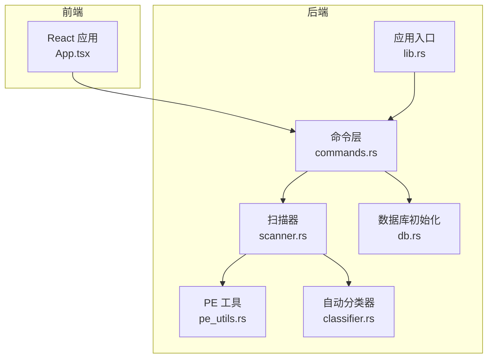
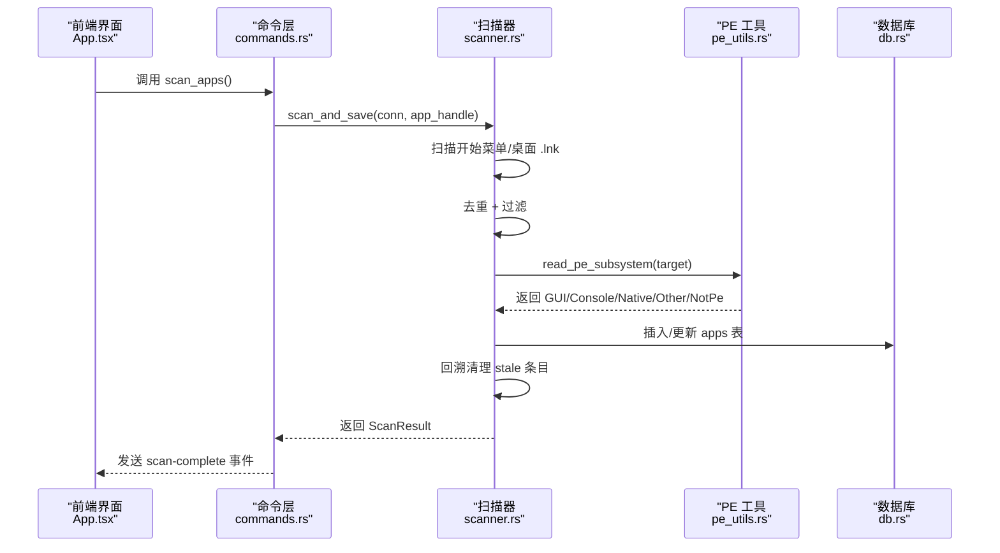
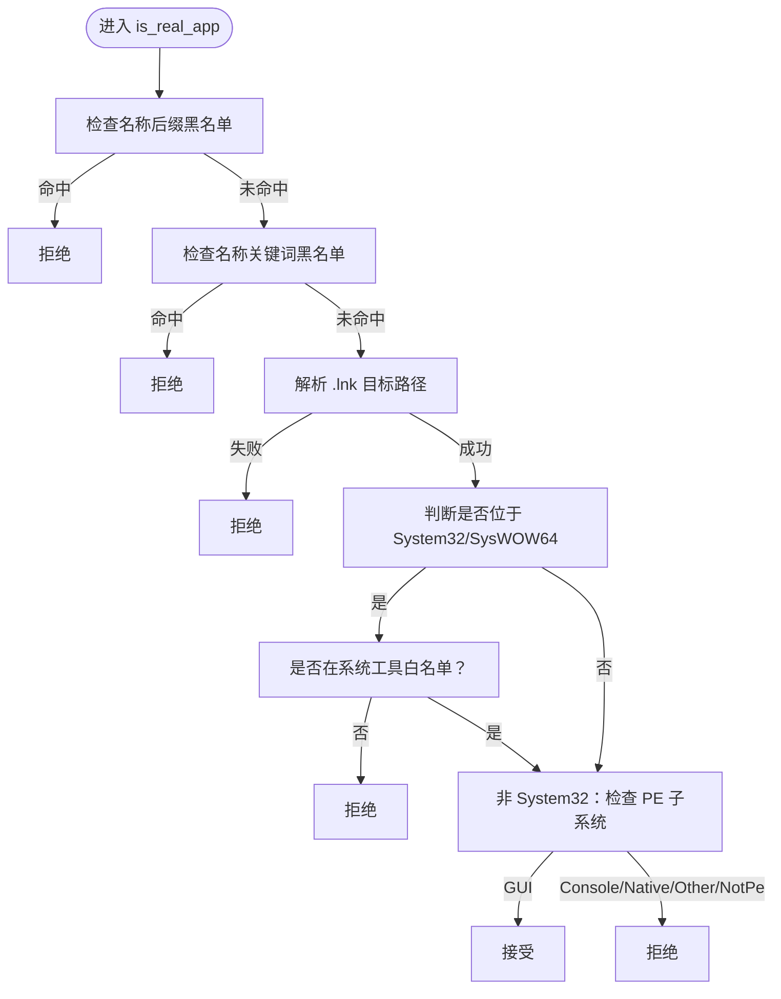
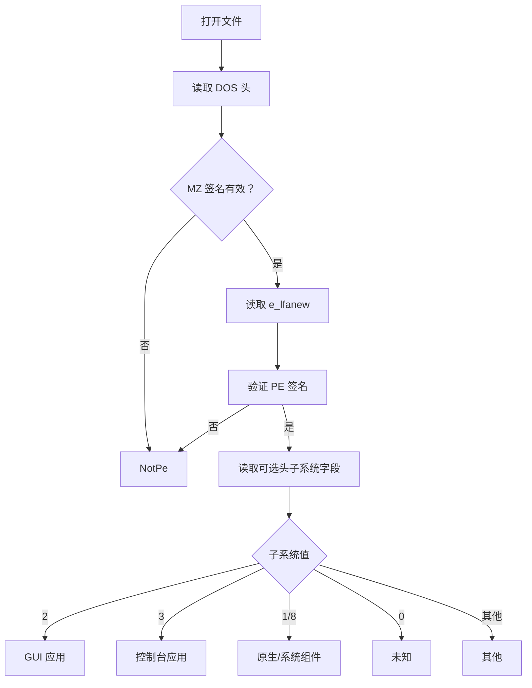
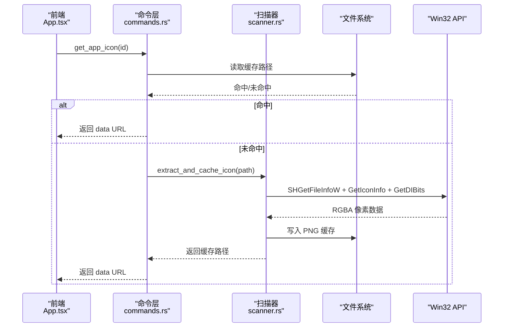
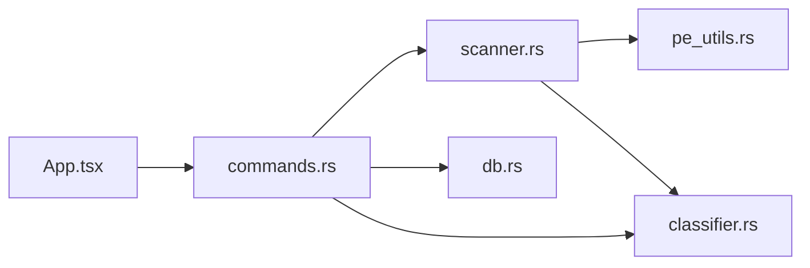

# 应用扫描器

<cite>
**本文引用的文件**
- [scanner.rs](file://src-tauri/src/scanner.rs)
- [pe_utils.rs](file://src-tauri/src/pe_utils.rs)
- [classifier.rs](file://src-tauri/src/classifier.rs)
- [commands.rs](file://src-tauri/src/commands.rs)
- [db.rs](file://src-tauri/src/db.rs)
- [lib.rs](file://src-tauri/src/lib.rs)
- [Cargo.toml](file://src-tauri/Cargo.toml)
- [main.rs](file://src-tauri/src/main.rs)
- [App.tsx](file://src/App.tsx)
- [tauri.conf.json](file://src-tauri/tauri.conf.json)
</cite>

## 目录
1. [简介](#简介)
2. [项目结构](#项目结构)
3. [核心组件](#核心组件)
4. [架构总览](#架构总览)
5. [详细组件分析](#详细组件分析)
6. [依赖关系分析](#依赖关系分析)
7. [性能考量](#性能考量)
8. [故障排查指南](#故障排查指南)
9. [结论](#结论)
10. [附录](#附录)

## 简介
本文件面向“应用扫描器”模块，系统性阐述 Windows 快捷方式扫描机制、三层过滤算法（PE GUI 检查、系统工具白名单、名称黑名单）、图标提取与缓存系统、扫描流程、过滤规则配置、性能优化策略与错误处理机制，并提供可扩展的自定义指南与调试方法。目标读者既包括开发者，也包括希望理解扫描行为与调优的高级用户。

## 项目结构
后端采用 Tauri + Rust，前端为 React。扫描器位于后端模块中，通过命令接口暴露给前端调用；数据库使用 SQLite，图标以 PNG 缓存至应用数据目录；前端负责发起扫描、接收结果、展示与交互。

图表来源
- [commands.rs:230-249](file://src-tauri/src/commands.rs#L230-L249)
- [scanner.rs:185-228](file://src-tauri/src/scanner.rs#L185-L228)
- [pe_utils.rs:37-104](file://src-tauri/src/pe_utils.rs#L37-L104)
- [classifier.rs:58-74](file://src-tauri/src/classifier.rs#L58-L74)
- [db.rs:17-133](file://src-tauri/src/db.rs#L17-L133)
- [lib.rs:96-131](file://src-tauri/src/lib.rs#L96-L131)

章节来源
- [lib.rs:22-95](file://src-tauri/src/lib.rs#L22-L95)
- [tauri.conf.json:1-54](file://src-tauri/tauri.conf.json#L1-L54)

## 核心组件
- 扫描器：负责扫描开始菜单与桌面快捷方式，解析 .lnk 目标，执行三层过滤，入库并回溯清理。
- PE 工具：读取 PE 文件子系统字段，区分 GUI/控制台/原生等类型。
- 自动分类器：基于关键词规则对应用进行自动分类。
- 命令层：提供扫描、获取图标、刷新图标、自动分类等命令。
- 数据库：维护应用、分类、设置、搜索历史等表。
- 图标提取与缓存：使用 Win32 API 提取图标并保存为 PNG，前端按需加载。

章节来源
- [scanner.rs:15-25](file://src-tauri/src/scanner.rs#L15-L25)
- [pe_utils.rs:19-31](file://src-tauri/src/pe_utils.rs#L19-L31)
- [classifier.rs:6-56](file://src-tauri/src/classifier.rs#L6-L56)
- [commands.rs:230-249](file://src-tauri/src/commands.rs#L230-L249)
- [db.rs:51-133](file://src-tauri/src/db.rs#L51-L133)

## 架构总览
后端通过 Tauri 注册命令，前端通过 invoke 调用命令；扫描器在后台线程执行，完成后通过事件通知前端刷新 UI。

图表来源
- [commands.rs:230-249](file://src-tauri/src/commands.rs#L230-L249)
- [scanner.rs:185-228](file://src-tauri/src/scanner.rs#L185-L228)
- [pe_utils.rs:37-104](file://src-tauri/src/pe_utils.rs#L37-L104)
- [db.rs:51-133](file://src-tauri/src/db.rs#L51-L133)

## 详细组件分析

### 扫描器与三层过滤
- 扫描范围：开始菜单（公共与当前用户）与桌面（公共与当前用户）。
- 去重策略：按名称小写去重，桌面优先覆盖开始菜单。
- 三层过滤（顺序执行，短路快速）：
  1) 名称后缀黑名单与关键词黑名单（最快速度，先检查）
  2) .lnk 目标解析与系统目录白名单（System32/ SysWOW64 仅保留白名单）
  3) PE 子系统检查（GUI/Console/Native/Other/NotPe）

图表来源
- [scanner.rs:102-153](file://src-tauri/src/scanner.rs#L102-L153)

章节来源
- [scanner.rs:185-228](file://src-tauri/src/scanner.rs#L185-L228)
- [scanner.rs:260-286](file://src-tauri/src/scanner.rs#L260-L286)
- [scanner.rs:102-153](file://src-tauri/src/scanner.rs#L102-L153)

### PE 子系统检测
- 仅读取 PE 头部必要字段，避免全文件扫描。
- 识别 GUI（2）、控制台（3）、原生（1/8）、未知或其他。
- 对非 PE 文件统一返回 NotPe。

图表来源
- [pe_utils.rs:37-104](file://src-tauri/src/pe_utils.rs#L37-L104)

章节来源
- [pe_utils.rs:19-31](file://src-tauri/src/pe_utils.rs#L19-L31)
- [pe_utils.rs:37-104](file://src-tauri/src/pe_utils.rs#L37-L104)

### 图标提取与缓存
- 提取策略：使用 Win32 API 获取大图标，读取位图像素，转换为 RGBA 并保存为 PNG。
- 缓存策略：按应用文件名生成缓存路径，若缓存存在且非空则直接返回。
- 前端按需加载：命令层返回 data URL，前端缓存到内存，避免重复请求。

图表来源
- [commands.rs:325-373](file://src-tauri/src/commands.rs#L325-L373)
- [scanner.rs:288-326](file://src-tauri/src/scanner.rs#L288-L326)
- [scanner.rs:328-407](file://src-tauri/src/scanner.rs#L328-L407)
- [scanner.rs:409-476](file://src-tauri/src/scanner.rs#L409-L476)

章节来源
- [scanner.rs:288-326](file://src-tauri/src/scanner.rs#L288-L326)
- [scanner.rs:328-407](file://src-tauri/src/scanner.rs#L328-L407)
- [scanner.rs:409-476](file://src-tauri/src/scanner.rs#L409-L476)
- [commands.rs:325-373](file://src-tauri/src/commands.rs#L325-L373)

### 自动分类器
- 规则：按类别关键词集合匹配应用名称与路径，按顺序返回首个匹配类别。
- 批量分类：查询未分类应用，逐条分类并同步到分类表。

章节来源
- [classifier.rs:6-56](file://src-tauri/src/classifier.rs#L6-L56)
- [classifier.rs:58-74](file://src-tauri/src/classifier.rs#L58-L74)
- [classifier.rs:76-114](file://src-tauri/src/classifier.rs#L76-L114)

### 命令与数据库
- 扫描命令：在后台线程执行，完成后写入最后扫描时间并发出事件。
- 图标命令：优先读取缓存，未命中则提取并回写缓存。
- 数据库初始化：创建应用、分类、文件夹、设置、聊天历史、搜索历史等表，并插入默认设置。

章节来源
- [commands.rs:230-249](file://src-tauri/src/commands.rs#L230-L249)
- [commands.rs:325-373](file://src-tauri/src/commands.rs#L325-L373)
- [db.rs:17-133](file://src-tauri/src/db.rs#L17-L133)

## 依赖关系分析
- 扫描器依赖 PE 工具进行子系统判断，依赖 lnk crate 解析 .lnk。
- 命令层依赖扫描器与分类器，依赖数据库进行持久化。
- 前端通过 Tauri 命令与后端交互，扫描完成后监听事件刷新 UI。

图表来源
- [scanner.rs:13-13](file://src-tauri/src/scanner.rs#L13-L13)
- [commands.rs:3-5](file://src-tauri/src/commands.rs#L3-L5)
- [db.rs:1-5](file://src-tauri/src/db.rs#L1-L5)
- [App.tsx:314-409](file://src/App.tsx#L314-L409)

章节来源
- [Cargo.toml:33-35](file://src-tauri/Cargo.toml#L33-L35)
- [lib.rs:96-131](file://src-tauri/src/lib.rs#L96-L131)

## 性能考量
- 扫描阶段
  - 仅扫描开始菜单与桌面两处，避免全盘扫描。
  - 一级过滤（名称后缀/关键词黑名单）在解析 .lnk 之前执行，减少后续开销。
  - 去重使用 HashMap，按名称小写键存储，桌面优先覆盖开始菜单。
  - 回溯清理：扫描完成后查询数据库中所有条目，删除不再符合过滤条件的旧条目，避免脏数据积累。
- 图标提取
  - 缓存命中直接返回，避免重复提取。
  - Win32 API 一次性读取位图像素并转换为 RGBA，减少多次系统调用。
- 前端加载
  - 可见应用列表变化时再加载图标，避免一次性加载全部。
  - 内存缓存失败标记，避免重复尝试。

章节来源
- [scanner.rs:185-228](file://src-tauri/src/scanner.rs#L185-L228)
- [scanner.rs:230-258](file://src-tauri/src/scanner.rs#L230-L258)
- [scanner.rs:288-326](file://src-tauri/src/scanner.rs#L288-L326)
- [scanner.rs:328-407](file://src-tauri/src/scanner.rs#L328-L407)
- [App.tsx:666-696](file://src/App.tsx#L666-L696)

## 故障排查指南
- 扫描无结果或结果异常
  - 检查扫描范围：确认开始菜单与桌面目录存在且可访问。
  - 检查过滤规则：确认名称黑名单/后缀黑名单未误伤目标应用。
  - 查看回溯清理：确认数据库中旧条目被正确删除。
- 图标提取失败
  - 检查缓存目录权限与空间。
  - 检查 .lnk 目标路径是否有效。
  - 检查 Win32 API 返回状态与错误信息。
- 前端图标不显示
  - 检查命令层返回的 data URL 是否为空。
  - 检查前端缓存失败标记是否被设置。
- 数据库问题
  - 检查初始化脚本是否执行成功。
  - 检查设置表默认值是否正确插入。

章节来源
- [scanner.rs:230-258](file://src-tauri/src/scanner.rs#L230-L258)
- [scanner.rs:288-326](file://src-tauri/src/scanner.rs#L288-L326)
- [commands.rs:325-373](file://src-tauri/src/commands.rs#L325-L373)
- [db.rs:17-133](file://src-tauri/src/db.rs#L17-L133)
- [App.tsx:666-696](file://src/App.tsx#L666-L696)

## 结论
本扫描器模块以三层过滤为核心，结合 PE 子系统检测与系统工具白名单，有效剔除非 GUI/系统工具类快捷方式；配合图标缓存与前端按需加载，兼顾准确性与性能。通过命令层与数据库的协同，实现了稳定的扫描、入库与回溯清理流程。建议在实际部署中根据业务场景调整过滤规则与缓存策略，并持续监控扫描与图标提取的稳定性。

## 附录

### 扫描流程与过滤规则配置
- 扫描入口与范围
  - 开始菜单：公共与当前用户目录
  - 桌面：公共与当前用户目录
- 过滤规则
  - 名称后缀黑名单：如 “ game center”、“ launcher” 等
  - 名称关键词黑名单：如 “uninstall”、“help”、“settings” 等
  - 系统工具白名单：System32/SysWOW64 下仅保留白名单应用
  - PE 子系统：仅保留 GUI 应用
- 配置位置
  - 黑名单与白名单常量定义于扫描器模块
  - 命令层提供设置读写接口，可用于动态控制自动分类等行为

章节来源
- [scanner.rs:31-94](file://src-tauri/src/scanner.rs#L31-L94)
- [commands.rs:398-415](file://src-tauri/src/commands.rs#L398-L415)

### 自定义过滤规则与扩展指南
- 自定义名称黑名单/后缀黑名单
  - 在扫描器模块中修改对应常量数组，注意大小写与语言（中英文）
- 自定义系统工具白名单
  - 在扫描器模块中修改白名单数组，谨慎增删
- 自定义 PE 子系统判定
  - 若需放宽/收紧 GUI 判定，可在 PE 工具模块调整子系统枚举与返回值
- 自动分类扩展
  - 在分类器模块中增加新的关键词规则，或引入外部分类模型
- 图标提取优化
  - 可考虑多尺寸缓存、预热策略或并发提取队列（需评估系统负载）

章节来源
- [scanner.rs:31-94](file://src-tauri/src/scanner.rs#L31-L94)
- [pe_utils.rs:19-31](file://src-tauri/src/pe_utils.rs#L19-L31)
- [classifier.rs:6-56](file://src-tauri/src/classifier.rs#L6-L56)

### 错误处理与调试建议
- 扫描阶段
  - 对 .lnk 解析失败、PE 读取失败、系统目录判断失败等情况进行短路返回
  - 记录失败原因并在前端提示
- 图标阶段
  - 对 Win32 API 调用失败、位图读取失败、PNG 写入失败进行捕获与降级
  - 前端对失败标记进行缓存，避免重复尝试
- 数据库阶段
  - 初始化失败时记录错误并尝试降级处理
  - 批量分类与设置更新使用事务，保证一致性

章节来源
- [scanner.rs:155-179](file://src-tauri/src/scanner.rs#L155-L179)
- [scanner.rs:328-407](file://src-tauri/src/scanner.rs#L328-L407)
- [db.rs:17-133](file://src-tauri/src/db.rs#L17-L133)