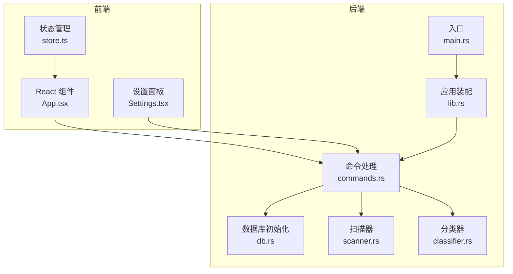
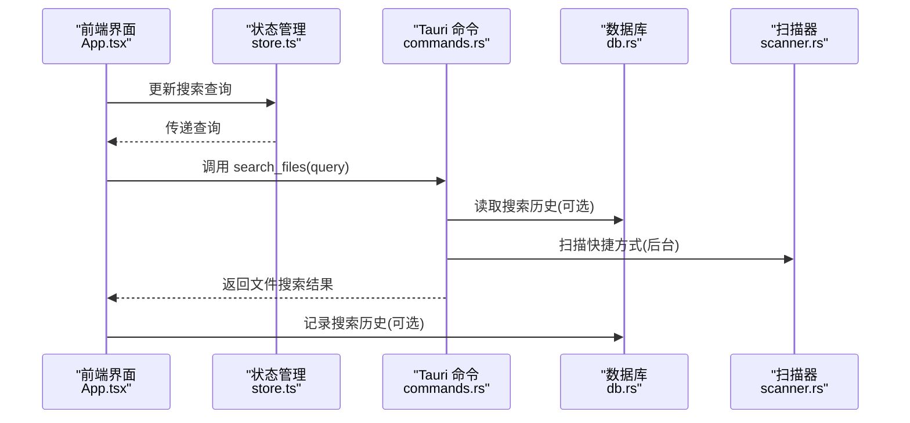
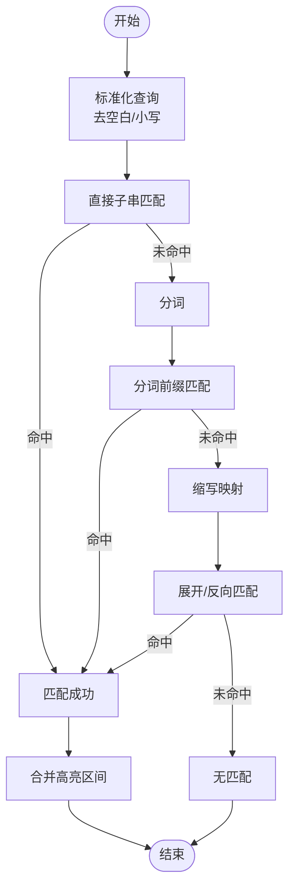
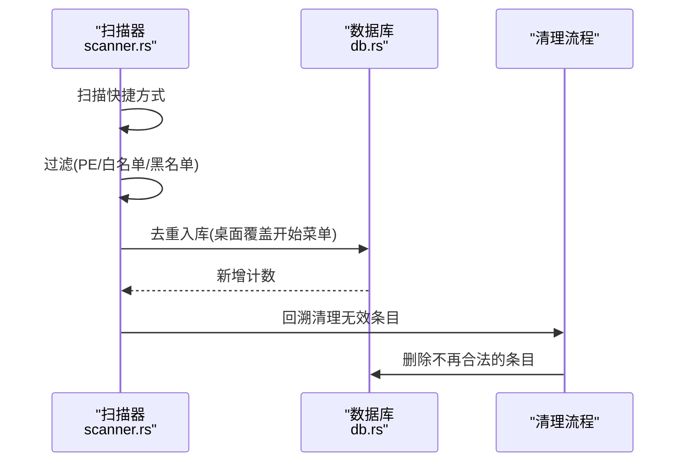
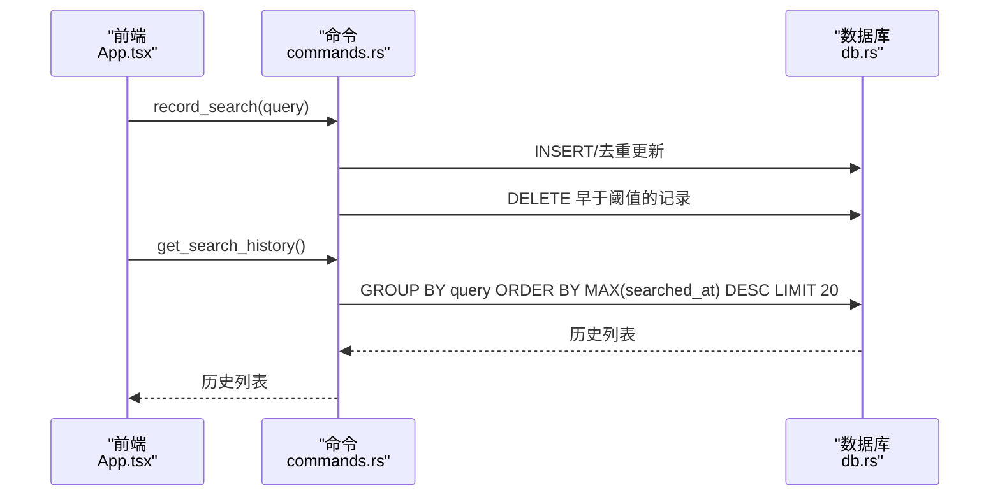
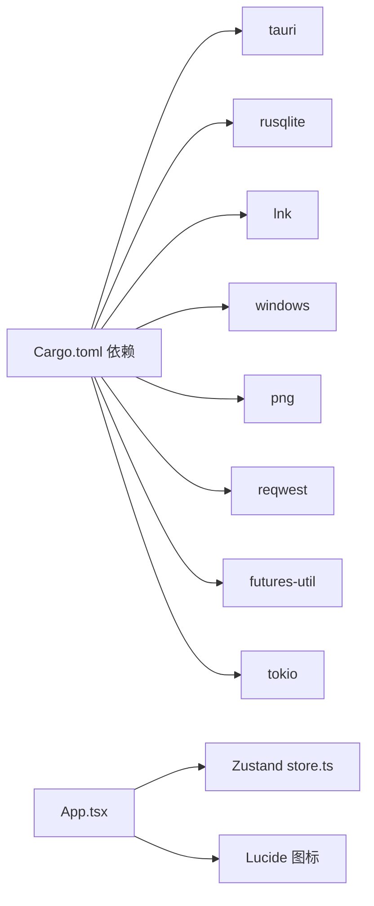

# 搜索系统

<cite>
**本文档引用的文件**
- [src-tauri/src/main.rs](file://src-tauri/src/main.rs)
- [src-tauri/src/lib.rs](file://src-tauri/src/lib.rs)
- [src-tauri/src/commands.rs](file://src-tauri/src/commands.rs)
- [src-tauri/src/db.rs](file://src-tauri/src/db.rs)
- [src-tauri/src/scanner.rs](file://src-tauri/src/scanner.rs)
- [src-tauri/src/classifier.rs](file://src-tauri/src/classifier.rs)
- [src/App.tsx](file://src/App.tsx)
- [src/store.ts](file://src/store.ts)
- [src/Settings.tsx](file://src/Settings.tsx)
- [src-tauri/Cargo.toml](file://src-tauri/Cargo.toml)
</cite>

## 目录
1. [简介](#简介)
2. [项目结构](#项目结构)
3. [核心组件](#核心组件)
4. [架构总览](#架构总览)
5. [详细组件分析](#详细组件分析)
6. [依赖关系分析](#依赖关系分析)
7. [性能考量](#性能考量)
8. [故障排查指南](#故障排查指南)
9. [结论](#结论)
10. [附录](#附录)

## 简介
本文件面向“搜索系统”的完整技术文档，聚焦以下主题：
- 模糊搜索与缩写识别算法
- 搜索索引构建与维护
- 性能优化策略与实时搜索
- 查询解析、匹配权重与排序
- 搜索配置选项、自定义规则、历史管理与用户体验优化
- 搜索 API 接口说明、性能调优指南与常见问题

## 项目结构
QuickStart 的搜索系统由前端 React 组件与后端 Tauri/Rust 命令两部分协作构成：
- 前端负责输入解析、实时搜索、高亮展示、键盘导航与交互体验
- 后端负责应用与文件扫描、数据库存储、搜索历史记录与检索

图表来源
- [src-tauri/src/main.rs:1-7](file://src-tauri/src/main.rs#L1-L7)
- [src-tauri/src/lib.rs:22-134](file://src-tauri/src/lib.rs#L22-L134)
- [src-tauri/src/commands.rs:32-131](file://src-tauri/src/commands.rs#L32-L131)
- [src-tauri/src/db.rs:17-133](file://src-tauri/src/db.rs#L17-L133)
- [src-tauri/src/scanner.rs:185-228](file://src-tauri/src/scanner.rs#L185-L228)
- [src-tauri/src/classifier.rs:6-115](file://src-tauri/src/classifier.rs#L6-L115)
- [src/App.tsx:274-800](file://src/App.tsx#L274-L800)
- [src/store.ts:1-46](file://src/store.ts#L1-L46)
- [src/Settings.tsx:14-123](file://src/Settings.tsx#L14-L123)

章节来源
- [src-tauri/src/main.rs:1-7](file://src-tauri/src/main.rs#L1-L7)
- [src-tauri/src/lib.rs:22-134](file://src-tauri/src/lib.rs#L22-L134)
- [src-tauri/src/commands.rs:32-131](file://src-tauri/src/commands.rs#L32-L131)
- [src-tauri/src/db.rs:17-133](file://src-tauri/src/db.rs#L17-L133)
- [src-tauri/src/scanner.rs:185-228](file://src-tauri/src/scanner.rs#L185-L228)
- [src-tauri/src/classifier.rs:6-115](file://src-tauri/src/classifier.rs#L6-L115)
- [src/App.tsx:274-800](file://src/App.tsx#L274-L800)
- [src/store.ts:1-46](file://src/store.ts#L1-L46)
- [src/Settings.tsx:14-123](file://src/Settings.tsx#L14-L123)

## 核心组件
- 搜索查询解析与匹配
  - 前端实现分词(tokenize)、缩写映射、高亮合并与区间合并
  - 匹配策略包含：直接子串、分词前缀、缩写展开与反向匹配
- 搜索历史管理
  - 记录、去重、限制数量与去重聚合
- 文件搜索
  - 用户目录下的桌面/下载/文档三处文件名模糊匹配
- 数据库与索引
  - SQLite 表结构、索引与迁移脚本
- 扫描与索引构建
  - 快捷方式扫描、过滤规则、图标提取与入库
- 自动分类
  - 基于关键词规则的自动分类与同步

章节来源
- [src/App.tsx:21-130](file://src/App.tsx#L21-L130)
- [src/App.tsx:436-482](file://src/App.tsx#L436-L482)
- [src-tauri/src/commands.rs:565-597](file://src-tauri/src/commands.rs#L565-L597)
- [src-tauri/src/commands.rs:453-488](file://src-tauri/src/commands.rs#L453-L488)
- [src-tauri/src/db.rs:40-133](file://src-tauri/src/db.rs#L40-L133)
- [src-tauri/src/scanner.rs:185-258](file://src-tauri/src/scanner.rs#L185-L258)
- [src-tauri/src/classifier.rs:6-115](file://src-tauri/src/classifier.rs#L6-L115)

## 架构总览
搜索系统采用“前端查询 + 后端索引/扫描”的双层架构：
- 前端负责用户输入、实时过滤、高亮与交互
- 后端负责应用/文件索引构建、搜索历史与设置管理

图表来源
- [src/App.tsx:412-424](file://src/App.tsx#L412-L424)
- [src-tauri/src/commands.rs:453-488](file://src-tauri/src/commands.rs#L453-L488)
- [src-tauri/src/commands.rs:565-597](file://src-tauri/src/commands.rs#L565-L597)
- [src-tauri/src/db.rs:40-49](file://src-tauri/src/db.rs#L40-L49)
- [src-tauri/src/scanner.rs:185-228](file://src-tauri/src/scanner.rs#L185-L228)

## 详细组件分析

### 搜索查询解析与匹配
- 分词策略
  - 按空格、连字符、点号与驼峰拆分，转小写
- 缩写识别
  - 常见缩写映射表，支持全名展开与反向匹配
- 匹配规则
  - 直接子串匹配（名称/路径/分类）
  - 分词前缀匹配（查询 token 与名称 token 前缀）
  - 缩写展开匹配（查询 token 属于缩写，名称包含展开词）
  - 缩写反向匹配（名称包含缩写，查询包含展开词的 token）
- 高亮合并
  - 合并多个匹配区间，避免重叠，生成带标记的高亮片段

图表来源
- [src/App.tsx:21-130](file://src/App.tsx#L21-L130)
- [src/App.tsx:436-482](file://src/App.tsx#L436-L482)

章节来源
- [src/App.tsx:21-130](file://src/App.tsx#L21-L130)
- [src/App.tsx:436-482](file://src/App.tsx#L436-L482)

### 模糊搜索算法与权重
- 匹配权重
  - 直接子串匹配权重最高
  - 分词前缀匹配次之
  - 缩写展开/反向匹配再次之
- 排序策略
  - 当前实现为前端过滤，未见显式排序权重计算
  - 建议在匹配后引入综合评分（基于命中类型、位置、长度等），并在 UI 中排序

章节来源
- [src/App.tsx:436-482](file://src/App.tsx#L436-L482)

### 缩写识别与扩展
- 缩写映射表包含常见开发/系统工具缩写与其全称
- 支持双向匹配：查询为缩写时展开匹配，名称为缩写时反向匹配

章节来源
- [src/App.tsx:32-47](file://src/App.tsx#L32-L47)

### 搜索索引构建与维护
- 应用索引
  - 扫描开始菜单与桌面快捷方式，解析 .lnk 目标，过滤系统工具与黑名单
  - 入库时去重，桌面项覆盖开始菜单项
  - 回溯清理：删除不再符合新过滤条件的旧条目
- 文件索引
  - 用户目录下的桌面/下载/文档三处文件名模糊匹配
- 数据库索引
  - 搜索历史表建立查询与时间索引

图表来源
- [src-tauri/src/scanner.rs:185-258](file://src-tauri/src/scanner.rs#L185-L258)
- [src-tauri/src/db.rs:40-49](file://src-tauri/src/db.rs#L40-L49)

章节来源
- [src-tauri/src/scanner.rs:185-258](file://src-tauri/src/scanner.rs#L185-L258)
- [src-tauri/src/db.rs:40-49](file://src-tauri/src/db.rs#L40-L49)

### 搜索历史管理
- 记录搜索历史
  - 去重：相同查询仅更新时间戳
  - 限制：最多保留最近 100 条
- 获取搜索历史
  - 去重聚合，按最近时间倒序，最多 20 条

图表来源
- [src-tauri/src/commands.rs:565-597](file://src-tauri/src/commands.rs#L565-L597)
- [src-tauri/src/db.rs:40-49](file://src-tauri/src/db.rs#L40-L49)

章节来源
- [src-tauri/src/commands.rs:565-597](file://src-tauri/src/commands.rs#L565-L597)
- [src-tauri/src/db.rs:40-49](file://src-tauri/src/db.rs#L40-L49)

### 文件搜索（桌面/下载/文档）
- 输入阈值：至少 2 个字符
- 异步延迟：200ms 防抖
- 结果上限：每类最多 20 条
- 过滤：隐藏以点开头与特定系统文件

章节来源
- [src-tauri/src/commands.rs:453-488](file://src-tauri/src/commands.rs#L453-L488)
- [src/App.tsx:412-424](file://src/App.tsx#L412-L424)

### 自动分类与自定义规则
- 关键词规则
  - 开发、办公、浏览器、娱乐、设计、通讯、系统工具等类别
- 批量分类
  - 对“未分类”应用按规则批量分类，并同步到分类表

章节来源
- [src-tauri/src/classifier.rs:6-115](file://src-tauri/src/classifier.rs#L6-L115)
- [src-tauri/src/commands.rs:376-390](file://src-tauri/src/commands.rs#L376-L390)

### 搜索 API 接口说明
- 前端调用命令
  - search_files(query): 返回文件搜索结果
  - record_search(query): 记录搜索历史
  - get_search_history(): 获取搜索历史
  - get_app_list()/get_categories()/get_folder_list(): 获取索引数据
  - scan_apps(): 触发扫描（异步）
  - get_setting()/set_setting(): 获取/设置配置
- 命令签名与行为
  - 命令注册与调用在应用装配阶段完成
  - 数据库连接通过 AppState 管理

章节来源
- [src-tauri/src/lib.rs:96-131](file://src-tauri/src/lib.rs#L96-L131)
- [src-tauri/src/commands.rs:453-488](file://src-tauri/src/commands.rs#L453-L488)
- [src-tauri/src/commands.rs:565-597](file://src-tauri/src/commands.rs#L565-L597)
- [src-tauri/src/commands.rs:398-415](file://src-tauri/src/commands.rs#L398-L415)

## 依赖关系分析
- Rust 依赖
  - tauri、rusqlite、lnk、windows、png、reqwest、futures-util、tokio 等
- 前端依赖
  - React、Lucide 图标、Zustand 状态管理

图表来源
- [src-tauri/Cargo.toml:15-36](file://src-tauri/Cargo.toml#L15-L36)
- [src-tauri/src/lib.rs:22-134](file://src-tauri/src/lib.rs#L22-L134)

章节来源
- [src-tauri/Cargo.toml:15-36](file://src-tauri/Cargo.toml#L15-L36)
- [src-tauri/src/lib.rs:22-134](file://src-tauri/src/lib.rs#L22-L134)

## 性能考量
- 前端性能
  - 实时搜索防抖：200ms
  - 分词与高亮：在内存中进行，建议对超长文本做截断
  - 图标缓存：避免重复提取，减少 IO
- 后端性能
  - 扫描与过滤：在后台线程执行，避免阻塞 UI
  - 数据库：建立索引，限制历史记录数量
  - 文件搜索：限定目录与结果上限，避免全盘扫描
- 建议优化
  - 引入综合评分与排序
  - 增加数据库全文索引或虚拟表（如 FTS5）
  - 增量扫描与缓存失效策略
  - 并发限制与取消机制（防抖中取消上一次请求）

[本节为通用性能指导，无需具体文件分析]

## 故障排查指南
- 搜索无结果
  - 检查扫描是否完成；若为空，触发扫描命令
  - 确认自动分类设置开启
- 历史记录异常
  - 检查数据库表结构与索引是否存在
  - 确认记录与清理逻辑是否正常执行
- 文件搜索不生效
  - 确认输入字符数≥2
  - 检查目录权限与路径有效性
- 图标加载失败
  - 检查缓存目录与权限
  - 确认 .lnk 目标路径有效

章节来源
- [src-tauri/src/commands.rs:376-390](file://src-tauri/src/commands.rs#L376-L390)
- [src-tauri/src/db.rs:40-49](file://src-tauri/src/db.rs#L40-L49)
- [src-tauri/src/commands.rs:453-488](file://src-tauri/src/commands.rs#L453-L488)
- [src-tauri/src/scanner.rs:288-326](file://src-tauri/src/scanner.rs#L288-L326)

## 结论
QuickStart 的搜索系统通过前后端协同实现了高效、易用的桌面应用与文件检索体验。前端提供直观的输入与高亮反馈，后端通过扫描与数据库索引保障了稳定的检索能力。建议后续引入综合评分与排序、全文索引与增量更新，进一步提升性能与准确性。

[本节为总结性内容，无需具体文件分析]

## 附录

### 搜索配置选项
- 自动分类开关：控制扫描后是否自动分类
- 主题设置：跟随系统/浅色/深色
- 快捷键：全局热键 Alt+Space
- AI 配置：提供商、API Key、基础地址、模型

章节来源
- [src-tauri/src/db.rs:119-129](file://src-tauri/src/db.rs#L119-L129)
- [src/Settings.tsx:14-123](file://src/Settings.tsx#L14-L123)

### 自定义搜索规则
- 缩写映射：可在前端映射表中扩展
- 分类规则：可在分类器规则集中扩展类别与关键词

章节来源
- [src/App.tsx:32-47](file://src/App.tsx#L32-L47)
- [src-tauri/src/classifier.rs:6-115](file://src-tauri/src/classifier.rs#L6-L115)