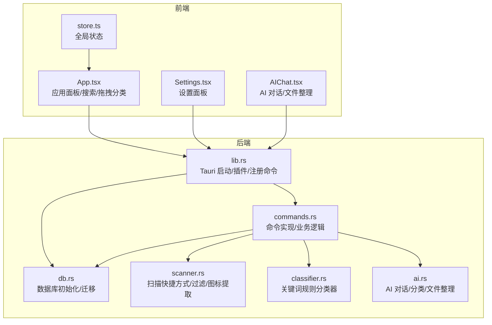
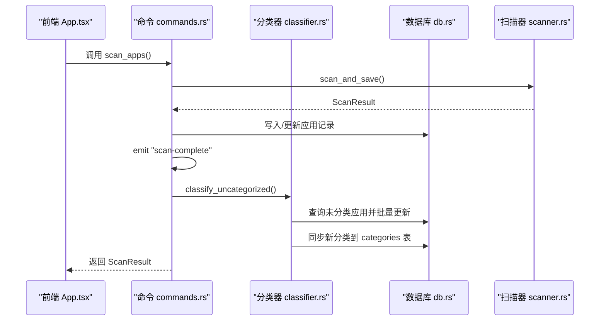
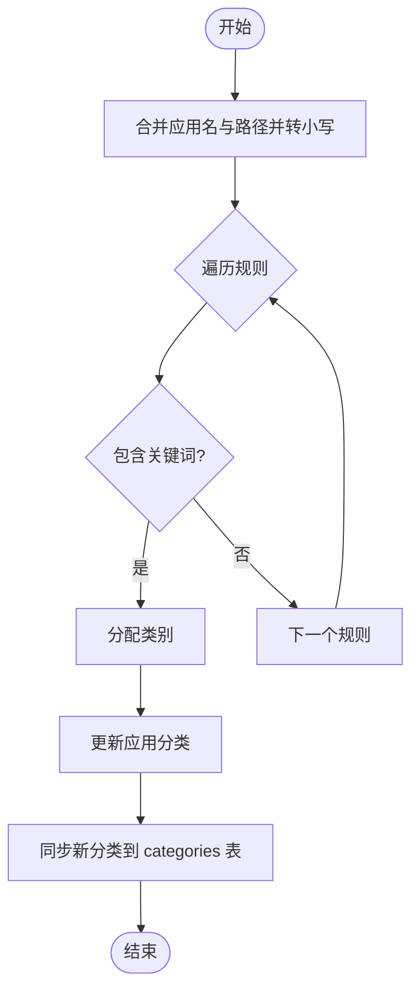
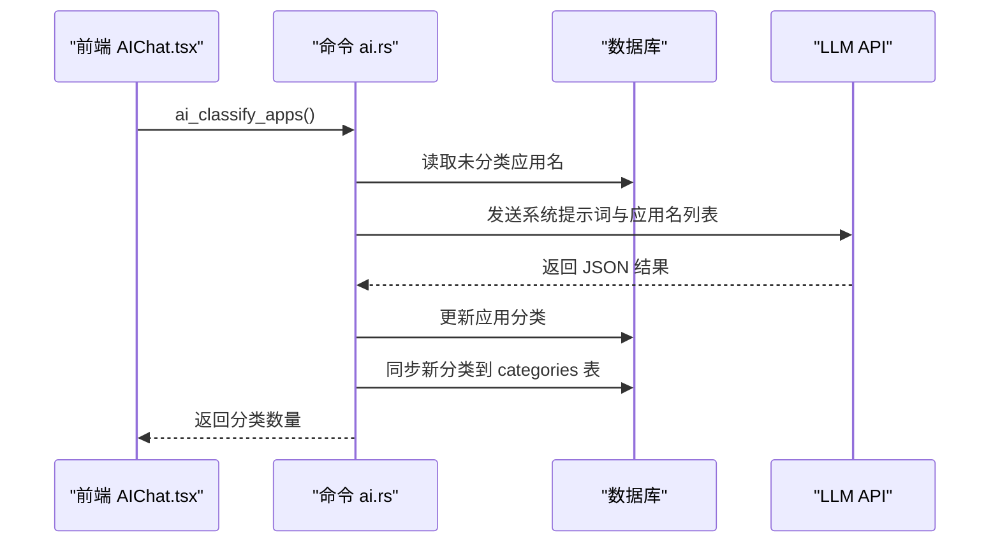
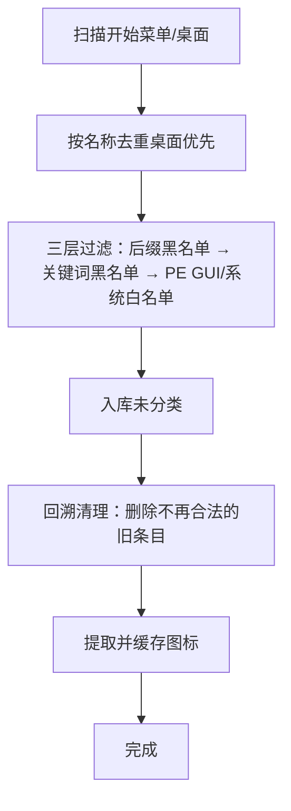
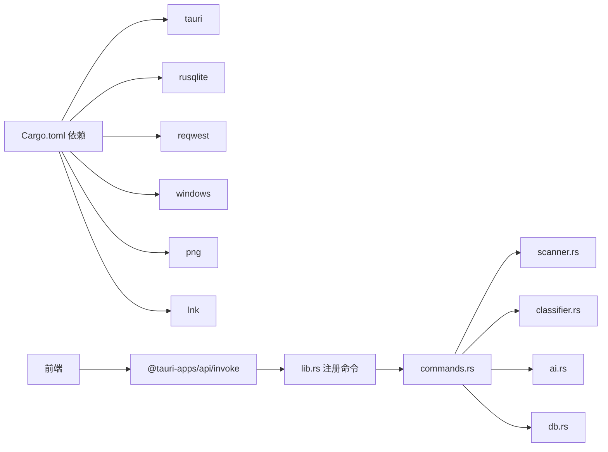

# 智能分类系统

<cite>
**本文引用的文件**
- [classifier.rs](file://src-tauri/src/classifier.rs)
- [ai.rs](file://src-tauri/src/ai.rs)
- [commands.rs](file://src-tauri/src/commands.rs)
- [db.rs](file://src-tauri/src/db.rs)
- [lib.rs](file://src-tauri/src/lib.rs)
- [scanner.rs](file://src-tauri/src/scanner.rs)
- [Cargo.toml](file://src-tauri/Cargo.toml)
- [App.tsx](file://src/App.tsx)
- [Settings.tsx](file://src/Settings.tsx)
- [AIChat.tsx](file://src/AIChat.tsx)
- [store.ts](file://src/store.ts)
</cite>

## 目录
1. [简介](#简介)
2. [项目结构](#项目结构)
3. [核心组件](#核心组件)
4. [架构总览](#架构总览)
5. [详细组件分析](#详细组件分析)
6. [依赖关系分析](#依赖关系分析)
7. [性能考量](#性能考量)
8. [故障排除指南](#故障排除指南)
9. [结论](#结论)
10. [附录](#附录)

## 简介
本系统是一个基于 Rust + Tauri 的 Windows 桌面智能分类与启动器，提供自动分类、规则配置、手动调整、批量分类、AI 辅助分类、文件整理与设置管理等功能。系统采用“关键词规则 + LLM”的双通道分类策略，既保证稳定性和可解释性，又具备扩展能力。

## 项目结构
系统采用前后端分离的架构：
- 前端：React + TypeScript，负责 UI、交互、状态管理与调用后端命令
- 后端：Tauri + Rust，负责数据库、扫描、分类、AI 对话与系统集成
- 数据库：SQLite（rusqlite），存储应用、分类、设置、搜索历史等

图表来源
- [lib.rs:22-134](file://src-tauri/src/lib.rs#L22-L134)
- [commands.rs:1-709](file://src-tauri/src/commands.rs#L1-L709)
- [db.rs:16-133](file://src-tauri/src/db.rs#L16-L133)
- [scanner.rs:185-228](file://src-tauri/src/scanner.rs#L185-L228)
- [classifier.rs:1-116](file://src-tauri/src/classifier.rs#L1-L116)
- [ai.rs:59-254](file://src-tauri/src/ai.rs#L59-L254)

章节来源
- [lib.rs:22-134](file://src-tauri/src/lib.rs#L22-L134)
- [Cargo.toml:1-36](file://src-tauri/Cargo.toml#L1-L36)

## 核心组件
- 分类器（关键词规则）：基于预定义关键词规则进行分类，支持批量处理未分类应用
- AI 分类与对话：支持 OpenAI、Claude、Ollama、自定义兼容接口；提供流式对话与文件整理能力
- 扫描器：扫描开始菜单与桌面快捷方式，过滤系统工具与垃圾项，入库并生成图标缓存
- 命令系统：统一暴露命令给前端调用，封装数据库访问、设置读取与更新、应用/文件夹管理
- 设置面板：集中管理主题、开机自启、自动分类开关、AI 提供商与模型等

章节来源
- [classifier.rs:1-116](file://src-tauri/src/classifier.rs#L1-L116)
- [ai.rs:59-254](file://src-tauri/src/ai.rs#L59-L254)
- [scanner.rs:185-228](file://src-tauri/src/scanner.rs#L185-L228)
- [commands.rs:1-709](file://src-tauri/src/commands.rs#L1-L709)
- [Settings.tsx:14-165](file://src/Settings.tsx#L14-L165)

## 架构总览
系统通过 Tauri 将前端与后端桥接，前端通过 invoke 调用后端命令，后端通过 rusqlite 访问 SQLite 数据库，结合扫描器、分类器与 AI 模块完成完整的分类与管理流程。

图表来源
- [commands.rs:230-249](file://src-tauri/src/commands.rs#L230-L249)
- [scanner.rs:185-228](file://src-tauri/src/scanner.rs#L185-L228)
- [classifier.rs:76-115](file://src-tauri/src/classifier.rs#L76-L115)
- [db.rs:16-133](file://src-tauri/src/db.rs#L16-L133)

## 详细组件分析

### 分类器（关键词规则）
- 规则结构：按类别维护关键词列表，按顺序匹配，命中即分类
- 分类逻辑：对应用名与路径统一转小写并拼接，逐条规则匹配
- 批量分类：查询未分类应用，逐条分类并同步新分类到 categories 表

图表来源
- [classifier.rs:58-74](file://src-tauri/src/classifier.rs#L58-L74)
- [classifier.rs:76-115](file://src-tauri/src/classifier.rs#L76-L115)

章节来源
- [classifier.rs:1-116](file://src-tauri/src/classifier.rs#L1-L116)

### AI 分类与对话
- AI 对话：支持 OpenAI、Claude、Ollama、自定义兼容接口；流式事件推送（ai:token/ai:done）
- AI 分类：从数据库读取未分类应用名，构造系统提示词，调用模型返回 JSON，解析后批量更新分类并同步新分类
- 文件整理：提供 organize_folder 命令，限制为移动文件，不删除/重命名，避免风险

图表来源
- [ai.rs:369-460](file://src-tauri/src/ai.rs#L369-L460)
- [AIChat.tsx:83-159](file://src/AIChat.tsx#L83-L159)

章节来源
- [ai.rs:59-254](file://src-tauri/src/ai.rs#L59-L254)
- [ai.rs:369-460](file://src-tauri/src/ai.rs#L369-L460)
- [AIChat.tsx:14-278](file://src/AIChat.tsx#L14-L278)

### 扫描器与图标缓存
- 扫描逻辑：扫描开始菜单与桌面快捷方式，去重后三层过滤（PE GUI 检查、系统白名单、名称黑名单）
- 过滤策略：先后缀再关键词，System32 仅保留白名单，PE subsystem 仅保留 GUI 应用
- 图标缓存：Win32 API 提取图标并缓存为 PNG，避免重复提取

图表来源
- [scanner.rs:185-228](file://src-tauri/src/scanner.rs#L185-L228)
- [scanner.rs:96-153](file://src-tauri/src/scanner.rs#L96-L153)
- [scanner.rs:288-326](file://src-tauri/src/scanner.rs#L288-L326)

章节来源
- [scanner.rs:185-228](file://src-tauri/src/scanner.rs#L185-L228)
- [scanner.rs:96-153](file://src-tauri/src/scanner.rs#L96-L153)
- [scanner.rs:288-326](file://src-tauri/src/scanner.rs#L288-L326)

### 命令系统与数据库
- 命令注册：统一在 lib.rs 中注册，前端通过 invoke 调用
- 数据库初始化：创建应用、分类、文件夹、设置、搜索历史等表，迁移与默认值
- 设置管理：集中读取/写入 settings 表，支持热更新（如主题）

章节来源
- [lib.rs:96-131](file://src-tauri/src/lib.rs#L96-L131)
- [db.rs:16-133](file://src-tauri/src/db.rs#L16-L133)
- [commands.rs:398-415](file://src-tauri/src/commands.rs#L398-L415)

### 前端交互与状态
- 应用面板：支持搜索、拖拽分类、固定应用、启动应用、记录使用次数
- 设置面板：主题、开机自启、自动分类开关、AI 提供商与模型配置
- AI 聊天：流式对话、语音输入、安全规则与文件整理指令

章节来源
- [App.tsx:274-800](file://src/App.tsx#L274-L800)
- [Settings.tsx:14-165](file://src/Settings.tsx#L14-L165)
- [AIChat.tsx:14-278](file://src/AIChat.tsx#L14-L278)
- [store.ts:1-46](file://src/store.ts#L1-L46)

## 依赖关系分析
- Rust 依赖：tauri、rusqlite、reqwest、futures、windows、png、lnk 等
- 前端依赖：@tauri-apps/api、lucide-react、zustand 等
- 命令耦合：commands.rs 作为业务中枢，依赖 scanner、classifier、ai 与 db

图表来源
- [Cargo.toml:15-36](file://src-tauri/Cargo.toml#L15-L36)
- [lib.rs:96-131](file://src-tauri/src/lib.rs#L96-L131)

章节来源
- [Cargo.toml:15-36](file://src-tauri/Cargo.toml#L15-L36)
- [lib.rs:96-131](file://src-tauri/src/lib.rs#L96-L131)

## 性能考量
- 扫描性能：三层过滤减少 IO 与解析开销；桌面优先去重避免重复入库
- 图标缓存：Win32 API 直接提取并缓存 PNG，避免重复提取与 shell 进程开销
- 批量分类：一次性查询未分类应用，批量更新并同步分类，减少多次往返
- AI 分类：限制温度与最大 token，避免长对话带来的延迟
- 前端渲染：虚拟滚动与图标懒加载，避免大量 DOM 渲染压力

## 故障排除指南
- 扫描失败：检查权限与路径有效性，确认 %USERPROFILE% 等环境变量可用
- 图标提取失败：检查目标文件是否存在，确认缓存目录可写
- AI 请求失败：核对 API Key、Base URL、模型名称；检查网络与代理设置
- 分类不准确：调整关键词规则或开启 AI 分类；必要时手动调整分类
- 自动分类未生效：检查设置中的“自动分类”开关
- 数据库异常：备份 quickstart.db，重新初始化或修复表结构

章节来源
- [scanner.rs:288-326](file://src-tauri/src/scanner.rs#L288-L326)
- [ai.rs:59-254](file://src-tauri/src/ai.rs#L59-L254)
- [commands.rs:375-390](file://src-tauri/src/commands.rs#L375-L390)
- [db.rs:16-133](file://src-tauri/src/db.rs#L16-L133)

## 结论
本系统通过“关键词规则 + LLM”的双通道分类策略，在保证稳定性的同时提供了强大的扩展能力。前端交互简洁直观，后端命令与数据库设计清晰，适合个人与团队的桌面应用管理与智能分类需求。建议持续优化关键词规则与提示词，结合用户反馈迭代分类准确性，并在生产环境中加强日志与监控。

## 附录

### 使用示例与最佳实践
- 首次使用：执行一次全量扫描，系统会自动分类未分类应用并尝试 AI 分类
- 手动调整：在应用面板右键或拖拽到对应分类标签页，即时更新分类
- 批量分类：在设置中开启“自动分类”，扫描完成后自动批量处理
- AI 辅助：在设置中配置 AI 提供商与模型，使用 AI 聊天进行应用分类与文件整理
- 规则优化：根据实际应用名称扩展关键词规则，提升分类准确率

### 分类规则编辑与管理
- 关键词规则：在分类器中维护关键词列表，按类别组织
- 分类同步：批量分类后自动同步新分类到 categories 表，避免重复
- 分类面板：前端展示分类列表，支持新建/删除分类（保留“全部”）

章节来源
- [classifier.rs:1-116](file://src-tauri/src/classifier.rs#L1-L116)
- [commands.rs:31-89](file://src-tauri/src/commands.rs#L31-L89)
- [App.tsx:427-433](file://src/App.tsx#L427-L433)