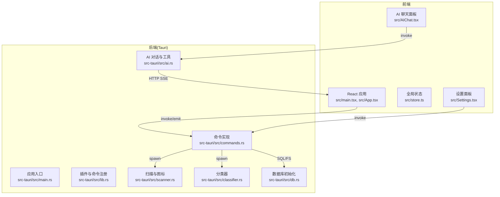
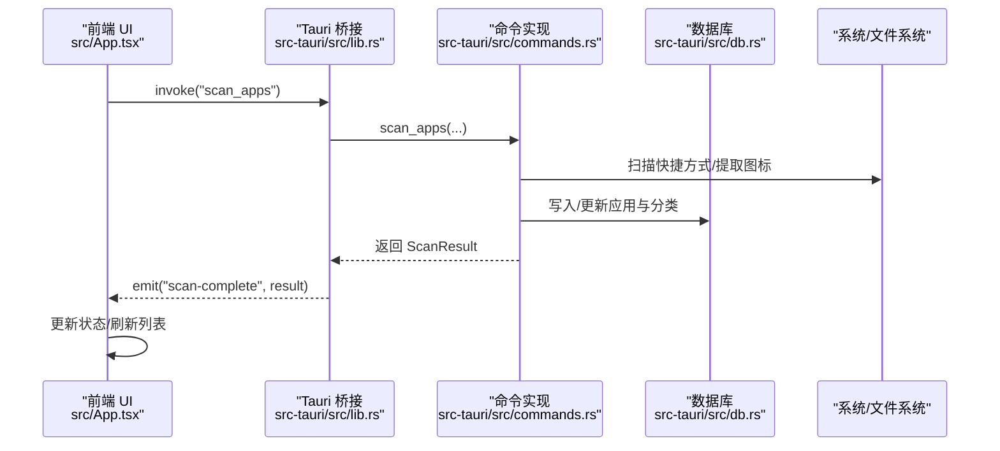
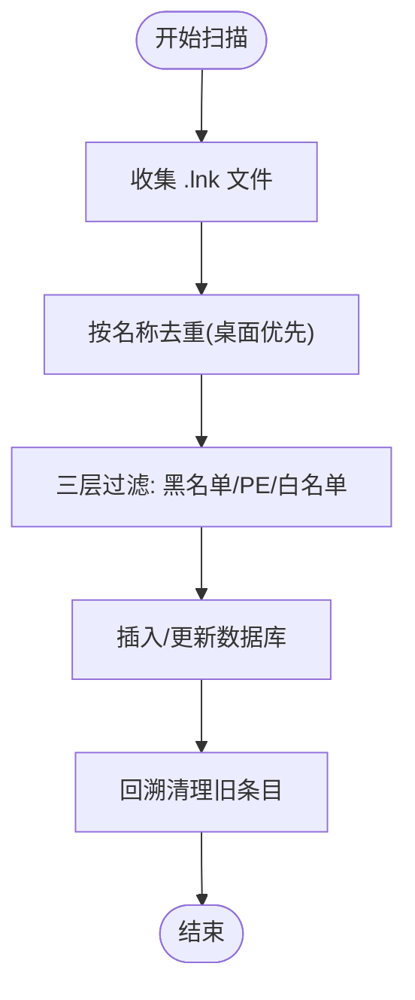
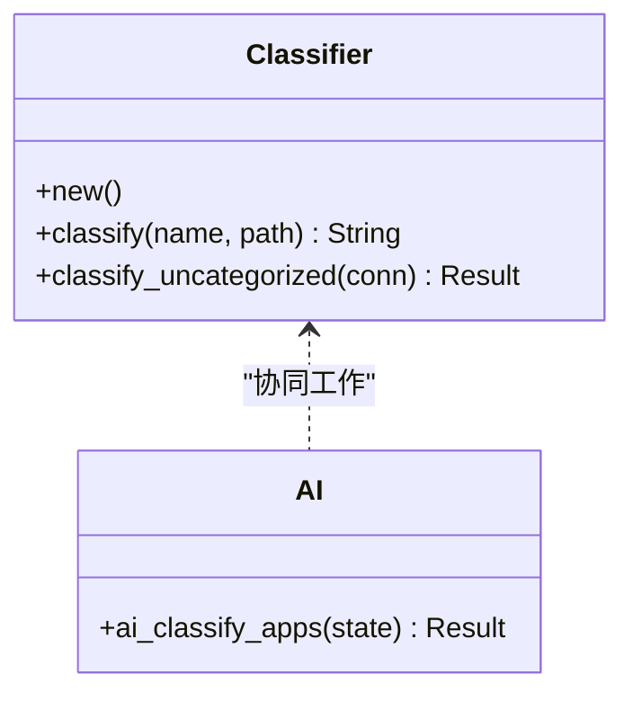
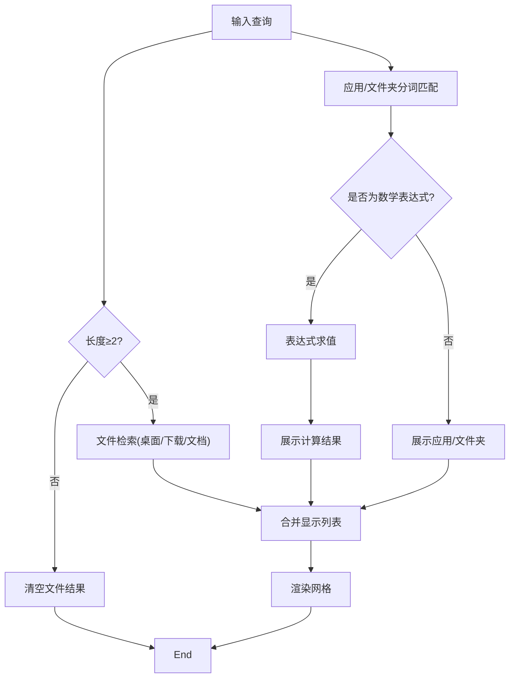
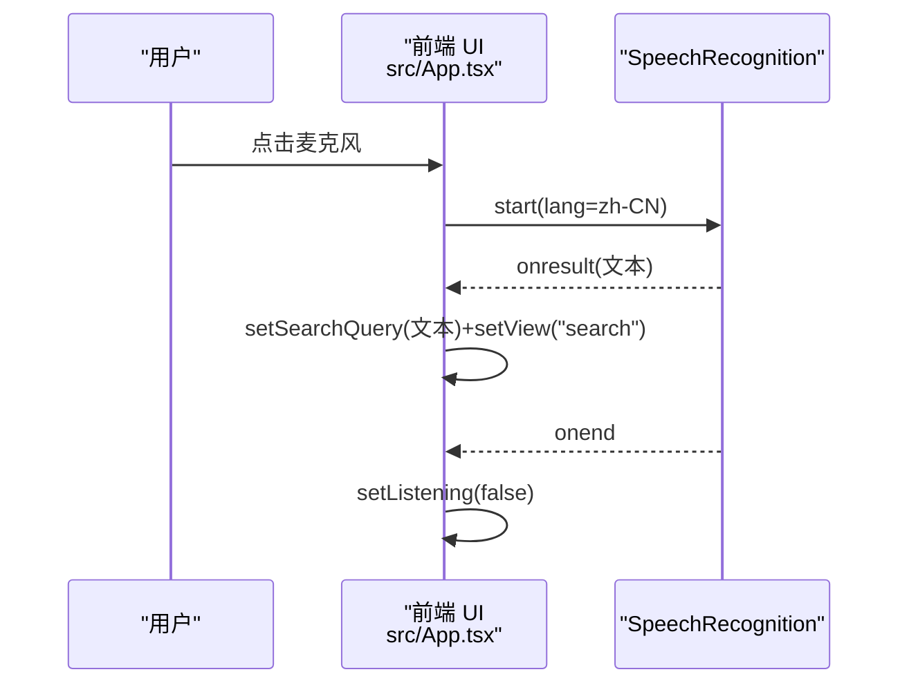
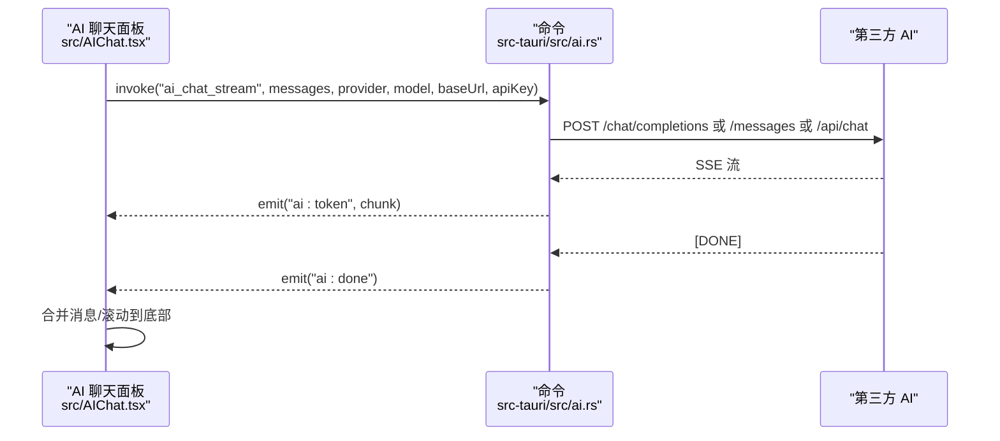
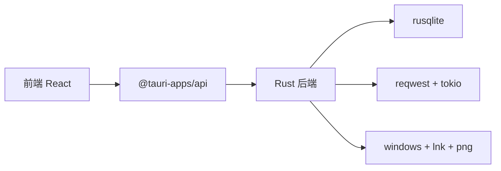

# 核心功能模块

<cite>
**本文引用的文件**
- [src/App.tsx](file://src/App.tsx)
- [src/main.tsx](file://src/main.tsx)
- [src/store.ts](file://src/store.ts)
- [src/Settings.tsx](file://src/Settings.tsx)
- [src/AIChat.tsx](file://src/AIChat.tsx)
- [src-tauri/src/lib.rs](file://src-tauri/src/lib.rs)
- [src-tauri/src/main.rs](file://src-tauri/src/main.rs)
- [src-tauri/src/commands.rs](file://src-tauri/src/commands.rs)
- [src-tauri/src/scanner.rs](file://src-tauri/src/scanner.rs)
- [src-tauri/src/classifier.rs](file://src-tauri/src/classifier.rs)
- [src-tauri/src/ai.rs](file://src-tauri/src/ai.rs)
- [src-tauri/src/db.rs](file://src-tauri/src/db.rs)
- [src-tauri/Cargo.toml](file://src-tauri/Cargo.toml)
- [src-tauri/tauri.conf.json](file://src-tauri/tauri.conf.json)
</cite>

## 目录
1. [简介](#简介)
2. [项目结构](#项目结构)
3. [核心组件](#核心组件)
4. [架构总览](#架构总览)
5. [详细组件分析](#详细组件分析)
6. [依赖分析](#依赖分析)
7. [性能考虑](#性能考虑)
8. [故障排查指南](#故障排查指南)
9. [结论](#结论)
10. [附录](#附录)

## 简介
QuickStart 是一款 Windows 桌面快捷启动器，提供应用扫描与索引、智能分类、搜索与文件检索、语音输入以及 AI 聊天助手等核心能力。前端基于 React + Tauri，后端 Rust 实现跨平台系统调用、数据库持久化与 AI 对话流式传输。

## 项目结构
- 前端
  - React 应用入口与主界面：src/main.tsx、src/App.tsx
  - 全局状态：src/store.ts
  - 设置面板：src/Settings.tsx
  - AI 聊天面板：src/AIChat.tsx
- 后端（Tauri Rust）
  - 应用入口与插件注册：src-tauri/src/main.rs、src-tauri/src/lib.rs
  - 命令与数据库交互：src-tauri/src/commands.rs
  - 扫描与图标提取：src-tauri/src/scanner.rs
  - 关键词分类器：src-tauri/src/classifier.rs
  - AI 对话与工具：src-tauri/src/ai.rs
  - 数据库初始化与迁移：src-tauri/src/db.rs
  - 依赖与构建配置：src-tauri/Cargo.toml、src-tauri/tauri.conf.json

图表来源
- [src-tauri/src/lib.rs:22-134](file://src-tauri/src/lib.rs#L22-L134)
- [src-tauri/src/commands.rs:1-709](file://src-tauri/src/commands.rs#L1-L709)
- [src-tauri/src/scanner.rs:1-483](file://src-tauri/src/scanner.rs#L1-L483)
- [src-tauri/src/classifier.rs:1-116](file://src-tauri/src/classifier.rs#L1-L116)
- [src-tauri/src/ai.rs:1-501](file://src-tauri/src/ai.rs#L1-L501)
- [src-tauri/src/db.rs:1-107](file://src-tauri/src/db.rs#L1-L107)
- [src/App.tsx:274-800](file://src/App.tsx#L274-L800)
- [src/AIChat.tsx:14-278](file://src/AIChat.tsx#L14-L278)

章节来源
- [src-tauri/src/lib.rs:22-134](file://src-tauri/src/lib.rs#L22-L134)
- [src-tauri/src/commands.rs:1-709](file://src-tauri/src/commands.rs#L1-L709)
- [src-tauri/src/db.rs:1-107](file://src-tauri/src/db.rs#L1-L107)

## 核心组件
- 应用扫描器：扫描开始菜单与桌面快捷方式，过滤系统工具与垃圾项，提取图标并入库。
- 智能分类系统：关键词分类器与 AI 分类协同，支持自动分类与手动调整。
- 搜索功能：应用/文件/文件夹三路检索，支持分词与缩写映射，实时文件检索。
- 语音输入：Web Speech API 识别，支持中英文，与搜索框联动。
- AI 聊天：多提供商流式对话，内置安全与整理规则，支持列出目录、移动文件等工具。

章节来源
- [src-tauri/src/scanner.rs:96-228](file://src-tauri/src/scanner.rs#L96-L228)
- [src-tauri/src/classifier.rs:6-116](file://src-tauri/src/classifier.rs#L6-L116)
- [src-tauri/src/ai.rs:354-460](file://src-tauri/src/ai.rs#L354-L460)
- [src-tauri/src/commands.rs:445-488](file://src-tauri/src/commands.rs#L445-L488)
- [src/App.tsx:249-261](file://src/App.tsx#L249-L261)
- [src/AIChat.tsx:14-278](file://src/AIChat.tsx#L14-L278)

## 架构总览
QuickStart 采用“前端 UI + Tauri 桥接 + Rust 命令 + SQLite 数据库”的分层架构。前端通过 invoke 调用后端命令，后端通过 spawn_blocking 执行耗时任务，通过事件流式回传 AI 结果；数据库负责持久化应用、分类、设置与搜索历史。

图表来源
- [src-tauri/src/lib.rs:96-131](file://src-tauri/src/lib.rs#L96-L131)
- [src-tauri/src/commands.rs:230-249](file://src-tauri/src/commands.rs#L230-L249)
- [src-tauri/src/scanner.rs:185-228](file://src-tauri/src/scanner.rs#L185-L228)
- [src-tauri/src/db.rs:51-107](file://src-tauri/src/db.rs#L51-L107)

## 详细组件分析

### 应用扫描器
- 过滤策略
  - 名称黑名单与后缀黑名单快速剔除
  - PE 子系统检查（GUI/控制台/原生/其他）
  - System32 白名单限定
- 扫描范围
  - 开始菜单与桌面快捷方式，按名称去重，桌面优先
- 图标提取
  - Win32 API 直接提取大图标为 PNG 并缓存
- 数据入库
  - 未分类默认归入“未分类”，回溯清理不再合法的条目

图表来源
- [src-tauri/src/scanner.rs:185-258](file://src-tauri/src/scanner.rs#L185-L258)

章节来源
- [src-tauri/src/scanner.rs:96-228](file://src-tauri/src/scanner.rs#L96-L228)
- [src-tauri/src/commands.rs:91-142](file://src-tauri/src/commands.rs#L91-L142)

### 智能分类系统
- 关键词分类器
  - 按类别关键词集合进行前缀/包含匹配，未命中归为“其他”
- AI 分类
  - 从设置读取提供商与密钥，批量请求 LLM，解析 JSON，更新未分类应用
- 自动分类开关
  - 通过设置项控制扫描后是否自动执行关键词与 AI 分类

图表来源
- [src-tauri/src/classifier.rs:6-116](file://src-tauri/src/classifier.rs#L6-L116)
- [src-tauri/src/ai.rs:369-460](file://src-tauri/src/ai.rs#L369-L460)

章节来源
- [src-tauri/src/classifier.rs:6-116](file://src-tauri/src/classifier.rs#L6-L116)
- [src-tauri/src/ai.rs:354-460](file://src-tauri/src/ai.rs#L354-L460)
- [src-tauri/src/commands.rs:375-390](file://src-tauri/src/commands.rs#L375-L390)

### 搜索功能
- 应用搜索
  - 分词与缩写映射，支持名称/路径/分类直接匹配与前缀匹配
- 文件搜索
  - 桌面/下载/文档目录实时检索，限制结果数量
- 计算器
  - 简易表达式解析（加减乘除百分比括号），防除零与非法字符

图表来源
- [src/App.tsx:412-424](file://src/App.tsx#L412-L424)
- [src/App.tsx:435-482](file://src/App.tsx#L435-L482)
- [src/App.tsx:492-515](file://src/App.tsx#L492-L515)
- [src/App.tsx:484-503](file://src/App.tsx#L484-L503)
- [src-tauri/src/commands.rs:445-488](file://src-tauri/src/commands.rs#L445-L488)

章节来源
- [src/App.tsx:21-130](file://src/App.tsx#L21-L130)
- [src/App.tsx:435-482](file://src/App.tsx#L435-L482)
- [src-tauri/src/commands.rs:445-488](file://src-tauri/src/commands.rs#L445-L488)

### 语音输入
- Web Speech API 识别（zh-CN），一次性结果
- 与搜索框联动：开始识别时切换视图为搜索，识别完成后填充输入框并停止

图表来源
- [src/App.tsx:249-261](file://src/App.tsx#L249-L261)

章节来源
- [src/App.tsx:249-261](file://src/App.tsx#L249-L261)

### AI 聊天
- 多提供商支持：OpenAI、Claude、Ollama、自定义 OpenAI 兼容
- 流式输出：SSE 解析，事件名“ai:token”与“ai:done”
- 安全与规则：内置安全规则与文件整理规则，限制路径范围
- 工具函数：列出目录、移动文件、获取应用列表

图表来源
- [src-tauri/src/ai.rs:60-254](file://src-tauri/src/ai.rs#L60-L254)
- [src/AIChat.tsx:83-159](file://src/AIChat.tsx#L83-L159)

章节来源
- [src-tauri/src/ai.rs:38-49](file://src-tauri/src/ai.rs#L38-L49)
- [src-tauri/src/ai.rs:256-319](file://src-tauri/src/ai.rs#L256-L319)
- [src-tauri/src/ai.rs:462-500](file://src-tauri/src/ai.rs#L462-L500)
- [src/AIChat.tsx:14-278](file://src/AIChat.tsx#L14-L278)

## 依赖分析
- Rust 依赖
  - tauri、tauri-plugin-*：窗口、快捷键、自动启动、对话框、进程、shell、opener
  - rusqlite：SQLite 操作
  - reqwest/futures-util/tokio：HTTP 与流式处理
  - lnk、windows、png：解析 .lnk、Win32 API、PNG 编码
- 前端依赖
  - React、Lucide Icons、@tauri-apps/*：UI 与桥接
- 构建与打包
  - tauri.conf.json 定义窗口、CSP、资产协议作用域与打包参数

图表来源
- [src-tauri/Cargo.toml:15-36](file://src-tauri/Cargo.toml#L15-L36)
- [src-tauri/tauri.conf.json:41-50](file://src-tauri/tauri.conf.json#L41-L50)

章节来源
- [src-tauri/Cargo.toml:15-36](file://src-tauri/Cargo.toml#L15-L36)
- [src-tauri/tauri.conf.json:1-54](file://src-tauri/tauri.conf.json#L1-54)

## 性能考虑
- 扫描与图标提取
  - spawn_blocking 异步执行，避免阻塞主线程；图标缓存避免重复提取
- 搜索
  - 输入去抖与短查询过滤；文件检索限制结果数量；分词与缩写映射降低复杂度
- AI 流式
  - SSE 流式增量推送，边收边渲染；超时与状态码校验
- 数据库
  - 合理索引（搜索历史表）、事务保护（分类更新）、批量同步新分类

章节来源
- [src-tauri/src/commands.rs:230-249](file://src-tauri/src/commands.rs#L230-L249)
- [src-tauri/src/scanner.rs:288-326](file://src-tauri/src/scanner.rs#L288-L326)
- [src-tauri/src/ai.rs:60-254](file://src-tauri/src/ai.rs#L60-L254)
- [src-tauri/src/db.rs:41-49](file://src-tauri/src/db.rs#L41-L49)

## 故障排查指南
- 扫描失败
  - 检查“扫描完成”事件是否触发；查看后端日志；确认快捷方式有效性
- 图标加载失败
  - 检查缓存路径与权限；确认 .lnk 目标可访问；查看失败标记
- AI 请求失败
  - 校验提供商、API Key、Base URL；检查网络与超时；查看 SSE 状态
- 路径越权
  - 确认操作路径在允许范围内（应用数据目录与用户常用目录）

章节来源
- [src-tauri/src/commands.rs:325-373](file://src-tauri/src/commands.rs#L325-L373)
- [src-tauri/src/ai.rs:37-49](file://src-tauri/src/ai.rs#L37-L49)
- [src-tauri/src/ai.rs:256-319](file://src-tauri/src/ai.rs#L256-L319)

## 结论
QuickStart 通过清晰的前后端分层与 Rust 原生能力，实现了高效稳定的桌面启动体验。扫描器与分类器保证应用索引质量，搜索与语音提升发现效率，AI 聊天提供智能化辅助。建议持续完善分类规则与 AI 模型配置，优化大体量场景下的扫描与渲染性能。

## 附录

### 功能配置选项
- 设置项
  - 主题：跟随系统/浅色/深色
  - 开机自启：布尔开关
  - 自动分类：布尔开关
  - AI 提供商：OpenAI/Claude/Ollama/自定义
  - API Key/Base URL/模型：按提供商配置
- 设置读取与保存
  - 前端通过 invoke 读取/写入 settings 表

章节来源
- [src/Settings.tsx:7-165](file://src/Settings.tsx#L7-L165)
- [src-tauri/src/commands.rs:398-415](file://src-tauri/src/commands.rs#L398-L415)

### 自定义规则与扩展机制
- 分类规则
  - 关键词分类器：可扩展关键词集合与类别映射
  - AI 分类：通过系统提示词与 JSON 输出约束扩展
- 扫描规则
  - 黑名单/后缀黑名单/白名单：可按需调整
- 扩展点
  - 新增命令：在 commands.rs 中注册并在前端调用
  - 新增 AI 工具：在 ai.rs 中新增命令并通过聊天系统调用

章节来源
- [src-tauri/src/classifier.rs:6-116](file://src-tauri/src/classifier.rs#L6-L116)
- [src-tauri/src/ai.rs:354-460](file://src-tauri/src/ai.rs#L354-L460)
- [src-tauri/src/commands.rs:96-131](file://src-tauri/src/commands.rs#L96-L131)

### 使用示例与集成指南
- 基本使用
  - Alt+Space 呼出窗口；在搜索框输入应用名或文件名；点击应用启动
- 语音输入
  - 点击麦克风按钮开始识别，结束后自动填充搜索框
- AI 聊天
  - 在设置中配置提供商与密钥；打开聊天面板进行对话；可使用列出目录与移动文件工具
- 集成
  - 前端通过 @tauri-apps/api 的 invoke 与 emit 与后端通信
  - 后端命令在 src-tauri/src/lib.rs 中集中注册

章节来源
- [src-tauri/src/lib.rs:96-131](file://src-tauri/src/lib.rs#L96-L131)
- [src/App.tsx:355-372](file://src/App.tsx#L355-L372)
- [src/AIChat.tsx:14-278](file://src/AIChat.tsx#L14-L278)