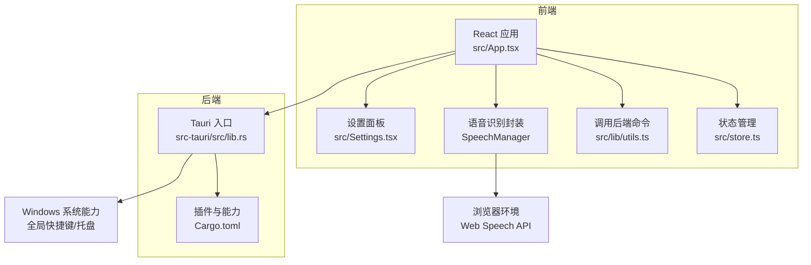
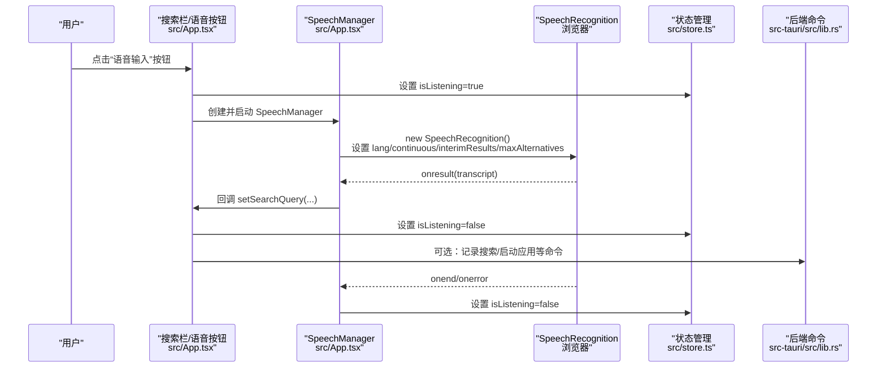
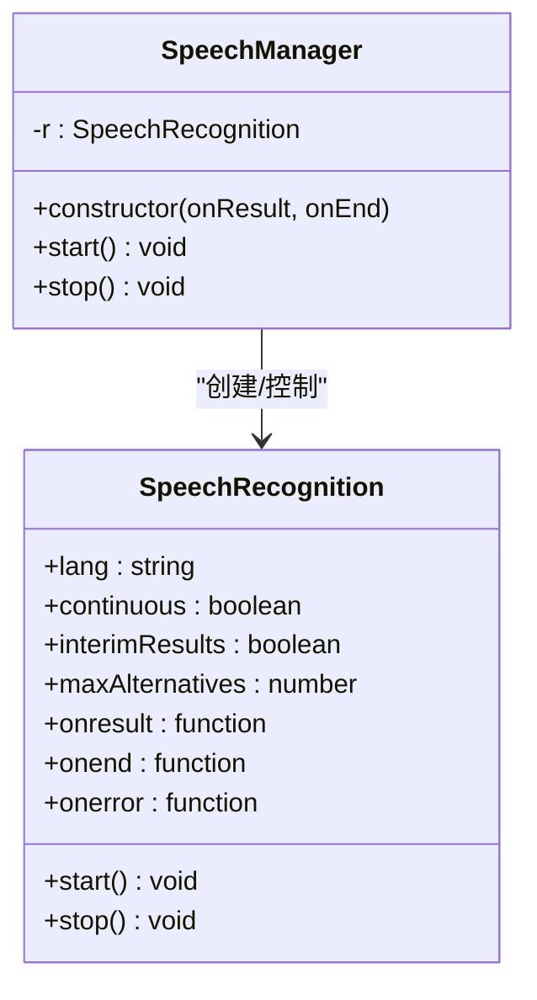
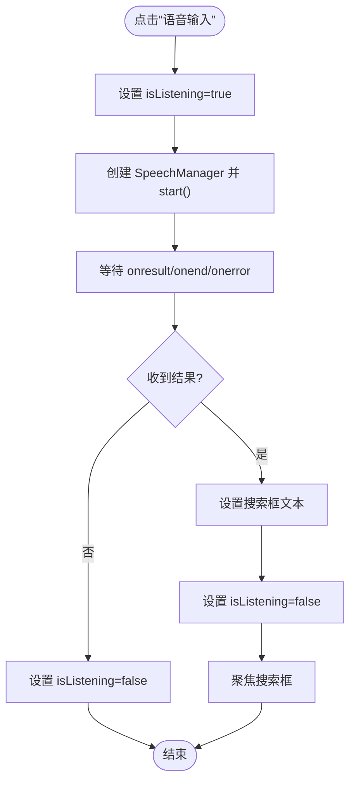
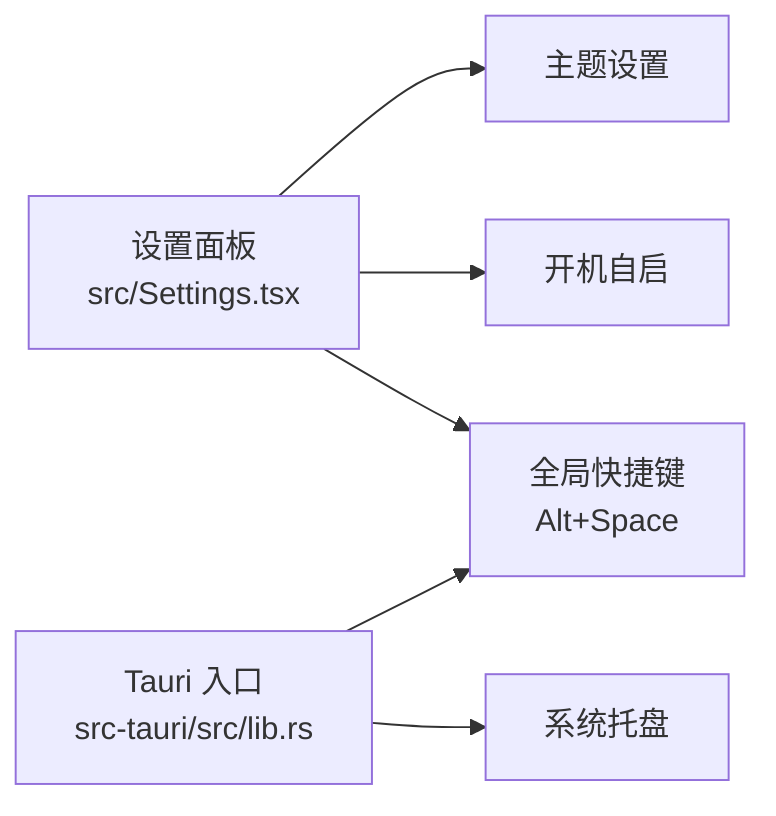
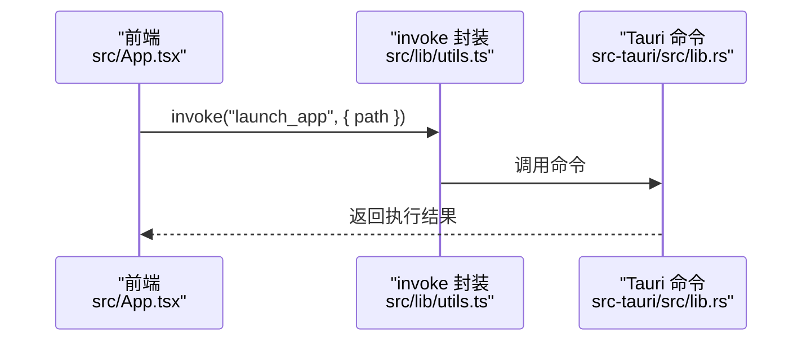
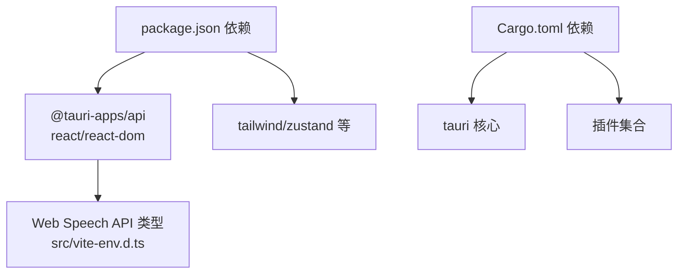

# 语音输入系统

<cite>
**本文引用的文件**
- [src/main.tsx](file://src/main.tsx)
- [src/App.tsx](file://src/App.tsx)
- [src/store.ts](file://src/store.ts)
- [src/lib/utils.ts](file://src/lib/utils.ts)
- [src/vite-env.d.ts](file://src/vite-env.d.ts)
- [src/Settings.tsx](file://src/Settings.tsx)
- [src-tauri/src/lib.rs](file://src-tauri/src/lib.rs)
- [src-tauri/Cargo.toml](file://src-tauri/Cargo.toml)
- [package.json](file://package.json)
</cite>

## 目录
1. [简介](#简介)
2. [项目结构](#项目结构)
3. [核心组件](#核心组件)
4. [架构总览](#架构总览)
5. [详细组件分析](#详细组件分析)
6. [依赖关系分析](#依赖关系分析)
7. [性能考虑](#性能考虑)
8. [故障排除指南](#故障排除指南)
9. [结论](#结论)
10. [附录](#附录)

## 简介
本文件为“语音输入系统”的技术文档，聚焦于 Web Speech API 的集成与使用、语音识别引擎配置、语音转文字处理流程以及语音控制功能。文档还涵盖语音激活机制、噪声抑制策略、多语言支持现状与扩展建议、准确率优化方法、语音命令配置、自定义语音触发词、语音反馈设置与无障碍访问支持，并提供语音 API 使用示例、性能优化建议与故障排除指南。

## 项目结构
该语音输入系统采用前端 React + Tauri 的混合架构：
- 前端层：React 应用负责 UI、状态管理与 Web Speech API 的调用。
- 后端层：Tauri Rust 应用负责系统级能力（如全局快捷键、窗口管理、系统托盘等），并通过命令桥接与前端交互。
- 语音识别：前端通过 Web Speech API 的 SpeechRecognition 接口进行语音识别；当前默认语言为 zh-CN。

**图表来源**
- [src/App.tsx:249-261](file://src/App.tsx#L249-L261)
- [src/store.ts:13-30](file://src/store.ts#L13-L30)
- [src/lib/utils.ts:11-17](file://src/lib/utils.ts#L11-L17)
- [src-tauri/src/lib.rs:22-134](file://src-tauri/src/lib.rs#L22-L134)
- [src-tauri/Cargo.toml:15-36](file://src-tauri/Cargo.toml#L15-L36)

**章节来源**
- [src/main.tsx:1-11](file://src/main.tsx#L1-L11)
- [src/App.tsx:249-261](file://src/App.tsx#L249-L261)
- [src-tauri/src/lib.rs:22-134](file://src-tauri/src/lib.rs#L22-L134)

## 核心组件
- 语音识别封装类：封装 SpeechRecognition 的创建、参数配置、结果回调与生命周期管理。
- 语音控制入口：在搜索栏右侧提供“语音输入”按钮，点击后进入语音识别状态。
- 状态管理：使用 Zustand 管理 isListening 等状态，驱动 UI 与行为。
- 设置面板：提供主题、快捷键、开机自启等配置项，便于无障碍与个性化体验。
- 后端桥接：通过 invoke 调用后端命令，实现跨平台能力与系统集成。

**章节来源**
- [src/App.tsx:249-261](file://src/App.tsx#L249-L261)
- [src/App.tsx:659-663](file://src/App.tsx#L659-L663)
- [src/store.ts:13-30](file://src/store.ts#L13-L30)
- [src/lib/utils.ts:11-17](file://src/lib/utils.ts#L11-L17)
- [src/Settings.tsx:14-60](file://src/Settings.tsx#L14-L60)

## 架构总览
语音输入系统的关键交互流程如下：

**图表来源**
- [src/App.tsx:249-261](file://src/App.tsx#L249-L261)
- [src/App.tsx:659-663](file://src/App.tsx#L659-L663)
- [src/store.ts:27-29](file://src/store.ts#L27-L29)
- [src-tauri/src/lib.rs:96-131](file://src-tauri/src/lib.rs#L96-L131)

## 详细组件分析

### 语音识别封装类（SpeechManager）
- 职责：封装 SpeechRecognition 的创建、参数配置、事件绑定与停止逻辑。
- 关键参数：
  - 语言：zh-CN（当前固定）
  - 连续识别：关闭
  - 中间结果：关闭
  - 最大备选数：1
- 生命周期：start()/stop() 管理识别器的创建与销毁，异常时回退到结束回调。

**图表来源**
- [src/App.tsx:249-261](file://src/App.tsx#L249-L261)
- [src/vite-env.d.ts:4-44](file://src/vite-env.d.ts#L4-L44)

**章节来源**
- [src/App.tsx:249-261](file://src/App.tsx#L249-L261)
- [src/vite-env.d.ts:4-44](file://src/vite-env.d.ts#L4-L44)

### 语音控制入口与状态联动
- UI：搜索栏右侧提供麦克风按钮，点击后进入 isListening 状态。
- 行为：启动识别器，收到结果后将文本设置到搜索框并退出识别状态。
- 无障碍：按钮具备 title 属性与动画提示，指示当前识别状态。

**图表来源**
- [src/App.tsx:659-663](file://src/App.tsx#L659-L663)
- [src/store.ts:27-29](file://src/store.ts#L27-L29)

**章节来源**
- [src/App.tsx:659-663](file://src/App.tsx#L659-L663)
- [src/App.tsx:828-839](file://src/App.tsx#L828-L839)
- [src/store.ts:27-29](file://src/store.ts#L27-L29)

### 设置与系统集成
- 设置面板：提供主题、快捷键、开机自启、AI 配置等选项。
- 全局快捷键：Alt+Space 切换窗口显示并定位到屏幕左下角。
- 系统托盘：应用启动时创建托盘图标，便于快速操作。

**图表来源**
- [src/Settings.tsx:14-60](file://src/Settings.tsx#L14-L60)
- [src-tauri/src/lib.rs:22-95](file://src-tauri/src/lib.rs#L22-L95)

**章节来源**
- [src/Settings.tsx:14-60](file://src/Settings.tsx#L14-L60)
- [src-tauri/src/lib.rs:22-95](file://src-tauri/src/lib.rs#L22-L95)

### 后端命令与桥接
- 前端通过 invoke 调用后端命令，实现应用启动、图标获取、分类管理、搜索历史等能力。
- 后端注册命令集合，统一暴露给前端使用。

**图表来源**
- [src/lib/utils.ts:11-17](file://src/lib/utils.ts#L11-L17)
- [src-tauri/src/lib.rs:96-131](file://src-tauri/src/lib.rs#L96-L131)

**章节来源**
- [src/lib/utils.ts:11-17](file://src/lib/utils.ts#L11-L17)
- [src-tauri/src/lib.rs:96-131](file://src-tauri/src/lib.rs#L96-L131)

## 依赖关系分析
- 前端依赖：React、Zustand、Tailwind、@tauri-apps/api 等。
- 后端依赖：Tauri 核心、各插件（shell、dialog、process、global-shortcut、autostart）、rusqlite、window-vibrancy 等。
- 语音 API：浏览器内置 Web Speech API，类型声明位于 src/vite-env.d.ts。

**图表来源**
- [package.json:14-32](file://package.json#L14-L32)
- [src-tauri/Cargo.toml:15-36](file://src-tauri/Cargo.toml#L15-L36)
- [src/vite-env.d.ts:4-44](file://src/vite-env.d.ts#L4-L44)

**章节来源**
- [package.json:14-32](file://package.json#L14-L32)
- [src-tauri/Cargo.toml:15-36](file://src-tauri/Cargo.toml#L15-L36)
- [src/vite-env.d.ts:4-44](file://src/vite-env.d.ts#L4-L44)

## 性能考虑
- 识别参数优化
  - 关闭连续识别与中间结果可降低资源占用，适合单次短语输入场景。
  - 适当提高 maxAlternatives 可提升准确率，但会增加处理开销。
- 状态与 UI 更新
  - 识别结束后及时设置 isListening=false，避免重复创建识别器。
  - 结果回填后尽快聚焦输入框，减少 UI 抖动。
- 后端调用
  - 使用 invoke 封装统一调用，避免重复导入模块。
  - 对频繁操作（如图标加载）采用缓存策略，减少不必要的后端调用。
- 浏览器兼容性
  - 通过 window.SpeechRecognition 或 window.webkitSpeechRecognition 兼容不同内核。
  - 在不支持时优雅降级，避免抛出异常影响主流程。

[本节为通用指导，无需具体文件引用]

## 故障排除指南
- 无法启动语音识别
  - 检查浏览器对 Web Speech API 的支持与权限。
  - 确认页面处于 HTTPS 环境（部分浏览器要求）。
  - 查看控制台是否有异常信息。
- 识别结果为空或延迟
  - 确认语言设置为 zh-CN（当前固定）。
  - 降低系统背景噪音，靠近麦克风。
  - 减少并发任务，释放 CPU/GPU 资源。
- 识别器无法停止
  - 确保在 onend/onerror 中正确设置 isListening=false。
  - 调用 stop() 后移除事件监听，避免内存泄漏。
- 设置无效
  - 主题与快捷键需重启应用生效。
  - 开机自启与自动分类等设置需确认系统策略允许。

**章节来源**
- [src/App.tsx:252-259](file://src/App.tsx#L252-L259)
- [src/App.tsx:260](file://src/App.tsx#L260)
- [src/Settings.tsx:155-160](file://src/Settings.tsx#L155-L160)

## 结论
本语音输入系统基于 Web Speech API 实现，结合前端状态管理与 Tauri 后端能力，提供了简洁高效的语音转文字与语音控制体验。当前默认语言为 zh-CN，识别参数针对短语输入进行了优化。通过设置面板与全局快捷键，用户可以进一步提升可用性与无障碍体验。未来可在多语言支持、噪声抑制、准确率优化与自定义触发词等方面持续增强。

[本节为总结性内容，无需具体文件引用]

## 附录

### 语音 API 使用示例（步骤说明）
- 创建识别器实例并设置参数
  - 语言：zh-CN
  - 连续识别：关闭
  - 中间结果：关闭
  - 最大备选数：1
- 绑定事件
  - onresult：接收最终结果并更新搜索框
  - onend/onerror：结束识别状态
- 启动与停止
  - start() 启动识别
  - stop() 停止识别并清理事件

**章节来源**
- [src/App.tsx:249-261](file://src/App.tsx#L249-L261)
- [src/App.tsx:659-663](file://src/App.tsx#L659-L663)

### 多语言支持与扩展建议
- 当前实现
  - 语言固定为 zh-CN。
- 建议
  - 在设置中增加语言选择项，动态设置 recognition.lang。
  - 提供语言模型切换与方言适配策略。
  - 引入噪声抑制与回声消除（浏览器侧或第三方 SDK）。

[本节为概念性建议，无需具体文件引用]

### 自定义语音触发词与命令配置
- 触发词
  - 当前未实现专用触发词检测，建议在 onresult 后增加关键词匹配逻辑。
- 命令映射
  - 将识别结果映射到具体动作（如“打开设置”、“搜索应用”等）。
- 配置存储
  - 通过设置面板持久化用户偏好，后端提供读写接口。

[本节为概念性建议，无需具体文件引用]

### 无障碍访问支持
- 状态提示
  - 识别中提供视觉与动画提示，按钮具备 title 属性。
- 键盘导航
  - 支持 Enter、Esc、方向键等常用快捷键。
- 主题适配
  - 支持跟随系统、浅色、深色主题，满足不同视觉需求。

**章节来源**
- [src/App.tsx:828-839](file://src/App.tsx#L828-L839)
- [src/Settings.tsx:29-40](file://src/Settings.tsx#L29-L40)