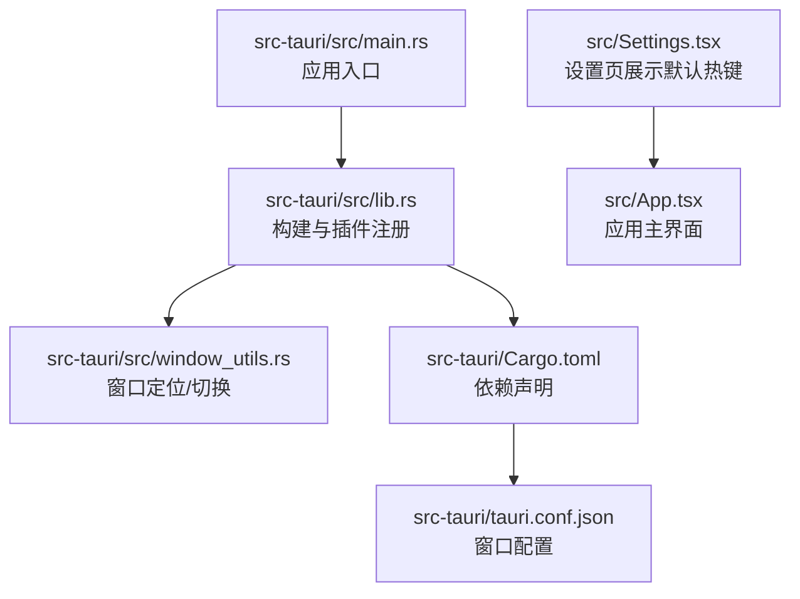
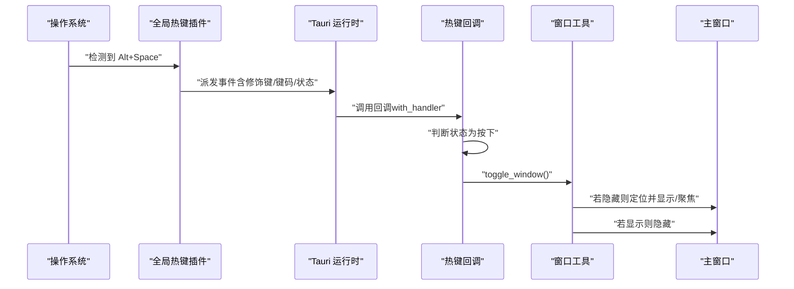
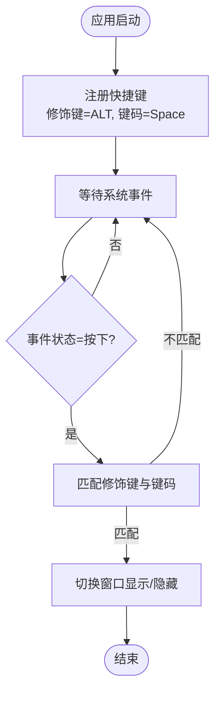
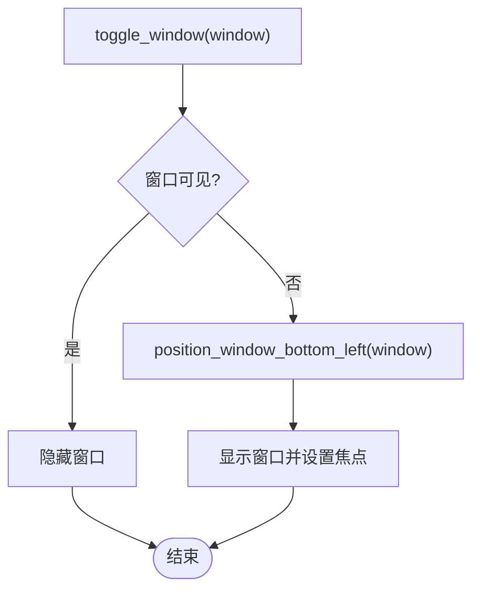
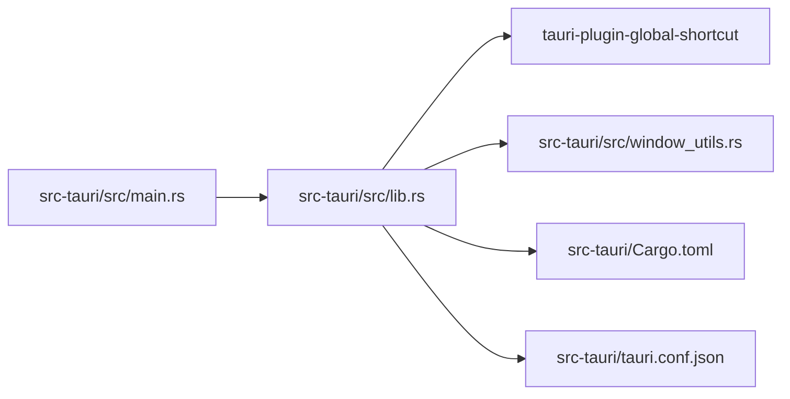

# 全局热键

<cite>
**本文引用的文件**
- [src-tauri/src/lib.rs](file://src-tauri/src/lib.rs)
- [src-tauri/src/main.rs](file://src-tauri/src/main.rs)
- [src-tauri/src/window_utils.rs](file://src-tauri/src/window_utils.rs)
- [src-tauri/Cargo.toml](file://src-tauri/Cargo.toml)
- [src-tauri/tauri.conf.json](file://src-tauri/tauri.conf.json)
- [src/App.tsx](file://src/App.tsx)
- [src/Settings.tsx](file://src/Settings.tsx)
</cite>

## 目录
1. [简介](#简介)
2. [项目结构](#项目结构)
3. [核心组件](#核心组件)
4. [架构总览](#架构总览)
5. [详细组件分析](#详细组件分析)
6. [依赖关系分析](#依赖关系分析)
7. [性能考量](#性能考量)
8. [故障排查指南](#故障排查指南)
9. [结论](#结论)
10. [附录](#附录)

## 简介
本文件围绕 QuickStart 的“全局热键”能力进行系统化说明，重点覆盖以下内容：
- Alt+Space 热键的注册机制与事件处理流程
- 窗口切换与定位逻辑
- tauri_plugin_global_shortcut 插件的配置与使用要点（修饰键组合、快捷键状态监听、事件回调处理）
- 最佳实践、冲突避免策略与跨平台兼容性考虑
- 自定义热键配置、多热键支持与热键状态管理的实现细节

## 项目结构
QuickStart 的全局热键相关实现集中在 Tauri 后端（Rust）侧，前端（React）侧提供设置界面展示默认热键提示。关键文件与职责如下：
- 后端入口与运行时：main.rs、lib.rs
- 窗口工具：window_utils.rs（窗口定位、显示/隐藏切换）
- 插件与依赖：Cargo.toml（引入 tauri-plugin-global-shortcut）
- 前端设置页：Settings.tsx（展示默认热键提示）
- 应用窗口配置：tauri.conf.json（主窗口属性）

**图表来源**
- [src-tauri/src/main.rs:1-7](file://src-tauri/src/main.rs#L1-L7)
- [src-tauri/src/lib.rs:22-95](file://src-tauri/src/lib.rs#L22-L95)
- [src-tauri/src/window_utils.rs:1-56](file://src-tauri/src/window_utils.rs#L1-L56)
- [src-tauri/Cargo.toml:15-36](file://src-tauri/Cargo.toml#L15-L36)
- [src-tauri/tauri.conf.json:27-41](file://src-tauri/tauri.conf.json#L27-L41)
- [src/Settings.tsx:87-94](file://src/Settings.tsx#L87-L94)

**章节来源**
- [src-tauri/src/main.rs:1-7](file://src-tauri/src/main.rs#L1-L7)
- [src-tauri/src/lib.rs:22-95](file://src-tauri/src/lib.rs#L22-L95)
- [src-tauri/src/window_utils.rs:1-56](file://src-tauri/src/window_utils.rs#L1-L56)
- [src-tauri/Cargo.toml:15-36](file://src-tauri/Cargo.toml#L15-L36)
- [src-tauri/tauri.conf.json:27-41](file://src-tauri/tauri.conf.json#L27-L41)
- [src/Settings.tsx:87-94](file://src/Settings.tsx#L87-L94)

## 核心组件
- 全局热键插件：tauri-plugin-global-shortcut
  - 作用：注册系统级热键，接收按键按下/释放事件
  - 关键类型：Modifiers（修饰键）、Code（键码）、ShortcutState（状态）、Shortcut（快捷键对象）
- 热键注册与回调：在应用初始化阶段注册 Alt+Space，并在回调中判断状态为按下时执行窗口切换
- 窗口工具：position_window_bottom_left（将窗口定位至屏幕左下角）、toggle_window（显示/隐藏并聚焦）

**章节来源**
- [src-tauri/src/lib.rs:18-42](file://src-tauri/src/lib.rs#L18-L42)
- [src-tauri/src/lib.rs:61-66](file://src-tauri/src/lib.rs#L61-L66)
- [src-tauri/src/window_utils.rs:45-56](file://src-tauri/src/window_utils.rs#L45-L56)

## 架构总览
从系统视角看，全局热键的调用链路如下：
- 系统捕获 Alt+Space
- Tauri 全局热键插件将事件传递给 Rust 回调
- 回调根据事件状态判断是否执行窗口切换
- 窗口切换时先定位再显示，避免闪烁

**图表来源**
- [src-tauri/src/lib.rs:28-42](file://src-tauri/src/lib.rs#L28-L42)
- [src-tauri/src/lib.rs:61-66](file://src-tauri/src/lib.rs#L61-L66)
- [src-tauri/src/window_utils.rs:45-56](file://src-tauri/src/window_utils.rs#L45-L56)

## 详细组件分析

### 组件一：全局热键注册与事件处理
- 注册方式：在应用 setup 阶段通过全局热键插件 Builder 注册一个快捷键对象，指定修饰键为 ALT，键码为 Space
- 事件回调：使用 with_handler 接收事件；仅当事件状态为按下时才执行窗口切换
- 匹配逻辑：在回调内部使用 matches 方法对修饰键与键码进行精确匹配

**图表来源**
- [src-tauri/src/lib.rs:28-42](file://src-tauri/src/lib.rs#L28-L42)
- [src-tauri/src/lib.rs:61-66](file://src-tauri/src/lib.rs#L61-L66)

**章节来源**
- [src-tauri/src/lib.rs:28-42](file://src-tauri/src/lib.rs#L28-L42)
- [src-tauri/src/lib.rs:61-66](file://src-tauri/src/lib.rs#L61-L66)

### 组件二：窗口切换与定位逻辑
- toggle_window：根据窗口当前可见性决定隐藏或显示；显示时先调用定位函数再显示并聚焦
- position_window_bottom_left：基于当前显示器工作区（排除任务栏）计算左下角位置，考虑缩放因子与小边距，避免闪烁

**图表来源**
- [src-tauri/src/window_utils.rs:45-56](file://src-tauri/src/window_utils.rs#L45-L56)
- [src-tauri/src/window_utils.rs:3-43](file://src-tauri/src/window_utils.rs#L3-L43)

**章节来源**
- [src-tauri/src/window_utils.rs:45-56](file://src-tauri/src/window_utils.rs#L45-L56)
- [src-tauri/src/window_utils.rs:3-43](file://src-tauri/src/window_utils.rs#L3-L43)

### 组件三：前端设置页与热键提示
- Settings.tsx 中以只读形式展示默认热键提示“Alt + Space”，便于用户了解当前可用的系统级呼出方式
- 该提示不参与实际热键注册，仅为 UI 展示

**章节来源**
- [src/Settings.tsx:87-94](file://src/Settings.tsx#L87-L94)

## 依赖关系分析
- 插件依赖：Cargo.toml 明确声明了 tauri-plugin-global-shortcut 的版本
- 运行时入口：main.rs 调用 lib.rs 的 run 函数完成插件与窗口的初始化
- 窗口配置：tauri.conf.json 定义了主窗口的可见性、透明度等属性，影响热键呼出后的初始行为

**图表来源**
- [src-tauri/src/main.rs:1-7](file://src-tauri/src/main.rs#L1-L7)
- [src-tauri/src/lib.rs:22-95](file://src-tauri/src/lib.rs#L22-L95)
- [src-tauri/Cargo.toml:21](file://src-tauri/Cargo.toml#L21)

**章节来源**
- [src-tauri/src/main.rs:1-7](file://src-tauri/src/main.rs#L1-L7)
- [src-tauri/src/lib.rs:22-95](file://src-tauri/src/lib.rs#L22-L95)
- [src-tauri/Cargo.toml:21](file://src-tauri/Cargo.toml#L21)

## 性能考量
- 事件回调轻量化：仅在状态为按下且匹配目标热键时执行窗口切换，避免不必要的 UI 操作
- 显示顺序优化：显示窗口前先定位，减少因布局重排导致的闪烁
- 窗口定位计算：基于显示器工作区与缩放因子，避免重复查询与计算开销

[本节为通用建议，不直接分析具体文件]

## 故障排查指南
- 热键无效
  - 检查系统层是否被其他应用占用（例如系统自带开始菜单热键）
  - 确认应用已正确注册热键（查看注册语句与修饰键/键码匹配）
  - 验证事件回调仅在按下状态下触发
- 窗口定位异常
  - 确认显示器工作区可获取且非空
  - 检查缩放因子是否正确应用
- 跨平台差异
  - 不同平台对全局热键的支持与权限不同，需遵循各平台限制

**章节来源**
- [src-tauri/src/lib.rs:28-42](file://src-tauri/src/lib.rs#L28-L42)
- [src-tauri/src/lib.rs:61-66](file://src-tauri/src/lib.rs#L61-L66)
- [src-tauri/src/window_utils.rs:3-43](file://src-tauri/src/window_utils.rs#L3-L43)

## 结论
QuickStart 当前实现了稳定的 Alt+Space 全局热键：在应用启动时注册热键，事件回调仅在按下状态下切换窗口显示/隐藏，并在显示时进行精准定位与聚焦。该实现简洁可靠，具备良好的跨平台兼容性基础。若需扩展为多热键或多用户配置，可在现有插件基础上增加配置存储与动态注册机制。

[本节为总结性内容，不直接分析具体文件]

## 附录

### 自定义热键配置与多热键支持
- 当前实现仅注册了一个 Alt+Space 热键
- 如需扩展：
  - 在注册阶段多次调用注册接口，传入不同的修饰键与键码组合
  - 在回调中通过事件对象区分不同热键，分别执行对应动作
  - 引入设置项持久化热键配置，启动时按配置动态注册

**章节来源**
- [src-tauri/src/lib.rs:28-42](file://src-tauri/src/lib.rs#L28-L42)
- [src-tauri/src/lib.rs:61-66](file://src-tauri/src/lib.rs#L61-L66)

### 热键状态管理
- 事件回调中使用事件状态判断（按下/抬起）以避免重复触发
- 若需记录热键使用次数或状态，可在回调内维护内存计数或持久化存储

**章节来源**
- [src-tauri/src/lib.rs:30-40](file://src-tauri/src/lib.rs#L30-L40)

### 冲突避免策略
- 选择较少冲突的修饰键组合（如 Alt+字母）
- 在注册前检查系统层占用情况
- 提供用户可配置的热键方案，并在设置页提供冲突提示

**章节来源**
- [src-tauri/src/lib.rs:28-42](file://src-tauri/src/lib.rs#L28-L42)

### 跨平台兼容性
- 全局热键插件在 Windows/macOS/Linux 上的行为可能存在差异
- 建议在各平台测试热键注册与回调稳定性，并针对平台差异调整策略

**章节来源**
- [src-tauri/Cargo.toml:21](file://src-tauri/Cargo.toml#L21)