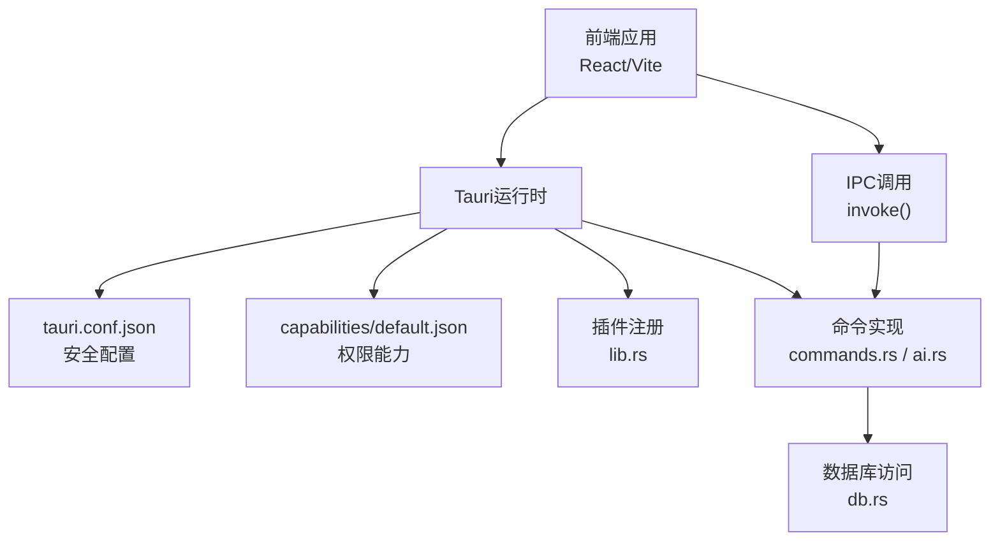
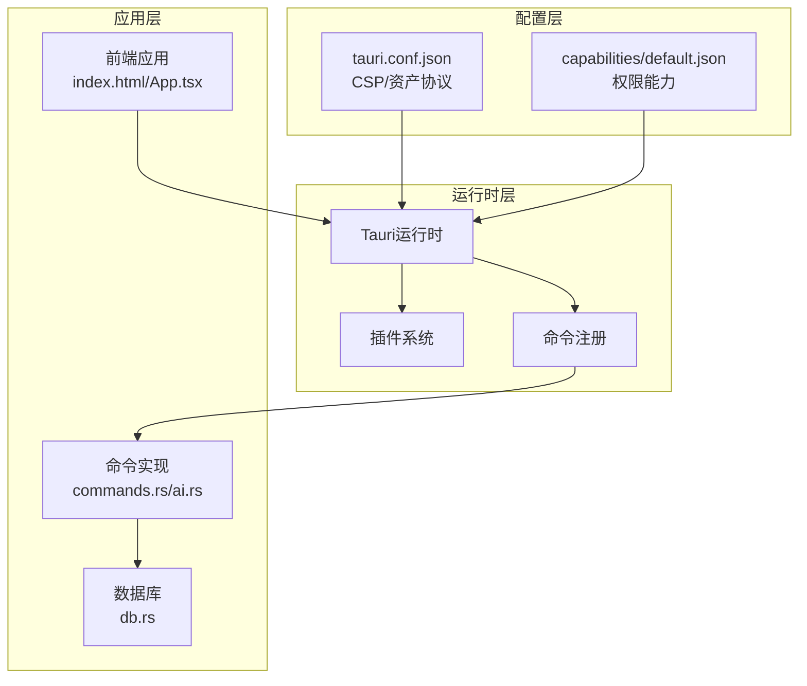
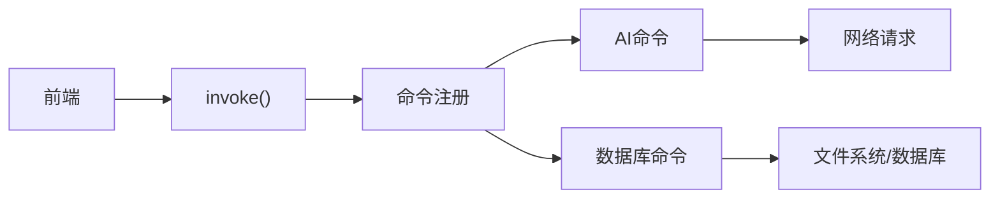

# 安全配置

<cite>
**本文档引用的文件**
- [tauri.conf.json](file://src-tauri/tauri.conf.json)
- [default.json](file://src-tauri/capabilities/default.json)
- [Cargo.toml](file://src-tauri/Cargo.toml)
- [lib.rs](file://src-tauri/src/lib.rs)
- [main.rs](file://src-tauri/src/main.rs)
- [commands.rs](file://src-tauri/src/commands.rs)
- [ai.rs](file://src-tauri/src/ai.rs)
- [db.rs](file://src-tauri/src/db.rs)
- [index.html](file://index.html)
- [App.tsx](file://src/App.tsx)
</cite>

## 目录
1. [简介](#简介)
2. [项目结构](#项目结构)
3. [核心组件](#核心组件)
4. [架构总览](#架构总览)
5. [详细组件分析](#详细组件分析)
6. [依赖关系分析](#依赖关系分析)
7. [性能考虑](#性能考虑)
8. [故障排查指南](#故障排查指南)
9. [结论](#结论)
10. [附录](#附录)

## 简介
本文件面向QuickStart项目的安全配置，围绕内容安全策略（CSP）、权限控制与能力（capability）模型、协议白名单与资源访问控制、API权限管理、插件权限配置、系统API访问限制、网络请求安全与数据保护等方面进行系统化说明，并提供安全最佳实践、漏洞防护与合规性检查的实施指南。

## 项目结构
QuickStart采用Tauri 2架构，前端为React/Vite应用，后端为Rust，通过Tauri命令桥接前后端。安全配置主要分布在配置文件、能力定义、插件注册与命令实现四个层面。

**图表来源**
- [tauri.conf.json:41-50](file://src-tauri/tauri.conf.json#L41-L50)
- [default.json:5-34](file://src-tauri/capabilities/default.json#L5-L34)
- [lib.rs:22-134](file://src-tauri/src/lib.rs#L22-L134)
- [commands.rs:1-709](file://src-tauri/src/commands.rs#L1-L709)
- [db.rs:17-133](file://src-tauri/src/db.rs#L17-L133)

**章节来源**
- [tauri.conf.json:1-54](file://src-tauri/tauri.conf.json#L1-L54)
- [default.json:1-36](file://src-tauri/capabilities/default.json#L1-L36)
- [Cargo.toml:15-36](file://src-tauri/Cargo.toml#L15-L36)
- [lib.rs:22-134](file://src-tauri/src/lib.rs#L22-L134)

## 核心组件
- 内容安全策略（CSP）：在配置文件中集中声明，限定脚本、样式、图片、字体、连接等资源来源，降低XSS与资源注入风险。
- 权限能力（Capabilities）：以JSON定义窗口、事件、系统交互等权限集合，前端仅能调用被授权的命令。
- 协议与资源访问：通过资产协议（asset protocol）与作用域（scope）控制本地资源访问范围。
- 插件与系统API：按需注册插件，严格限制系统调用（如打开外部链接、进程、全局快捷键等）。
- 命令与数据访问：命令层统一处理业务逻辑与数据访问，内置路径验证与输入校验，避免越权与路径穿越。

**章节来源**
- [tauri.conf.json:41-50](file://src-tauri/tauri.conf.json#L41-L50)
- [default.json:5-34](file://src-tauri/capabilities/default.json#L5-L34)
- [lib.rs:24-43](file://src-tauri/src/lib.rs#L24-L43)
- [commands.rs:326-373](file://src-tauri/src/commands.rs#L326-L373)
- [ai.rs:37-49](file://src-tauri/src/ai.rs#L37-L49)

## 架构总览
下图展示安全配置在系统中的位置与交互关系：

**图表来源**
- [tauri.conf.json:41-50](file://src-tauri/tauri.conf.json#L41-L50)
- [default.json:5-34](file://src-tauri/capabilities/default.json#L5-L34)
- [lib.rs:22-134](file://src-tauri/src/lib.rs#L22-L134)
- [commands.rs:96-131](file://src-tauri/src/commands.rs#L96-L131)
- [db.rs:17-133](file://src-tauri/src/db.rs#L17-L133)

## 详细组件分析

### 内容安全策略（CSP）
- 策略要点
  - default-src 'self'：默认仅允许同源资源。
  - script-src 'self'：脚本执行仅限同源，避免内联脚本与远程脚本注入。
  - style-src 'self' 'unsafe-inline'：允许同源样式与内联样式，满足UI框架需求。
  - img-src 'self' asset: https: data:：图片可来自同源、资产协议、HTTPS与data URI。
  - connect-src 'self' https:：网络连接仅限同源与HTTPS。
  - font-src 'self' data:：字体可来自同源与data URI。
- 影响范围
  - 前端页面与动态加载资源均受此策略约束，有效降低XSS与混合内容风险。
- 配置位置
  - [tauri.conf.json:41-42](file://src-tauri/tauri.conf.json#L41-L42)

**章节来源**
- [tauri.conf.json:41-42](file://src-tauri/tauri.conf.json#L41-L42)

### 资产协议与资源访问控制
- 资产协议启用与作用域
  - enable: true：启用自定义资产协议，使前端可通过特定协议访问受限资源。
  - scope：$APPDATA/** 与 $RESOURCE/**，限定可访问的资源路径范围，避免越权读取系统文件。
- 实施意义
  - 将资源访问限制在应用数据目录与打包资源目录，降低文件系统暴露风险。
- 配置位置
  - [tauri.conf.json:43-49](file://src-tauri/tauri.conf.json#L43-L49)

**章节来源**
- [tauri.conf.json:43-49](file://src-tauri/tauri.conf.json#L43-L49)

### 权限能力（Capabilities）与API权限管理
- 能力定义
  - identifier与description：标识主窗口能力。
  - windows：限定能力作用窗口为main。
  - permissions：明确授权的窗口操作、事件、系统交互、全局快捷键、自动启动等权限。
- 前端调用约束
  - 前端仅能调用被授予的命令；未授权的系统功能将被运行时拒绝。
- 配置位置
  - [default.json:1-36](file://src-tauri/capabilities/default.json#L1-L36)

**章节来源**
- [default.json:5-34](file://src-tauri/capabilities/default.json#L5-L34)

### 插件权限配置与系统API访问限制
- 插件注册
  - shell、dialog、opener、process、global-shortcut、autostart等插件按需启用。
- 权限最小化
  - 仅注册必要插件，避免授予不必要的系统访问权限。
- 配置位置
  - [Cargo.toml:16-22](file://src-tauri/Cargo.toml#L16-L22)
  - [lib.rs:24-43](file://src-tauri/src/lib.rs#L24-L43)

**章节来源**
- [Cargo.toml:16-22](file://src-tauri/Cargo.toml#L16-L22)
- [lib.rs:24-43](file://src-tauri/src/lib.rs#L24-L43)

### 命令与数据访问安全
- 命令注册
  - 通过invoke_handler集中注册命令，前端只能调用已注册命令。
- 数据访问与路径验证
  - AI模块对目录与文件路径进行范围验证，防止路径穿越。
  - 应用图标读取与缓存，避免重复I/O与潜在路径问题。
- 配置位置
  - [lib.rs:96-131](file://src-tauri/src/lib.rs#L96-L131)
  - [ai.rs:37-49](file://src-tauri/src/ai.rs#L37-L49)
  - [commands.rs:326-373](file://src-tauri/src/commands.rs#L326-L373)

**章节来源**
- [lib.rs:96-131](file://src-tauri/src/lib.rs#L96-L131)
- [ai.rs:37-49](file://src-tauri/src/ai.rs#L37-L49)
- [commands.rs:326-373](file://src-tauri/src/commands.rs#L326-L373)

### 网络请求安全
- 请求限制
  - CSP connect-src限制为同源与HTTPS，减少中间人攻击与不安全连接风险。
- 代码示例参考
  - GitHub版本检查与第三方AI服务调用均通过HTTPS发起，超时与错误处理完善。
- 配置位置
  - [tauri.conf.json:41-42](file://src-tauri/tauri.conf.json#L41-L42)
  - [commands.rs:491-505](file://src-tauri/src/commands.rs#L491-L505)
  - [ai.rs:68-254](file://src-tauri/src/ai.rs#L68-L254)

**章节来源**
- [tauri.conf.json:41-42](file://src-tauri/tauri.conf.json#L41-L42)
- [commands.rs:491-505](file://src-tauri/src/commands.rs#L491-L505)
- [ai.rs:68-254](file://src-tauri/src/ai.rs#L68-L254)

### 数据保护与隐私
- 数据存储
  - SQLite数据库位于应用数据目录，迁移与初始化逻辑确保表结构与默认设置存在。
- 前端页面
  - index.html为最小化入口，未包含额外元标签或第三方资源，降低追踪风险。
- 配置位置
  - [db.rs:17-133](file://src-tauri/src/db.rs#L17-L133)
  - [index.html:1-14](file://index.html#L1-L14)

**章节来源**
- [db.rs:17-133](file://src-tauri/src/db.rs#L17-L133)
- [index.html:1-14](file://index.html#L1-L14)

## 依赖关系分析
- 组件耦合
  - 前端通过Tauri命令调用后端命令，命令再访问数据库或系统资源，形成清晰的调用链。
- 外部依赖
  - 插件依赖在Cargo.toml中声明，遵循最小权限原则。
- 潜在风险
  - 若扩展新插件或命令，需同步更新能力定义与CSP策略，避免权限扩大。

**图表来源**
- [lib.rs:96-131](file://src-tauri/src/lib.rs#L96-L131)
- [commands.rs:326-373](file://src-tauri/src/commands.rs#L326-L373)
- [ai.rs:68-254](file://src-tauri/src/ai.rs#L68-L254)
- [db.rs:17-133](file://src-tauri/src/db.rs#L17-L133)

**章节来源**
- [Cargo.toml:16-36](file://src-tauri/Cargo.toml#L16-L36)
- [lib.rs:96-131](file://src-tauri/src/lib.rs#L96-L131)

## 性能考虑
- 命令调用与并发
  - 异步命令（如扫描应用）避免阻塞UI，提升用户体验。
- 资源访问优化
  - 资产协议作用域限制减少不必要的文件系统扫描。
- 网络请求
  - 合理设置超时与错误处理，避免长时间等待影响响应速度。

[本节为通用建议，无需具体文件分析]

## 故障排查指南
- 常见问题
  - 前端资源加载失败：检查CSP策略与资产协议作用域是否覆盖所需资源。
  - 命令调用被拒绝：确认能力定义中是否包含相应权限。
  - 网络请求异常：检查connect-src策略与目标域名HTTPS可用性。
- 排查步骤
  - 查看运行时日志与错误提示。
  - 对照能力定义与CSP配置逐项核对。
  - 验证命令注册与调用路径。

**章节来源**
- [tauri.conf.json:41-50](file://src-tauri/tauri.conf.json#L41-L50)
- [default.json:5-34](file://src-tauri/capabilities/default.json#L5-L34)

## 结论
QuickStart的安全配置以“最小权限”为核心原则：通过严格的CSP、能力定义与资产协议作用域，配合命令层的路径验证与输入校验，构建了从网络、资源到系统API的多层防护。建议在后续扩展中持续遵循“先评估、后授权”的原则，确保安全配置与功能演进同步。

[本节为总结，无需具体文件分析]

## 附录

### 安全最佳实践清单
- 配置
  - 明确CSP策略，尽量避免unsafe-inline与unsafe-eval。
  - 严格限制资产协议作用域，仅开放必要目录。
  - 以能力定义精确授权，避免授予无关权限。
- 开发
  - 对所有外部输入与文件路径进行验证与白名单校验。
  - 优先使用HTTPS与超时控制，增强网络请求安全性。
- 运维
  - 定期审查能力定义与插件依赖，移除不必要权限。
  - 关注第三方库安全公告，及时升级依赖。

[本节为通用建议，无需具体文件分析]