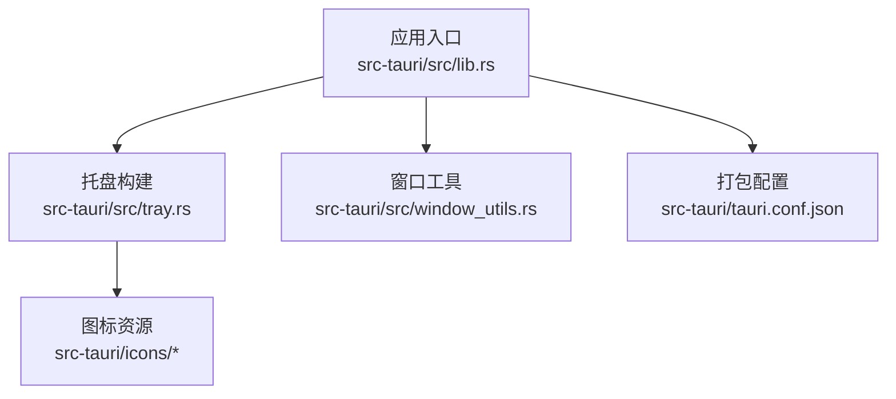
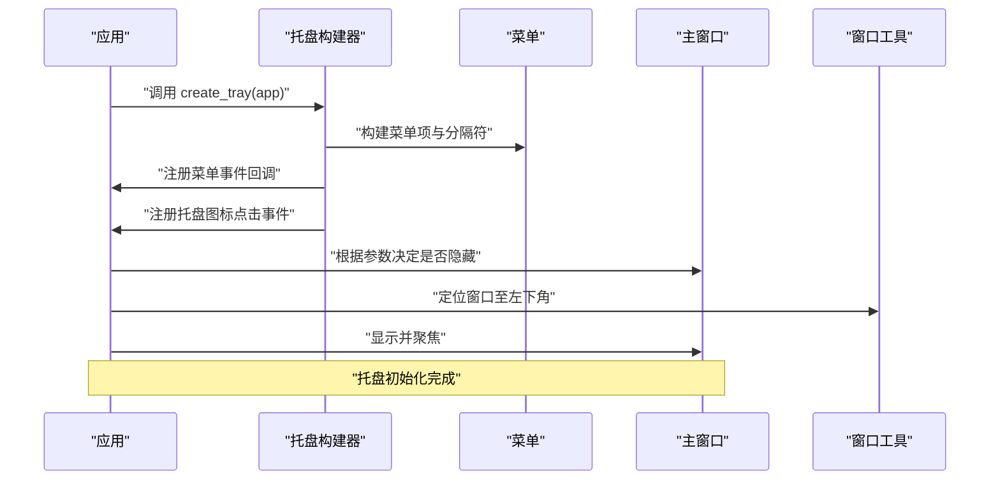
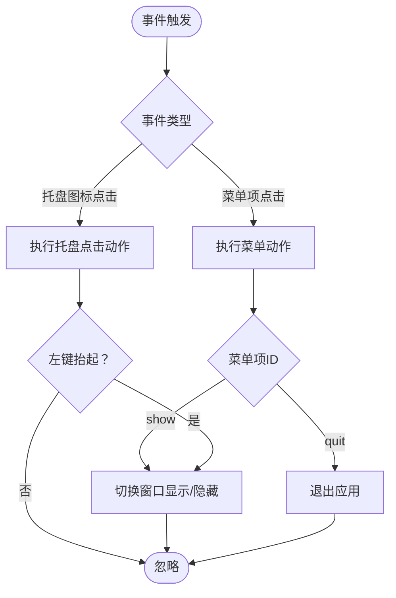
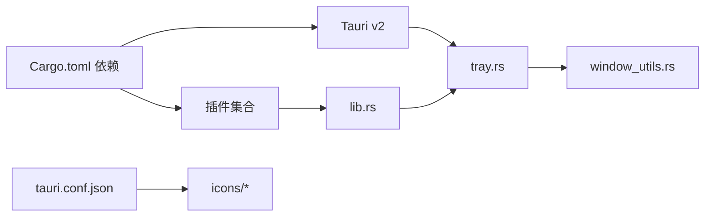

# 托盘集成

<cite>
**本文引用的文件**
- [src-tauri/src/tray.rs](file://src-tauri/src/tray.rs)
- [src-tauri/src/lib.rs](file://src-tauri/src/lib.rs)
- [src-tauri/src/window_utils.rs](file://src-tauri/src/window_utils.rs)
- [src-tauri/Cargo.toml](file://src-tauri/Cargo.toml)
- [src-tauri/tauri.conf.json](file://src-tauri/tauri.conf.json)
- [src-tauri/icons/32x32.png](file://src-tauri/icons/32x32.png)
- [src-tauri/icons/128x128.png](file://src-tauri/icons/128x128.png)
- [src-tauri/icons/128x128@2x.png](file://src-tauri/icons/128x128@2x.png)
- [src-tauri/icons/icon.ico](file://src-tauri/icons/icon.ico)
</cite>

## 目录
1. [简介](#简介)
2. [项目结构](#项目结构)
3. [核心组件](#核心组件)
4. [架构总览](#架构总览)
5. [组件详解](#组件详解)
6. [依赖关系分析](#依赖关系分析)
7. [性能与兼容性](#性能与兼容性)
8. [故障排查](#故障排查)
9. [结论](#结论)
10. [附录](#附录)

## 简介
本文件聚焦 QuickStart 的系统托盘集成功能，围绕托盘图标的创建、上下文菜单配置、事件处理机制展开，同时覆盖图标资源管理、菜单动态更新、托盘状态同步与系统兼容性处理，并提供扩展与优化建议。读者可据此理解托盘在 Tauri v2 中的实现方式与最佳实践。

## 项目结构
QuickStart 的托盘功能主要位于 Rust 后端模块中，前端通过 Tauri 命令与后端交互。托盘相关代码集中在以下文件：
- 托盘构建与事件：src-tauri/src/tray.rs
- 应用入口与插件注册：src-tauri/src/lib.rs
- 窗口切换与定位工具：src-tauri/src/window_utils.rs
- 构建与打包配置：src-tauri/tauri.conf.json
- 图标资源：src-tauri/icons/*.png, *.ico

图表来源
- [src-tauri/src/lib.rs:68-69](file://src-tauri/src/lib.rs#L68-L69)
- [src-tauri/src/tray.rs:24-28](file://src-tauri/src/tray.rs#L24-L28)
- [src-tauri/tauri.conf.json:14-19](file://src-tauri/tauri.conf.json#L14-L19)

章节来源
- [src-tauri/src/lib.rs:22-95](file://src-tauri/src/lib.rs#L22-L95)
- [src-tauri/src/tray.rs:8-58](file://src-tauri/src/tray.rs#L8-L58)
- [src-tauri/tauri.conf.json:1-54](file://src-tauri/tauri.conf.json#L1-L54)

## 核心组件
- 托盘图标与菜单构建器：负责创建托盘图标、设置菜单项与事件回调。
- 菜单项定义：包含“显示/隐藏”和“退出”，并使用预定义分隔符。
- 托盘事件处理器：分别处理菜单项点击与托盘图标点击（左键抬起）事件。
- 窗口切换工具：封装窗口显示/隐藏与定位逻辑，确保显示时出现在任务栏附近。
- 应用生命周期集成：在应用 setup 阶段完成托盘初始化与窗口初始状态控制。

章节来源
- [src-tauri/src/tray.rs:8-58](file://src-tauri/src/tray.rs#L8-L58)
- [src-tauri/src/window_utils.rs:45-55](file://src-tauri/src/window_utils.rs#L45-L55)
- [src-tauri/src/lib.rs:68-92](file://src-tauri/src/lib.rs#L68-L92)

## 架构总览
托盘功能在应用启动阶段由 lib.rs 的 setup 回调完成初始化，随后在运行期响应用户交互事件。

图表来源
- [src-tauri/src/lib.rs:68-92](file://src-tauri/src/lib.rs#L68-L92)
- [src-tauri/src/tray.rs:8-58](file://src-tauri/src/tray.rs#L8-L58)
- [src-tauri/src/window_utils.rs:45-55](file://src-tauri/src/window_utils.rs#L45-L55)

## 组件详解

### 托盘图标与菜单构建
- 菜单项
  - “显示/隐藏”：绑定快捷键“Alt+Space”，点击后切换主窗口可见性。
  - 分隔符：使用预定义分隔符增强视觉层次。
  - “退出”：关闭应用进程。
- 菜单事件
  - 菜单项点击触发对应动作：切换窗口或退出。
- 托盘图标事件
  - 左键抬起事件：等同于“显示/隐藏”操作。
- 图标与提示
  - 使用默认窗口图标作为托盘图标。
  - 设置托盘提示文本为应用名称。

章节来源
- [src-tauri/src/tray.rs:10-16](file://src-tauri/src/tray.rs#L10-L16)
- [src-tauri/src/tray.rs:18-22](file://src-tauri/src/tray.rs#L18-L22)
- [src-tauri/src/tray.rs:25-28](file://src-tauri/src/tray.rs#L25-L28)
- [src-tauri/src/tray.rs:29-39](file://src-tauri/src/tray.rs#L29-L39)
- [src-tauri/src/tray.rs:40-54](file://src-tauri/src/tray.rs#L40-L54)

### 窗口切换与定位
- 切换逻辑
  - 若窗口可见则隐藏；否则先定位再显示并聚焦。
- 定位策略
  - 基于当前显示器工作区（排除任务栏）计算左下角位置，考虑缩放因子与边距，避免闪烁。
- 与全局快捷键联动
  - Alt+Space 触发相同切换逻辑，保持一致性。

章节来源
- [src-tauri/src/window_utils.rs:45-55](file://src-tauri/src/window_utils.rs#L45-L55)
- [src-tauri/src/window_utils.rs:5-43](file://src-tauri/src/window_utils.rs#L5-L43)
- [src-tauri/src/lib.rs:30-40](file://src-tauri/src/lib.rs#L30-L40)

### 应用生命周期与托盘初始化
- 插件注册
  - 全局快捷键插件启用 Alt+Space。
  - 自动启动插件启用开机自启。
- 数据库初始化
  - 在 setup 中创建数据库并托管连接，供后续命令使用。
- 托盘初始化
  - 在 setup 中调用 create_tray 完成托盘创建。
- 自动启动行为
  - 通过命令行参数判断是否自动启动，决定窗口初始可见性与定位。

章节来源
- [src-tauri/src/lib.rs:22-95](file://src-tauri/src/lib.rs#L22-L95)

### 图标资源与打包配置
- 图标资源
  - 包含多分辨率 PNG 与 ICO 文件，满足不同系统与缩放需求。
- 打包配置
  - tauri.conf.json 中声明图标数组，用于安装包与系统托盘显示。
- 运行时图标来源
  - 托盘图标使用默认窗口图标，确保与应用主题一致。

章节来源
- [src-tauri/icons/32x32.png](file://src-tauri/icons/32x32.png)
- [src-tauri/icons/128x128.png](file://src-tauri/icons/128x128.png)
- [src-tauri/icons/128x128@2x.png](file://src-tauri/icons/128x128@2x.png)
- [src-tauri/icons/icon.ico](file://src-tauri/icons/icon.ico)
- [src-tauri/tauri.conf.json:14-19](file://src-tauri/tauri.conf.json#L14-L19)
- [src-tauri/src/tray.rs:26-27](file://src-tauri/src/tray.rs#L26-L27)

### 事件处理流程图

图表来源
- [src-tauri/src/tray.rs:29-39](file://src-tauri/src/tray.rs#L29-L39)
- [src-tauri/src/tray.rs:40-54](file://src-tauri/src/tray.rs#L40-L54)
- [src-tauri/src/window_utils.rs:45-55](file://src-tauri/src/window_utils.rs#L45-L55)

## 依赖关系分析
- 外部依赖
  - Tauri v2：提供托盘图标、菜单与事件能力。
  - 插件：global-shortcut、autostart、shell、dialog、opener、process。
- 内部依赖
  - lib.rs 调用 tray.rs 完成托盘初始化。
  - tray.rs 依赖 window_utils.rs 提供窗口切换与定位。
  - tauri.conf.json 提供打包与图标配置。

图表来源
- [src-tauri/Cargo.toml:15-36](file://src-tauri/Cargo.toml#L15-L36)
- [src-tauri/src/lib.rs:22-43](file://src-tauri/src/lib.rs#L22-L43)
- [src-tauri/src/tray.rs:1-6](file://src-tauri/src/tray.rs#L1-L6)
- [src-tauri/tauri.conf.json:14-19](file://src-tauri/tauri.conf.json#L14-L19)

章节来源
- [src-tauri/Cargo.toml:15-36](file://src-tauri/Cargo.toml#L15-L36)
- [src-tauri/src/lib.rs:22-43](file://src-tauri/src/lib.rs#L22-L43)

## 性能与兼容性
- 性能特性
  - 托盘事件处理为轻量级回调，无额外线程开销。
  - 窗口定位基于显示器工作区与缩放因子，避免重复计算。
- 兼容性
  - Windows 平台：支持 Win11 Mica 与 Win10 Acrylic 效果（在非托盘相关逻辑中体现）。
  - 图标适配：多分辨率与高 DPI 支持由打包配置与系统托盘共同保证。
- 可靠性
  - 错误路径有显式打印与返回，便于定位问题。

章节来源
- [src-tauri/src/window_utils.rs:5-43](file://src-tauri/src/window_utils.rs#L5-L43)
- [src-tauri/src/lib.rs:81-88](file://src-tauri/src/lib.rs#L81-L88)
- [src-tauri/tauri.conf.json:14-19](file://src-tauri/tauri.conf.json#L14-L19)

## 故障排查
- 托盘不显示
  - 检查应用是否在 setup 中调用 create_tray。
  - 确认图标资源路径与打包配置正确。
- 菜单点击无效
  - 核对菜单项 ID 与事件匹配逻辑。
  - 确保主窗口存在且可获取。
- 点击托盘图标无反应
  - 检查事件类型是否为左键抬起。
  - 确认窗口切换逻辑可用。
- 自动启动后窗口异常
  - 检查命令行参数与自动启动分支逻辑。

章节来源
- [src-tauri/src/lib.rs:68-92](file://src-tauri/src/lib.rs#L68-L92)
- [src-tauri/src/tray.rs:29-54](file://src-tauri/src/tray.rs#L29-L54)
- [src-tauri/src/window_utils.rs:45-55](file://src-tauri/src/window_utils.rs#L45-L55)

## 结论
QuickStart 的托盘集成功能以简洁清晰的方式实现了图标创建、菜单配置与事件处理，并与窗口管理、全局快捷键及自动启动等能力协同工作。通过多分辨率图标与打包配置，确保在不同系统与缩放下具备良好的显示效果。后续可在菜单动态更新、状态同步与通知等方面进一步扩展。

## 附录

### 扩展与优化指南
- 动态菜单更新
  - 可在运行时根据应用状态（如登录、分类变化）更新菜单项与分隔符，避免硬编码。
  - 使用 set_menu 接口按需刷新菜单。
- 托盘状态同步
  - 通过 set_tooltip 与 set_icon 动态反映应用状态（如扫描进度、AI 模式）。
- 自定义菜单项
  - 新增菜单项时，统一在 create_tray 中集中定义，便于维护与权限控制。
- 交互优化
  - 左键点击与菜单“显示/隐藏”保持一致行为，减少用户认知负担。
  - 对于高频操作（如快速切换），优先使用全局快捷键与托盘点击结合。

章节来源
- [src-tauri/src/tray.rs:18-22](file://src-tauri/src/tray.rs#L18-L22)
- [src-tauri/src/tray.rs:29-39](file://src-tauri/src/tray.rs#L29-L39)
- [src-tauri/src/tray.rs:40-54](file://src-tauri/src/tray.rs#L40-L54)
- [src-tauri/src/lib.rs:30-40](file://src-tauri/src/lib.rs#L30-L40)