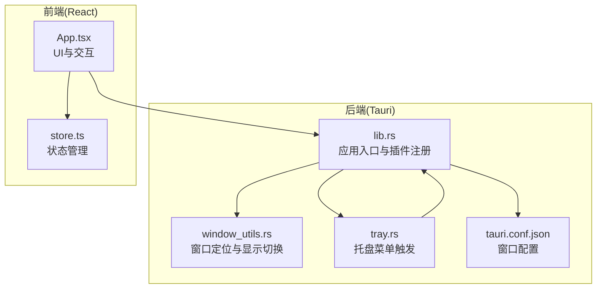
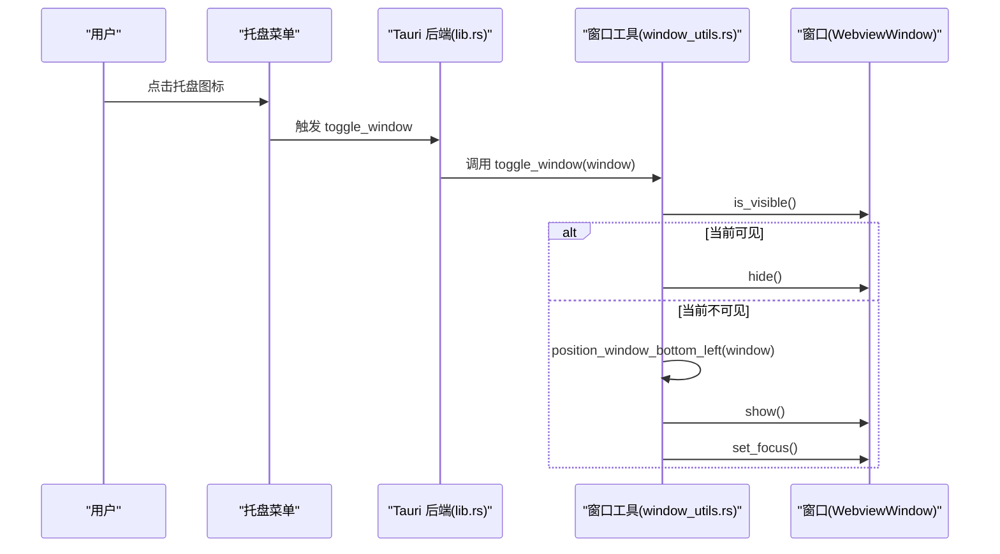
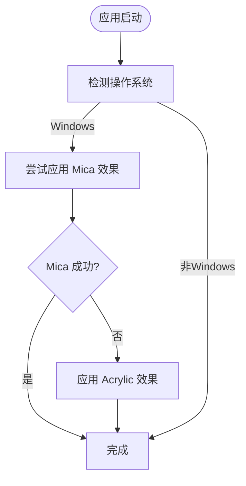
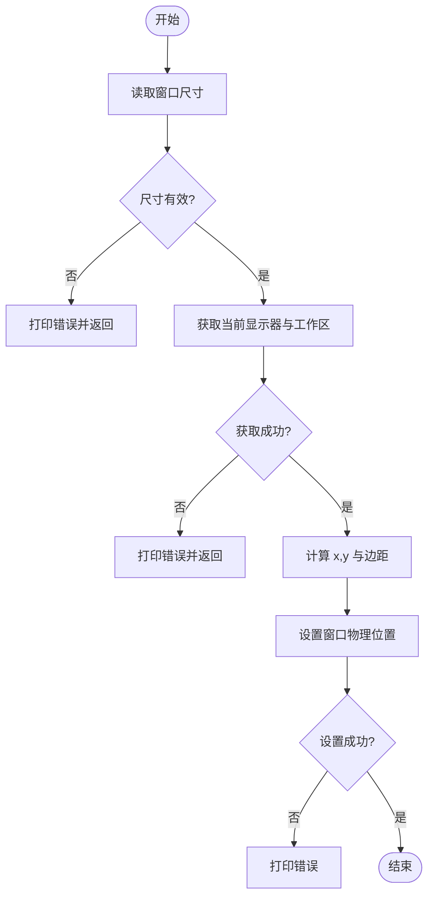
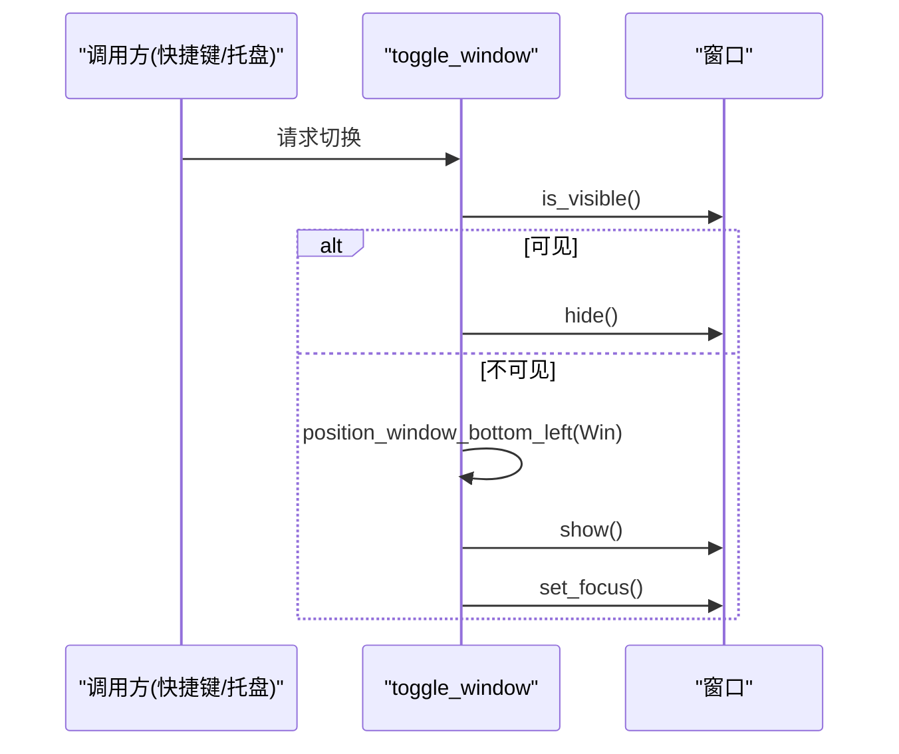
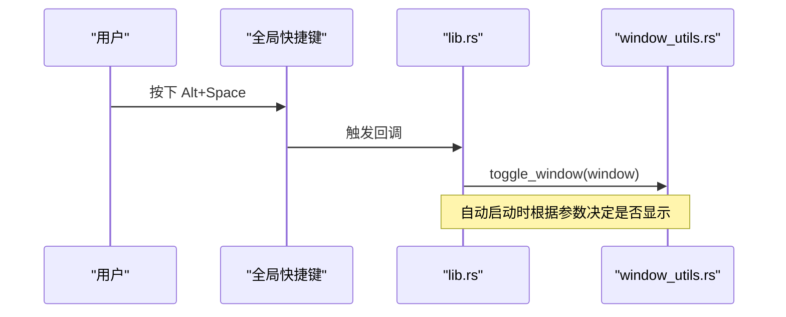
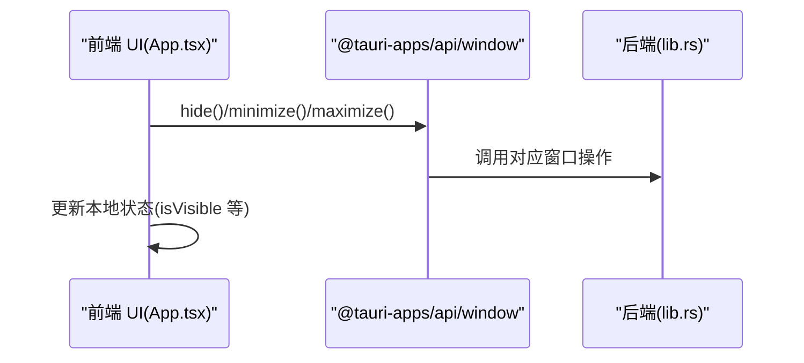
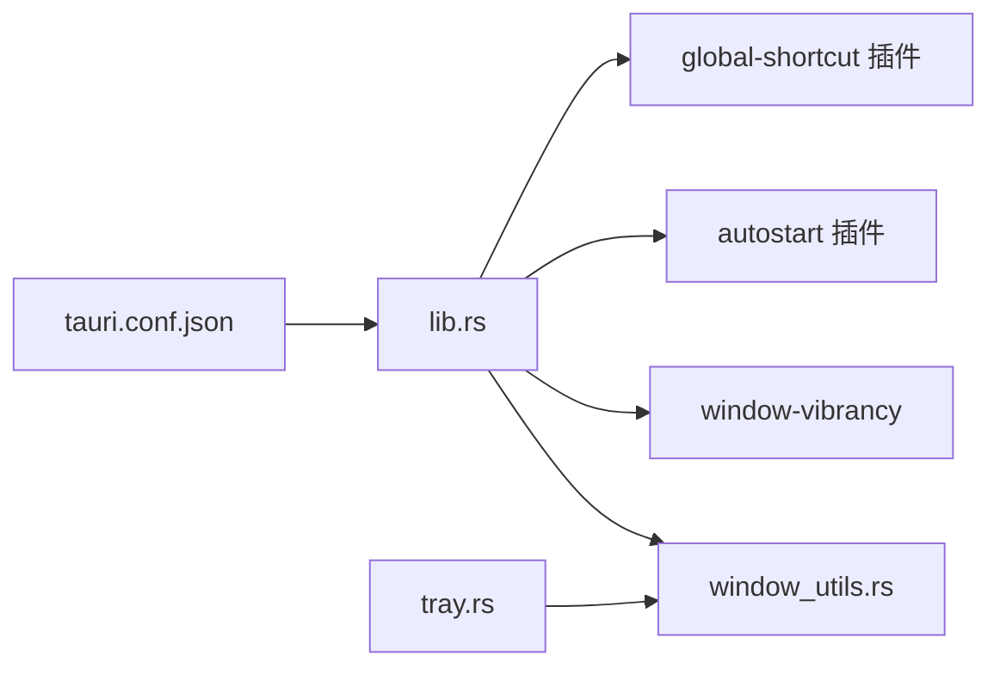

# 窗口管理

<cite>
**本文引用的文件**
- [src-tauri/src/lib.rs](file://src-tauri/src/lib.rs)
- [src-tauri/src/main.rs](file://src-tauri/src/main.rs)
- [src-tauri/src/window_utils.rs](file://src-tauri/src/window_utils.rs)
- [src-tauri/Cargo.toml](file://src-tauri/Cargo.toml)
- [src-tauri/tauri.conf.json](file://src-tauri/tauri.conf.json)
- [src/App.tsx](file://src/App.tsx)
- [src/store.ts](file://src/store.ts)
- [src-tauri/src/tray.rs](file://src-tauri/src/tray.rs)
</cite>

## 目录
1. [简介](#简介)
2. [项目结构](#项目结构)
3. [核心组件](#核心组件)
4. [架构总览](#架构总览)
5. [详细组件分析](#详细组件分析)
6. [依赖关系分析](#依赖关系分析)
7. [性能考量](#性能考量)
8. [故障排查指南](#故障排查指南)
9. [结论](#结论)
10. [附录](#附录)

## 简介
本文件聚焦 QuickStart 的“快速启动”窗口管理能力，围绕以下主题展开：
- 透明窗口与毛玻璃效果：基于 Tauri 与 window-vibrancy 插件在 Windows 上实现 Mica（Win11）与 Acrylic（Win10）效果。
- 窗口位置控制：position_window_bottom_left 函数的定位算法，确保窗口出现在屏幕左下角（避开任务栏）。
- 显示切换逻辑：toggle_window 在显示/隐藏之间的切换流程，以及显示时的前置与焦点设置。
- 多显示器支持：通过当前显示器工作区与缩放因子计算，适配不同 DPI 与主/副屏。
- 窗口尺寸管理：读取窗口当前尺寸，结合工作区进行定位。
- 焦点控制：显示窗口后主动设置焦点，提升交互体验。
- 状态持久化：前端 Store 中的可见性状态与后端窗口配置联动。
- 自定义行为与体验优化：全局快捷键、托盘菜单触发、窗口装饰关闭与透明背景。

## 项目结构
QuickStart 的窗口管理由 Rust 后端（Tauri）与 React 前端共同协作完成：
- 后端负责窗口生命周期、全局快捷键、毛玻璃效果、窗口定位与显示切换。
- 前端负责用户交互、窗口可见性状态管理、键盘导航与窗口控制（最小化、最大化等）。

图表来源
- [src-tauri/src/lib.rs:22-95](file://src-tauri/src/lib.rs#L22-L95)
- [src-tauri/src/window_utils.rs:1-56](file://src-tauri/src/window_utils.rs#L1-L56)
- [src-tauri/src/tray.rs](file://src-tauri/src/tray.rs)
- [src-tauri/tauri.conf.json:28-40](file://src-tauri/tauri.conf.json#L28-L40)
- [src/App.tsx:274-800](file://src/App.tsx#L274-L800)
- [src/store.ts:13-45](file://src/store.ts#L13-L45)

章节来源
- [src-tauri/src/lib.rs:22-95](file://src-tauri/src/lib.rs#L22-L95)
- [src-tauri/tauri.conf.json:28-40](file://src-tauri/tauri.conf.json#L28-L40)
- [src/App.tsx:274-800](file://src/App.tsx#L274-L800)
- [src/store.ts:13-45](file://src/store.ts#L13-L45)

## 核心组件
- 窗口定位工具：position_window_bottom_left，负责根据当前显示器工作区与缩放因子，将窗口定位到左下角，并预留小边距。
- 显示切换工具：toggle_window，封装显示/隐藏逻辑，显示时先定位再显示并设置焦点。
- 毛玻璃效果：在 Windows 上优先应用 Mica，失败回退 Acrylic，使用 window-vibrancy 插件。
- 全局快捷键：Alt+Space 触发窗口显示/隐藏。
- 托盘菜单：点击托盘图标也可触发窗口显示/隐藏。
- 前端窗口控制：最小化、最大化、隐藏等操作由前端调用 Tauri API 实现。

章节来源
- [src-tauri/src/window_utils.rs:4-56](file://src-tauri/src/window_utils.rs#L4-L56)
- [src-tauri/src/lib.rs:18-92](file://src-tauri/src/lib.rs#L18-L92)
- [src-tauri/src/tray.rs](file://src-tauri/src/tray.rs)
- [src-tauri/Cargo.toml:31](file://src-tauri/Cargo.toml#L31)
- [src-tauri/tauri.conf.json:32-38](file://src-tauri/tauri.conf.json#L32-L38)
- [src/App.tsx:644-656](file://src/App.tsx#L644-L656)

## 架构总览
后端通过 Tauri 插件体系完成窗口管理与视觉效果，前端通过 @tauri-apps/api 与后端通信，实现统一的窗口控制体验。

图表来源
- [src-tauri/src/lib.rs:30-40](file://src-tauri/src/lib.rs#L30-L40)
- [src-tauri/src/window_utils.rs:45-56](file://src-tauri/src/window_utils.rs#L45-L56)
- [src-tauri/src/tray.rs](file://src-tauri/src/tray.rs)

## 详细组件分析

### 透明窗口与毛玻璃效果
- 透明窗口：在 tauri.conf.json 中开启透明与无装饰，窗口初始不可见，通过后端控制显示与定位。
- 毛玻璃效果：在 Windows 上优先尝试 Mica，失败则回退 Acrylic；参数采用半透明黑色背景以适配浅色/深色主题。
- 插件依赖：window-vibrancy 0.5，后端通过 apply_mica/apply_acrylic 应用效果。

图表来源
- [src-tauri/src/lib.rs:80-88](file://src-tauri/src/lib.rs#L80-L88)
- [src-tauri/Cargo.toml:31](file://src-tauri/Cargo.toml#L31)

章节来源
- [src-tauri/tauri.conf.json:32-38](file://src-tauri/tauri.conf.json#L32-L38)
- [src-tauri/src/lib.rs:80-88](file://src-tauri/src/lib.rs#L80-L88)
- [src-tauri/Cargo.toml:31](file://src-tauri/Cargo.toml#L31)

### 窗口位置控制：position_window_bottom_left 定位算法
- 步骤概览：
  1) 读取窗口当前尺寸（失败则记录错误并返回）。
  2) 获取当前显示器工作区（排除任务栏区域）与缩放因子。
  3) 计算左下角位置：x 为工作区左上角横坐标 + 边距；y 为工作区顶部 + 高度 - 窗口高度 - 边距。
  4) 设置物理位置，失败则记录错误。
- 关键点：
  - 使用工作区而非屏幕尺寸，避免任务栏遮挡。
  - 边距随缩放因子线性调整，保证视觉一致性。
  - 位置设置在显示前执行，避免闪烁。

图表来源
- [src-tauri/src/window_utils.rs:5-43](file://src-tauri/src/window_utils.rs#L5-L43)

章节来源
- [src-tauri/src/window_utils.rs:5-43](file://src-tauri/src/window_utils.rs#L5-L43)

### 显示切换逻辑：toggle_window
- 流程：
  - 若窗口当前可见，则隐藏。
  - 若窗口当前不可见，则先定位到左下角，再显示并设置焦点。
- 作用：
  - 统一显示/隐藏入口，减少重复逻辑。
  - 显示时前置并聚焦，提升交互即时性。

图表来源
- [src-tauri/src/window_utils.rs:45-56](file://src-tauri/src/window_utils.rs#L45-L56)

章节来源
- [src-tauri/src/window_utils.rs:45-56](file://src-tauri/src/window_utils.rs#L45-L56)

### 全局快捷键与托盘触发
- 全局快捷键：Alt+Space 注册为全局快捷键，按下时调用 toggle_window。
- 托盘菜单：托盘图标点击同样调用 toggle_window，便于无键盘场景使用。
- 自动启动：带 --autostart 参数时默认隐藏窗口；否则定位到左下角并显示。

图表来源
- [src-tauri/src/lib.rs:30-42](file://src-tauri/src/lib.rs#L30-L42)
- [src-tauri/src/lib.rs:72-92](file://src-tauri/src/lib.rs#L72-L92)
- [src-tauri/src/tray.rs](file://src-tauri/src/tray.rs)

章节来源
- [src-tauri/src/lib.rs:30-42](file://src-tauri/src/lib.rs#L30-L42)
- [src-tauri/src/lib.rs:72-92](file://src-tauri/src/lib.rs#L72-L92)
- [src-tauri/src/tray.rs](file://src-tauri/src/tray.rs)

### 前端窗口控制与状态管理
- 前端通过 @tauri-apps/api/window 控制窗口：隐藏、最小化、最大化。
- Store 中维护 isVisible 状态，可与后端窗口可见性联动（如需）。
- UI 层提供键盘导航与交互反馈，隐藏窗口时可配合后端 toggle_window。

图表来源
- [src/App.tsx:644-656](file://src/App.tsx#L644-L656)
- [src/store.ts:22-41](file://src/store.ts#L22-L41)

章节来源
- [src/App.tsx:644-656](file://src/App.tsx#L644-L656)
- [src/store.ts:22-41](file://src/store.ts#L22-L41)

## 依赖关系分析
- 插件与外部库：
  - tauri-plugin-global-shortcut：全局快捷键。
  - tauri-plugin-autostart：开机自启。
  - window-vibrancy：Windows 毛玻璃效果。
  - tauri 与 @tauri-apps/api：窗口 API 与事件通信。
- 内部模块：
  - lib.rs：应用入口、插件注册、窗口初始化与效果应用。
  - window_utils.rs：窗口定位与显示切换工具。
  - tray.rs：托盘菜单触发逻辑。
  - tauri.conf.json：窗口透明、无装饰、初始不可见等配置。

图表来源
- [src-tauri/src/lib.rs:18-42](file://src-tauri/src/lib.rs#L18-L42)
- [src-tauri/Cargo.toml:15-36](file://src-tauri/Cargo.toml#L15-L36)
- [src-tauri/tauri.conf.json:28-40](file://src-tauri/tauri.conf.json#L28-L40)

章节来源
- [src-tauri/src/lib.rs:18-42](file://src-tauri/src/lib.rs#L18-L42)
- [src-tauri/Cargo.toml:15-36](file://src-tauri/Cargo.toml#L15-L36)
- [src-tauri/tauri.conf.json:28-40](file://src-tauri/tauri.conf.json#L28-L40)

## 性能考量
- 窗口定位与显示顺序：先定位再显示，避免闪烁，降低视觉抖动感。
- 缩放因子：使用 monitor.scale_factor() 计算边距，保证在高 DPI 下的观感一致。
- 毛玻璃回退：Mica 失败时快速回退 Acrylic，避免长时间等待。
- 前端交互：键盘导航与滚动到可视区使用平滑滚动，提升流畅度。

## 故障排查指南
- 无法获取窗口尺寸或显示器信息：
  - 检查窗口句柄有效性与权限。
  - 查看日志输出，确认错误类型。
- 毛玻璃效果未生效：
  - 确认运行环境为 Windows。
  - 检查 window-vibrancy 版本与依赖。
- 快捷键无效：
  - 确认全局快捷键已注册且未被系统占用。
  - 检查插件初始化顺序与权限。
- 托盘触发无效：
  - 确认托盘图标创建成功与事件绑定。
  - 检查调用 toggle_window 的上下文。

章节来源
- [src-tauri/src/window_utils.rs:7-26](file://src-tauri/src/window_utils.rs#L7-L26)
- [src-tauri/src/lib.rs:80-88](file://src-tauri/src/lib.rs#L80-L88)
- [src-tauri/src/lib.rs:62-66](file://src-tauri/src/lib.rs#L62-L66)
- [src-tauri/src/tray.rs](file://src-tauri/src/tray.rs)

## 结论
QuickStart 的窗口管理以简洁可靠为核心目标：通过透明窗口与毛玻璃效果提升视觉质感，借助精确的左下角定位算法与显示切换逻辑，提供即开即用的启动器体验。全局快捷键与托盘菜单覆盖多种触发场景，前端与后端协同实现一致的窗口控制与状态管理。在多显示器与高 DPI 场景下，通过工作区与缩放因子计算，确保定位与观感的一致性。

## 附录
- 窗口配置要点：
  - 透明与无装饰：提升视觉通透感。
  - 初始不可见：避免启动时闪烁。
  - focus：显示后主动获取焦点，改善交互。
- 自定义建议：
  - 动画：可在前端引入淡入淡出或缩放过渡，配合后端显示时机。
  - 状态持久化：若需记住上次可见性，可在 Store 中增加持久化逻辑并与后端联动。
  - 多显示器：当前实现基于当前显示器工作区，如需跨屏记忆位置，可扩展存储与恢复逻辑。