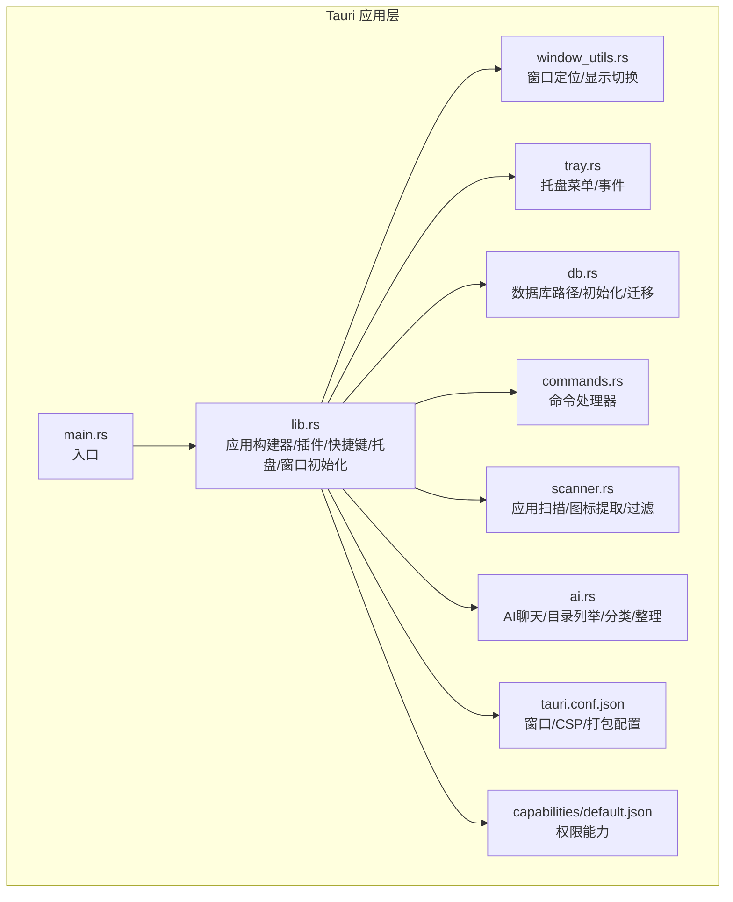
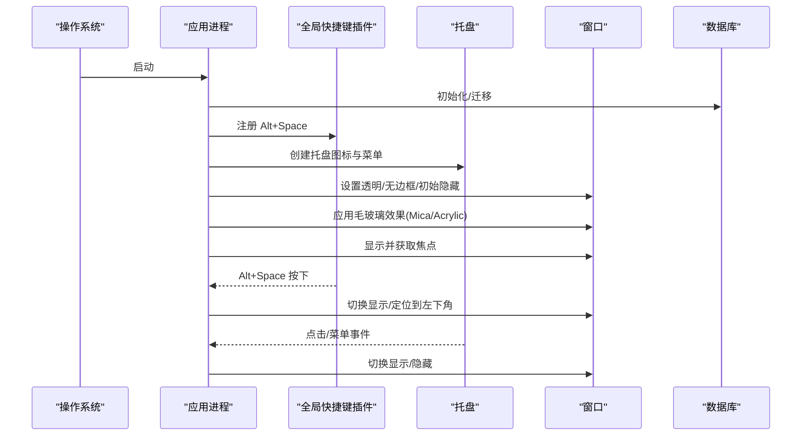
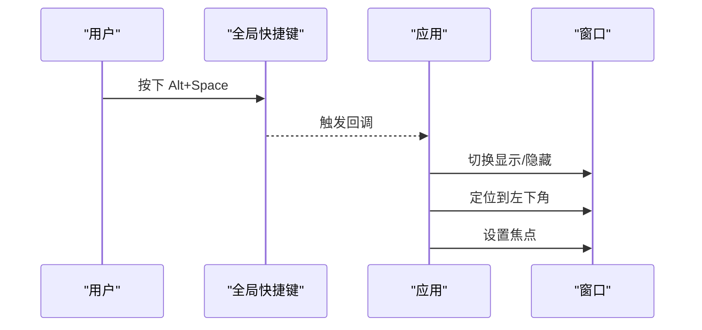
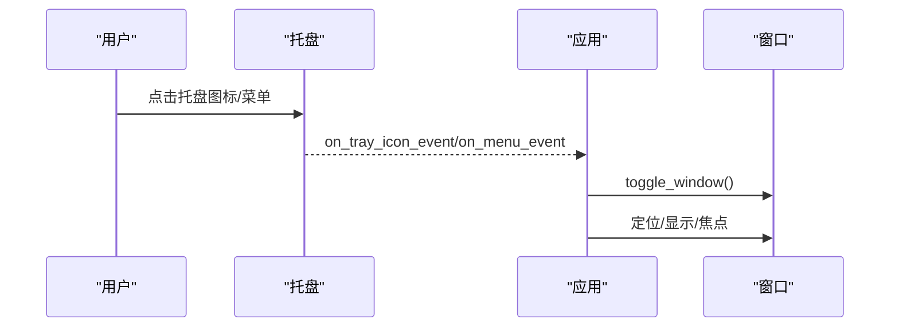
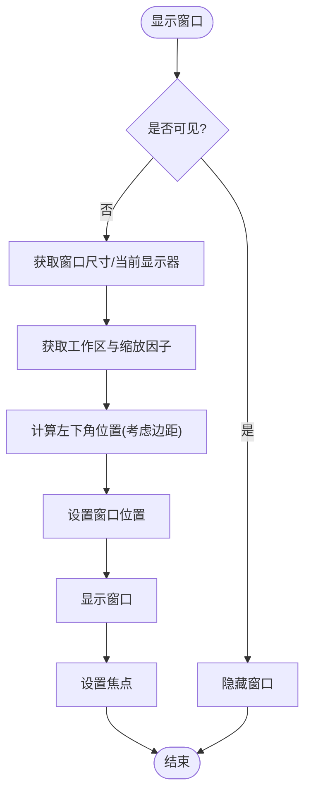
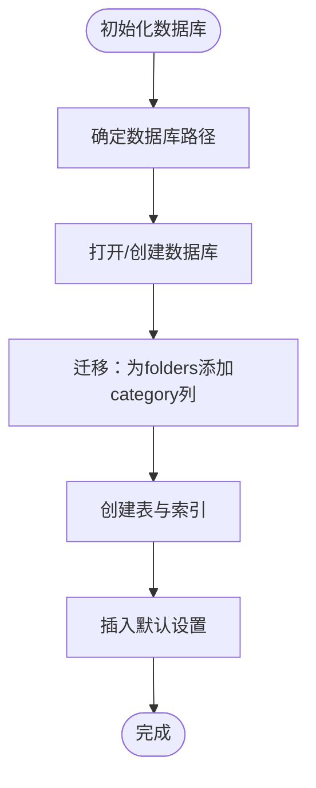
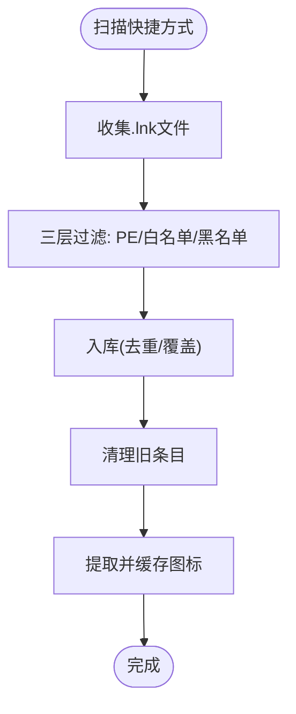
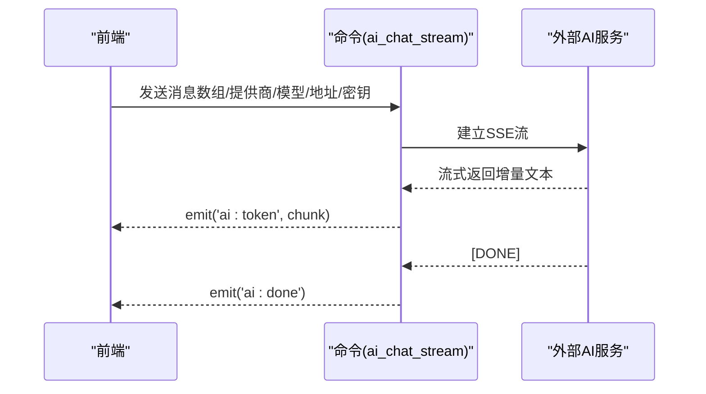
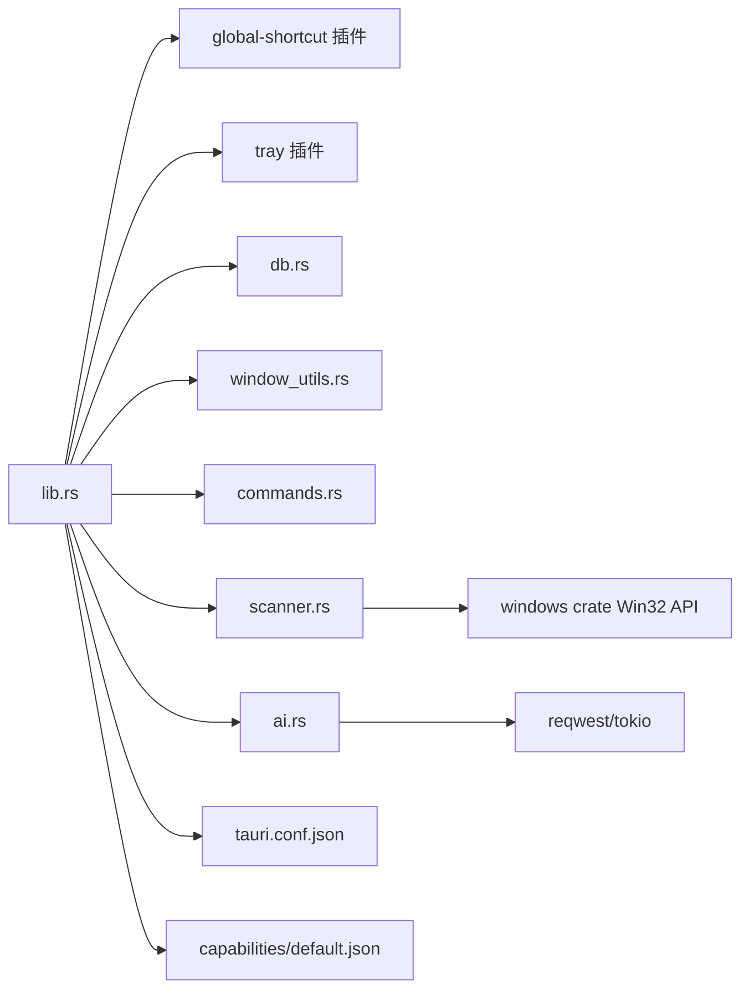

# 系统集成

<cite>
**本文引用的文件**
- [src-tauri/src/main.rs](file://src-tauri/src/main.rs)
- [src-tauri/src/lib.rs](file://src-tauri/src/lib.rs)
- [src-tauri/src/window_utils.rs](file://src-tauri/src/window_utils.rs)
- [src-tauri/src/tray.rs](file://src-tauri/src/tray.rs)
- [src-tauri/src/db.rs](file://src-tauri/src/db.rs)
- [src-tauri/src/commands.rs](file://src-tauri/src/commands.rs)
- [src-tauri/src/scanner.rs](file://src-tauri/src/scanner.rs)
- [src-tauri/src/ai.rs](file://src-tauri/src/ai.rs)
- [src-tauri/Cargo.toml](file://src-tauri/Cargo.toml)
- [src-tauri/tauri.conf.json](file://src-tauri/tauri.conf.json)
- [src-tauri/capabilities/default.json](file://src-tauri/capabilities/default.json)
</cite>

## 目录
1. [简介](#简介)
2. [项目结构](#项目结构)
3. [核心组件](#核心组件)
4. [架构总览](#架构总览)
5. [详细组件分析](#详细组件分析)
6. [依赖关系分析](#依赖关系分析)
7. [性能考量](#性能考量)
8. [故障排查指南](#故障排查指南)
9. [结论](#结论)
10. [附录](#附录)

## 简介
本文件面向QuickStart系统的“系统集成”能力，聚焦Windows平台的系统API集成、全局热键注册、托盘图标管理与窗口控制机制，详解透明窗口与毛玻璃效果、窗口位置与尺寸管理、权限配置、CSP策略、安全考虑与系统兼容性，并提供配置项说明、自定义集成与扩展开发指南，以及与操作系统交互的最佳实践与性能优化建议。

## 项目结构
QuickStart采用Tauri 2作为跨平台桌面框架，Rust负责后端与系统集成，前端使用Vite构建。系统集成相关的核心位于src-tauri目录，包含窗口工具、托盘、数据库、命令处理、扫描器、AI模块及配置文件。

图表来源
- [src-tauri/src/main.rs:1-7](file://src-tauri/src/main.rs#L1-L7)
- [src-tauri/src/lib.rs:1-135](file://src-tauri/src/lib.rs#L1-L135)
- [src-tauri/src/window_utils.rs:1-56](file://src-tauri/src/window_utils.rs#L1-L56)
- [src-tauri/src/tray.rs:1-59](file://src-tauri/src/tray.rs#L1-L59)
- [src-tauri/src/db.rs:1-156](file://src-tauri/src/db.rs#L1-L156)
- [src-tauri/src/commands.rs:1-709](file://src-tauri/src/commands.rs#L1-L709)
- [src-tauri/src/scanner.rs:1-483](file://src-tauri/src/scanner.rs#L1-L483)
- [src-tauri/src/ai.rs:1-501](file://src-tauri/src/ai.rs#L1-L501)
- [src-tauri/tauri.conf.json:1-54](file://src-tauri/tauri.conf.json#L1-L54)
- [src-tauri/capabilities/default.json:1-36](file://src-tauri/capabilities/default.json#L1-L36)

章节来源
- [src-tauri/src/main.rs:1-7](file://src-tauri/src/main.rs#L1-L7)
- [src-tauri/src/lib.rs:1-135](file://src-tauri/src/lib.rs#L1-L135)
- [src-tauri/tauri.conf.json:1-54](file://src-tauri/tauri.conf.json#L1-L54)
- [src-tauri/capabilities/default.json:1-36](file://src-tauri/capabilities/default.json#L1-L36)

## 核心组件
- 入口与运行时：入口函数调用lib.rs中的run()，统一构建应用、注册插件、初始化数据库、设置托盘与窗口、注册全局热键。
- 窗口工具：提供窗口定位到屏幕左下角（任务栏上方）、显示/隐藏切换与焦点管理。
- 托盘：构建托盘菜单（显示/隐藏、退出），绑定点击事件与菜单事件。
- 数据库：确定应用数据目录下的数据库文件，初始化表结构与默认设置。
- 命令：暴露大量命令给前端调用，涵盖应用/文件夹管理、设置、搜索历史、扫描、AI等。
- 扫描器：扫描开始菜单与桌面快捷方式，三层过滤识别真实应用，提取图标并缓存。
- AI：支持OpenAI/Claude/Ollama的SSE流式对话，目录列举、应用分类与文件整理。
- 配置：窗口装饰、透明、初始不可见；CSP策略；打包与安装模式；能力权限清单。

章节来源
- [src-tauri/src/lib.rs:22-95](file://src-tauri/src/lib.rs#L22-L95)
- [src-tauri/src/window_utils.rs:5-56](file://src-tauri/src/window_utils.rs#L5-L56)
- [src-tauri/src/tray.rs:8-59](file://src-tauri/src/tray.rs#L8-L59)
- [src-tauri/src/db.rs:7-133](file://src-tauri/src/db.rs#L7-L133)
- [src-tauri/src/commands.rs:32-709](file://src-tauri/src/commands.rs#L32-L709)
- [src-tauri/src/scanner.rs:186-228](file://src-tauri/src/scanner.rs#L186-L228)
- [src-tauri/src/ai.rs:61-254](file://src-tauri/src/ai.rs#L61-L254)
- [src-tauri/tauri.conf.json:28-51](file://src-tauri/tauri.conf.json#L28-L51)
- [src-tauri/capabilities/default.json:5-34](file://src-tauri/capabilities/default.json#L5-L34)

## 架构总览
QuickStart在启动阶段完成系统级集成：注册全局热键、创建托盘、初始化数据库、设置窗口属性并应用毛玻璃效果。随后通过命令系统与前端交互，扫描系统应用、提取图标、维护分类与设置，并可选地调用外部AI服务。

图表来源
- [src-tauri/src/lib.rs:62-92](file://src-tauri/src/lib.rs#L62-L92)
- [src-tauri/src/tray.rs:29-54](file://src-tauri/src/tray.rs#L29-L54)
- [src-tauri/src/window_utils.rs:46-56](file://src-tauri/src/window_utils.rs#L46-L56)
- [src-tauri/src/db.rs:17-133](file://src-tauri/src/db.rs#L17-L133)

## 详细组件分析

### 全局热键注册与响应
- 注册：在应用setup阶段注册Alt+Space为全局热键。
- 响应：按下时获取主窗口句柄，调用toggle_window进行显示/隐藏切换，并在显示时定位到左下角、设置焦点。
- 兼容性：使用tari-plugin-global-shortcut，支持Windows/Linux/macOS。

图表来源
- [src-tauri/src/lib.rs:62-66](file://src-tauri/src/lib.rs#L62-L66)
- [src-tauri/src/lib.rs:30-40](file://src-tauri/src/lib.rs#L30-L40)
- [src-tauri/src/window_utils.rs:46-56](file://src-tauri/src/window_utils.rs#L46-L56)

章节来源
- [src-tauri/src/lib.rs:62-66](file://src-tauri/src/lib.rs#L62-L66)
- [src-tauri/src/lib.rs:30-40](file://src-tauri/src/lib.rs#L30-L40)
- [src-tauri/src/window_utils.rs:46-56](file://src-tauri/src/window_utils.rs#L46-L56)

### 托盘图标管理与事件
- 菜单：包含“显示/隐藏”（带加速键Alt+Space）与“退出”。
- 事件：
  - 菜单点击“显示/隐藏”触发toggle_window。
  - 托盘图标左键抬起事件同样触发toggle_window。
  - “退出”直接退出应用。
- 交互：托盘事件中通过AppHandle获取主窗口并执行操作。

图表来源
- [src-tauri/src/tray.rs:29-54](file://src-tauri/src/tray.rs#L29-L54)
- [src-tauri/src/window_utils.rs:46-56](file://src-tauri/src/window_utils.rs#L46-L56)

章节来源
- [src-tauri/src/tray.rs:8-59](file://src-tauri/src/tray.rs#L8-L59)

### 窗口控制与透明/毛玻璃效果
- 窗口属性：宽度、高度、无边框、透明、初始不可见、居中false、获得焦点。
- 位置管理：position_window_bottom_left基于当前显示器工作区与缩放因子计算左下角位置，避免任务栏遮挡。
- 显示切换：toggle_window在显示前先定位，减少闪烁；显示后设置焦点。
- 毛玻璃：优先应用Mica（Win11），失败回退Acrylic（Win10），使用半透明黑色背景。

图表来源
- [src-tauri/src/window_utils.rs:5-56](file://src-tauri/src/window_utils.rs#L5-L56)
- [src-tauri/src/lib.rs:80-88](file://src-tauri/src/lib.rs#L80-L88)
- [src-tauri/tauri.conf.json:32-38](file://src-tauri/tauri.conf.json#L32-L38)

章节来源
- [src-tauri/src/window_utils.rs:5-56](file://src-tauri/src/window_utils.rs#L5-L56)
- [src-tauri/src/lib.rs:80-88](file://src-tauri/src/lib.rs#L80-L88)
- [src-tauri/tauri.conf.json:28-40](file://src-tauri/tauri.conf.json#L28-L40)

### 数据库初始化与迁移
- 路径：应用数据目录下quickstart.db。
- 初始化：创建apps/categories/folders/folder_categories/settings/search_history/chat_history等表；迁移folders表添加category列；同步现有数据至categories。
- 默认设置：包含热键、开机自启、主题、自动分类、AI提供商/API/模型等键值。

图表来源
- [src-tauri/src/db.rs:7-133](file://src-tauri/src/db.rs#L7-L133)

章节来源
- [src-tauri/src/db.rs:7-133](file://src-tauri/src/db.rs#L7-L133)

### 应用扫描与图标提取（Windows API）
- 扫描：遍历开始菜单与桌面快捷方式，按名称去重，桌面优先。
- 过滤：三层过滤（PE GUI检查、系统白名单、名称黑名单）。
- 图标：使用Win32 API提取大图标为PNG，缓存至应用数据目录icons子目录。
- 安全：使用lnk crate解析.lnk目标，避免命令注入；路径校验限制在允许范围内。

图表来源
- [src-tauri/src/scanner.rs:186-228](file://src-tauri/src/scanner.rs#L186-L228)
- [src-tauri/src/scanner.rs:102-153](file://src-tauri/src/scanner.rs#L102-L153)
- [src-tauri/src/scanner.rs:289-326](file://src-tauri/src/scanner.rs#L289-L326)

章节来源
- [src-tauri/src/scanner.rs:186-228](file://src-tauri/src/scanner.rs#L186-L228)
- [src-tauri/src/scanner.rs:102-153](file://src-tauri/src/scanner.rs#L102-L153)
- [src-tauri/src/scanner.rs:289-326](file://src-tauri/src/scanner.rs#L289-L326)

### AI集成与安全
- 对话：支持OpenAI/Claude/Ollama的SSE流式输出，前端逐段接收并渲染。
- 目录列举：限制在应用数据目录与用户常用目录范围内，路径合法性校验。
- 应用分类：从数据库读取未分类应用，构造提示词，调用LLM生成JSON，回写分类并同步新分类。
- 安全：SSE解析仅处理data行；路径校验防止越权访问；对AI响应提取JSON片段，避免误解析。

图表来源
- [src-tauri/src/ai.rs:61-254](file://src-tauri/src/ai.rs#L61-L254)

章节来源
- [src-tauri/src/ai.rs:61-254](file://src-tauri/src/ai.rs#L61-L254)
- [src-tauri/src/ai.rs:257-319](file://src-tauri/src/ai.rs#L257-L319)
- [src-tauri/src/ai.rs:370-460](file://src-tauri/src/ai.rs#L370-L460)

### 权限配置与CSP策略
- 能力：default.json声明了窗口、事件、shell、opener、dialog、process、global-shortcut、autostart等权限，限定作用窗口为"main"。
- CSP：严格限制脚本、样式、图片、连接、字体来源，启用asset协议并限定作用域。
- 安全：CSP与能力清单共同约束前端可执行的操作与加载资源的来源。

章节来源
- [src-tauri/capabilities/default.json:5-34](file://src-tauri/capabilities/default.json#L5-L34)
- [src-tauri/tauri.conf.json:41-50](file://src-tauri/tauri.conf.json#L41-L50)

## 依赖关系分析
- Rust依赖：tauri、tauri-plugins（shell/dialog/opener/process/global-shortcut/autostart）、window-vibrancy（毛玻璃）、windows（Win32 API）、rusqlite（SQLite）、reqwest/futures-util/tokio（网络与并发）、lnk（解析.lnk）、png（编码）、open（打开文件/URL）。
- 插件链路：lib.rs中注册各插件并在setup阶段初始化；commands.rs集中暴露命令；scanner.rs与ai.rs分别承担扫描与AI能力。

图表来源
- [src-tauri/src/lib.rs:22-95](file://src-tauri/src/lib.rs#L22-L95)
- [src-tauri/Cargo.toml:15-36](file://src-tauri/Cargo.toml#L15-L36)
- [src-tauri/tauri.conf.json:6-53](file://src-tauri/tauri.conf.json#L6-L53)
- [src-tauri/capabilities/default.json:1-36](file://src-tauri/capabilities/default.json#L1-L36)

章节来源
- [src-tauri/Cargo.toml:15-36](file://src-tauri/Cargo.toml#L15-L36)
- [src-tauri/src/lib.rs:22-95](file://src-tauri/src/lib.rs#L22-L95)

## 性能考量
- 异步与线程池：扫描与图标提取使用spawn_blocking避免阻塞UI；AI流式处理减少内存占用。
- I/O与缓存：图标缓存至本地PNG，避免重复提取；数据库批量写入与事务保护。
- 窗口动画与闪烁：显示前先定位，减少窗口抖动；透明+无边框降低合成开销。
- 网络超时：对外部API设置合理超时，避免长时间等待。
- 资源释放：Win32 GDI对象在提取图标后及时销毁，避免句柄泄漏。

## 故障排查指南
- 全局热键无效
  - 检查是否正确注册；确认未与其他应用冲突。
  - 参考：[src-tauri/src/lib.rs:62-66](file://src-tauri/src/lib.rs#L62-L66)
- 托盘无响应
  - 确认托盘已创建且菜单项ID匹配；检查事件回调是否触发。
  - 参考：[src-tauri/src/tray.rs:29-54](file://src-tauri/src/tray.rs#L29-L54)
- 窗口不显示或位置异常
  - 检查显示器工作区与缩放因子；确保在setup后调用定位与显示。
  - 参考：[src-tauri/src/window_utils.rs:5-56](file://src-tauri/src/window_utils.rs#L5-L56)
- 毛玻璃效果失败
  - Win11优先Mica，失败回退Acrylic；确认窗口透明与无边框设置。
  - 参考：[src-tauri/src/lib.rs:80-88](file://src-tauri/src/lib.rs#L80-L88)
- 图标提取失败
  - 检查.lnk目标路径有效性；确认Win32 API返回图标句柄；验证PNG编码。
  - 参考：[src-tauri/src/scanner.rs:289-326](file://src-tauri/src/scanner.rs#L289-L326)
- AI流式输出中断
  - 检查SSE解析逻辑；确认API鉴权与URL；关注网络超时。
  - 参考：[src-tauri/src/ai.rs:61-254](file://src-tauri/src/ai.rs#L61-L254)
- 数据库初始化失败
  - 检查应用数据目录权限；确认迁移SQL语法；查看rusqlite错误。
  - 参考：[src-tauri/src/db.rs:17-133](file://src-tauri/src/db.rs#L17-L133)

章节来源
- [src-tauri/src/lib.rs:80-88](file://src-tauri/src/lib.rs#L80-L88)
- [src-tauri/src/tray.rs:29-54](file://src-tauri/src/tray.rs#L29-L54)
- [src-tauri/src/window_utils.rs:5-56](file://src-tauri/src/window_utils.rs#L5-L56)
- [src-tauri/src/scanner.rs:289-326](file://src-tauri/src/scanner.rs#L289-L326)
- [src-tauri/src/ai.rs:61-254](file://src-tauri/src/ai.rs#L61-L254)
- [src-tauri/src/db.rs:17-133](file://src-tauri/src/db.rs#L17-L133)

## 结论
QuickStart通过Tauri与Windows系统API深度集成，实现了稳定的全局热键、托盘交互、透明窗口与毛玻璃效果、智能窗口定位与显示控制。配合严格的CSP与能力权限、数据库迁移与安全路径校验、异步I/O与图标缓存等设计，在保证安全性的同时兼顾性能与用户体验。开发者可在此基础上扩展更多系统能力与AI工具。

## 附录

### 配置选项说明（来自配置文件）
- 窗口
  - 标签/标题/宽高/居中/装饰/透明/焦点/初始可见性
  - 参考：[src-tauri/tauri.conf.json:28-40](file://src-tauri/tauri.conf.json#L28-L40)
- 安全
  - CSP策略与资产协议作用域
  - 参考：[src-tauri/tauri.conf.json:41-50](file://src-tauri/tauri.conf.json#L41-L50)
- 打包
  - 图标、安装模式（按当前用户）
  - 参考：[src-tauri/tauri.conf.json:12-25](file://src-tauri/tauri.conf.json#L12-L25)
- 能力
  - 窗口/事件/Shell/Open/Dialog/Process/全局热键/开机自启权限
  - 参考：[src-tauri/capabilities/default.json:5-34](file://src-tauri/capabilities/default.json#L5-L34)

### 自定义集成与扩展开发指南
- 新增系统API
  - 在Cargo.toml引入所需windows特性或第三方crate；在scanner.rs/ai.rs等模块中按需调用。
  - 参考：[src-tauri/Cargo.toml:31-34](file://src-tauri/Cargo.toml#L31-L34)
- 新增命令
  - 在commands.rs中新增#[tauri::command]函数，并在lib.rs的invoke_handler中注册。
  - 参考：[src-tauri/src/commands.rs:32-709](file://src-tauri/src/commands.rs#L32-L709)
  - 参考：[src-tauri/src/lib.rs:96-132](file://src-tauri/src/lib.rs#L96-L132)
- 新增托盘菜单项
  - 在tray.rs中添加MenuItemBuilder，绑定事件处理。
  - 参考：[src-tauri/src/tray.rs:10-22](file://src-tauri/src/tray.rs#L10-L22)
- 新增全局热键
  - 在lib.rs的setup中注册Shortcut，设置匹配条件与回调。
  - 参考：[src-tauri/src/lib.rs:62-66](file://src-tauri/src/lib.rs#L62-L66)
- 数据库扩展
  - 在db.rs中添加表/索引/默认值；在commands.rs中新增对应命令。
  - 参考：[src-tauri/src/db.rs:17-133](file://src-tauri/src/db.rs#L17-L133)

### 与操作系统交互的最佳实践
- 窗口管理
  - 使用显示器工作区与缩放因子计算位置，避免硬编码任务栏高度。
  - 参考：[src-tauri/src/window_utils.rs:28-42](file://src-tauri/src/window_utils.rs#L28-L42)
- 权限最小化
  - 仅授予"main"窗口所需能力；避免开放过多权限。
  - 参考：[src-tauri/capabilities/default.json:4](file://src-tauri/capabilities/default.json#L4)
- 安全
  - CSP严格限制来源；AI与文件系统操作均做路径校验与越权拦截。
  - 参考：[src-tauri/tauri.conf.json:41-50](file://src-tauri/tauri.conf.json#L41-L50)
  - 参考：[src-tauri/src/ai.rs:37-49](file://src-tauri/src/ai.rs#L37-L49)
- 兼容性
  - Win11优先Mica，失败回退Acrylic；全局热键跨平台可用。
  - 参考：[src-tauri/src/lib.rs:80-88](file://src-tauri/src/lib.rs#L80-L88)
  - 参考：[src-tauri/Cargo.toml:21](file://src-tauri/Cargo.toml#L21)