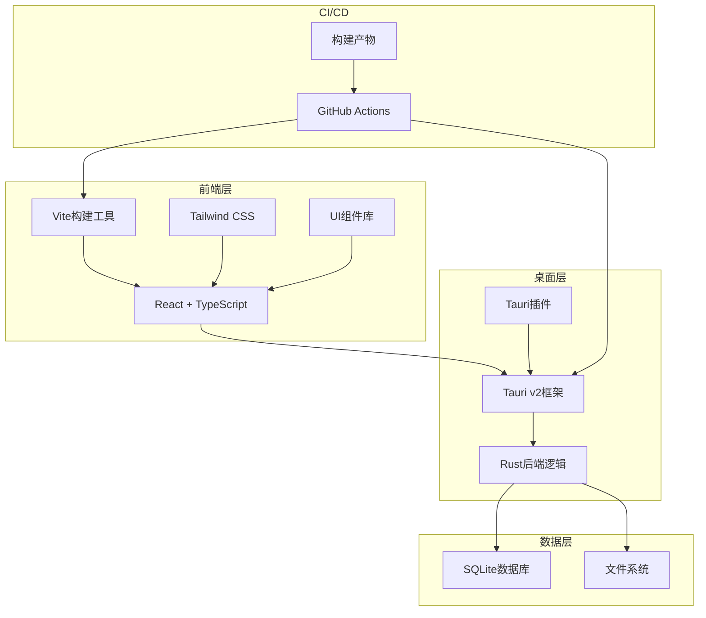
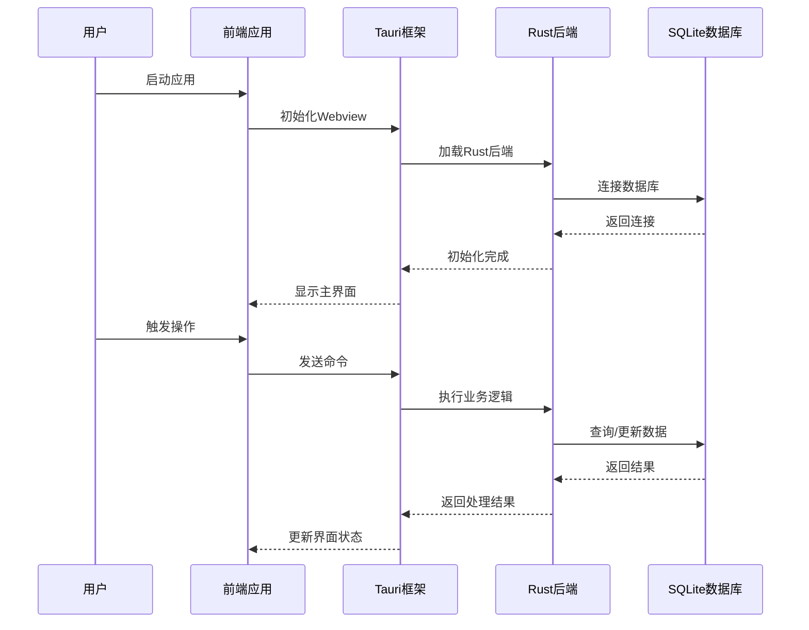
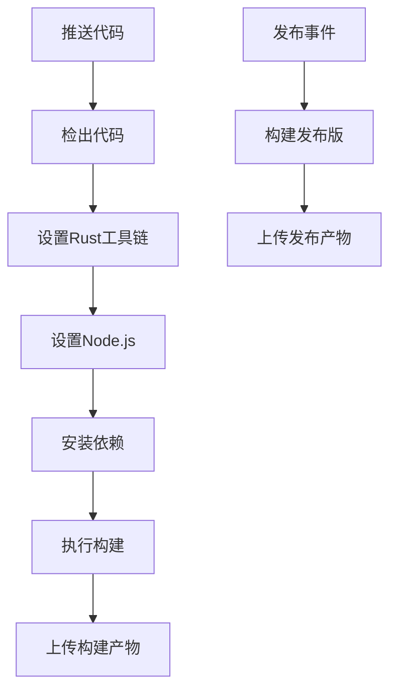
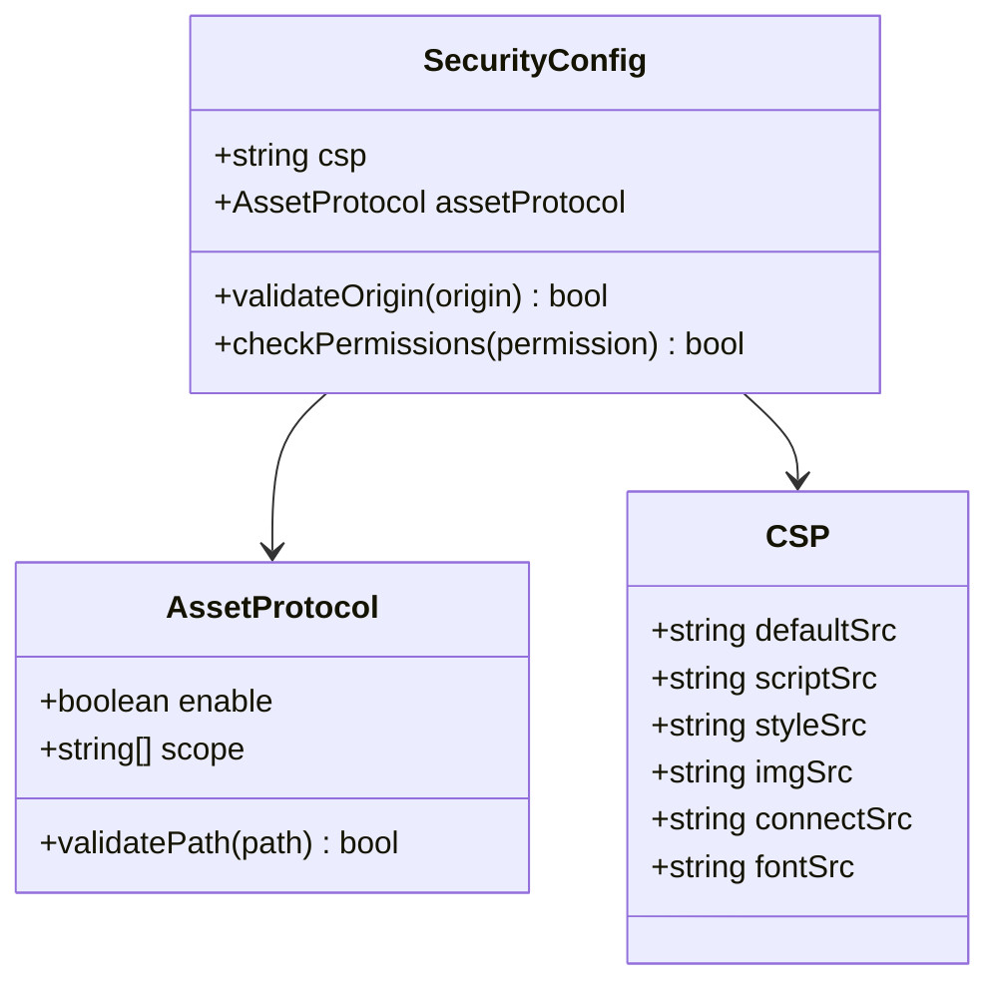
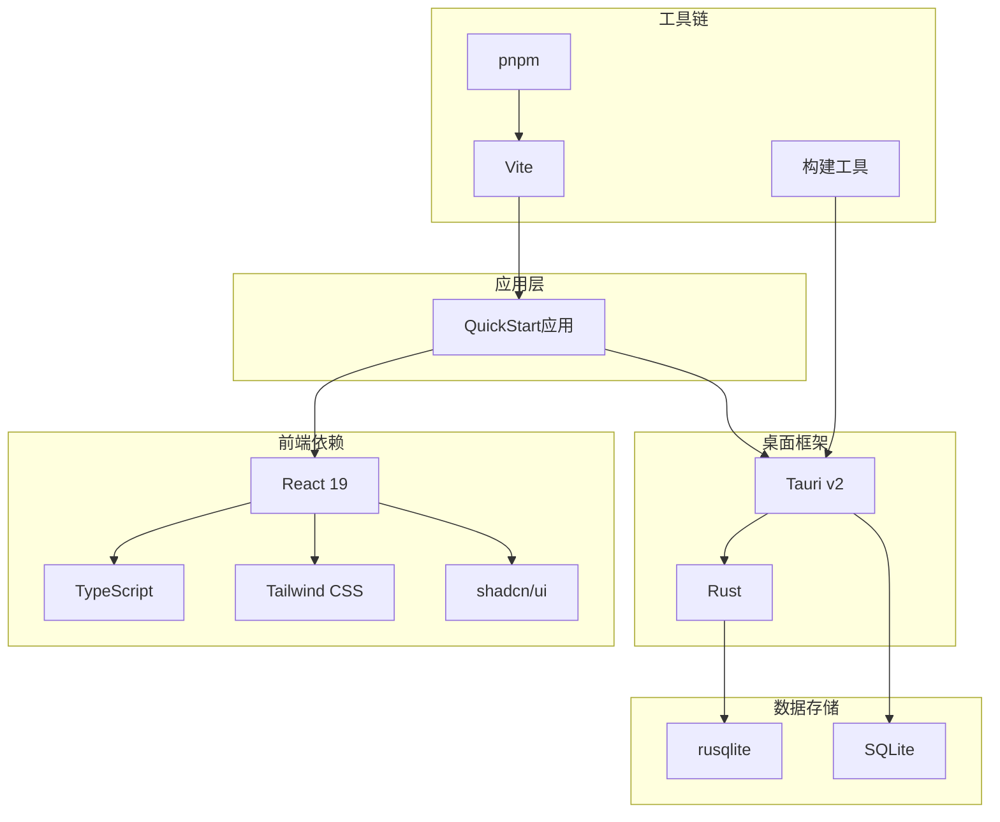

# 部署指南

<cite>
**本文档引用的文件**
- [package.json](file://package.json)
- [vite.config.ts](file://vite.config.ts)
- [src-tauri/Cargo.toml](file://src-tauri/Cargo.toml)
- [src-tauri/tauri.conf.json](file://src-tauri/tauri.conf.json)
- [.github/workflows/build.yml](file://.github/workflows/build.yml)
- [src-tauri/src/main.rs](file://src-tauri/src/main.rs)
- [src-tauri/src/lib.rs](file://src-tauri/src/lib.rs)
- [src-tauri/build.rs](file://src-tauri/build.rs)
- [tailwind.config.js](file://tailwind.config.js)
- [postcss.config.js](file://postcss.config.js)
- [tsconfig.json](file://tsconfig.json)
- [tsconfig.node.json](file://tsconfig.node.json)
- [README.md](file://README.md)
</cite>

## 目录
1. [简介](#简介)
2. [项目结构](#项目结构)
3. [核心组件](#核心组件)
4. [架构概览](#架构概览)
5. [详细组件分析](#详细组件分析)
6. [依赖关系分析](#依赖关系分析)
7. [性能考虑](#性能考虑)
8. [故障排除指南](#故障排除指南)
9. [结论](#结论)
10. [附录](#附录)

## 简介

QuickStart是一个基于Tauri v2 (Rust)的Windows桌面快捷启动器应用。该项目采用现代化的技术栈，结合React 19 + TypeScript + Tailwind CSS实现前端界面，使用SQLite进行数据存储，并集成了AI功能和语音识别能力。

本部署指南将详细介绍项目的构建配置、打包流程、签名证书和发布渠道，涵盖开发环境和生产环境的配置差异、资源优化和性能调优，以及CI/CD流水线配置、自动化测试和发布流程。

## 项目结构

QuickStart项目采用前后端分离的架构设计，主要分为以下模块：

**图表来源**
- [package.json:1-50](file://package.json#L1-L50)
- [src-tauri/Cargo.toml:1-36](file://src-tauri/Cargo.toml#L1-L36)
- [.github/workflows/build.yml:1-45](file://.github/workflows/build.yml#L1-L45)

**章节来源**
- [package.json:1-50](file://package.json#L1-L50)
- [src-tauri/Cargo.toml:1-36](file://src-tauri/Cargo.toml#L1-L36)
- [src-tauri/tauri.conf.json:1-54](file://src-tauri/tauri.conf.json#L1-L54)

## 核心组件

### 前端构建系统

项目使用Vite作为构建工具，配合React 19和TypeScript实现现代化的前端开发体验。构建配置支持热重载、TypeScript类型检查和开发服务器配置。

### 桌面应用框架

Tauri v2提供了跨平台的桌面应用框架，结合Rust实现高性能的后端逻辑。项目集成了多个Tauri插件，包括shell操作、对话框、进程管理和自动启动等。

### 数据存储层

使用SQLite数据库进行本地数据存储，通过rusqlite crate实现数据库连接和查询。支持应用程序列表、分类信息和用户设置的持久化存储。

**章节来源**
- [vite.config.ts:1-32](file://vite.config.ts#L1-L32)
- [src-tauri/src/lib.rs:1-135](file://src-tauri/src/lib.rs#L1-L135)
- [src-tauri/Cargo.toml:15-36](file://src-tauri/Cargo.toml#L15-L36)

## 架构概览

QuickStart采用分层架构设计，确保前后端分离和职责明确：

**图表来源**
- [src-tauri/src/lib.rs:22-95](file://src-tauri/src/lib.rs#L22-L95)
- [src-tauri/src/main.rs:1-7](file://src-tauri/src/main.rs#L1-L7)

## 详细组件分析

### 构建配置分析

#### 前端构建配置

项目使用Vite作为构建工具，配置了开发服务器、TypeScript支持和React插件。开发服务器监听1420端口，支持热模块替换和远程调试。

#### Rust后端配置

Cargo.toml定义了项目依赖和特性配置，集成了多个Tauri插件和系统功能。使用Windows子系统优化生产环境的用户体验。

#### Tauri配置

tauri.conf.json包含了应用的基本信息、构建设置、打包配置和安全策略。支持多种安装包格式和平台特定的配置。

**章节来源**
- [vite.config.ts:7-31](file://vite.config.ts#L7-L31)
- [src-tauri/Cargo.toml:12-36](file://src-tauri/Cargo.toml#L12-L36)
- [src-tauri/tauri.conf.json:6-53](file://src-tauri/tauri.conf.json#L6-L53)

### CI/CD流水线配置

项目使用GitHub Actions实现自动化构建和发布流程。流水线配置了Windows环境、Rust稳定版本和Node.js 22的依赖环境。

**图表来源**
- [.github/workflows/build.yml:12-45](file://.github/workflows/build.yml#L12-L45)

**章节来源**
- [.github/workflows/build.yml:1-45](file://.github/workflows/build.yml#L1-L45)

### 安全配置分析

项目实现了多层次的安全策略，包括内容安全策略(CSP)、资产协议配置和权限控制。

**图表来源**
- [src-tauri/tauri.conf.json:41-50](file://src-tauri/tauri.conf.json#L41-L50)

**章节来源**
- [src-tauri/tauri.conf.json:41-50](file://src-tauri/tauri.conf.json#L41-L50)

### 性能优化配置

项目采用了多项性能优化措施，包括资源压缩、缓存策略和渲染优化。

**章节来源**
- [tailwind.config.js:1-86](file://tailwind.config.js#L1-L86)
- [postcss.config.js:1-7](file://postcss.config.js#L1-L7)

## 依赖关系分析

### 依赖层次结构

**图表来源**
- [package.json:14-43](file://package.json#L14-L43)
- [src-tauri/Cargo.toml:15-36](file://src-tauri/Cargo.toml#L15-L36)

### 关键依赖分析

项目的关键依赖包括：
- **前端框架**: React 19 + TypeScript + Tailwind CSS
- **桌面框架**: Tauri v2 + Rust
- **数据存储**: SQLite + rusqlite
- **构建工具**: Vite + pnpm
- **UI组件**: Radix UI + shadcn/ui

**章节来源**
- [package.json:14-43](file://package.json#L14-L43)
- [src-tauri/Cargo.toml:15-36](file://src-tauri/Cargo.toml#L15-L36)

## 性能考虑

### 构建性能优化

项目采用了多项构建性能优化策略：

1. **增量构建**: Vite支持快速的热重载和增量编译
2. **并行构建**: GitHub Actions并行执行多个构建步骤
3. **依赖缓存**: pnpm的高效依赖管理减少重复下载
4. **资源优化**: Tailwind CSS的按需生成减少CSS体积

### 运行时性能优化

1. **内存管理**: Rust的内存安全保证和零成本抽象
2. **数据库优化**: SQLite的高效查询和索引策略
3. **UI渲染**: React 19的并发特性和优化的渲染策略
4. **网络请求**: 请求去重和缓存策略

## 故障排除指南

### 常见构建问题

1. **依赖安装失败**: 确保使用pnpm 10+版本，清理node_modules后重新安装
2. **Rust工具链问题**: 检查Rust稳定版本是否正确安装
3. **Windows SDK缺失**: 安装Visual Studio Build Tools
4. **权限问题**: 以管理员权限运行构建脚本

### 运行时问题

1. **应用无法启动**: 检查Windows子系统配置和依赖库
2. **数据库连接失败**: 验证数据库文件路径和权限
3. **插件加载错误**: 确认插件版本兼容性和配置正确性
4. **热键冲突**: 检查系统热键设置和应用快捷键配置

**章节来源**
- [src-tauri/src/main.rs:1-7](file://src-tauri/src/main.rs#L1-L7)
- [src-tauri/src/lib.rs:44-95](file://src-tauri/src/lib.rs#L44-L95)

## 结论

QuickStart项目展示了现代桌面应用开发的最佳实践，结合了前端技术的先进性和桌面应用的原生性能。通过合理的架构设计、完善的CI/CD流程和严格的安全配置，为用户提供了优秀的使用体验。

项目的部署配置简洁高效，支持多平台构建和多种安装包格式，能够满足不同用户群体的需求。建议在生产环境中进一步完善监控和日志记录机制，以提升应用的可维护性。

## 附录

### 部署环境要求

- **开发环境**: Node.js 20+, Rust stable, pnpm 10+
- **生产环境**: Windows 10/11 (x64)
- **硬件要求**: 至少4GB内存，50MB可用磁盘空间

### 版本兼容性

- **前端**: React 19, TypeScript 5.5+
- **桌面框架**: Tauri v2, Rust 1.70+
- **数据库**: SQLite 3.x, rusqlite 0.31+

### 维护建议

1. **定期更新**: 跟踪依赖库的安全更新
2. **性能监控**: 监控应用的内存和CPU使用情况
3. **用户反馈**: 建立有效的用户反馈收集机制
4. **文档维护**: 保持技术文档与代码同步更新