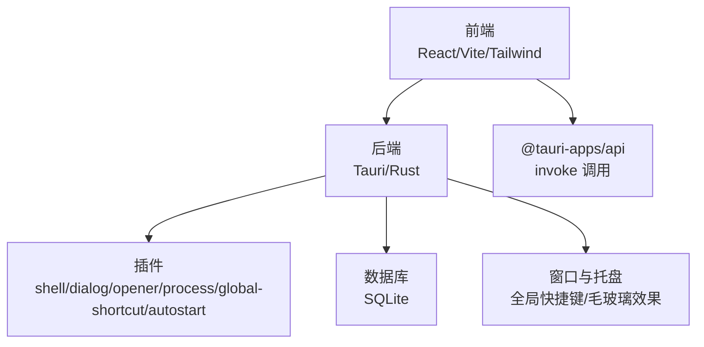
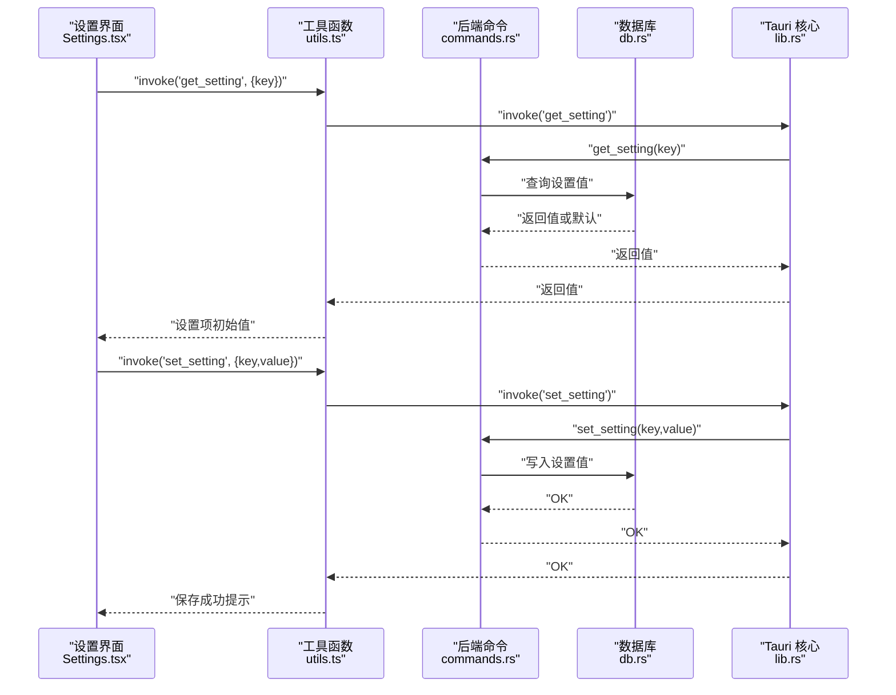
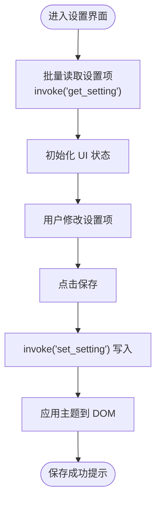
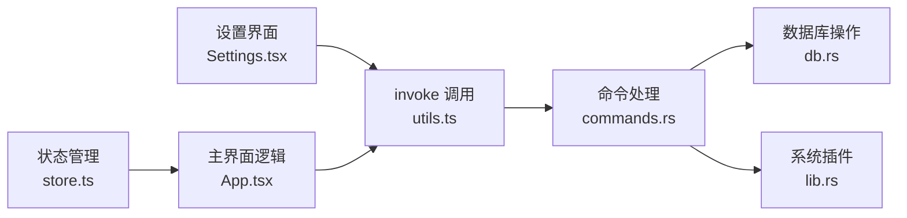

# 配置指南

<cite>
**本文引用的文件**
- [tauri.conf.json](file://src-tauri/tauri.conf.json)
- [Cargo.toml](file://src-tauri/Cargo.toml)
- [package.json](file://package.json)
- [vite.config.ts](file://vite.config.ts)
- [tailwind.config.js](file://tailwind.config.js)
- [Settings.tsx](file://src/Settings.tsx)
- [App.tsx](file://src/App.tsx)
- [lib.rs](file://src-tauri/src/lib.rs)
- [commands.rs](file://src-tauri/src/commands.rs)
- [db.rs](file://src-tauri/src/db.rs)
- [utils.ts](file://src/lib/utils.ts)
- [store.ts](file://src/store.ts)
</cite>

## 目录
1. [简介](#简介)
2. [项目结构](#项目结构)
3. [核心组件](#核心组件)
4. [架构总览](#架构总览)
5. [详细组件分析](#详细组件分析)
6. [依赖关系分析](#依赖关系分析)
7. [性能考虑](#性能考虑)
8. [故障排除指南](#故障排除指南)
9. [结论](#结论)
10. [附录](#附录)

## 简介
本指南面向希望深度定制 QuickStart 应用行为与外观的用户与开发者。内容涵盖应用设置界面、配置文件结构、环境变量与运行参数、安全配置、性能调优、日志与调试选项，并提供配置模板、最佳实践与故障排除建议。通过本指南，您可以根据自身需求调整外观主题、启动行为、自动分类策略、AI 集成方式以及窗口行为等。

## 项目结构
QuickStart 采用前端（React + Vite）与后端（Tauri + Rust）分离的架构：
- 前端位于 src 目录，包含设置界面、主应用逻辑、状态管理与工具函数。
- 后端位于 src-tauri 目录，包含 Tauri 应用入口、插件注册、命令处理、数据库与系统集成。
- 构建与开发脚本由 package.json 管理；Vite 提供开发服务器与热重载；Tailwind CSS 提供样式基础。

图表来源
- [lib.rs:22-134](file://src-tauri/src/lib.rs#L22-L134)
- [package.json:6-12](file://package.json#L6-L12)
- [vite.config.ts:7-31](file://vite.config.ts#L7-L31)
- [tailwind.config.js:1-86](file://tailwind.config.js#L1-L86)

章节来源
- [package.json:1-50](file://package.json#L1-L50)
- [vite.config.ts:1-32](file://vite.config.ts#L1-L32)
- [tailwind.config.js:1-86](file://tailwind.config.js#L1-L86)

## 核心组件
本节概述与配置相关的关键组件及其职责：
- 设置界面（Settings.tsx）：提供主题、开机自启、自动分类、AI 配置等设置项的 UI 与交互。
- 应用主界面（App.tsx）：负责窗口行为、搜索与计算、图标加载、拖拽分类、语音输入等。
- 后端命令（commands.rs）：封装数据库读写、系统调用、AI 服务交互等能力。
- 数据库（db.rs）：提供设置项持久化、应用与文件夹信息存储等。
- Tauri 配置（tauri.conf.json）：定义产品信息、构建流程、打包策略、窗口属性与安全策略。
- 插件与依赖（Cargo.toml）：声明 Tauri 及其插件、网络请求、数据库、窗口特效等依赖。

章节来源
- [Settings.tsx:1-165](file://src/Settings.tsx#L1-L165)
- [App.tsx:274-800](file://src/App.tsx#L274-L800)
- [lib.rs:22-134](file://src-tauri/src/lib.rs#L22-L134)
- [commands.rs:399-410](file://src-tauri/src/commands.rs#L399-L410)
- [db.rs:136-150](file://src-tauri/src/db.rs#L136-L150)
- [tauri.conf.json:1-54](file://src-tauri/tauri.conf.json#L1-L54)
- [Cargo.toml:15-36](file://src-tauri/Cargo.toml#L15-L36)

## 架构总览
下图展示设置项从 UI 到后端持久化的完整链路，以及与系统功能（托盘、全局快捷键、窗口特效）的集成。

图表来源
- [Settings.tsx:19-60](file://src/Settings.tsx#L19-L60)
- [utils.ts:11-17](file://src/lib/utils.ts#L11-L17)
- [lib.rs:96-131](file://src-tauri/src/lib.rs#L96-L131)
- [commands.rs:399-410](file://src-tauri/src/commands.rs#L399-L410)
- [db.rs:136-150](file://src-tauri/src/db.rs#L136-L150)

## 详细组件分析

### 设置界面与配置项
设置界面提供以下可配置项：
- 外观：系统/浅色/深色主题切换，即时生效。
- 快捷键：呼出/隐藏窗口的全局快捷键（Alt + Space）。
- 启动：开机自启开关，需重启应用生效。
- 分类：自动分类开关，扫描后自动归类应用。
- AI 配置：提供商（OpenAI、Claude、Ollama、自定义）、API Key、Base URL、模型名。

默认值与行为：
- 默认主题为“系统”，跟随操作系统深浅色偏好。
- 开机自启与自动分类默认开启。
- AI 提供商默认 OpenAI，模型默认 gpt-4o-mini。
- Ollama 模式下提供本地推理的默认提示信息。

章节来源
- [Settings.tsx:7-16](file://src/Settings.tsx#L7-L16)
- [Settings.tsx:29-60](file://src/Settings.tsx#L29-L60)
- [Settings.tsx:114-152](file://src/Settings.tsx#L114-L152)

### 设置项持久化与读取流程
设置项通过 invoke 调用后端命令进行读取与写入：
- 读取：get_setting(key) 返回字符串值，若不存在则回退到默认值。
- 写入：set_setting(key, value) 将值写入数据库。
- 主题应用：保存后根据选择应用到 documentElement.classList。

图表来源
- [Settings.tsx:19-60](file://src/Settings.tsx#L19-L60)
- [commands.rs:399-410](file://src-tauri/src/commands.rs#L399-L410)
- [db.rs:136-150](file://src-tauri/src/db.rs#L136-L150)

章节来源
- [Settings.tsx:14-60](file://src/Settings.tsx#L14-L60)
- [utils.ts:11-17](file://src/lib/utils.ts#L11-L17)

### 窗口与托盘行为
- 全局快捷键：Alt + Space 切换窗口显示并定位至左下角。
- 自动启动：带 --autostart 参数启动时隐藏窗口；否则显示并应用毛玻璃效果。
- 系统托盘：创建托盘图标，便于快速控制应用。

章节来源
- [lib.rs:30-92](file://src-tauri/src/lib.rs#L30-L92)
- [App.tsx:644-656](file://src/App.tsx#L644-L656)

### 安全配置
- 内容安全策略（CSP）限制了脚本、样式、图片、连接与字体来源，提升安全性。
- 资源协议启用 asset:，限定作用域为应用数据与资源目录，防止越权访问。

章节来源
- [tauri.conf.json:41-50](file://src-tauri/tauri.conf.json#L41-L50)

### 性能与资源优化
- 图标缓存：对已加载图标进行缓存，避免重复提取与网络请求。
- 图标加载策略：仅对当前可见应用加载图标，串行加载以避免阻塞。
- 搜索与文件结果：输入长度小于 2 时不触发文件搜索，减少无效请求。
- 计算器：对纯数学表达式进行即时计算，避免不必要的后端调用。

章节来源
- [App.tsx:667-696](file://src/App.tsx#L667-L696)
- [App.tsx:412-424](file://src/App.tsx#L412-L424)
- [App.tsx:499-503](file://src/App.tsx#L499-L503)

### 日志与调试
- 控制台输出：前端在设置读取/保存失败时打印警告信息。
- 后端错误：数据库初始化失败会输出错误信息。
- 更新检查：在启动时检查更新并在有新版本时提示。

章节来源
- [Settings.tsx:23-24](file://src/Settings.tsx#L23-L24)
- [Settings.tsx:46-47](file://src/Settings.tsx#L46-L47)
- [lib.rs:48-50](file://src-tauri/src/lib.rs#L48-L50)
- [App.tsx:356-360](file://src/App.tsx#L356-L360)

## 依赖关系分析
前端与后端通过 Tauri 的 invoke 机制通信，后端命令统一注册在 lib.rs 中，数据库操作封装在 db.rs，设置项持久化通过 get_setting/set_setting 实现。

图表来源
- [Settings.tsx:1-165](file://src/Settings.tsx#L1-L165)
- [utils.ts:11-17](file://src/lib/utils.ts#L11-L17)
- [lib.rs:96-131](file://src-tauri/src/lib.rs#L96-L131)
- [commands.rs:399-410](file://src-tauri/src/commands.rs#L399-L410)
- [db.rs:136-150](file://src-tauri/src/db.rs#L136-L150)
- [App.tsx:274-800](file://src/App.tsx#L274-L800)
- [store.ts:1-46](file://src/store.ts#L1-L46)

章节来源
- [lib.rs:22-134](file://src-tauri/src/lib.rs#L22-L134)
- [commands.rs:399-410](file://src-tauri/src/commands.rs#L399-L410)
- [db.rs:136-150](file://src-tauri/src/db.rs#L136-L150)

## 性能考虑
- 图标加载：仅对当前可见应用加载图标，避免一次性加载过多图标导致卡顿。
- 搜索延迟：文件搜索设置防抖延迟，降低频繁请求带来的开销。
- 计算器：对简单数学表达式进行本地计算，减少网络请求。
- 窗口特效：在 Windows 上优先使用 Mica，降级到 Acrylic，兼顾美观与性能。

章节来源
- [App.tsx:667-696](file://src/App.tsx#L667-L696)
- [App.tsx:412-424](file://src/App.tsx#L412-L424)
- [App.tsx:499-503](file://src/App.tsx#L499-L503)
- [lib.rs:81-92](file://src-tauri/src/lib.rs#L81-L92)

## 故障排除指南
常见问题与解决步骤：
- 设置项未保存或未生效
  - 检查 invoke('set_setting') 是否抛出异常。
  - 确认主题切换后已应用到 documentElement.classList。
  - 若为开机自启或快捷键，需重启应用以生效。
- 图标加载失败
  - 检查图标缓存是否命中失败标记，避免重复尝试。
  - 确认应用路径有效且可访问。
- 数据库初始化失败
  - 查看后端输出的错误信息，确认数据库文件权限与路径正确。
- 文件搜索无结果
  - 确认输入长度至少为 2。
  - 检查后端 search_files 命令是否正常执行。
- 更新检查失败
  - 确认网络可达，忽略特定错误提示。

章节来源
- [Settings.tsx:23-24](file://src/Settings.tsx#L23-L24)
- [Settings.tsx:46-47](file://src/Settings.tsx#L46-L47)
- [App.tsx:667-696](file://src/App.tsx#L667-L696)
- [lib.rs:48-50](file://src-tauri/src/lib.rs#L48-L50)
- [App.tsx:412-424](file://src/App.tsx#L412-L424)
- [App.tsx:356-360](file://src/App.tsx#L356-L360)

## 结论
通过本配置指南，您可以在不修改源码的前提下，灵活调整 QuickStart 的外观、行为与 AI 集成方式。建议结合自身使用场景，合理设置主题、开机自启与自动分类，并根据网络条件选择合适的 AI 提供商与模型。遇到问题时，可依据故障排除指南逐步定位并解决问题。

## 附录

### 配置文件与运行参数参考
- Tauri 配置（tauri.conf.json）
  - 产品与构建：定义产品名称、版本、构建前后命令与前端打包目录。
  - 打包与图标：配置安装模式与多尺寸图标。
  - 窗口属性：主窗口尺寸、透明度、装饰与可见性。
  - 安全策略：CSP 与资源协议作用域。
- Cargo.toml
  - 依赖：Tauri 核心与插件、网络请求、数据库、窗口特效等。
- package.json
  - 脚本：开发、构建、预览与 Tauri 命令。
- Vite 配置（vite.config.ts）
  - 开发服务器端口、主机与热重载设置。
- Tailwind 配置（tailwind.config.js）
  - 深色模式、动画与颜色系统扩展。

章节来源
- [tauri.conf.json:1-54](file://src-tauri/tauri.conf.json#L1-L54)
- [Cargo.toml:15-36](file://src-tauri/Cargo.toml#L15-L36)
- [package.json:6-12](file://package.json#L6-L12)
- [vite.config.ts:15-30](file://vite.config.ts#L15-L30)
- [tailwind.config.js:1-86](file://tailwind.config.js#L1-L86)

### 环境变量与运行参数
- TAURI_DEV_HOST：用于指定开发时的热重载主机地址。
- --autostart：用于自动启动时隐藏窗口的参数。

章节来源
- [vite.config.ts:5-5](file://vite.config.ts#L5-L5)
- [lib.rs:72-77](file://src-tauri/src/lib.rs#L72-L77)

### 配置模板与最佳实践
- 主题模板
  - 系统：跟随操作系统深浅色偏好。
  - 浅色/深色：固定主题，即时生效。
- AI 配置模板
  - OpenAI/Claude：填写 API Key，选择模型。
  - Ollama：本地推理，无需 API Key，默认模型名。
  - 自定义：填写 Base URL 与 API Key，选择模型。
- 最佳实践
  - 开机自启与快捷键需重启应用生效。
  - 自动分类建议开启，以便新应用自动归类。
  - 图标加载失败时避免频繁重试，利用缓存标记。

章节来源
- [Settings.tsx:77-83](file://src/Settings.tsx#L77-L83)
- [Settings.tsx:118-150](file://src/Settings.tsx#L118-L150)
- [App.tsx:667-696](file://src/App.tsx#L667-L696)