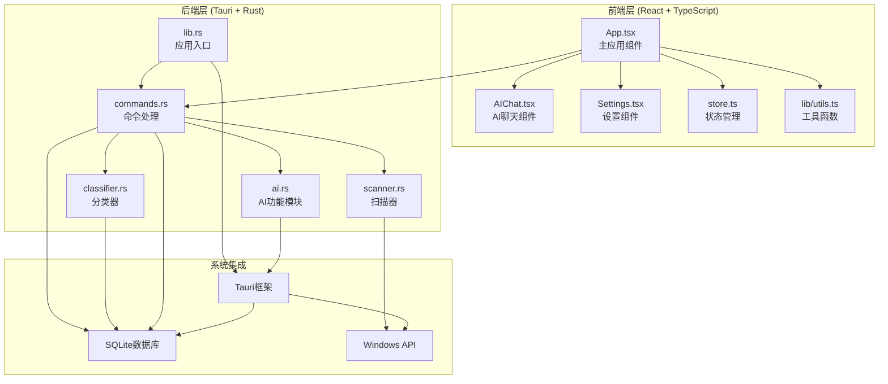
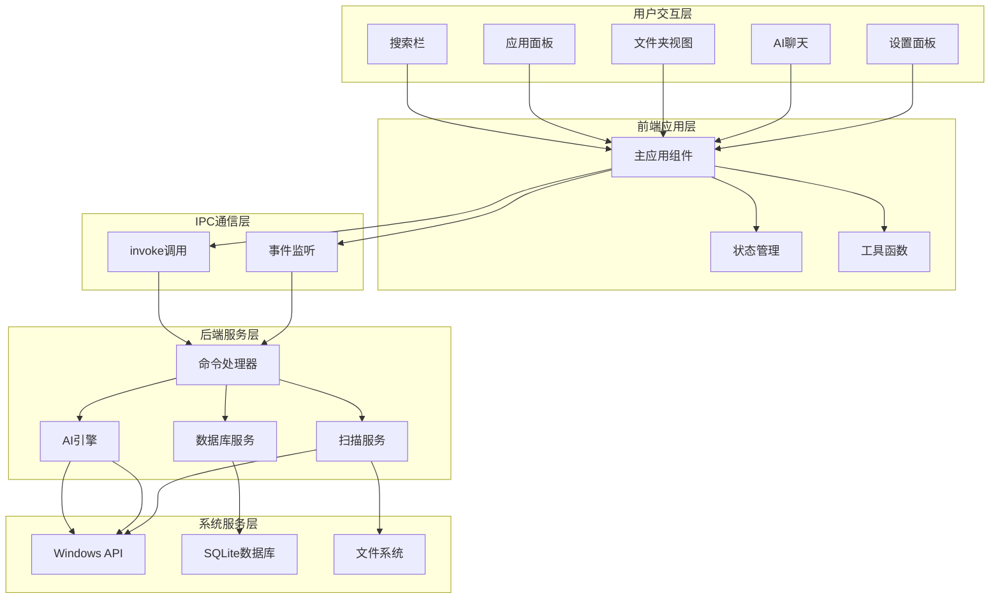
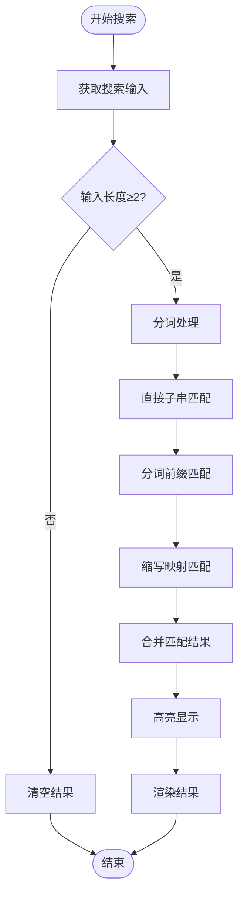
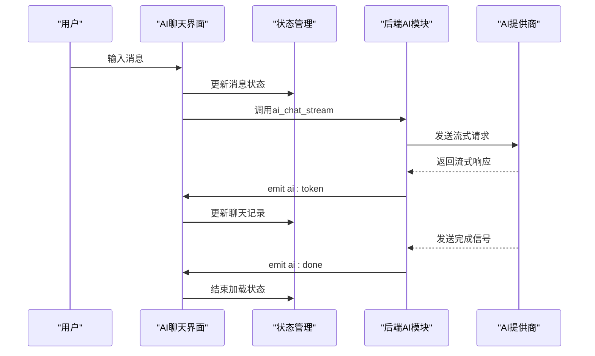
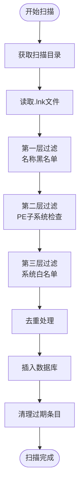
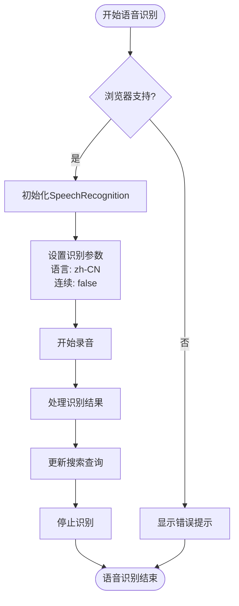
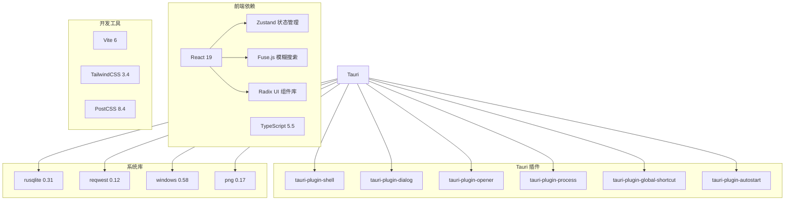

# 项目概述

<cite>
**本文档引用的文件**
- [package.json](file://package.json)
- [Cargo.toml](file://src-tauri/Cargo.toml)
- [tauri.conf.json](file://src-tauri/tauri.conf.json)
- [App.tsx](file://src/App.tsx)
- [main.tsx](file://src/main.tsx)
- [store.ts](file://src/store.ts)
- [lib.rs](file://src-tauri/src/lib.rs)
- [commands.rs](file://src-tauri/src/commands.rs)
- [ai.rs](file://src-tauri/src/ai.rs)
- [classifier.rs](file://src-tauri/src/classifier.rs)
- [scanner.rs](file://src-tauri/src/scanner.rs)
- [AIChat.tsx](file://src/AIChat.tsx)
- [Settings.tsx](file://src/Settings.tsx)
- [utils.ts](file://src/lib/utils.ts)
- [AGENTS.md](file://AGENTS.md)
- [index.html](file://index.html)
</cite>

## 目录
1. [项目简介](#项目简介)
2. [项目结构](#项目结构)
3. [核心组件](#核心组件)
4. [架构总览](#架构总览)
5. [详细组件分析](#详细组件分析)
6. [依赖关系分析](#依赖关系分析)
7. [性能考量](#性能考量)
8. [故障排查指南](#故障排查指南)
9. [结论](#结论)

## 项目简介

QuickStart 是一个基于 Tauri v2 + React + TypeScript 构建的 Windows 桌面快捷启动器。它旨在为用户提供高效、智能的应用启动体验，支持智能应用分类、全文搜索、语音输入、AI 辅助等功能。项目采用轻量级设计，结合 Rust 的高性能与 React 的现代化前端开发体验，实现跨平台桌面应用的最佳实践。

### 项目愿景
- 提供极致简洁的启动器界面，减少系统干扰
- 通过智能分类与搜索提升应用发现效率
- 以 AI 为辅助，实现自动化文件整理与应用管理
- 保持低资源占用与快速响应

### 设计理念
- **极简至上**：透明背景、毛玻璃效果、无边框设计
- **智能驱动**：自动扫描、AI 分类、语音交互
- **隐私优先**：本地化处理，数据存储于用户目录
- **可扩展性**：模块化架构，易于添加新功能

### 目标用户群体
- 需要快速启动应用的开发者与技术用户
- 追求高效工作流的办公用户
- 希望通过 AI 整理文件的个人用户
- 注重界面美观与性能体验的桌面应用用户

## 项目结构

项目采用前后端分离的架构设计，前端使用 React + TypeScript，后端使用 Rust + Tauri，通过 IPC 通信实现功能集成。

**图表来源**
- [App.tsx:1-1299](file://src/App.tsx#L1-L1299)
- [lib.rs:1-135](file://src-tauri/src/lib.rs#L1-L135)
- [commands.rs:1-709](file://src-tauri/src/commands.rs#L1-L709)

**章节来源**
- [package.json:1-50](file://package.json#L1-L50)
- [Cargo.toml:1-36](file://src-tauri/Cargo.toml#L1-L36)
- [tauri.conf.json:1-54](file://src-tauri/tauri.conf.json#L1-L54)

## 核心组件

### 前端核心组件

#### 主应用组件 (App.tsx)
- **职责**：应用的主要界面容器，负责状态管理、事件处理、UI 渲染
- **核心功能**：
  - 应用卡片展示与交互
  - 智能搜索与模糊匹配
  - 语音输入与实时识别
  - 文件夹管理与分类
  - 计算器功能集成
  - 设置面板与 AI 聊天

#### 状态管理 (store.ts)
- **职责**：集中管理应用状态，包括搜索查询、应用列表、窗口可见性等
- **状态类型**：
  - 搜索查询字符串
  - 应用列表数据
  - 窗口显示状态
  - 语音识别状态

#### AI 聊天组件 (AIChat.tsx)
- **职责**：提供 AI 对话能力，支持多提供商集成
- **功能特性**：
  - OpenAI、Claude、Ollama 多提供商支持
  - 流式响应处理
  - 语音输入集成
  - 文件整理辅助

#### 设置组件 (Settings.tsx)
- **职责**：管理应用配置，包括外观、快捷键、AI 设置等
- **配置项**：
  - 主题设置（系统/浅色/深色）
  - 开机自启动
  - 自动分类开关
  - AI 提供商与 API 配置

### 后端核心组件

#### 应用入口 (lib.rs)
- **职责**：Tauri 应用初始化，插件注册，窗口管理
- **核心功能**：
  - 全局快捷键注册 (Alt+Space)
  - 托盘图标创建
  - 数据库连接管理
  - 窗口位置与样式设置

#### 命令处理 (commands.rs)
- **职责**：提供前端调用的后端命令接口
- **命令分类**：
  - 应用管理：增删改查、分类管理
  - 文件夹管理：增删改查、分类管理
  - 搜索功能：应用搜索、文件搜索
  - 系统集成：启动应用、打开文件
  - 设置管理：配置读写

#### AI 功能模块 (ai.rs)
- **职责**：实现 AI 对话、文件整理、应用分类等 AI 相关功能
- **核心能力**：
  - 多提供商流式对话
  - 目录列表与文件整理
  - 应用自动分类
  - 安全路径验证

#### 分类器 (classifier.rs)
- **职责**：基于关键词规则的智能分类
- **分类规则**：
  - 开发工具：IDE、编辑器、终端、Git、Docker
  - 办公软件：Office、PDF、协作工具
  - 浏览器：Chrome、Edge、Firefox
  - 娱乐媒体：Steam、音乐、视频
  - 设计创意：Photoshop、Figma、Blender
  - 通讯社交：微信、QQ、Discord
  - 系统工具：360、CCleaner、Everything

#### 扫描器 (scanner.rs)
- **职责**：扫描系统快捷方式并提取应用信息
- **扫描策略**：
  - 三层过滤：PE 检查 → 系统白名单 → 名称黑名单
  - 支持开始菜单与桌面扫描
  - 图标提取与缓存
  - 智能去重与更新

**章节来源**
- [App.tsx:274-1299](file://src/App.tsx#L274-L1299)
- [store.ts:1-46](file://src/store.ts#L1-L46)
- [AIChat.tsx:1-278](file://src/AIChat.tsx#L1-L278)
- [Settings.tsx:1-165](file://src/Settings.tsx#L1-L165)
- [lib.rs:22-135](file://src-tauri/src/lib.rs#L22-L135)
- [commands.rs:31-709](file://src-tauri/src/commands.rs#L31-L709)
- [ai.rs:60-501](file://src-tauri/src/ai.rs#L60-L501)
- [classifier.rs:6-116](file://src-tauri/src/classifier.rs#L6-L116)
- [scanner.rs:96-483](file://src-tauri/src/scanner.rs#L96-L483)

## 架构总览

QuickStart 采用分层架构设计，实现了前后端的清晰分离与高效的 IPC 通信。

**图表来源**
- [App.tsx:1-1299](file://src/App.tsx#L1-L1299)
- [lib.rs:96-135](file://src-tauri/src/lib.rs#L96-L135)
- [commands.rs:1-709](file://src-tauri/src/commands.rs#L1-L709)

### 技术栈选择理由

#### Tauri v2
- **性能优势**：相比 Electron 更轻量，内存占用更低
- **安全性**：原生 API 调用，更好的安全隔离
- **跨平台**：一次编写，多平台部署
- **生态成熟**：丰富的插件生态系统

#### React + TypeScript
- **开发效率**：组件化开发，类型安全
- **生态丰富**：完善的第三方库支持
- **团队友好**：广泛的技术栈，便于维护

#### Rust 后端
- **性能保证**：零成本抽象，高性能执行
- **内存安全**：无垃圾回收，内存安全
- **系统级编程**：直接访问系统 API

## 详细组件分析

### 智能搜索系统

QuickStart 的搜索系统采用了多层次的匹配算法，提供了高效的模糊搜索体验。

**图表来源**
- [App.tsx:436-482](file://src/App.tsx#L436-L482)
- [App.tsx:72-130](file://src/App.tsx#L72-L130)

#### 搜索算法特点
- **分词匹配**：支持驼峰命名、连字符、点号等多种分隔符
- **缩写识别**：内置常见缩写映射，如 VSCode、PowerShell 等
- **多字段匹配**：同时匹配应用名称、路径、分类信息
- **实时反馈**：200ms 延迟优化，提供流畅的搜索体验

**章节来源**
- [App.tsx:21-30](file://src/App.tsx#L21-L30)
- [App.tsx:33-47](file://src/App.tsx#L33-L47)
- [App.tsx:436-482](file://src/App.tsx#L436-L482)

### AI 辅助功能

AI 功能是 QuickStart 的核心特色之一，提供了多维度的智能化服务。

**图表来源**
- [AIChat.tsx:83-159](file://src/AIChat.tsx#L83-L159)
- [ai.rs:60-254](file://src-tauri/src/ai.rs#L60-L254)

#### AI 功能特性
- **多提供商支持**：OpenAI、Claude、Ollama、自定义 API
- **流式响应**：实时显示 AI 输出，提升交互体验
- **安全控制**：严格的路径验证，防止文件系统风险
- **工具调用**：支持目录列举、文件整理等系统操作

**章节来源**
- [AIChat.tsx:14-60](file://src/AIChat.tsx#L14-L60)
- [ai.rs:60-254](file://src-tauri/src/ai.rs#L60-L254)

### 应用扫描与分类

应用扫描系统通过多层过滤机制，确保只收录真正可用的应用程序。

**图表来源**
- [scanner.rs:185-228](file://src-tauri/src/scanner.rs#L185-L228)
- [scanner.rs:96-153](file://src-tauri/src/scanner.rs#L96-L153)

#### 过滤机制详解
- **名称黑名单**：排除卸载程序、帮助文档、配置工具等
- **PE 子系统检查**：只保留 GUI 应用，排除控制台程序
- **系统白名单**：严格限制系统目录中的应用数量
- **智能去重**：桌面应用优先于开始菜单应用

**章节来源**
- [scanner.rs:96-153](file://src-tauri/src/scanner.rs#L96-L153)
- [scanner.rs:185-228](file://src-tauri/src/scanner.rs#L185-L228)

### 语音输入系统

语音输入功能提供了便捷的语音交互体验，支持中文识别。

**图表来源**
- [App.tsx:249-261](file://src/App.tsx#L249-L261)
- [AIChat.tsx:169-189](file://src/AIChat.tsx#L169-L189)

#### 语音功能特点
- **实时识别**：无中间结果，直接显示最终识别文本
- **错误处理**：完善的异常捕获与降级处理
- **状态管理**：与应用状态完全集成
- **AI 集成**：支持在 AI 聊天中使用语音输入

**章节来源**
- [App.tsx:249-261](file://src/App.tsx#L249-L261)
- [AIChat.tsx:169-189](file://src/AIChat.tsx#L169-L189)

## 依赖关系分析

项目采用模块化的依赖管理，各组件间耦合度低，便于维护和扩展。

**图表来源**
- [package.json:14-42](file://package.json#L14-L42)
- [Cargo.toml:15-36](file://src-tauri/Cargo.toml#L15-L36)

### 关键依赖说明

#### 前端核心依赖
- **React 19**：提供组件化开发框架
- **TypeScript 5.5**：静态类型检查，提升代码质量
- **Zustand**：轻量级状态管理，替代 Redux
- **Fuse.js**：实现高性能的模糊搜索算法

#### Tauri 生态依赖
- **shell/dialog/opener/process**：系统级功能集成
- **global-shortcut/autostart**：系统级快捷键与开机启动
- **rusqlite**：高性能 SQLite 集成
- **windows**：Windows 平台 API 访问

**章节来源**
- [package.json:14-42](file://package.json#L14-L42)
- [Cargo.toml:15-36](file://src-tauri/Cargo.toml#L15-L36)

## 性能考量

### 前端性能优化

QuickStart 在前端层面采用了多项性能优化策略：

#### 图标加载优化
- **按需加载**：仅加载当前可见应用的图标
- **缓存机制**：图标提取结果缓存到文件系统
- **失败处理**：图标提取失败标记，避免重复尝试

#### 搜索性能优化
- **防抖处理**：200ms 延迟优化，减少频繁计算
- **分词预处理**：提前进行分词处理，提高匹配效率
- **实时高亮**：仅对匹配结果进行高亮显示

#### 状态管理优化
- **状态分离**：将不同类型的用户数据分离存储
- **选择器优化**：使用 useMemo 优化复杂计算结果
- **批量更新**：避免不必要的状态更新

### 后端性能优化

#### 数据库优化
- **连接池管理**：共享数据库连接，减少连接开销
- **索引优化**：合理使用索引提升查询性能
- **事务处理**：批量操作使用事务，保证一致性

#### AI 处理优化
- **流式处理**：AI 响应采用流式处理，实时显示
- **并发控制**：合理控制并发请求数量
- **缓存策略**：对常用结果进行缓存

## 故障排查指南

### 常见问题诊断

#### 应用无法启动
1. **检查系统要求**：确保 Windows 系统版本满足要求
2. **查看日志文件**：检查应用日志获取错误详情
3. **权限问题**：确认应用具有必要的系统权限

#### 搜索功能异常
1. **重新扫描**：执行应用扫描重新索引
2. **检查输入**：确认搜索关键词格式正确
3. **网络连接**：AI 功能需要稳定的网络连接

#### AI 功能问题
1. **API 配置**：检查 AI 提供商配置是否正确
2. **网络代理**：确认代理设置不影响 API 访问
3. **模型选择**：选择合适的 AI 模型

#### 图标显示问题
1. **权限检查**：确认应用可以访问图标缓存目录
2. **磁盘空间**：检查磁盘空间是否充足
3. **文件损坏**：删除损坏的图标文件重新生成

**章节来源**
- [commands.rs:230-249](file://src-tauri/src/commands.rs#L230-L249)
- [ai.rs:38-49](file://src-tauri/src/ai.rs#L38-L49)

## 结论

QuickStart 是一个设计精良的 Windows 桌面启动器项目，通过合理的架构设计和技术选型，实现了高性能、易用性和可扩展性的平衡。项目的核心优势包括：

### 技术优势
- **架构清晰**：前后端分离，职责明确
- **性能优秀**：Tauri + Rust 提供卓越性能
- **功能丰富**：涵盖现代启动器的主流需求
- **扩展性强**：模块化设计便于功能扩展

### 设计优势
- **用户体验**：简洁直观的界面设计
- **智能程度**：AI 辅助的智能化功能
- **隐私保护**：本地化处理，数据安全
- **跨平台**：基于 Tauri 的多平台支持

### 发展前景
QuickStart 项目展现了优秀的工程实践和设计理念，为桌面应用开发提供了良好的参考范例。随着功能的不断完善和社区的参与，该项目有望成为 Windows 桌面启动器领域的优秀解决方案。